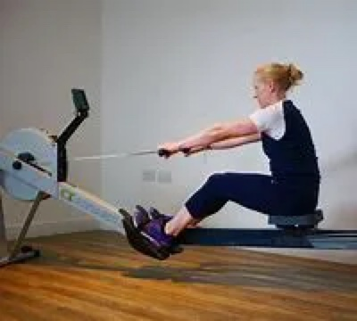
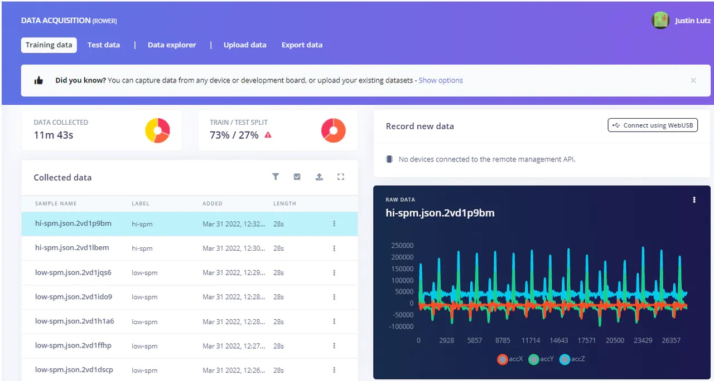
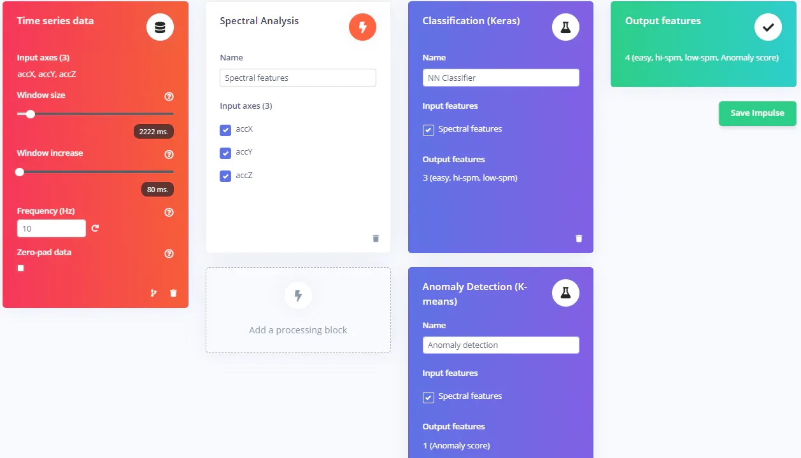
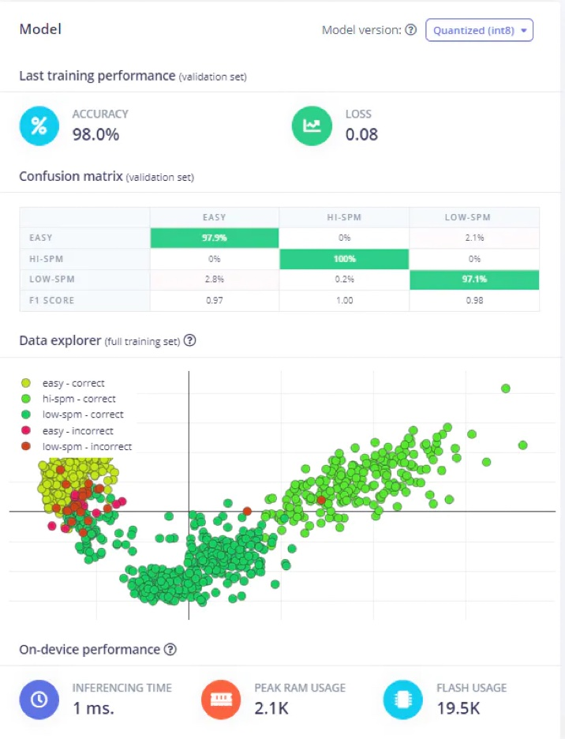
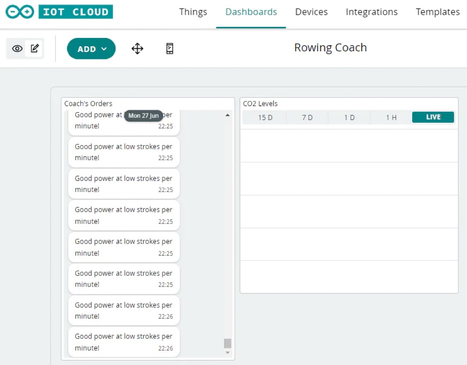
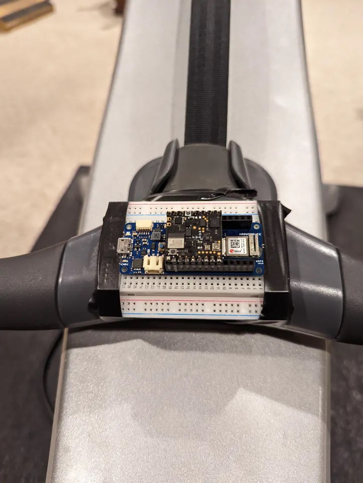
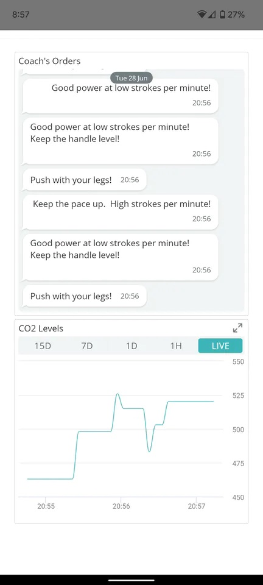

# Arduin-Row, a TinyML Rowing Machine Coach

Created By: Justin Lutz

Public Project Link: [https://studio.edgeimpulse.com/public/90788/latest](https://studio.edgeimpulse.com/public/90788/latest)

## Project Demo



## GitHub Repo

[https://github.com/jlutzwpi/Arduin-Row/tree/main](https://github.com/jlutzwpi/Arduin-Row/tree/main)

## Story

The sport of rowing, even on a rowing machine, is a technical one. Most people can hop on a rowing machine and start rowing, but may not be generating the most power possible. Many think that rowing involves **pulling** the handle with your hands, arms, and back, but in order to generate the most power you actually have to **push** with your legs. That is where you can generate the fastest times on the rowing machine.



Image source: [British Rowing Technique - British Rowing](https://www.britishrowing.org/indoor-rowing/go-row-indoor/how-to-indoor-row/british-rowing-technique/)

However, in order to know if you are doing it correctly, many times it requires a one on one session with a coach so they can evaluate your form and provide suggestions.

Using the power of accelerometer data on an Arduino board and Edge Impulse, I was able to make a virtual "Rowing Coach" that, based on the rower's tempo (and acceleration from the start of the stroke), can offer feedback. It can also offer feedback based on how the rowing handle moves through the stroke. This is to ensure the rower is keeping the handle level, and isn't raising or lowering the handle too much during the stroke, which can waste energy and reduce power. This feedback is offered through a chat-based feature of the Arduino IoT Remote app. Given that I am also using the Nicla Sense ME board, I am also reading and plotting estimated CO2 values (eCO2) to show how the CO2 values in the air change while you work out.

This project went through multiple variations (more to come on that later), but I ultimately settled on using the Nicla Sense ME as a shield on the Arduino MKR Wifi 1010. The Nicla Sense only comes with BLE, so using it as a shield allowed me to access the Wifi of the MKR board as well as the Arduino IoT Remote dashboard, which offers a quick, easy, and slick app to link to the board. In order to turn the Nicla Sense into a shield, some soldering is involved. Arduino has a good tutorial on it [here](https://docs.arduino.cc/tutorials/nicla-sense-me/use-as-mkr-shield).

I used [Edge Impulse](https://www.edgeimpulse.com/) to generate my TinyML model to predict the type of rowing I was doing as well as anomaly detection to determine if the rowing handle placement was correct.

Using a quick Arduino sketch loaded onto the Nicla Sense ME, I used the Edge Impulse command-line editor to read the accelerometer data directly into Edge Impulse project following their [Data Forwarder example](https://docs.edgeimpulse.com/docs/edge-impulse-cli/cli-data-forwarder). The sketch below is how I read the accelerometer data into Edge Impulse from the Nicla.

```
/*
  Edge Impulse Data Forwarder - Nicla Sense ME data.
*/
#include "Arduino_BHY2.h"
#include "Nicla_System.h"

#define CONVERT_G_TO_MS2    9.80665f
#define FREQUENCY_HZ        100
#define INTERVAL_MS         (1000 / (FREQUENCY_HZ + 1))
static unsigned long last_interval_ms = 0;

SensorXYZ accelerometerRaw(SENSOR_ID_ACC_RAW);

void setup() {
  Serial.begin(115200);

  BHY2.begin();
  accelerometerRaw.begin();

  delay(2000);
}

void loop() {
  short accX, accY, accZ;
  
  BHY2.update();

  if (millis() > last_interval_ms + INTERVAL_MS) {
    last_interval_ms = millis();
        
    accX = accelerometerRaw.x();
    accY = accelerometerRaw.y();
    accZ = accelerometerRaw.z();

      
      Serial.print(accX * CONVERT_G_TO_MS2);
      Serial.print('\t');
      Serial.print(accY * CONVERT_G_TO_MS2);
      Serial.print('\t');
      Serial.println(accZ * CONVERT_G_TO_MS2);

  }
}
```

So, a quick word of caution here: I started this project intending to just use the Nicla Sense ME and develop a BLE app using MIT App Inventor. However, I found out with the 64 kB RAM limitation, that I was running out of memory running my 20 kB model on the Nicla Sense ME (I believe this is due to additional packages being loaded into RAM on the Nicla reducing the available memory). Using the Nicla Sense ME as a shield on the MKR Wifi 1010, I was able to run my model without memory issues. BUUUT, when used as a shield, the accelerometer frequency maxes out at 10 Hz (it took me a while to figure this out), so I had to downsample all of the data that I collected just using Nicla Sense ME from 100 Hz to 10 Hz (and also ensure that the orientation of the Nicla remained the same). This was frankly a nightmare that took me a while to figure out.

I collected about 18 minutes of data for 3 states: easy, low strokes per minute (spm), and high-spm divided between training and test data:



Once the data was collected, I set up my impulse:



I downsampled the collected data to 10 Hz to match the output of the Nicla Sense ME as a shield. I kept the window around 2000 ms and didn't change the window step size. On the Spectral Features tab, I changed the Scale Axes to 0.001 as I seemed to get better results with that (it was also recommended on a prior project by the Edge Impulse team).

Next, it was on to training the model:



With the data that I had, there was pretty good clustering between the classes. Once that I had the model trained, I went to the Anomaly Detection tab and selected the X-axis to determine if the rowing handle is remaining level throughout the stroke.

After that I deployed the model to an Arduino library. You can find my public project [here](https://studio.edgeimpulse.com/public/90788/latest) if you want to look at the data.

I then added the zipped Arduino library to my application code in the Arduino IDE by going to Sketch > Include LIbrary > Add .ZIP Library...

I started my application sketch from the Arduino Web Editor since I would be linking my project to the Arduino IoT Remote app. However, since the IAQ and eCO2 values won't be read correctly unless you make some changes to the Nicla library (I've documented that [here](https://create.arduino.cc/projecthub/justinelutz/arduino-nicla-air-quality-app-48fda3)), I had to export from the web editor to my local Arduino IDE so I could use the edited Arduino\_BHY2Host library.

That being said, I really like the ease of use of the IOT cloud interface. I defined a couple variables: air\_quality and inference and the default sketch is auto-populated. In the Dashboards tab of the IOT cloud, I created a chat-like interface that I called "Coach's Orders". This gives you the feedback based on what your rowing stroke indicates. I also created a graph that shows the CO2 levels being read from the Nicla. The reason for that data is to show how working out affects the CO2 levels in the room. If you are working hard in a confined space and the CO2 levels rise to a dangerous level, you might want to get some ventilation or take a break.



Once I had the Dashboard set up and the variables defined, it was really just a matter of adding in the Edge Impulse inference logic to my Arduino sketch. Here is the main loop; the full code base can be seen in the code section.

```
void loop() {
  ArduinoCloud.update();
   
  BHY2Host.update();
  
  if (millis() > last_interval_ms + INTERVAL_MS) {
    last_interval_ms = millis();

    //get CO2 readings (air quality)
    air_quality = bsec.co2_eq();
    Serial.println(String("CO2 reading: ") + String(air_quality));

    //get accel data
    short accX,accY,accZ;
    accX = accel.x();
    accY = accel.y();
    accZ = accel.z();
    
    // fill the features buffer
    features[feature_ix++] = accX * CONVERT_G_TO_MS2;
    features[feature_ix++] = accY * CONVERT_G_TO_MS2;
    features[feature_ix++] = accZ * CONVERT_G_TO_MS2;

    // features buffer full? then classify!
    if (feature_ix == EI_CLASSIFIER_DSP_INPUT_FRAME_SIZE) {
      ei_impulse_result_t result;

      // create signal from features frame
      signal_t signal;
      numpy::signal_from_buffer(features, EI_CLASSIFIER_DSP_INPUT_FRAME_SIZE, &signal);

      // run classifier
      EI_IMPULSE_ERROR res = run_classifier(&signal, &result, false);
      ei_printf("run_classifier returned: %d\n", res);
      if (res != 0){
        feature_ix = 0;
        return;
      }

      // print predictions
      ei_printf("(DSP: %d ms., Classification: %d ms., Anomaly: %d ms.)",
        result.timing.dsp, result.timing.classification, result.timing.anomaly);
      //store the location of the highest classified label
      int maxLabel = 0;
      float maxValue = 0.0;
      for (size_t ix = 0; ix < EI_CLASSIFIER_LABEL_COUNT; ix++) {
        if(result.classification[ix].value > maxValue) {
          maxLabel = ix;
          maxValue = result.classification[ix].value;
        }
      }
      ei_printf("%.2f\n", result.anomaly);
      String inf = String(result.classification[maxLabel].label);
      if(inf == "easy") {
        inference = "Push with your legs!";
        Serial.println("Push with your legs!");
      }
      else if(inf == "low-spm") {
        inference = "Good power at low strokes per minute!";
        Serial.println("Good power at low strokes per minute!");
      }
      else if(inf == "hi-spm") {
        inference = "Keep the pace up.  High strokes per minute!";
        Serial.println("Keep the pace up.  High strokes per minute!");
      }
      
      if(result.anomaly < -1.0 || result.anomaly > 2.0) {
        inference = inference + "  Keep the handle level!";
          Serial.print("Anomaly triggered!");
      }

      // reset features frame
      feature_ix = 0;
    }
  }
}
```

Once the coding was complete, I loaded the sketch with my code on the MKR Wifi 1010. I then put the board into a breadboard and taped it to the rowing handle:



The board can be powered with either through the USB or via the JST connector with a 3.7V LiPO battery. I then hopped on the rowing machine and varied up the paces. This is what I saw on the app:



And a video with an overlay of the app with a little commentary from yours truly is up at the top of this post!

The model inference mapped pretty closely to what I was doing. If I was going light and not putting in much effort, I would get a "Push with your legs!" command. If I started to push harder but keep the tempo low, I would get a "Good power at low strokes per minute!" and if I went all out, it would say "Keep the pace up. High strokes per minute!" If I altered the height of the handle on the pull or on the return, "Keep the handle level!" would be added to the command. You can see that as I picked up the pace the CO2 values rose as well. I would be interested to see what values it reads if I'm rowing for more than just a minute.

This was a good project, and like the others I've done, had hiccups along the road that I had to overcome. I completely pivoted from a Nicla Sense ME / BLE app solution to using the Nicla as a shield on the MKR Wifi 1010 and using the Arduino IOT Cloud app as the final implementation. I spent a lot of hours combing through message boards on why I couldn't run the Edge Impulse model on the Nicla (out of memory) to why my model wasn't working with the Nicla as a shield (when used as a shield, accelerometer frequency drops from 100 Hz to 10 Hz). Hopefully this project helps you avoid some of the traps as fell in to. Happy hacking!
