# Classifying Exercise Activities on a BangleJS Smartwatch

Created By: Thomas Vikström

Public Project Link: [https://studio.edgeimpulse.com/public/544247/latest](https://studio.edgeimpulse.com/public/544247/latest)

## Introduction

This tutorial demonstrates how to use Edge Impulse to classify various exercises or daily activities. This project uses the Bangle.js 2 programmable smartwatch, but any programmable smartwatch with an accelerometer and TensorFlow Lite support can be used if you replicate the Bangle app accordingly.

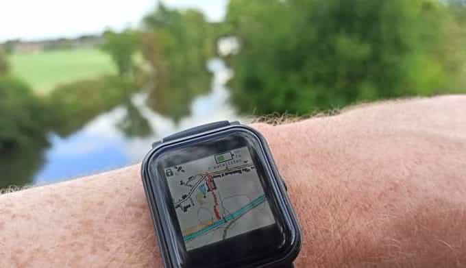

## Use-case explanation

Extensive evidence suggests that lifelong exercise extends health span and delays the onset of [40 chronic conditions and diseases.](https://perspectivesinmedicine.cshlp.org/content/8/7/a029694.short) The health benefits of doing regular exercise have been shown in many studies. For instance, [one study](https://www.kheljournal.com/archives/2016/vol3issue5/PartA/3-4-55-201.pdf) highlights how physical activity reduces stress and anxiety, boosts mood, improves self-confidence, sharpens memory, and strengthens muscles and bones. It also helps in preventing and reducing heart disease, obesity, blood sugar fluctuations, cardiovascular diseases and cancer.

While some of us exercise intuitively without technology, others, like me, find motivation in tracking statistics and trends using devices like smartwatches or smart rings. Any decent smartwatch today uses GPS, accelerometer, gyro meter and other sensors to collect different types of data and consolidates this data into activity summaries. They perform exceptionally well with correctly classifying long repetitive exercises like running and walking outdoors or on a treadmill, skiing, cycling, rowing, etc. Where several of them still have room for improvement though, is correctly classifying the many different activities you might be performing in a gym. I've been a Garmin fan for over 10 years, and is is currently on my fourth Garmin sport watch, but none of them can consistently correctly classify gym activities, even if all of the watches are considered premium sport watches.

Last winter I started working out with my three-decades-old Kettler Sport Variant home gym, and it bothered me that I needed to constantly switch activities on my Garmin watch when I changed from one activity to another, especially  as I like to avoid longer monotonous repetitions. This made me wonder if I come up with my own solution with machine learning. Since I have experience with using Tensorflow Lite on the affordable Bangle.js smartwatch, I thought I could at least try.

The result is an app where you first collect exercise training data for export to Edge Impulse, and after uploading a trained ML-model just click on _Exercise_ to let the watch classify all different exercises you're performing and the length of them. Afterwards you can upload the collected data to e.g. Excel for further analysis or storage.

## Components and Hardware/Software Configuration

### Components Needed

- A programmable smartwatch supporting Tensorflow Lite, in this case I used [Bangle.js 2](https://www.espruino.com/Bangle.js2) which is slightly under €100 (with taxes).
- A computer supporting Bluetooth Low Energy (BLE). More or less any computer manufactured the last decade is equipped with BLE, but there are also BLE-adapters with USB-connector for older computers.
- Depending on the activities you plan to do, you might need shoes for walking/running outdoors, gym equipment, kettle bells etc. If you go to a gym, they probably have all the exercise equipment you need.

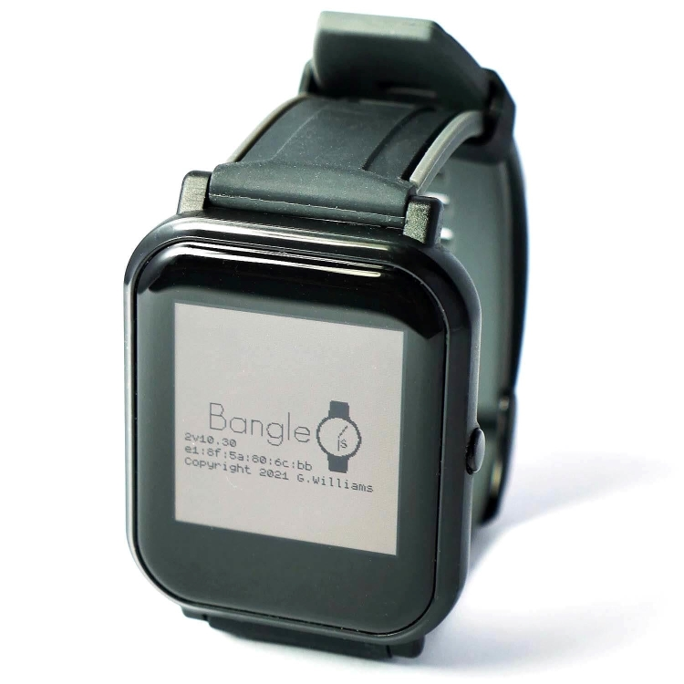

### Hardware and Software Configuration

#### Hardware Configuration

- There's practically nothing to configure hardware wise! Although Bangle isn't in the same premium class as Apple or Samsung watches, the initial experience is quite similar—everything usually works seamlessly out of the box, making it easy to get started. Do read the [Getting Started guide](https://banglejs.com/start2) though.

#### Software Configuration

- By following the [getting started steps](https://www.espruino.com/Bangle.js+Development) you'll learn how to develop apps on the smartwatch.
- For this tutorial, it's enough to open the [Espruino IDE](https://www.espruino.com/ide/), connect to your Bangle according to the instructions found in above guide, and paste [this program](https://github.com/baljo/Bangle_activities/blob/main/src/collect_and_classify_TF_v0.8.js) to the **right** side in the IDE.

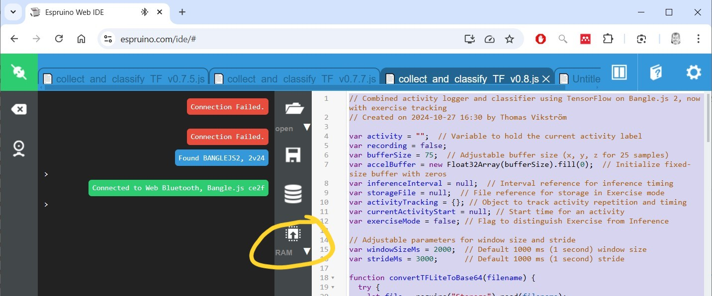

- Click on the `RAM`-button to upload the program to the watch. Bangle has both volatile RAM-memory as well as flash-memory for long-term storage. RAM content disappears after power-down, while content in flash remains. When testing and developing, it is safer to just upload to RAM as possible serious program crashes won't mess up the watch that much as if you save to flash. That said, it is close to impossible to completely brick the watch with a buggy program, a factory reset should help in almost all cases.
- You'll be presented with a simple menu with three options:
    - `Collect Data`    - collect data for different activities
    - `Inference`       - run inference to test the current ML-model without storing any further data
    - `Exercise`        - run inference and also collect what activities were performed and the length of them into a CSV-file

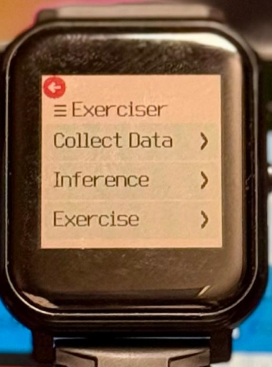

## Data Collection Process

- Strap the watch to your non-dominant hand.
- Select `Collect Data` on the watch, and select one of the predefined activities, scroll down to see more.
- When you're ready to do the activity, select `Start Recording`.
- Start performing the activity, e.g. walking.
    - Don't change from one activity to another while you are collecting data.
    - There's however no need to try to perform the activity as a robot, just do it naturally. E.g., when walking, just walk as you normally do, take a few turns every now and then, and vary the speed a bit.
    - For the first time, collect a minute or so of data for each activity.
    - Stop recording by quickly pressing the physical button. This will take you back to the main menu.
- Repeat the above for each activity.
- Also collect data for a "non-activity", like sitting.

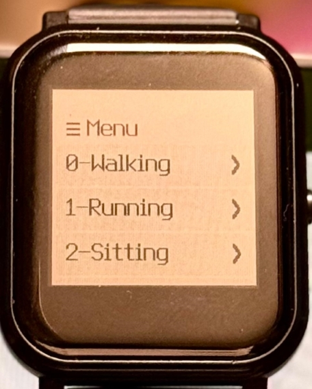

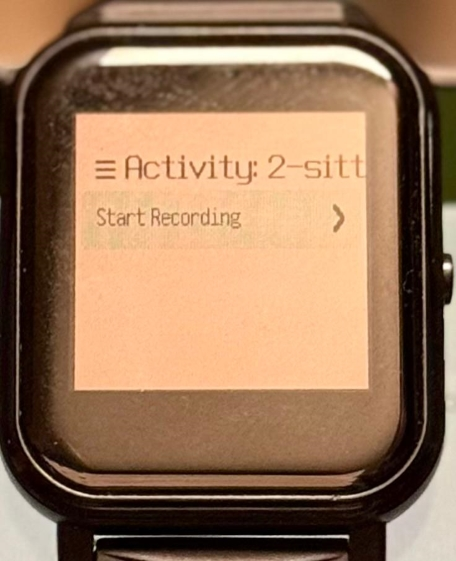

## Building and Training the Model

Building and training a ML-model in this project consist of following major steps:
1. Downloading the recorded activity files to your computer
2. Creating an Edge Impulse project
3. Uploading the activity files to Edge Impulse
4. Creating and training the model

### 1. Download the Activity Files

- In the Espruino IDE, click on the `Storage` icon

- Your activity files start with ´acti_...` followed by a timestamp when the file was created.
- Click the `Save` icon for each activity file individually.  

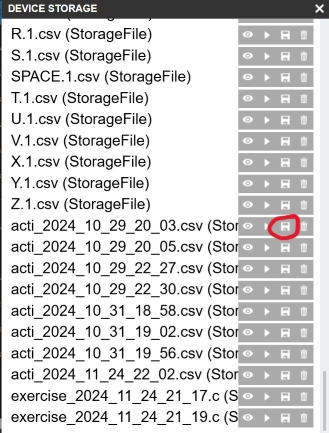

- Files will be stored in your _Downloads_ folder on your computer
- Files will be in CSV-format, but have an `(StorageFile)`-appendix that you'll need to remove. So, rename `acti_2024_10_29_20_03.csv (StorageFile)` to `acti_2024_10_29_20_03.csv`.

### 2. Create an Edge Impulse Project

- Head over to Edge Impulse, and create a new project. If you are completely new to the platform, check out their [getting started tutorial](https://docs.edgeimpulse.com/docs/readme/for-beginners#getting-started-in-a-few-steps).

### 3. Upload the Activity Files

This consists of two steps:
- 3.1 Configure the CSV-Wizard
- 3.2 Uploading the activity files themselves

#### 3.1 Configure the CSV-Wizard

Here you'll use one of your activity files as an example model to let the wizard know how the file is structured. This configuration only needs to be done once. Documentation for the CSV-Wizard is found [here](https://docs.edgeimpulse.com/docs/edge-impulse-studio/data-acquisition/csv-wizard).

For this project I've used the following steps:
- Click on `Data acquisition`
- Click on `CSV-Wizard`
- Click on `Choose File`, select any of your activity files, and click `Upload file`
- Check that you have the following columns: 
    - Row #, timestamp, x, y, z, activity
    - Click `Looks good, next`
- Fill in the screen like this:
    - **Is this time-series data?:** `Yes, this is time-series data...`
    - **How is your time-series data formatted?:** `Each row contains a reading, and sensor values are columns.`
    - **Do you have a timestamp or time elapsed column?:**  `Yes, it's <timestamp>`
    - **What type of data is in your timestamp column?:** `Time elapsed in milliseconds`
    - **Override timestamp difference?:** `80 ms` (the default accelerometer is 12.5 Hz which means one sample is 80 ms in length)
- Click `Great, let's look at your values`
- Now you are in Step 4, fill in it like this:
    - **Do you have a column that contains the label (the value you want to predict)?** `Yes, it's <activity>`
    - **Which columns contain your values?** `<x, y, z>`
- Click `Next, split up into samples`
- In this Step 5, use these settings:
    - **How long do you want your samples to be?** `Limit to <3040> ms`
    - **How should we deal with multiple labels in a sample?** `Use the last value of "activity" as the label for each sample...`
- Click `Finish wizard`

#### 3.2 Upload Activity Files Using the CSV-Wizard

Now you can upload all activity files, including the one you used to configure the CSV-Wizard, to Edge Impulse. See the [documentation](https://docs.edgeimpulse.com/docs/edge-impulse-studio/data-acquisition/uploader) for detailed steps.

### 4. Creating, Training, and Testing the Model in Edge Impulse

This consists of a few steps, all done within Edge Impulse:
- 4.1 Create an impulse
- 4.2 Generate features
- 4.3 Train the model
- 4.4 Test the model

#### 4.1 Create an Impulse

In Edge Impulse, navigate to `Create impulse` and configure the following settings:

Time-series data:
- `Window size 1,000 ms.`
- `Window increase 500 ms.`
- `Frequency (Hz) 12.5`
- `Zero-pad data [x]`

Select `Raw data` as Processing block and `Classification` as Learning block. As Bangle isn't one of the officially supported devices, the other available blocks for accelerometer data would need to be developed in Espruino to work identically as the Edge Impulse ones. I actually tried to replicate the Spectral Analysis processing block, but was not successful.

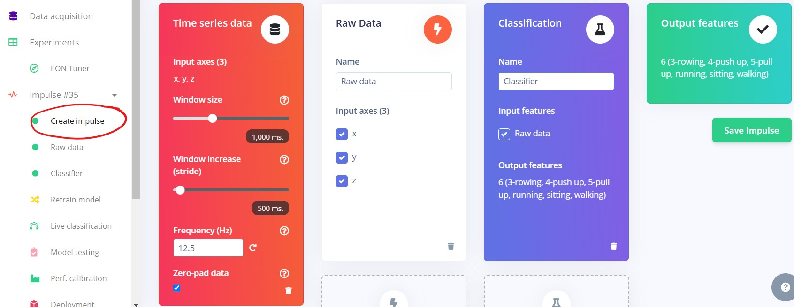

#### 4.2 Generate Features

- Select `Raw data` from the menu. 
- As we're using default settings:
    - click `Save parameters`
    - in next screen, click `Generate features`
- After a couple of minutes you'll see how well the activities can be separated in this stage. As you see I have quite a good separation, only sitting is scattered around, the reason being that I by purpose was not sitting completely still all the time, I did a few different random hand movements.

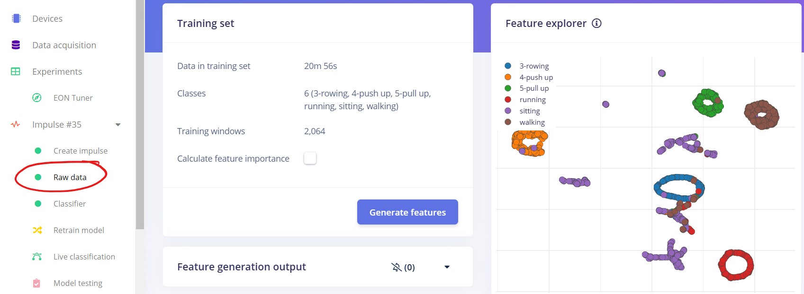

#### 4.3 Train the Model

- Select `Classifier` from the menu.
- You are recommended to try different settings, but to start with why not use mine:
    - `Number of training cycles 700`
    - `1st dense layer 30 neurons`
    - `2nd dense layer 15 neurons`
    - `3rd dense layer 8 neurons`
- Click `Save & train` to start training
- My results were fairly good with an accuracy of 95%, but to improve the model even further, I'd collect more data.

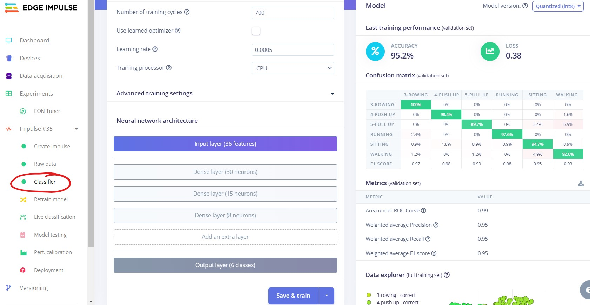

#### 4.4 Test the Model

This section is testing the ML model on some test data which was automatically placed aside and not used during the training. The objective is to see how well the model performs with data it has not encountered before, thus simulating use in real-life situations.

- Select `Model testing` from the menu.
- Click `Classify all`
- After a while you'll get the results.
- My results were not as good as in the training, but this is quite often the case. The final verdict of model performance is when you try it in the field, or as in this case, on your hand!  

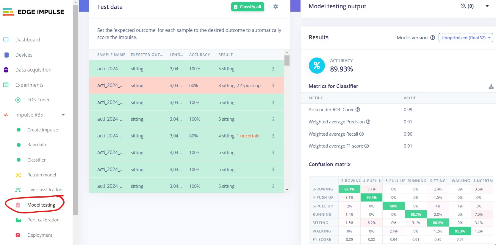

## Model Deployment

As mentioned, Bangle is not officially supported by Edge Impulse, so you can't use the Deployment menu option. This doesn't of course stop you as the only thing that really matters is that both Bangle and Edge Impulse support Tensorflow Lite. 

### Do this in **Edge Impulse**:

- Select `Dashboard` from the menu.
- Click on the `Save` icon next to Tensorflow Lite (float32)
    - This downloads a model file to your computer's downloads folder.

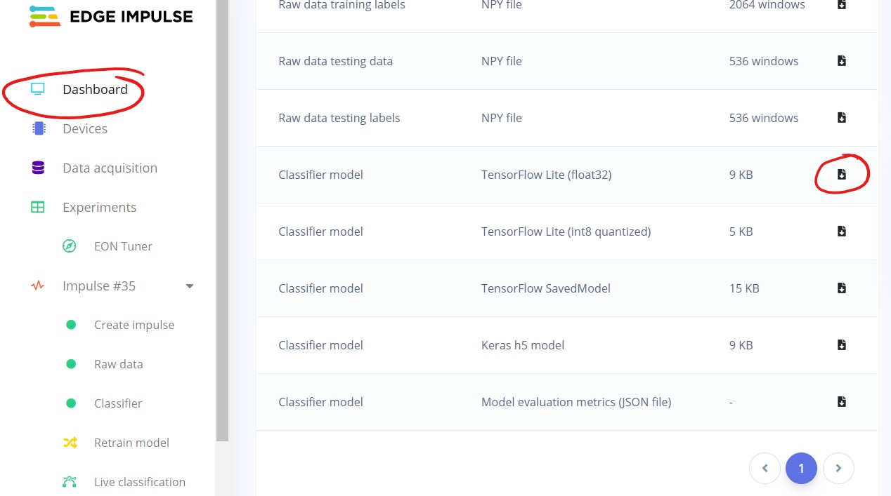

### Do this in the **Espruino IDE**:
- Click on the `Storage` icon

- Click `Upload files`

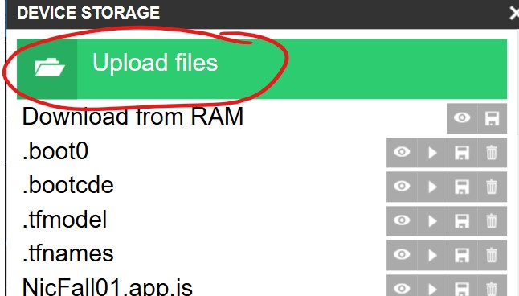

- Find the model you downloaded from Edge Impulse
- Type `impulse1` as file name and click `Ok`. 
    - FYI: When the Bangle-program is run it will convert the Tensorflow Lite file to base64-format and create an internal file named `impulse4`

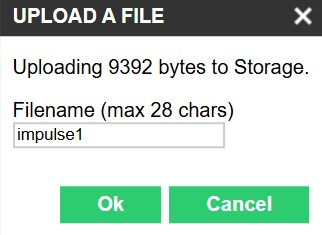

## Test the Model on the Watch!

Now it's time to test the model in real life!

Here you'll use the same program as earlier in Software Configuration, so unless the app is still running on your Bangle, just upload it to RAM once again.

- When you want to test the app without storing any activity data, just select `Inference`.

- This shows the current activity you are doing, in my case unfortunately sitting...
- Click wherever on the display to go back.

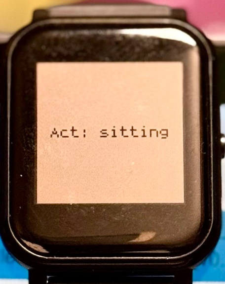

- Start exercising (yay!) by selecting `Exercise`.
- This runs inference as the previous one, but also collects data to a CSV-file.
- In this app there are no bells and whistles shown on the watch display, feel free to learn Javascript to enhance the Bangle app!

### Download Exercise Data from the Bangle App

Access the Storage again from within Espruino IDE, and download the exercise files (named `exercise` + timestamp when file created)

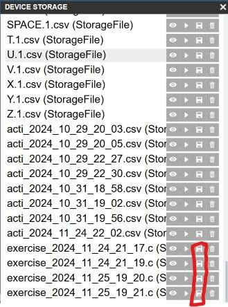

The file contains timestamps when the inferred activity started and ended as well as the activity itself. As you see below, it classified several activities I did. I also simulated rowing, but as I could not use the real rowing machine, it registered it as sitting.

The program registers an activity only after detecting the same activity for at least 10 seconds. In a real scenario this should probably be increased to 30 seconds or more as you are probably not all the time very quickly switching between different activities.

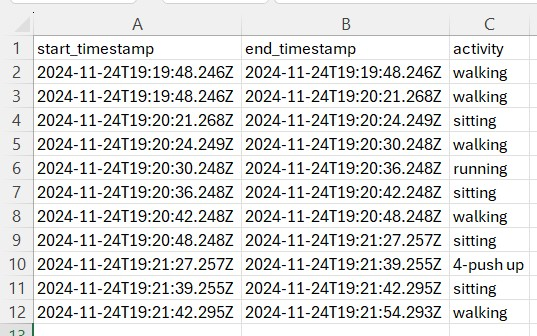

## Results

The results from the Edge Impulse part completely met the objectives and expectations I had, i.e. to be able to classify which exercise was performed. The training result of 95% can be considered good, especially considering raw data is used. I also tested the spectral features in Edge Impulse, and was not surprised to find that it consistently gave better results with different settings.

As for the Bangle app, the results only partially met my objectives. While the watch itself is excellent for its price point, I only have basic Javascript skills and was not completely successful in getting the exercise registering logic as good as I'd wanted. Testing the app during exercises is also in practice somewhat challenging as you can't easily watch the inferred activity while performing it!

### Improvement Suggestions

One thing that might improve the accuracy somewhat is to change the accelerometer frequency from 12.5 Hz to e.g. 100 Hz, I've tested that this is possible. With help of ChatGPT I also tried to replicate the spectral features in Edge Impulse, but finally needed to leave it out of the scope. The app already outperforms my Garmin watch in switching from one activity to another without me taking any actions on the watch. Another, quite straightforward improvement, is to make the app a real Bangle app, this can be done by following the steps in the paragraph *Making an App* [here](https://www.espruino.com/Bangle.js+First+App). New features can of course be added to the app, heart rate data, steps, altitude etc.

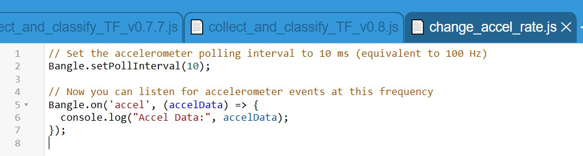

As a summary, the concept as such is working, and there's a prototype of an exercise app that can be improved upon. As my gym season begins during the dark winter months, I plan to collect extensive data to further improve the model.

## Conclusion

This tutorial aimed to build a machine learning model and a corresponding Bangle app capable of accurately classifying activities, particularly those performed in a gym, where users frequently switch between different exercises. As has been demonstrated, this goal was largely met.

All the code and files used in this write-up are found from [Github](https://github.com/baljo/Bangle_activities), the public Edge Impulse project is [here](https://studio.edgeimpulse.com/studio/544247). Feel free to clone the project for your own use case.

