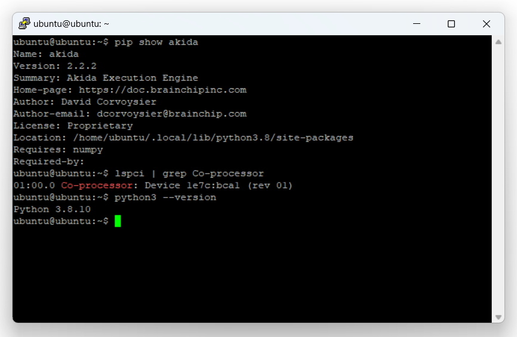
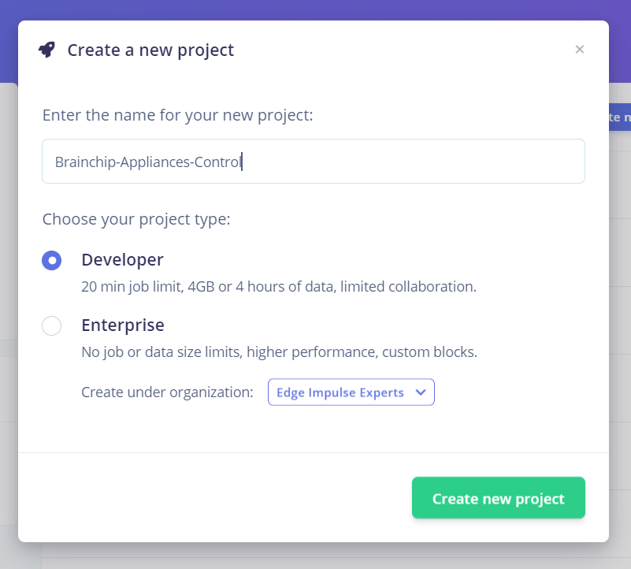
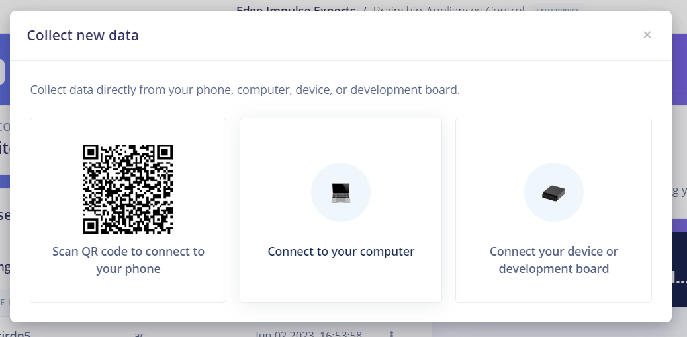
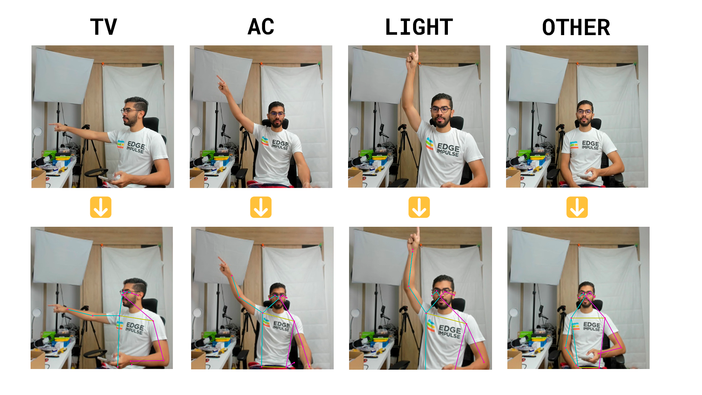
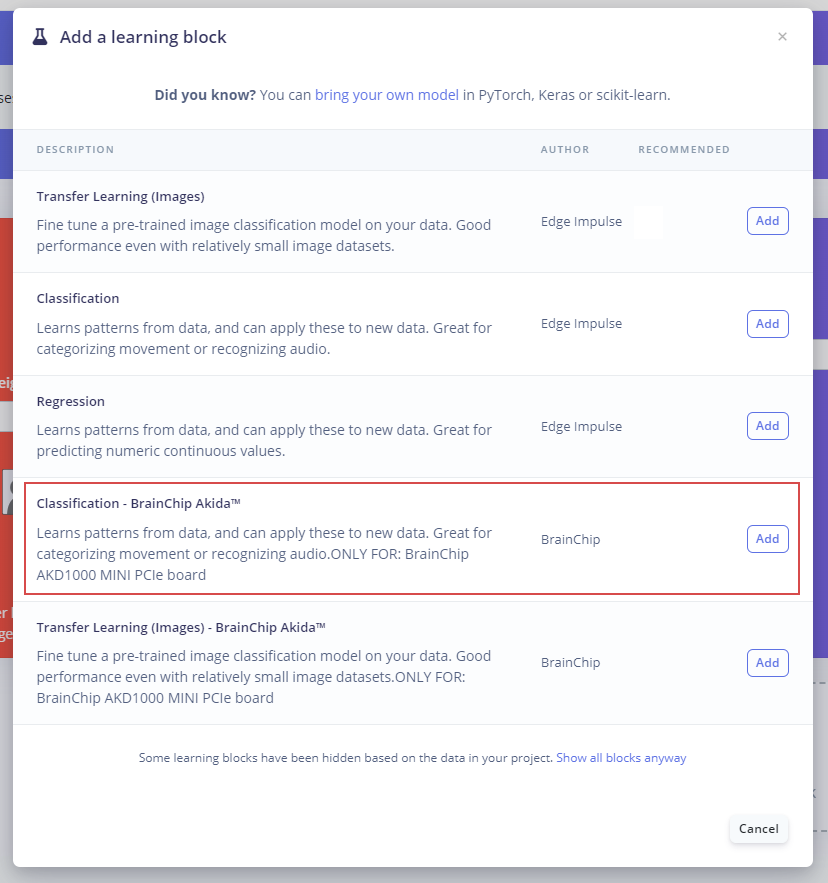
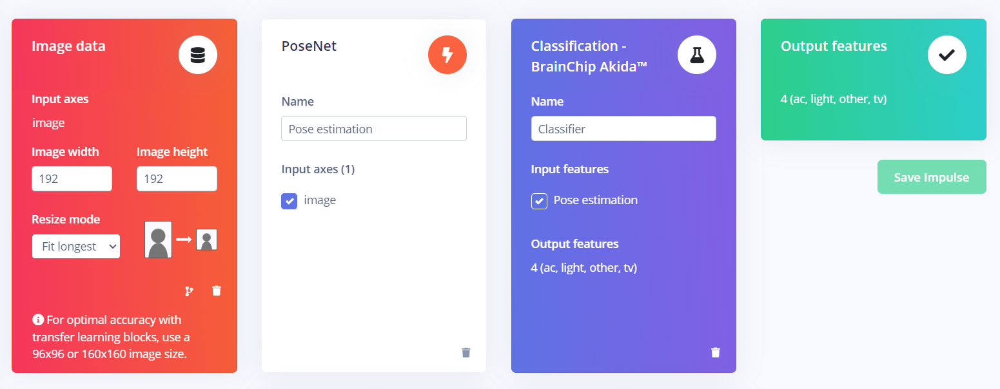
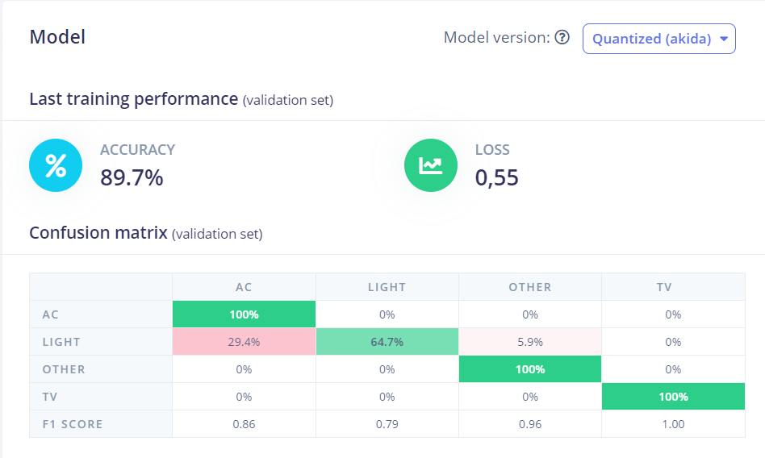
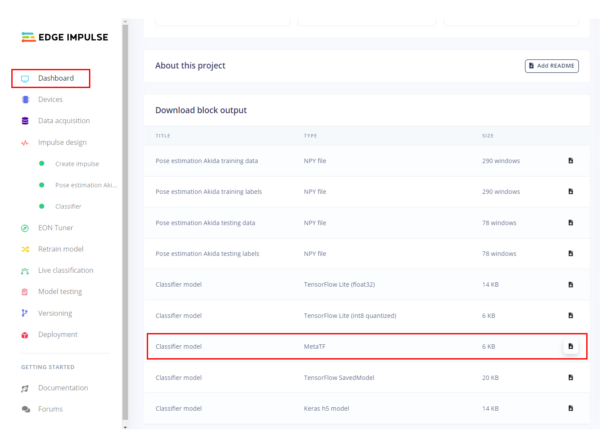
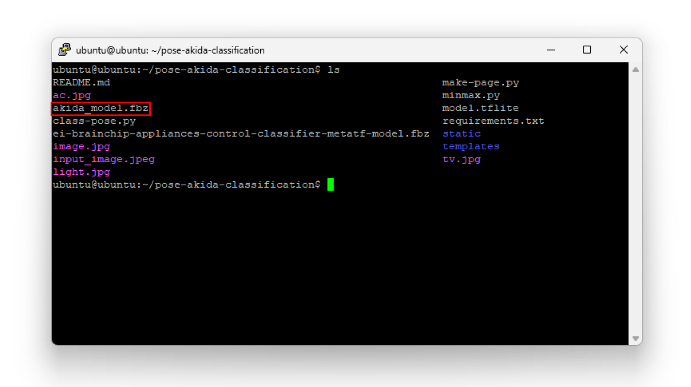
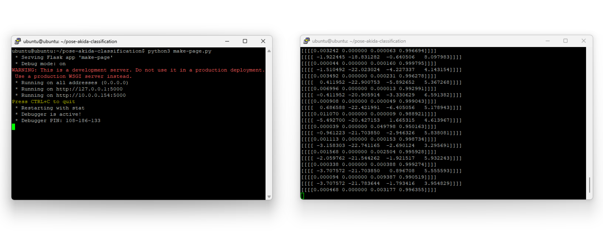

# Gesture Appliances Control with Pose Detection - BrainChip AKD1000 

Created By:
Christopher Mendez

Public Project Link:
[https://studio.edgeimpulse.com/public/319871/latest](https://studio.edgeimpulse.com/public/319871/latest)

## Introduction

Today more than ever we live with smart devices and personal assistants that work together to make our environment a more comfortable, efficient and personalized place. This project aims to contribute to the same field by suggesting a radical change in how we interact with smart things.

Sometimes it can be inconvenient to have to ask a personal assistant to turn our appliances on or off. Because it's simply too late at night to be talking, or because we're watching our favorite movie and we don't want annoying audio interrupting us.

This is why I thought "What if we could control the whole house with just gestures?" It would be amazing to just point to the air conditioner and turn it on, turn off the light, and turn on our TV.

## Hardware and Software Requirements

To develop this project we will use a __BrainChip Akida Development Kit__ and a __Logitech BRIO 4K Webcam__, together with an __Edge Impulse__ Machine Learning model for pose identification.


### Akida Dev Kit

It should be noted that this kit is the main component of this project thanks to some interesting characteristics that make it ideal for this use case. This kit consists of a Raspberry Pi Compute Module 4 with Wi-Fi and 8 GB RAM, also its IO Board, which includes a PCIe interface to carry an **Akida PCIe board** with the **AKD1000 Neuromorphic Hardware Accelerator**. 

Considering that our project will end up being one more smart device that we will have at home, it's crucial that it can do its job efficiently and with very low energy consumption. This is where BrainChip's technology makes sense. Akida™ neuromorphic processor mimics the human brain to analyze only essential sensor inputs at the point of acquisition—processing data with unparalleled performance, precision, and economy of energy.

### Software

The whole system will be running independently identifying poses, if a desired pose is detected it will send an HTTP request to the Google Assistant SDK being hosted by a Raspberry Pi with Home Assistant OS. 

## Setting up the Development Environment

The system comes with the basic requirements installed to run machine learning models using Akida processor acceleration. Once the system is powered up and connected to the internet (I used an ethernet cable), you can access it by an SSH connection, you will need to know the device's local IP address, in my case, I got it from the list of connected devices of my router. 


To verify the device is working properly, you can try an included demo by navigating to **http://<your_kit_IP@>**, in my case to http://10.0.0.150 and try some of the examples:


To start setting up the device for a custom model deployment, let's verify we have installed all the packages we need.

I am using Putty for the SSH connection. Log in using the Administrator credentials, in this case, the username is **ubuntu** and the password is **brainchip**.

Once inside you will be able to install some required dependencies:

Running the built-in demos ensures us that the system already counts with its Akida package and the PCIe drivers for the AKD1000 but we can verify it by running the following commands:

```
bash
pip show akida # will show the installed version.
lspci | grep Co-processor # will check if the PCIe card is plugged in correctly.
python3 --version # will check the installed Python version (3.8 is required).
```



You will also need Node Js v14.x to be able to use the [Edge Impulse CLI](https://docs.edgeimpulse.com/docs/edge-impulse-cli/cli-installation). Install it by running these commands:

```
bash
curl -sL https://deb.nodesource.com/setup_14.x | sudo -E bash -
sudo apt-get install -y nodejs
node -v
```
The last command should return the node version, v14 or above.

Finally, let's install the [Linux Python SDK](https://docs.edgeimpulse.com/docs/edge-impulse-for-linux/linux-python-sdk), you just need to run these commands:

```
bash
sudo apt-get install libatlas-base-dev libportaudio0 libportaudio2 libportaudiocpp0 portaudio19-dev 
pip3 install edge_impulse_linux -i https://pypi.python.org/simple
```

***As we are working with computer vision, we will need "opencv-python>=4.5.1.48, "PyAudio", "Psutil", and "Flask"***

## Data Collection

First, we need to create an [Edge Impulse Studio](https://studio.edgeimpulse.com) account if we haven't yet, and create a new project:



For the creation of the dataset of our model, we have two options, uploading the images from the BrainChip Development Kit or using our computer or phone. In this case, I chose to take them from the computer using the same webcam that we are finally going to use in the project.



The dataset consists of 3 classes in which we finger point each appliance and a last one of unknown cases.



**Taking at least +50 pictures of each class will let you create a robust enough model**

## Impulse Design

After having the dataset ready, it is time to define the structure of the model.

In the left side menu, we navigate to **Impulse design** > **Create impulse** and define the following settings for each block, respectively:

### Input block (Image data):

- Image width: 192
- Image height: 192
- Resize mode: Fit longest

### Processing block (PoseNet):

Use this block to turn raw images into pose vectors, then pair it with an ML block to detect what a person is doing.

PoseNet processing block is just enabled for Enterprise projects, if we want to use it on a Developer one, we need to locally run the block, for this, you must clone the [PoseNet block repository](https://github.com/edgeimpulse/pose-estimation-processing-block) and follow the __README__ steps.

You will end up with an URL similar to "https://abe7-2001-1308-a2ca-4f00-e65f-1ff-fe27-d3aa.ngrok-free.app" hosting the processing block, click on **Add a processing block** > **Add custom block**, then paste the [**ngrok**](https://ngrok.com/) generated URL, and click on **Add block**.


### Learning block (BrainChip Akida)

To classify the features extracted from the different poses, we'll use a classification learn block specifically designed for the hardware we're using.



Finally, we save the **Impulse design**, it should end up looking like this:



## Model Training

After having designed the impulse, it's time to set the processing and learning blocks. **Pose estimation** block doesn't have any configurable parameters, so we just need to click on **Save parameters** and then **Generate features**. 

In the _classifier block_ define the following settings:

- Number of training cycles: 100
- Learning rate: 0.001 

In the Neural network architecture, add 3 Dense layers with 35, 25 and 10 neurons respectively.

Here is the architecture expert mode code (you can copy and paste it from here):

```
python
import tensorflow as tf
from tensorflow.keras.models import Sequential
from tensorflow.keras.layers import Dense, InputLayer, Dropout, Conv1D, Conv2D, Flatten, Reshape, MaxPooling1D, MaxPooling2D, AveragePooling2D, Rescaling, BatchNormalization, Permute, ReLU, Softmax
from tensorflow.keras.optimizers.legacy import Adam
EPOCHS = args.epochs or 100
LEARNING_RATE = args.learning_rate or 0.001
# this controls the batch size, or you can manipulate the tf.data.Dataset objects yourself
BATCH_SIZE = 32
train_dataset = train_dataset.batch(BATCH_SIZE, drop_remainder=False)
validation_dataset = validation_dataset.batch(BATCH_SIZE, drop_remainder=False)

# model architecture
model = Sequential()
#model.add(Rescaling(7.5, 0))
model.add(Dense(35,
    activity_regularizer=tf.keras.regularizers.l1(0.00001)))
model.add(ReLU())
model.add(Dense(25,
    activity_regularizer=tf.keras.regularizers.l1(0.00001)))
model.add(ReLU())
model.add(Dense(10,
    activity_regularizer=tf.keras.regularizers.l1(0.00001)))
model.add(ReLU())
model.add(Dense(classes, name='y_pred'))
model.add(Softmax())

# this controls the learning rate
opt = Adam(learning_rate=LEARNING_RATE, beta_1=0.9, beta_2=0.999)
callbacks.append(BatchLoggerCallback(BATCH_SIZE, train_sample_count, epochs=EPOCHS))

# train the neural network
model.compile(loss='categorical_crossentropy', optimizer=opt, metrics=['accuracy'])
model.fit(train_dataset, epochs=EPOCHS, validation_data=validation_dataset, verbose=2, callbacks=callbacks)

import tensorflow as tf


def akida_quantize_model(
    keras_model,
    weight_quantization: int = 4,
    activ_quantization: int = 4,
    input_weight_quantization: int = 4,
):
    import cnn2snn

    print("Performing post-training quantization...")
    akida_model = cnn2snn.quantize(
        keras_model,
        weight_quantization=weight_quantization,
        activ_quantization=activ_quantization,
        input_weight_quantization=input_weight_quantization,
    )
    print("Performing post-training quantization OK")
    print("")

    return akida_model


def akida_perform_qat(
    akida_model,
    train_dataset: tf.data.Dataset,
    validation_dataset: tf.data.Dataset,
    optimizer: str,
    fine_tune_loss: str,
    fine_tune_metrics: "list[str]",
    callbacks,
    stopping_metric: str = "val_accuracy",
    fit_verbose: int = 2,
    qat_epochs: int = 200,
):
    early_stopping = tf.keras.callbacks.EarlyStopping(
        monitor=stopping_metric,
        mode="max",
        verbose=1,
        min_delta=0,
        patience=10,
        restore_best_weights=True,
    )
    callbacks.append(early_stopping)

    print("Running quantization-aware training...")
    akida_model.compile(
        optimizer=optimizer, loss=fine_tune_loss, metrics=fine_tune_metrics
    )

    akida_model.fit(
        train_dataset,
        epochs=qat_epochs,
        verbose=fit_verbose,
        validation_data=validation_dataset,
        callbacks=callbacks,
    )

    print("Running quantization-aware training OK")
    print("")

    return akida_model


akida_model = akida_quantize_model(model)
akida_model = akida_perform_qat(
    akida_model,
    train_dataset=train_dataset,
    validation_dataset=validation_dataset,
    optimizer=opt,
    fine_tune_loss='categorical_crossentropy',
    fine_tune_metrics=['accuracy'],
    callbacks=callbacks)
```

Click on the __Start training__ button and wait for the model to be trained and the confusion matrix to show up.

### Confusion Matrix 



The results of the confusion matrix can be improved by adding more samples to the dataset.

## Project Setup

To be able to run the project, we need to go back to our SSH connection with the device and clone the project from the [Github repository](https://github.com/edgeimpulse/pose-akida-classification), for this, use the following command:

```
bash
git clone https://github.com/edgeimpulse/pose-akida-classification.git
```
Install all the project requirements with the following command, and wait for the process to be done.

```
bash
pip install -r requirements.txt
```

Install these other required packages with:

```
bash
apt-get update && apt-get install ffmpeg libsm6 libxext6  -y
```

## Deployment

Once the project is cloned locally in the Akida Development Kit, you can download the project model from Edge Impulse Studio by navigating to the **Dashboard** section and downloading the **MetaTF** `.fbz` file.



Once downloaded, from the model path, open a new terminal and copy the model to the Dev Kit using `scp` command as follows:

```
bash
scp <model file>.fbz ubuntu@<Device IP>:~ # command format
scp akida_model.fbz ubuntu@10.0.0.154:~ # actual command in my case
```
_You will be asked for your Linux machine login password._

Now, the model is on the Akida Dev Kit local storage `(/home/ubuntu)` and you can verify it by listing the directory content using `ls`.

Move the model to the project directory with the following command:

```
bash
mv akida_model.fbz ./pose-akida-classification/
```

Here we have the model on the project directory, so now everything is ready to be run.



## Run Inferencing

To run the project, type the following command:

```
bash
python3 class-pose.py akida_model.fbz 0
```

- The first parameter `class-pose.py` is the project's main script to be run.
- `akida_model.fbz` is the Meta TF model name we downloaded from our Edge Impulse project.
- `0` force the script to use the first camera available.

The project will start running and printing the inference results continuously in the terminal.


To watch a preview of the camera feed, you can do it by opening a new `ssh` session and running the `make-page.py` script from the project directory:

```
bash
python3 make-page.py
```



Finally, you will be able to see the camera preview alongside the inference results organized in the following order: `AC`, `Light`, `Other` and `TV`.


## Google Assistant Setup

For the actual appliance control, I used the __Google Assistant SDK__ integration for __Home Assistant__. Follow the [documentation](https://www.home-assistant.io/integrations/google_assistant_sdk) to configure it for your setup.

***The Home Assistant is running on a separate Raspberry PI.***

Once the integration is set, we can send `HTTP` requests to it with the following format:

- URL: `http://<Raspberry Pi IP>:8123/api/services/google_assistant_sdk/send_text_command`
- Headers:
    - Authorization: "Bearer <authentication key>"
    - Content-Type: "application/json"
- Body: {"command":"turn on the light"}

You must edit the `url` and `auth` variables in the code with the respective ones of your setup.

```
python
url = 'http://<Raspberry Pi IP>:8123/api/services/google_assistant_sdk/send_text_command'
auth = 'Bearer ******************************************************************************'
```

## Demo


Here I show you the whole project working and controlling appliances when they are pointed.



## Conclusion

This project leverages the Brainchip Akida Neuromorphic Hardware Accelerator to propose an innovative solution to home automation. It can be optimized to work as a daily used gadget that may be at everyones house in the near future.
