# Hospital Bed Occupancy Detection with TinyML

Created By: [Adam Milton-Barker](https://www.adammiltonbarker.com/)

Public Project Link: [https://studio.edgeimpulse.com/public/181529/latest](https://studio.edgeimpulse.com/public/181529/latest)

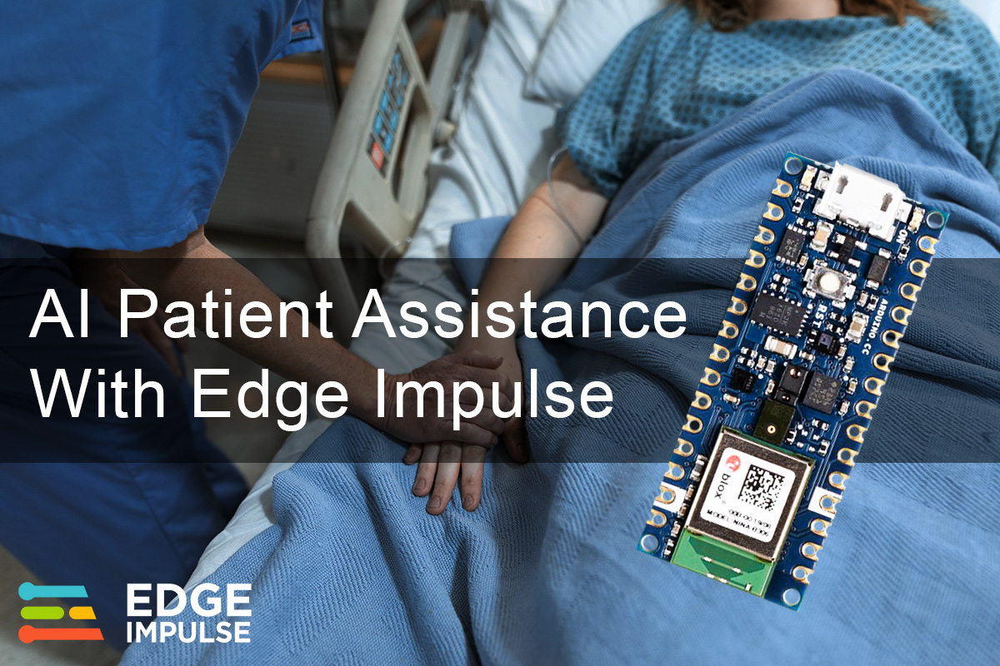

## Introduction

Hospitals can benefit greatly from the use of modern technologies and automation. As hospitals continue to struggle through lack of staff, they need to explore ways that tasks can be automated to free up their valuable human resources. AI is one technology that can play a huge role in the automation of hospitals, and with platforms such as Edge Impulse and low cost embedded devices, automation can be implemented easily, and at low cost.

## Solution

Using the built-in sensors of the Arduino Nano 33 BLE Sense and the Edge Impulse platform, beds can be monitored to see if they are occupied or not, meaning that hospital staff can know in real-time whether or not they have room for a patient, and exactly where the free beds are. This project is a proof of concept to show how Edge Impulse can be used to train a custom neural network, which can be deployed to an Arduino Nano 33 BLE Sense.

## Hardware

* Arduino Nano 33 BLE Sense [Buy](https://store.arduino.cc/products/arduino-nano-33-ble-sense)

## Platform

* Edge Impulse [Visit](https://www.edgeimpulse.com)

## Software

* [Edge Impulse CLI](https://docs.edgeimpulse.com/docs/edge-impulse-cli/cli-installation)
* [Arduino CLI](https://arduino.github.io/arduino-cli/latest/)
* [Arduino IDE](https://www.arduino.cc/en/software)

## Project Setup

Head over to [Edge Impulse](https://www.edgeimpulse.com) and create your account or login. Once logged in you will be taken to the project selection/creation page.

### Create New Project

Your first step is to create a new project. From the project selection/creation you can create a new project.

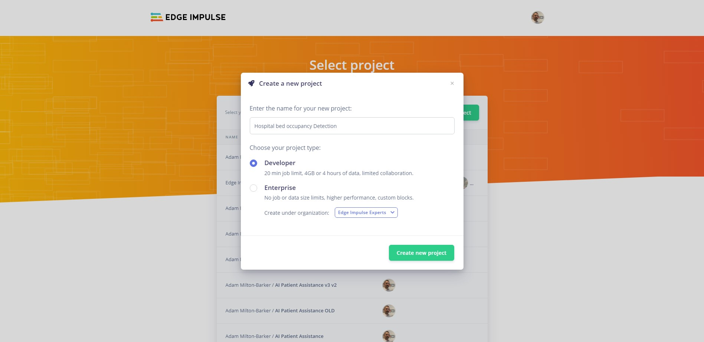

Enter a **project name**, select **Developer** or **Enterprise** and click **Create new project**.

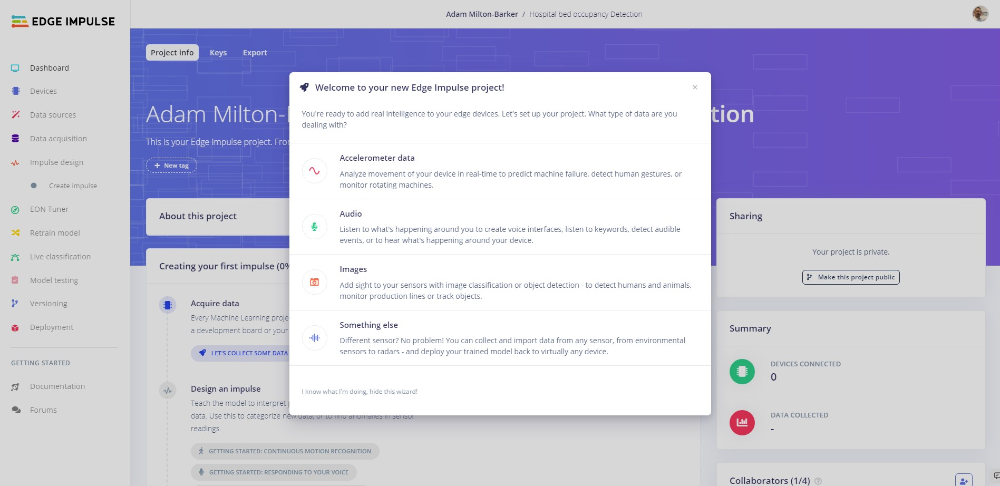

We are going to be creating a project that uses the built in accelerometer, gyroscope and magnetometer sensors, so now we need to select **Accelerometer Data** as the project type.

### Connect Your Device

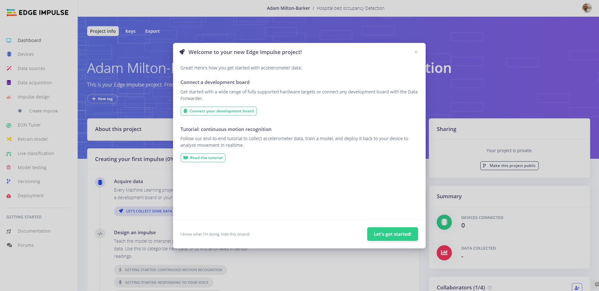

You need to install the required dependencies that will allow you to connect your device to the Edge Impulse platform.

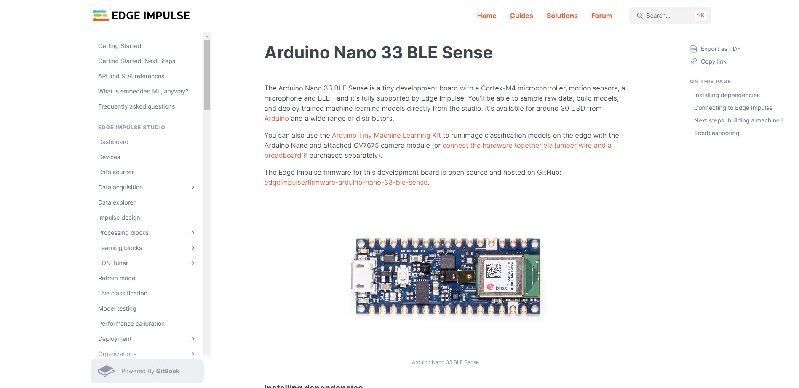

This process is documented on the [Edge Impulse Website](https://docs.edgeimpulse.com/docs/development-platforms/officially-supported-mcu-targets/arduino-nano-33-ble-sense) and includes installing:

* [Edge Impulse CLI](https://docs.edgeimpulse.com/docs/edge-impulse-cli/cli-installation)
* [Arduino CLI](https://arduino.github.io/arduino-cli/latest/)

Once the dependencies are installed, connect your device to your computer and press the **RESET** button twice to enter into bootloader mode, the yellow LED should now be flashing.

Now download the [latest Edge Impulse firmware](https://cdn.edgeimpulse.com/firmware/arduino-nano-33-ble-sense.zip) and unzip it, then double click on the relevant script for your OS, either `flash_windows.bat`, `flash_mac.command` or `flash_linux.sh`.

Once the firmware has been flashed you should see the output above, hit `Enter` to close command prompt/terminal.

Open a new command prompt/terminal, and enter the following command:

```
edge-impulse-daemon
```

If you are already connected to an Edge Impulse project, use the following command:

```
edge-impulse-daemon --clean
```

Follow the instructions to log in to your Edge Impulse account.

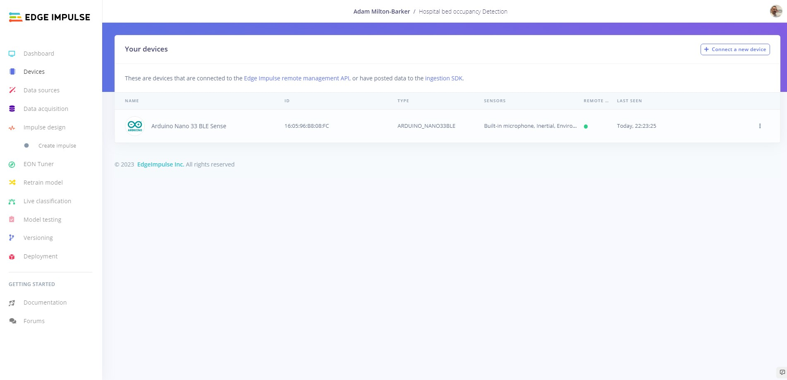

Once complete head over to the _Devices_ tab of your project and you should see the connected device.

## Data Acquisition

We are going to create our own dataset, using the built-in sensors on the Arduino Nano 33 BLE Sense. We are going to collect data that will allow us to train a machine learning model that can detect sitting down on a bed, standing up, and idle state.

We will use the **Record new data** feature on Edge Impulse to record around 35 samples of each class.

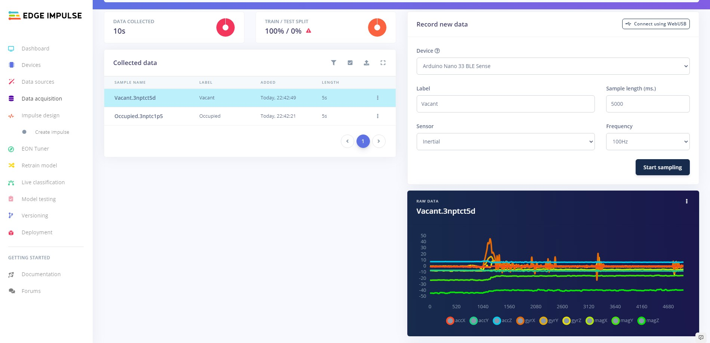

Connect your Arduino Nano 33 BLE Sense to the Edge Impulse platform, and connect it to the side of your bed. Once you have this in place, set the label to **Vacant** and record yourself standing up from the bed around 35 times.

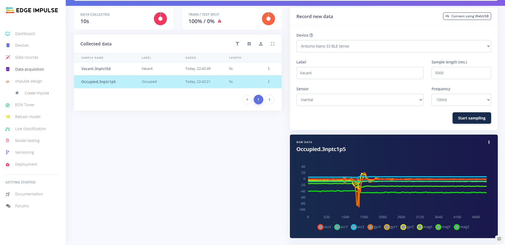

Now you need to do the same for sitting down on the bed, repeat the steps above and change the label to **Occupied** before recording your samples.

Finally, record the **Idle** data, change the sample length to 1000 (1 second), and record your data, ensuring no movement is detected during sampling.

### Crop Data

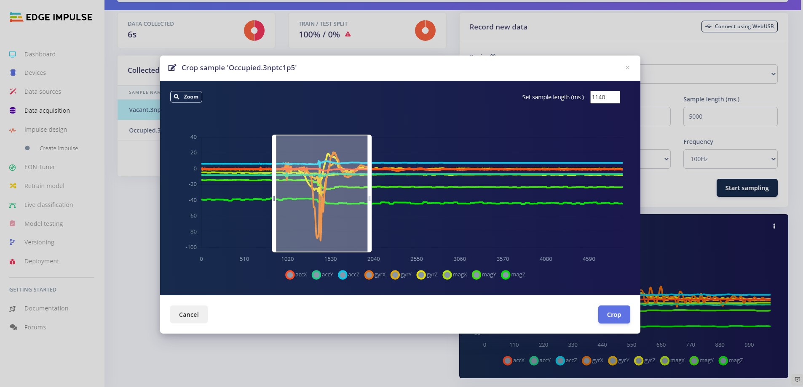

As the samples we took for the **Vacant** and **Occupied** classes were taken with a sample length of 5 seconds, we will need to trim them down to around 1 second.

To do this, click the three dots at the side of the samples and reduce the length by pulling bars at the edges of the samples closer together. Make sure you get the correct data in the sample. For Vacant, you should have the part of the sample where the signals go up, and vice-a-versa for the Occupied samples.

### Test Split

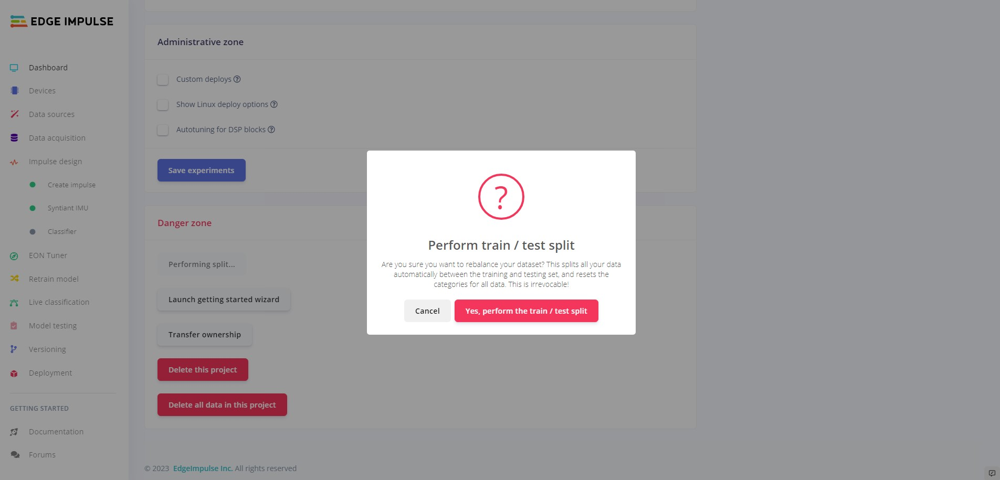

We now need to split the data into training and test data. To do so head to the project dashboard and scroll down to the bottom. Click on the **Perform train/test split** button and follow the instructions.

## Create Impulse

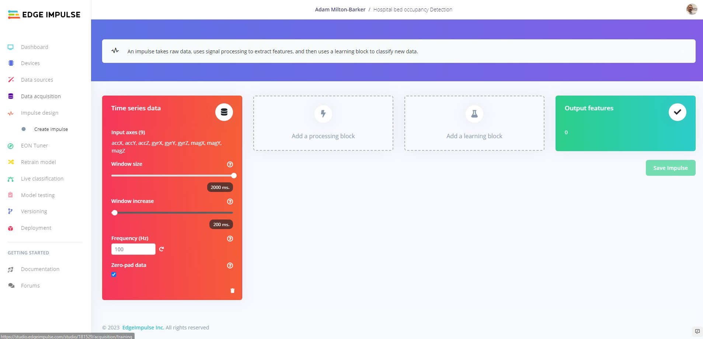

Now we are going to create our network and train our model. Head to the **Create Impulse** tab. Next click **Add processing block** and select **Spectral Analysis**.

Now click **Add learning block** and select **Classification**.

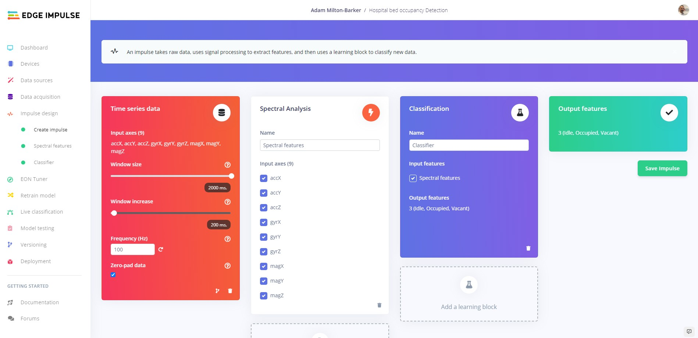

Now click **Save impulse**.

### Spectral Features

#### Parameters

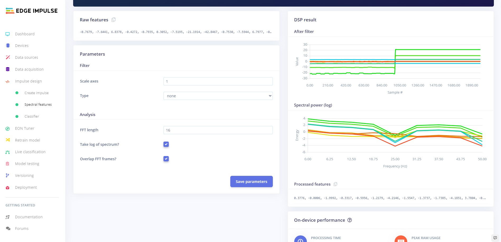

Head over to the **Spectral Features** tab and click on the **Save parameters** button to save the parameters.

#### Generate Features

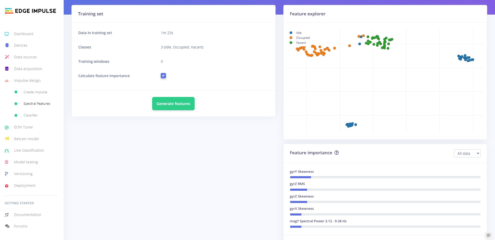

If you are not automatically redirected to the **Generate features** tab, click on the **Spectral Features** tab and then click on **Generate features** and finally click on the **Generate features** button.

Your data should be nicely clustered and there should be as little mixing of the classes as possible. You should inspect the clusters and look for any data that is clustered incorrectly. If you find any data out of place, you can relabel or remove it. If you make any changes click **Generate features** again.

## Training

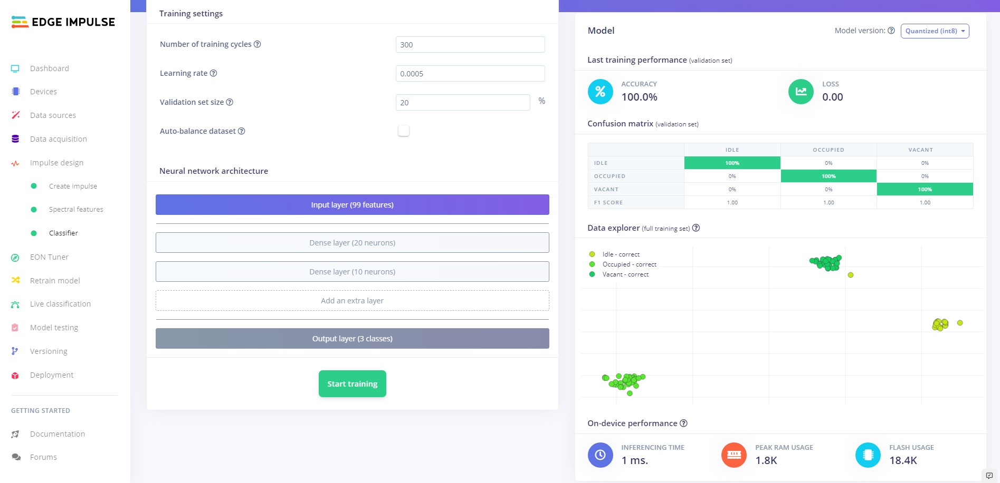

Now we are going to train our model. Click on the **Classifier** tab then click **Start training**.

Once training has completed, you will see the results displayed at the bottom of the page. Here we see that we have 100% accuracy. Lets test our model and see how it works on our test data.

## Testing

### Platform Testing

Head over to the **Model testing** tab where you will see all of the unseen test data available. Click on the **Classify all** and sit back as we test our model.

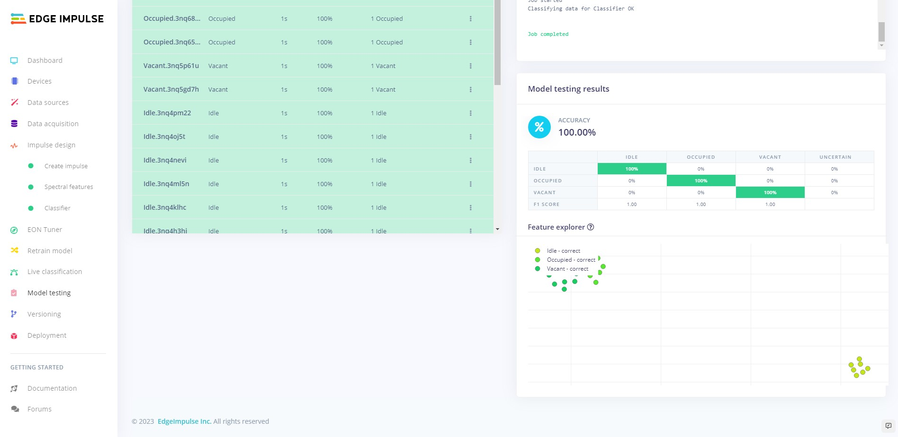

You will see the output of the testing in the output window, and once testing is complete you will see the results. In our case we can see that we have achieved 100% accuracy on the unseen data.

### On Device Testing

Before we deploy the software to the Nano 33 BLE Sense, lets test using the Edge Impulse platform whilst connected to the board. For this to work make sure your device is currently connected.

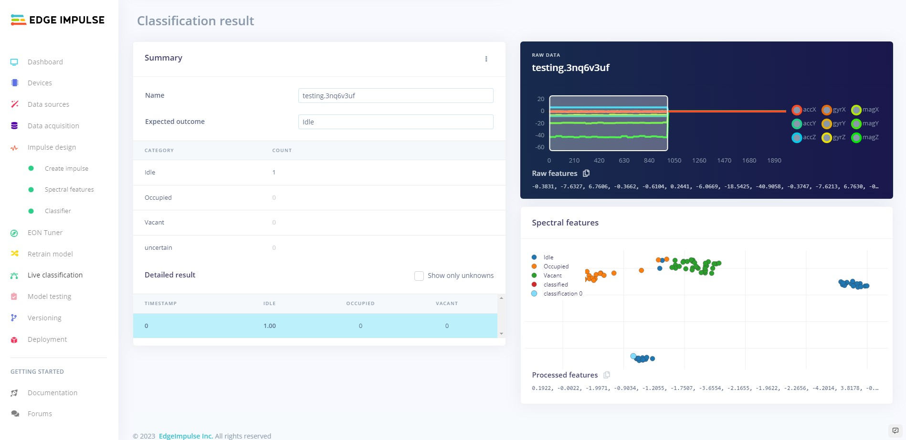


Use the **Live classification** feature to record some samples for classification from the Nano BLE Sense. Your model should correctly identify the class for each sample.

## Deployment

Now we will deploy an Arduino library to our device that will allow us to run the model directly on our Arduino Nano 33 BLE Sense.

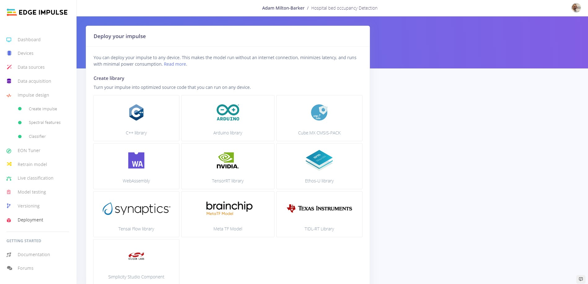

Head to the deployment tab and select **Arduino Library** then scroll to the bottom and click **Build**.

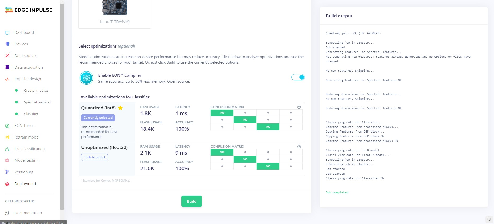

Note that the EON Compiler is selected by default which will reduce the amount of memory required for our model.

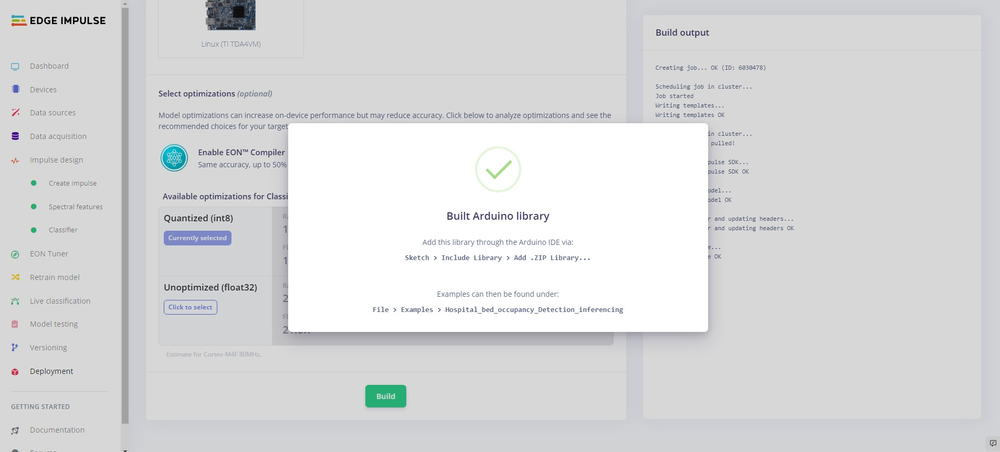

Once the library is built, you will be able to download it to a location of your choice.

## Arduino IDE

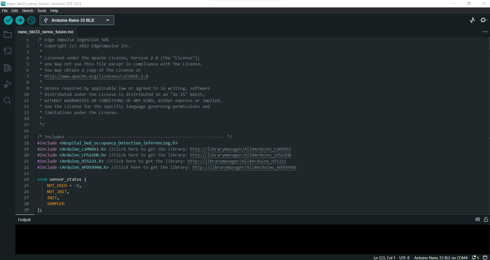

Once you have downloaded the library, open up Arduino IDE, click **Sketch** -> **Include library** -> **Upload .ZIP library...**, navigate to the location of your library, upload it and then restart the IDE.

### Arduino BLE 33 Sense Fusion

Open the IDE again and go to **File** -> **Examples**, scroll to the bottom of the list, go to **Hospital\_Bed\_Occupancy\_Detection\_inferencing** -> **nano\_ble33\_sense** -> **nano\_ble33\_sense\_fusion**.

Once the script opens you will see:

```
#include <Arduino_LSM9DS1.h> //Click here to get the library: http://librarymanager/All#Arduino_LSM9DS1
#include <Arduino_LPS22HB.h> //Click here to get the library: http://librarymanager/All#Arduino_LPS22HB
#include <Arduino_HTS221.h> //Click here to get the library: http://librarymanager/All#Arduino_HTS221
#include <Arduino_APDS9960.h> //Click here to get the library: http://librarymanager/All#Arduino_APDS9960
```

You need to click on each of the library links and install them before you can compile the program and upload. Once you have done this, upload the script to the board, open up Serial Monitor, and you will see the output from the program.

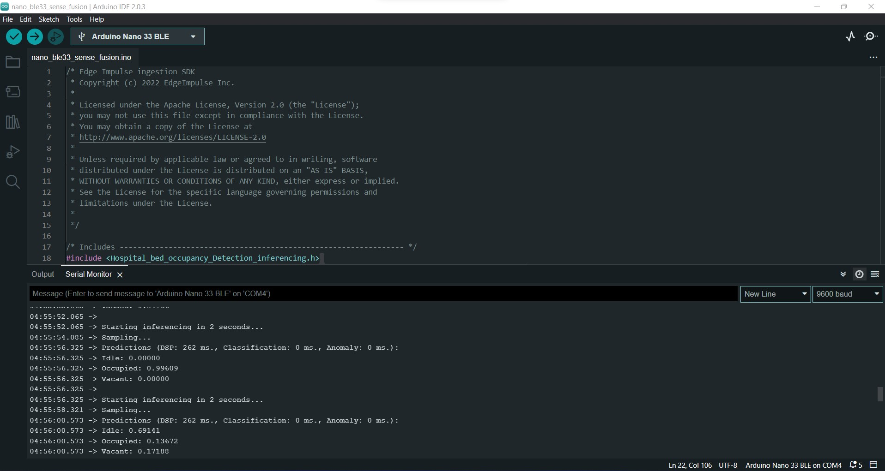

Now you can test your program by staying idle, sitting down and standing up. Check the output to see how your program is doing. It should correctly identify each action.

## Versioning

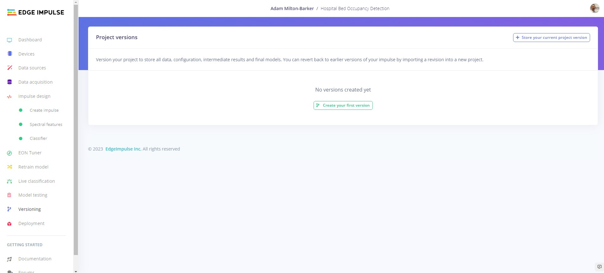

We can use the versioning feature to save a copy of the existing network. To do so head over to the **Versioning** tab and click on the **Create first version** button.

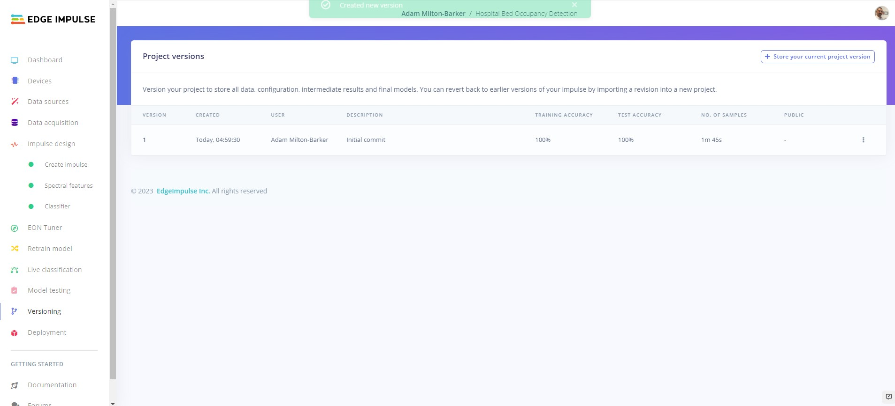

This will create a snapshot of your existing model that we can come back to at any time.

## Conclusion

Here we have shown how the Edge Impulse platform combined with the power of the Arduino Nano 33 BLE Sense can be used to create a simple solution that could help hospitals become more efficient. Further work could include more recognized motions or movements, toggling of LEDs or lights via a pin on the Nano 33, or notification systems leveraging bluetooth to talk to an application or dashboard.
