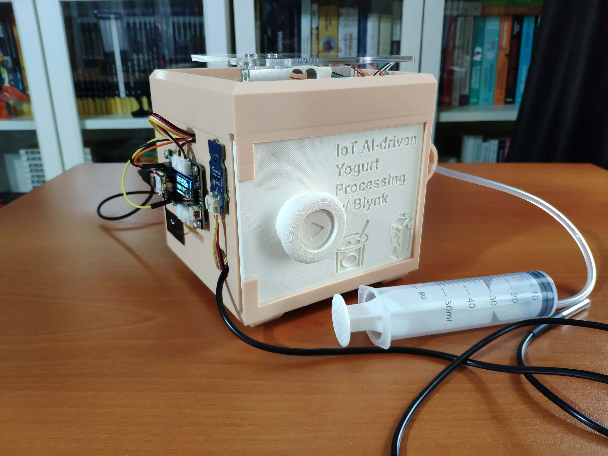

# AI-Assisted Monitoring of Dairy Manufacturing Conditions

Created By: Kutluhan Aktar

Public Project Link: [https://studio.edgeimpulse.com/public/159184/latest](https://studio.edgeimpulse.com/public/159184/latest)


## Description

As many of us know, yogurt is produced by bacterial fermentation of milk, which can be of cow, goat, ewe, sheep, etc. The fermentation process thickens the milk and provides a characteristic tangy flavor to yogurt. Considering organisms contained in yogurt stimulate the gut's friendly bacteria and suppress harmful bacteria looming in the digestive system, it is not surprising that yogurt is consumed worldwide as a healthy and nutritious food\[^1].

The bacteria utilized to produce yogurt are known as yogurt cultures (or starters). Fermentation of sugars in the milk by yogurt cultures yields lactic acid, which decomposes and coagulates proteins in the milk to give yogurt its texture and characteristic tangy flavor. Also, this process improves the digestibility of proteins in the milk and enhances the nutritional value of proteins. After the fermentation of the milk, yogurt culture could help the human intestinal tract to absorb the amino acids more efficiently\[^2].

Even though yogurt production and manufacturing look like a simple task, achieving precise yogurt texture (consistency) can be arduous and strenuous since various factors affect the fermentation process while processing yogurt, such as:

* Temperature
* Humidity
* Pressure
* Milk Temperature
* Yogurt Culture (Starter) Amount (Weight)

In this regard, most companies employ food (chemical) additives while mass-producing yogurt to maintain its freshness, taste, texture, and appearance. Depending on the production method, yogurt additives can include dilutents, water, artificial flavorings, rehashed starch, sugar, and gelatine.

In recent years, due to the surge in food awareness and apposite health regulations, companies were coerced into changing their yogurt production methods or labeling them conspicuously on the packaging. Since people started to have a penchant for consuming more healthy and organic (natural) yogurt, it became a necessity to prepare prerequisites precisely for yogurt production without any additives. However, unfortunately, organic (natural) yogurt production besets some local dairies since following strict requirements can be expensive and demanding for small businesses trying to gain a foothold in the dairy industry.

After perusing recent research papers on yogurt production, I decided to utilize temperature, humidity, pressure, milk temperature, and culture weight measurements denoting yogurt consistency before fermentation so as to create an easy-to-use and budget-friendly device in the hope of assisting dairies in reducing total cost and improving product quality.

Even though the mentioned factors can provide insight into detecting yogurt consistency before fermentation, it is not possible to extrapolate and construe yogurt texture levels precisely by merely employing limited data without applying complex algorithms. Hence, I decided to build and train an artificial neural network model by utilizing the empirically assigned yogurt consistency classes to predict yogurt texture levels before fermentation based on temperature, humidity, pressure, milk temperature, and culture weight measurements.

Since XIAO ESP32C3 is an ultra-small size IoT development board that can easily collect data and run my neural network model after being trained to predict yogurt consistency levels, I decided to employ XIAO ESP32C3 in this project. To collect the required measurements to train my model, I used a temperature & humidity sensor (Grove), an integrated pressure sensor kit (Grove), an I2C weight sensor kit (Gravity), and a DS18B20 waterproof temperature sensor. Since the XIAO expansion board provides various prototyping options and built-in peripherals, such as an SSD1306 OLED display and a MicroSD card module, I used the expansion board to make rigid connections between XIAO ESP32C3 and the sensors.

Since the expansion board supports reading and writing information from/to files on an SD card, I stored the collected data in a CSV file on the SD card to create a data set. In this regard, I was able to save data records via XIAO ESP32C3 without requiring any additional procedures.

After completing my data set, I built my artificial neural network model (ANN) with Edge Impulse to make predictions on yogurt consistency levels (classes). Since Edge Impulse is nearly compatible with all microcontrollers and development boards, I had not encountered any issues while uploading and running my model on XIAO ESP32C3. As labels, I utilized the empirically assigned yogurt texture classes for each data record while collecting yogurt processing data:

* Thinner
* Optimum
* Curdling (Lumpy)

After training and testing my neural network model, I deployed and uploaded the model on XIAO ESP32C3. Therefore, the device is capable of detecting precise yogurt consistency levels (classes) by running the model independently.

Since I wanted to allow the user to get updates and control the device remotely, I decided to build a complementing Blynk application for this project: The Blynk dashboard displays the recent sensor readings transferred from XIAO ESP32C3, makes XIAO ESP32C3 run the neural network model, and shows the prediction result.

Lastly, to make the device as sturdy and robust as possible while operating in a dairy, I designed a dairy-themed case with a sliding (removable) front cover (3D printable).

So, this is my project in a nutshell 😃

In the following steps, you can find more detailed information on coding, logging data on the SD card, communicating with a Blynk application, building a neural network model with Edge Impulse, and running it on XIAO ESP32C3.

🎁🎨 Huge thanks to [Seeed Studio](https://www.seeedstudio.com/) for sponsoring these products:

⭐ XIAO ESP32C3 | [Inspect](https://www.seeedstudio.com/Seeed-XIAO-ESP32C3-p-5431.html)

⭐ XIAO Expansion Board | [Inspect](https://www.seeedstudio.com/Seeeduino-XIAO-Expansion-board-p-4746.html)

⭐ Grove - Temperature & Humidity Sensor | [Inspect](https://www.seeedstudio.com/Grove-Temp-Humi-Sensor-SHT40-p-5384.html)

⭐ Grove - Integrated Pressure Sensor Kit | [Inspect](https://www.seeedstudio.com/Grove-Integrated-Pressure-Sensor-Kit-MPX5700AP-p-4295.html)

🎁🎨 Huge thanks to [DFRobot](https://www.dfrobot.com/?tracking=60f546f8002be) for sponsoring a [Gravity: I2C 1Kg Weight Sensor Kit (HX711)](https://www.dfrobot.com/product-2289.html?tracking=60f546f8002be).

🎁🎨 Also, huge thanks to [Creality](https://store.creality.com/) for sending me a [Creality Sonic Pad](https://www.creality.com/products/creality-sonic-pad), a [Creality Sermoon V1 3D Printer](https://www.creality.com/products/creality-sermoon-v1-v1-pro-3d-printer), and a [Creality CR-200B 3D Printer](https://www.creality.com/products/cr-200b-3d-printer).


## Step 1: Designing and printing a dairy-themed case

Since I focused on building a budget-friendly and easy-to-use device that collects yogurt processing data and informs the user of the predicted yogurt consistency level before fermentation, I decided to design a robust and sturdy case allowing the user to access the SD card after logging data and weigh yogurt culture (starter) easily. To avoid overexposure to dust and prevent loose wire connections, I added a sliding front cover with a handle to the case. Also, I decided to emboss yogurt and milk icons on the sliding front cover so as to complement the dairy theme gloriously.

Since I needed to adjust the rubber tube length of the integrated pressure sensor, I added a hollow cylinder part to the main case to place the rubber tube. Then, I decided to fasten a small cow figure to the cylinder part because I thought it would make the case design align with the dairy theme.

I designed the main case and its sliding front cover in Autodesk Fusion 360. You can download their STL files below.


For the cow figure (replica) affixed to the top of the cylinder part of the main case, I utilized this model from Thingiverse:

* [Cow](https://www.thingiverse.com/thing:2619138)

Then, I sliced all 3D models (STL files) in Ultimaker Cura.


Since I wanted to create a solid structure for the main case with the sliding front cover representing dairy products, I utilized these PLA filaments:

* Beige
* ePLA-Matte Milky White

Finally, I printed all parts (models) with my Creality Sermoon V1 3D Printer and Creality CR-200B 3D Printer in combination with the Creality Sonic Pad. You can find more detailed information regarding the Sonic Pad in Step 1.1.


If you are a maker or hobbyist planning to print your 3D models to create more complex and detailed projects, I highly recommend the Sermoon V1. Since the Sermoon V1 is fully-enclosed, you can print high-resolution 3D models with PLA and ABS filaments. Also, it has a smart filament runout sensor and the resume printing option for power failures.

Furthermore, the Sermoon V1 provides a flexible metal magnetic suction platform on the heated bed. So, you can remove your prints without any struggle. Also, you can feed and remove filaments automatically (one-touch) due to its unique sprite extruder (hot end) design supporting dual-gear feeding. Most importantly, you can level the bed automatically due to its user-friendly and assisted bed leveling function.

:hash: Before the first use, remove unnecessary cable ties and apply grease to the rails.

.jpg>)

.jpg>)

.jpg>)

:hash: Test the nozzle and hot bed temperatures.

.jpg>)

:hash: Go to _Print Setup ➡ Auto leveling_ and adjust five predefined points automatically with the assisted leveling function.

.jpg>)


:hash: Finally, place the filament into the integrated spool holder and feed the extruder with the filament.

.jpg>)

.jpg>)

:hash: Since the Sermoon V1 is not officially supported by Cura, download the latest [Creality Slicer](https://www.creality.com/pages/download-sermoon-v1v1-pro) version and copy the official printer settings provided by Creality, including _Start G-code_ and _End G-code_, to a custom printer profile on Cura.


.png>)

.png>)

.png>)


## Step 1.1: Improving print quality and speed with the Creality Sonic Pad

Since I wanted to improve my print quality and speed with Klipper, I decided to upgrade my Creality CR-200B 3D Printer with the [Creality Sonic Pad](https://www.creality.com/products/creality-sonic-pad).

Creality Sonic Pad is a beginner-friendly device to control almost any FDM 3D printer on the market with the Klipper firmware. Since the Sonic Pad uses precision-oriented algorithms, it provides remarkable results with higher printing speeds. The built-in input shaper function mitigates oscillation during high-speed printing and smooths ringing to maintain high model quality. Also, it supports G-code model preview.

Although the Sonic Pad is pre-configured for some Creality printers, it does not support the CR-200B officially yet. Therefore, I needed to add the CR-200B as a user-defined printer to the Sonic Pad. Since the Sonic Pad needs unsupported printers to be flashed with the self-compiled Klipper firmware before connection, I flashed my CR-200B with the required Klipper firmware settings via _FluiddPI_ by following [this YouTube tutorial](https://www.youtube.com/watch?v=gfZ9Lbyh8qU).

If you do not know how to write a printer configuration file for Klipper, you can download the stock CR-200B configuration file from [here](https://github.com/ChewyJetpack/CR-200B-Klipper-Config/).

:hash: After flashing the CR-200B with the Klipper firmware, copy the configuration file _(printer.cfg)_ to a USB drive and connect the drive to the Sonic Pad.

:hash: After setting up the Sonic Pad, select _Other models_. Then, load the _printer.cfg_ file.

.jpg>)

.jpg>)

:hash: After connecting the Sonic Pad to the CR-200B successfully via a USB cable, the Sonic Pad starts the self-testing procedure, which allows the user to test printer functions and level the bed.


.jpg>)

.jpg>)

:hash: After completing setting up the printer, the Sonic Pad lets the user control all functions provided by the Klipper firmware.


.jpg>)

:hash: In Cura, export the sliced model in the _ufp_ format. After uploading _.ufp_ files to the Sonic Pad via the USB drive, it converts them to sliced G-code files automatically.

:hash: Also, the Sonic Pad can display model preview pictures generated by Cura with the _Create Thumbnail_ script.

## Step 1.2: Assembling the case and making connections & adjustments

```
// Connections
// XIAO ESP32C3 :  
//                                Grove - Temperature & Humidity Sensor
// A4   --------------------------- SDA
// A5   --------------------------- SCL
//                                Grove - Integrated Pressure Sensor
// A0   --------------------------- S
//                                Gravity: I2C 1Kg Weight Sensor Kit - HX711
// A4   --------------------------- SDA
// A5   --------------------------- SCL
//                                DS18B20 Waterproof Temperature Sensor
// D6   --------------------------- Data
//                                SSD1306 OLED Display (128x64)
// A4   --------------------------- SDA
// A5   --------------------------- SCL
//                                MicroSD Card Module (Built-in on the XIAO Expansion board)
// D10  --------------------------- MOSI
// D9   --------------------------- MISO
// D8   --------------------------- CLK (SCK)
// D2   --------------------------- CS (SS)  
//                                Button (Built-in on the XIAO Expansion board)
// D1   --------------------------- +
```

First of all, I attached XIAO ESP32C3 to [the XIAO expansion board](https://wiki.seeedstudio.com/Seeeduino-XIAO-Expansion-Board/). Then, I connected [the temperature & humidity sensor (Grove)](https://wiki.seeedstudio.com/Grove-SHT4x/) and [the integrated pressure sensor kit (Grove)](https://wiki.seeedstudio.com/Grove-Integrated-Pressure-Sensor-Kit/) to the expansion board via Grove connection cables.

Since [the I2C weight sensor kit (Gravity)](https://wiki.dfrobot.com/HX711\_Weight\_Sensor\_Kit\_SKU\_KIT0176) does not include a compatible connection cable for a Grove port, I connected the weight sensor to the expansion board via a 4-pin male jumper to Grove 4-pin conversion cable.

As shown in the schematic below, before connecting the DS18B20 waterproof temperature sensor to the expansion board, I attached a 4.7K resistor as a pull-up from the DATA line to the VCC line of the sensor to generate accurate temperature measurements.

To display the collected data, I utilized the built-in SSD1306 OLED screen on the expansion board. To assign yogurt consistency levels empirically while saving data records to a CSV file on the SD card, I used the built-in MicroSD card module and button on the expansion board.


After printing all parts (models), I fastened all components except the expansion board to their corresponding slots on the main case via a hot glue gun.

I attached the expansion board to the main case by utilizing M3 screws with hex nuts and placed the rubber tube of the integrated pressure sensor in the hollow cylinder part of the main case.

Then, I placed the sliding front cover via the dents on the main case.


Finally, I affixed the small cow figure to the top of the cylinder part of the main case via the hot glue gun.




## Step 2: Creating a Blynk application and user interface for XIAO ESP32C3

Since I focused on building an accessible device, I decided to create a complementing Blynk application for allowing the user to display recent sensor readings, run the Edge Impulse neural network model, and get informed of the prediction result remotely.

[The Blynk IoT Platform](https://docs.blynk.io/en/) provides a free cloud service to communicate with supported microcontrollers and development boards, such as ESP32C3. Also, Blynk lets the user design unique web and mobile applications with drag-and-drop editors.

:hash: First of all, create an account on [Blynk](https://blynk.cloud/dashboard/login) and open Blynk.Console.


:hash: Before designing the web application on Blynk.Console, install [the Blynk library](https://github.com/blynkkk/blynk-library/releases/tag/v1.1.0) on the Arduino IDE to send and receive data packets via the Blynk cloud: Go to _Sketch ➡ Include Library ➡ Manage Libraries…_ and search for _Blynk_.


:hash: Then, create a new device with the _Quickstart Template_, named XIAO ESP32C3. And, select the board type as _ESP32_.


:hash: After creating the device successfully, copy the _Template ID_, _Device Name_, and _Auth Token_ variables required by the Blynk library.


:hash: Open the _Web Dashboard_ and click the _Edit_ button to change the web application design.


:hash: From the _Widget Box_, add the required widgets and assign each widget to a virtual pin as the datastream option.

Since Blynk allows the user to adjust the unit, data range, and color scheme for each widget, I was able to create a unique web user interface for the device.

* Temperature Gauge ➡ V4
* Humidity Gauge ➡ V12
* Pressure Gauge ➡ V6
* Milk Temperature Gauge ➡ V7
* Weight Gauge ➡ V8
* Switch Button ➡ V9
* Label ➡ V10


After completing designing the web user interface, I tested the virtual pin connection of each widget with XIAO ESP32C3.


## Step 3: Setting up XIAO ESP32C3 on the Arduino IDE

Since the XIAO expansion board supports reading and writing information from/to files on an SD card, I decided to log the collected yogurt processing data in a CSV file on the SD card without applying any additional procedures. Also, I employed XIAO ESP32C3 to communicate with the Blynk application to run the neural network model remotely and transmit the collected data.

However, before proceeding with the following steps, I needed to set up [XIAO ESP32C3](https://wiki.seeedstudio.com/XIAO\_ESP32C3\_Getting\_Started/) on the Arduino IDE and install the required libraries for this project.

:hash: To add the XIAO ESP32C3 board package to the Arduino IDE, navigate to _File ➡ Preferences_ and paste the URL below under _Additional Boards Manager URLs_.

_https://raw.githubusercontent.com/espressif/arduino-esp32/gh-pages/package\_esp32\_dev\_index.json_

.png>)

:hash: Then, to install the required core, navigate to _Tools ➡ Board ➡ Boards Manager_ and search for _esp32_.


:hash: After installing the core, navigate to _Tools ➡ Board ➡ ESP32 Arduino_ and select _XIAO\_ESP32C3_.


Since the provided XIAO ESP32C3 core's assigned pin numbers are not compatible with the expansion board's MicroSD card module, it throws an error on the Arduino IDE while attempting to access the SD card.

Therefore, I needed to change the assigned SS pin to 4 (GPIO4) in the _pins\_arduino.h_ file.

:hash: The _pins\_arduino.h_ file location: _\esp32\hardware\esp32\2.0.5\variants\XIAO\_ESP32C3_.


:hash: Finally, download the required libraries for the temperature & humidity sensor, the I2C weight sensor, the DS18B20 temperature sensor, and the SSD1306 OLED display:

Sensirion arduino-core | [Download](https://github.com/Sensirion/arduino-core)

arduino-i2c-sht4x | [Download](https://github.com/Sensirion/arduino-i2c-sht4x)

DFRobot\_HX711\_I2C | [Download](https://github.com/DFRobot/DFRobot\_HX711\_I2C)

OneWire | [Download](https://github.com/PaulStoffregen/OneWire)

DallasTemperature | [Download](https://github.com/milesburton/Arduino-Temperature-Control-Library)

Adafruit\_SSD1306 | [Download](https://github.com/adafruit/Adafruit\_SSD1306)

Adafruit-GFX-Library | [Download](https://github.com/adafruit/Adafruit-GFX-Library)

## Step 3.1: Displaying images on the SSD1306 OLED screen

To display images (black and white) on the SSD1306 OLED screen successfully, I needed to create monochromatic bitmaps from PNG or JPG files and convert those bitmaps to data arrays.

:hash: First of all, download the [LCD Assistant](http://en.radzio.dxp.pl/bitmap\_converter/).

:hash: Then, upload a monochromatic bitmap and select _Vertical_ or _Horizontal_ depending on the screen type.

:hash: Convert the image (bitmap) and save the output (data array).

:hash: Finally, add the data array to the code and print it on the screen.

```
static const unsigned char PROGMEM sd [] = {
0x0F, 0xFF, 0xFF, 0xFE, 0x1F, 0xFF, 0xFF, 0xFF, 0x1F, 0xFE, 0x7C, 0xFF, 0x1B, 0x36, 0x6C, 0x9B,
0x19, 0x26, 0x4C, 0x93, 0x19, 0x26, 0x4C, 0x93, 0x19, 0x26, 0x4C, 0x93, 0x19, 0x26, 0x4C, 0x93,
0x19, 0x26, 0x4C, 0x93, 0x19, 0x26, 0x4C, 0x93, 0x19, 0x26, 0x4C, 0x93, 0x1F, 0xFF, 0xFF, 0xFF,
0x1F, 0xFF, 0xFF, 0xFF, 0x1F, 0xFF, 0xFF, 0xFF, 0x1F, 0xFF, 0xFF, 0xFF, 0x1F, 0xFF, 0xFF, 0xFF,
0x3F, 0xFF, 0xFF, 0xFF, 0x7F, 0xFF, 0xFF, 0xFF, 0xFF, 0xFF, 0xFF, 0xFF, 0xFF, 0xFF, 0xFF, 0xFF,
0xFF, 0xFF, 0xFF, 0xFF, 0xFF, 0xFC, 0xC7, 0xFF, 0xFF, 0xF9, 0x41, 0xFF, 0x1F, 0xF9, 0xDD, 0xFF,
0x1F, 0xFC, 0xDD, 0xFF, 0x1F, 0xFE, 0x5D, 0xFF, 0x1F, 0xF8, 0x43, 0xFF, 0x1F, 0xFD, 0xFF, 0xFF,
0x3F, 0xFF, 0xFF, 0xFF, 0xFF, 0xFF, 0xFF, 0xFF, 0xFF, 0xFF, 0xFF, 0xFF, 0xFF, 0xFF, 0xFF, 0xFF,
0xFF, 0xFF, 0xFF, 0xFF, 0xFF, 0xFF, 0xFF, 0xFF, 0xFF, 0xFF, 0xFF, 0xFF, 0xFF, 0xFF, 0xFF, 0xFF,
0xFF, 0xFF, 0xFF, 0xFF, 0xFF, 0xFF, 0xFF, 0xFF, 0xFF, 0xFF, 0xFF, 0xFF, 0xFF, 0xFF, 0xFF, 0xFF,
0xFF, 0xFF, 0xFF, 0xFF, 0xFF, 0xFF, 0xFF, 0xFF, 0xFF, 0xFF, 0xFF, 0xFF, 0xFF, 0xFF, 0xFF, 0xFE
};

...

display.clearDisplay(); 
display.drawBitmap(48, 0, sd, 32, 44, SSD1306_WHITE);
display.display();  
```


## Step 4: Logging yogurt processing information in a CSV file on the SD card w/ XIAO ESP32C3

After setting up XIAO ESP32C3 and installing the required libraries, I programmed XIAO ESP32C3 to collect environmental factor measurements and the culture (starter) amount in order to save them to the given CSV file on the SD card.

* Temperature (°C)
* Humidity (%)
* Pressure (kPa)
* Milk Temperature (°C)
* Starter Weight (g)

Since I needed to assign yogurt consistency levels (classes) empirically as labels for each data record while collecting yogurt processing data to create a valid data set for the neural network model, I utilized the built-in button on the XIAO expansion board in two different modes (long press and short press) so as to choose among classes and save data records. After selecting a yogurt consistency level (class) by short-pressing the button, XIAO ESP32C3 appends the selected class and the recently collected data to the given CSV file on the SD card as a new row if the button is long-pressed.

* Button (short-pressed) ➡ Select a class (Thinner, Optimum, Curdling)
* Button (long-pressed) ➡ Save data to the SD card

You can download the _AI\_yogurt\_processing\_data\_collect.ino_ file to try and inspect the code for collecting yogurt processing data and for saving data records to the given CSV file on the SD card.

⭐ Include the required libraries.

```
#include &lt;FS.h>
#include &lt;SPI.h>
#include &lt;SD.h>
#include &lt;Adafruit_GFX.h>
#include &lt;Adafruit_SSD1306.h>
#include &lt;SensirionI2CSht4x.h>
#include &lt;DFRobot_HX711_I2C.h>
#include &lt;OneWire.h>
#include &lt;DallasTemperature.h>
```

⭐ Initialize the _File_ class and define the CSV file name on the SD card.

```
File myFile;
// Define the CSV file name: 
const char* data_file = "/yogurt_data.csv";
```

⭐ Define the 0.96 Inch SSD1306 OLED display on the XIAO expansion board.

```
#define SCREEN_WIDTH 128 // OLED display width, in pixels
#define SCREEN_HEIGHT 64 // OLED display height, in pixels
#define OLED_RESET    -1 // Reset pin # (or -1 if sharing Arduino reset pin)

Adafruit_SSD1306 display(SCREEN_WIDTH, SCREEN_HEIGHT, &Wire, OLED_RESET);
```

⭐ Define the temperature & humidity sensor object (Grove), the I2C weight sensor object (Gravity), and the DS18B20 waterproof temperature sensor settings.

```
SensirionI2CSht4x sht4x;

// Define the HX711 weight sensor.
DFRobot_HX711_I2C MyScale;

// Define the DS18B20 waterproof temperature sensor settings:
#define ONE_WIRE_BUS D6
OneWire oneWire(ONE_WIRE_BUS);
DallasTemperature DS18B20(&oneWire);
```

⭐ Define monochrome graphics.

⭐ Define the built-in button pin on the expansion board.

⭐ Then, define the button state and the duration variables to utilize the button in two different modes: long press and short press.

```
#define button D1
// Define the button state and the duration to utilize the integrated button in two different modes: long press and short press.
int button_state = 0;
#define DURATION 5000
```

⭐ Initialize the SSD1306 screen.

```
  display.begin(SSD1306_SWITCHCAPVCC, 0x3C);
  display.display();
  delay(1000);
```

⭐ Initialize the DS18B20 temperature sensor.

```
  DS18B20.begin();
```

⭐ Define the required settings to initialize the temperature & humidity sensor (Grove).

```
  sht4x.begin(Wire);
  uint32_t serialNumber;
  error = sht4x.serialNumber(serialNumber);
```

⭐ In the _err\_msg_ function, display the error message on the SSD1306 OLED screen.

```
void err_msg(){
  // Show the error message on the SSD1306 screen.
  display.clearDisplay();   
  display.drawBitmap(48, 0, _error, 32, 32, SSD1306_WHITE);
  display.setTextSize(1); 
  display.setTextColor(SSD1306_WHITE);
  display.setCursor(0,40); 
  display.println("Check the serial monitor to see the error!");
  display.display();  
}
```

⭐ Check the temperature & humidity sensor connection status and print the error message on the serial monitor, if any.

```
  if(error){
    Serial.print("Error: Grove - Temperature & Humidity Sensor not initialized!\n");
    errorToString(error, errorMessage, 256);
    Serial.println(errorMessage);
    err_msg();
  }else{
    Serial.print("Grove - Temperature & Humidity Sensor successfully initialized: "); Serial.println(serialNumber);
  }
```

⭐ Check the connection status between the I2C weight sensor and XIAO ESP32C3.

```
  while (!MyScale.begin()) {
    Serial.println("Error: HX711 initialization is failed!");
    err_msg();
    delay(1000);
  }
  Serial.println("HX711 initialization is successful!");
```

⭐ Set the calibration weight (g) and threshold (g) to calibrate the weight sensor automatically.

⭐ Display the current calibration value on the serial monitor.

```
  MyScale.setCalWeight(100);
  // Set the calibration threshold (g).
  MyScale.setThreshold(30);
  // Display the current calibration value. 
  Serial.print("\nCalibration Value: "); Serial.println(MyScale.getCalibration());
  MyScale.setCalibration(MyScale.getCalibration());
  delay(1000);
```

⭐ Check the connection status between XIAO ESP32C3 and the SD card.

```
  if(!SD.begin()){
    Serial.println("Error: SD card initialization failed!\n");
    err_msg();
    while (1);
  }
  Serial.println("SD card is detected successfully!\n");
```

⭐ In the _get\_temperature\_and\_humidity_ function, obtain the measurements generated by the temperature & humidity sensor.

```
void get_temperature_and_humidity(){
  // Obtain the measurements generated by the Grove - Temperature & Humidity Sensor.
  error = sht4x.measureHighPrecision(temperature, humidity);
  if(error){
    Serial.print("Error trying to execute measureHighPrecision(): ");
    errorToString(error, errorMessage, 256);
    Serial.println(errorMessage);
  }else{
    Serial.print("\nTemperature : "); Serial.print(temperature); Serial.println("°C");
    Serial.print("Humidity : "); Serial.print(humidity); Serial.println("%");
  }
  delay(500);
}
```

⭐ In the _get\_pressure_ function, get the measurements generated by the integrated pressure sensor (Grove).

⭐ Then, convert the accumulation of raw data to accurate pressure estimation.

```
void get_pressure(){
  // Obtain the measurements generated by the Grove - Integrated Pressure Sensor.
  rawValue = 0;
  // Convert the accumulation of raw data to the pressure estimation.
  for (int x = 0; x &lt; 10; x++) rawValue = rawValue + analogRead(pressure_s_pin);
  pressure = (rawValue - offset) * 700.0 / (fullScale - offset);
  Serial.print("\nPressure : "); Serial.print(pressure); Serial.println(" kPa");
}
```

⭐ In the _get\_weight_ function, obtain the weight measurement generated by the I2C weight sensor.

⭐ Then, subtract the container weight from the total weight to get the net weight.

```
void get_weight(int calibration){
  weight = MyScale.readWeight();
  weight = weight - calibration;
  if(weight &lt; 0.5) weight = 0;
  Serial.print("\nWeight: "); Serial.print(weight); Serial.println(" g");
  delay(500);
}
```

⭐ In the _get\_milk\_temperature_ function, obtain the temperature measurement generated by the DS18B20 temperature sensor.

```
void get_milk_temperature(){
  // Obtain the temperature measurement generated by the DS18B20 Waterproof Temperature Sensor.
  DS18B20.requestTemperatures(); 
  m_temperature = DS18B20.getTempCByIndex(0);
  Serial.print("\nMilk Temperature: "); Serial.print(m_temperature); Serial.println("°C");
}
```

⭐ In the _home\_screen_ function, display the collected data and the selected class on the SSD1306 OLED screen.

```
void home_screen(){
  display.clearDisplay();   
  display.setTextSize(1); 
  display.setTextColor(SSD1306_WHITE);
  display.setCursor(0,0);
  display.println("Temp => " + String(temperature) + " *C");
  display.println("Humidity => " + String(humidity) + " %");
  display.println("Pres. => " + String(pressure) + " kPa");
  display.println();
  display.println("M_Temp => " + String(m_temperature) + " *C");
  display.println("Weight => " + String(weight) + " g");
  display.println();
  display.println("Selected Class => " + String(class_number));
  display.display();  
}
```

⭐ In the _save\_data\_to\_SD\_Card_ function:

⭐ Open the given CSV file on the SD card in the _APPEND_ file mode.

⭐ If the given CSV file is opened successfully, create a data record from the recently collected data, including the selected yogurt consistency level (class), to be inserted as a new row.

⭐ Then, append the recently created data record and close the CSV file.

⭐ After appending the given data record successfully, notify the user by displaying this message on the SSD1306 OLED screen: _Data saved to the SD card!_

```
void save_data_to_SD_Card(fs::FS &fs, int consistency_level){
  // Open the given CSV file on the SD card in the APPEND file mode.
  // FILE MODES: WRITE, READ, APPEND
  myFile = fs.open(data_file, FILE_APPEND);
  delay(1000);
  // If the given file is opened successfully:
  if(myFile){
    Serial.print("\n\nWriting to "); Serial.print(data_file); Serial.println("...");
    // Create the data record to be inserted as a new row: 
    String data_record = String(temperature) + "," + String(humidity) + "," + String(pressure) + "," + String(m_temperature) + "," + String(weight) + ',' + String(consistency_level);
    // Append the data record:
    myFile.println(data_record);
    // Close the CSV file:
    myFile.close();
    Serial.println("Data saved successfully!\n");
    // Notify the user after appending the given data record successfully.
    display.clearDisplay(); 
    display.drawBitmap(48, 0, sd, 32, 44, SSD1306_WHITE);
    display.setTextSize(1);
    display.setTextColor(SSD1306_WHITE);  
    display.setCursor(0,48); 
    display.println("Data saved to the SD card!");
    display.display();  
  }else{
    // If XIAO ESP32C3 cannot open the given CSV file successfully:
    Serial.println("\nXIAO ESP32C3 cannot open the given CSV file successfully!\n");
    err_msg();
  }
  // Exit and clear:
  delay(4000);
}
```

⭐ Detect whether the built-in button is short-pressed or long-pressed.

```
  button_state = 0;
  if(!digitalRead(button)){
    timer = millis();
    button_state = 1;
    while((millis()-timer) &lt;= DURATION){
      if(digitalRead(button)){
        button_state = 2;
        break;
      }
    }
  }
```

⭐ If the button is short-pressed, change the class number \[0 - 2] to choose among yogurt consistency levels (classes).

⭐ If the button is long-pressed, append the recently created data record to the given CSV file on the SD card.

```
  if(button_state == 1){
    // Save the given data record to the given CSV file on the SD card when long-pressed.
    save_data_to_SD_Card(SD, class_number);
  }else if(button_state == 2){
    // Change the class number when short-pressed.
    class_number++;
    if(class_number > 2) class_number = 0;
    Serial.println("\n\nSelected Class: " + String(class_number) + "\n");
  }
```


## Step 4.1: Collecting samples while producing yogurt to create a data set

After uploading and running the code for collecting yogurt processing data and for saving information to the given CSV file on the SD card on XIAO ESP32C3:

🐄🥛📲 The device shows the opening screen if the sensor and MicroSD card module connections with XIAO ESP32C3 are successful.


🐄🥛📲 Then, the device displays the collected yogurt processing data and the selected class number on the SSD1306 OLED screen:

* Temperature (°C)
* Humidity (%)
* Pressure (kPa)
* Milk Temperature (°C)
* Starter Weight (g)
* Selected Class


🐄🥛📲 If the button (built-in) is short-pressed, the device increments the selected class number in the range of 0-2:

* Thinner \[0]
* Optimum \[1]
* Curdling \[2]


🐄🥛📲 If the button (built-in) is long-pressed, the device appends the recently created data record from the collected data to the _yogurt\_data.csv_ file on the SD card, including the selected yogurt consistency class number under the _consistency\_level_ data field.

🐄🥛📲 After successfully appending the data record, the device notifies the user via the SSD1306 OLED screen.


🐄🥛📲 If XIAO ESP32C3 throws an error while operating, the device shows the error message on the SSD1306 OLED screen and prints the error details on the serial monitor.


🐄🥛📲 Also, the device prints notifications and sensor measurements on the serial monitor for debugging.


To create a data set with eminent validity and veracity, I collected yogurt processing data from nearly 30 different batches. Since I focused on predicting yogurt texture precisely, I always used cow milk in my experiments but changed milk temperature, yogurt culture (starter) amount, and environmental factors while conducting my experiments.


🐄🥛📲 After completing logging the collected data in the _yogurt\_data.csv_ file on the SD card, I elicited my data set.


## Step 5: Building a neural network model with Edge Impulse

When I completed logging the collected data and assigning labels, I started to work on my artificial neural network model (ANN) to detect yogurt consistency (texture) levels before fermentation so as to improve product quality and reduce the total cost for small dairies.

Since Edge Impulse supports almost every microcontroller and development board due to its model deployment options, I decided to utilize Edge Impulse to build my artificial neural network model. Also, Edge Impulse makes scaling embedded ML applications easier and faster for edge devices such as XIAO ESP32C3.

Even though Edge Impulse supports CSV files to upload samples, the data type should be time series to upload all data records in a single file. Therefore, I needed to follow the steps below to format my data set so as to train my model accurately:

* Data Scaling (Normalizing)
* Data Preprocessing

As explained in the previous steps, I assigned yogurt consistency classes empirically while logging yogurt processing data from various batches. Then, I developed a Python application to scale (normalize) and preprocess data records to create appropriately formatted samples (single CSV files) for Edge Impulse.

Since the assigned classes are stored under the _consistency\_level_ data field in the _yogurt\_data.csv_ file, I preprocessed my data set effortlessly to create samples from data records under these labels:

* 0 — Thinner
* 1 — Optimum
* 2 — Curdling

Plausibly, Edge Impulse allows building predictive models optimized in size and accuracy automatically and deploying the trained model as an Arduino library. Therefore, after scaling (normalizing) and preprocessing my data set to create samples, I was able to build an accurate neural network model to predict yogurt consistency levels and run it on XIAO ESP32C3 effortlessly.

You can inspect [my neural network model on Edge Impulse](https://studio.edgeimpulse.com/public/159184/latest) as a public project.

## Step 5.1: Preprocessing and scaling the data set to create formatted samples for Edge Impulse

If the data type is not time series, Edge Impulse cannot distinguish data records as individual samples from one CSV file while adding existing data to an Edge Impulse project. Therefore, the user needs to create a separate CSV file for each sample, including a header defining data fields.

To scale (normalize) and preprocess my data set so as to create individual CSV files as samples automatically, I developed a Python application consisting of one file:

* process\_dataset.csv

Since Edge Impulse can infer the uploaded sample's label from its file name, the application reads the given CSV file (data set) and generates a separate CSV file for each data record, named according to its assigned yogurt consistency class number under the _consistency\_level_ data field. Also, the application adds a sample number incremented by 1 for generated CSV files sharing the same label:

* Thinner.sample\_1.csv
* Thinner.sample\_2.csv
* Optimum.sample\_1.csv
* Optimum.sample\_2.csv
* Curdling.sample\_1.csv
* Curdling.sample\_2.csv

First of all, I created a class named _process\_dataset_ in the _process\_dataset.py_ file to bundle the following functions under a specific structure.

⭐ Include the required modules.

```
import numpy as np
import pandas as pd
from csv import writer
```

⭐ In the _**init**_ function, read the data set from the given CSV file and define the yogurt consistency class names.

```
    def __init__(self, csv_path):
        # Read the data set from the given CSV file.
        self.df = pd.read_csv(csv_path)
        # Define the class (label) names.
        self.class_names = ["Thinner", "Optimum", "Curdling"]
```

⭐ In the _scale\_data\_elements_ function, scale (normalize) data elements to define appropriately formatted data items in the range of 0-1.

```
    def scale_data_elements(self):
        self.df["scaled_temperature"] = self.df["temperature"] / 100
        self.df["scaled_humidity"] = self.df["humidity"] / 100
        self.df["scaled_pressure"] = self.df["pressure"] / 1000
        self.df["scaled_milk_temperature"] = self.df["milk_temperature"] / 100
        self.df["scaled_starter_weight"] = self.df["starter_weight"] / 10
        print("Data Elements Scaled Successfully!")
```

⭐ In the _split\_dataset\_by\_labels_ function:

⭐ Split data records by the assigned yogurt consistency level (class).

⭐ Add the header defining data fields as the first row.

⭐ Create scaled data records with the scaled data elements and increase the sample number for each scaled data record sharing the same label.

⭐ Then, generate CSV files (samples) from scaled data records, named with the assigned yogurt consistency level and the given sample number.

⭐ Each sample includes five data items \[shape=(5,)]:

\*\[0.2304, 0.7387, 0.34587, 0.4251, 0.421] \*

* temperature
* humidity
* pressure
* milk\_temperature
* starter\_weight

```
    def split_dataset_by_labels(self, class_number):
        l = len(self.df)
        sample_number = 0
        # Split the data set according to the yogurt consistency levels (classes):
        for i in range(l):
            # Add the header as the first row:
            processed_data = [["temperature", "humidity", "pressure", "milk_temperature", "starter_weight"]]
            if(self.df["consistency_level"][i] == class_number):
                row = [self.df["scaled_temperature"][i], self.df["scaled_humidity"][i], self.df["scaled_pressure"][i], self.df["scaled_milk_temperature"][i], self.df["scaled_starter_weight"][i]]
                processed_data.append(row)
                # Increment the sample number:   
                sample_number+=1   
                # Create a CSV file for each data record, identified with the sample number.
                filename = "data/{}.sample_{}.csv".format(self.class_names[class_number], sample_number)
                with open(filename, "a", newline="") as f:
                    for r in range(len(processed_data)):
                        writer(f).writerow(processed_data[r])
                    f.close()
                print("CSV File Successfully Created: " + filename)
```

⭐ Finally, create appropriately formatted samples as individual CSV files and save them in the _data_ folder.

```
dataset.scale_data_elements()
for c in range(len(dataset.class_names)):
    dataset.split_dataset_by_labels(c)
```


🐄🥛📲 After running the application, it creates samples, saves them under the _data_ folder, and prints generated CSV file names on the shell for debugging.


## Step 5.2: Uploading formatted samples to Edge Impulse

After generating training and testing samples successfully, I uploaded them to my project on Edge Impulse.

:hash: First of all, sign up for [Edge Impulse](https://www.edgeimpulse.com/) and create a new project.


:hash: Navigate to the _Data acquisition_ page and click the _Upload existing data_ button.


:hash: Then, choose the data category (training or testing) and select _Infer from filename_ under _Label_ to deduce labels from CSV file names automatically.

:hash: Finally, select CSV files and click the _Begin upload_ button.


## Step 5.3: Training the model on yogurt consistency levels

After uploading my training and testing samples successfully, I designed an impulse and trained it on yogurt consistency levels (classes).

An impulse is a custom neural network model in Edge Impulse. I created my impulse by employing the _Raw Data_ processing block and the _Classification_ learning block.

The _Raw Data_ processing block generate windows from data samples without any specific signal processing.

The _Classification_ learning block represents a Keras neural network model. Also, it lets the user change the model settings, architecture, and layers.

:hash: Go to the _Create impulse_ page. Then, select the _Raw Data_ processing block and the _Classification_ learning block. Finally, click _Save Impulse_.


:hash: Before generating features for the neural network model, go to the _Raw data_ page and click _Save parameters_.


:hash: After saving parameters, click _Generate features_ to apply the _Raw data_ processing block to training samples.


:hash: Finally, navigate to the _NN Classifier_ page and click _Start training_.


According to my experiments with my neural network model, I modified the neural network settings and layers to build a neural network model with high accuracy and validity:

📌 Neural network settings:

* Number of training cycles ➡ 50
* Learning level ➡ 0.005
* Validation set size ➡ 20

📌 Extra layers:

* Dense layer (20 neurons)
* Dense layer (10 neurons)

After generating features and training my model with training samples, Edge Impulse evaluated the precision score (accuracy) as _100%_.

The precision score (accuracy) is approximately _100%_ due to the modest volume and variety of training samples from different batches. In technical terms, the model trains on limited validation samples. Therefore, I am still collecting data to improve my training data set.


## Step 5.4: Evaluating the model accuracy and deploying the model

After building and training my neural network model, I tested its accuracy and validity by utilizing testing samples.

The evaluated accuracy of the model is _100%_.

:hash: To validate the trained model, go to the _Model testing_ page and click _Classify all_.


After validating my neural network model, I deployed it as a fully optimized and customizable Arduino library.

:hash: To deploy the validated model as an Arduino library, navigate to the _Deployment_ page and select _Arduino library_.

:hash: Then, choose the _Quantized (int8)_ optimization option to get the best performance possible while running the deployed model.

:hash: Finally, click _Build_ to download the model as an Arduino library.


## Step 6: Setting up the Edge Impulse model on XIAO ESP32C3

After building, training, and deploying my model as an Arduino library on Edge Impulse, I needed to upload the generated Arduino library on XIAO ESP32C3 to run the model directly so as to create an easy-to-use and capable device operating with minimal latency, memory usage, and power consumption.

Since Edge Impulse optimizes and formats signal processing, configuration, and learning blocks into a single package while deploying models as Arduino libraries, I was able to import my model effortlessly to run inferences.

:hash: After downloading the model as an Arduino library in the ZIP file format, go to _Sketch ➡ Include Library ➡ Add .ZIP Library..._

:hash: Then, include the _IoT\_AI-driven\_Yogurt\_Processing\_inferencing.h_ file to import the Edge Impulse neural network model.

```
#include &lt;IoT_AI-driven_Yogurt_Processing_inferencing.h>
```

After importing my model successfully to the Arduino IDE, I programmed XIAO ESP32C3 to run inferences when the switch button on the Blynk web application is activated so as to detect yogurt consistency (texture) levels before fermentation.

* Blynk Switch Button ➡ Run Inference

Also, I employed XIAO ESP32C3 to transmit the collected yogurt processing data to the Blynk application every 30 seconds and send the prediction (detection) result after running inferences successfully.

You can download the _AI\_yogurt\_processing\_run\_model.ino_ file to try and inspect the code for running Edge Impulse neural network models and communicating with a Blynk application on XIAO ESP32C3.

You can inspect the corresponding functions and settings in Step 4.

⭐ Define the _Template ID_, _Device Name_, and _Auth Token_ parameters provided by Blynk.Cloud.

```
#define BLYNK_TEMPLATE_ID "&lt;_TEMPLATE_ID_>"
#define BLYNK_DEVICE_NAME "&lt;_DEVICE_NAME_>"
#define BLYNK_AUTH_TOKEN "&lt;_AUTH_TOKEN_>"
```

⭐ Include the required libraries.

```
#include &lt;WiFi.h>
#include &lt;WiFiClient.h>
#include &lt;BlynkSimpleEsp32.h>
#include &lt;SPI.h>
#include &lt;Adafruit_GFX.h>
#include &lt;Adafruit_SSD1306.h>
#include &lt;SensirionI2CSht4x.h>
#include &lt;DFRobot_HX711_I2C.h>
#include &lt;OneWire.h>
#include &lt;DallasTemperature.h>
```

⭐ Define the required variables for communicating with the Blynk web application and the virtual pins connected to the dashboard widgets.

```
char auth[] = BLYNK_AUTH_TOKEN;
#define TEMP_WIDGET     V4
#define HUMD_WIDGET     V12
#define PRES_WIDGET     V6
#define M_TEMP_WIDGET   V7
#define WEIGHT_WIDGET   V8
#define BUTTON_WIDGET   V9
#define LABEL_WIDGET    V10
```

⭐ Define the required parameters to run an inference with the Edge Impulse model.

⭐ Define the features array (buffer) to classify one frame of data.

```
#define FREQUENCY_HZ        EI_CLASSIFIER_FREQUENCY
#define INTERVAL_MS         (1000 / (FREQUENCY_HZ + 1))

// Define the features array to classify one frame of data.
float features[EI_CLASSIFIER_DSP_INPUT_FRAME_SIZE];
size_t feature_ix = 0;
```

⭐ Define the threshold value (0.60) for the model outputs (predictions).

⭐ Define the yogurt consistency level (class) names:

* Thinner
* Optimum
* Curdling

```
float threshold = 0.60;

// Define the yogurt consistency level (class) names:
String classes[] = {"Thinner", "Optimum", "Curdling"};
```

⭐ Define monochrome graphics.

⭐ Create an array including icons for each yogurt consistency level (class).

```
static const unsigned char PROGMEM *class_icons[] = {thinner, optimum, curdling};
```

⭐ Create the Blynk object with the Wi-Fi network settings and the _Auth Token_ parameter.

```
Blynk.begin(auth, ssid, pass);
```

⭐ Initiate the communication between the Blynk web application (dashboard) and XIAO ESP32C3.

```
  Blynk.run();
```

⭐ In the _update\_Blynk\_parameters_ function, transfer the collected yogurt processing data to the Blynk web application (dashboard).

```
void update_Blynk_parameters(){
  // Transfer the collected yogurt processing information to the Blynk dashboard.
  Blynk.virtualWrite(TEMP_WIDGET, temperature);
  Blynk.virtualWrite(HUMD_WIDGET, humidity);
  Blynk.virtualWrite(PRES_WIDGET, pressure);
  Blynk.virtualWrite(M_TEMP_WIDGET, m_temperature);
  Blynk.virtualWrite(WEIGHT_WIDGET, weight);
}
```

⭐ Obtain the incoming value from the switch (button) widget on the Blynk dashboard.

⭐ Then, change the model running status depending on the received value (True or False).

```
BLYNK_WRITE(BUTTON_WIDGET){
  int buttonValue = param.asInt();
  if(buttonValue){ model_running = true; }
  else{ Blynk.virtualWrite(LABEL_WIDGET, "Waiting..."); }
}
```

⭐ In the _run\_inference\_to\_make\_predictions_ function:

⭐ Scale (normalize) the collected data depending on the given model and copy the scaled data items to the features array (buffer).

⭐ If required, multiply the scaled data items while copying them to the features array (buffer).

⭐ Display the progress of copying data to the features buffer on the serial monitor.

⭐ If the features buffer is full, create a signal object from the features buffer (frame).

⭐ Then, run the classifier.

⭐ Print the inference timings on the serial monitor.

⭐ Obtain the prediction (detection) result for each given label and print them on the serial monitor.

⭐ The detection result greater than the given threshold (0.60) represents the most accurate label (yogurt consistency level) predicted by the model.

⭐ Print the detected anomalies on the serial monitor, if any.

⭐ Finally, clear the features buffer (frame).

```
void run_inference_to_make_predictions(int multiply){
  // Scale (normalize) data items depending on the given model:
  float scaled_temperature = temperature / 100;
  float scaled_humidity = humidity / 100;
  float scaled_pressure = pressure / 1000;
  float scaled_milk_temperature = m_temperature / 100;
  float scaled_starter_weight = weight / 10;

  // Copy the scaled data items to the features buffer.
  // If required, multiply the scaled data items while copying them to the features buffer.
  for(int i=0; i&lt;multiply; i++){  
    features[feature_ix++] = scaled_temperature;
    features[feature_ix++] = scaled_humidity;
    features[feature_ix++] = scaled_pressure;
    features[feature_ix++] = scaled_milk_temperature;
    features[feature_ix++] = scaled_starter_weight;
  }

  // Display the progress of copying data to the features buffer.
  Serial.print("Features Buffer Progress: "); Serial.print(feature_ix); Serial.print(" / "); Serial.println(EI_CLASSIFIER_DSP_INPUT_FRAME_SIZE);
  
  // Run inference:
  if(feature_ix == EI_CLASSIFIER_DSP_INPUT_FRAME_SIZE){    
    ei_impulse_result_t result;
    // Create a signal object from the features buffer (frame).
    signal_t signal;
    numpy::signal_from_buffer(features, EI_CLASSIFIER_DSP_INPUT_FRAME_SIZE, &signal);
    // Run the classifier:
    EI_IMPULSE_ERROR res = run_classifier(&signal, &result, false);
    ei_printf("\nrun_classifier returned: %d\n", res);
    if(res != 0) return;

    // Print the inference timings on the serial monitor.
    ei_printf("Predictions (DSP: %d ms., Classification: %d ms., Anomaly: %d ms.): \n", 
        result.timing.dsp, result.timing.classification, result.timing.anomaly);

    // Obtain the prediction results for each label (class).
    for(size_t ix = 0; ix &lt; EI_CLASSIFIER_LABEL_COUNT; ix++){
      // Print the prediction results on the serial monitor.
      ei_printf("%s:\t%.5f\n", result.classification[ix].label, result.classification[ix].value);
      // Get the predicted label (class).
      if(result.classification[ix].value >= threshold) predicted_class = ix;
    }
    Serial.print("\nPredicted Class: "); Serial.println(predicted_class);

    // Detect anomalies, if any:
    #if EI_CLASSIFIER_HAS_ANOMALY == 1
      ei_printf("Anomaly : \t%.3f\n", result.anomaly);
    #endif

    // Clear the features buffer (frame):
    feature_ix = 0;
  }
}
```

⭐ If the switch (button) widget on the Blynk dashboard is activated, start running an inference with the Edge Impulse model to predict the yogurt consistency level.

⭐ Then, change the model running status to False.

```
if(model_running){ run_inference_to_make_predictions(1); model_running = false; }
```

⭐ If the Edge Impulse model predicts a yogurt consistency level (class) successfully:

⭐ Display the prediction (detection) result (class) on the SSD1306 OLED screen with its assigned monochrome icon.

⭐ Transfer the predicted label (class) to the Blynk web application (dashboard) to inform the user.

⭐ Clear the predicted label.

```
  if(predicted_class != -1){
      // Transfer the predicted label (class) to the Blynk application (dashboard).
      Blynk.virtualWrite(LABEL_WIDGET, classes[predicted_class]);
      // Print the predicted label (class) on the built-in screen.
      display.clearDisplay();
      display.drawBitmap(48, 0, class_icons[predicted_class], 32, 32, SSD1306_WHITE);
      display.setTextSize(1); 
      display.setTextColor(SSD1306_WHITE);
      display.setCursor(0,40);
      display.println("Transferred to Blynk");
      String c = "Class: " + classes[predicted_class];
      int str_x = c.length() * 6;
      display.setCursor((SCREEN_WIDTH - str_x) / 2, 56);
      display.println(c);
      display.display();
      // Clear the predicted label (class).
      predicted_class = -1;
      delay(1000);
  }
```

⭐ Every 30 seconds, transmit the collected environmental factors and culture amount to the Blynk web application so as to update the assigned widgets for each data element on the Blynk dashboard.

```
  if(millis() - timer >= 30*1000){ update_Blynk_parameters(); Serial.println("\n\nBlynk Dashboard: Data Transferred Successfully!\n"); timer = millis(); }
```


## Step 7: Running the model on XIAO ESP32C3 to predict yogurt texture levels

My Edge Impulse neural network model predicts possibilities of labels (yogurt consistency classes) for the given features buffer as an array of 3 numbers. They represent the model's _"confidence"_ that the given features buffer corresponds to each of the three different yogurt consistency levels (classes) \[0 - 2], as shown in Step 5:

* 0 — Thinner
* 1 — Optimum
* 2 — Curdling

After executing the _AI\_yogurt\_processing\_run\_model.ino_ file on XIAO ESP32C3:

🐄🥛📲 The device shows the opening screen if the sensor and MicroSD card module connections with XIAO ESP32C3 are successful.


🐄🥛📲 Then, the device displays the collected environmental factor measurements and the culture (starter) amount on the SSD1306 OLED screen:

* Temperature (°C)
* Humidity (%)
* Pressure (kPa)
* Milk Temperature (°C)
* Starter Weight (g)


🐄🥛📲 Also, every 30 seconds, the device transmits the collected yogurt processing data to the Blynk web application so as to update the assigned widgets for each data element on the Blynk dashboard.


🐄🥛📲 If the switch (button) widget is activated on the Blynk dashboard, the device runs an inference with the Edge Impulse model and displays the detection result, which represents the most accurate label (yogurt consistency class) predicted by the model.

🐄🥛📲 Each yogurt consistency level (class) has a unique monochrome icon to be shown on the SSD1306 OLED screen when being predicted (detected) by the model:

* Thinner
* Optimum
* Curdling (Lumpy)


🐄🥛📲 After running the inference successfully, the device also transfers the predicted label (class) to the Blynk web application (dashboard) to inform the user.


🐄🥛📲 Also, the device prints notifications and sensor measurements on the serial monitor for debugging.


As far as my experiments go, the device detects yogurt consistency (texture) levels precisely before fermentation :)


After the fermentation process, I had yogurt batches with the exact consistency (texture) levels predicted by the Edge Impulse neural network model.


## Videos and Conclusion

[Data collection | IoT AI-driven Yogurt Processing & Texture Prediction w/ Blynk](https://youtu.be/cpmZZqDV1yA)

[Experimenting with the model | IoT AI-driven Yogurt Processing & Texture Prediction w/ Blynk](https://youtu.be/aNV-MDR6RSI)

## Further Discussions

By applying neural network models trained on temperature, humidity, pressure, milk temperature, and culture weight measurements in detecting yogurt consistency (texture) levels, we can achieve to:

🐄🥛📲 improve product quality without food additives,

🐄🥛📲 reduce the total cost for local dairies,

🐄🥛📲 incentivize small businesses to produce organic (natural) yogurt.


## References

\[^1] Good Food team, _Yogurt_, BBC Good Food, _https://www.bbcgoodfood.com/glossary/yogurt-glossary_

\[^2] _Metabolism Characteristics of Lactic Acid Bacteria and the Expanding Applications in Food Industry_, Front. Bioeng. Biotechnol., 12 May 2021, Sec. Synthetic Biology, _https://doi.org/10.3389/fbioe.2021.612285_
