# Machine Learning-Based Sensor Data Fusion with Spresense and CommonSense

Created By: Marcelo Rovai

Public Project Link: [https://studio.edgeimpulse.com/public/281425/latest](https://studio.edgeimpulse.com/public/281425/latest)

GitHub Repo: [https://github.com/Mjrovai/Sony-Spresense](https://github.com/Mjrovai/Sony-Spresense)

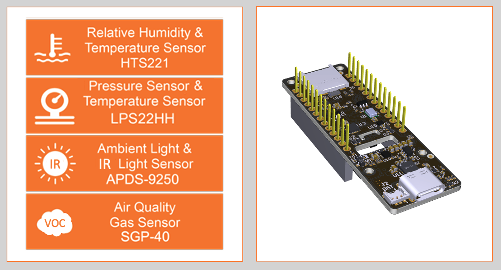

## Introduction

This tutorial will develop a model based on the data captured with the [Sony Spresense](https://www.sony-semicon.com/en/products/spresense/index.html) sensor extention board, [SensiEDGE's CommonSense](https://www.sensiedge.com/commonsense). 

The general idea is to explore sensor fusion techniques, capturing environmental data such as temperature, humidity, and pressure, adding light and VOC (Volatile Organic Compounds) data to estimate what room the device is located within.

We will develop a project where our "smart device" will indicate where it is located among four different locations of a house:

- Kitchen, 
- Laboratory (Office), 
- Bathroom, or 
- Service Area

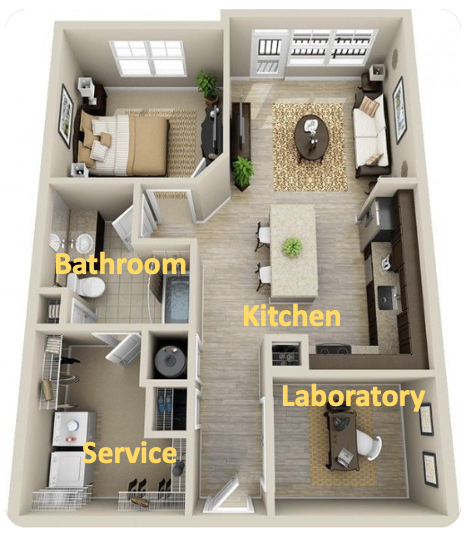

**The project will be divided into the following steps:**

1. Sony's Spresense main board installation and test (Arduino IDE 2.x)
2. Spresense extension board installation and test (Arduino IDE 2.x)
3. Connecting the CommonSense board to the Spresense
4. Connecting the CommonSense board to the Edge Impulse Studio
5. Creating a Sensor Log for Dataset capture
6. Dataset collection 
7. Dataset Pre-Processing (Data Curation)
8. Uploading the Curated data to Edge Impulse Studio
9. Training and testing the model
10. Deploying the trained model on the Spresense-CommonSense board
11. Doing Real Inference
12. Conclusion

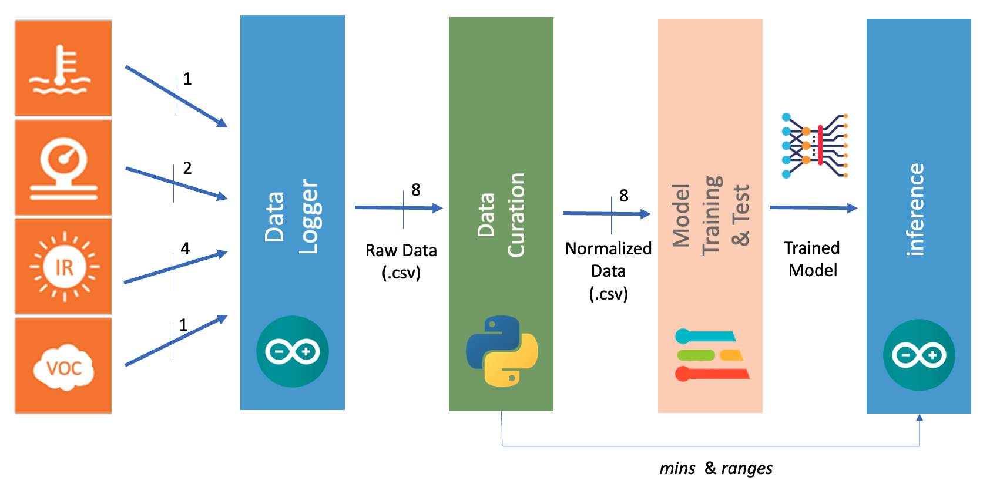

## Sony's Spresense Installation (Arduino IDE 2.x)

You can [follow this link](https://developer.sony.com/spresense/development-guides/arduino_set_up_en.html) for a more detailed explanation. 

1. Installing USB-to-serial drivers (CP210x)

Download and install the USB-to-serial drivers that correspond to your operating system from the following links:

[CP210x USB to serial driver (v11.1.0) for Windows 10/11](https://github.com/sonydevworld/spresense-hw-design-files/raw/master/misc/usb-to-uart-bridge-vcp-drivers/CP210x_Universal_Windows_Driver-v11.1.0.zip)
[CP210x USB to serial driver for Mac OS X](https://www.silabs.com/documents/public/software/Mac_OSX_VCP_Driver.zip)

If you use the latest Silicon Labs driver (v11.2.0) in a Windows 10/11 environment, USB communication may cause an error and fail to flash the program. Please download v11.1.0 from the above URL and install it.

2. Install Spresense Arduino Library

Copy and paste the following URL into the field called Additional Boards Managers URLs:

`https://github.com/sonydevworld/spresense-arduino-compatible/releases/download/generic/package_spresense_index.json`


3. Install Reference Board:

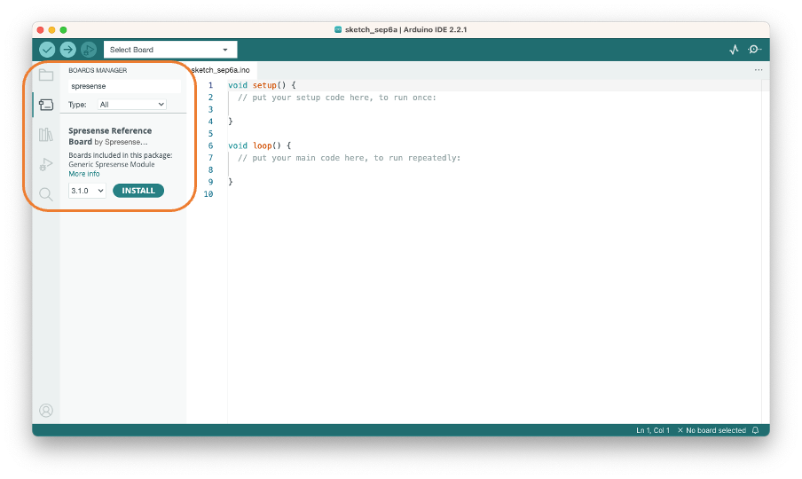

4. Select Board and Port

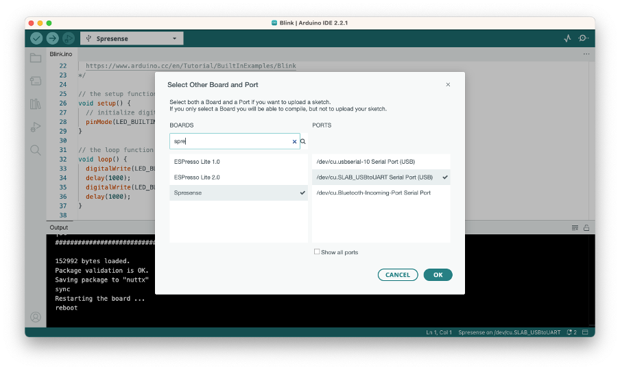

The Board and port selection can also be done by selecting them on the Top Menu: 


5. Install BootLoader

5.1 Select Programmer → Spresense Firmware Updater


5.2 Select Burn Bootloader

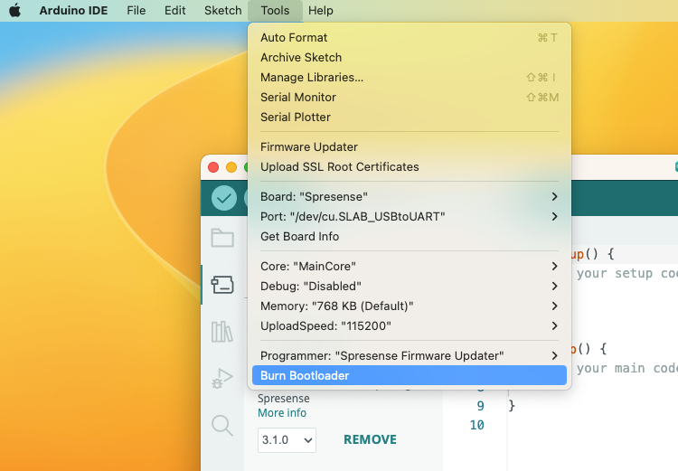

During the process, it will be necessary to accept the License agreement.

### Testing Installation

Run the BLINK sketch on Examples → Basics → Blink.ino

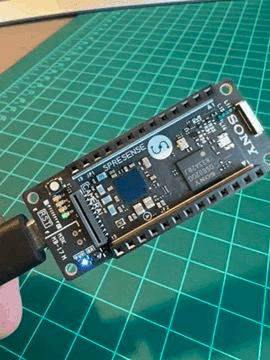

Testing with all the 4 LEDs:

The Spresense Main board has 4 LEDs. The BUILTIN is LED0 (the far right one). But each one of them can be accessed individually. Run the code below:

```
void setup() {
    pinMode(LED0, OUTPUT);
    pinMode(LED1, OUTPUT);
    pinMode(LED2, OUTPUT);
    pinMode(LED3, OUTPUT);
}
void loop() {
    digitalWrite(LED0, HIGH);
    delay(100);
    digitalWrite(LED1, HIGH);
    delay(100);
    digitalWrite(LED2, HIGH);
    delay(100);
    digitalWrite(LED3, HIGH);
    delay(1000);
    digitalWrite(LED0, LOW);
    delay(100);
    digitalWrite(LED1, LOW);
    delay(100);
    digitalWrite(LED2, LOW);
    delay(100);
    digitalWrite(LED3, LOW);
    delay(1000);
}
```

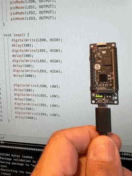

## Installing the Spresense Extension Board

**Main Features:**

Audio input/output - 4ch analog microphone input or 8ch digital microphone input, headphone output
Digital input/output - 3.3V or 5V digital I/O
Analog input - 6ch (5.0V range)
External memory interface - microSD card slot

It is important to note that the Spresense main board is a low-power device running on 1.8V (including I/Os). So, installing the main board on the extension board, which has an Arduino UNO form factor and accepts up to 5V on GPIOs, is advised. Besides, the microSD card slot will be used for our Datalog. 

### How to Attach the Spresense Extension Board and the Main Board

The package of the Spresense board has 4 spacers to attach the Spresense main board.


Insert them on the Extention board and connect the main board as below:

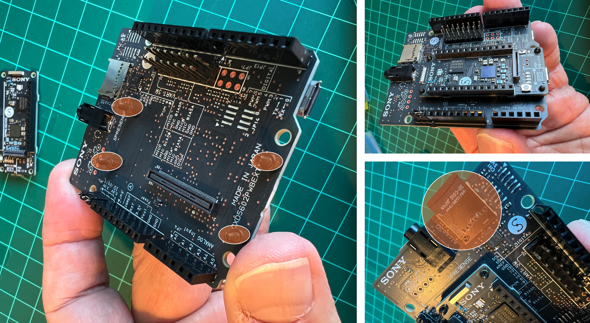

Once the Main Board is attached to the Extension Board, insert an SD card (Formated as FAT32).

### Testing the SD Card Reader

Run: Examples → File → read_write.ino under Espressif.

You should see the messages on the Serial Monitor showing that "testando…" was written on the SD card. Remove the SD card and check it on your computer. Note that I gave my card the name DATASET. Usually, for new cards, you will see, for example, NO NAME.

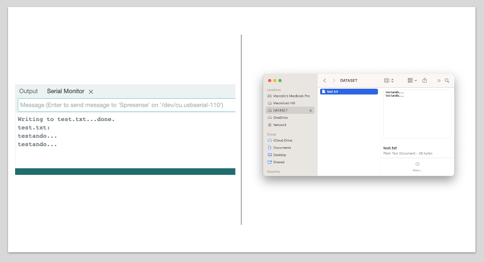

## Installing the SensiEDGE's CommonSense Board

The CommonSense expansion board, produced by SensiEDGE, provides an array of new sensor capabilities to Spresense, including an accelerometer, gyroscope, magnetometer, temperature, humidity, pressure, proximity, ambient light, IR, microphone, and air quality (VOC). As a user interface, the board contains a buzzer, a button, an SD card reader, and a RGB LED. 

The CommonSense board also features an integrated rechargeable battery connection, eliminating the necessity for a continuous power supply and allowing finished products to be viable for remote installations where a constant power source might be challenging to secure.

Below is a block diagram showing the board's main components:


Note that the sensors are connected via the I2C bus, except for the digital microphone. 

So, before installing the board, let's map the Main Board I2C. Run the sketch: Examples → Wire → I2CScanner.ino under Espressif in the Arduino IDE. On the Serial Monitor, we confirm that there are no I2C devices installed:

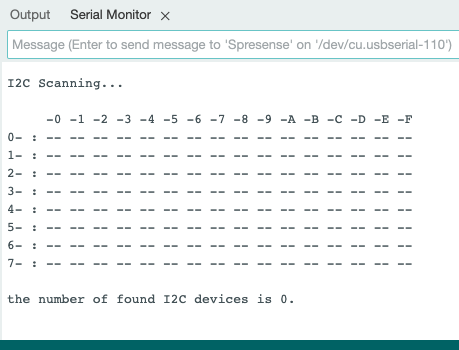

Now, connect the CommonSense board on top of the Spresense main board as shown below:

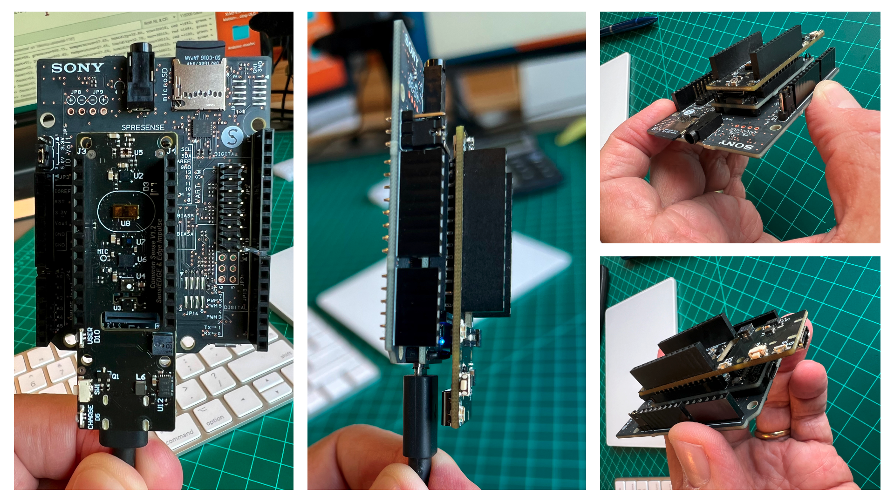

Reconnect the Mainboard to your Computer (use the Spresense Main Board USB connector), and run the I2C mapping sketch once again. As a result, now, 12 I2C devices are found:

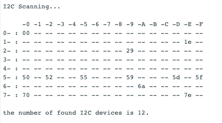

For example, for the SGP40 (VOC sensor) address is 0x59, the APDS-9250 (Light sensor) is 0x52, the HTS221 (Temp& Hum sensor) is 0x5F, the LPS22HH (Pressure sensor) is 0x5D, the VL53L1X (Distance sensor) is 0x29, the LSM6DSOX (Acc & Gyro) is 0x6A, the LIS2MDL (Magnetometer) is 0x1E and so on. 

We have confirmed that the main MCU recognizes the sensors on the CommonSense board. Now, it is time to access and test them. For that, we will connect the board to the Edge Impulse Studio.

## Connecting the CommonSense Board to the Edge Impulse Studio

Go to [EdgeImpulse.com](http://studio.edgeimpulse.com/), create a Project, and connect the device:

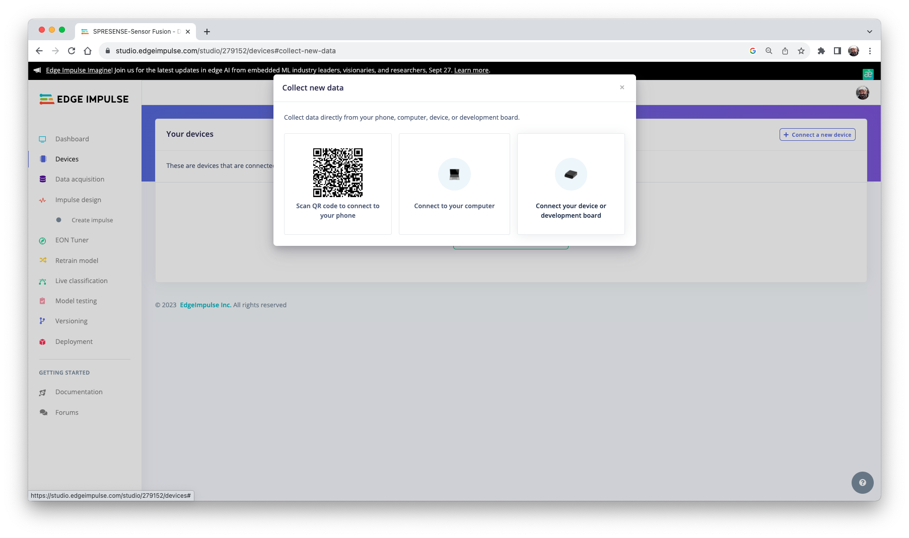

Search for supported devices and click on Sony's Spresense:


On the page that opens, go to the final portion of the document: [Sensor Fusion with Sony Spresense and SensiEDGE CommonSense](https://docs.edgeimpulse.com/docs/development-platforms/officially-supported-mcu-targets/sony-spresense#sensor-fusion-with-sony-spresense-and-sensiedge-commonsense), and download the latest Edge Impulse Firmware for the CommonSense board: [https://cdn.edgeimpulse.com/firmware/sony-spresense-commonsense.zip](https://cdn.edgeimpulse.com/firmware/sony-spresense-commonsense.zip).

Unzip the file and run the script related to your Operating System:

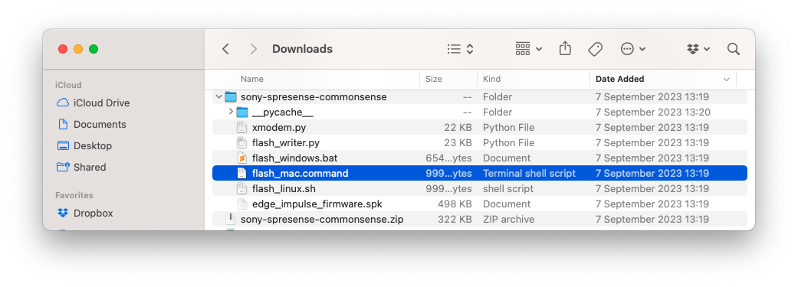

And flash your board:

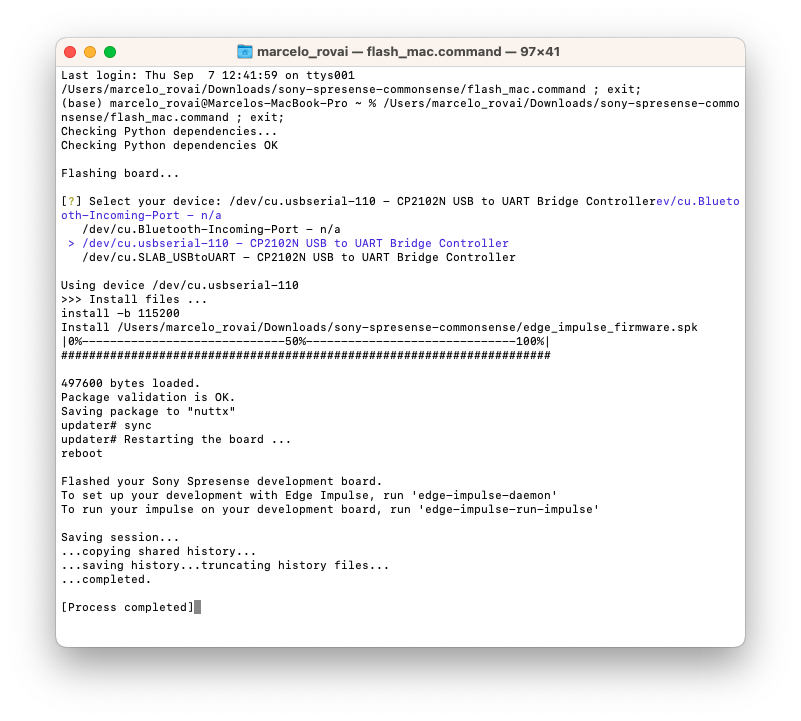

Run the Edge Impulse CLI and access your project:

```
edge-impulse-daemon –-clear
```

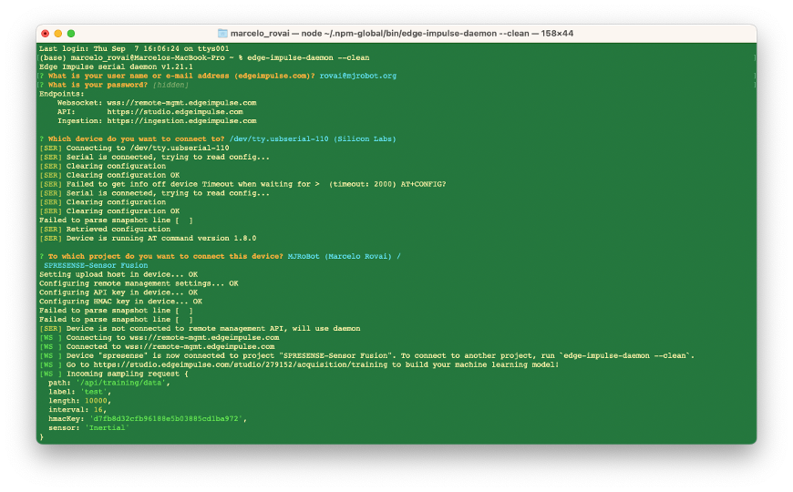

Returning to your project, on the Devices Tab, you should confirm that your device is connected:

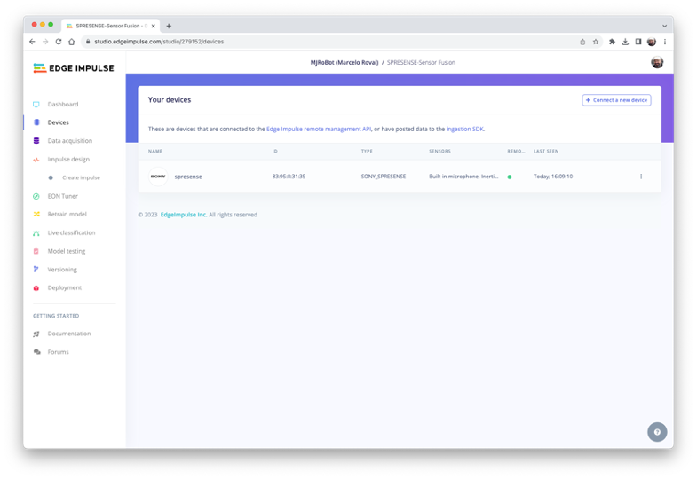

You can select all sensors individually or combined on the Data Acquisition Tab.

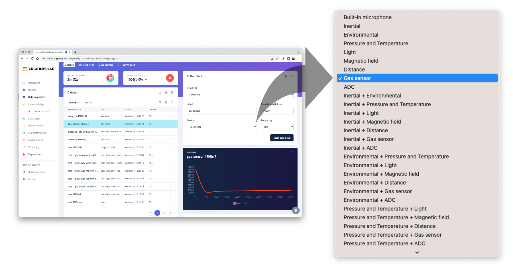

For example:

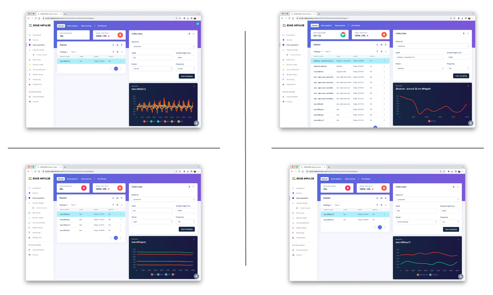

It is possible to use the Studio to collect data online, but we will use the Arduino IDE to create a Datalogger that can be used offline and not connected to our computer. The dataset can be uploaded later as a .CSV file. 

## Creating a Sensor Datalogger

### Installing the Sensor Libraries on the Arduino IDE

For our project, we will need to install the libraries for the following sensors:

- VOC - SGP40
- Temperature & Humidity - HTS221TR
- Pressure - LPS22HH
- Light - APDS9250

Below are the required libraries: 

1. APDS-9250: Digital RGB, IR, and Ambient Light Sensor 
Download the Arduino Library and install it (as .zip): [https://www.artekit.eu/resources/ak-apds-9250/doc/Artekit_APDS9250.zip](https://www.artekit.eu/resources/ak-apds-9250/doc/Artekit_APDS9250.zip)

2. HTS221 Temperature & Humidity Sensor
Install the STM32duino HTS221 directly on the IDE Library Manager

3. SGP40 Gas Sensor
Install the Sensrion I2C SGP40

4. LPS22HH Pressure Sensor
Install the STM32duino LPS22HH

5. VL53L1X Time-of-Flight (Distance) Sensor (optional*)
Install the VLS53L1X by Pololu

6. LSM6DSOX  3D accelerometer and 3D gyroscope Sensor (optional*)
Install the Arduino_LSM6DSOX by Arduino

7. LIS2MDL - 3-Axis Magnetometer Sensor (optional*) 
Install the STM32duino LIS2MDL by SRA

*We will not use those sensors here, but I listed them in case they are needed for another project. 

### The Datalogger Code

The code is simple. On a specified interval, the data will be stored on the SD card with a sample frequency specified on the line:

```
#define FREQUENCY_HZ 0.1
```

For example, I will have a new log each 10s in my data collection. 

Also, the built-in LED will blink for each correct datalog, helping to verify if the device is working correctly during offline operation. 

```
#include <Arduino.h>
#include <SDHCI.h>
#include <File.h>
#include <LPS22HHSensor.h>
#include <HTS221Sensor.h>
#include <SensirionI2CSgp40.h>
#include <Artekit_APDS9250.h>
#include <Wire.h>
// Definitions for SD Card
SDClass SD; 
File myFile;
// Definitions for LPS22HH
#define dev_interface       Wire
LPS22HHSensor PressTemp(&dev_interface);
// Definitions for HTS221
HTS221Sensor  HumTemp(&dev_interface);
// Definitions for SGP40
SensirionI2CSgp40 sgp40;
// Definitions for APDS9250
Artekit_APDS9250 myApds9250;
#define FREQUENCY_HZ        0.1
#define INTERVAL_MS         (1000 / (FREQUENCY_HZ))
static unsigned long last_interval_ms = 0;
static unsigned long sample_time = 0;
void setup()
{
  Serial.begin(115200);
  while (!Serial) {}
  
  // Initialize LED
  pinMode(LED_BUILTIN, OUTPUT);
  
  // Initialize I2C bus.
  dev_interface.begin();
  Wire.begin();


  // Initialize HTS221
  HumTemp.begin();
  HumTemp.Enable();
  
  // Initialize LPS22HH
  PressTemp.begin();
  PressTemp.Enable();
  
  // Initialize SGP40
  sgp40.begin(Wire);


  // Initialize APS9250
  myApds9250.begin();
  myApds9250.setMode(modeColorSensor);
  myApds9250.setResolution(res18bit);
  myApds9250.setGain(gain1);
  myApds9250.setMeasurementRate(rate100ms);
  
   // Initialize SD 
  Serial.print("Insert SD card.");
  if (!SD.begin(4)) {
    Serial.println("SD Error");
    return;
  }
  Serial.println("SD Started");
  if(!SD.exists("datalog.csv"))
  {
      myFile = SD.open("datalog.csv", FILE_WRITE);
      if (myFile) {
        myFile.println("count,pres,temp,humi,voc,red,green,blue,ir");
        myFile.close();
      } else {
        Serial.println("Error creating datalog.csv");
      }
  }
}

int cnt = 0;


void loop()
{
  if (millis() > last_interval_ms + INTERVAL_MS) {
    digitalWrite(LED_BUILTIN, HIGH);
    last_interval_ms = millis(); 
    myFile = SD.open("datalog.csv", FILE_WRITE);
    
    if (myFile) { 
      logData();
      cnt = cnt+1;
      digitalWrite(LED_BUILTIN, LOW);
    } else {
      Serial.println("Error opening file");
    }
  }
} 


void logData(){

  float pressure, temp;
  PressTemp.GetPressure(&pressure);
  PressTemp.GetTemperature(&temp);
  
  float humidity;
  HumTemp.GetHumidity(&humidity);
  
  uint16_t defaultRh = 0x8000;
  uint16_t defaultT = 0x6666;
  uint16_t srawVoc = 0;
  uint16_t error = sgp40.measureRawSignal(defaultRh, defaultT, srawVoc);
  
  uint32_t red, green, blue, ir;
  myApds9250.getAll(&red, &green, &blue, &ir);
  
  Serial.print("Writing to datalog.csv");
  myFile.print(cnt);
  myFile.print(",");
  myFile.print(pressure);
  myFile.print(",");
  myFile.print(temp);
  myFile.print(",");
  myFile.print(humidity);
  myFile.print(",");
  myFile.print(srawVoc);
  myFile.print(",");
  myFile.print(red);
  myFile.print(",");
  myFile.print(green);
  myFile.print(",");
  myFile.print(blue);
  myFile.print(",");
  myFile.println(ir);
  myFile.close();
  
  /* For tests only
  
  Serial.print(" ==> Count=");
  Serial.print(cnt);
  Serial.print(", pressure=");
  Serial.print(pressure);
  Serial.print(", temperature=");
  Serial.print(temp);
  Serial.print(", humidity=");
  Serial.print(humidity);
  Serial.print(", voc=");
  Serial.print(srawVoc); 
  Serial.print(", red =");
  Serial.print(red);
  Serial.print(", green =");
  Serial.print(green);
  Serial.print(", blue =");
  Serial.print(blue);
  Serial.print(", ir =");
  Serial.println(ir);
  */
}
```

Here is how the data will be shown on the Serial Monitor (for testing only). 

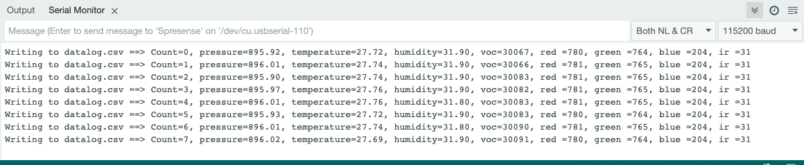

## Dataset Collection

The data logger will capture data from the eight sensors (pressure, temperature, humidity, VOC, light-red, light-green, light-blue, and IR). I have captured around two hours of data (one sample every 10 seconds) in each housing area (Laboratory, Bathroom, Kitchen, and Service Area). 

The CommonSense device worked offline and was powered by a 5V Powerbank as shown below: 

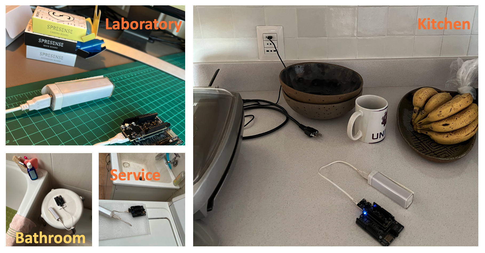

Here the raw dataset, shown in the SD card:

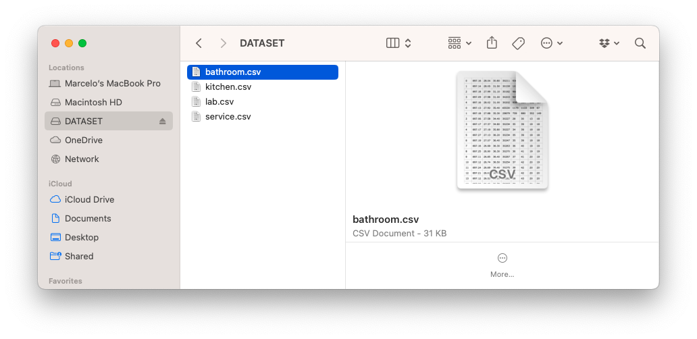

## Uploading the Data to Edge Impulse Studio

As a first test, I uploaded the data to the Studio using the "CSV Wizard" tool. I also left it to the Studio to split the data into Train and Test data. Once the TimeStamp column of my raw data was a sequential number, the Studio considered the sampled frequency, 1Hz, which is OK.

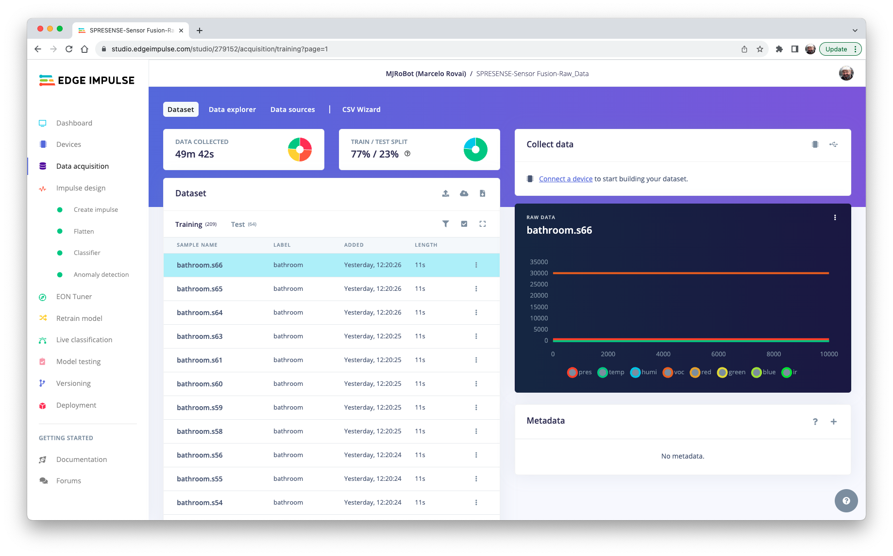

For the Impulse, I considered a window of 3 samples (here 3,000 ms) with a slice of 1 sample (1,000 ms). As a Processing Block, "Flatten" was chosen; as this block changes an axis into a single value, it is helpful for slow-moving averages like the data we are capturing. For Learning, we will use "Classification" and Anomaly Detection (this one only for testing). 

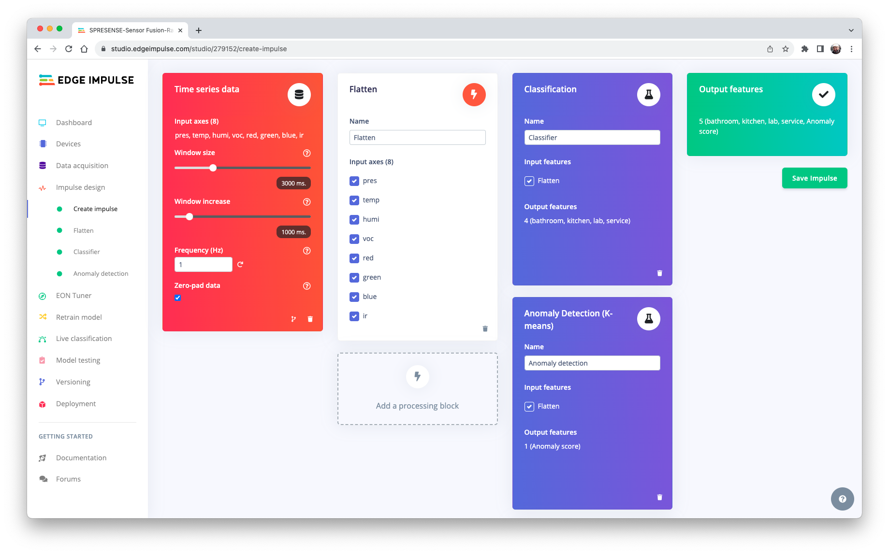

For Pre-Processing, we will choose as parameters Average, Minimum, Maximum, RMS, and Standard Deviation, applied for each one of the data points. So, the original 24 Raw Features (3 multiplied by 8 sensors) will result in 40 features (5 parameters per each of the original eight sensors). 

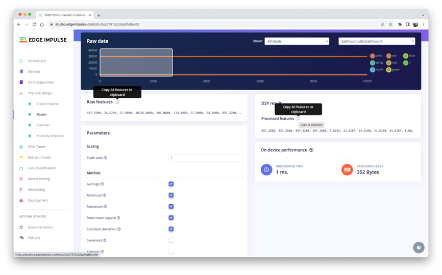

The final generated features seem promising, with a good visual separation from the data points:

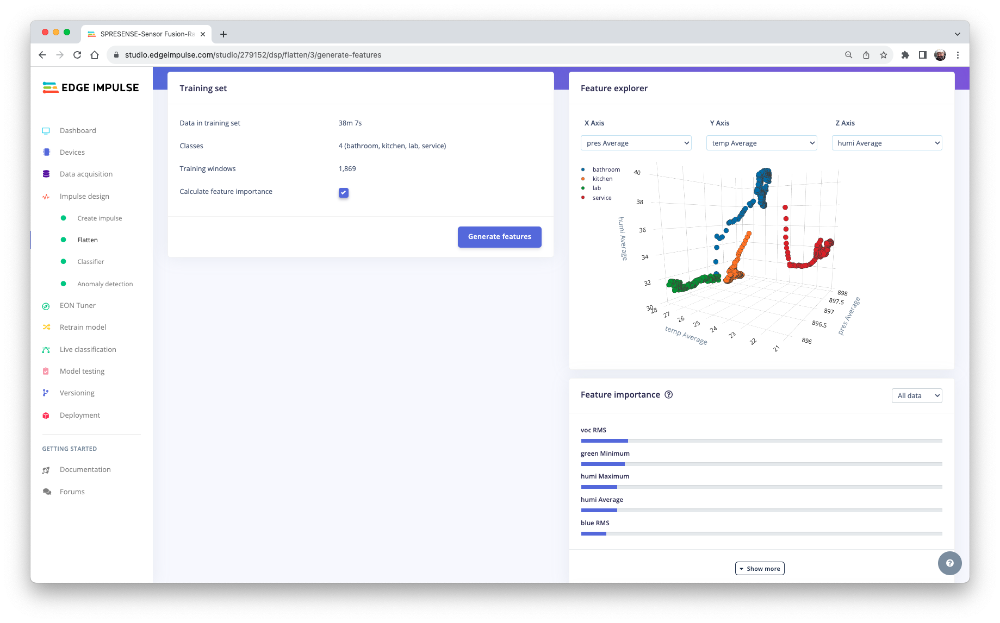

Now, it is time to define our Classification Model and train it. A simple DNN model with 2 hidden layers was chosen, and as main hyper-parameters, 30 Epochs with a Learning Rate (LR) of 0.0005. 


**The result: a complete disaster!**

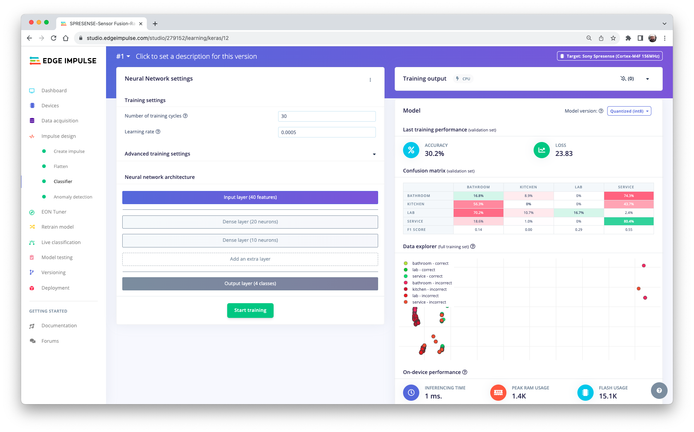

Let's examine why:

First, all the steps defined and performed in the Studio are correct. The problem is with the raw data that was uploaded. In tasks like sensor fusion, where data from multiple sensors, each with its measurement units and scales, are combined to create a more comprehensive view of a system, normalization and standardization are crucial preprocessing steps in a machine learning project.

So, previously, to upload the data to the Studio, we should "curate the data", or, better, normalize or standardize our sensor data to ensure faster model convergence, better performance, and more reliable sensor fusion outcomes.

## Curating the Dataset

In the tutorial "[Using Sensor Fusion and Machine Learning to Create an AI Nose](https://www.digikey.com/en/maker/projects/how-to-make-an-ai-powered-artificialnose/3fcf88a89efa47a1b231c5ad2097716a)", Shawn Hymel explains how to have a sound Sensor Fusion project. In this project, we will follow his advice. 

Use the notebook `[data_preparation.ipynb](https://github.com/Mjrovai/Sony-Spresense/blob/main/notebooks/Spresence-CommonSense/data_preparation.ipynb)` for data curation, following the steps:

### Download, Analyze, and clean Raw Data

- Open the Notebook on Google Colab
- Open the File Manager on the left panel, go to the "three dots"  menu, and create a new folder named "data"
- On the data folder, go to the three dots menu and choose "upload"
- Select the raw data .csv files on your computer. They should appear in the Files directory on the left panel

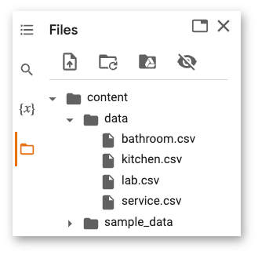

Create four data frames, one for each file:

**bath** → bathroom - Shape: (728, 9)
**kit** → kitchen - Shape: (770, 9) 
**lab** → lab - Shape: (719, 9) 
**serv** → service - Shape: (765, 9) 

Here is what one of them looks like: 

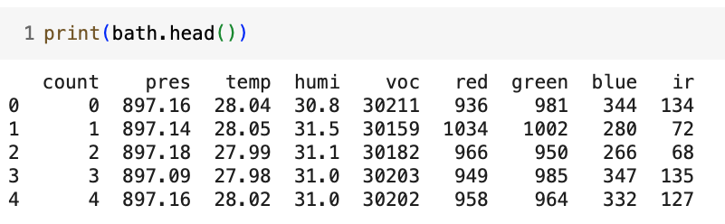

Plotting the data, we can see that the initial data (around ten samples) present some instability.

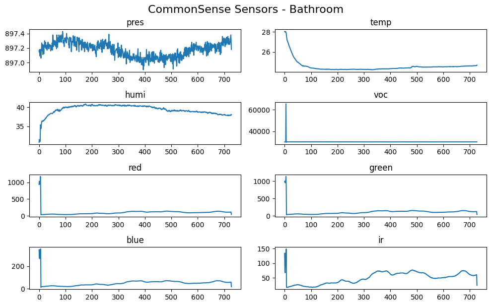

So, we should delete them.  Here is what the final data looks like:


We should proceed with the same cleaning for all 4 data frames.

### Splitting Data and Creating Single Datasets

We should split data into Train and Test at this early stage, because we should later apply the standardization or normalization to Test data with the Train data parameters.

To start, let's create a new column with the corresponding label.

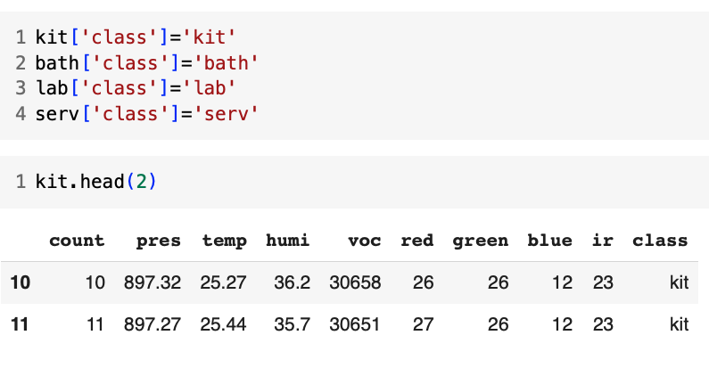

We will put apart 100 data points from each dataset for testing later.

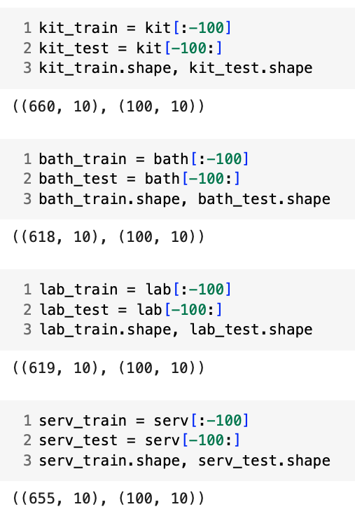

And concatenating each data frame in two single datasets for Train and Test:

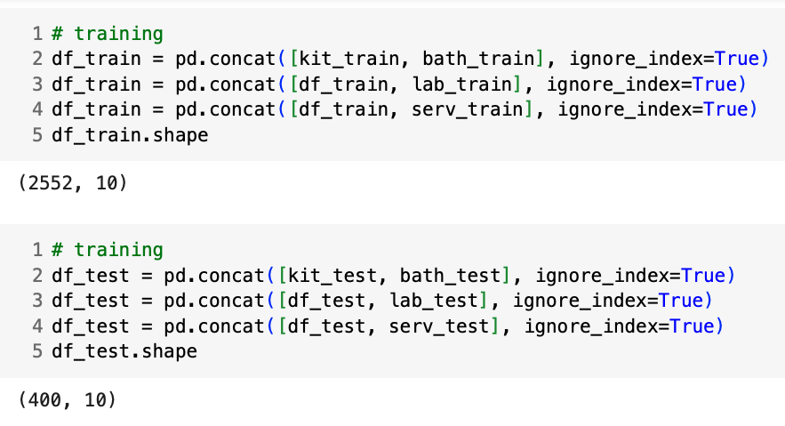

We should plot pairwise relationships between variables within a dataset using the function "plot_pairplot()". 

Looking at the sensor measurements on the left, we can see that each sensor's data ranges on very different values. So, we need to standardize or normalize each one of the numerical columns. But what technique should we use? Looking at the plot's diagonal, it is possible to see that the data distribution for each sensor does not follow a normal distribution, so **Normalization** should be the best option in this case.

Also, the data related to the light sensors (red, green, blue, and IR) correlate significantly (the plot appears as a diagonal line). This means that only one of those features should be used (or a combination of them). Leaving them separated will not damage the model; it will only make it a little bigger. But as the model is small, we will leave those features.

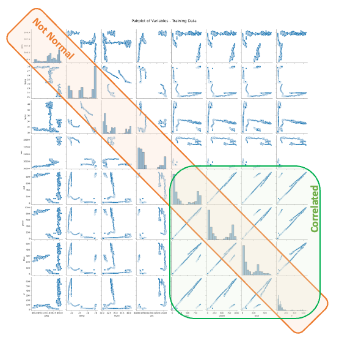

### Normalizing Data

We should apply the normalization to the numerical features of the training data, saving as a list the mins and ranges found for each column.  Here is the function used to Normalize the train data:

```
def normalize_train_data(df):
    """
    Normalizes the numerical features of a dataset and returns a tuple     
    containing three elements:
    1. The normalized data
    2. A list of the mins of each column.
    3. A list of the ranges of each column.
    """
    mins=[]
    ranges=[]
    # get numerical features
    df_scaled = df.iloc[:, :-1]

    # apply normalization
    for column in df_scaled.columns:
        min = df_scaled[column].min()
        range = (df_scaled[column].max() - min)
        df_scaled[column] = (df_scaled[column] - min) / range

        # Collect min and range values
        mins.append(min)
        ranges.append(range)

    # Combine the normalized features and output into a new data frame
    df_scaled['class'] = df['class']

    return df_scaled, mins, ranges
```

Those same values (train mins and ranges) should be applied to the Test dataset. Remember that the Test dataset should be new data for the model, simulating "real data", meaning we do not see this data during Training. Here is the function that can be used:

```
def normalize_test_data(df, mins, ranges):
    # Select the numerical columns to be standardized
    numerical_cols = df.columns[0:-1]

    # normalizeize the numerical columns
    df[numerical_cols] = (df[numerical_cols] - mins) / ranges

    return df
```

Both files will have this format:

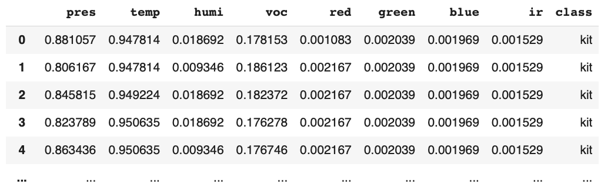

### Saving Datasets

The last step in the preparation should be saving both datasets (Train and Test) and also the train mins and ranges parameters to be used during inference.

```
scaled_train_df.to_csv("scaled_train_df.csv", index=False)
scaled_test_df.to_csv("scaled_test_df.csv", index=False)

with open("df_mins.txt", "w") as f:
for s in df_mins:
f.write(str(s) +"\n")

with open("df_ranges.txt", "w") as f:
for s in df_ranges:
f.write(str(s) +"\n")
```

Save the files to your computer using the option "Download" on the three dots menu in front of the four files on the left panel.

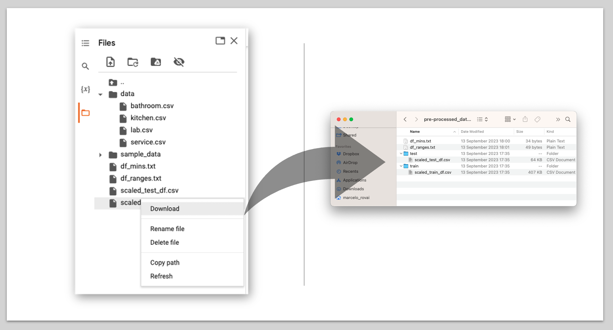

## Uploading the Curated Data to Edge Impulse Studio

As we did before, we should upload the curated data to the Studio using the "CSV Wizard" tool. Now, we will upload 2 separate files, Train and Data. When we saved the .csv file, we did not include a timeStamp (or count) column, so on the CSV Wizard, we should inform the sampled frequency (in our case, 0.1Hz).  I also left it to the Studio to define the labels, informing where they were located (column "class"). 

For the Impulse, I considered a window of 3 samples (here 3,000 ms) with a slice of 1 sample (1,000 ms). As a Processing Block, "Flatten" was chosen; as this block changes an axis into a single value, it is helpful for slow-moving averages like the data we are capturing. For Learning, we will use "Classification" and Anomaly Detection (this one only for testing). 

The main difference now, after we upload the files, is that the total Data collected time will show more than 8 hours, which is correct once I captured around 2 hours in each of my home rooms.

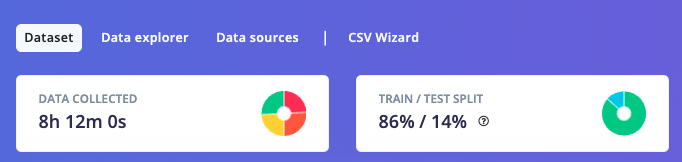

The Window size for the Impulse will now be 30,000 ms, equivalent to 3 samples. We will increase the Window each 1 ms. For Pre-Processing, we will choose as parameters Average, Minimum, Maximum, RMS, and Standard Deviation, applied for each one of the data points. So, the original 24 Raw Features (3 multiplied by eight sensors) will result in 40 features (5 parameters per each of the original eight sensors). 

The final generated features is very similar to what we got with the first version (Raw data).

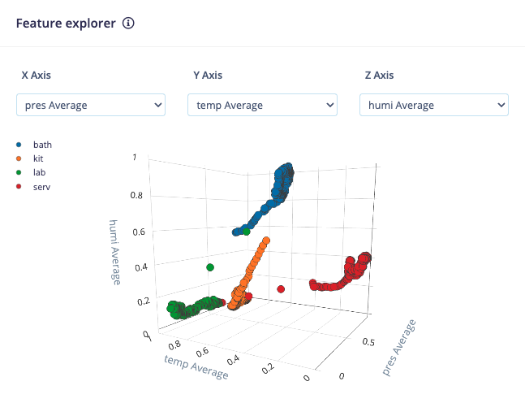

For the Classification Model definition and training, we will keep the same hyperparameters as before. A simple DNN model with 2 hidden layers was chosen and as main hyper-parameters, 30 Epochs with a Learning Rate (LR) of 0.0005. 

**And the result now was great!**

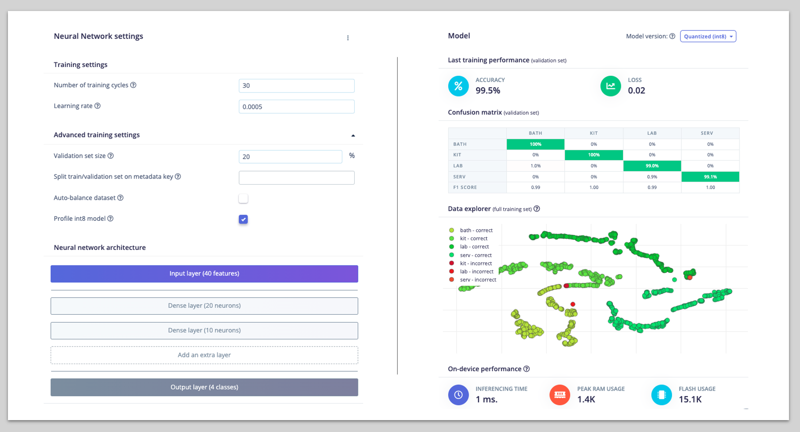

For the Anomaly Detection training, we used all RMS values. Confirm it by testing the model with the Test data, the result was very good again. Seems we have no issue with the Anomaly Detection. 

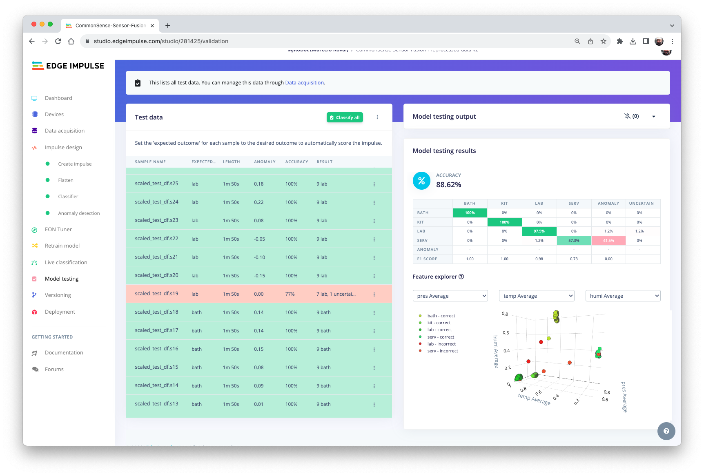

## Deploying the Model 

For Deployment, we will select an Arduino Library and a non-optimized (Floating Point) model. Again, the cost of memory and latency is very small, and we can afford it on this device. 

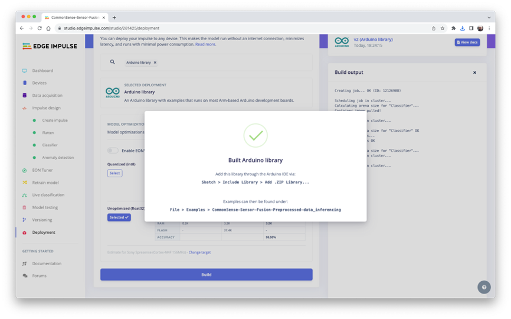

## Testing the Inference

To start, let's run the Static Buffer example. For that, we should select one Raw sample as our model input tensor (in our case, a data point from the Service Room (class: serv). This value should pasted on the line:

```
static const float features[] = {
0.8987, 0.1213, 0.3832, 0.8012, 0.5352, 0.5698, 0.6240, 0.4511, 0.9295, 0.1227, 0.3832, 0.7951, 0.5363, 0.5708, 0.6240, 0.4541, 0.9251, 0.1255, 0.3832, 0.7956, 0.5374, 0.5729, 0.6240, 0.4557
};
```

Connect the Spresesce Board to your computer, select the appropriate port, and upload the Sketch. On the Serial Monitor, you should see the Classification result showing **serv** with the right score. 

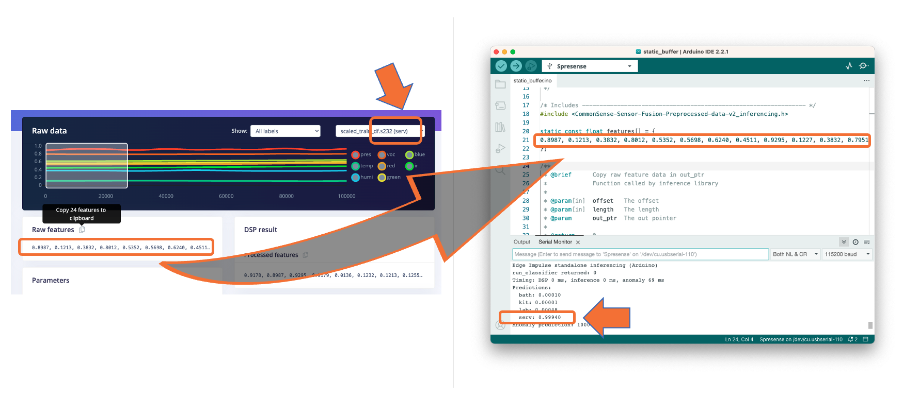

## Doing Real Inference

Based on the work done by Shawn Hymel, I adapted his code for using our Spresense-CommonSense board. The complete code can be found here: [Spresense-Commonsense-inference.ino](https://github.com/Mjrovai/Sony-Spresense/blob/main/code/Spresense-Commonsense-inference/Spresense-Commonsense-inference.ino)

Here is the code to be used: 

```
#include <Arduino.h>
#include <LPS22HHSensor.h>
#include <HTS221Sensor.h>
#include <SensirionI2CSgp40.h>
#include <Artekit_APDS9250.h>
#include <Wire.h>                              


// Edge Impulse Library
#include <CommonSense-Sensor-Fusion-Preprocessed-data-v2_inferencing.h> 

// Definitions for LPS22HH
#define dev_interface       Wire
LPS22HHSensor PressTemp(&dev_interface);
// Definitions for HTS221
HTS221Sensor  HumTemp(&dev_interface);
// Definitions for SGP40
SensirionI2CSgp40 sgp40;
// Definitions for APDS9250
Artekit_APDS9250 myApds9250;


// Settings
#define DEBUG               1           // 1 to print out debugging info
#define DEBUG_NN            false       // Print out EI debugging info
#define ANOMALY_THRESHOLD   0.3         // Scores above this are an "anomaly"
#define SAMPLING_FREQ_HZ    1             // Inference sampling frequency (Hz)
#define SAMPLING_PERIOD_MS  1000 / SAMPLING_FREQ_HZ // Inf. samp. period (ms)
#define NUM_SAMPLES         EI_CLASSIFIER_RAW_SAMPLE_COUNT // 3 sample @ 0.1 Hz
#define READINGS_PER_SAMPLE EI_CLASSIFIER_RAW_SAMPLES_PER_FRAME // 8


// above definitions come from model_metadata.h

// Preprocessing constants
float mins[] = {
  895.85, 21.02, 30.2, 30066, 5, 4, 1, 4
};
float ranges[] = {
  2.27, 7.10, 10.7, 2133, 954, 1000, 511, 659
};


void setup() {
  Serial.begin(115200);
  while (!Serial) {}
  
  // Initialize I2C bus.
  dev_interface.begin();
  Wire.begin();
  // Initialize HTS221
  HumTemp.begin();
  HumTemp.Enable();
  // Initialize LPS22HH
  PressTemp.begin();
  PressTemp.Enable();
  // Initialize SGP40
  sgp40.begin(Wire);
  // Initialize APS9250
  myApds9250.begin();
  myApds9250.setMode(modeColorSensor);
  myApds9250.setResolution(res18bit);
  myApds9250.setGain(gain1);
  myApds9250.setMeasurementRate(rate100ms);
}


void loop() {
  
  float pressure, temp;
  float humidity;
  uint16_t defaultRh = 0x8000;
  uint16_t defaultT = 0x6666;
  uint16_t srawVoc = 0;
  uint32_t red, green, blue, ir;
  unsigned long timestamp;
  static float raw_buf[NUM_SAMPLES * READINGS_PER_SAMPLE];
  static signal_t signal;
  int max_idx = 0;
  float max_val = 0.0;
  char str_buf[40];
  
  // Collect samples and perform inference
  for (int i = 0; i < NUM_SAMPLES; i++) {
    // Take timestamp so we can hit our target frequency
    timestamp = millis();
    
    // read from sensors
    PressTemp.GetPressure(&pressure);
    PressTemp.GetTemperature(&temp);
    HumTemp.GetHumidity(&humidity);
    uint16_t error = sgp40.measureRawSignal(defaultRh, defaultT, srawVoc);
    myApds9250.getAll(&red, &green, &blue, &ir);
    
    // Store raw data into the buffer
    raw_buf[(i * READINGS_PER_SAMPLE) + 0] = pressure;
    raw_buf[(i * READINGS_PER_SAMPLE) + 1] = temp;
    raw_buf[(i * READINGS_PER_SAMPLE) + 2] = humidity;
    raw_buf[(i * READINGS_PER_SAMPLE) + 3] = srawVoc;
    raw_buf[(i * READINGS_PER_SAMPLE) + 4] = red;
    raw_buf[(i * READINGS_PER_SAMPLE) + 5] = green;
    raw_buf[(i * READINGS_PER_SAMPLE) + 6] = blue;
    raw_buf[(i * READINGS_PER_SAMPLE) + 7] = ir;
    
    // Perform preprocessing step (normalization) on all readings in the sample
    for (int j = 0; j < READINGS_PER_SAMPLE; j++) {
      temp = raw_buf[(i * READINGS_PER_SAMPLE) + j] - mins[j];
      raw_buf[(i * READINGS_PER_SAMPLE) + j] = temp / ranges[j];
    }
    
    // Wait just long enough for our sampling period
    while (millis() < timestamp + SAMPLING_PERIOD_MS);
  }
  
   // Print out our preprocessed, raw buffer
#if DEBUG
  for (int i = 0; i < NUM_SAMPLES * READINGS_PER_SAMPLE; i++) {
    Serial.print(raw_buf[i]);
    if (i < (NUM_SAMPLES * READINGS_PER_SAMPLE) - 1) {
      Serial.print(", ");
    }
  }
  Serial.println();
#endif
  
  // Turn the raw buffer in a signal which we can the classify
  int err = numpy::signal_from_buffer(raw_buf, EI_CLASSIFIER_DSP_INPUT_FRAME_SIZE, &signal);
  
  if (err != 0) {
      ei_printf("ERROR: Failed to create signal from buffer (%d)\r\n", err);
      return;
  }
  // Run inference
  ei_impulse_result_t result = {0};
  err = run_classifier(&signal, &result, DEBUG_NN);
  if (err != EI_IMPULSE_OK) {
      ei_printf("ERROR: Failed to run classifier (%d)\r\n", err);
      return;
  }
  
  // Print the predictions
  ei_printf("Predictions ");
  ei_printf("(DSP: %d ms., Classification: %d ms., Anomaly: %d ms.)\r\n",
        result.timing.dsp, result.timing.classification, result.timing.anomaly);
  
  for (int i = 0; i < EI_CLASSIFIER_LABEL_COUNT; i++) {
    ei_printf("\t%s: %.3f\r\n", 
              result.classification[i].label, 
              result.classification[i].value);
  }
  
  // Print anomaly detection score
#if EI_CLASSIFIER_HAS_ANOMALY == 1
  ei_printf("\tanomaly acore: %.3f\r\n", result.anomaly);
#endif
  
  // Find maximum prediction
  for (int i = 0; i < EI_CLASSIFIER_LABEL_COUNT; i++) {
    if (result.classification[i].value > max_val) {
      max_val = result.classification[i].value;
      max_idx = i;
    }
  }
}
```

Upload the code to the device and proceed with the inference in the four locations (note: wait around 2 minutes for sensor stabilization):

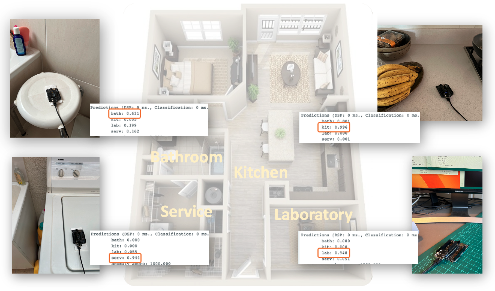

## Conclusion

SensiEDGE's CommonSense board is a good choice for developing machine learning projects that involve multiple sensors. It provides accurate sensor data and can be used for sensor fusion techniques. This tutorial went step by step on a successfully developed model to estimate the location of a device in different rooms of a house using the CommonSense board, Arduino IDE, and Edge Impulse Studio.

- All the code and notebook used in this project can be found in the [Project Repo: Sony-Spresense](https://github.com/Mjrovai/Sony-Spresense/tree/main).
- And the Edge Impulse Studio project [is located here: CommonSense-Sensor-Fusion-Preprocessed-data-v2](https://studio.edgeimpulse.com/public/281425/latest)


