# Fire Detection Using Sensor Fusion - Arduino Nano 33 BLE Sense

Created By: Solomon Githu

Public Project Link: [https://studio.edgeimpulse.com/public/487566/latest](https://studio.edgeimpulse.com/public/487566/latest)

GitHub Repo: [https://github.com/SolomonGithu/Arduino_Nano_33_BLE_Sense_fire_detection_using_sensor_fusion](https://github.com/SolomonGithu/Arduino_Nano_33_BLE_Sense_fire_detection_using_sensor_fusion)

## Introduction

Sensors are utilized in everything from personal computers, smartphones, cars, airplanes, industrial equipment, even modern fans and refrigerators contain sensors! For some use cases, simple computers are built with a single sensor. For example, a refrigerator will have a temperature sensor, automatic lights will use a motion sensor, a television will use an infrared sensor to receive commands from a remote, etc. However, for advanced use cases, there is need to gather data from multiple sensors so that the system can get a better understanding of the situation. This helps to reduce some uncertainties that come when using an individual sensor.

## Sensor Fusion, Simply Visualized

To understand sensor fusion, let us consider the image below. In the image, we can see two different scenarios. In the first, a lady is walking on the road and there is a billboard which shows a picture of candles. In the next scenario, we see a gentleman walking along a road that has fire. In these two situations, it is clear that the gentleman is walking on a dangerous path since there are "real" flames. The lady will simply look at the stunning candles, and continue walking. 

However, there are the AI-driven CCTV cameras in both scenarios. In this case, both cameras have used computer vision to detect the flames. Although flames may be seen in both circumstances, the candle flames are a picture and not an actual fire. Our brains naturally use multiple senses to better understand our surroundings. We can see a fire and determine if it is a real fire or an image, as in this scenario. However, how can computers have such comprehensive understanding? This is where sensor fusion comes in. In this scenario, optical vision cannot be used alone to determine whether or not there is a fire. The computer can use another input such as a temperature data; as a real fire will also have high temperatures, unlike the billboard representation of a fire. 

The idea is that each input (camera image and temperature value) has it's own strengths and weaknesses. The camera gives a visual understanding of the environment, and a temperature sensor will give environmental data. This is a complimentary based sensor fusion technique and the two independent sensors will have their outputs combined to give a complete assessment of the situation. If a fire is detected by the camera, and there are high temperatures, then the system can conclude that there is a "real" fire. At the same time, if the system records temperatures of around 500 degrees Celsius or more, it can suggest that there may be a fire nearby as the flames may not be visible but their temperature effect is felt.

## Project Use-Case Demonstration

One of our greatest fears is the danger of a fire in our homes, workplaces, on our properties, or even while we are inside vehicles. Although devices and algorithms have been created to detect fires, they have their limitations. In some cases, there are limitations that are obtained by using the vision sensors, while in others a smoke detector can fail to detect a fire if the smoke is not reaching the sensor.

To demonstrate sensor fusion, I trained a Machine Learning model to detect if an indoor fire is present using both image and environmental (temperature) data. I used a custom multi-input Convolutional Neural Network (CNN) model to classify if there is a fire or not. To achieve this, I utilized a [tensor slicing](https://www.tensorflow.org/guide/tensor_slicing) technique to work with sub-sections of tensors. Each input to the model consists of both an image and a corresponding scalar value (temperature). The model's input tensor is sliced into an image and temperature tensor. The outputs from these two tensors are then combined and processed further to produce an output (classification of the various classes). The tensor slicing technique is advantageous in this case as well because Edge Impulse does [not support multi-input models](https://forum.edgeimpulse.com/t/could-not-work-with-multi-input-tflite-model/7216) at the time of this writing. Finally, after training and testing the model, I used the [Edge Impulse](https://edgeimpulse.com/) platform to deploy the sensor fusion model to an [Arduino Tiny Machine Learning Kit](https://store.arduino.cc/products/arduino-tiny-machine-learning-kit).

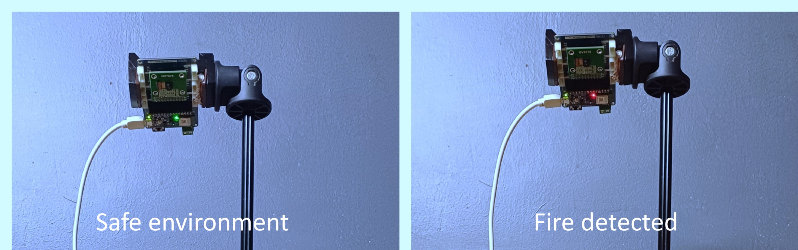

The Arduino Nano 33 BLE Sense board turns the onboard RGB LED to green while in a safe environment, and the RGB LED turns red when a fire is detected. The [Arduino TinyML Kit](https://store.arduino.cc/products/arduino-tiny-machine-learning-kit) has been used to obtain the training data for this project and also run inference. This TinyML Kit has an [Arduino Nano 33 BLE Sense](https://store-usa.arduino.cc/products/arduino-nano-33-ble-sense) and it features a powerful processor, the nRF52840 from Nordic Semiconductors, and a 32-bit ARM Cortex-M4 CPU running at 64 MHz. The Arduino Nano 33 BLE Sense also has onboard sensors for movement, acceleration, rotation, barometric pressure, temperature, humidity, sound, gesture, proximity, color, and light intensity. In addition, the kit also includes an OV7675 camera module and this makes it easy to develop and deploy image processing applications! For this use case, the TinyML Kit is a good choice since it has a camera, a temperature sensor and the ability to run optimized Machine Learning models on the Arduino board.

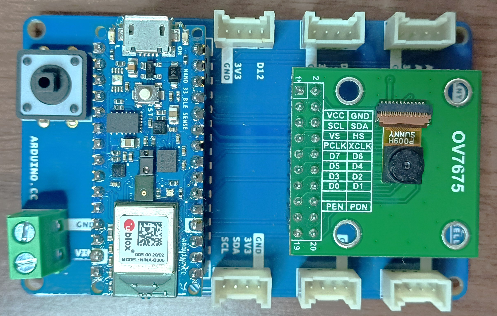

While this project could have been implemented using a more powerful hardware such as a GPU, AI accelerator, or a CPU, there have been huge advancements in hardware and software ecosystems enabling Machine Learning to be brought to the low-power resource-constrained devices like microcontrollers. Some problems don't need high performance computers to be solved. A small, low-cost and low-power device like an Arduino board can also get the job done! 

[Sensor fusion](https://docs.edgeimpulse.com/docs/tutorials/end-to-end-tutorials/sensor-fusion) on the Arduino Nano 33 BLE Sense has already been supported by Edge Impulse. However, in the [Data Acquisition](https://docs.edgeimpulse.com/docs/edge-impulse-studio/data-acquisition) there is no support for the Arduino Nano 33 BLE Sense to acquire data from both a camera and environmental sensors. The reason for this is because sensor fusion is complicated and there are many possible combinations for the sensors. In this case, merging camera and environmental data is a custom sensor fusion scenario. However, we will still use powerful tools from Edge Impulse to get the model performance on various hardware, optimize the model and also package the model as an Arduino library that we can include in our Sketches.

The image below shows the project flow from data acquisition, model training to deployment. In this project, I will also demonstrate how to use multi-input models with the [Edge Impulse platform](https://edgeimpulse.com/). The project's source files and dataset can be found in this [GitHub repository](https://github.com/SolomonGithu/Arduino_Nano_33_BLE_Sense_fire_detection_using_sensor_fusion).

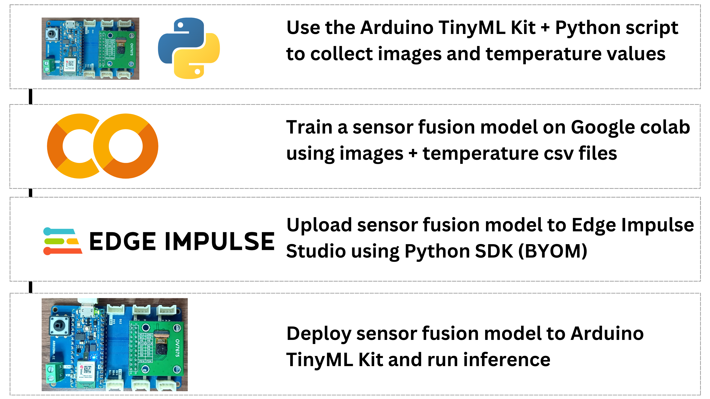

## Components and Hardware Configuration

Software components:
- Arduino IDE
- Python
- Google Colab 
- Edge Impulse Studio account

Hardware components:
- Arduino TinyML Kit
- A personal computer

## Data Collection Process

In this project, the Machine Learning model will be using an image and a temperature value as the inputs. The goal is to train a model to effectively classify if an environment has a fire or not. I created two classes for the different environments: `fire` and `safe_environment`. That being said, it sounded like an easy task.

First, I created an [Arduino sketch](https://github.com/SolomonGithu/Arduino_Nano_33_BLE_Sense_fire_detection_using_sensor_fusion/blob/main/33_BLE_Sense_get_image_and_temperature/33_BLE_Sense_get_image_and_temperature.ino) for the Arduino Nano 33 BLE Sense. The Arduino code records the room temperature using the onboard [HTS221](https://content.arduino.cc/assets/Nano_BLE_Sense_HTS221.pdf) temperature sensor and prints it via UART. Afterwards, the code captures an image using the OV7675 camera module. While working with the OV767X library, I realized that the code takes a very long time to capture an image. In this case, I modified the `nano_33ble_sense_camera.ino` camera example from Edge Impulse's [Arduino library](https://docs.edgeimpulse.com/docs/run-inference/arduino-library) deployment to capture an image. The Edge Impulse's Arduino camera code for the OV7675 has a custom driver that makes it faster to get image data from the camera. After an image has been captured, it is then encoded to base64. For this, I utilized the open-source [Edge Impulse's Arduino Nano 33 BLE Sense firmware](https://github.com/edgeimpulse/firmware-arduino-nano-33-ble-sense/blob/master/src/sensors/ei_camera.cpp). From the code, I used parts of the `take_snapshot` function to take a snapshot, encode it as base64 and print it to UART. With this code, the Arduino Nano 33 BLE Sense constantly samples a snapshot and temperature value, and they are then printed via UART (Serial). Note that it is not a good idea to send Strings via Serial due to memory leaks, but in this case I worked with Strings. The image width and height can be controlled with the variables `WIDTH` and `HEIGHT` respectively; the default image size is 240x240 pixels. Note that increasing the image dimensions will increase the time that the Arduino board will take to capture an image and also for the Python script to decode the base64 data and save it to a .JPG image.

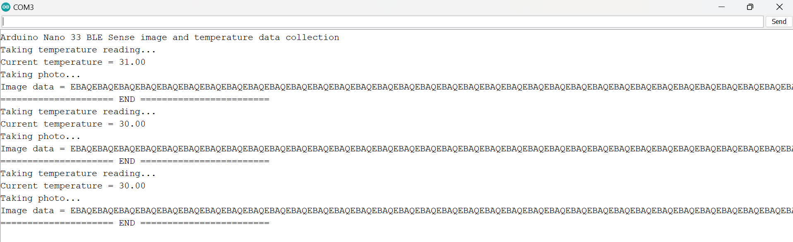

After the Arduino Sketch, I created a [Python script](https://github.com/SolomonGithu/Arduino_Nano_33_BLE_Sense_fire_detection_using_sensor_fusion/blob/main/read_and_save_serial_data.py) that reads the Serial messages from the Arduino board, processes them, decodes the base64 image data, and saves the image data as a .JPG image while the temperature value is saved in a .CSV file. To collect data for each class (environment) separately, the script can save the images and .CSV file in a folder named as the class. We can control the number of samples to be saved from the Serial data using the variable `number_of_samples_to_collect`. 

To use the Arduino code and Python scripts to create a dataset, we first upload the [Arduino code](https://github.com/SolomonGithu/Arduino_Nano_33_BLE_Sense_fire_detection_using_sensor_fusion/blob/main/33_BLE_Sense_get_image_and_temperature/33_BLE_Sense_get_image_and_temperature.ino) to an Arduino Nano 33 BLE Sense. Once the code is uploaded, we identify the COM port of the board and update the `SERIAL_PORT` variable accordingly in the [Python script](https://github.com/SolomonGithu/Arduino_Nano_33_BLE_Sense_fire_detection_using_sensor_fusion/blob/main/read_and_save_serial_data.py). Install the Python libraries on your computer using `pip install -r requirements.txt` and finally run the Python script with the command `python read_and_save_serial_data.py`. The Python script will automatically process the serial data, save photos as .JPG, and store temperature values in a .CSV file. The images are numerically numbered, and their file names are also put in the .CSV file, the same row as the temperature recorded at the moment the photo was taken.

Since fire is dangerous and difficult to control, I used an oven and a candle to collect data. The oven generates temperatures higher than the ambient room temperatures and this can be detected by a temperature sensor. The candles gives a flame which can be optically detected by a camera. Therefore, both sensors compliment each other. I secured the Arduino TinyML kit on a tripod stand and faced it to an oven. For the safe environment (safe_environment class), I had the oven switched off and the candle was not lit. In total, I collected 60 images and 60 temperature values that were ranging between 23 and 27 degrees Celsius. The images below show photos of how the Arduino board was placed next to an oven, an image that was captured and also the .CSV file with the temperature values and the class label.

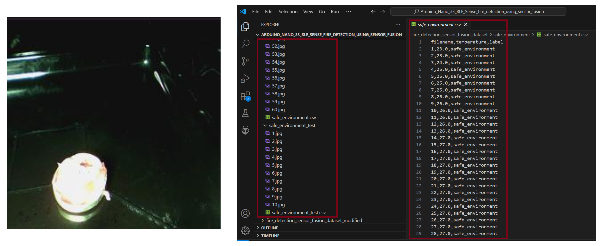

After collecting the data for the safe environment condition, I then turned on the oven and the candle was also lit. Safety precautions were also practiced and the gas inlet valve to the cooker was turned off! I then ran the Python script again as the Arduino board continued to sample the environment data. In the Python script, I set the `dataset_class` variable to `"fire"` and this makes the Python script save the images and .CSV file to a folder named `fire`. Since the HTS221 is only guaranteed to operate over a temperature range from -40 to +120 degrees Celsius, I did not put the Arduino board inside the oven to prevent overheating and damaging the board. In this case, the board recorded temperatures of 60 to 70 degrees Celsius while it was next to the oven, placed on the oven door.

Below is one of the images and the temperature values captured by the Arduino board when next to a hot oven and flaming candle.

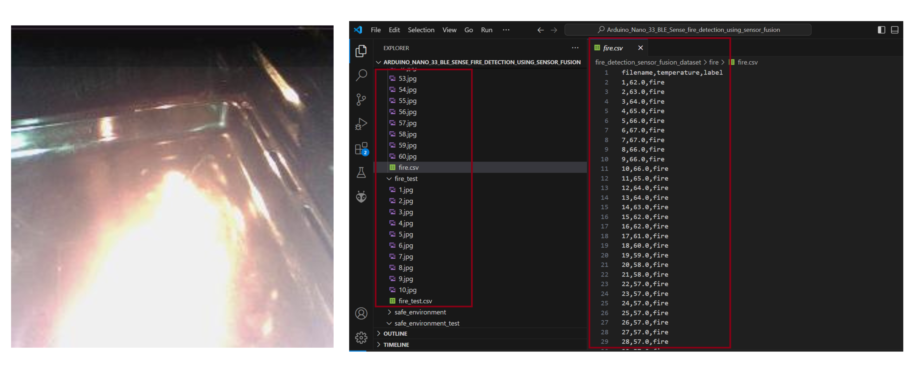

In this data acquisition, I wanted to make the model to understand the parameters that differentiate a safe environment and an environment that has fire. In my first attempt, I had a [dataset](https://github.com/SolomonGithu/Arduino_Nano_33_BLE_Sense_fire_detection_using_sensor_fusion/tree/main/fire_detection_sensor_fusion_dataset) that had fire temperatures ranging between 65 and 70 degrees Celsius, just as the Arduino board had obtained them. All the images for the fire class had a flame in them. As much as this is a good representation of the situation, it has some limitations. For one, after training the model, I saw that it was too biased with the fire class; any image that was not similar to the ones used for training was classified as a fire; even if the temperature value was as low as 20 degrees Celsius. In this case, I decided to [update the dataset](https://github.com/SolomonGithu/Arduino_Nano_33_BLE_Sense_fire_detection_using_sensor_fusion/tree/main/fire_detection_sensor_fusion_dataset_modified) for the `fire` class. I replaced half of the images and temperature values with the one's obtained in the `safe` environment class. In this case, the model was able to better understand the relationship between the two inputs. A fire can be seen but the temperature value being recorded is as low as 20 degrees. In this case, the temperature sensor may not be within a good range of the fire. At the same time in an environment with fire, no flames may be seen but the temperatures may be as high as 70 degrees. The flame may not be detected by the camera but the high temperature can be felt.

## Training and Building the Model

Once the Arduino and Python script have been used to gather the data, I developed this [notebook](https://github.com/SolomonGithu/Arduino_Nano_33_BLE_Sense_fire_detection_using_sensor_fusion/blob/main/notebook/fire_detection_sensor_fusion_model_training_and_deployment_with_EI_python_sdk.ipynb) on Google Colab to load the dataset and train the Machine Learning model. For this notebook, we only need to set the dataset source and put an [API key](https://docs.edgeimpulse.com/reference/edge-impulse-api/edge-impulse-api) for an Edge Impulse project. Once these two are set, we can run the entire notebook and the model will be trained, tested and profiled with the [Edge Impulse Python SDK](https://docs.edgeimpulse.com/docs/tools/edge-impulse-python-sdk). Once the profiling is completed, we can then open the Edge Impulse project and deploy the model.

First, let us go through the notebook. The first operation is to clone the [GitHub repository](https://github.com/SolomonGithu/Arduino_Nano_33_BLE_Sense_fire_detection_using_sensor_fusion) which also has the dataset for this demonstration project. Instead of this dataset, you can uncomment the first cell of the notebook (and comment the `git clone` command) to load a custom dataset folder on your Google Drive.

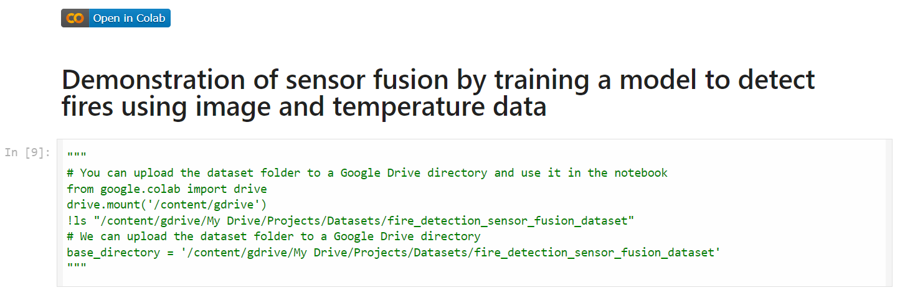

Next, the notebook installs the required dependencies, loads the .CSV files from the `fire` and `safe_environment` folders to a pandas data frame, defines the image parameters, and loads the images.

After experimenting with various image configurations, I settled with a grayscale image of 32 by 32 pixels. The reason for choosing this configuration is because increasing the image dimensions has several contributions to the performance of a model. A larger image will increase the number of parameters (features) of the model and this will require more memory.  Larger images also require more memory usage (RAM) and with the Arduino Nano 33 BLE Sense we only have 1MB of flash memory and 256KB of RAM. The computation time also increases as we increase the size of data to be processed. In my experiments, I found that while using a grayscale image of 48x48 pixels, the model had flash usage of 1.4MB, RAM usage of 333.5KB and processing time of 18981ms (18 seconds). While using a grayscale image of 40x40 pixels, I could not deploy the model to the Arduino Nano 33 BLE Sense because the final inference Sketch overflowed the available flash memory by 132344 bytes. Therefore, I settled on using a grayscale image of 32 by 32 pixels. 

For the model architecture, I developed a multi-input neural network to process the image data and an additional temperature (scalar) input. The model starts with a single input layer that combines the image data and the temperature value into one tensor. The input layer is then sliced into two parts: an image tensor that processes the image data, and a temperature tensor that processes the temperature value. The image branch consists of a series of convolutional layers and pooling layers that are applied to the image data, followed by flattening the result into a 1D tensor. A dense layer processes the temperature input in the temperature branch. The outputs from the image processing branch and the temperature processing branch are then concatenated. The concatenated tensor passes through a dense layer with dropout, and finally, an output layer with a softmax activation function for classification. The model is defined with the combined input layer and the final output, and then compiled with the Adam optimizer, categorical cross-entropy loss, and accuracy metric. 

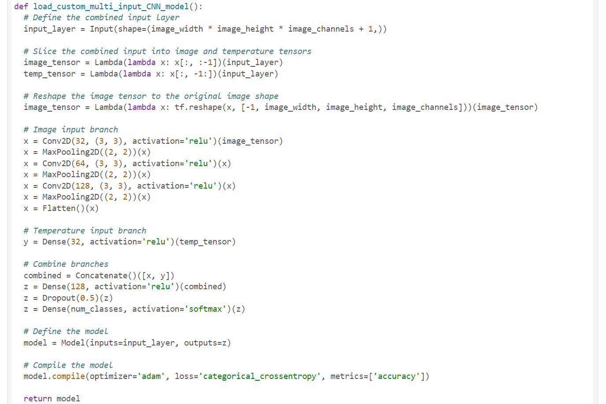

This kind of model architecture is known as [Tensor slicing](https://www.tensorflow.org/guide/tensor_slicing). In this case we use tensor slicing to split the tensors and put them back in the right order. This technique is also advantageous in this case as it enables us to integrate the multi-input model with the Edge Impulse platform.

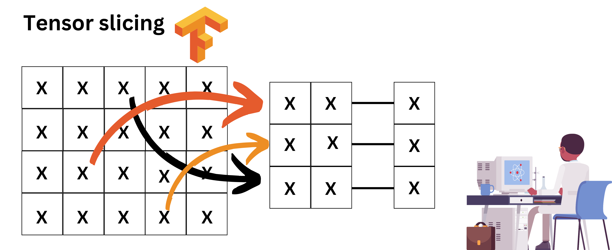

To get an API key for an Edge Impulse project, we can create a new project in the Edge Impulse Studio and then copy the generated API key. Afterwards, we need to paste the API key into the `ei.API_KEY` variable in the notebook.

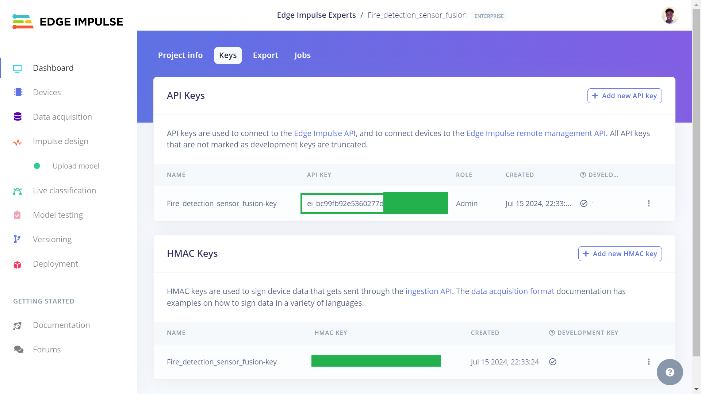

Having gained an understanding of the notebook's structure, on Google Colab, we can run the entire notebook by clicking **"Runtime"** and then **"Run all"**. The notebook will load the dataset, process the images and temperature values, train the model, test the model and finally profile the model using the Edge Impulse Python SDK. When creating the dataset, I saved some images and temperature values of the two classes in a Test dataset. The test data for the `safe_environment` class is in a [safe_environment_test](https://github.com/SolomonGithu/Arduino_Nano_33_BLE_Sense_fire_detection_using_sensor_fusion/tree/main/fire_detection_sensor_fusion_dataset_modified/safe_environment_test) folder, and the test data for the `fire` class is in a [fire_test](https://github.com/SolomonGithu/Arduino_Nano_33_BLE_Sense_fire_detection_using_sensor_fusion/tree/main/fire_detection_sensor_fusion_dataset_modified/fire_test) folder.

After training the model, the model achieved a validation accuracy of 100%. However, this does not imply that the model is perfect! In this case, the features that the model was classifying are simple, only 50 epochs were used, and the dataset had 120 images and 120 temperature values for training. To improve the model, we can add more data, update the model architecture and and increase the number of training cycles. For this demonstration however, I determined this is acceptable.

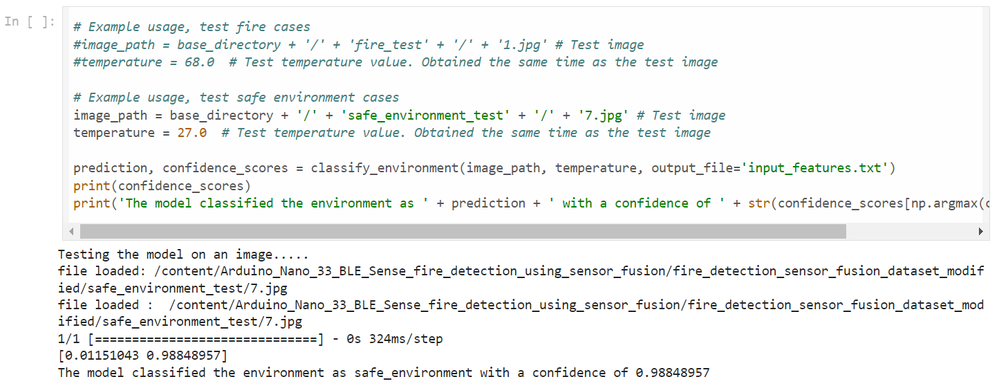

## Testing the Model in Edge Impulse Studio

After testing the model, the notebook uses the [Edge Impulse Python SDK](https://docs.edgeimpulse.com/docs/tools/edge-impulse-python-sdk) for profiling and this enables us to get RAM, ROM and inference times of our model on a wide range of hardware from MCUs, CPUs, GPUs and AI accelerated boards, incredibly fascinating! We can see the performance estimates for the Arduino Nano 33 BLE Sense in the screenshot below. Also, during this profiling, the model is uploaded to the Edge Impulse project. You can clone my public Edge Impulse project and access the model using this link: [Fire_detection_sensor_fusion](https://studio.edgeimpulse.com/public/487566/latest).

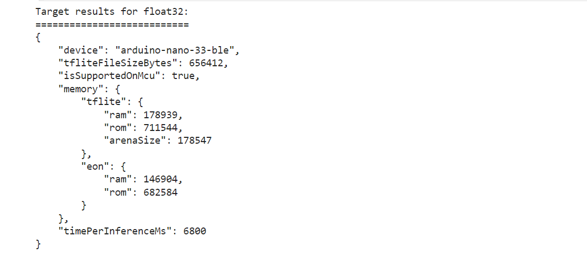

When we go to the Edge Impulse project, we will see "Upload model" under "Impulse design". This is because our final global model was uploaded to the project during profiling.

We first need to configure some parameters in the Edge Impulse project. Click **"Upload model"** and a new interface will open on the right side of the page. Here, we need to select **"Other"** for the model input. Next, we select **"Classification"** for model output since this is a classification model. Finally, in the output labels input box, we enter `fire, safe_environment`. Click **"Save model"** to finish the configuration.

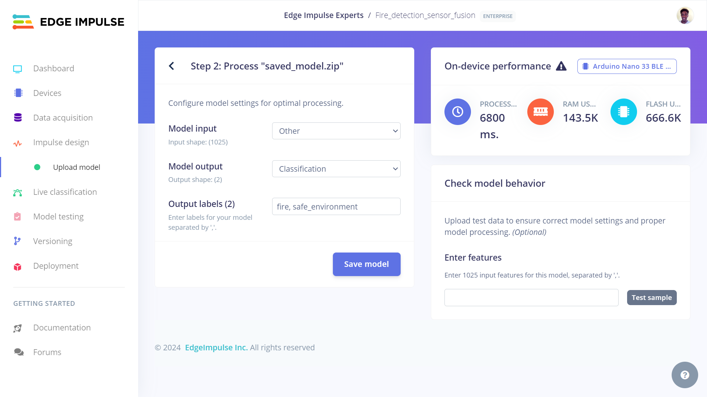

When the Google Colab notebook tests the model, it saves an array of the test image data and temperature value to a text file named `input_features.txt` which can be seen in the notebook files. We can copy the contents of the text file and paste them in the Edge Impulse project to test our model on the platform. In the screenshot below, we can see that the model classified the features to belong to the `fire` class and this was the correct classification.

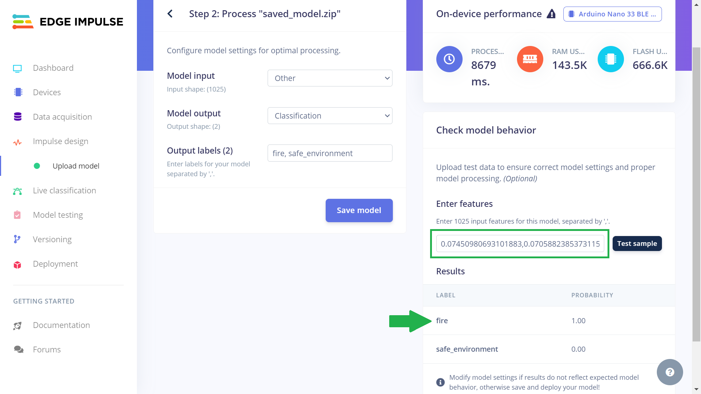

Once the model has been tested in the Edge Impulse Studio, we click **"Deployment"** and select **Arduino library** in "Search deployment options". This packages the Machine Learning model into a single package and we can include this in Arduino sketches to run the model locally. One fascinating feature that the Edge Impulse Studio gives us is the ability to optimize the model. In this case, we can use the [EON Compiler](https://docs.edgeimpulse.com/docs/edge-impulse-studio/deployment/eon-compiler). This is a powerful tool that compiles machine learning models into more efficient and hardware-optimized C++ source code. The feature supports a wide variety of neural networks trained in TensorFlow or PyTorch, and a large selection of Machine Learning models trained in scikit-learn, LightGBM or XGBoost. The EON Compiler also runs more models than other inferencing engines, while saving up to 65% of RAM usage. In my case, Tensorflow Lite model optimization made the model to use 174.7KB of RAM and 695.1KB of flash while the EON Compiler reduced the model to just 143.5KB of RAM and 666.6KB of flash use. The accuracy is the same, but the RAM consumption reduces by 18%! After selecting the EON Compiler model optimization, we can click **"Build"** and this will download a .zip file to the computer.

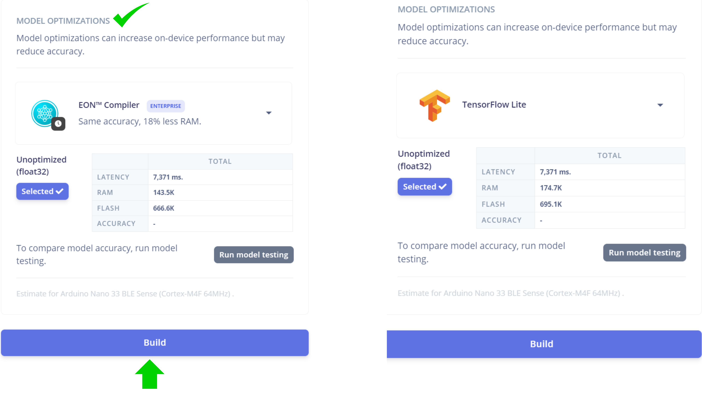

## Deploying the Model to a Microcontroller

After the Arduino library has finished downloading, we can open the Arduino IDE and [install the zipped library](https://docs.arduino.cc/software/ide-v1/tutorials/installing-libraries/). Afterwards we open the [inference Sketch](https://github.com/SolomonGithu/Arduino_Nano_33_BLE_Sense_fire_detection_using_sensor_fusion/blob/main/33_BLE_Sense_Inference_code_using_Edge_Impulse/33_BLE_Sense_Inference_code_using_Edge_Impulse.ino) in the Arduino IDE. Feel free to clone the GitHub repository or copy and paste the code to an Arduino Sketch on your computer. In the inference Sketch, we need to ensure that the variables `EI_CAMERA_RAW_FRAME_BUFFER_COLS`, `EI_CAMERA_RAW_FRAME_BUFFER_ROWS`, `WIDTH`, and `HEIGHT` have the same image dimensions as the one used in the model training. Finally, we can upload the inference Sketch on the Arduino Nano 33 BLE Sense. Once the code is uploaded, the Arduino board will record the room temperature, capture an image, and then classify if the environment is safe or has a fire. The inference Sketch follows a similar operation as the data collection code. The main difference in this case is that the data are not printed to Serial. In fact, the inference Sketch is also built from the `nano_33ble_sense_camera.ino` example code. I updated the code to also get temperature value and then in the function `ei_camera_cutout_get_data`, we can append the temperature value to the buffer that will afterwards be passed to the classifier which in this case is our multi-input model.

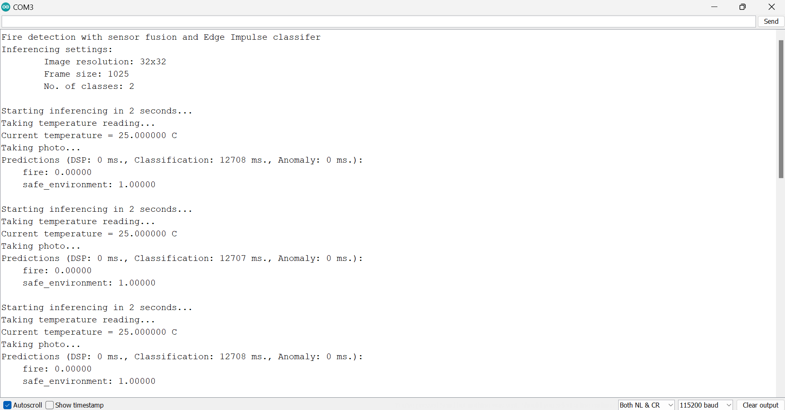

With the multi-input model running on the Arduino Nano 33 BLE Sense, the classification time was around 12 seconds. This is due to the fact that the Arduino board only has a 32-bit ARM Cortex-M4 CPU running at 64 MHz. However, for faster classification times, there are many [supported hardware devices](https://docs.edgeimpulse.com/docs/edge-ai-hardware/edge-ai-hardware) in the Edge Impulse platform that we could deploy the model to. For instance, the [Arduino Nicla Vision](https://docs.edgeimpulse.com/docs/edge-ai-hardware/mcu/arduino-nicla-vision) microcontroller board combines a powerful STM32H747AII6 Dual ARM® Cortex® M7/M4 IC processor with a 2MP color camera that supports TinyML applications.

## Results

Finally, after collecting the dataset, training, and deployment, we have a multi-input sensor fusion application that is running on a small, low-power and resource-constrained Arduino Nano 33 BLE Sense. To test the model on the Arduino board, I placed it back next to the oven. In the first scenario, I had the oven turned off and a candle was in front of the OV7675 camera but it was _not_ lit. In this situation, the model accurately classified that the environment is safe, and the onboard RGB LED turned to green. Afterwards, I turned on the oven to increase the temperatures and lit the candle. In this situation also, the model accurately classified that the environment belongs in the `fire` class and the onboard RGB LED turned to red.

In the image below, a candle was placed in front of the Arduino TinyML Kit as it was secured on a tripod. The candle was not lit and the room temperature was around 25 degrees Celsius. In this case, the model was able to accurately classify that the environment was safe and the Arduino RGB LED turned green.

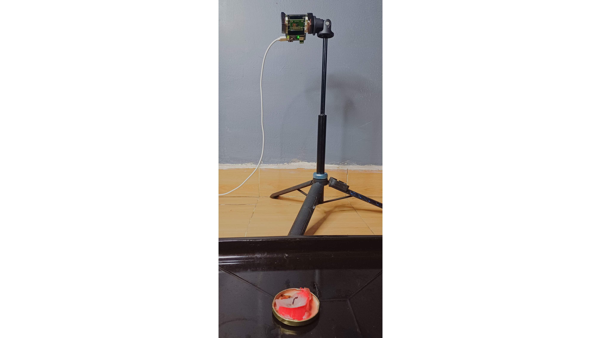

In another case, the candle was lit but since the flame was not big, the HTS221 temperature sensor recorded the room temperature which was still around 25 degrees Celsius. However, since there was a flame, the model correctly classified the environment to be in the `fire` class and the Arduino's onboard RGB LED turned red.

## Conclusion

From this demonstration project, we have seen how we can train a sensor fusion model and have it optimized to run on a microcontroller such as the Arduino Nano 33 BLE Sense. In this project, the final model accurately classifies if there is fire or not using both a camera and temperature sensor and understand the relationship between the two data sources. This project highlights the key importance of leveraging sensor fusion and Tiny Machine Learning models to enhance fire detection, consequently contributing to the safety and well-being of individuals.

With sensor fusion, we gain more data, which allows for improved decision making. While the technique may appear to be easy, the software and algorithms that enable it are a challenge. This method presents its own set of obstacles, such as computational complexity and sensor compatibility.

The [Edge Impulse Bring Your Own Model](https://docs.edgeimpulse.com/docs/edge-impulse-studio/bring-your-own-model-byom) (BYOM) feature enables us to optimize and deploy our custom pretrained models (TensorFlow SavedModel, ONNX, or TensorFlow Lite) to any edge device using an Edge Impulse project. With sensor fusion, tensor slicing, and this powerful BYOM tool, vast opportunities are opening up for developing advanced Machine Learning models.

