# Smart Building Ventilation with Environmental Sensor Fusion

Created By: Jallson Suryo

Rain and Thunder Sound - [https://studio.edgeimpulse.com/public/270172/latest](https://studio.edgeimpulse.com/public/270172/latest)

Weather Conditions - [https://studio.edgeimpulse.com/public/274091/latest](https://studio.edgeimpulse.com/public/274091/latest)

GitHub Repo: [https://github.com/Jallson/SensorFusion_SmartBuilding](https://github.com/Jallson/SensorFusion_SmartBuilding)



## Introduction

In a natural ventilation system, it is necessary to regulate the conditioning of air, humidity, temperature and light through adjusting window and louver/blind angles. An automatic system that can adapt to current conditions is the key to comfort and energy savings.

## Our Solution:

Louver / blinds and windows that can adjust opening angles based on rain and thunderstorm sounds, combined with environmental conditions (light intensity, humidity, and temperature) by using two machine learning models in separate MCUs.  One device performs sound classification, and the other one performs sensor fusion of environmental conditions.

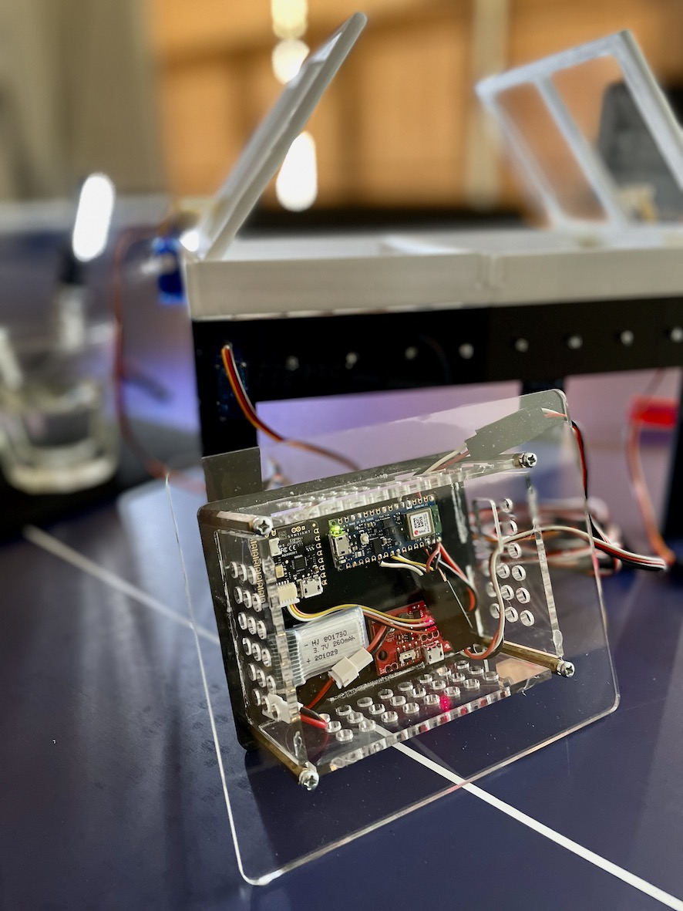

## Description:

This project takes advantage of machine learning (ML) to differentiate sounds, and also distinguish weather conditions with a combination of temperature, humidity, and brightness. Acquiring data and building a model can be done directly in the Edge Impulse Studio. The sound data will include variations of rain, thunderstorms, as well as unknown sounds; horns, cars passing by, and the sounds of people, etc. Whereas in environmental conditions the data will be directly in the form of a combination of temperature, humidity, light in sunny dry, sunny humid, comfortable, and overcast conditions.

The result of these two kinds of ML models will be embedded in separate MCUs (Arduino Nicla Voice & Arduino Nano 33 BLE Sense) and will be combined into a customized program to control the opening angle of the window and louver, so that energy efficiency and comfort in room conditions can be achieved optimally and automatically.

This project is a Proof of Concept (PoC) miniature model using acrylic and a styrofoam canopy, with window and louver movement controlled with angle servos. The sensors (temp, humidity, light, and sound) are already contained on the Arduino boards, so it can read the current realistic situation without adding any more specific sensors.

### Hardware Components:

- Arduino Nicla Voice
- Arduino Nano 33 BLE Sense
- 3 micro servos (9g)
- Charge Booster (Sparkfun) 5V
- Battery 3.7V
- 3mm Acrylic & Styrofoam

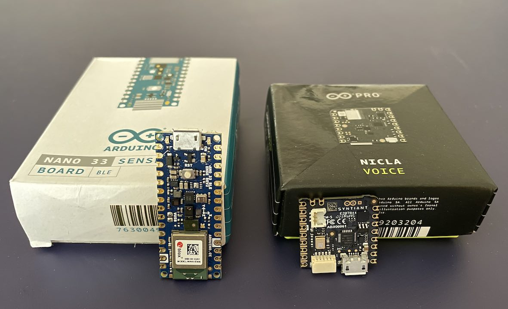

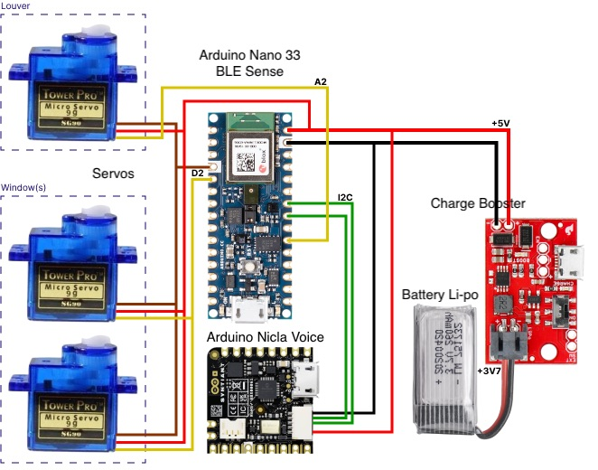

### Software & Online Services:

- Edge Impulse Studio
- Arduino IDE
- Terminal

## Steps:

This project uses two machine learning models, so we divide our work into two parts:

A) Rain & Thunder Sound, and
B) Weather Conditions (Sensor Fusion)

### A. Rain & Thunder Sound:

#### 1. Data Collection

Before we start, we need to install the Arduino CLI and Edge Impulse tooling on our computer. You can [follow this guide](https://docs.edgeimpulse.com/docs/development-platforms/officially-supported-mcu-targets/arduino-nicla-voice) to get everything installed.

Open [studio.edgeimpulse.com](http://studio.edgeimpulse.com) in a browser, and sign in, or create a new account if you do not have one.  Click on **New project**, then in **Data acquisition**, click on the **Upload Data** icon for uploading `.wav` files (e.g. from Pixabay, Mixkit, Zapsplat, etc.). Other methods to collect data are from devices such as a connected smartphone with QR code link, or a connected Nicla Vision with Edge Impulse audio firmware flashed to it. For ease of labelling, when collecting and uploading data, fill in the name according to the desired label, for example `rain`, `thunder`, or `z_unknown` for your background noise data.

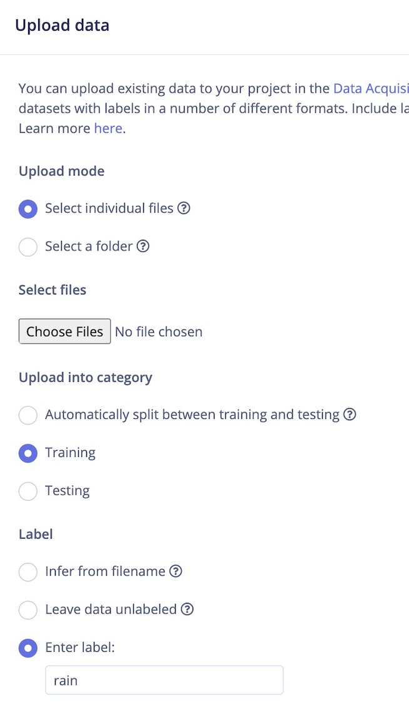

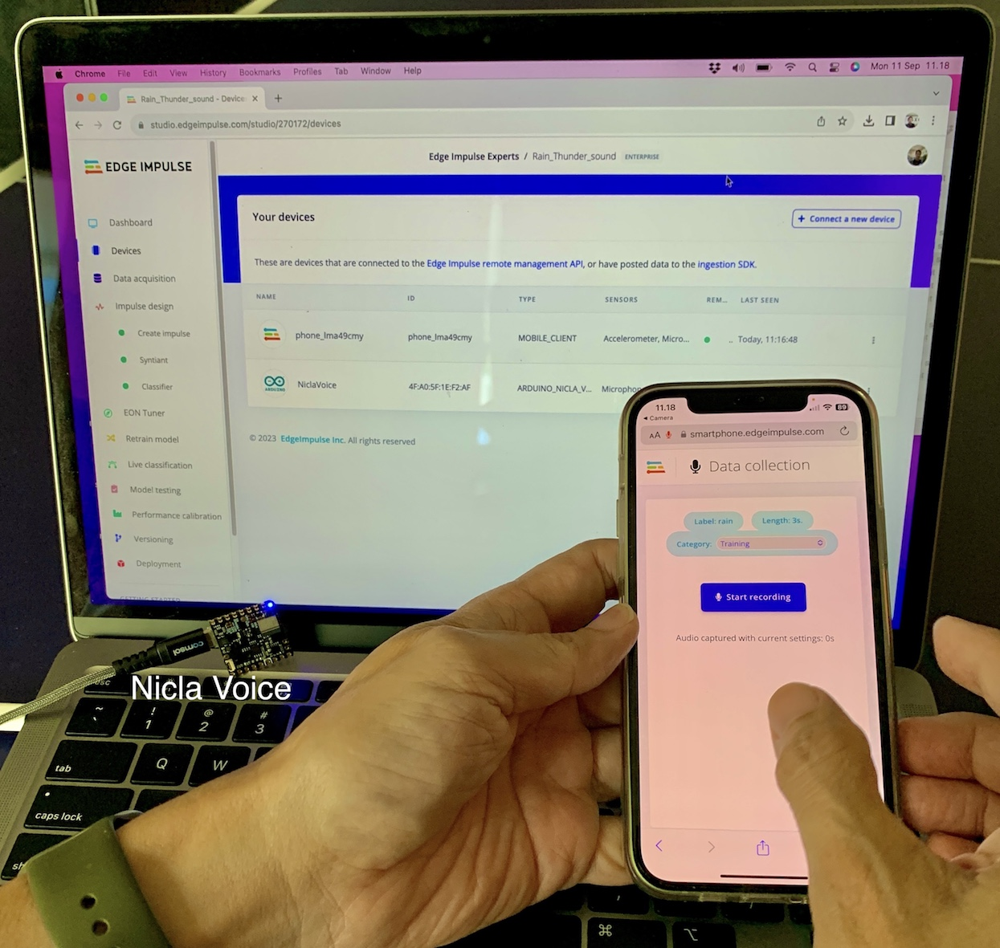

#### 2. Split and Labeling

Click on a data sample that was collected, then click on the 3 dots to open the menu, and finally choose **Split sample**. Set the segment length to 2000 ms (2 seconds), or add segments manually, then click **Split**. Repeat this process until all samples are labelled in 2 second intervals. Make sure the comparison between rain, thunder and unknown data is quite balanced, and the ratio between training and test data is around 80/20.

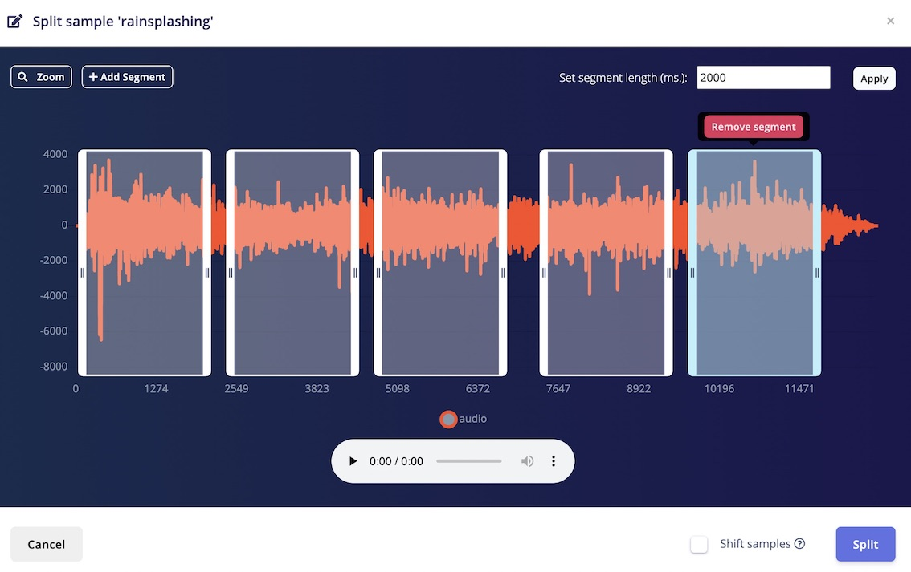

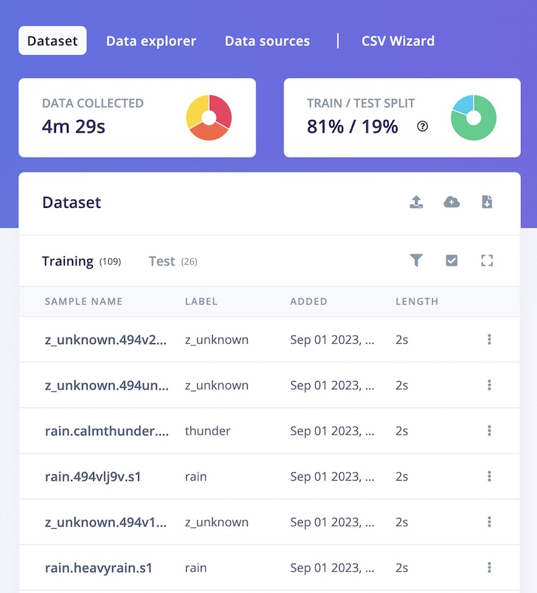

#### 3. Train and Build the Model (Syntiant)

Choose **Create Impulse**, set Window size to around 1 sec, then add an Audio (Syntiant) Processing block, and choose Classifier for the Learning block, then Save Impulse. In the Syntiant parameters, choose **log-bin (NDP120/200)** then click Save. Set the training to around 30 cycles with 0.0005 Learning rate, then click **Start training**. It will take a short while, but you can see the progress of the training on the right. If the results show a figure of around 90% accuracy upon completion, then we can most likely proceed to the next stage.

Now we can test the model in **Live classification**, or choose **Model testing** to test with the data that was set aside earlier (the 80/20 split), and click **Classify all**. If the result is greater than 80% accuracy, then we can move to the next step — Deployment.

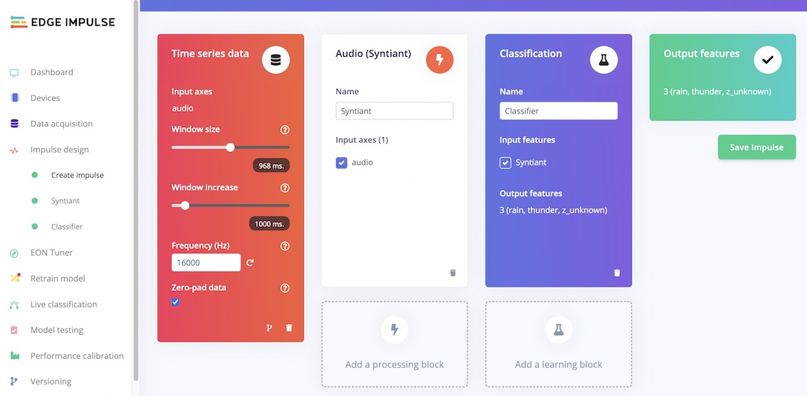

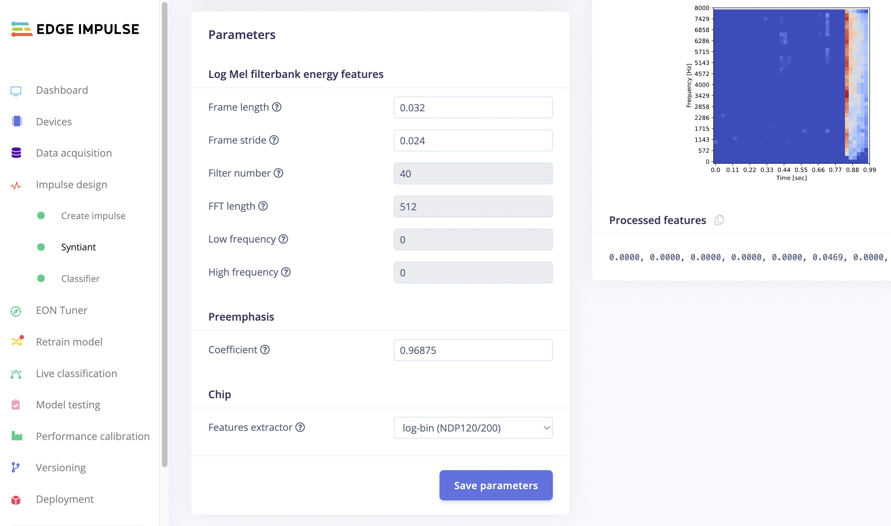

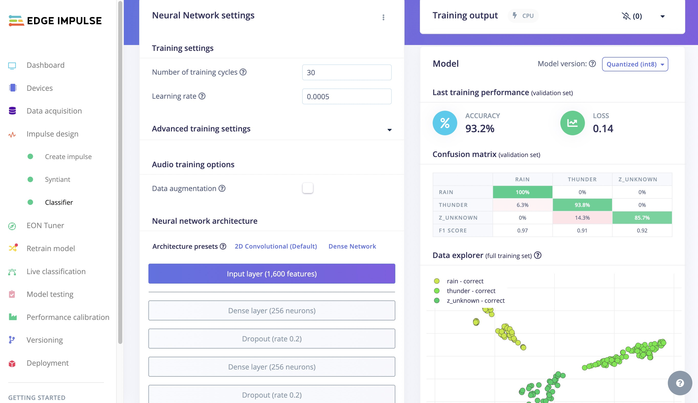

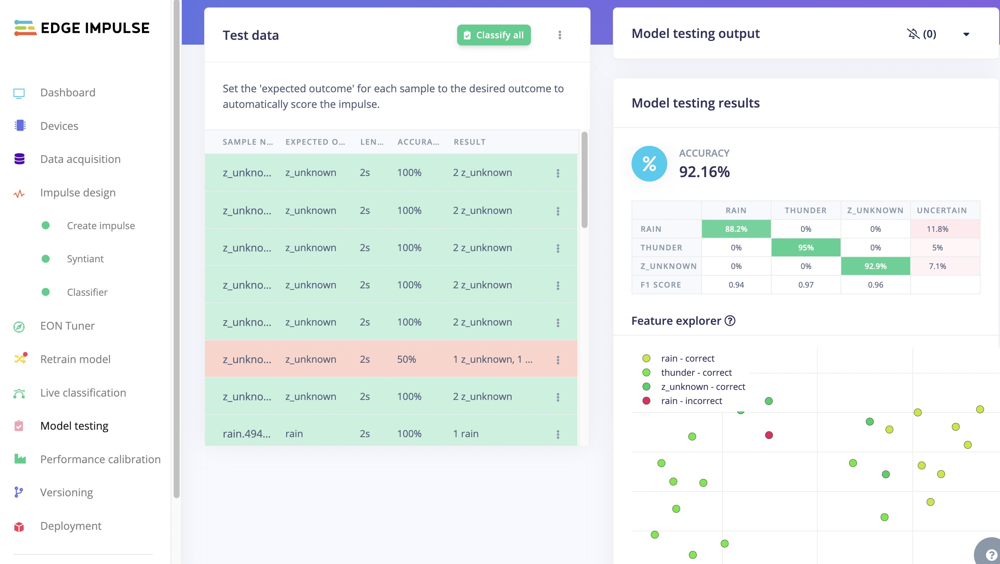

#### 4. Build and Deploy Arduino Program

For a Syntiant NDP device like the Nicla Voice, we can configure the posterior parameters (in this case rain and thunder). To run your Impulse locally on the Arduino Nicla Voice, you should select **Syntiant NDP120 Library** in the **Deployment** tab. The library will start building and automatically download to your computer once it is complete. Place the downloaded library in your preferred folder/repository on your computer.

To compile and flash the firmware, run:

Windows:
```
arduino-win-build.bat --build

arduino-win-build.bat --flash
```

Mac:
```
./arduino-build.sh --build

./arduino-build.sh --flash
```

Make sure you are in the correct directory and you have Arduino CLI installed on your computer when performing the commands above.

Once you’ve compiled the Arduino Firmware, do the following:

- Take the `.elf` output generated by the Arduino CLI and change its name to "firmware.ino.elf"
- Replace the `firmware.ino.elf` from the default audio firmware, which [needs to be downloaded from here] https://docs.edgeimpulse.com/docs/development-platforms/officially-supported-mcu-targets/arduino-nicla-voice
- Replace the *ei_model.synpkg*
- Flash the firmware (more details below)

Start with this (in this case using a Mac, and you only need to run this script once):

```
install_lib_mac.command
```

If you have flashed a different firmware to the NDP120 chip previously, you should run this script:

```
format_mac_ext_flash.command
```

Now run this script to flash both the MCU and NDP120:

```
flash_mac.command
```

Technically you can just flash only the NDP120 since we are going to upload a new code to the MCU via Arduino IDE anyway:

```
flash_mac_model.command
```

Now it is time to upload our specific program to the Arduino Nicla Voice via the Arduino IDE. You can find the `.ino` code here:  [https://github.com/Jallson/SensorFusion_SmartBuilding/blob/main/weathersoundfusion_niclavoice.ino](https://github.com/Jallson/SensorFusion_SmartBuilding/blob/main/weathersoundfusion_niclavoice.ino) 

Once downloaded, you can upload the .ino code to your Arduino Nicla Voice using the Arduino IDE.

When rain sound is detected, the built in LED will blink blue and send a `1` via I2C. When thunder is detected, the LED will blink red and send a `2` via I2C.

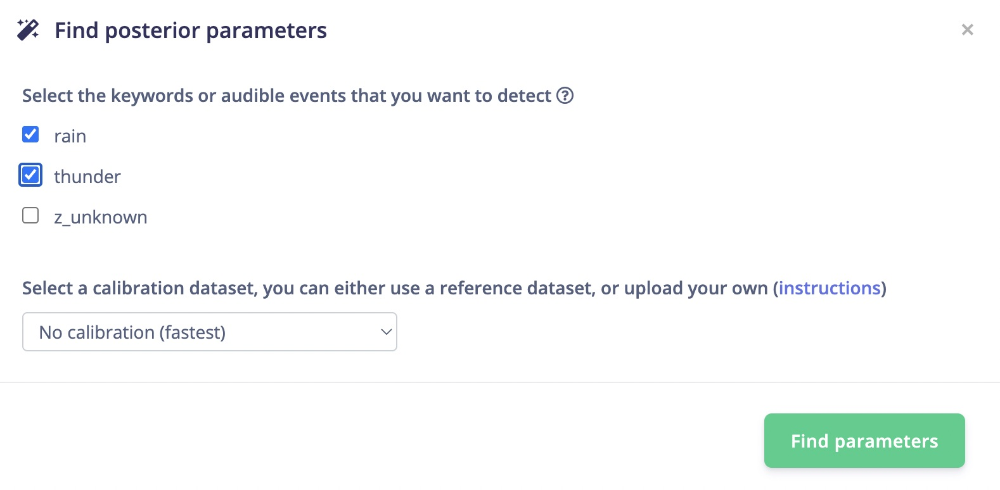


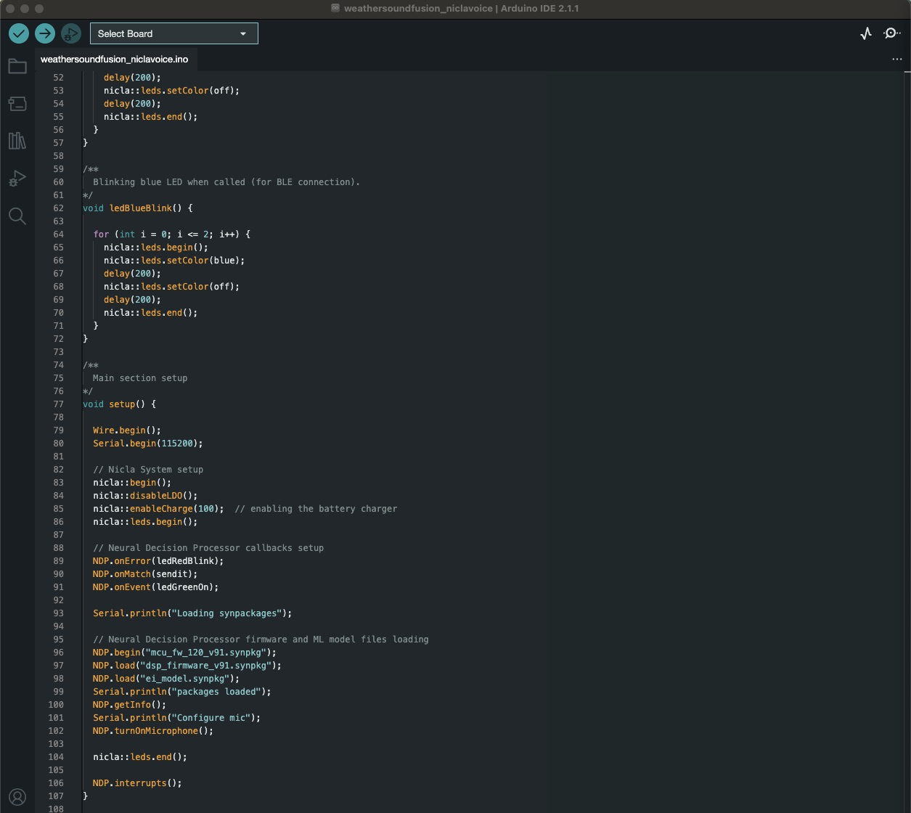

### B. Weather Conditions (Sensor Fusion):

#### 1. Data Collection

We need to prepare the Arduino Nano BLE Sense with the proper firmware to connect to the Edge Impulse Studio.  Follow the instructions here to flash the firmware: [https://docs.edgeimpulse.com/docs/development-platforms/officially-supported-mcu-targets/arduino-nano-33-ble-sense](https://docs.edgeimpulse.com/docs/development-platforms/officially-supported-mcu-targets/arduino-nano-33-ble-sense). We also need to build a set-up that can replicate conditions such as sunny dry, sunny humid, comfortable, and overcast. In this case we use an air-conditioned room, hot water, light, and an iron to create the necessary environments.

Start with adding a new project in the Studio, and connect the Nano BLE Sense as described above. After the device is connected, in **Data acquisition** choose **Environmental + Interactional** in the sensor dropdown menu,1000ms for sample length, and label it appropriately. Start sampling.

After all data are labelled and captured correctly (e.g. Overcast, Sunny Humid, Sunny Dry, Comfortable), make sure the ratio between Training and Test is ideally around 80/20.

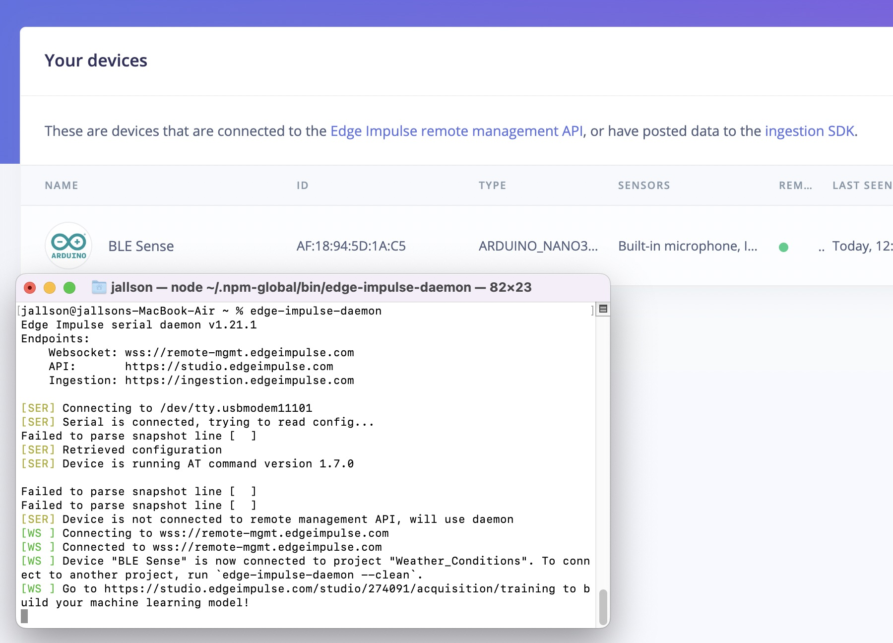

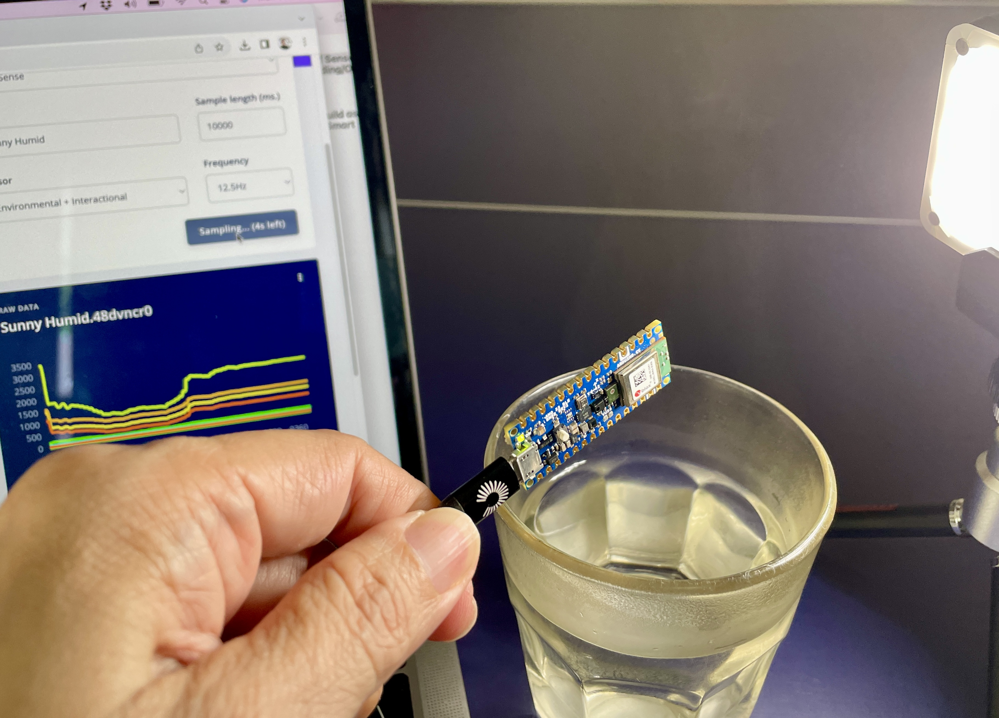

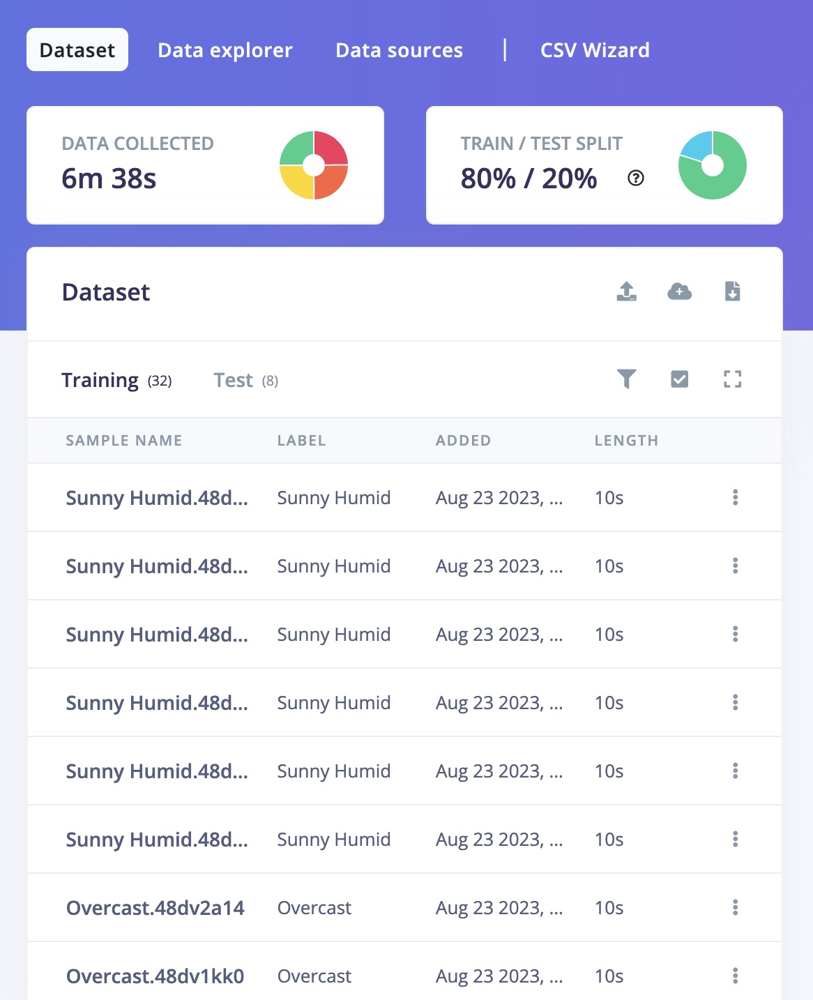

#### 2. Train and Build Model

Once you have the dataset ready, go to **Create Impulse** and set **Window size** to 1000ms and **Window increase** to 500ms. Add a **Flatten** block then choose temperature, humidity, and brightness as the input axes. Add a **Classification** block with **Flatten** feature ticked, then Save Impulse, and Save parameters. After that, set Neural Network training to 300 cycles and a 0.0005 Learning rate, then Start the training process.


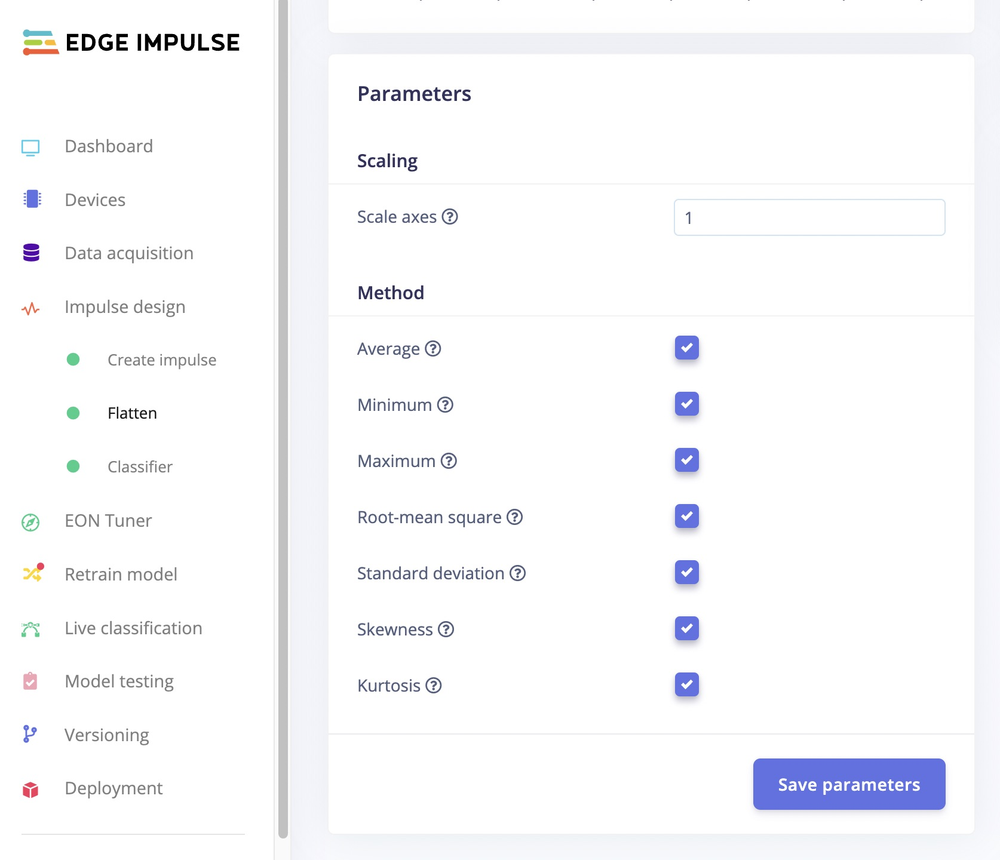

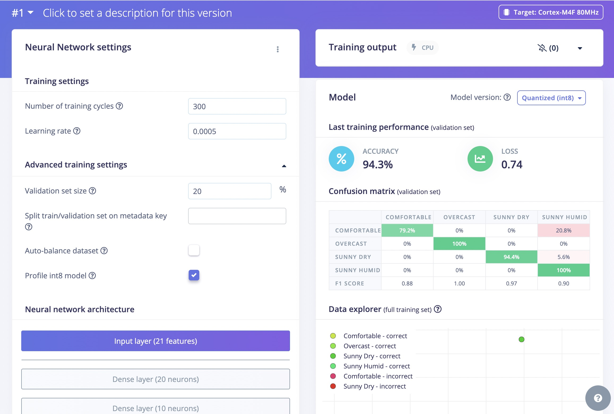

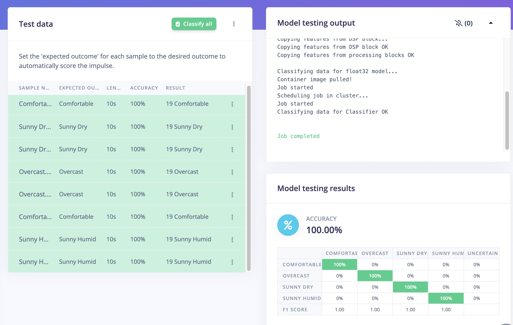

Our result is above 90%, then we can check with our test data, choose **Model testing** and **Classify all**. If the result is also good, then we can move on to next step — Deployment.

#### 3. Deploy and Build Arduino Program

Select **Arduino library** in the Deployment tab. The library will build and it will automatically download an Arduino library `.zip` file. Place this zipped file into your Arduino Library folder.

Now download the `.ino` code here [https://github.com/Jallson/SensorFusion_SmartBuilding/blob/main/weathersoundfusion_nano_ble33.ino](https://github.com/Jallson/SensorFusion_SmartBuilding/blob/main/weathersoundfusion_nano_ble33.ino).

Once downloaded, you can upload the .ino code to your Arduino Nano 33 BLE Sense using the Arduino IDE.

In this program, when a byte variable containing `1` or `2` is received via I2C, the Arduino Nano 33 BLE Sense will adjust the window and louver accordingly. If there is no rain or thunder, the sensor fusion inference will start running and the louver and window will be controlled based on the inference result; comfortable, overcast, sunny humid, or sunny dry.


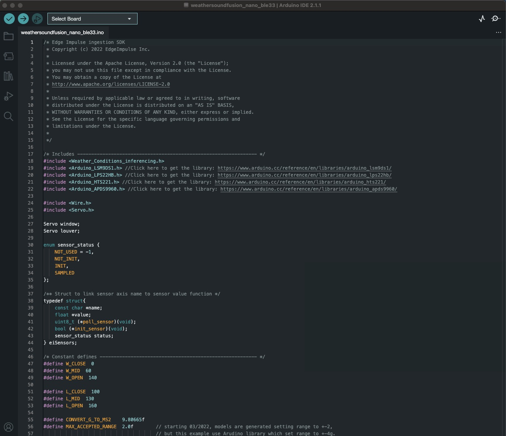

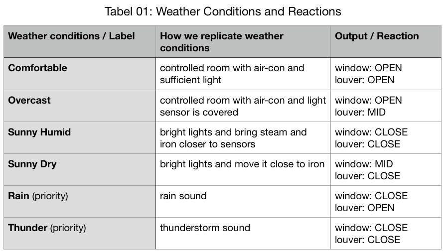

## Build PoC / Demo Setup

Create your own electronics and demo setup by following the Hardware Component diagram above. I made mine by applying servos to the windows and louvers on a miniature canopy made from acrylic and styrofoam sheets. And don't forget to prepare a lamp, iron, a glass of hot water and a fan or air-conditioning if needed.

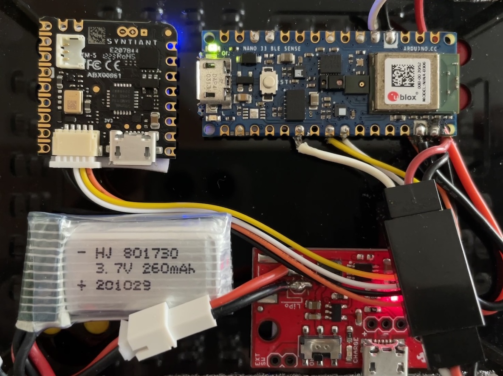

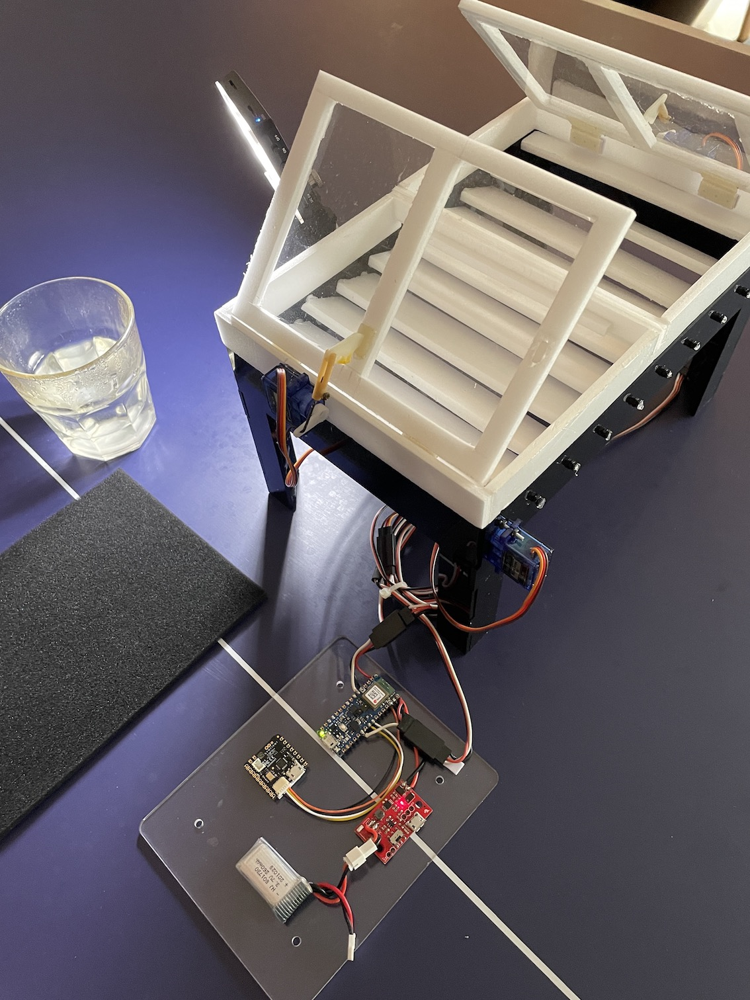

## Conclusion

Finally, we succeeded in implementing the idea by combining sensor fusion and sound classification ML models. The success of the ML model in identifying conditions by combining patterns in humidity, temperature and brightness without carrying out specific boundary numbers is an advantage compared to programmed only methods. The audio classification model running on the Nicla Voice successfully identifies the sound of rain or lightning, and transmits it via I2C to the Nano BLE Sense to move the connected servos. Meanwhile, the sensor fusion model on the Nano BLE Sense can also identify other weather conditions (sunny humid, dry, overcast, comfortable) and move the connected servos that control the opening of windows and louvers.

I believe this PoC project can be implemented in a smart building system, so that comfort and energy savings can be optimized.

