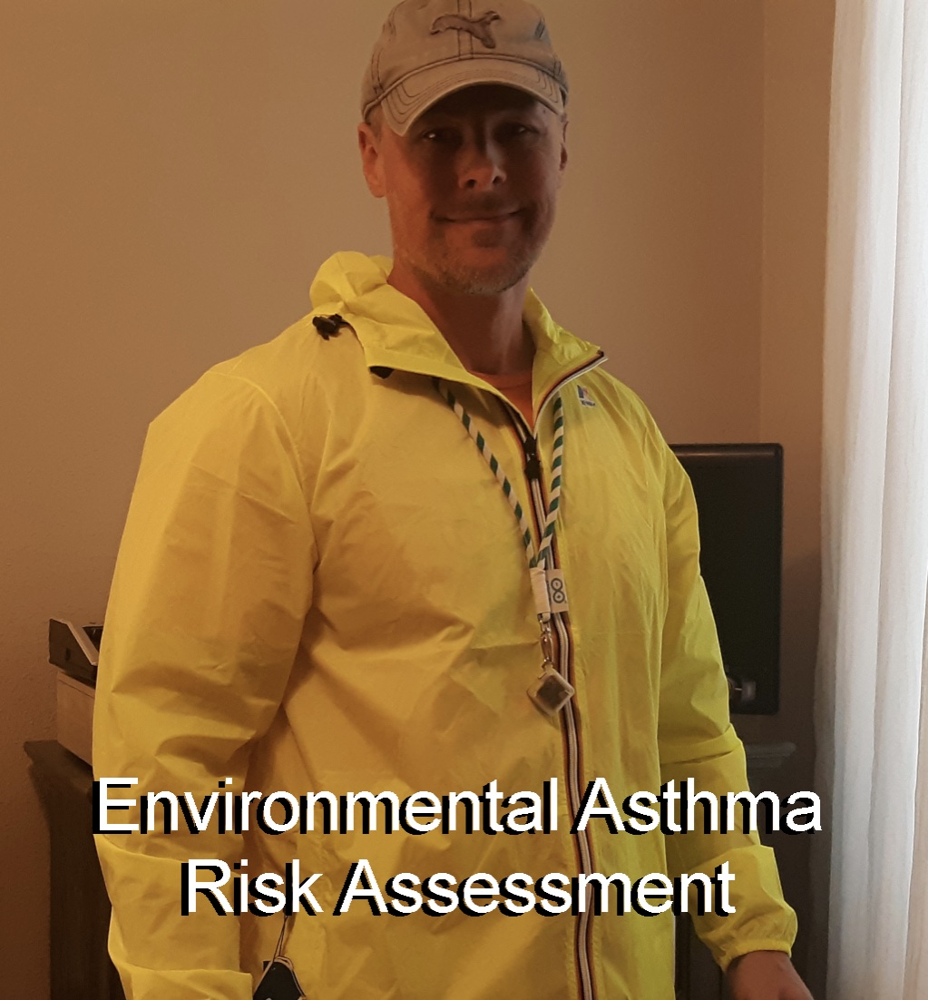
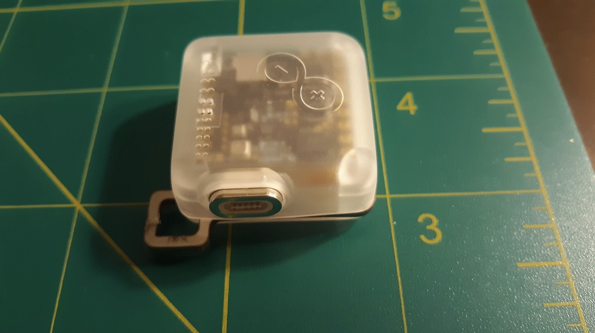
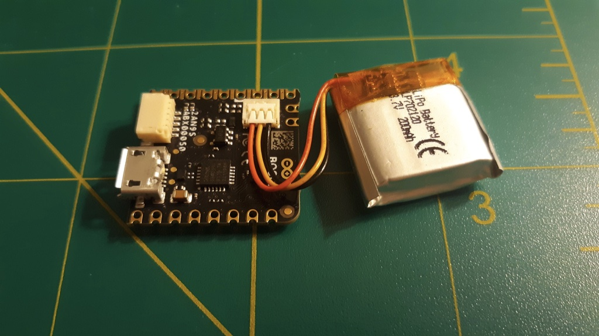
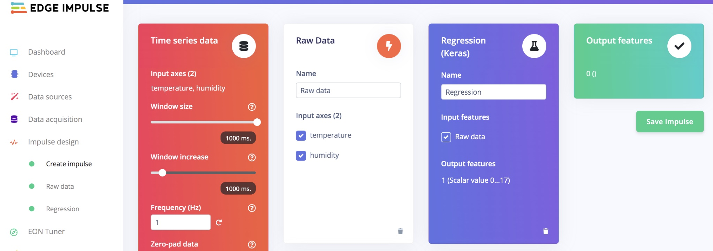
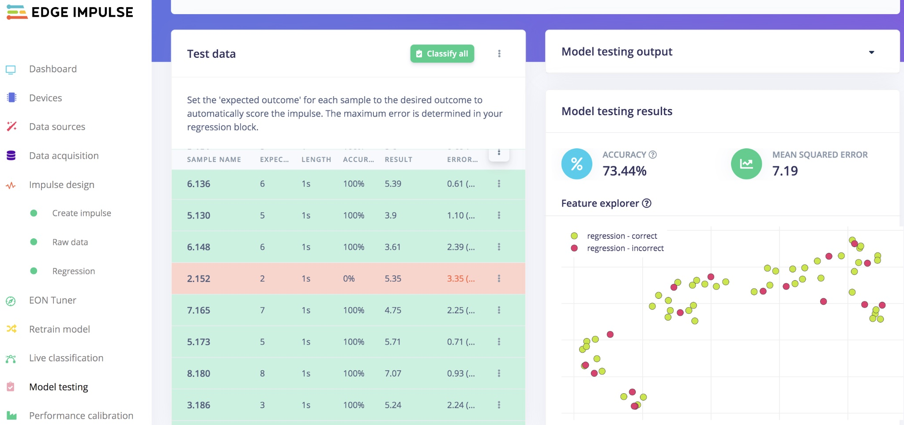
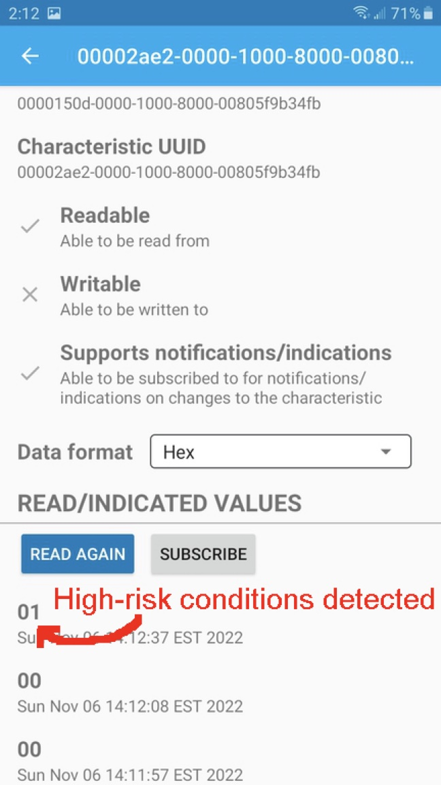

# Arduino x K-Way - Environmental Asthma Risk Assessment

Created By:
Nick Bild 

Public Project Link:
[https://studio.edgeimpulse.com/public/148301/latest](https://studio.edgeimpulse.com/public/148301/latest)

GitHub Repository:
[https://github.com/nickbild/environmental_asthma_risk](https://github.com/nickbild/environmental_asthma_risk)

## Intro

The US economy takes a hit of more than 80 billion dollars annually due to both direct and indirect effects of asthma.  This comes in the form of medical expenses, missed work days, and even death.  Some of these impacts can be prevented by avoiding asthma triggers and taking preventative measures, like using prescribed inhalers or limiting physical activity when at risk.

One thing that may help in understanding when someone is at high risk for an asthma attack is monitoring environmental risk factors.  It has been noted, for example, that factors like temperature and humidity increase the number of emergency department visits for the condition.  But the exact relationships between weather conditions and asthma flare ups are not entirely clear.

I decided to build a machine learning model and train it to understand the relationship between temperature, humidity and emergency department visits for asthma.  Since a device running this model would need to always be with the person being monitored, making it into a wearable gadget makes a lot of sense.  As it turns out, K-Way and Arduino recently teamed up to make a smart jacket that looks like the perfect platform to build my idea on, so I gave it a try.

Note that this device has not been validated clinically, nor has it been approved by the FDA or any other regulatory agency.  It is a proof of concept and cannot be used to make health-related decisions.

## Hardware Requirements
- 1x K-Way jacket with integrated Arduino Nicla Sense ME

## Software Requirements
- Edge Impulse Studio
- Arduino IDE

## How It Works

The K-Way jacket is instrumented with an Arduino Nicla Sense ME.  The Arduino is housed inside a tiny case and comes wired to a rechargeable LiPo battery.  This hardware platform was designed with tinyML in mind, with an Arm Cortex M4 CPU operating at 64 MHz to run local inferences, and a slew of sensors, including a number of motion and environmental sensors.

One of the sensors on this board collects temperature and humidity measurements, then passes them into a machine learning model that I built with Edge Impulse Studio that predicts the number of emergency department visits for asthma that would be expected under those conditions.  If that number exceeds a certain threshold, that is considered a high-risk day for asthma flare ups, and a message is sent to the jacket wearer’s smartphone to give them a heads up so they can take appropriate action.

## Data Preparation

I located a dataset that provides hourly weather and asthma emergency department visit metrics for an entire year.  I processed this data with a simple Python script to create CSV files compatible with Edge Impulse.  These CSV files were uploaded to my project in Edge Impulse Studio using the data acquisition tool.

## Building the ML Model

I designed a simple impulse that feeds the previously uploaded training data into a regression model that learns to translate temperature and humidity into a prediction of the number of emergency department visits expected for the hour under those conditions.

Model testing showed that the model was accurate over 73% of the time.

## Deploying the Model

Edge Impulse offers many options for deployment, but in my case the best option was the "Arduino library" download. This packaged up the entire classification pipeline as a compressed archive that I could import into Arduino IDE, then modify as needed to add my own logic.  That allowed me to send Bluetooth Low Energy messages when certain thresholds were met.  The Arduino sketch is [available here](https://github.com/nickbild/environmental_asthma_risk/tree/main/arduino_sketch).

## Conclusion

The K-Way/Arduino smart jacket is an interesting new platform for tinyML applications.  By embedding the hardware in a jacket, it does not require any special effort on the part of the wearer to bring their intelligent algorithms along with them wherever they go.  This type of always-available platform is very promising for health-related applications, and worked quite well for my prototype.  I hope to see devices like this be clinically validated in the future so that they can make a real difference in people’s day-to-day lives.

