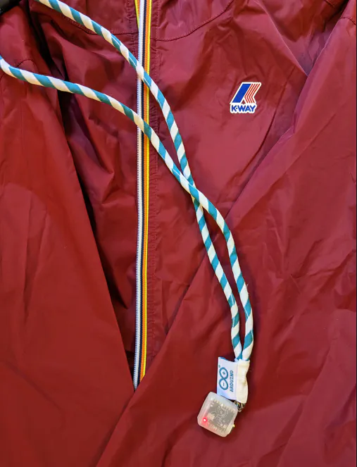
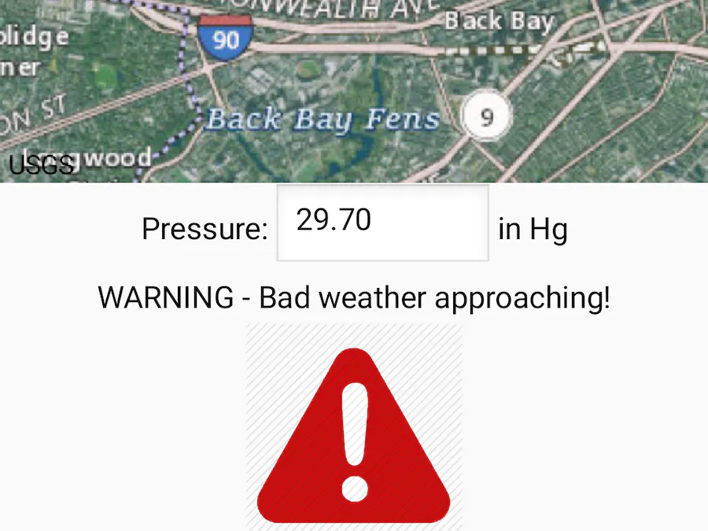
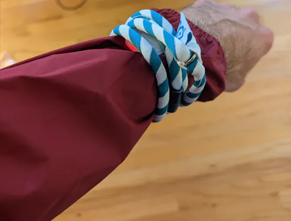
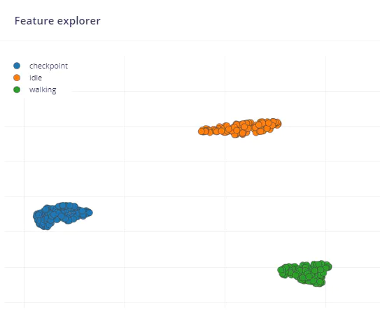
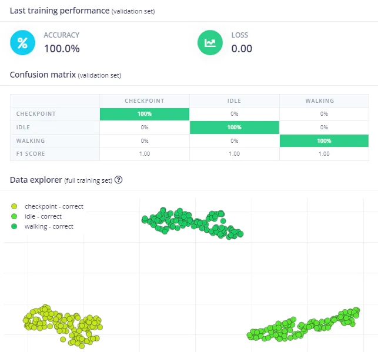
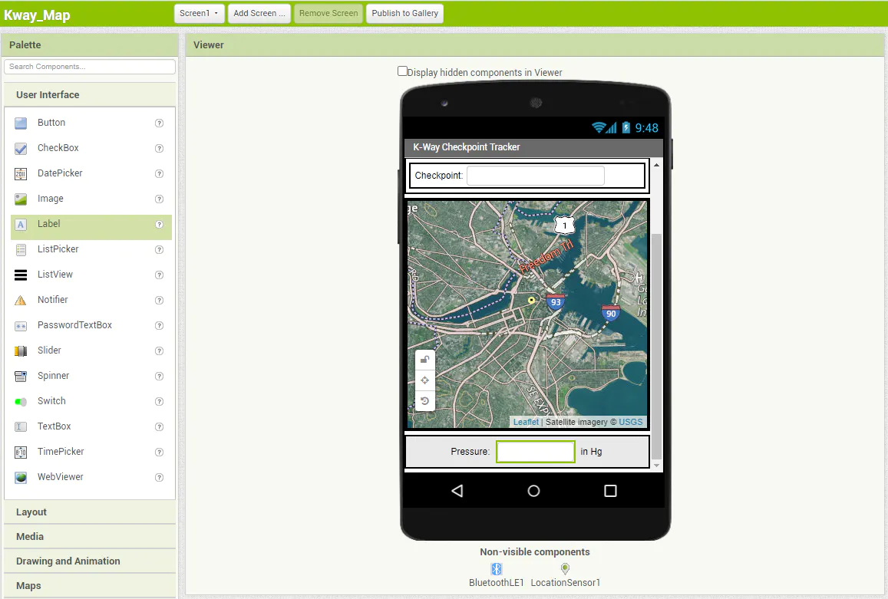
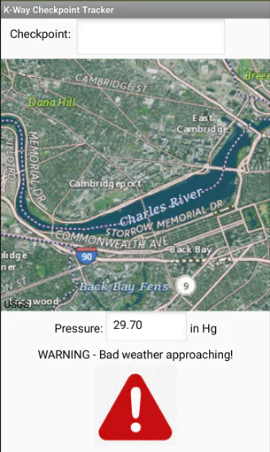

# Arduino x K-Way - Gesture Recognition and Weather Prediciton for Hiking 

Created By:
Justin Lutz 

Public Project Link:
[https://studio.edgeimpulse.com/public/181395/latest](https://studio.edgeimpulse.com/public/181395/latest)

GitHub Repo:

[https://github.com/jlutzwpi/K-way-Nicla-Smart-Jacket](https://github.com/jlutzwpi/K-way-Nicla-Smart-Jacket)

## Project Demo



## Story

With microcontrollers getting smaller, more powerful, and more energy efficient, Artificial Intelligence (AI) is finding itself deployed more and more at the edge: on sensors, cameras, and even clothing!

For this project, K-way, a maker of jackets, clothing and accessories, teamed up with Arduino to see how K-way's products could be made smarter. I was fortunate enough to be sent a K-way jacket with an Arduino Nicla Sense ME, a custom case and battery, and a lanyard.

When I was brainstorming ideas for the jacket, I looked on the web to see if there was even such thing as a smart jacket. There were only a couple examples, but one such concept had mentioned gesture recognition as a potential capability of the jacket. Given the active nature of the brand, I figured that some sort of gesture recognition and environmental data collection would be beneficial to the wearer of the jacket out on a hike.

That gave me the idea of the Nicla Sense ME being mounted to the arm sleeve of the jacket, so gestures could be used to send commands to a smartphone, and atmospheric pressure data could also be sent to the smartphone app to alert the hiker of any upcoming bad weather.

In this proof of concept, I picture a hiker being out on the trail enjoying their leisurely walk. They see an object of interest (an owl's nest, some old ruins?), and they draw the letter "C" in the air, for checkpoint. This gesture then uses the phone's GPS to mark the checkpoint on the map of a custom app that is connected to the Nicla Sense ME via Bluetooth Low Energy (BLE), so the hiker knows exactly where that object of interest is. The Nicla also monitors the barometric pressure, which can be used as an indicator of bad weather. If a low-pressure storm starts to move in, the hiker can be alerted that bad weather is on the way and head back to their car before they get caught in a storm.

Ideally, there would be a pouch on the armsleeve to slide the Nicla Sense ME into, but for this demo I used the included lanyard to strap it to my wrist. I have an LED illuminated there to indicate if the Nicla Sense ME is connected via BLE to the app that I made with MIT App Inventor 2.

To complete this project I used my go-to source, Edge Impulse, to ingest raw data, develop a model, and export it as an Arduino library. I [followed this tutorial](https://docs.edgeimpulse.com/docs/development-platforms/officially-supported-mcu-targets/arduino-nicla-sense-me) on the Nicla Sense ME from Edge Impulse to get up and running. The Edge Impulse-provided `nicla_sense_ingestion.ino` sketch was used to collect the raw accelometer data. I created 3 classes: idle (no movement), walking, and checkpoint. The **Checkpoint** class was essentially me drawing the letter "C" in the air to tell the app to mark a checkpoint on the map while out on a hike.

You of course could add additional gestures if you wanted to expand the functionality of the jacket and Nicla Sense ME (an "S" for "selfie" maybe?). Even with just 15 minutes of data (split between Training and Test), there was great clustering of class data:

Default parameters were used throughout the Edge Impulse pipeline, and training concluded with great results:

I then ran my model through the Test set and exported the model as an Arduino library .zip file. The Public Project version of my [model can be found here](https://studio.edgeimpulse.com/public/181395/latest) in the Edge Impulse Studio.

Once it was exported to an Arduino library, I used the sample `nicla_sensor_fusion.ino` sketch from the library to start my project. Given that the inference code was already in there, I only had to add in the BLE code and some logic to send data over BLE to the app. Edge Impulse really does make it simple.

Once I had my code in place, I went over to [MIT App Inventor](https://appinventor.mit.edu/) to create the interface to the Nicla Sense ME BLE data.

This is where I ran into a small issue: the Nicla Sense ME has limited (64 kB) SRAM. The Nicla can run an Edge Impulse Model fine, and it can connect to BLE just fine, but if you try to do both, you get an Out of Memory error and your software crashes. After a couple hours of debugging, troubleshooting, and searching, I found a project by Nick Bild where he made a small change to the Arduino_BHY2 library to free up some memory, and allow both the BLE library and the Edge Impulse model to be run concurrently. Details can be [found in this thread on the Edge Impulse forum](https://forum.edgeimpulse.com/t/nicla-sense-me-running-out-of-memory/6344/11). Once I was free of the memory limitations, I was able to connect to my app and test it out!

Aside from markers on the map, the Nicla Sense ME also continuously monitors the atmospheric pressure, [which can be an indicator of upcoming bad weather](https://education.nationalgeographic.org/resource/atmospheric-pressure). A drop in pressure means that clouds, wind, and precipitation may be coming. There are several factors that determine what that threshold is (location, altitude, etc) so I set my threshold to 29.8 in Hg, which would be an indicator of precipitation moving in to my area. Rather than waiting for bad weather to arrive, I simulated a lower pressure reading in my Arduino code and sent it to the app via BLE:

In summary, with the gesture recognition and mapping in place, combined with the weather prediction functionality, the Arduino x K-way collaboration makes for a great experience for outdoor enthusiasts. I hope you enjoy!

