# Arduino x K-Way - Outdoor Activity Tracker 

Created By:
[Zalmotek](https://zalmotek.com) 

Public Project Links:
[Weather Prediction Model](https://studio.edgeimpulse.com/public/137821/latest)
[Activity Tracking Model](https://studio.edgeimpulse.com/public/137840/latest)

GitHub Repository:
[https://github.com/Zalmotek/edge-impulse-arduino-k-way-outdoor-activity-tracker](https://github.com/Zalmotek/edge-impulse-arduino-k-way-outdoor-activity-tracker)

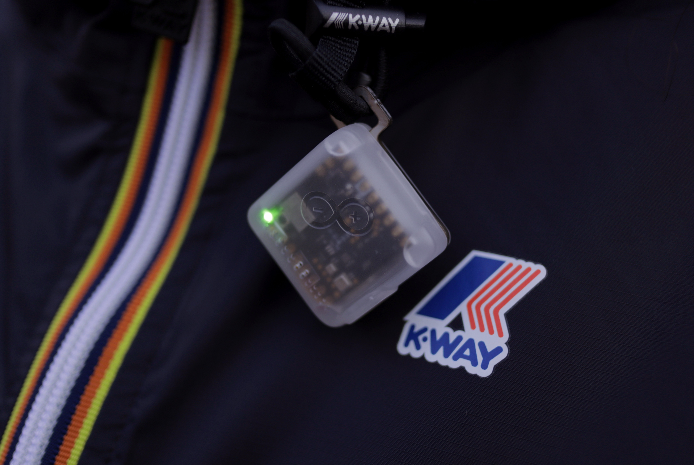

## Intro

Hiking is a great way to get outdoors and enjoy some fresh air. However, keeping track of your progress can be challenging, and that's where an outdoor activity tracker comes in handy. A hiking wearable device provides some valuable functions that can make your hike more enjoyable and safe. It can track things like how many steps you've taken, your walking speed, and even the weather conditions.
 
In this tutorial, we'll show you how to build a smart hiking wearable using the [Arduino Nicla Sense ME](https://store.arduino.cc/products/nicla-sense-me) board paired with the weather-resistant [K-Way jacket](https://www.k-way.com/products/jackets-woman-le-vrai-3-0-claudette-black-pure-k005if0-usy).

We’ll present the following use cases for the Arduino Nicla Sense ME board:

- **Weather prediction** - The wearable will be able to predict weather changes using the onboard pressure sensor and AI. By monitoring the atmospheric pressure, the tracker can notify you when a storm is approaching or when conditions are ripe for favorable weather. This information can be helpful in deciding whether to push on with your hike or turn back.
- **Activity tracking** - The wearable will be able to track your steps and identify walking, climbing, or breaks taken during the hike. 
- **Data gathering for ML** - The Arduino Nicla Sense ME will send motion and environmental data to another device over a Bluetooth connection and the data will be stored in the Arduino IoT Cloud for future processing.

We'll use the [Edge Impulse](https://www.edgeimpulse.com/) platform to train Machine Learning models using the data from the sensors, the [Arduino IDE](https://www.arduino.cc/en/software) to program the Nicla Sense ME board, and the [Arduino IoT Cloud](https://cloud.arduino.cc/) to store data and visualize the metrics. By the end of this tutorial, you'll have a working prototype that you can take with you on your next hike!

### Hardware requirements

- Arduino Nicla Sense ME
- LiPo battery (3.7V, 200mA)
- Micro USB cable
- Enclosure
- K-Way jacket

### Software requirements

- Edge Impulse account
- [Edge Impulse CLI](https://docs.edgeimpulse.com/docs/edge-impulse-cli/cli-installation)
- Arduino IDE
- Arduino IoT Cloud account

## Hardware Setup

The Arduino Nicla Sense ME is a tiny and robust development board that is specifically designed for wearable applications. It has several Bosch Sensortec's cutting-edge sensors on board, including an accelerometer, gyroscope, magnetometer, and environmental monitoring sensors. In addition, the board has an RGB LED that can be used for visual feedback and it can be powered by a LiPo battery. Furthermore, its compact form factor, high computing power, and low power consumption make it an ideal choice for edge Machine Learning applications.

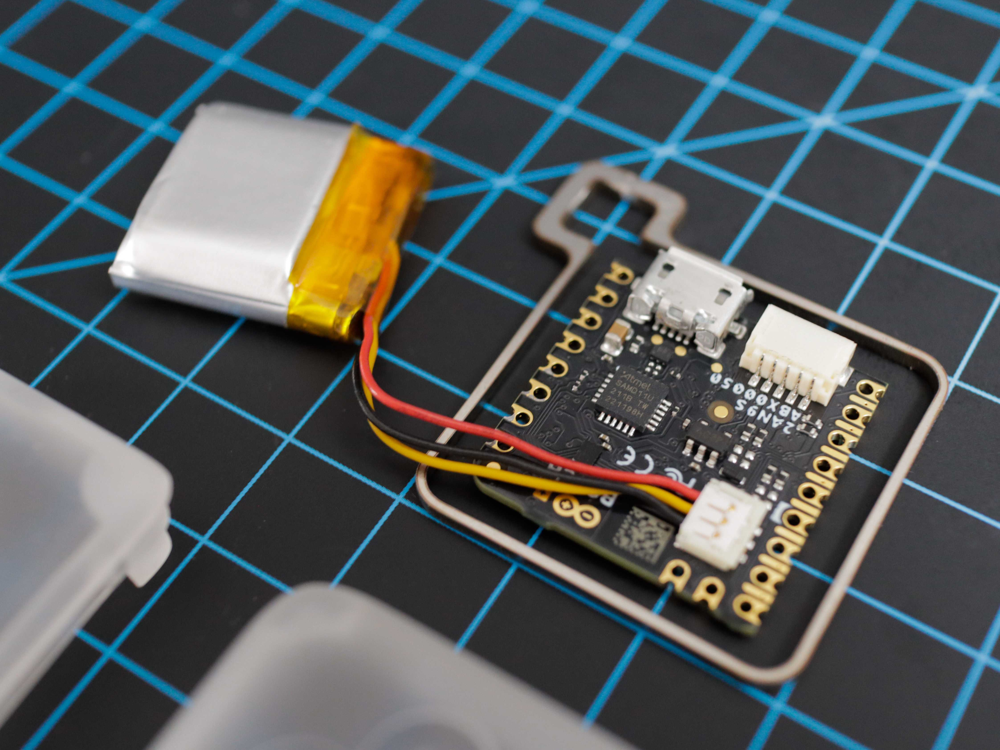

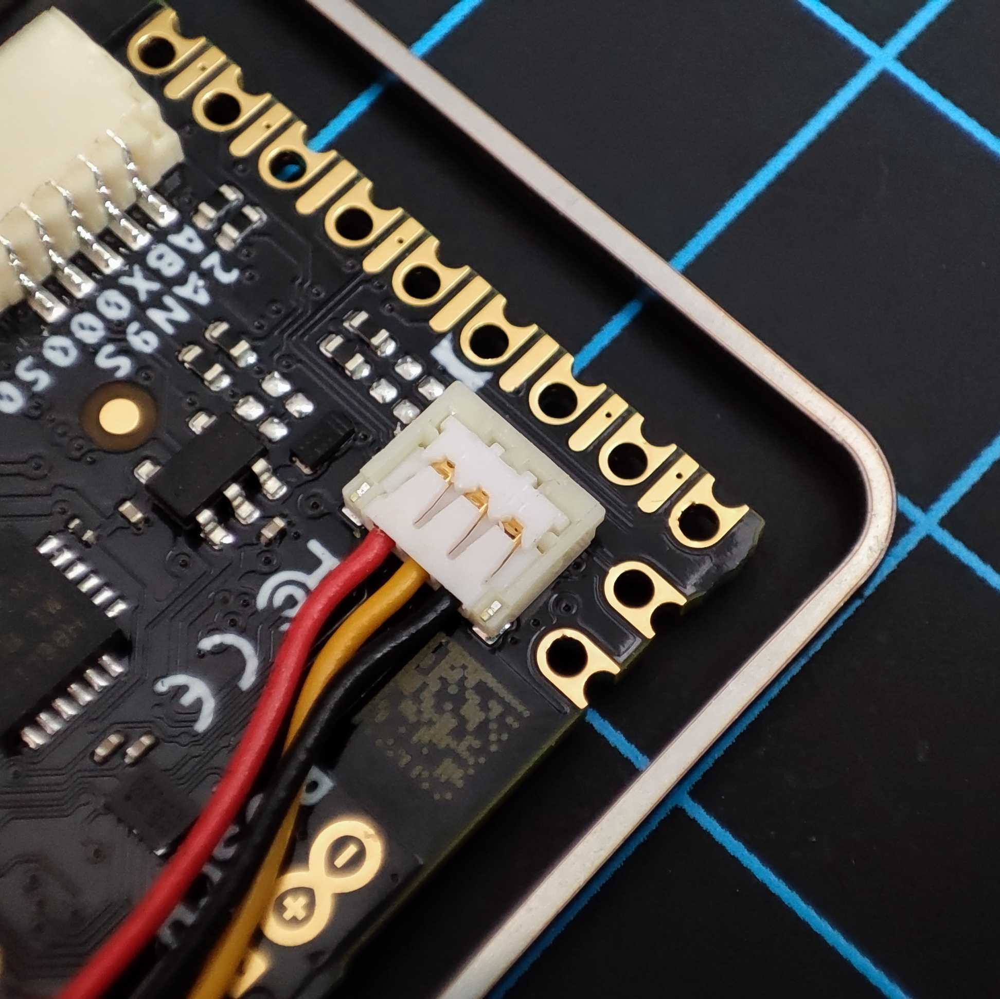

Barometric pressure is used to forecast short-term weather changes so, for training the weather prediction model, we will use the digital onboard BMP390 low-power and low-noise 24-bit absolute barometric pressure sensor. This high-performance sensor is able to detect barometric pressure between 300 and 1250 hPa and can even be used for accurate altitude tracking applications.

For training the climbing detection model, we will use the onboard BHI260AP self-learning AI smart sensor with integrated 6-axis IMU (3-Axis Accelerometer + 3-Axis Gyroscope) together with the BMM150 3-axis digital geomagnetic sensor.

Housing your wearables in an enclosure is necessary because it protects the electronics from liquids or dust, as well as allows you to attach them securely onto clothing. In this project, we will be using a plastic enclosure for our Arduino Nicla Sense ME which features a hole for the USB port so that we can easily program the board.

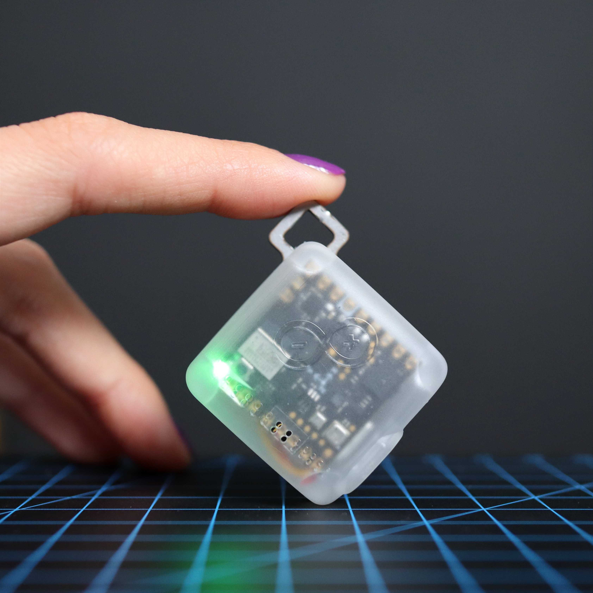

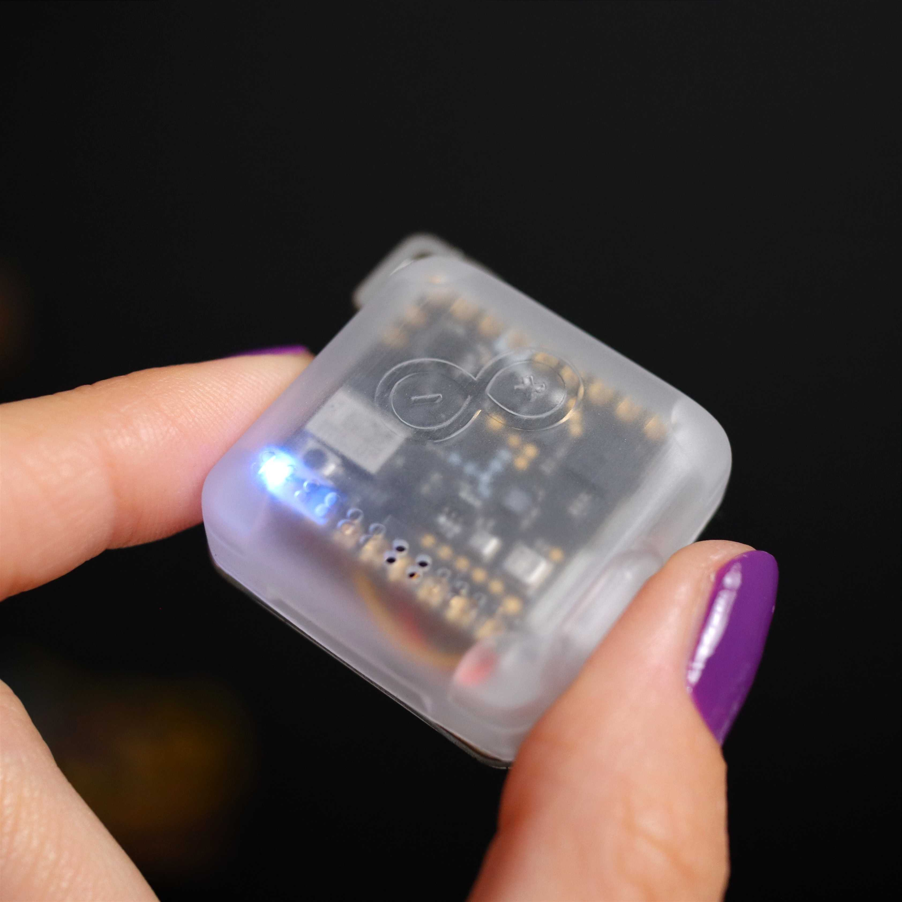

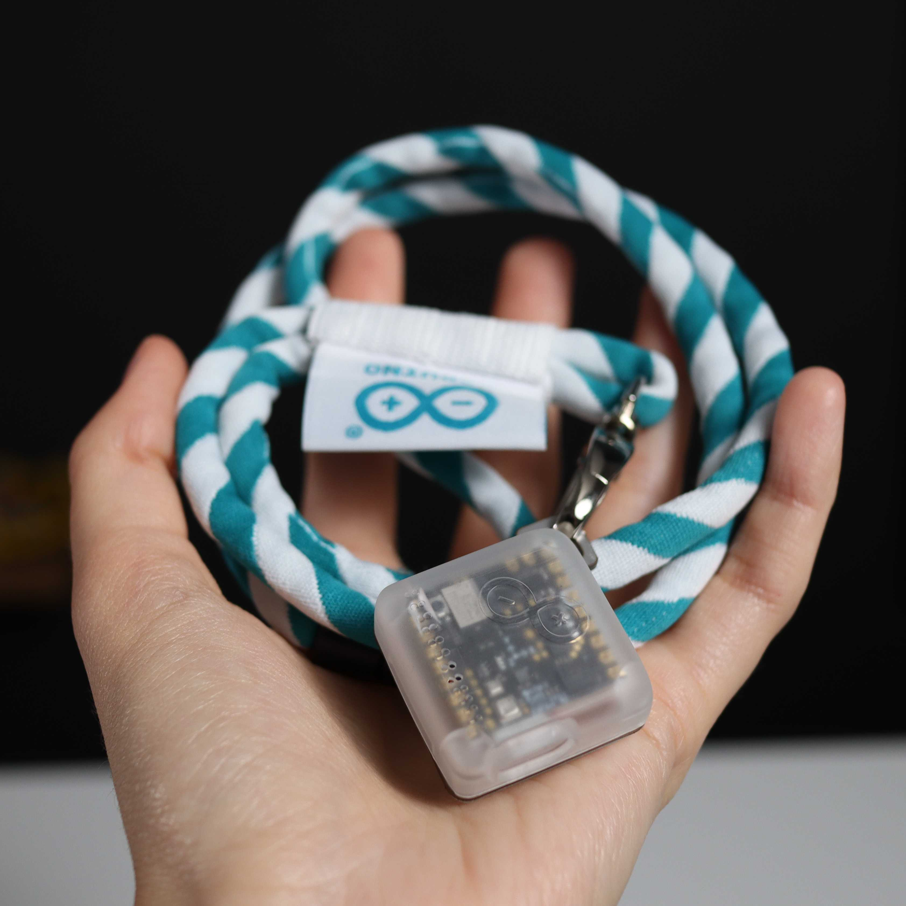

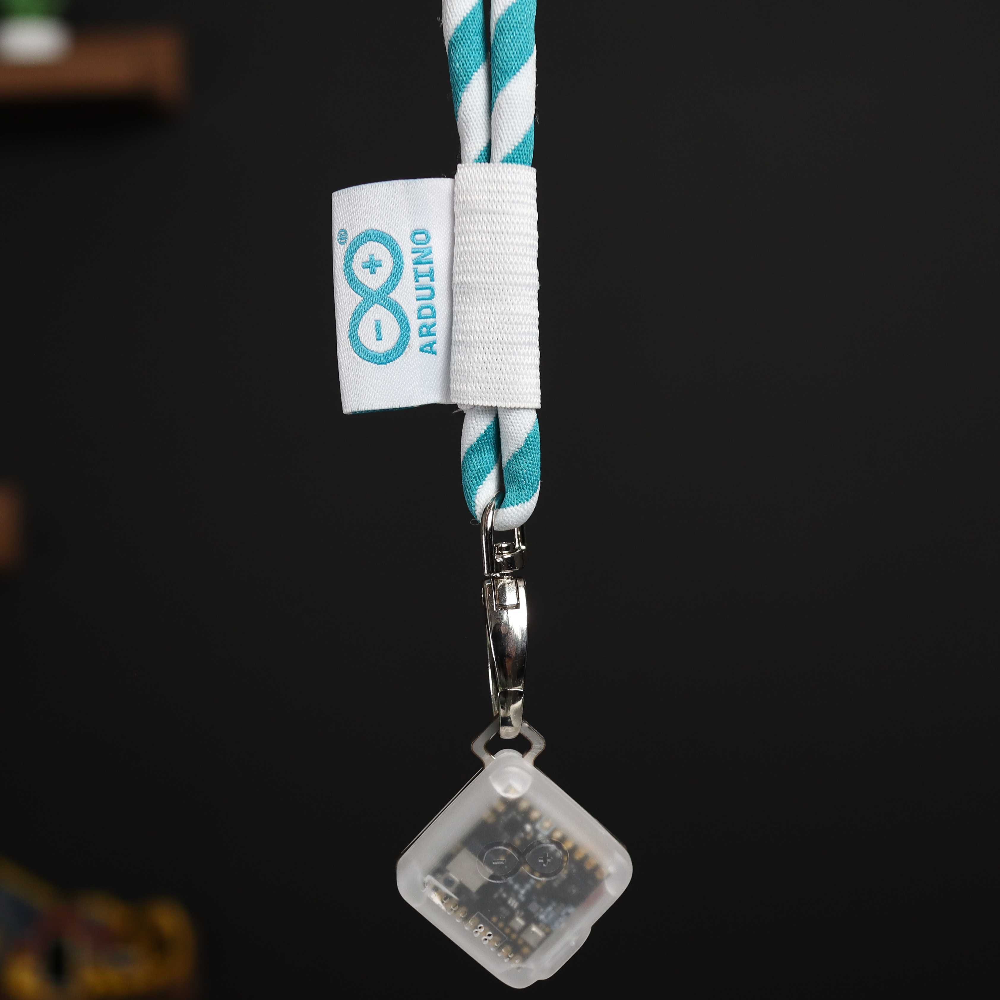

## Software Setup

In order to use the Edge Impulse platform, you will need to create an account. Once you have done so, log in and click on the "New Project" button. Enter a name for it, then select "Create Project". You should now be redirected to the project main page. Here, you will be able to configure the settings for your project, as well as add and train machine learning models.

The first step when designing a Machine Learning model is data collection, and Edge Impulse provides a straightforward method of doing this through their Data Forwarder, which can collect data from the device over a serial connection and send it to the Edge Impulse platform through their ingestion service. To use the Data Forwarder, install the Edge Impulse CLI following the steps from [here](https://docs.edgeimpulse.com/docs/edge-impulse-cli/cli-installation). 

To get started, you'll need to connect the Nicla Sense ME to your computer using a micro USB cable. Once it's connected, open up the Arduino IDE and go to the Board Manager (under Tools > Board) to install the board support package (Arduino Mbed OS Nicla Boards). 

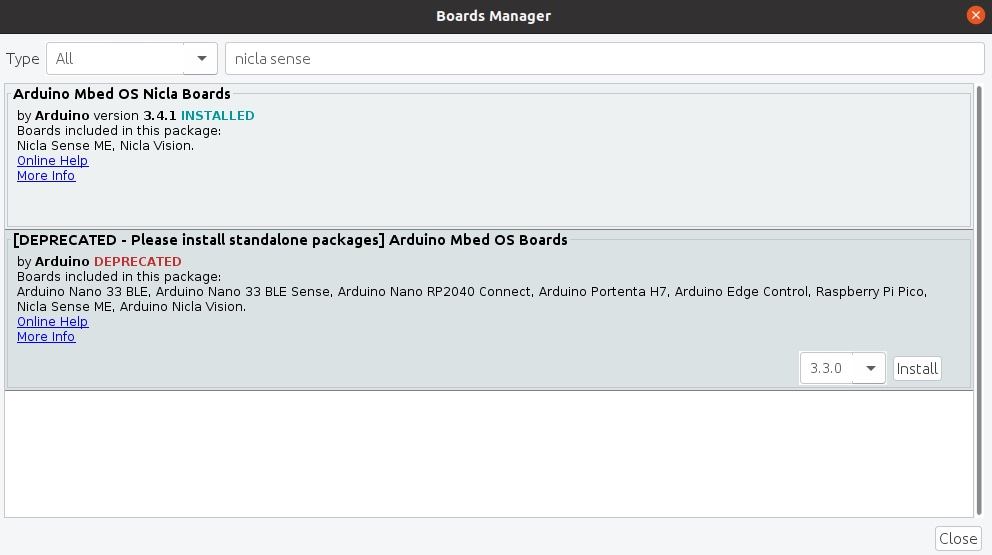

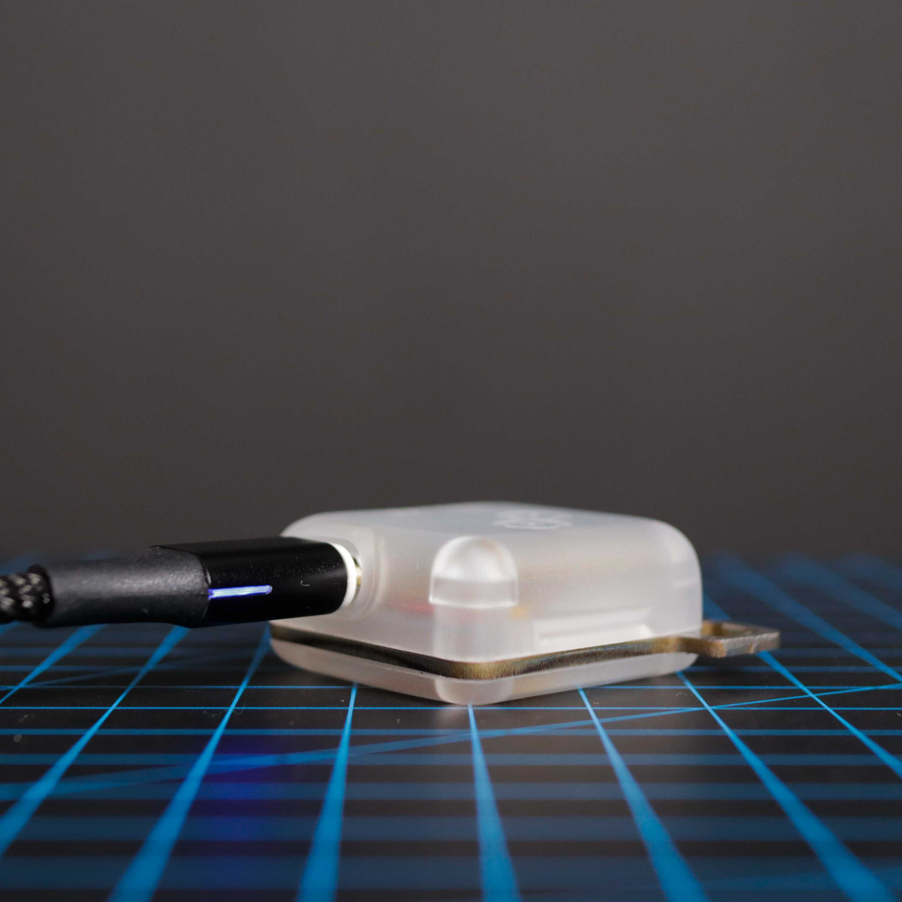

Next, go to Tools > Board > Arduino Mbed OS Nicla Boards and select the Nicla Sense ME board.

### Training the weather prediction model

#### Data collection

Download the Edge Impulse ingestion sketch from [here](https://github.com/Zalmotek/edge-impulse-arduino-k-way-outdoor-activity-tracker) and upload it to your board. 

We will collect data for three classes: 

- **Drop** - This class will be used to detect bad weather conditions. A quick drop in air pressure indicates the arrival of a low-pressure system, in which there is an insufficient force to push clouds or storms away. Cloudy, wet, or windy weather is connected with low-pressure systems, as explained [here](https://education.nationalgeographic.org/resource/barometer).
- **Rise** - This class will be used to detect good weather conditions. A sharp rise in atmospheric pressure drives the rainy weather away, clearing the sky and bringing in cold, dry air, as explained [here](https://education.nationalgeographic.org/resource/barometer).
- **Normal** - This class will be used to detect stable weather conditions.

In the Arduino sketch you’ll find the `ei_printf` function which sends data through a serial connection to your computer, which then forwards it to Edge Impulse. Depending on which class you want to collect data for, you’ll have to uncomment the corresponding line of code from the code snippet below. Since collecting enough real weather data for training the model would take a lot of time and is weather-dependent, for the purpose of this tutorial we will simulate the **Rise** and **Drop** classes using the `barometerValueHigh()` and the `barometerValueLow()` functions which generate arbitrary data based on an initial reading of the real measured pressure. To collect data for the **Normal** class, uncomment the `barometer.value()` function.

```
/* uncomment these functions depending on the class you want to collect data for */
ei_printf("%.2f,"
          //, barometer.value()
          //, barometerValueLow()
          , barometerValueHigh()
         );
```

From a terminal, run:

`edge-impulse-data-forwarder`

This will launch a wizard that will prompt you to log in and select an Edge Impulse project. You will also have to name the device and the axes of your sensor (in this case our only axis is **barometer**). You should now see Nicla Sense in the **Devices** menu on Edge Impulse.


With the data forwarder configured, we can now start collecting training data. Go to Edge Impulse > Data acquisition > Record new data, write the name of the class in the **Label** prompt, and click on **Start Sampling**. Each sample is 10s long and you should collect at least 2 minutes of data for each class. For the **Rise** and **Drop** classes, each time you collect a new sample you’ll have to press the reset button on the Nicla Sense board to reset the readings.

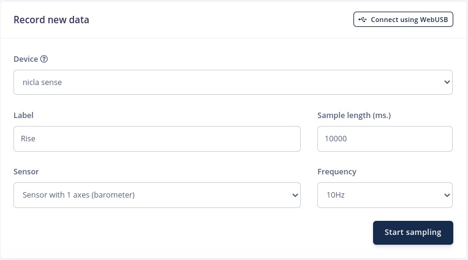

Your collected samples should look something like this:

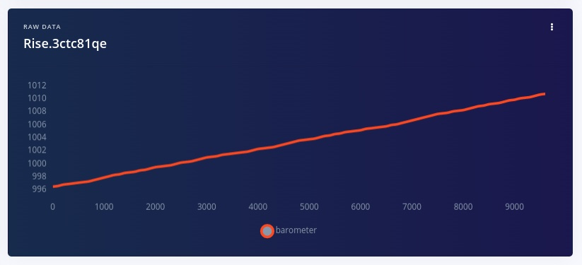

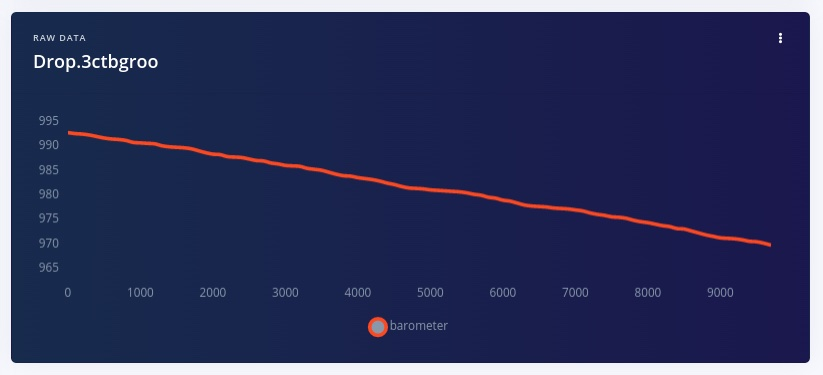

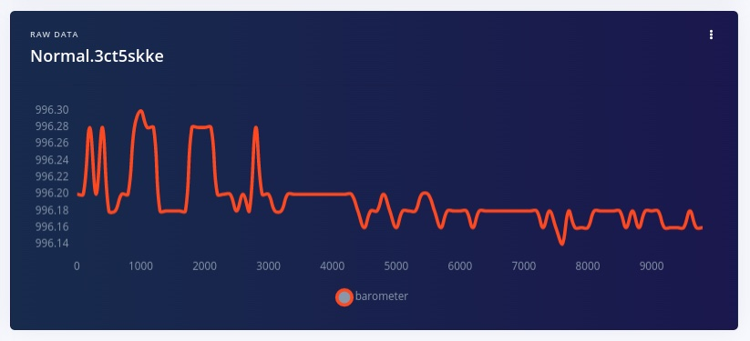

#### Designing the Impulse

Now that you have enough training data, you can design the impulse. Go to Impulse design > Create impulse on Edge Impulse and add a **Spectral Analysis** processing block and a **Classification (Keras)** learning block.

An **impulse** consists of a signal processing block used to extract features from the raw input data, and a **learning block** which uses these features to classify new data. The **Spectral Analysis** signal processing block applies a filter to remove noise, performs spectral analysis on the input signal, and extracts frequency and spectral power data. The **Classification (Keras)** learning block is trained on these spectral features and learns to identify patterns in the data that indicate which class a new data point should belong to.

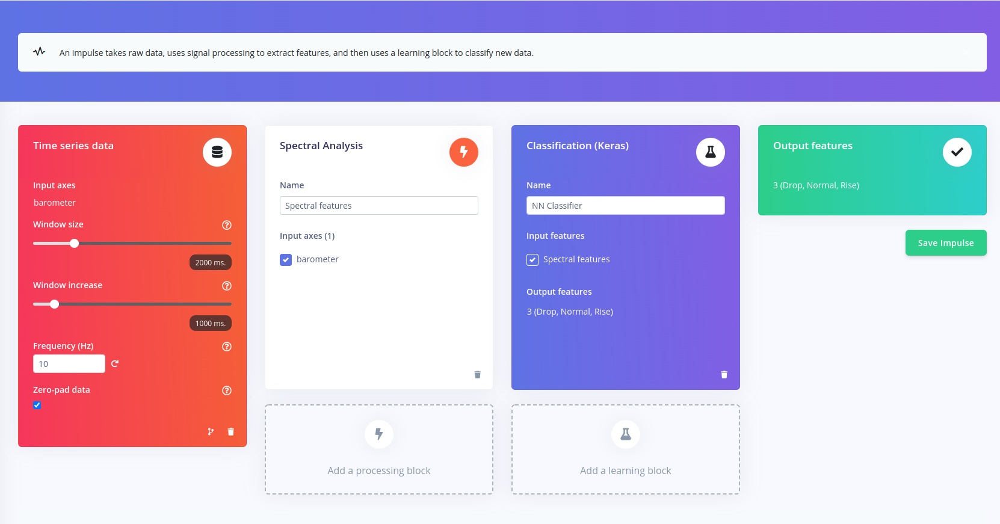

Click on **Save Impulse**, then go to **Spectral features** in the left menu. You’ll se the raw signal, the filtered signal, and the spectral power of the signal.


Click on **Save parameters** and you will be prompted to the feature generation menu. Glick on **Generate features** and when the process is done you will be able to visualize the **Feature explorer**. If your classes are well-separated in clusters, it means the model will easily learn how to distinguish between them.

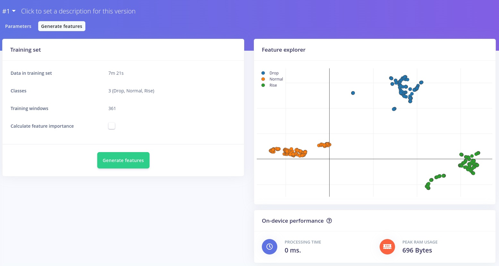

#### Training the model

Now go to **NN Classifier** and start training the model. At the end of the training you’ll see the accuracy and the loss of the model. A good performing model will have a high accuracy and a low loss. In the beginning, you can use the default training settings and adjust them later if you are not satisfied with the performance results.

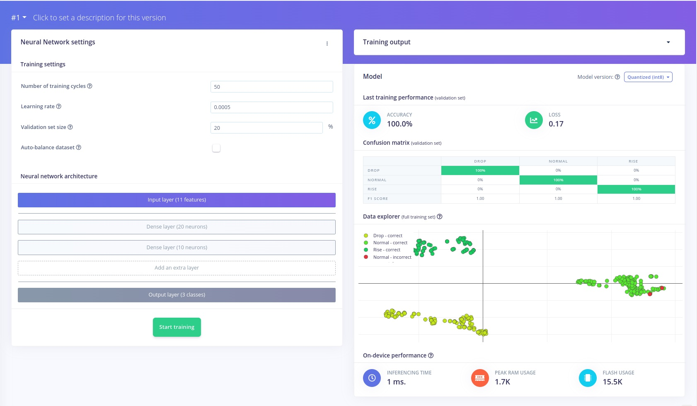

#### Testing the model

Go to **Model testing** and click on **Classify All** to see how your model performs on new data.

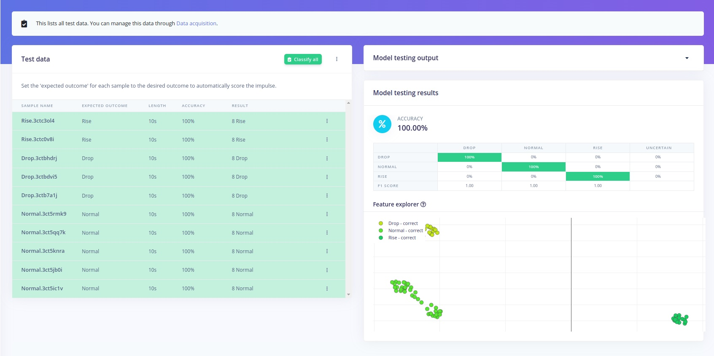

#### Deploying the model

Finally, go to **Deployment** and export the trained model as an Arduino library.

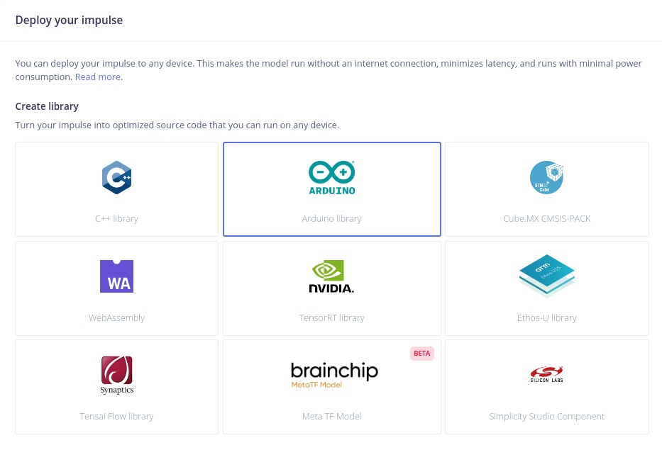

Unzip the downloaded library and move it into your **libraries** folder in your Arduino workspace. At Files > Examples > Examples for custom libraries > your_library_name > nicla_sense > nicla_sense_fusion you’ll find a sketch for running inference on your board. We’ll use the onboard RGB LED for visual feedback as follows:

- Red - pressure drop;
- Green - pressure rise;
- Blue - normal pressure.

You can turn on the LED by adding the following lines of code to the sketch:

```
// setup
nicla::begin();
nicla::leds.begin();

// loop
nicla::leds.setColor(red);
```

You can find the full code and the trained model [here](https://github.com/Zalmotek/edge-impulse-arduino-k-way-outdoor-activity-tracker).

### Training the activity tracking model

#### Data collection

Create a separate project on Edge Impulse and give it a name.

Download the Edge Impulse ingestion sketch from [here](https://github.com/Zalmotek/edge-impulse-arduino-k-way-outdoor-activity-tracker) and upload it to your board. 

Again, we will use the Data Forwarder to collect data, so run the following command from a terminal:

`edge-impulse-data-forwarder --clean`

This will launch a wizard that will prompt you to log in and select the Edge Impulse project. The `--clean` tag is used when you want to switch to a new project in case you’ve previously connected a project to the Data Forwarder. You will also have to name the device and the axes of your sensor (in this case the axes are in the following order: accel.x, accel.y, accel.z, gyro.x, gyro.y, gyro.z, ori.heading, ori.pitch, ori.roll, rotation.x, rotation.y, rotation.z, rotation.w). You should now see Nicla Sense in the Devices menu on Edge Impulse.

We will collect data for three classes, as described in the previous section: 

- Walking 
- Climbing
- Staying

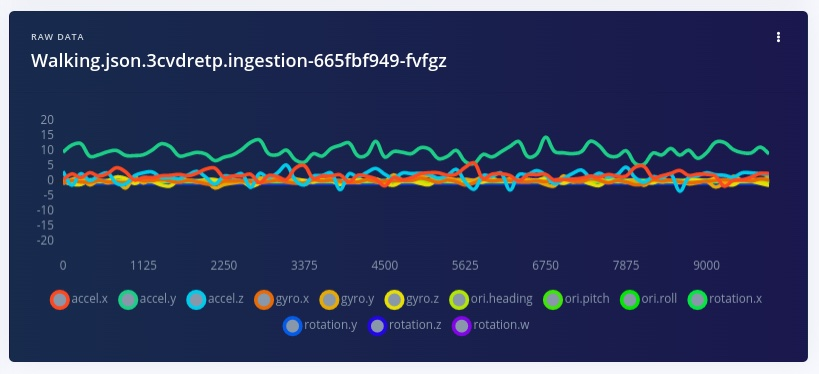

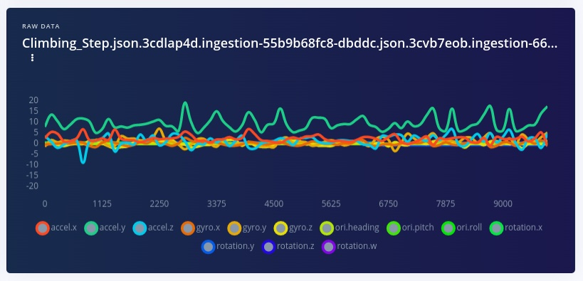

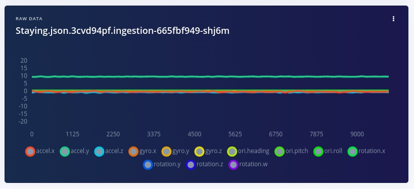

#### Designing the Impulse

The **Spectral Analysis** signal processing block can identify periodicities in data, which is helpful in this case since the motion and orientation data will have a predictable pattern when the user is sitting, walking, or climbing.

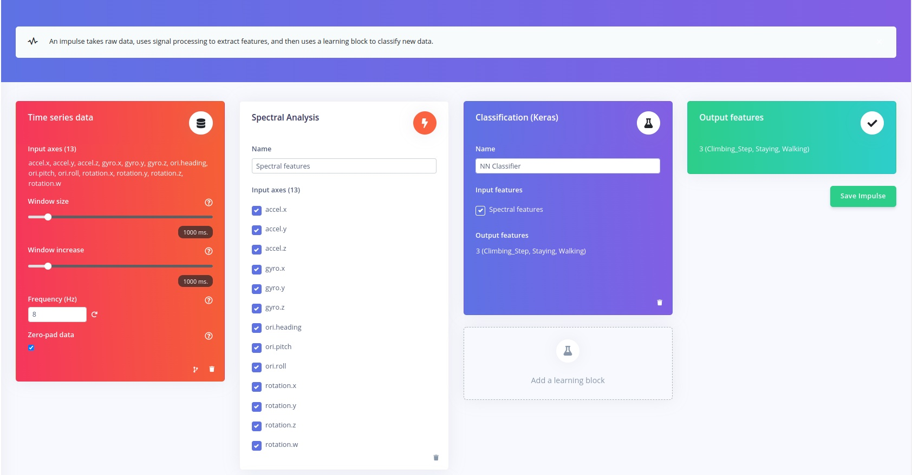

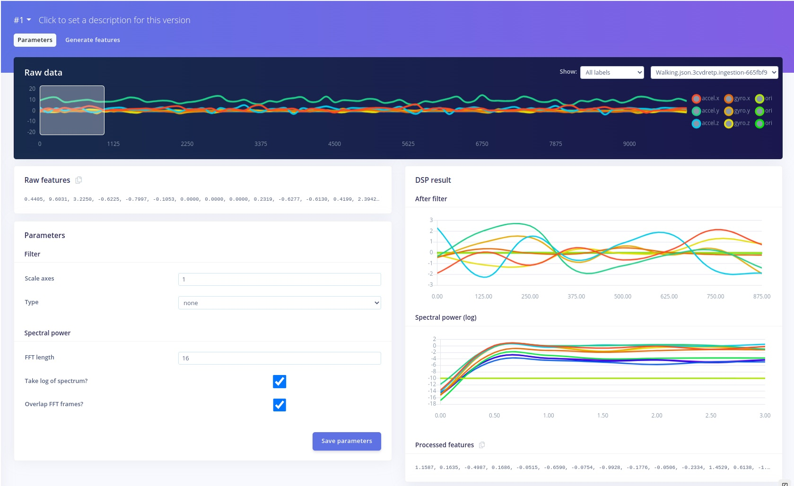

#### Training the model

Navigate to **NN Classifier** and begin training the model. Adjust the default training parameters if needed, in order to obtain a better training performance.

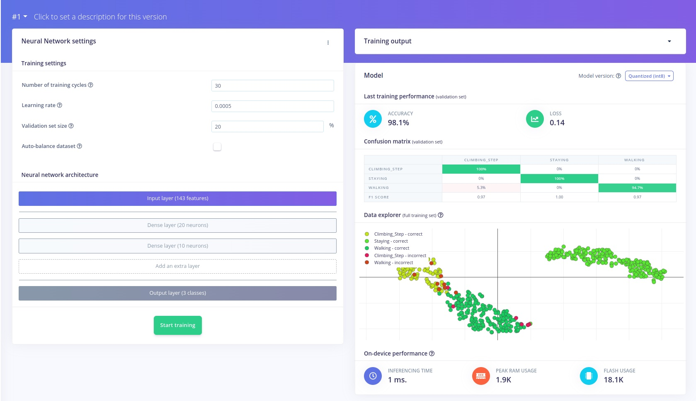

#### Testing the model

Finally, go to **Model testing** and click on **Classify All** to check how your model performs on new data.

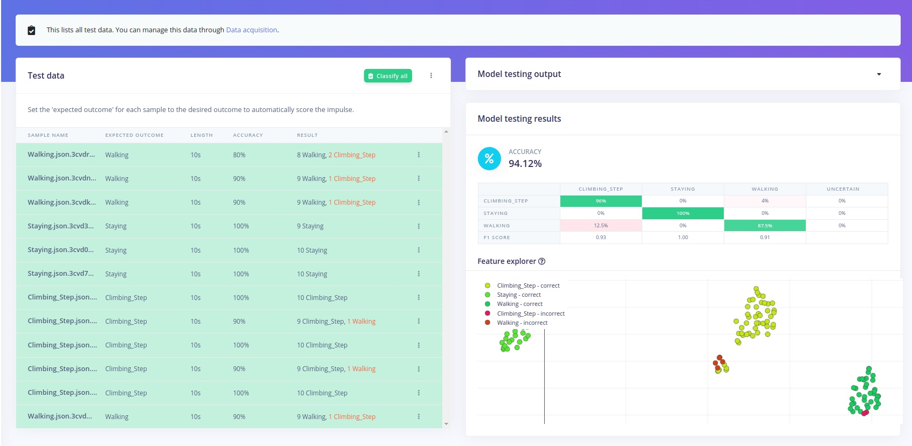

#### Deploying the model

Now you can deploy your model as an Arduino library by going to Deployment > Create library > Arduino library. You can also enable the EON Compiler to optimize the model.

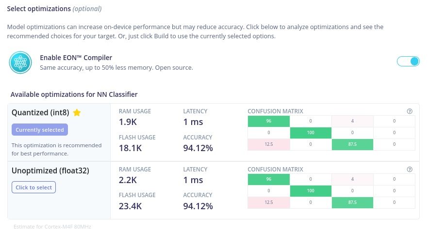

## Data gathering for ML

We will be using the Arduino IoT Cloud to store the data from the Nicla Sense ME board and visualize the metrics. The platform provides an easy-to-use interface for managing devices, sending data to the cloud, and creating dashboards. In order to use the Arduino IoT Cloud, you will need to create an Entry, Maker, or Maker plus account that allows you to create an API key for sending data online.

To generate your API credentials, follow the steps below:

1. Access your Arduino account.
1. Go to the [Arduino Cloud](https://cloud.arduino.cc/home/) main page.
1. In the bottom left corner, click **API keys**, and then **CREATE API KEY**. Give it a name and save it somewhere safe. After this, you will no longer be able to see the client secret.

Now go to [Arduino IoT Cloud](https://create.arduino.cc/iot/) and in the **Things** menu create a new **Thing** called Wearable.

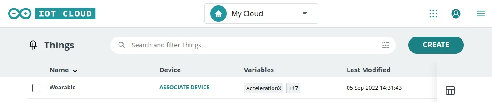

Click on the newly created thing and add variables for the metrics you want to monitor. We’ve used the following ones:

```
'AccelerationX',
'AccelerationY',
'AccelerationZ',
'GyroscopeX',
'GyroscopeY',
'GyroscopeZ',
'RotationW',
'RotationX',
'RotationY',
'RotationZ',
'OrientationHeading',
'OrientationPitch',
'OrientationRoll',
'StepCount',
'Temperature',
'Pressure',
'Humidity',
'Gas'
```

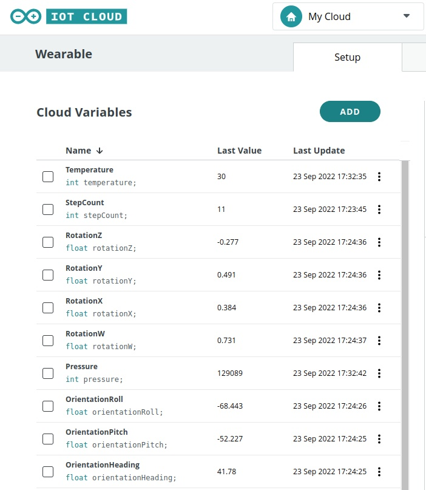

With the Arduino IoT Cloud configured, we can now start sending data from our device. To do this, download [this project](https://github.com/Zalmotek/edge-impulse-arduino-k-way-outdoor-activity-tracker) (which is an adaptation based on [this](https://docs.arduino.cc/tutorials/nicla-sense-me/cli-tool)) and add the Arduino_BHY2 folder to your Arduino libraries. Go to Examples > Arduino_BHY2 > App and upload this sketch to your device.

Now go to nicla-sense-me-fw-main/bhy-controller/src/ and run:

`go run bhy.go webserver`

A webpage will pop up and you’ll have to select Sensors. Turn on Bluetooth on your computer, then click Connect and select your Nicla board. After the devices are paired, enable the sensors you want to monitor and the webpage will start making requests to post data to Arduino IoT Cloud.

You can also configure a Dashboard to visualize your sensor data:

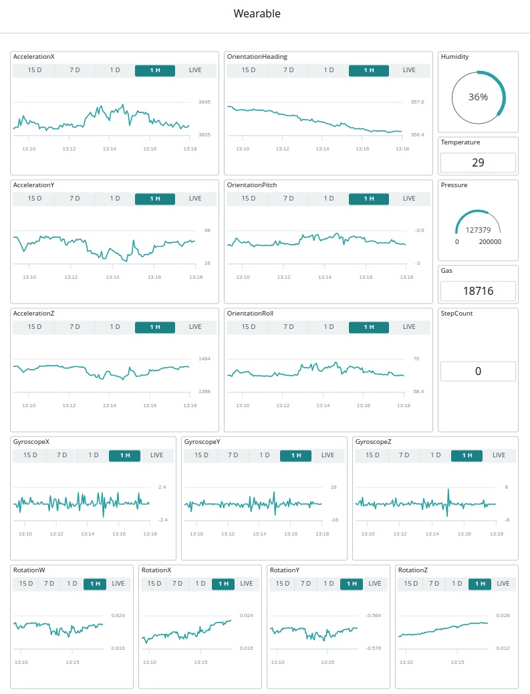

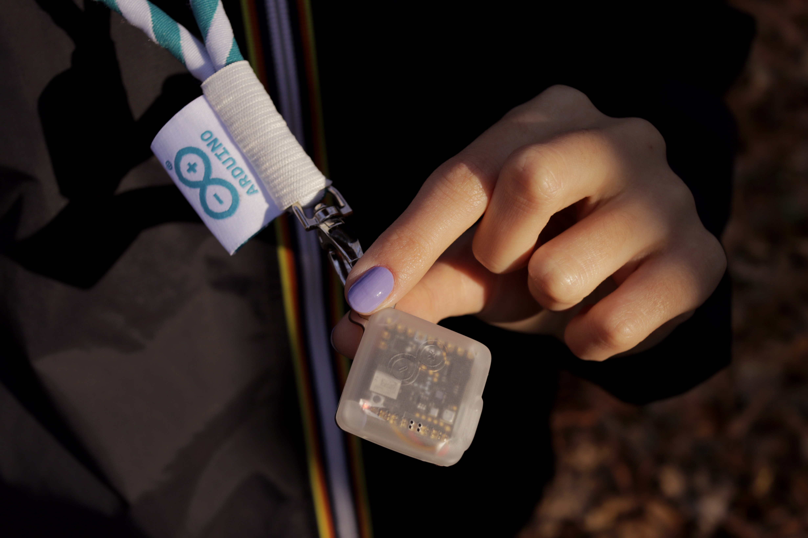

## Conclusion

The Arduino Nicla Sense ME is a great board for building an outdoor activity tracker that has the ability to monitor your progress on hikes, predict weather changes before they happen and log data for training Machine Learning models. With the Edge Impulse platform, you can effortlessly train Machine Learning models to run on edge devices, and with the Arduino IoT Cloud, you can easily store data for future machine learning processing.

Paired with the weather resistant K-Way jacket, you'll be able take this device along any time you head outdoors making sure you'll be ready for any adventure ahead of you!

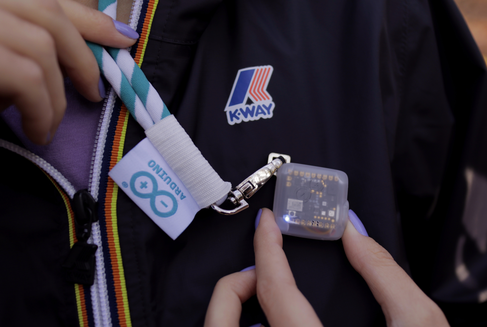

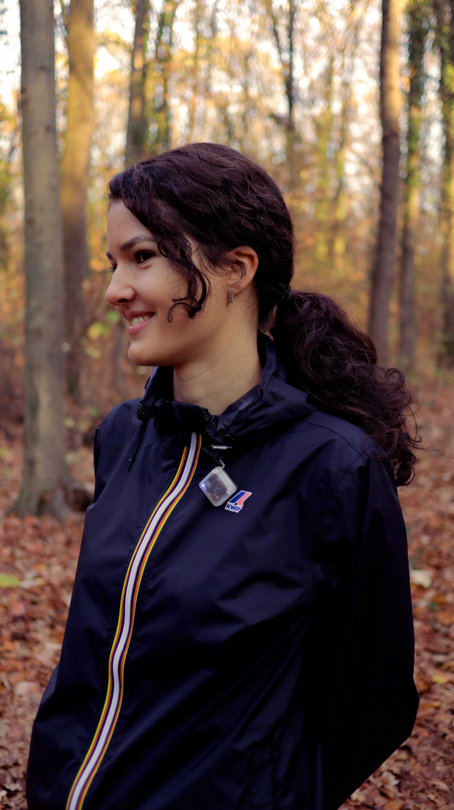

