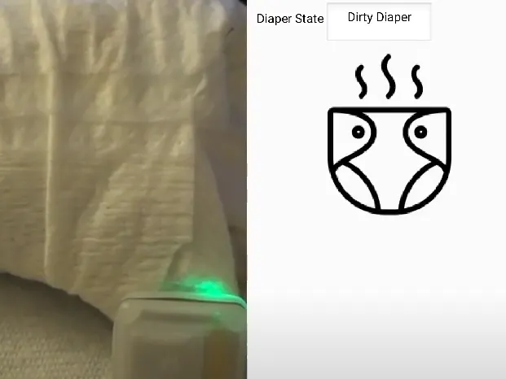
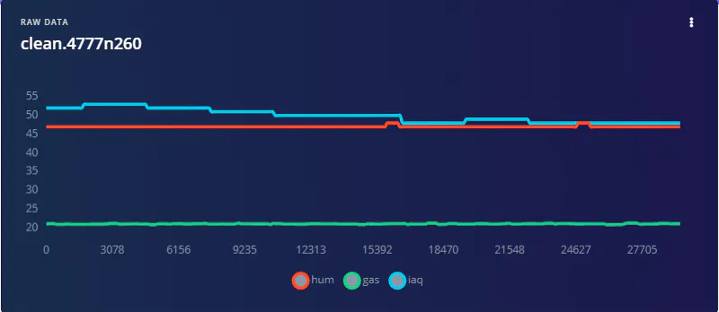
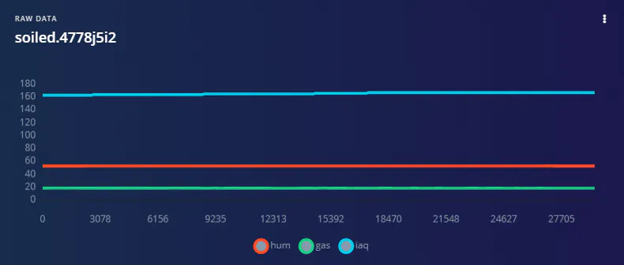
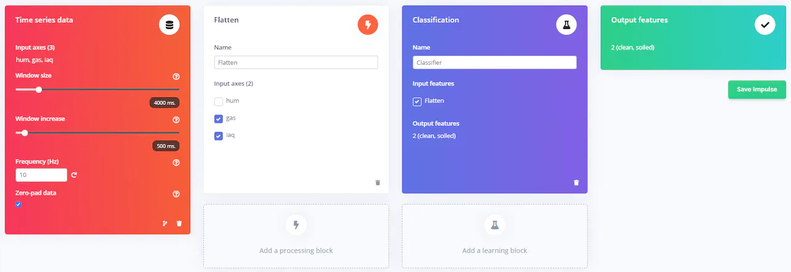
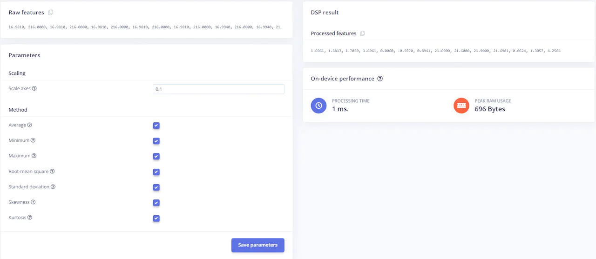
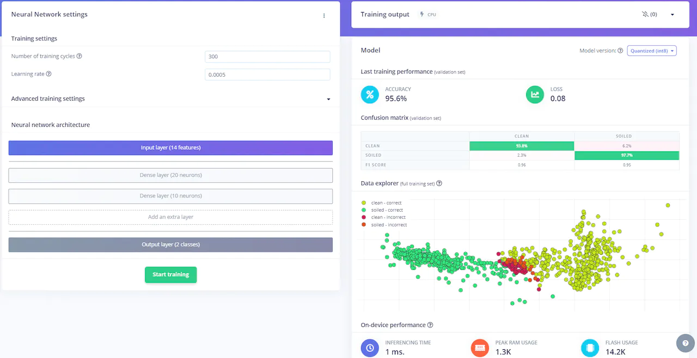
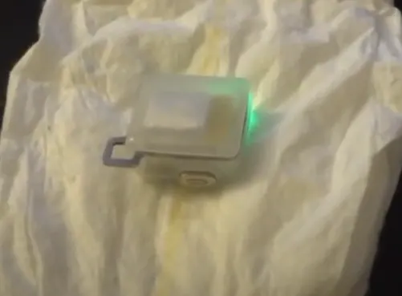
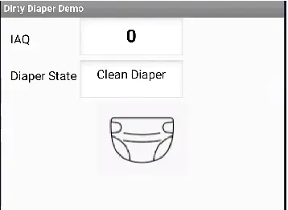
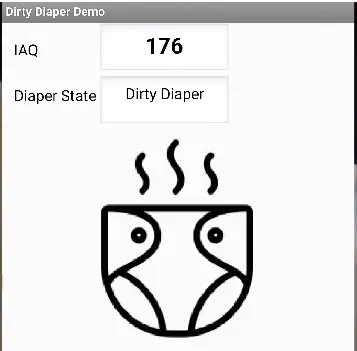

# Smart Diaper Prototype with an Arduino Nicla Sense ME

Created By:
Justin Lutz 

Public Project Link:
[https://studio.edgeimpulse.com/public/261411/latest](https://studio.edgeimpulse.com/public/261411/latest)

GitHub Repo:

[https://github.com/jlutzwpi/DirtyDiaperDetection](https://github.com/jlutzwpi/DirtyDiaperDetection)

## Project Demo



## Introduction

I'm sure there are not too many people out there who love to change diapers. It's messy, smelly, and the baby/toddler can squirm and move around. It's safe to say that neither party enjoys it! That being said, it is important to change a diaper when it is soiled. If left on for too long, a diaper rash can develop, which can result in painful sores in sensitive areas of the child. In severe cases, infection can result, which requires strong anti-biotics to resolve.

This project aims to mitigate the chances of diaper rash, by notifying a parent when a diaper is soiled. For the project, I used the [Nicla Sense ME](https://store-usa.arduino.cc/products/nicla-sense-me), which has a feature packed [BME688 sensor by Bosch](https://www.bosch-sensortec.com/products/environmental-sensors/gas-sensors/bme688/). This sensor is able to detect various gas readings, including an air quality (IAQ) reading which is derived from volatile organic compound (VOC) data. The Sense ME also includes several other sensors, but those weren't used for this project. Check out [Bosch's site to see the other sensors](https://www.bosch-sensortec.com/software-tools/tools/arduino-nicla-sense-me/) on the board.

The first step that I had to do was collect data to see which variables had the greatest change. I leveraged Edge Impulse's [nicla_sense_ingestion.ino sketch](https://docs.edgeimpulse.com/docs/development-platforms/officially-supported-mcu-targets/arduino-nicla-sense-me) to collect the data into the Edge Impulse tool and modified it to read IAQ data. I took a look at temperature, humidity, gas reading, b_voc (breath VOC), and IAQ (air quality) data. After a couple minutes of data collection, it was evident that temperature and b_voc (I later learned that the b stood for breath) had little impact on determining a clean vs dirty diaper. Which makes sense, ambient temperature wouldn't really be an indicator of whether a diaper is soiled or not. Humidity had a small change (it increased with a soiled diaper), but not big enough to stick out. The biggest changes I saw were in the IAQ reading and the gas sensor reading (see below) so I modified the ingestion sketch to just import humidity, IAQ, and gas readings.

Since the gas readings and the IAQ reading made the biggest changes between the 2 states (clean vs dirty), I established my model around those two variables.

I collected about an hour of data, 29 minutes each for a clean and soiled diaper. I then generated my Impulse:

Since I'm using multiple inputs for my model, I use the Flatten processing block and the Classification learning block. Notice I de-selected the humidity variable because it didn't make a huge difference (you can include it if you want because I did see humidity increase slightly with soiled diaper).

In the Flatten section of the Impulse, I did scale the axes slightly, going from 1 to 0.1. The remaining variables I left the same.

I then trained the model, running 300 epochs, keeping the learning rate the same.

The result was a respectable 95.6% accuracy, which I felt was adequate given that I had some input data that was borderline between the 2 classes.

Once I had tested the model using my test data, I deployed the model as an Arduino library.

I had used the Nicla Sense ME before, developing projects for [an Air Quality sensor](https://www.hackster.io/justinelutz/arduino-nicla-air-quality-app-48fda3) and [Smart Jacket for hiking](https://www.hackster.io/justinelutz/smart-jacket-with-k-way-and-nicla-sense-me-0300ff). I leveraged that experience to develop the Arduino code and the MIT App Inventor sketch for this project. There were also some lessons learned from the previous projects, like developing the code in PlatformIO (as opposed to the Arduino IDE, otherwise you have memory issues), changing the work buffer size in BoschSensorTec.h, and changing the SENSOR_DATA_FIXED_LENGTH to 30 in SensorTypes.h. It looks like I was able to use the SENSOR_ID_BSEC in lieu of the SENSOR_ID_BSEC_LEGACY ID, so that issue appears fixed.

I developed an Android app that connects to the Nicla Sense ME via Bluetooth LE. Once the connection is established, an LED on the Nicla changes from red to green.

The app is simple, indicating the IAQ value (mostly for validating the model) and the diaper state (the inference from the model). I then included simple graphics to show the diaper state. Ultimately I would expect alerts/notifications to be sent to the phone with an app running in the background.

One thing that I did notice was the IAQ value increasing even with a clean diaper. I figured out that was because the room I was working in was small and just me being in the room (exhaling CO2), I was impacting the IAQ reading! So I wrote a calibration function that warms up the sensor for 10 minutes, then averages out the next 30 readings. That average is subtracted from the real-time IAQ readings to cancel out any external variables to the IAQ reading.

You can see all the code in the [GitHub Repo here](https://github.com/jlutzwpi/DirtyDiaperDetection). I hope you enjoyed this write-up and it inspires you for your own projects!
