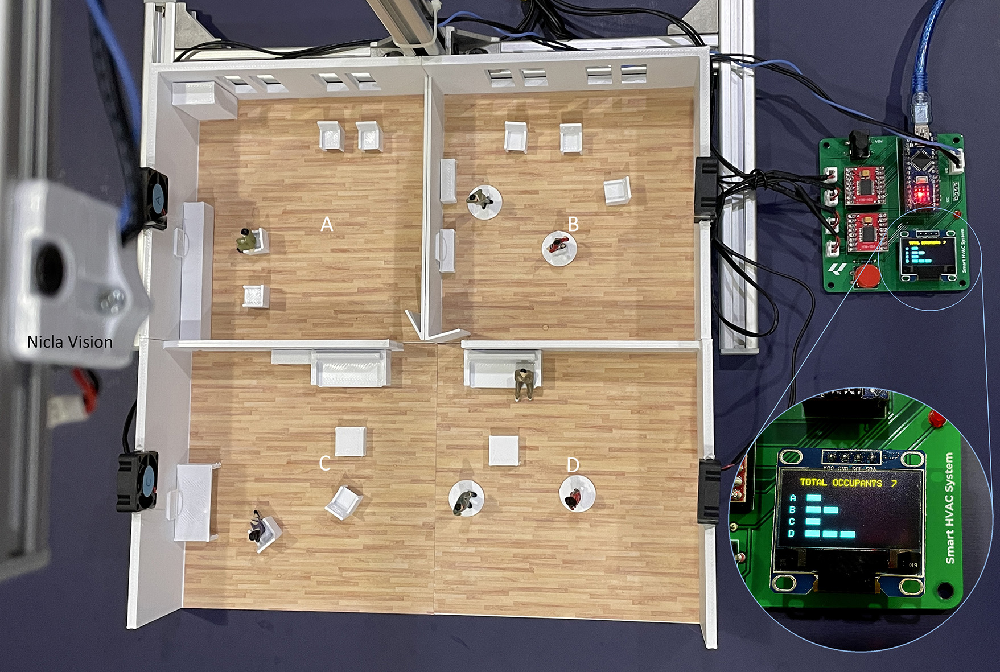
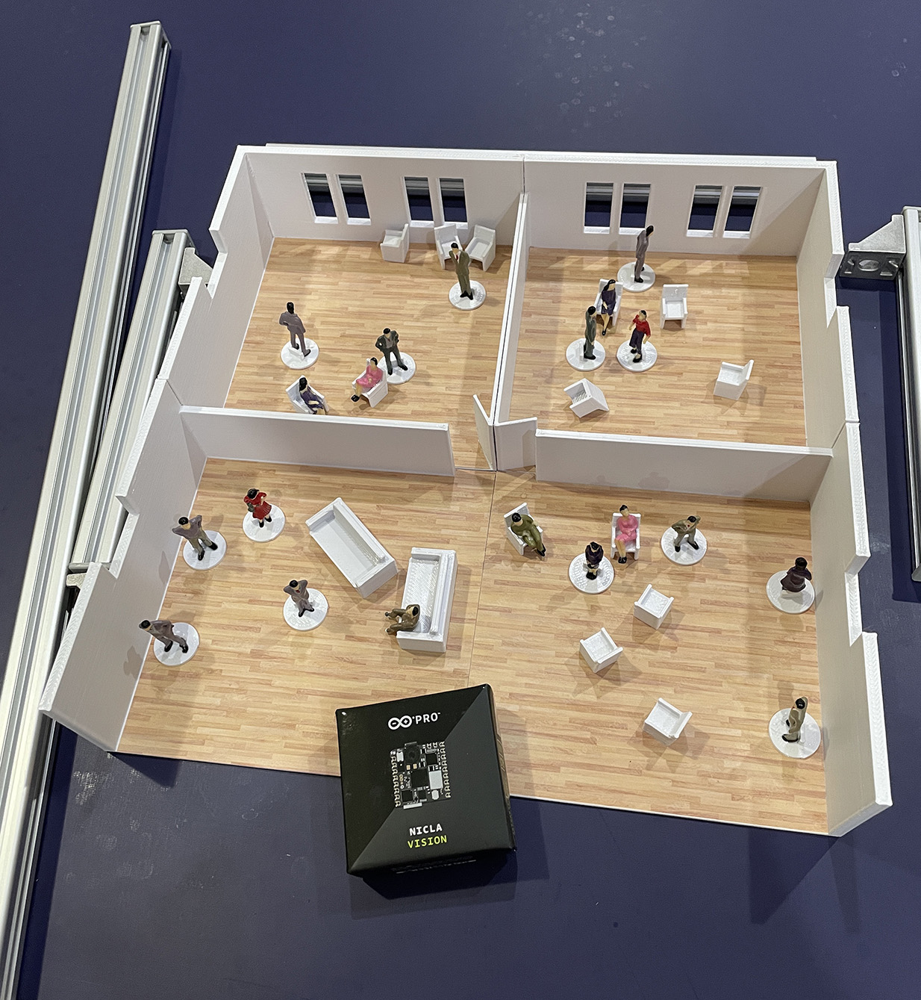
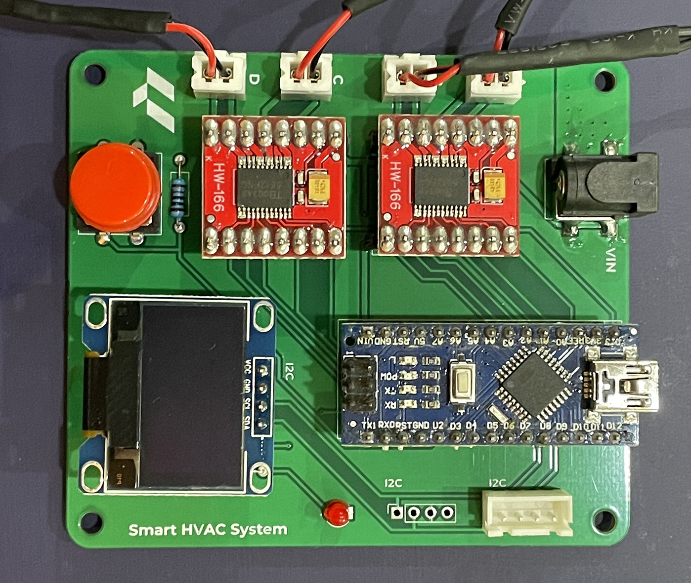
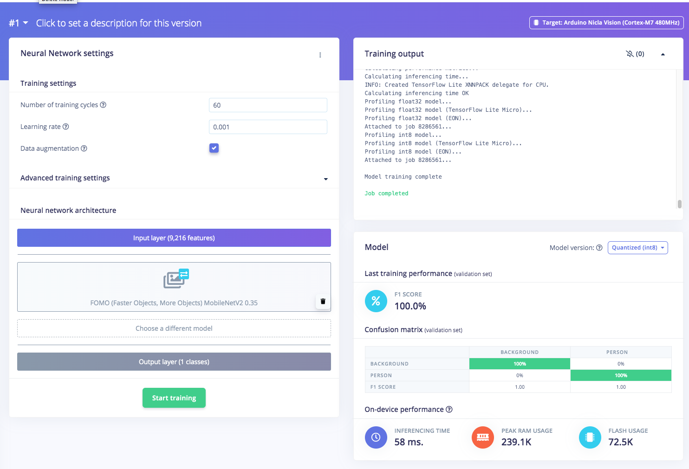
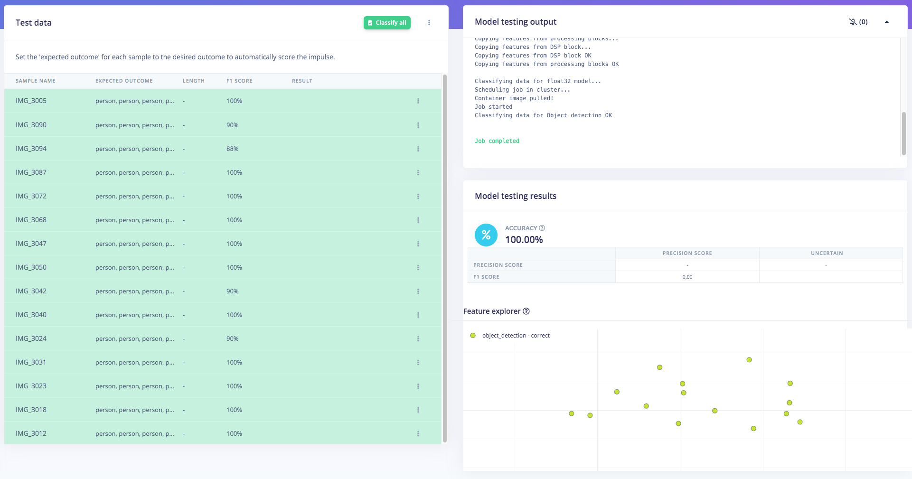
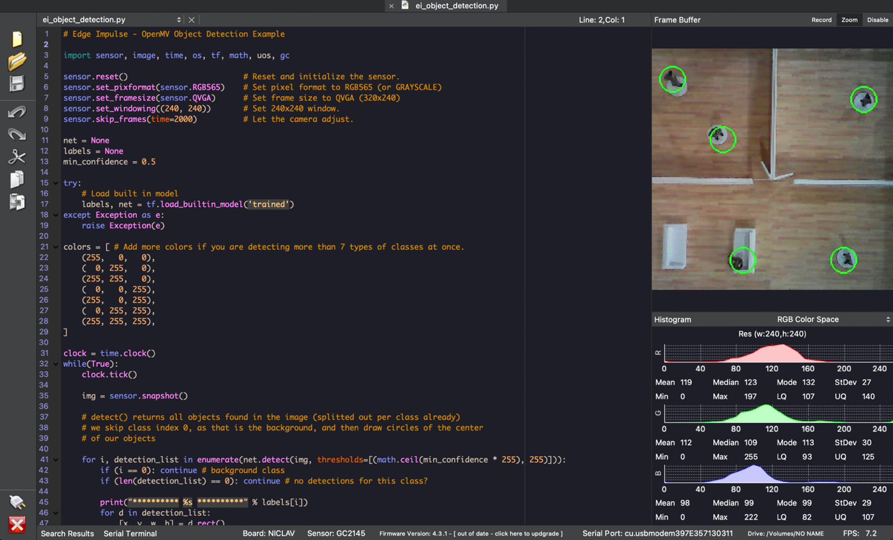
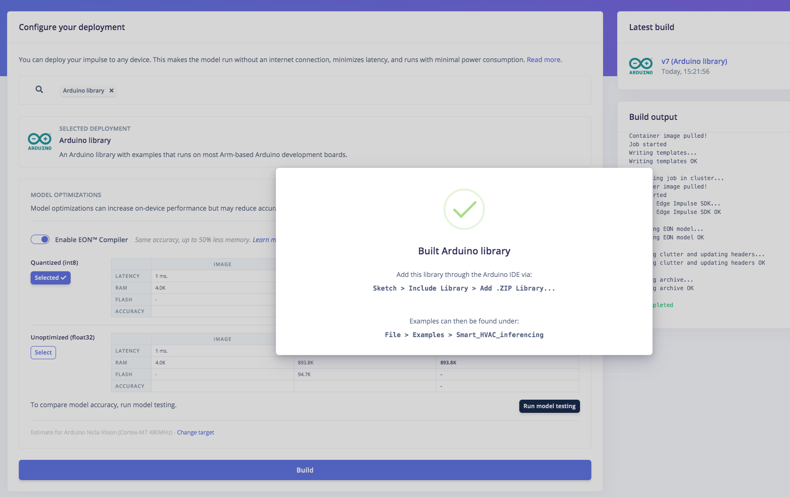
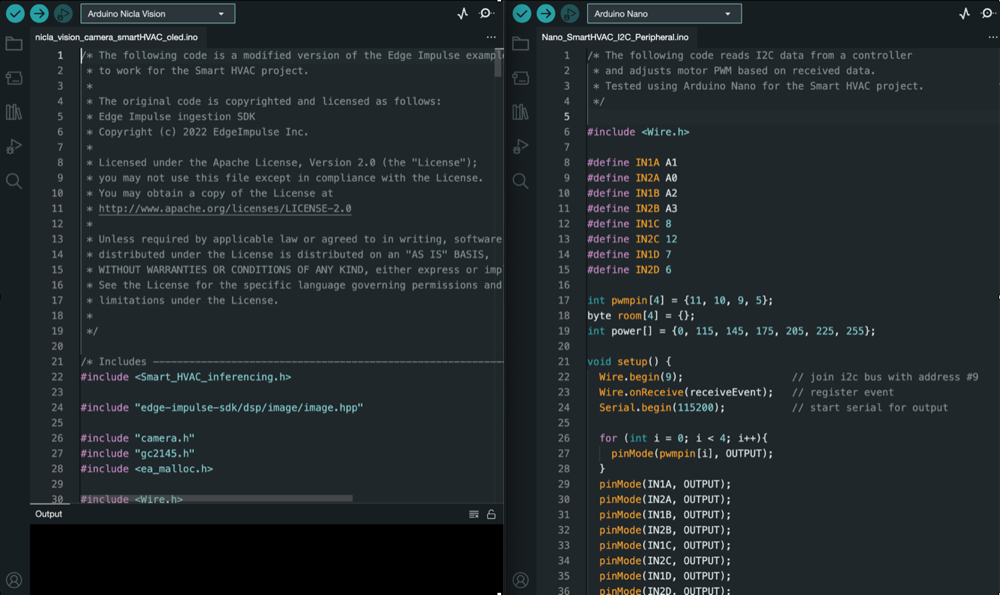

# Smart HVAC System with an Arduino Nicla Vision 

Created By:
Jallson Suryo 

Public Project Link:
[https://studio.edgeimpulse.com/public/215243/latest](https://studio.edgeimpulse.com/public/215243/latest)

GitHub Repo:
[https://github.com/Jallson/Smart_HVAC](https://github.com/Jallson/Smart_HVAC)

## Introduction

A common problem found in HVAC systems is that energy is wasted, because the system uses more energy than necessary, or the system cannot quickly adjust to the changing needs in a dynamic environment. To tackle the problem, we need a system that manages its power intensity based on what is necessary for each zone in real-time for a given environment. The power intensity necessary for each zone can be derived from the following data: number of people, time or duration spent inside, and/or the person's activity.

## Our Solution

To overcome this challenge, a Smart HVAC System that can optimize energy consumption by adjusting the power intensity in different zones inside an office or a residential space (zones with more people, more activity, and longer time durations will need more cooling/heating and vice versa) could be created. The zone heat mapping will be generated using data obtained from an Arduino Nicla Vision (with Edge Impulse's FOMO Machine Learning model embedded) that's mounted like a surveillance camera inside the space.

## Description

The project uses Edge Impulse's FOMO to detect multiple objects and its coordinates using a compact micro-controller with an on-board camera (the Nicla Vision). The object detection ML model will use the top view of miniature figures with standing and sitting positions as objects. The data captured will be divided into Training and Test data. Then the Impulse with Image and Object Detection as learning blocks and grayscale color blocks will be created.

The accuracy result for this training and test model is above 90%, so there is a higher degree of confidence when counting the number of objects (persons) and tracking their centroid coordinates.

The ML model is then deployed to the Nicla Vision. The number of objects in each zone is displayed on an OLED display. The Nicla Vision also communicates to an Arduino Nano via I2C which we are using for the fan speed controller.

This system will increase fan intensity on areas/zone that need more cooling/heating, which means more activity/people in a certain zone will increase fan intensity in that zone. The total HVAC power output can also be adjusted based on the total number of people in the space. 

The project is a proof of concept (PoC) using a 1:50 scale model with an office interior with several partitions and furniture and miniature figures. The space is divided into 4 zones, and each zone has a small fan installed. The OLED display is used in this PoC to show the output of this simulation.

Arduino Nicla Vision, aluminium extrusion frame, and 3D printed miniature model (1:50)

System Diagram, prototyping in breadboard, and Smart HVAC System with custom design PCB

### Hardware Components:

- Arduino Nicla Vision
- Arduino Nano
- 2x TB6612 Motor drivers
- 4x DC 5V mini fan 3cm
- 0.96inch OLED display
- Aluminium extrusion as a camera stand
- 3D printed (case, office interior 1:50 miniature)
- Powerbank & battery for Nicla Vision

### Software & Online Services:

- Edge Impulse Studio
- Arduino IDE
- OpenMV IDE

## Steps

### 1. Prepare Data / Photos

In this project we will use a smartphone camera to capture the images for data collection for ease of use. Take pictures from above in different positions with backgrounds of varying angles and lighting conditions to ensure that the model can work under slightly different conditions (to prevent overfitting). Lighting and object size are crucial aspects to ensure the performance of this model.

> Note: Keep the size of the objects similar in size in the pictures. Significant difference in object size will confuse the FOMO algorithm.

### 2. Data Acquisition and Labelling

Open [studio.edgeimpulse.com](http://studio.edgeimpulse.com), login (or create an account first), then create a new Project.

Choose the **Images** project option, then **Classify Multiple Objects**. In Dashboard > Project Info, choose Bounding Boxes for labelling method and Nicla Vision for target device. Then in Data acquisition, click on Upload Data tab, choose your photo files, auto split, then click Begin upload.

Click on Labelling queue tab then start drag a box around an object and label it (person) and Save. Repeat until all images are labelled. 

Make sure that the ratio between Training and Test data is ideal, around 80/20.

### 3. Training and Building Model using FOMO Object Detection

Once you have the dataset ready, go to Create Impulse and set 96 x 96 as the image width - height (this helps in keeping the ML model small, to fit within the Nicla's memory size). Then choose Fit shortest axis, and choose **Image** and **Object Detection** as learning and processing blocks.

Go to Image parameter section, select color depth as Grayscale, then press Save parameters. Then click on Generate and navigate to Object Detection section, and leave training settings for the Neural Network as it is — in our case the defaults work quite well, then we choose **FOMO (MobileNet V2 0.35)**. Train the model by pressing the Start training button. You can see the progress on the right side.

If everything is OK, then we can test the model. Go to Model Testing on the left, then click Classify all. Our result is above 90%, then we can move on to the next step -- deployment.

### 4. Deploy to OpenMV Firmware and Test

To use the OpenMV firmware, you will need the OpenMV IDE installed on your computer. Once you have the IDE ready, if you check the downloaded .zip folder you will find a number of files. We will need the following files:

*edge_impulse_firmware_arduino_nicla_vision.bin* and *ei_object_detection.py*. 

The next step is loading the downloaded firmware containing the ML model to the Nicla Vision board. So go back to OpenMV and go to Tools -> Run Bootloader (Load Firmware), select the *.bin* file in the unzipped folder, and click Run.

Next, we will run the python code. Go to File -> Open File and select the .py python file from the unzipped folder. Once the file is opened, connect the Nicla Vision board, select the serial/com port and click the green “play” button. The program should be running now and you can see the FOMO object detection will run in a small window.

### 5. Deploy and Build an Arduino Program

You should have the Arduino IDE installed on your computer for the following step. Once the Edge Impulse Arduino Firmware is built, downloaded and unzipped, you should download the *nicla_vision_camera_smartHVAC_oled.ino* code which can be [downloaded here](https://github.com/Jallson/Smart_HVAC/blob/main/nicla_vision_camera_smartHVAC_oled.ino) and place it inside the unzipped folder from Edge Impulse. Once the *.ino* code is inside Edge Impulse unzipped folder, move it to your Arduino folder on your computer. Now you can upload the *.ino* code to your Nicla Vision board via the Arduino IDE.

The *.ino code* is a modified version of the Edge Impulse example code for object detection on Nicla Vision. The modification adds capability to display person count on each room to the OLED screen and act as the controller to the Arduino Nano I2C peripheral. The code distinguishes the four rooms using four quadrants and by knowing the X, Y coordinates of the object’s centroid we can locate the person. The Arduino Nano adjusts the fan motor using PWM based on the number of persons present in the room.

The code for the Arduino Nano peripheral *Nano_SmartHVAC_I2C_Peripheral.ino* can be [downloaded here](https://github.com/Jallson/Smart_HVAC/blob/main/Nano_SmartHVAC_I2C_Peripheral.ino).

Here is a quick prototype video showing the project:



## Conclusion

Finally, we have successfully implemented this object detection model on an Arduino Nicla Vision, and use the data captured from the camera to automatically control the HVAC system's fan power intensity and display the occupancy number and power meter for each zone. I believe this Proof of Concept project can be implemented in a real-world HVAC system, so that the goal of optimizing room temperature and saving energy can be achieved for a better, more sustainable future.

Complete demo video showing the project:


