# Using a "Bring Your Own Model" Image Classifier for Wound Identification

Created By:
Jackline Tum 

Public Project:
[https://studio.edgeimpulse.com/public/240673/latest](https://studio.edgeimpulse.com/public/240673/latest)

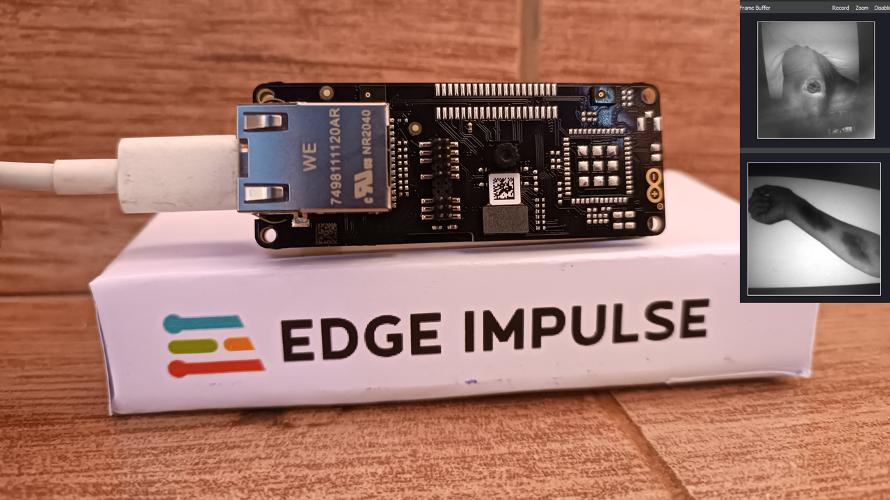

## Introduction

Wound classification is a crucial step in wound diagnosis. This process helps clinicians to identify the right treatment procedure for a type of wound. Chronic wounds have an impact on human health and affects the quality of life, both emotionally and financially. According to the [Wound Care Learning Network](https://www.hmpgloballearningnetwork.com/site/wounds/article/wound-care-outcomes-and-associated-cost-among-patients-treated-us-outpatient-wound-centers-d), an estimate of more than $50bn is spent on caring for wounds.

Wound Classification has been a manual process done by specialists, but in the current age of AI advancements and  intelligent machines, tools such as AI cameras can reduce the cost and time in wound diagnosis and with the right data, make better predictions. This can be of importance to patients who might not have access to clinicians and perform self diagnosis on themselves, or in remote rural areas where there is no access to good wound care practices.

Overall, proper wound classification will result in the right treatment, improving the healing process and in general human health. 

## Solution

In this tutorial we will perform wound classification to distinguish between a bruise and a diabetic wound with a custom model deployed on an Arduino Portenta H7 + Vision Shield using the newly unveiled Edge Impulse [Bring Your Own Model (BYOM)](https://docs.edgeimpulse.com/docs/edge-impulse-studio/bring-your-own-model-byom) capability. With this feature, Machine learning engineers can build state of the art models and deploy them to their target edge devices with minimal effort.

### Hardware

An Arduino Portenta is a great fit for our use case because it is a powerful board that has two processors, a **Cortex M7** running 480 MHZ and a **Cortex M4** running at 240 MHZ. Both the the processors share the on-chip peripherals and can run Tensorflow Lite and Micropython, which we’ll need to deploy our model.

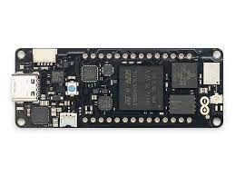

The Vision Shield has an ultra low power camera , with 320 x 320 pixel resolution and support for QVGA which captures images for inference. 

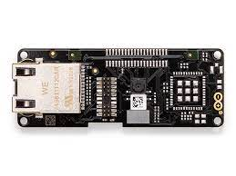

#### Hardware Requirements    

1. Arduino Portenta H7 
2. Portenta Vision Shield
3. USB-C cable

#### Software Requirements

1. [Edge Impulse Account](https://edgeimpulse.com/)
2. [Arduino IDE](https://support.arduino.cc/hc/en-us/articles/360019833020-Download-and-install-Arduino-IDE)
3. [OpenMV IDE](https://openmv.io/pages/download)
                                   
### Hardware Setup

First, Install both the Arduino IDE and OpenMV IDE.

OpenMV IDE is used to view the camera output and run inference scripts, while the Arduino IDE is used to update the bootloader on the Portenta H7.

Follow the steps below to ensure you have the latest version of the bootloader: 

Connect the Vision Shield to the Portenta H7.

Connect the Board to your computer with a USB-C cable. 

Open your Arduino IDE, make sure your board is connected, then click **Files** > **Examples** > **STM_32H747_System** > **STM_32H747_manageBootloader** .


A new window with a sketch to update bootloaders for different Arduino boards pops up.


Compile and upload the Sketch, and when done **Double press the reset button** on the board. The built-in green LED will start fading in and out.

Open your OpenMV IDE, and click on the **Connect** Icon.

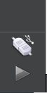

A screen will appear with the message **A board in DFU mode was detected**. Select the "Install the latest release firmware". This will install the latest openMV firmware in the development board. Optionaly, leave the "Erase all files" option as it is and click **OK**. 

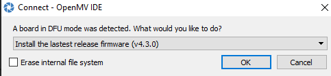

The green LED will flash as the firmware is being updated. Once the process ends, a **DFU update complete** message appears on the screen. 

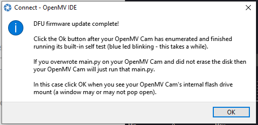

With this process completed the Portenta Board is now connected to OpenMV IDE and ready for deployment. 

## Data Collection

Wound diagnosis is a critical step in wound care and therefore requires an accurate dataset. In order to collect a dataset, there is a need to do so with the help of a licensed clinician. We use the AZH dataset for Diabetic Images, which was labeled by a specialist from the [AZH Wound and Vascular Center](https://www.ncbi.nlm.nih.gov/pmc/articles/PMC9681740/). This ensures that the model is trained with accurate data. For the Bruise Images we use a curated dataset from Kaggle.

We then perform data cleaning to remove any images that appear blurred, empty or distorted. I also wrote a custom script to perform augmentation on the data using Keras data generator in order to increase the number of images in the dataset. This script performs various transforms such as rotation and flipping.

The code in [this notebook](https://github.com/tum-jackie/Wound-Classification-with-Edge-Impulse/blob/main/Notebooks/Data_Augmentation.ipynb) performs various data augmentation on the dataset, and then saves the data in a directory to be used in training the model. 

### Link to the Datasets

[AZH DATASET](https://github.com/uwm-bigdata/wound_classification)

[KAGGLE DATASET](https://www.kaggle.com/datasets/yasinpratomo/wound-dataset)

## Model Training

In this project, we leverage Bring Your Own Model (BYOM) capabilities offered by Edge Impulse, which enables easy deployment of models trained on various development platforms onto edge devices. 

The model training process took place on Google Colab. We utilize Transfer Learning with a MobileNet architecture and TensorFlow framework. By using the pre-trained MobileNetV2, we can benefit from its high-performance feature extraction capabilities while training on the wound dataset.

We then optimize the model for edge deployment by applying **Post Training Quantization**, a technique that reduces the model size without significant loss in accuracy. This technique aids in minimizing the memory footprint and storage requirements of the model while maintaining its perfomance. 

Once the model is trained and optimized, we converted it to the TensorFlow Lite format, which is compatible with the Edge Impulse Platform. We saved and downloaded the model for further use. Find all the [code on GitHub](https://github.com/tum-jackie/Wound-Classification-with-Edge-Impulse/tree/main) with the necessary steps, including training, quantization, conversion, and saving, to enable the deployment of the Model to Edge Impulse Platform. 

## Model Deployment

Create an account on [Edge Impulse](https://edgeimpulse.com/) if you haven't yet, create a new project, name it and then select "Developer" for the project type.

Because we want to deploy our model to our device and not collect data, select **Upload Model**. If you have an existing testing set, you can upload the images with the Existing data tab.

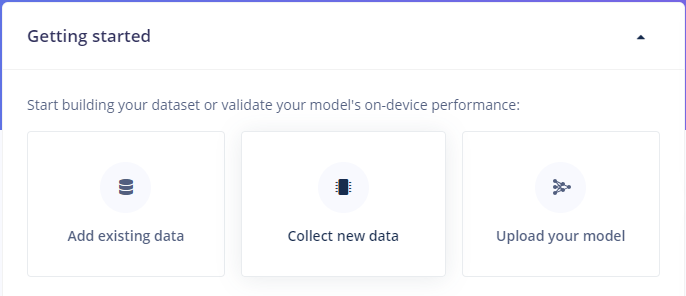

Upload the  model in any of the formats accepted by Edge Impulse platform. Select the **Target device** and perform profiling for it.

Profiling lets us know how much of the device resources our model will use up once deployed on the target board. 

Alternatively, select to **Profile** for a range of devices to get information on how the model will perform on other devices.

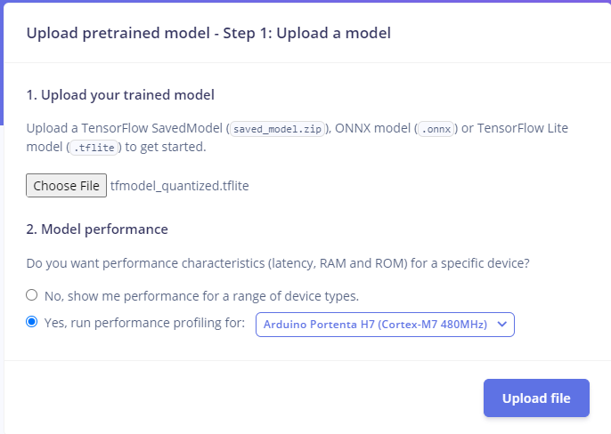

Once the model is uploaded, set the model configurations. The **Model input** is the image input shape that was set when training the model. In this case, the input shape accepted by the model is an image with 96 x 96 resolution. The model output is **Classification** and then we enter the class labels. We have two classes, **bruise** and **diabetic**. Save the model and head to the **Deployment** tab.

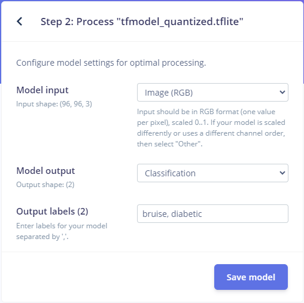

These are the **Profiling** results. The model uses 338.7KB of RAM and 573.6KB of Flash memory.

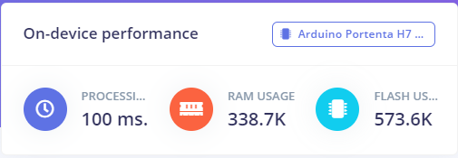

We can check the model behavior by uploading a test image. We use an image that was not used during the training process in order to better identify how the model performs with unseen data. 

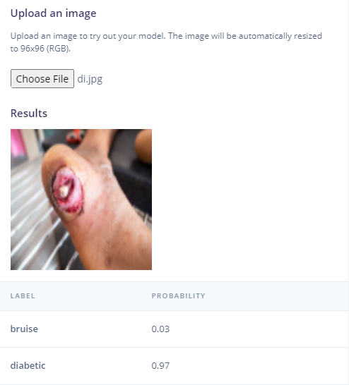

The model performs well on one image. We then upload a set of images as Test images to further test the model perfomance before deploying the model on Arduino Portenta.

From the **Dashboard**, head to the **Data acquisition** tab, and upload a set of images as test data.

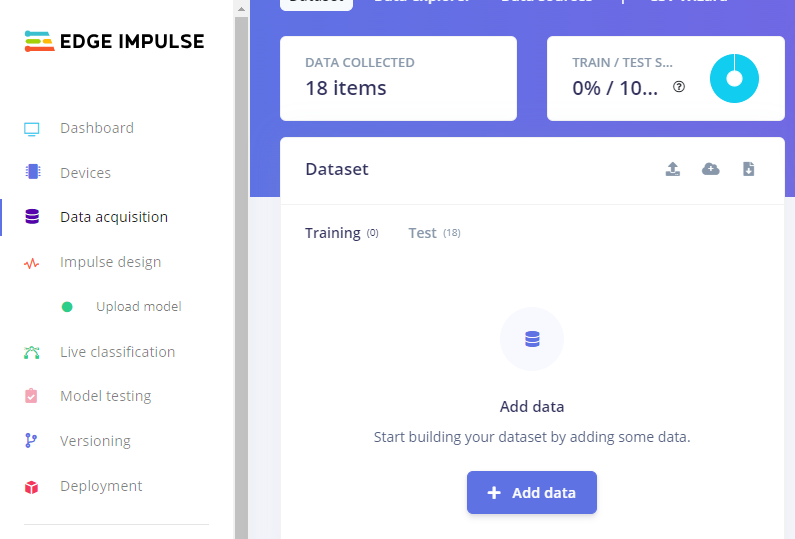

From the Dashboard, head to the **Model testing** tab and click **Classify all** to see how the model performs.

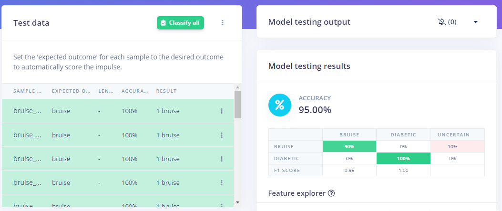

The model perfomance is quite satisfactory and we can now deploy to our target device. 

There are different ways to  deploy a model to the Arduino Portenta H7: as an arduino library, an OpenMV library, firmware, or a C++ library.

In this tutorial we will deploy to the Portenta as an OpenMV library. Head to the **Deployment tab**, search for the OpenMV  library and click **Build**.

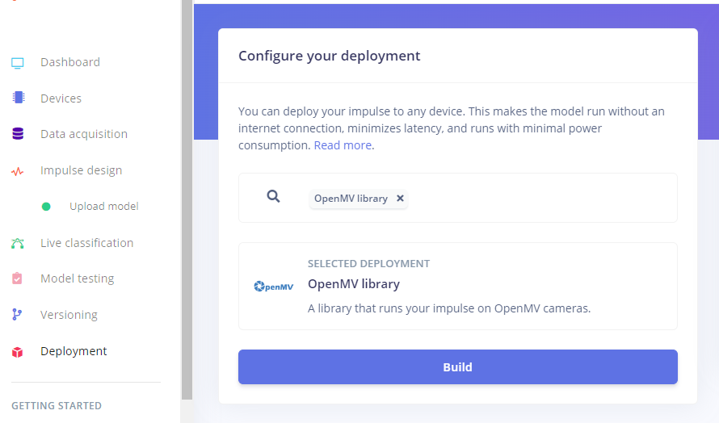

Once downloaded, extract the `.zip` file and copy the **.tflite** file and **labels.txt** file from the extracted folder to the connected Arduino Portenta. 

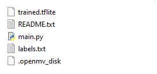

Open the **ei_classify** python script from the OpenMV IDE. 

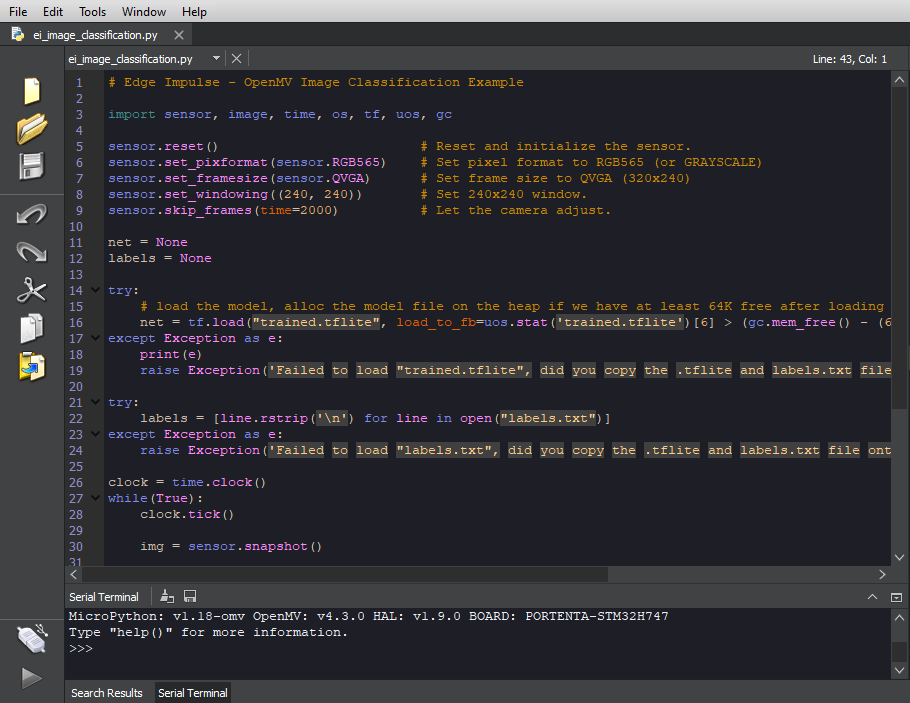

Click  **Connect** and the Impulse will now be running on the Arduino Portenta. Aim it at set of images and the classification results will get printed on the serial terminal.

Be sure to also set the **sensor.Pixformat** as Grayscale, as the Vision Shield takes images in Grayscale.
    
```
sensor.set_pixformat(sensor.GRAYSCALE)    # Set pixel format to RGB565 (or GRAYSCALE)
```

Here is a sample **bruise** classification:

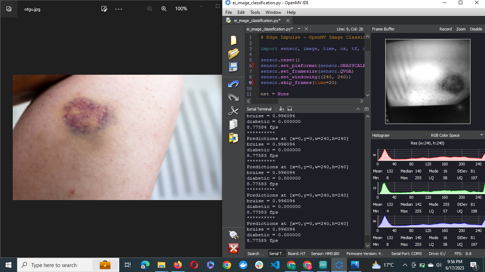

And a sample **diabetic wound** classification:

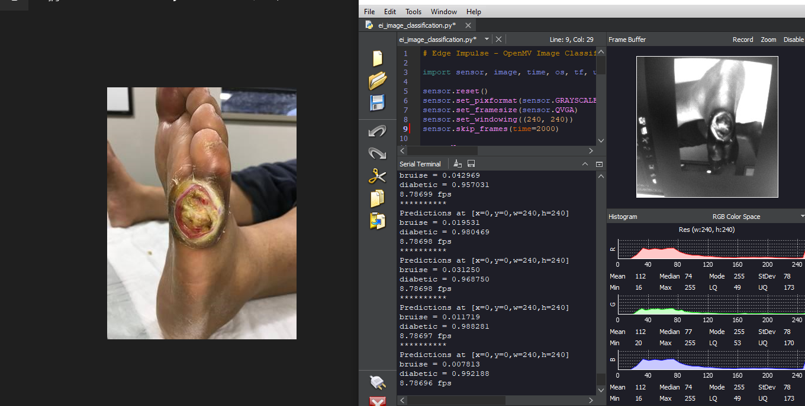

## Conclusion

In this project, we have seen how it is possible to leverage AI-powered cameras to classify wounds, which offers a great advantage in reducing the time taken to diagnose wounds as well as reduce cost associated with the process.

This project could be scaled further by sending the inference results over a web platform for results to be conveniently accessed by clinicians. This enables accurate administration of treatment to patients regardless of their location and  mitigates the severe effects of misdiagnosis, leading to improved human health, especially in rural areas without local expertise. Adding more dataset images in order to improve the model perfomance on diabetic wound classification would also be helpful.

With **Bring Your Own Model** on Edge Impulse, ML engineers can build robust, state of the art models and deploy to edge devices. This creates a huge opportunity to solve challenges with Machine Learning and deploy to suitable hardware devices.

This project is **Public**, you can clone and modify it for your own use case, as well as further optimize it.


## Credits

1. *Anisuzzaman, D.M., Patel, Y., Rostami, B. et al. Multi-modal wound classification using wound image and location by deep neural network. Sci Rep 12, 20057 (2022). https://doi.org/10.1038/s41598-022-21813-0*

2. *https://www.kaggle.com/datasets/yasinpratomo/wound-dataset*

