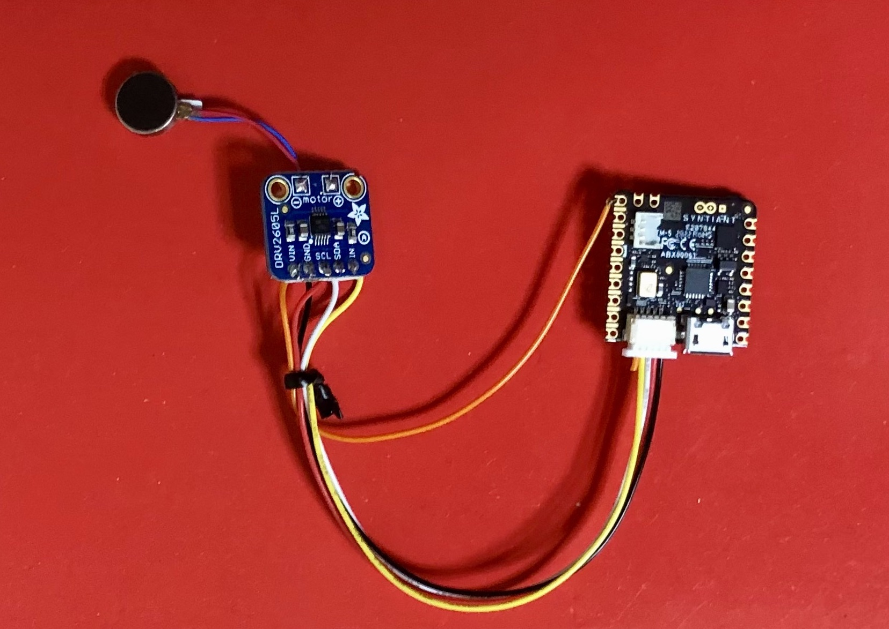

# Snoring Detection with Syntiant NDP120 Neural Decision Processor on Nicla Voice

Created By: Naveen Kumar

Public Project Link: [https://studio.edgeimpulse.com/public/226454/latest](https://studio.edgeimpulse.com/public/226454/latest)

## Overview


It is estimated that more than half of men and over 40% of women in the United States snore, and up to 27% of children. While snoring can be a harmless, occasional occurrence, it can also indicate a serious underlying sleep-related breathing disorder. Snoring is caused by the vibration of tissues near the airway that flutter and produce noise as we breathe. Snoring often indicates obstructive sleep apnea, a breathing disorder that causes repeated lapses in breath due to a blocked or collapsed airway during sleep. Despite being unaware of their snoring, many people suffer from sleep apnea, leading to under-diagnosis. As part of my project, I have developed a non-invasive, low-powered edge device that monitors snoring and interrupts the user moderately through a haptic feedback mechanism.

## Hardware Selection

Our system utilizes the Arduino **Nicla Voice**, which is designed with the **Syntiant NDP120** Neural Decision Processor. This processor allows for embedded machine-learning models to be run directly on the device. Specifically designed for deep learning, including CNNs, RNNs, and fully connected networks, the Syntiant NDP120 is perfect for always-on applications with minimal power consumption. Its slim profile also makes it easily portable, which suits our needs.


There are several onboard sensors available on the Nicla Voice, but for this particular project, we will solely make use of the onboard PDM microphone. We are utilizing an Adafruit DRV2605L haptic motor controller and an ERM vibration motor to gently alert users without being intrusive. The haptic motor driver is connected to the Nicla Voice using an Eslov connector and communicates over I2C protocol. The haptic motor driver gets power from the VIN pin since the Eslov connector does not provide power.



## Setup Development Environment

To set this device up in Edge Impulse, we will need to install two command-line interfaces by following the instructions provided at the links below.

* [Arduino CLI](https://arduino.github.io/arduino-cli/latest/installation/)
* [Edge Impulse CLI](https://docs.edgeimpulse.com/docs/edge-impulse-cli/cli-installation)

Please clone the Edge Impulse firmware for this specific development board.

```
$ git clone https://github.com/edgeimpulse/firmware-arduino-nicla-voice.git
```

To obtain audio firmware for Nicla Voice, kindly download it from the provided link:

[https://cdn.edgeimpulse.com/firmware/arduino-nicla-voice-firmware.zip](https://cdn.edgeimpulse.com/firmware/arduino-nicla-voice-firmware.zip)

To install the Arduino Core for the Nicla board and the `pyserial` package required to update the NDP120 chip, execute the commands below.

```
$ unzip arduino-nicla-voice-firmware.zip
$ cd arduino-nicla-voice-firmware
$ ./install_lib_mac.command
```

We will need to register a free account at [Edge Impulse](https://studio.edgeimpulse.com/) to create a new project.


## Data Collection

We have used a dataset available at [https://www.kaggle.com/datasets/tareqkhanemu/snoring](https://www.kaggle.com/datasets/tareqkhanemu/snoring). Within the dataset, there are two separate directories; one for snoring and the other for non-snoring sounds. The first directory includes a total of 500 one-second snoring samples. Among these samples, 363 consist of snoring sounds created by children, adult men, and adult women without any added background noise. The remaining 137 samples include snoring sounds that have been mixed with non-snoring sounds. The second directory contains 500 one-second non-snoring samples. These samples include background noises that are typically present near someone who is snoring. The non-snoring samples are divided into ten categories, each containing 50 samples. The categories are baby crying, clock ticking, door opening and closing, gadget vibration motor, toilet flushing, emergency vehicle sirens, rain and thunderstorm, street car sounds, people talking, and background television news. The audio files are in the 16-bit WAVE audio format, with a 2-channels (stereo) configuration and a sampling rate of 48,000 Hz. However, we require a single-channel (mono) configuration at a sampling rate of 16,000 Hz, so we need to convert it accordingly using [FFmpeg](https://ffmpeg.org/).

```
$ ffmpeg -loglevel quiet -i <input file> -ar 16000 -ac 1 downsampled/snoring/<output file>
```

The datasets are uploaded to the Edge Impulse Studio using the Edge Impulse Uploader. Please follow the instructions [here](https://docs.edgeimpulse.com/docs/cli-installation) to install the Edge Impulse CLI tools and execute the commands below.

```
$ edge-impulse-uploader --category split --label snoring  downsampled/snoring/*.wav
$ edge-impulse-uploader --category split --label z_openset downsampled/non-snoring/*.wav
```

To ensure accurate prediction, the Syntiant NDP chips necessitate a negative class that should not be predicted. For the datasets without snoring, the **z\_openset** class label is utilized to ensure that it appears last in alphabetical order. By using the commands provided, the datasets are divided into **Training** and **Testing** samples. Access to the uploaded datasets can be found on the **Data Acquisition** page of the Edge Impulse Studio.


## Model Training

Go to the **Impulse Design** > **Create Impulse** page and click on the **Add a processing block** and choose **Audio (Syntiant)** which computes log Mel-filterbank energy features from an audio signal specific to the Syntiant audio front-end. Also, on the same page click on the **Add a learning block** and choose **Classification** which learns patterns from data, and can apply these to new data. We opted for a default window size of 968 ms and a window increase of 32 ms, which allows for two complete frames within a second of the sample. Now click on the **Save Impulse** button.


Now go to the **Impulse Design** > **Syntiant** page and choose the **Feature extractors** parameter as **log-bin (NDP120/200)**. The number of generated features has to be 1600, which corresponds to the Syntiant Neural Network input layer. To generate 1600 features, it is necessary to validate the following equation:

**window size = 1000 x (39 x Frame stride + Frame length)**

In our particular case, the window size is 968 ms, which is equivalent to 1000 x (39 x **0.024** + **0.032**).


Clicking on the **Save parameters** button redirects us to another page where we should click on **Generate Feature** button. It usually takes a couple of minutes to complete feature generation. We can see the visualization of the generated features in the **Feature Explorer**.


Next, go to the **Impulse Design** > **Classifier** page and choose the **Neural Network settings** as shown below.


We have conducted experiments and established the model architecture using a 2D CNN, which is outlined below.


To begin the training process, click on the **Start training** button and patiently wait for it to finish. Once completed, we can review the output of the training and the confusion matrix provided below. It's worth noting that the model has achieved an impressive accuracy rate of 99.4%.


## Model Testing

To assess the model's performance on the test datasets, navigate to the **Model testing** page and select the **Classify all** button. We can be confident in the model's effectiveness on new, unseen data, with an accuracy rate of **94.62%**.


## Model Deployment

When deploying the model on Nicla Voice, we must choose the **Syntiant NDP120 library** option on the **Deployment** page.


To build the firmware, it is necessary to configure the posterior parameters of the Syntiant NDP120 Neural Decision Processor by clicking the **Find posterior parameters** button.


To detect **snoring** events, we'll choose that class and disregard **z\_openset**. Also, we are not using any calibration dataset. Then, we'll click **Find Parameters** to adjust the neural network's precision and recall and minimize the False Rejection Rate and False Activation Rate.


Now click on the **Build** button and in a few seconds the library bundle will be downloaded to the local computer. We can see the following file listings after unzipping the compressed bundle.

```
snp-syntiant-ndp120-lib-v1
├── ei_model.synpkg
└── model-parameters
    ├── model_metadata.h
    └── model_variables.h
```

Now copy the _model-parameters_ content into the _src/model-parameters/_ directory of the firmware source code that we cloned in the **Setup Development Environment** section.

```
$ cp -r snp-syntiant-ndp120-lib-v12/model-parameters/*.h firmware-arduino-nicla-voice/src/model-parameters
```

We need to customize the firmware code in the _firmware-arduino-nicla-voice/src/ei\_syntiant\_ndp120.cpp_ file. Add the following declarations near the top section of the file.

```
#define LAST_N_PREDICTIONS 10
// Haptic motor driver
Adafruit_DRV2605 drv;
// Buffer to keep the last 10 predictions
uint8_t pred_buf[LAST_N_PREDICTIONS] = {0};
```

In the _ei\_setup()_ function, add the haptic feedback motor driver initialization code.

```
 ...   
    if (! drv.begin()) {
          ei_printf("Could not find DRV2605\n");
          while (true) { delay(10); }
    }
    drv.selectLibrary(1);
    drv.setMode(DRV2605_MODE_INTTRIG);
 ...
```

You can add custom logic to the main Arduino sketch by customizing the _match\_event()_ function as follows.

```
static void match_event(char* label)
{
    if (_on_match_enabled == true){
        if (strlen(label) > 0) {
            got_match = true;
            ei_printf("Match: %s\n", label); 
            if (strcmp(label, "NN0:snoring") == 0) {
                nicla::leds.setColor(green);
                delay(500);
 
                memmove(pred_buf, pred_buf+1, LAST_N_PREDICTIONS-1);            
                pred_buf[LAST_N_PREDICTIONS-1] = 1;
 
                int sum = 0;
                for (int i = 0; i < LAST_N_PREDICTIONS; i++) {
                    sum += pred_buf[i];
                    ei_printf("%d ", pred_buf[i]);
                }
                ei_printf("\n");
                
                if (sum >= 3) {
                    ei_printf("Snoring Detected");
                    // reset buffer
                    for (int i = 0; i < LAST_N_PREDICTIONS; i++) {
                       pred_buf[i] = 0;
                    }

                    int count = 5;
                    while (count > 0) {
                        drv.setWaveform(0, 14); // play effect strong buzz
                        drv.setWaveform(1, 0);  // end waveform
                        drv.go();
                        delay(500);
                        count--;
                    }
                }
            }

            if (strcmp(label, "NN0:unknown_noise") == 0) {
                nicla::leds.setColor(red);
                // rotate the buffer by 1 element
                memmove(pred_buf, pred_buf+1, LAST_N_PREDICTIONS-1);
                pred_buf[LAST_N_PREDICTIONS-1] = 0;

                for (int i = 0; i < LAST_N_PREDICTIONS; i++) {
                    ei_printf("%d ", pred_buf[i]);
                }
                ei_printf("\n");
            }
        }
    }
}
```

To compile the firmware execute the command below.

```
$ cd firmware-arduino-nicla-voice
$ ./arduino-build.sh --build
```

Once we've compiled the Arduino firmware we need to follow the steps below to deploy the firmware to the device. It is assumed that all firmware and deployment libraries are in the same directory level.

* Take the .elf file output by Arduino and rename it to firmware.ino.elf.
* Replace the firmware.ino.elf from the default firmware
* Replace the _ei\_model.synpkg_ file in the default firmware by the one from the downloaded Syntiant library.

```
$ mv firmware-arduino-nicla-voice.ino.elf firmware.ino.elf
$ cd ../arduino-nicla-voice-firmware
$ cp ../firmware-arduino-nicla-voice/firmware.ino.elf .
$ cp ../snp-syntiant-ndp120-lib-v1/ei_model.synpkg ndp120/
```

Now connect the Nicla Voice to the computer using a USB cable and execute the script (OS-specific) to flash the board.

```
$ ./flash_mac.command 
```

We can monitor the inferencing results over the serial connection at a 115200 baud rate after resetting the board or power cycling.

```
dsp firmware version: 19.2.0
package version: Model generated by Edge Impulse
pbi version: 3.2.3-0
num of labels: 2
labels: NN0:snoring, NN0:z_openset
total deployed neural networks: 1
IMU not enabled
Inferencing settings:
.Interval: 0.062500 ms.
.Frame size: 15488
.Sample length: 968 ms.
.No. of classes: 2
Classes:
.snoring
.z_openset
Starting inferencing, press 'b' to break
Type AT+HELP to see a list of commands.
> 
Match: NN0:snoring
0 0 0 0 0 0 0 0 0 1 
Match: NN0:snoring
0 0 0 0 0 0 0 0 1 1 
```

## Inferencing Demo

When classifying audio, it is recommended to analyze multiple windows of data and calculate the average of the results. This approach can provide better accuracy compared to relying on individual results alone. To detect snoring events, the application maintains a circular buffer of the last 10 inferencing results. If three snoring events are detected, the haptic feedback motor will vibrate for a few seconds. During the demo, the motor vibration appears to be moderate. However, the user can still feel the vibration while using the pillow.



## Conclusion

This project provides a practical solution to a seemingly humorous yet serious issue. The device is user-friendly and respects privacy by conducting inferencing at the edge. Although the model performs well, there is potential for enhancement through the inclusion of more refined training data, resulting in improved accuracy and robustness to further reduce the likelihood of false positives and negatives. Additionally, this project showcases the ability of a simple neural network to address complex problems, executed through effective digital signal processing on low-powered, resource-restricted devices such as Syntiant NDP120 Neural Decision Processor on the Nicla Voice.
