# Gunshot Audio Classification

Created By: Swapnil Verma

Public Project Link: [https://studio.edgeimpulse.com/public/133765/latest](https://studio.edgeimpulse.com/public/133765/latest)

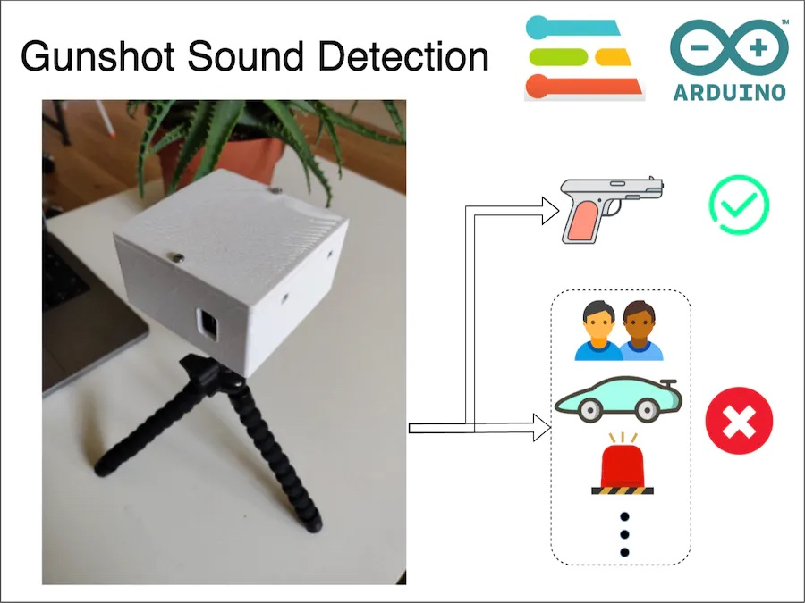

## Intro Problem

On May 24, 2022, nineteen students and two teachers were fatally shot, and seventeen others were wounded at Robb Elementary School in Uvalde, Texas, United States\[1]. An 18-year-old gunman entered the elementary school and started shooting kids and teachers with a semi-automatic rifle. The sad part is that it is not a one-off event. Gun violence including mass shootings is a real problem, especially in the USA.

![Deaths due to gun violence in 2022 \[2\]](../.gitbook/assets/gunshot-audio-classification/problem1.jpg)

![Deaths due to gun violence in 2022 \[2\]](../.gitbook/assets/gunshot-audio-classification/problem2.jpg)

## What Can I Do About It?

Gun violence is a massive problem and I alone can not solve it, but I can definitely contribute an engineering solution toward hopefully minimizing casualties.

Here I am proposing a proof of concept to identify gun sounds using a low-cost system and inform emergency services as soon as possible. Using this system, emergency services can respond to a gun incident as quickly as possible thus hopefully minimizing casualties.

## How Does It Work?

My low-cost proof of concept uses multiple microcontroller boards with microphones to capture sound. They use a TinyML algorithm prepared using Edge Impulse to detect any gunshot sound. Upon a positive detection, the system sends a notification to registered services via an MQTT broker.

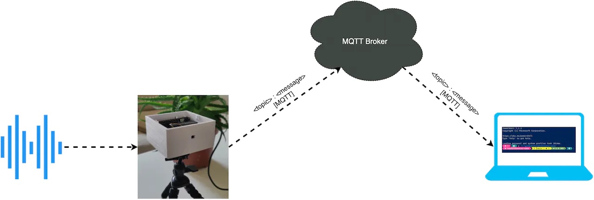

To learn more about the working of the system, please check out the Software section.

## Hardware

The hardware I am using is:

* Arduino Portenta H7
* Arduino Nano BLE Sense
* 9V Battery

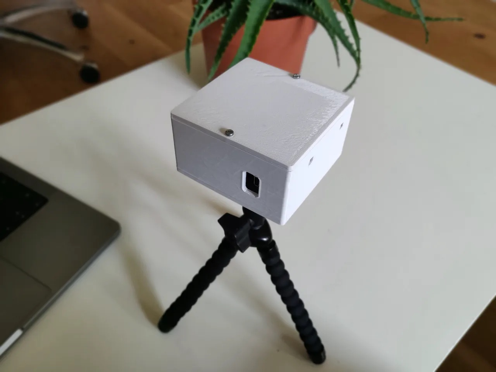

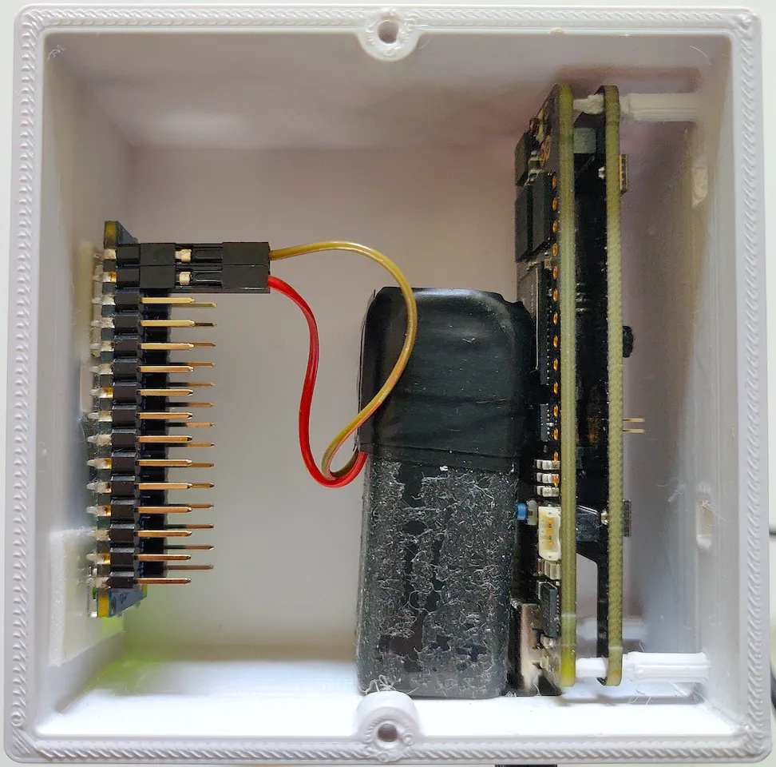

In the current hardware iteration, the Arduino Nano BLE Sense is powered by a 9V battery and the Portenta H7 is powered via a laptop, because I am also using the serial port on the Portenta H7 to debug the system.

## Software

The software is divided into 2 main modules:

* Machine Learning
* Communication

### Machine Learning Module

The machine learning module uses a tinyML algorithm prepared using Edge Impulse. This module is responsible for identifying gunshot sounds. It takes sound as input and outputs its classification.

### Dataset

One of the most important parts of any machine learning model is its dataset. In this project, I have used a combination of two different datasets. For the _gunshot_ class, I used the [Gunshot audio dataset](https://www.kaggle.com/datasets/emrahaydemr/gunshot-audio-dataset) and for the _other_ class, I used the [UrbanSound8K](https://www.kaggle.com/datasets/chrisfilo/urbansound8k) dataset from Kaggle.

Edge Impulse Studio's [Data acquisition tab](https://docs.edgeimpulse.com/docs/edge-impulse-studio/data-acquisition) provides useful features to either record your own data or upload already-collected datasets. I used the upload feature.

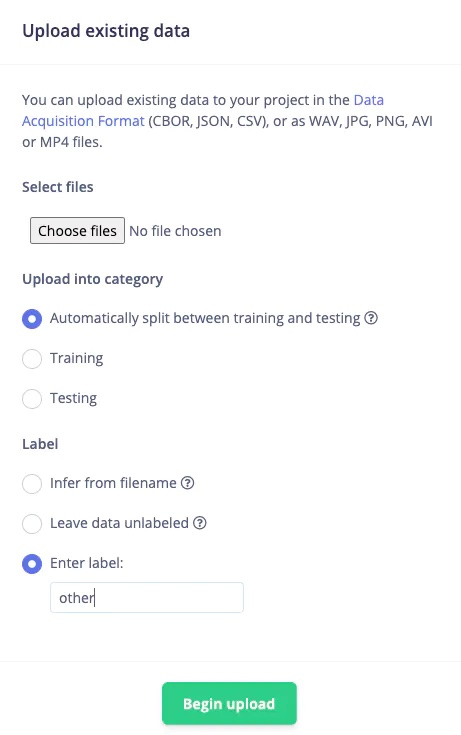

While uploading you can also provide a label to the data. This was very helpful because I am using sounds from multiple origins in the _other_ class. After uploading the data, I cleaned the data using the Studio's [Crop](https://docs.edgeimpulse.com/docs/edge-impulse-studio/data-acquisition#cropping-samples) and [Split sample](https://docs.edgeimpulse.com/docs/edge-impulse-studio/data-acquisition#splitting-data-sample) feature.

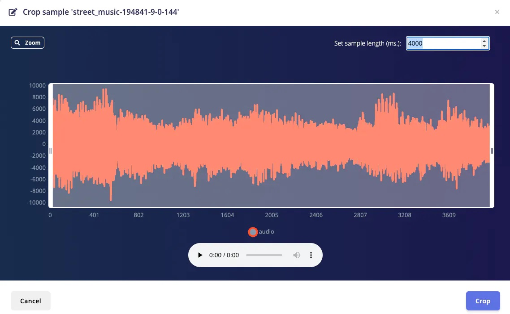

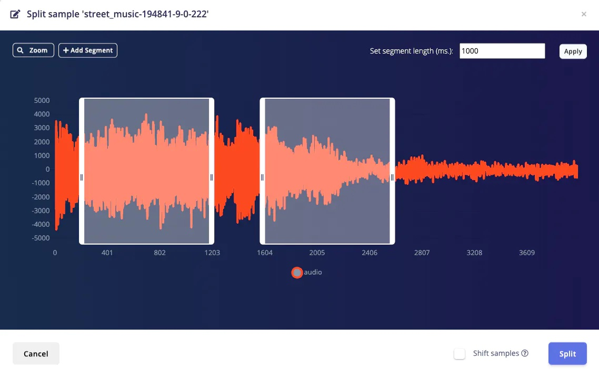

You can either divide data into test and train sets while uploading or do it at a later time. The Data acquisition tab shows the different classes and [train/test split ratio](https://docs.edgeimpulse.com/docs/edge-impulse-studio/data-acquisition#dataset-train-test-split-ratio) for our convenience.

### Training

After preparing the dataset, we need to [design an Impulse](https://docs.edgeimpulse.com/docs/edge-impulse-studio/impulse-design). The Edge Impulse documentation explains the Impulse design in great detail so please check out their documentation page to learn about Impulse design.

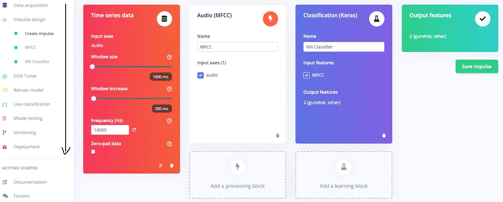

As you can see, I have selected [MFCC](https://docs.edgeimpulse.com/docs/edge-impulse-studio/processing-blocks/audio-mfcc) as the [preprocessing block](https://docs.edgeimpulse.com/docs/edge-impulse-studio/processing-blocks), and [classification](https://docs.edgeimpulse.com/docs/edge-impulse-studio/learning-blocks/classification) as the [learning block](https://docs.edgeimpulse.com/docs/edge-impulse-studio/learning-blocks). I have used the default parameters for the MFCC preprocessing. For training, I have slightly modified the default neural network architecture. I have used three 1D convolutional CPD layers with 8, 16 and 24 neurons, respectively. The architecture is illustrated in the below image.

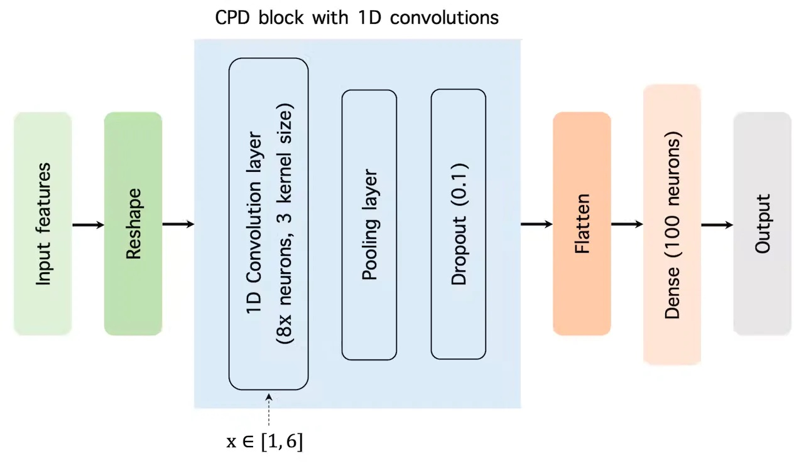

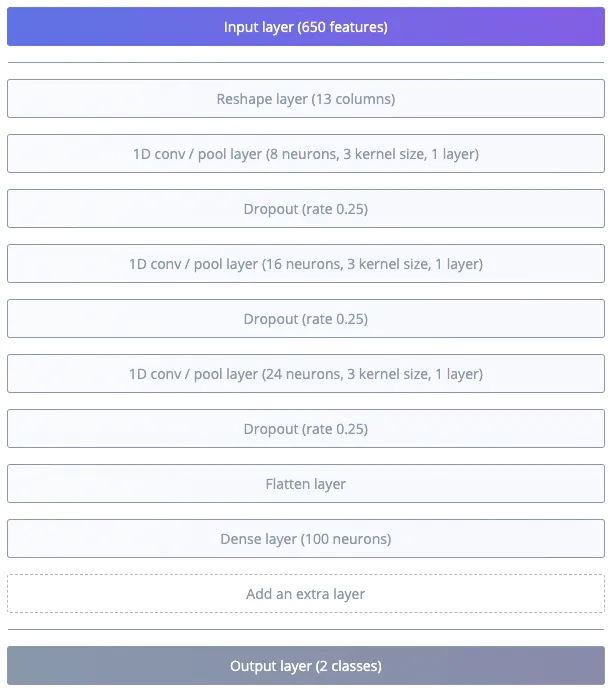

Modifying the neural network architecture in the Edge Impulse Studio is very easy. Just click on [Add an extra layer](https://docs.edgeimpulse.com/docs/edge-impulse-studio/learning-blocks/classification#neural-network-architecture) at the bottom of the architecture and select any layer from the popup.

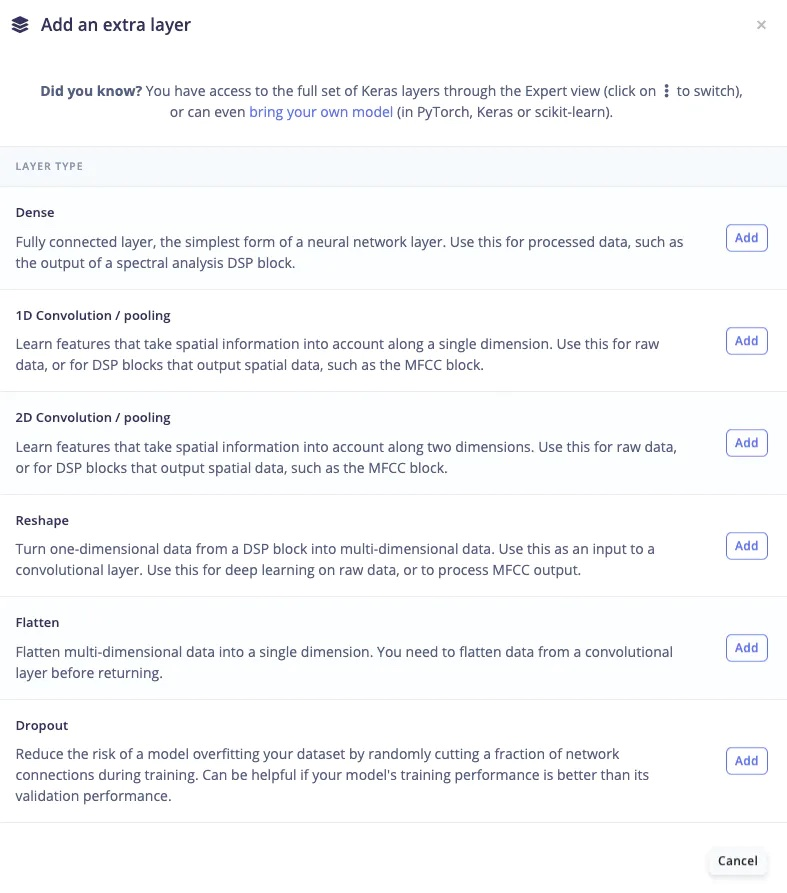

Or you can also do it from the [Expert mode](https://docs.edgeimpulse.com/docs/edge-impulse-studio/learning-blocks/classification#expert-mode) if you are feeling masochistic 😉.

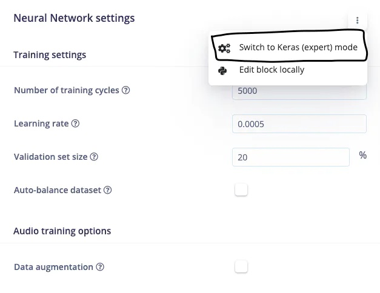

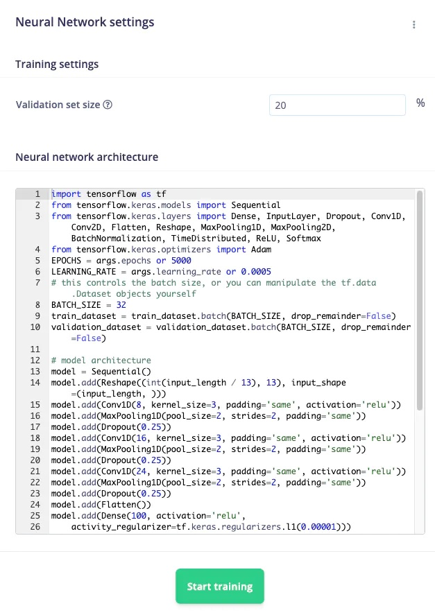

I trained the model for 5000 iterations with a 0.0005 learning rate. My final model has 94.5% accuracy.

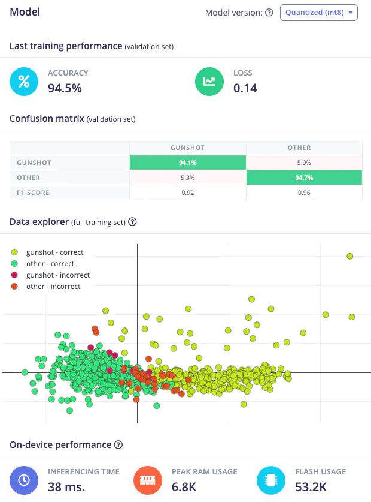

### Testing

The Edge Impulse Studio's [Model testing](https://docs.edgeimpulse.com/docs/edge-impulse-studio/model-testing) tab enables a developer to test the model immediately. It uses the data from the test block and performs the inference using the last trained model. My model had 91.3% accuracy on the test data.

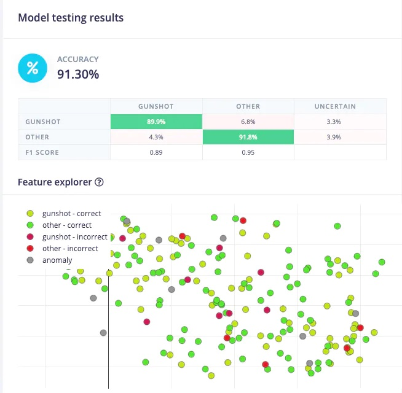

### Versioning

One nice feature Edge Impulse provides is versioning. You can version your project (like Git) to store all data, configuration, intermediate results and final models. You can revert back to earlier versions of your impulse by importing a revision into a new project. I use this feature every time before changing the neural network architecture. That way I don't have to retrain or keep a manual record of the previous architecture.

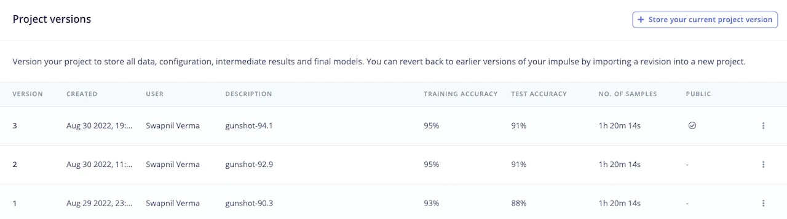

### Deployment

After completing the training, it's time for deployment. The [Deployment tab](https://docs.edgeimpulse.com/docs/edge-impulse-studio/deployment) of the Edge Impulse Studio provides three main ways of deploying the model onto hardware: (a) by creating a [library](https://docs.edgeimpulse.com/docs/edge-impulse-studio/deployment#deploying-as-a-customizable-library) (b) by building [firmware](https://docs.edgeimpulse.com/docs/edge-impulse-studio/deployment#deploy-as-a-pre-built-firmware), and (c) by running it on a [computer or a mobile phone](https://docs.edgeimpulse.com/docs/edge-impulse-studio/deployment#deploy-to-your-mobile-phone-computer) directly. I knew that I need more functionality from my Arduino hardware apart from inferencing, so I created a library instead of building firmware.

Just select the type of library you want, and click the Build button at the bottom of the page. This will build a library and download it onto your computer. After downloading, it will also show a handy guide to include this library in your IDE.

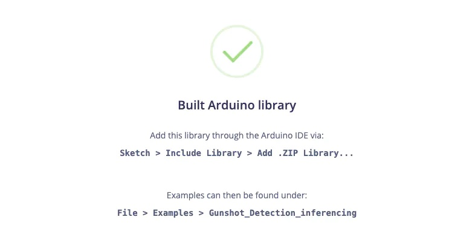

The coolest part is that I don't need to retrain the model or do anything extra to deploy the same model onto multiple devices. The examples of the downloaded library will have example code for all the supported devices of the same family.

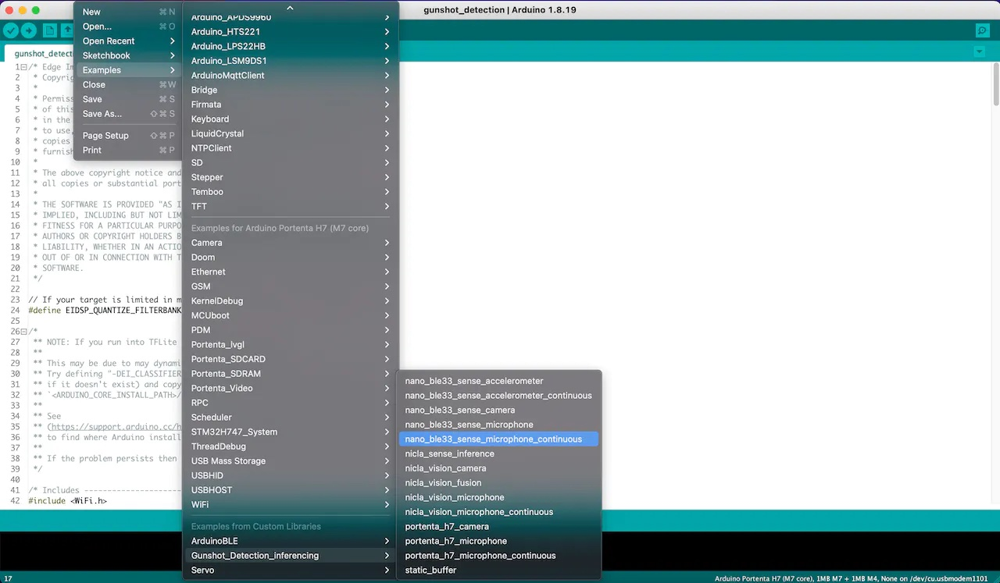

Just select an example as a getting started code, modify it according to your need and flash it. The Arduino Nano BLE Sense and Portenta H7 use the same model generated by Edge Impulse. I trained the model only once, agnostic of the hardware and deployed it on multiple devices which is a time saver.

### Inferencing

Inferencing is the process of running a neural network model to generate output. The image below shows the inference pipeline.

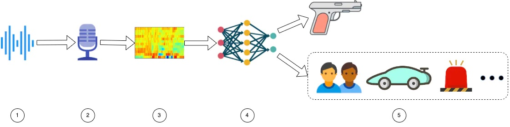

The microphones in the Nano BLE Sense and Portenta H7 pick up the surrounding sound (stages 1 & 2). The sound data is then preprocessed using the MFCC block (stage 3). The preprocessed data is then sent to a Convolutional Neural Network block (stage 4) which classifies it into either the _gunshot_ class or the _other_ class (stage 5).

To learn more about the project please follow the below link.

> Project Link - [https://studio.edgeimpulse.com/public/133765/latest](https://studio.edgeimpulse.com/public/133765/latest)

The output of the machine learning module is then processed before sending it to the cloud via the Communication module.

### Communication Module

This module is responsible for sharing information between boards and sending positive predictions to the registered emergency services.

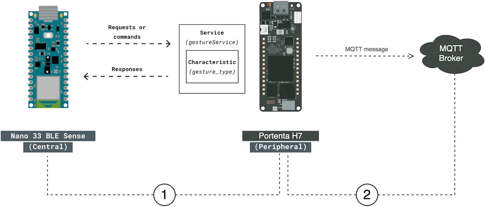

The Nano BLE Sense sends its inference to the Portenta H7 via BLE. The Portenta H7 then sends the positive output (i.e. detection of gunshot sound) of its inference and Nano BLE's inference to a subscriber via MQTT. I have used the [cloudMQTT](https://www.cloudmqtt.com/) broker for this project.

To download the software please use the below link:

> Software Link - [https://github.com/sw4p/Gunshot\_Detection](https://github.com/sw4p/Gunshot\_Detection)

## Testing

My testing setup and the result are illustrated in the video below. The system is connected to my laptop which is also performing the screen recording. On the upper left side, we have an Arduino serial window which is showing the output from the Portenta H7, and on the lower left hand, we have an audio player. On the right-hand side, we have cloudMQTT's WebSocket UI, which shows the incoming notification via MQTT. The sound for this video is played and recorded using my laptop's speaker and microphone.



In the video above I am playing different categories of sound and one of that categories is a gunshot. The system outputs the classification result to the Arduino serial port whenever it detects a sound from the other class but does not send it to the receiver. The moment it detects a gunshot sound, it immediately sends a notification to the receiver via CloudMQTT.

## Code

[https://github.com/sw4p/Gunshot\_Detection](https://github.com/sw4p/Gunshot\_Detection)

## References

\[1] https://en.wikipedia.org/wiki/Robb\_Elementary\_School\_shooting

\[2] https://www.gunviolencearchive.org/
