# Occupancy Sensing - SiLabs EFR32MG24

Created By: [Zalmotek](https://zalmotek.com)

Public Project Link: [https://studio.edgeimpulse.com/public/101280/latest](https://studio.edgeimpulse.com/public/101280/latest)

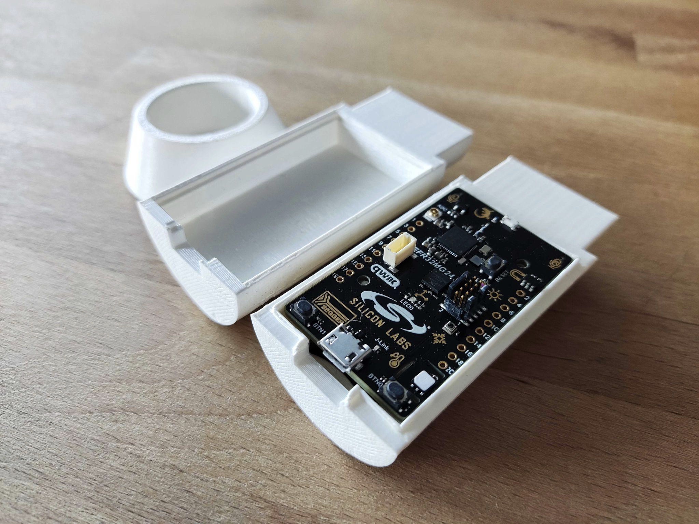

## Intro

Occupancy is an important issue in Building Management Systems because based on sensory data you can automatically control lights or temperature or ventilation systems and you can save energy and optimize usage by providing availability of rooms in real-time without the hassle of having each room checked by a person.

An interesting fact is that lighting use constitutes about 20% of the total energy consumption in commercial buildings. Heating or cooling, depending on the season, can also be automated based on usage and human presence.

There are quite a few sensor-based solutions to detect human presence in a room and while the most simple, a video camera, would come to mind they are probably the least used in the actual real environment due to their extra privacy issues (avoiding recording video is a must) and added complexity. Usually, the sensors used in this application are infrared, ultrasonic, microwave, or other technology to decide if people are present in a room.

Another challenge in managing a commercial building is scheduling rooms based on availability. People are already accustomed to Calendly and other similar tools to set up availability for one's preferred time to meet but adding a real floorplan in the mix could save the trouble of mailing back and forth to confirm a location.

## Our Solution

SiLabs have launched the new EFR32MG24 Wireless SoCs and they are full of interesting sensors and features making them a very good one-stop-shop for an all-around development board for mesh IoT wireless connectivity using Matter, OpenThread, and Zigbee protocols for smart home, lighting, and building automation products or any other use case you see fit to this combination of sensors and connectivity.

The sensors present on board are an accelerometer, a microphone, environmental sensors comprising temperature, humidity, and air pressure, a Hall sensor, an inertial and an interactional sensor. So we have quite an array of possibilities to choose from.

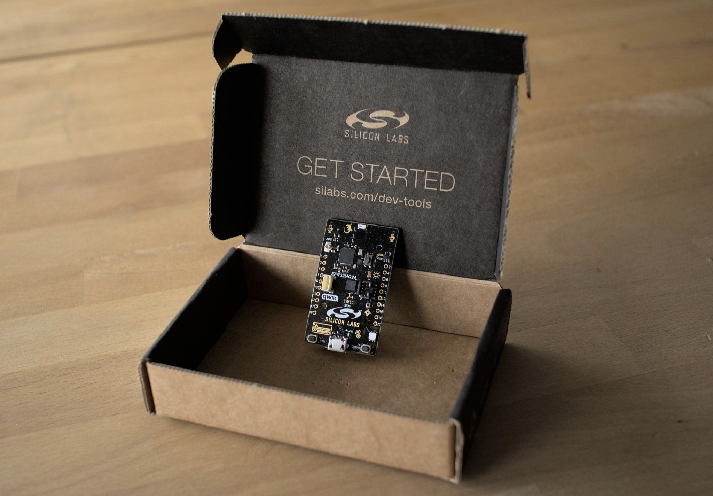

Our board has a **EFR32MG24B310F1536IM48** indicator meaning its part of the Mighty Gecko 24 family of ICs by SilLabs, has an IADC High-Speed / High-Accuracy and Matrix Vector Processor (MVP) Available and 10 dBm PA Transmit Power, 1536 kb of memory, can function between -40 and + 125 Celsius degrees and has 48 pins.

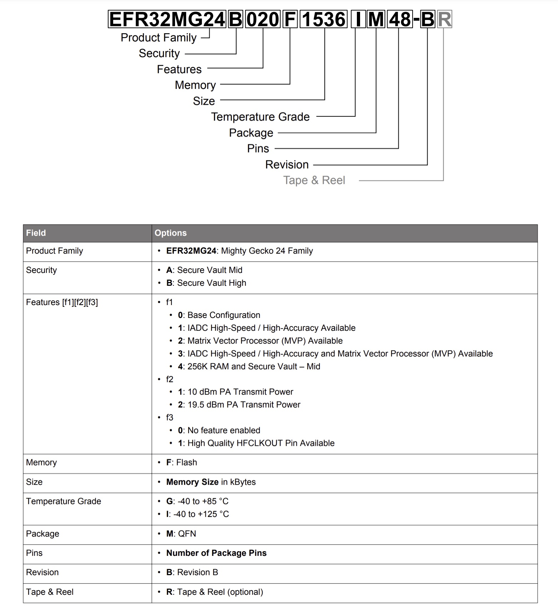

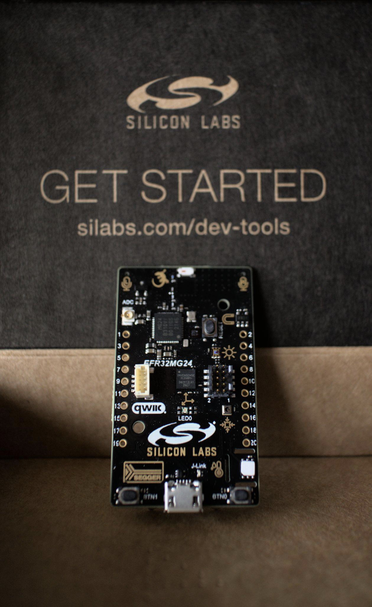

With key features like high performance 2.4 GHz RF, low current consumption, an AI/ML hardware accelerator, and Secure Vault, IoT device makers can create smart, robust, and energy-efficient products that are secure from remote and local cyber-attacks. An ARM Cortex®-M33 running up to 78 MHz and up to 1.5 MB of Flash and 256 kB of RAM provides resources for demanding applications while leaving room for future growth. Target applications include gateways and hubs, sensors, switches, door locks, LED bulbs, luminaires, location services, predictive maintenance, glass break detection, wake-word detection, and more.

For this application, we have decided to use the microphones with which the xG24 DevKit comes equipped. To be more precise, we will be capturing sound from the room in 1-second windows, run it through a signal processing block and decide, by using a TinyML model, whether the room is occupied or not. We want to capture the [Sound of Silence](https://www.youtube.com/watch?v=u9Dg-g7t2l4) :) if we may.

A very important mention concerning privacy is that we will use the microphones only as a source for sound level, not recording any voices or conversations after the model is deployed.

### Hardware requirements

* [EFR32MG24 Dev kit](https://www.silabs.com/wireless/zigbee/efr32mg24-series-2-socs) (USB cable included)
* A CR2030 Battery
* A 3D printed enclosure (optional)

### Software requirements

* [Simplicity Commander](https://community.silabs.com/s/article/simplicity-commander?language=en\_US) - a utility that provides command line and GUI access to the debug features of EFM32 devices. It enables us to flash the firmware on the device.
* The [Edge Impulse CLI](https://docs.edgeimpulse.com/docs/edge-impulse-cli/cli-installation) - A suite of tools that will enable you to control the xG24 Kit without being connected to the internet and ultimately, collect raw data and trigger in-system inferences
* The [base firmware image provided by Edge Impulse](https://cdn.edgeimpulse.com/firmware/silabs-xg24.zip) - enables you to connect your SiLabs kit to your project and do data acquisition straight from the online platform.

## Hardware Setup

Since all sensors are present on the development board there is not that much to do on the hardware side, you will use the USB cable to program the board, and afterward, to test it you can use a CR2030 battery to supply its power. Mileage will vary based on the use case and how often you read the sensors and you send data to the cloud.

Since it will be mounted in a room where you want to detect the presence of persons we decided to create a 3D enclosure so it protects the development board and keeps it nice and tidy. While the whole action takes place indoors, there are still some accidents that happen on a conference table, like liquid spillage, that might damage the board. In this case, the 3D printed case offers an extra level of protection by elevating the board above the table-top level.

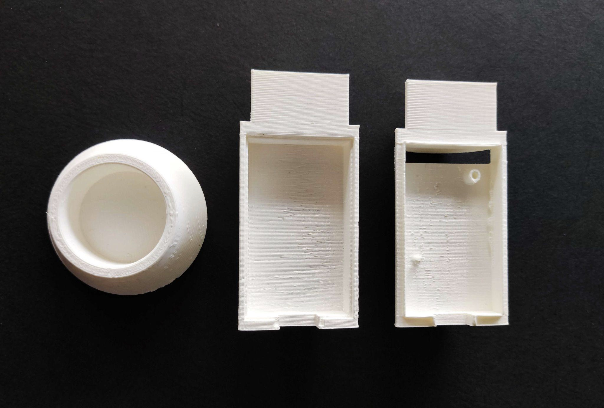

## Software Setup

### Updating the firmware

1. First of all install both Simplicity Commander and the Edge Impulse CLI depending on your OS, by following the official documentation.
2. Use a micro-USB cable to connect the development board to your PC and launch Simplicity Commander. You will be met with a screen containing various information regarding your development board like Chip Type, Flash Size, and more.

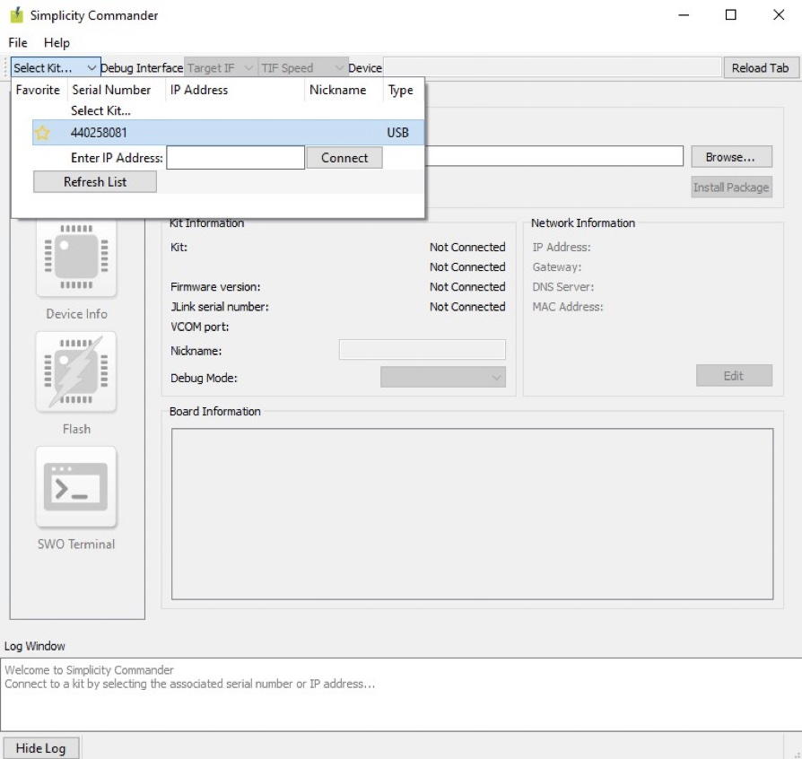

Make sure you have the Edge Impulse firmware downloaded and head over to the Flash panel of Simplicity Commander.

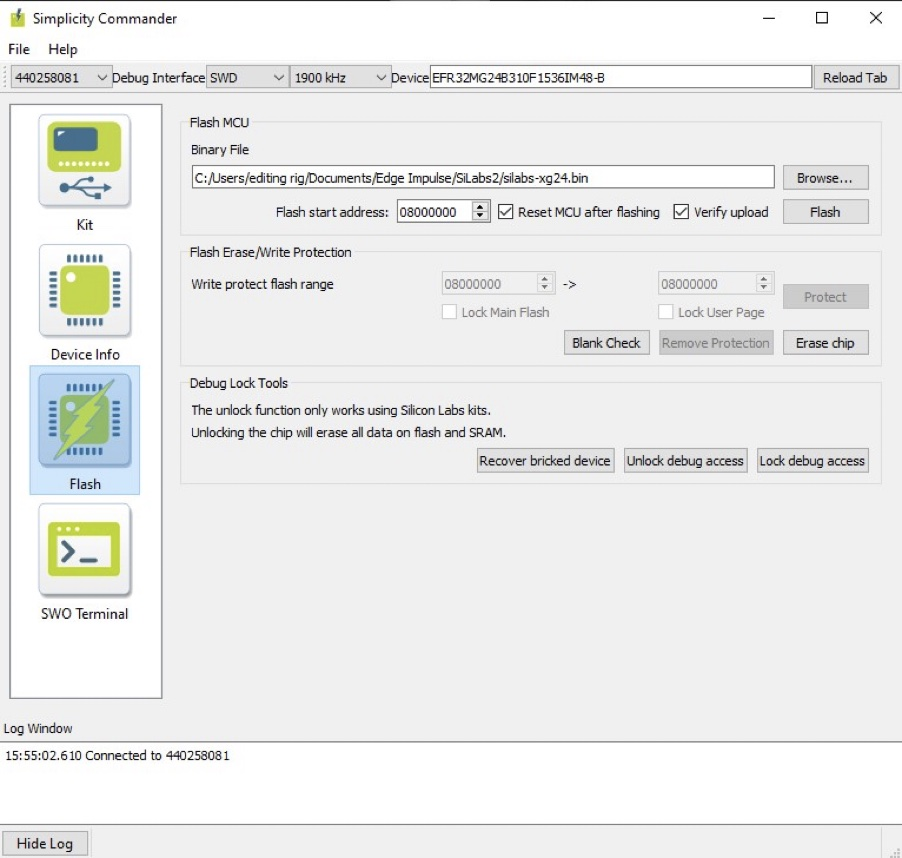

Download the base firmware image provided by Edge Impulse for this board and select the connected Kit in the dropdown menu on the top-left corner of the window, then hit Browse, select the Firmware image and click Flash to load the firmware on the DevKit.

With the custom firmware in place, we have everything we need to start creating our TinyML model.

### Creating an Edge Impulse Project

First up, let’s create an Edge Impulse project. Log in to your free account, click on **Create new project**, give it a recognizable name and click on **Create New Project**.

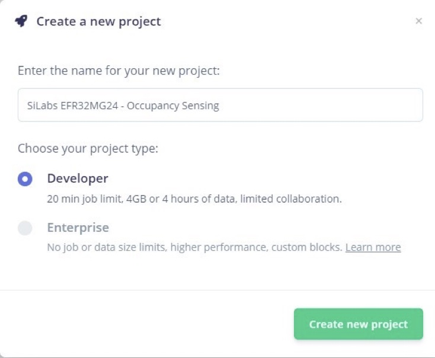

Navigate to the **Dashboard** tab, and then to the **Keys** page. Here, you will find the API key of your project that we will employ to connect the xG24 Devkit to our project. If the API key appears shortened, try to zoom out a bit so you are able to completely copy it.

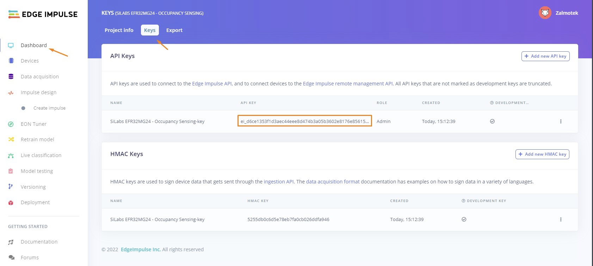

Connect the xG24 Kit to the computer, launch a terminal and run:

`edge-impulse-daemon --api-key <my project api key>`

In the future, if you wish to change the project that your development boards connect, run the same command with a different api-key:

```
Edge Impulse serial daemon v1.14.10
Endpoints:
    Websocket: wss://remote-mgmt.edgeimpulse.com
    API:       https://studio.edgeimpulse.com/v1
    Ingestion: https://ingestion.edgeimpulse.com

[SER] Connecting to /dev/ttyACM0
[SER] Serial is connected, trying to read config...
[SER] Clearing configuration
[SER] Clearing configuration OK
[SER] Retrieved configuration
[SER] Device is running AT command version 1.7.0

Setting upload host in device... OK
Configuring remote management settings... OK
Configuring API key in device... OK
Configuring HMAC key in device... OK
[SER] Device is not connected to remote management API, will use daemon
[WS ] Connecting to wss://remote-mgmt.edgeimpulse.com
[WS ] Connected to wss://remote-mgmt.edgeimpulse.com
[WS ] Device "SilabsxG24 " is now connected to project "SiLabs EFR32MG24 - Occupancy Sensing"
[WS ] Go to https://studio.edgeimpulse.com/studio/101280/acquisition/training to build your machine learning model!
```

Now, if you navigate to the **Devices** tab, you will see your device listed, with a green dot signaling that it is online.

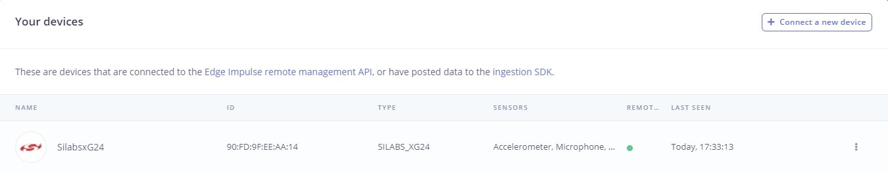

### Acquiring training data

Once the device is properly attributed to the Edge Impulse project, it’s time to navigate to the **Data Acquisition** tab.

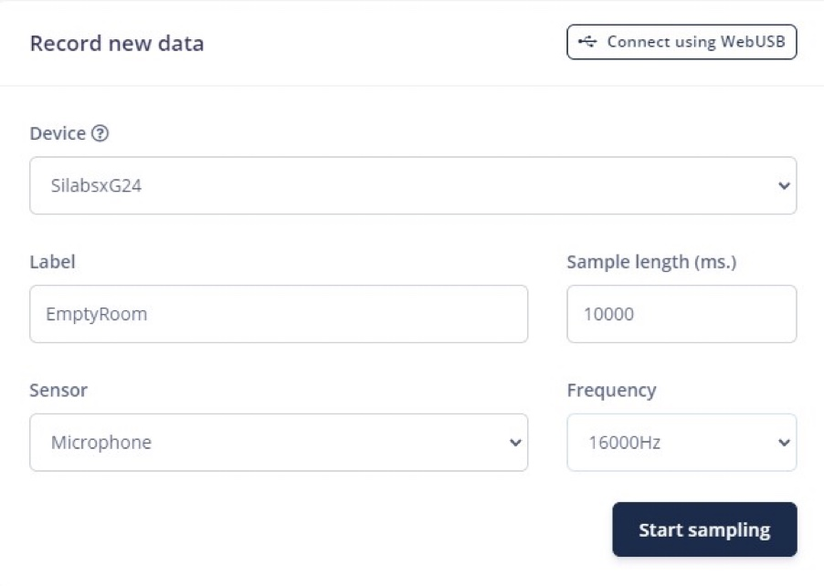

On the right side of the screen, you will notice the Record new data panel. Leave the settings to the default ones, fill in the Label field with a recognisable name and **start sampling**. Keeping in mind the fact that Neural Network feeds data, record at least 3 minutes of data for each defined class.

In the testing phase of the model we are building, we will need some samples in the Test data as well, so do keep in mind to record some. An ideal Train/ Test split would be 85% - 15%.

### Designing an impulse

With the data in place, let’s start building our **Impulse**. You could look at an Impulse like the functional Block of the Edge Impulse ecosystem, and it represents an ensemble of blocks through which data flows.

An impulse is made out of 4 levels: The **input level**, the **signal processing level**, the **Learning level**, and the **output level**.

At the **Input level** of an impulse, you can define the window size, or to put it simply, the size of data you wish to perform signal processing and classification on. Make sure the **Frequency** matches the recording frequency used in the Data Acquisition phase and that **Zero-pad data** is checked.

The **Signal processing level** is made out of one or more processing blocks that enable you to extract meaningful features from your data. Due to the fact that the model we are training is supposed to run on the edge, we must identify the most relevant features and use them in the training process. There are many processing blocks available that allow you to extract frequency and power characteristics of a signal, extract spectrograms from audio signals using Mel-filterbank energy features or flatten an axis into a single value and more, depending on your specific use case. If needs be, Edge Impulse also allows its users to create their own [custom processing blocks](https://docs.edgeimpulse.com/docs/edge-impulse-studio/processing-blocks/custom-blocks).

The **Learning level** is where the magic happens. This is the point where the model training takes place. Edge impulse provides various predefined learning blocks like Classification (Keras), Anomaly Detection (K-Means), Object Detection (FOMO) and many others.

In the **Output level**, you can see the 2 features your Impulse will return after running the data through the previous levels.

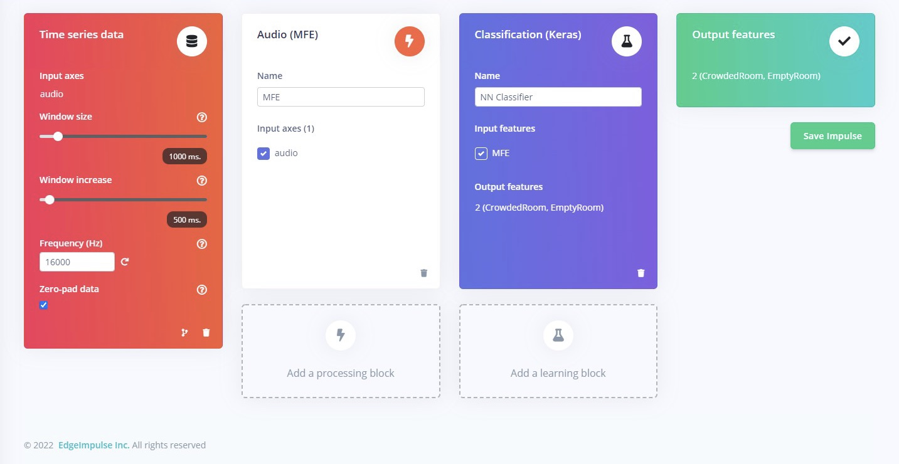

To wrap it up, for our use case we have decided to go with a 1 second window, Audio (MFE) as our processing block, and a Classification (Keras) Neural Network. With everything in place, click on Save Impulse and move over to the **MFE** tab that just appeared under the **Impulse Design** menu.

This block uses a non-linear scale in the frequency domain, named **Mel scale**. The Mel scale is a logarithmic scale used to represent frequency, such as the decibel or Hertz scale. What makes it unique is that the Mel scale is based on human perception of frequency. This makes it a useful tool for representing signals in the frequency domain, as it corresponds more closely to how humans perceive sound. Being logarithmic, the Mel scale compresses the range of frequencies that it covers and this can be helpful when working with signals that contain a large range of frequencies, making patterns more easily visible.

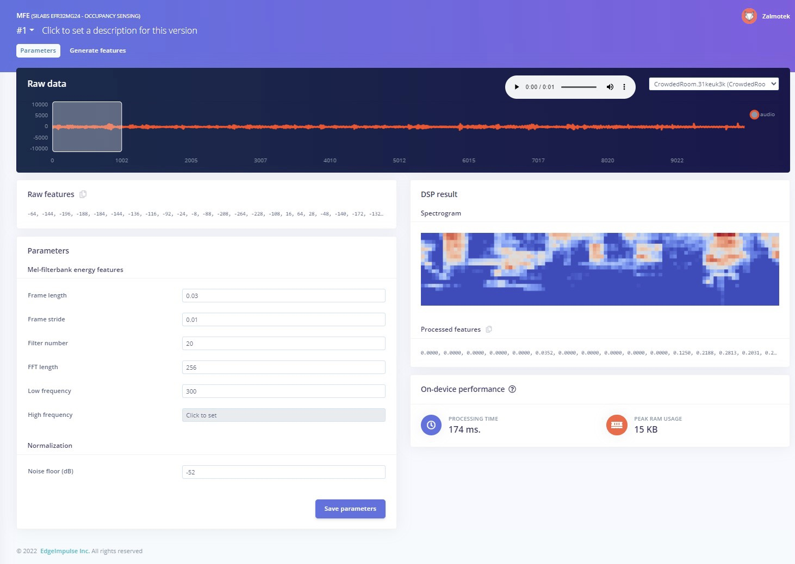

At this point, tweak the parameters with a simple principle in sight: similar results for similar data. In our case, we have reduced the filter number from 40 to 20 for best results. Once you are happy with the DSP results, click on **Save parameters** and you will be directed to the **Generate** Features tab.

After you click on the **Generate Features** button, the Feature explorer will be presented to you. Here you can explore your data in a visual way and quickly validate if your data separates nicely. If you are not happy with the results, navigate back to the Parameters page and modify them some more.

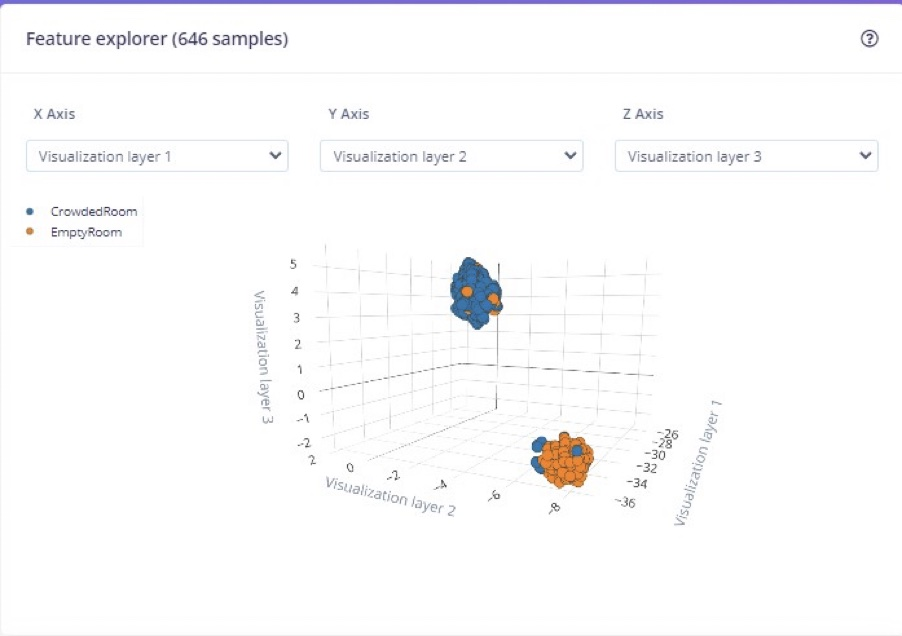

What you are aiming to see in the Feature explorer are clearly defined clusters, with the lowest number possible of misclassified data points.

### Configure the NN Classifier

In the **NN Classifier** tab, under the **Impulse Design** menu, allows us to configure various parameters that influence the training process of the neural network. For the moment, it suffices to leave the Training setting on the default value. You can notice in the Audio training options menu that a **Data Augmentation** option may be checked. Fundamentally, what Data Augmentation does is artificially increase the amount of training data, to improve the classifier’s accuracy, avoid overfitting and reduce the number of training cycles required. **Check it**, leave the settings as they come and click on **Start Training**.

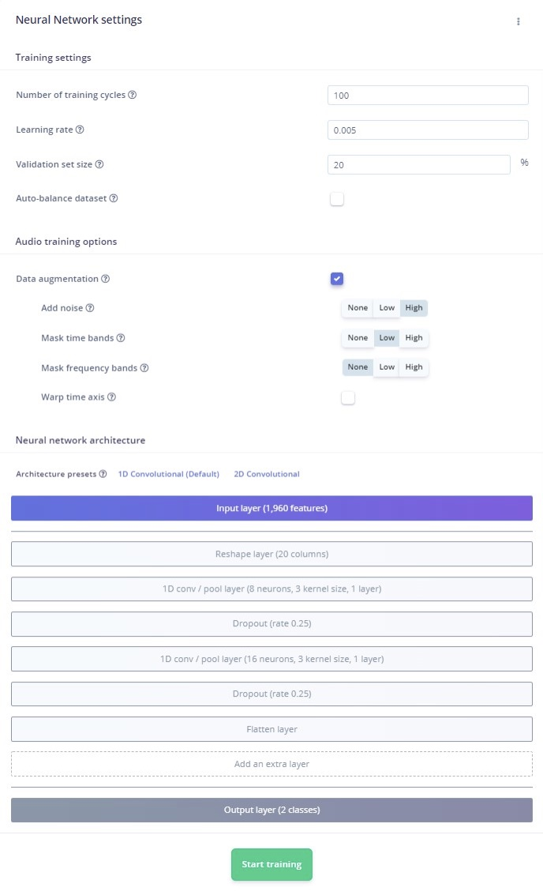

Once the training is done, you will be presented with the training output. What we are striving to achieve is an Accuracy of over 95%. The Confusion matrix right underneath displays in a tabular form the correct and incorrect responses given by our model that was fed the data set previously acquired. In our case, you can see that if a room is crowded there is a 4.76% chance that it will be classified as an empty room.


You can also visually see this in the Feature explorer, the misclassified CrowdedRoom points(represented with red dots) being placed near the EmptyRoom cluster.

### Test out the model

The best way to test out our model is to navigate to the **Live Classification** tab and start gathering some new samples. Make sure the sampling Frequency is the same as the one used in the Data Acquisition phase and click on **Start Sampling**.

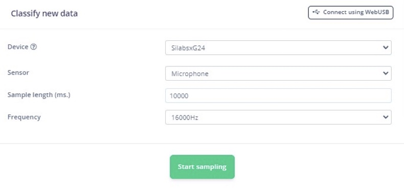

This is a great way to validate your model with data that was captured with the same device you intend to deploy it on.

## Deploying the model on the edge

In this last step, we will be taking the trained and optimized model and deploying it back on the device used for data acquisition. What we will achieve by this is decreased latency and power consumption, while also being able to perform the inference without an internet connection:

### Option 1: Deploying a pre-built binary

The SiLabs xG24 Dev Kit is fully supported by Edge Impulse. What this means is that, if you navigate to the Deployment tab, you will notice that in the “Build Firmware” section you can select the board and click **Build**.

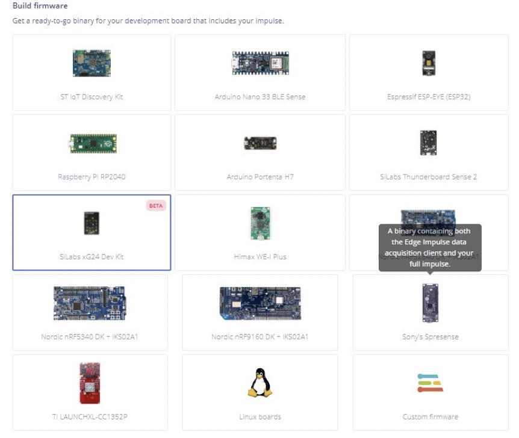

What this does is build the binary that we will upload on the development board in the same way we uploaded the base firmware at the beginning of the tutorial.


Connect the board to your computer, launch Simplicity Commander, select the board, navigate to the flash menu, carefully select the binary file and press **Flash**.

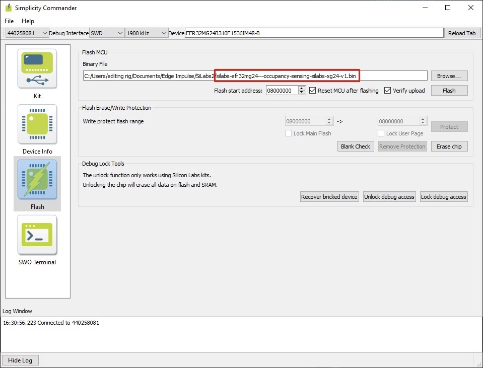

Restart the board, launch a Terminal and run:

`edge-impulse-run-impulse`

If everything went smoothly, you should see something like this, confirming the fact that you have deployed the model correctly and that the inference is running smoothly.

```
Edge Impulse impulse runner v1.14.10
[SER] Connecting to /dev/ttyACM0
[SER] Serial is connected, trying to read config...
[SER] Retrieved configuration
[SER] Device is running AT command version 1.7.0
[SER] Started inferencing, press CTRL+C to stop...
LSE
Inferencing settings:
	Interval: 0.062500ms.	Frame size: 16000
	Sample length: 1000.000000 ms.	No. of classes: 2
Starting inferencing, press 'b' to break
Starting inferencing in 2 seconds...
Predictions (DSP: 188 ms., Classification: 4 ms., Anomaly: 0 ms.): 
    CrowdedRoom: 	0.996094
    EmptyRoom: 	0.002031
```

### Option 2: Exporting the Impulse as a C++ library with SLCC (Simplicity Studio Component file) and building the binary locally

Edge Impulse offers its users the possibility to export the model as a C++ library that contains all the signal processing blocks, learning blocks, configurations, and SDK needed to integrate the model in your own custom application. Moreover, in the case of the xG24 devkit, it also provides the Simplicity Studio Component file.

## Conclusion

By understanding occupancy patterns, building managers can make informed decisions that will improve the comfort, safety, and efficiency of their buildings.

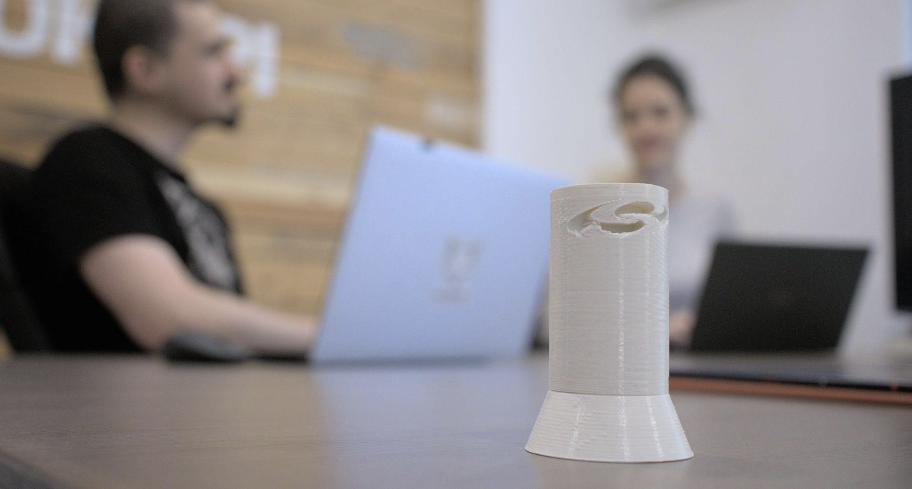

The xG24 DevKit is quite a powerhouse with the number of sensors present on it and many other use cases are possible. The recipe presented above can be used to quickly adapt to other environmental metrics you want to keep an eye on by training models on Edge Impulse.

If you need assistance in deploying your own solutions or more information about the tutorial above please [reach out to us](https://edgeimpulse.com/contact)!
