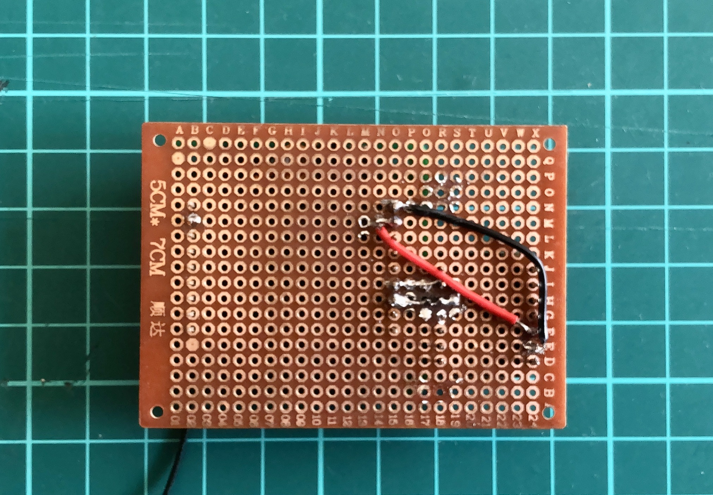
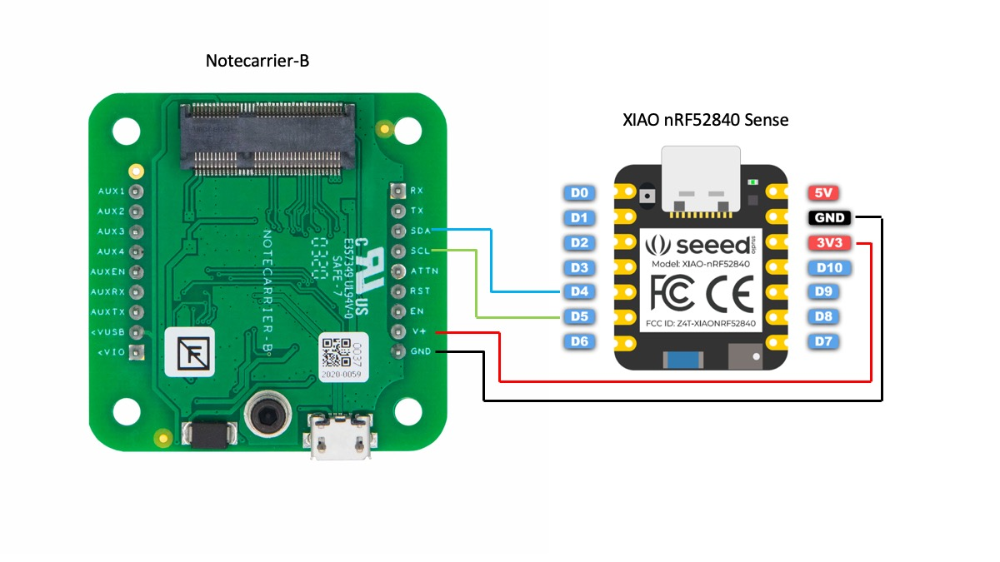

# Running Faucet Detection with a Seeed XIAO Sense + Blues Cellular

Created By: Naveen Kumar

Public Project Link: [https://studio.edgeimpulse.com/public/119084/latest](https://studio.edgeimpulse.com/public/119084/latest)

GitHub Repository: [https://github.com/metanav/running\_faucet\_detection\_blues\_wireless](https://github.com/metanav/running\_faucet\_detection\_blues\_wireless)

## Project Demo



## Story

Poor memory is only one of the many unpleasant experiences that accompany old age and these problems can have far-reaching implications on the comfort and security of seniors. Dementia is one of the most common neurological problems associated with the elderly. Imagine a case of seniors leaving the faucet on. The kind of water damage that might ensue is simply unimaginable. Not to mention lots of safety concerns such as electrocution and drowning. Also, sometimes kids or even adults forget to stop the faucet after use. It also adds up to your monthly water usage bills. According to the US EPA, leaving a faucet on for just five minutes wastes ten gallons of water. In this project, I have built a proof-of-concept of an AIoT (Artificial intelligence of things) device that can detect running faucets using a microphone and send an alert notification message.

## Hardware Selection

This project requires a low-powered, reliable, and widely available yet cost-effective cellular network radio to send alert messages to the phone and cloud. I will be using a [Blues Wireless Notecard ](https://blues.io/products/notecard/)(for Cellular connectivity) and a [Blues Wireless Notecarrier-B](https://shop.blues.io/products/carr-b), a carrier board for the Notecard.

Although the Notecard is capable as a standalone device for tracking purposes, we need to run Tensorflow Lite model inferencing using Edge Impulse, so we will be using a [Seeed XIAO nRF52840 Sense](https://www.seeedstudio.com/Seeed-XIAO-BLE-Sense-nRF52840-p-5253.html) as a host MCU. The slim profile of the Notecard with carrier board and inbuilt microphone on the tiny Seeed XIAO nRF52840 Sense makes it a good fit for our purpose. We need an antenna for better indoor cellular connectivity and a protoboard to assemble the hardware.


The Notecarrier-B and Seeed XIAO nRF52840 Sense are connected over I2C.



The schematics are given below.



## Model creation and training

We will use Edge Impulse Studio to train and build a TensorFlow Lite model. We need to create an account and create a new project at [https://studio.edgeimpulse.com. ](https://studio.edgeimpulse.com/)We are using a prebuilt dataset for detecting whether a faucet is running based on audio. It contains 15 minutes of data sampled from a microphone at 16KHz over the following two classes:

* **Faucet** - faucet is running, with a variety of background activities.
* **Noise** - just background activities.

We can import this dataset to the Edge Impulse Studio project using the Edge Impulse CLI Uploader. Please follow the instructions here to install Edge Impulse CLI: [https://docs.edgeimpulse.com/docs/edge-impulse-cli/cli-installation](https://docs.edgeimpulse.com/docs/edge-impulse-cli/cli-installation). The datasets can be downloaded from here: [https://cdn.edgeimpulse.com/datasets/faucet.zip](https://cdn.edgeimpulse.com/datasets/faucet.zip).

```
$ unzip faucet.zip
$ cd faucet
$ edge-impulse-uploader --clean
Edge Impulse uploader v1.16.0
? What is your user name or e-mail address (edgeimpulse.com)?
```

You will be prompted for your username, password, and the project where you want to add the dataset.

```
$ edge-impulse-uploader --category training faucet/training/*.cbor
$ edge-impulse-uploader --category testing faucet/testing/*.cbor
```

After uploading is finished we can see the data on the **Data Acquisition** page.


In the **Impulse Design** > **Create Impulse** page, we can add a processing block and learning block. We have chosen MFE for the processing block which extracts a spectrogram from audio signals using Mel-filterbank energy features, great for non-voice audio, and for the learning block, we have chosen Neural Network (Keras) which learns patterns from data and can apply these to new data for recognizing audio.


Now we need to generate features in the **Impulse Design** > **MFE** page. We can go with the default parameters.


After clicking on the **Save Parameters** button the page will redirect to the **Generate Features** page where we can start generating features which would take a few minutes. After feature generation, we can see the output in the Feature Explorer.


Now we can go to the **Impulse Design** > **NN Classifier** page where we can define the Neural Network architecture. We are using a 1-D convolutional network which is suitable for audio classification.


After finalizing the architecture, we can start training which will take a couple of minutes to finish. We can see the accuracy and confusion matrix below.


For such a small dataset 99.2% accuracy is pretty good so we will use this model.

## Testing

We can test the model on the test datasets by going to the **Model testing** page and clicking on the **Classify all** button. The model has 91.24% accuracy on the test datasets, so we are confident that the model should work in a real environment.


## Deployment

The Edge Impulse Studio and Blues Wireless Notecard both support Arduino libraries, so we will choose the **Create Library** > **Arduino library** option on the Deployment page. For the **Select optimizations** option, we will choose **Enable EON Compiler**, which reduces the memory usage of the model. Also, we will opt for the Quantized (Int8) model. Now click the **Build** button, and in a few seconds, the library bundle will be downloaded to your local computer.

### Set up Blues Wireless Notecard and Notehub

Before starting to run the application we should set up the Notecard. Please see the easy-to-follow quick-start guide [here](https://dev.blues.io/quickstart/notecard-quickstart/notecard-and-notecarrier-b/) to set up a Notecard with a Notecarrier-B to test that everything works as expected. The application code does the Notecard setup at boot-up to make sure it is always in the known state. We also need to set up Notehub, which is a cloud service that receives data from the Notecard and allows us to manage the device, and route that data to our cloud apps and services. We can create a free account at [https://notehub.io/sign-up, ](https://notehub.io/)and after successful login, we can create a new project.


We should copy the **ProjectUID** which is used by Notehub to associate the Notecard to the project created.

For SMS alerts we need to set up an account at [Twilio ](https://www.twilio.com/try-twilio)and create a route by clicking the **Create Route** link at the top right on the **Route** page. Please follow the instructions given in the nicely written [guide](https://dev.blues.io/guides-and-tutorials/twilio-sms-guide/) provided by Blues Wireless, for leveraging the **General HTTP/HTTPS Request/Response** Route type to invoke the Twilio API.


In the Filters section, we have to specify which Notecard outbound file data we want to route to Twilio. It would make sure that we always send out the intended data. In the application code, we would add notes to the _twilio.qo_ file.


To send SMS messages, the Twilio API expects form data with three key/value pairs (Body, From, and To). This can be achieved using a JSONata (a query and transformation language for JSON data) expression to format the data into the required form. We should choose JSONata Expression in the **Data** > **Transform** field and we can enter the JSONata expression in the text area as shown below.


The JSONata expression is given below that formats the JSON payload to a Twilio API consumable message format.

```
( 
    "&Body=" & body.event & "&From=" & body.from & "&To=" & body.to & "&"
)
```

## Running Inferencing

Please follow the instructions [here](https://www.arduino.cc/en/software) to download and install Arduino IDE. After installation, open the Arduino IDE and install the board package for the Seeed XIAO nRF52840 Sense by going to **Tools** > **Board** > **Boards Manager**. Search the board package as shown below and install it.


After the board package installation is completed, choose the **Seeed XIAO BLE Sense** from **Tools** > **Board** > **Seeed nRF52 OS mbed-enabled Boards** menu and select the serial port of the connected board from **Tools** > **Port** menu. We need to install the **Blues Wireless Notecard** library using the Library Manager (**Tool** > **Manage Libraries...**) as shown below.


Below is the Arduino sketch for inferencing. For continuous audio event detection, the application uses two threads, one for inferencing and another for audio data sampling so that no events should miss.

```
#include <Notecard.h>
#include <PDM.h>
#include <Wire.h>

#define EIDSP_QUANTIZE_FILTERBANK   0
#define EI_CLASSIFIER_SLICES_PER_MODEL_WINDOW 3
#include <Running_Faucet_Blues_Wireless_inferencing.h>

#define serialDebugOut Serial
#define MY_PRODUCT_ID       "com.xxxxx.xxxxxxxx:running_faucet_detector"
#define FROM_PHONE_NUMBER   "+16xxxxxxxxx" // Twilio provided
#define TO_PHONE_NUMBER     "+8195xxxxxxxxx" // Target phone
#define CONTINUOUS_THRESOLD_SECS  (20)
#define NOTE_THRESOLD_SECS   (30)
#define LED_RED LEDR
#define LED_BLUE LEDB
#define FAUCET_IDX 0
#define NOISE_IDX  1

// Notecard instance
Notecard notecard;

static rtos::Thread inference_thread(osPriorityLow);

/** Audio buffers, pointers and selectors */
typedef struct {
  signed short *buffers[2];
  unsigned char buf_select;
  unsigned char buf_ready;
  unsigned int buf_count;
  unsigned int n_samples;
} inference_t;

static inference_t inference;
static bool record_ready = false;
static signed short *sampleBuffer;
static bool debug_nn = false;
static int print_results = -(EI_CLASSIFIER_SLICES_PER_MODEL_WINDOW);

uint32_t continous_faucet_running_start_time;
uint32_t last_notification_sent_time;
uint8_t  prev_prediction = NOISE_IDX;

/* Forward declaration */
void run_inference_background();


void notecard_success()
{
  digitalWrite(LED_BLUE, LOW);
  delay(1000);
  digitalWrite(LED_BLUE, HIGH);
}

void notecard_error()
{
  digitalWrite(LED_RED, LOW);
  delay(1000);
  digitalWrite(LED_RED, HIGH);
}

void configure_notehub()
{
  // Setup Notehub
  J *req = notecard.newRequest("hub.set");
  if (req) {
    JAddStringToObject(req, "product", MY_PRODUCT_ID);
    JAddBoolToObject(req, "sync", true);
    JAddStringToObject(req, "mode", "periodic");
    JAddNumberToObject(req, "outbound", 24 * 60); // 1 day
    JAddNumberToObject(req, "inbound", 60); // 60 mins
    if (!notecard.sendRequest(req)) {
      notecard.logDebug("ERROR: Setup Notehub request\n");
      notecard_error();
    }
  } else {
    notecard.logDebug("ERROR: Failed to set notehub!\n");
    notecard_error();
  }
  notecard_success();
}

uint32_t get_current_timestamp_from_notecard()
{
  uint32_t timestamp = 0;

  J *rsp = notecard.requestAndResponse(notecard.newRequest("card.time"));

  if (rsp != NULL) {
    String zone = JGetString(rsp, "zone");
    if (zone != "UTC,Unknown") {
      timestamp = JGetNumber(rsp, "time");
    }
    notecard.deleteResponse(rsp);
  }

  return timestamp;
}

void send_alert_message()
{
  // Add a note
  J *req = notecard.newRequest("note.add");
  if (req != NULL) {
    // send immediately
    JAddBoolToObject(req, "sync", true);
    JAddStringToObject(req, "file", "twilio.qo");
    J *body = JCreateObject();
    if (body != NULL) {
      JAddStringToObject(body, "event", "Running Faucet Alert");
      JAddStringToObject(body, "from", FROM_PHONE_NUMBER);
      JAddStringToObject(body, "to", TO_PHONE_NUMBER);
      JAddItemToObject(req, "body", body);
    }

    if (!notecard.sendRequest(req)) {
      notecard.logDebug("ERROR: add note request\n");
      notecard_error();
    } else {
      ei_printf("Note sent!\n");
    }
  }
  notecard_success();
}

void setup()
{
  serialDebugOut.begin(115200);
  delay(1000);
  pinMode(LED_RED, OUTPUT);
  pinMode(LED_BLUE, OUTPUT);

  digitalWrite(LED_RED, HIGH);  // Off
  digitalWrite(LED_BLUE, HIGH); // Off

  //while (!serialDebugOut) {}

  Wire.begin();

  // Initialize Notecard with I2C communication
  notecard.begin(NOTE_I2C_ADDR_DEFAULT, NOTE_I2C_MAX_DEFAULT, Wire);
  notecard.setDebugOutputStream(serialDebugOut);

  configure_notehub();

  if (microphone_inference_start(EI_CLASSIFIER_SLICE_SIZE) == false) {
    ei_printf("ERR: Failed to setup audio sampling\r\n");
    return;
  }

  inference_thread.start(mbed::callback(&run_inference_background));

  last_notification_sent_time = get_current_timestamp_from_notecard();
}


// this loop only samples the audio data
void loop()
{
  bool m = microphone_inference_record();
  if (!m) {
    ei_printf("ERR: Failed to record audio...\n");
    return;
  }
}


// this loop inference continuously on another thread
void run_inference_background()
{
  run_classifier_init();

  while (1) {
    signal_t signal;
    signal.total_length = EI_CLASSIFIER_SLICE_SIZE;
    signal.get_data = &microphone_audio_signal_get_data;
    ei_impulse_result_t result = {0};

    EI_IMPULSE_ERROR r = run_classifier_continuous(&signal, &result, debug_nn);
    if (r != EI_IMPULSE_OK) {
      ei_printf("ERR: Failed to run classifier (%d)\n", r);
      return;
    }

    if (++print_results >= (EI_CLASSIFIER_SLICES_PER_MODEL_WINDOW)) {
      ei_printf("Predictions ");
      ei_printf("(DSP: %d ms., Classification: %d ms.)",
                result.timing.dsp, result.timing.classification, result.timing.anomaly);
      ei_printf(": \n");
      for (size_t ix = 0; ix < EI_CLASSIFIER_LABEL_COUNT; ix++) {
        ei_printf("    %s: %.5f\n", result.classification[ix].label,
                  result.classification[ix].value);
      }
      // above 80% confidence score
      if (result.classification[FAUCET_IDX].value > 0.8f) {
        uint32_t current_time = get_current_timestamp_from_notecard();
        if (prev_prediction == FAUCET_IDX) {
          ei_printf("Continuously Faucet running time: %ld\n", (current_time - continous_faucet_running_start_time));

          if ((current_time - continous_faucet_running_start_time) > CONTINUOUS_THRESOLD_SECS) {
            if (current_time - last_notification_sent_time > NOTE_THRESOLD_SECS) {
              send_alert_message();
              last_notification_sent_time = current_time;
            }
          }
        } else {
          // reset counter
          continous_faucet_running_start_time = current_time;
          ei_printf("Faucet running time reset\n");
        }
        prev_prediction = FAUCET_IDX;
      } else {
        prev_prediction = NOISE_IDX;
      }
      print_results = 0;
    }
  }
}

/**
   @brief      PDM buffer full callback
               Get data and call audio thread callback
*/
static void pdm_data_ready_inference_callback(void)
{
  int bytesAvailable = PDM.available();

  // read into the sample buffer
  int bytesRead = PDM.read((char *)&sampleBuffer[0], bytesAvailable);

  if (record_ready == true) {
    for (int i = 0; i<bytesRead >> 1; i++) {
      inference.buffers[inference.buf_select][inference.buf_count++] = sampleBuffer[i];

      if (inference.buf_count >= inference.n_samples) {
        inference.buf_select ^= 1;
        inference.buf_count = 0;
        inference.buf_ready = 1;
      }
    }
  }
}

static bool microphone_inference_start(uint32_t n_samples)
{
  inference.buffers[0] = (signed short *)malloc(n_samples * sizeof(signed short));

  if (inference.buffers[0] == NULL) {
    return false;
  }

  inference.buffers[1] = (signed short *)malloc(n_samples * sizeof(signed short));

  if (inference.buffers[1] == NULL) {
    free(inference.buffers[0]);
    return false;
  }

  sampleBuffer = (signed short *)malloc((n_samples >> 1) * sizeof(signed short));

  if (sampleBuffer == NULL) {
    free(inference.buffers[0]);
    free(inference.buffers[1]);
    return false;
  }

  inference.buf_select = 0;
  inference.buf_count = 0;
  inference.n_samples = n_samples;
  inference.buf_ready = 0;

  // configure the data receive callback
  PDM.onReceive(&pdm_data_ready_inference_callback);

  PDM.setBufferSize((n_samples >> 1) * sizeof(int16_t));

  // initialize PDM with:
  // - one channel (mono mode)
  // - a 16 kHz sample rate
  if (!PDM.begin(1, EI_CLASSIFIER_FREQUENCY)) {
    ei_printf("Failed to start PDM!");
  }

  // set the gain, defaults to 20
  PDM.setGain(75);

  record_ready = true;

  return true;
}

static bool microphone_inference_record(void)
{
  bool ret = true;

  if (inference.buf_ready == 1) {
    ei_printf(
      "Error sample buffer overrun. Decrease the number of slices per model window "
      "(EI_CLASSIFIER_SLICES_PER_MODEL_WINDOW)\n");
    ret = false;
  }

  while (inference.buf_ready == 0) {
    delay(1);
  }

  inference.buf_ready = 0;

  return ret;
}

/**
   Get raw audio signal data
*/
static int microphone_audio_signal_get_data(size_t offset, size_t length, float *out_ptr)
{
  numpy::int16_to_float(&inference.buffers[inference.buf_select ^ 1][offset], out_ptr, length);

  return 0;
}

static void microphone_inference_end(void)
{
  PDM.end();
  free(inference.buffers[0]);
  free(inference.buffers[1]);
  free(sampleBuffer);
}
```

To run the inferencing sketch, clone the application GitHub repository using the command below.

```
$ git clone https://github.com/metanav/running_faucet_detection_blues_wireless.git
```

Import the library bundle running\_faucet\_blues\_wireless\_inferencing\*.zip\* using the menu **Sketch** > **Include Library** > **Add.ZIP Library** in the Arduino IDE. Open the inferencing sketch _notecard\_nano\_ble\_sense\_running\_faucet\_detection_.ino and compile/upload the firmware to the connected Seeed XIAO nRF52840 Sense board. We can monitor the inferencing output and Notecard debug logs using the **Tools** > **Serial Monitor** with a baud rate of 115200 bps.

## Casing

For protection, the device is placed inside a plastic box that can be mounted on a wall.


The flexible cellular antenna is stuck to the side of the box.


## Conclusion

Although this proof-of-concept device is used in the house with a wall outlet, it can be powered using batteries. Being equipped with cellular connectivity, it can be installed in those areas where there is no WiFi network. This is an easy-to-use and convenient device that respects users' privacy by running the inferencing at the edge and sending alert notifications on time.
