# Enhancing Worker Safety using Synthetic Audio to Create a Dog Bark Classifier

Created By: Solomon Githu

Public Project Link: [https://studio.edgeimpulse.com/public/497492/latest](https://studio.edgeimpulse.com/public/497492/latest)

GitHub Repository: [https://github.com/SolomonGithu/tinyml_dog_bark_and_howl_classification](https://github.com/SolomonGithu/tinyml_dog_bark_and_howl_classification)


## Introduction

It's said that a dog is man's best friend and it is no secret that dogs are incredibly loyal animals. They are very effective when it comes to securing premises, and are also able to sense when things are not right, whether with a person or with a situation. Some examples of dog security are guidance for people with visual impairments, detection of explosives and drugs, search and rescue missions, and enhancing security at various places. Worker safety aims to foster a practice of ensuring a safe working environment by providing safe equipment and implementing safety guidelines that enable workers to be productive and efficient in their job. In this case, dogs are usually deployed to patrol and monitor areas around workplace. One of the reasons is because dogs have an extraordinary sensing ability of smell, vision and hearing; making them exceptional at detecting threats that may go unnoticed by humans or other security systems. However, workers may not always be able to interpret a dog's barks in time. The workers may not be knowledgeable of how dog's react, or they may be focusing on their tasks and fail to hear a dog. Failure to detect a dog's bark may lead to fatalities, injuries or even accidents.

Machine listening refers to the ability of computers to understand audio signals similarly to how humans hear and understand various sounds. Recently, labeling of acoustic events has emerged as an active topic covering a wide range of applications. This is because by analyzing animal sounds, AI can identify species more accurately and efficiently than ever before and provide unique insights into the behaviors and habitats of animals without disturbing them. Barking and other dog vocalizations have acoustic properties related to their emotions, physiological reactions, attitudes, or some other internal states. Historically, humans have relied on intuition and experience to interpret these signals from dogs. We have learned that a low growl often precedes aggression, while a high-pitched bark might indicate excitement or distress. Through this experience, we can train AI models to recognize dog sounds, and those who work with the animals— like security guards, maintenance staff, and even delivery people can use that insight.

The AI model only requires to be trained to recognize the sounds one seeks to monitor based on recordings of the sound. However, creating an audio dataset of animal sounds is quite challenging. In this case, we do not disturb dogs, or other animals, to provoke reactions like barking. Fortunately, Generative AI is currently at the forefront of AI technology. Over the past decade, we have witnessed significant advancements in synthetic audio generation. From sounds to songs, with just a simple prompt, we can now use computers to generate dog sounds and in turn use the data to train another AI model.


## Project Overview

This project aims to develop a smart prototype wearable that can be used by workers to receive alerts from security dogs. In workplaces and even residential areas, dog sounds are common, but we often overlook them, assuming there is no real threat. We hear the sounds but don't actively listen to the warnings dogs may be giving. Additionally, workers at a site may be too far to hear the dogs, and in some cases, protective ear muffs further block out environmental sounds.

Sound classification is one of the most widely used applications of Machine Learning. This project involves developing a smart wearable device that is able to detect dogs sounds specifically barking and howling. When these dogs sounds are detected, the wearable communicates about the dog's state by displaying a message on a screen. This wearable can be useful to workers by alerting them of precautionary measures. A security worker may be alerted of a potential threat that a dog identified but they did not manage to see. A postal delivery person can also be alerted of an aggressive dog that may be intending to attack them as they may perceive the delivery person as a threat.

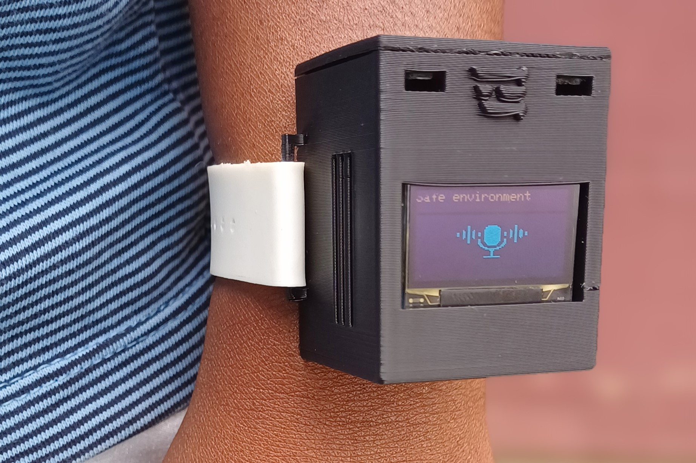

To train a Machine Learning model for this task, the project uses generative AI for synthetic data creation. The reason why I chose this is because we cannot distress a dog so that we can obtain reactions like barking or howling. I also wanted to explore how generative AI can be used for synthetic data generation. Ideally, when training Machine Learning models, we want the data to be a good representation of how it would also look when the model is deployed (inference).

With the recent advancements in embedded systems and the Internet of Things (IoT), there is a growing potential to integrate Machine Learning models on resource constrained devices. In our case, we want a light-weight device that we can easily wear on our wrists and at the same time achieving smart acoustic sensing. Steve Roddy, former Vice President of Product Marketing for Arm's Machine Learning Group once said that "TinyML deployments are powering a huge growth in ML deployment, greatly accelerating the use of ML in all manner of devices and making those devices better, smarter, and more responsive to human interaction". Tiny Machine Learning (TinyML) enables running Machine Learning on small, low cost, low-power resource constrained devices like wearables. Many people have not heard of TinyML but we are using it everyday on devices such as smart home assistants. According to an [article by Thoughtworks, Inc.](https://www.thoughtworks.com/insights/blog/machine-learning-and-ai/tinyml-the-next-big-thing), there are already 3 billion devices that are able to run Machine Learning models. 

We will use TinyML to deploy a sound classification model on the [Seeed Studio XIAO ESP32S3 (Sense)](https://wiki.seeedstudio.com/xiao_esp32s3_getting_started/). This tiny 21mm x 17.8mm development board integrates a camera sensor, digital microphone, SD card, 8MB PSRAM and 8MB Flash. By combining embedded Machine Learning computing power, this development board can be a great tool to get started with intelligent voice and vision AI solutions. We will use the onboard digital microphone to capture environment sounds and an optimized Machine Learning model will run on the ESP32-S3R8 Xtensa LX7 dual-core processor. The TinyML model will classify sound as either noise, dog bark or dog howling. These classification results will then be displayed on an OLED screen. The XIAO ESP32S3 board was a good fit for this project due to it's high performance processor, wireless communication capabilities, and low power consumption.

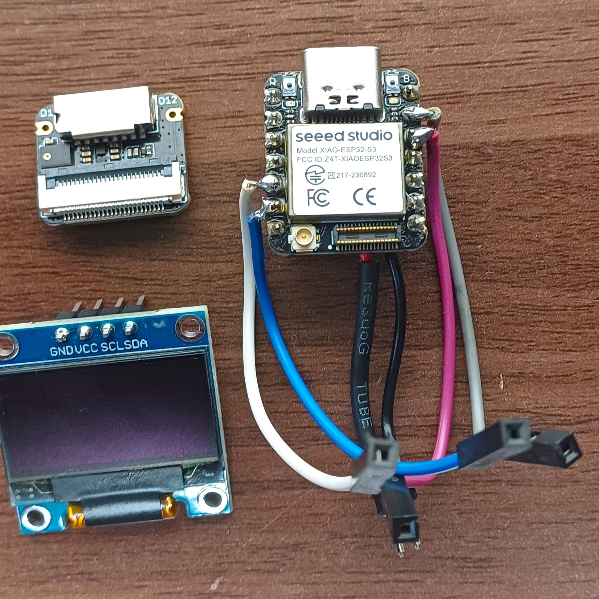

As the embedded hardware is advancing, software developments are also coming up and they are enabling TinyML. We will use the [Edge Impulse platform](https://edgeimpulse.com/) for this project and indeed this is leading Edge AI platform! I chose Edge Impulse because it simplifies the development and deployment platform. The platform supports integrating generative AI tools for synthetic data acquisition, ability to simultaneously have various machine learning pipelines each with it's deployment performance shown, and the ability to optimize Machine Learning models-enabling them to run even on microcontrollers with less flash and RAM storage. The experience using the Edge Impulse platform for this project made the workflow easy and it also enabled the deployment since the model optimization enabled 27% less RAM and 42% less flash (ROM) usage. This documentation will cover everything from preparing the dataset, training the model and deploying it to the XIAO ESP32S3!

You can find the public Edge Impulse project here: [Generative AI powering dog sound classification](https://studio.edgeimpulse.com/public/497492/latest). To add this project into your Edge Impulse account, click "Clone this project" at the top of the page. Next, go to the section "Deploying the Impulses to XIAO ESP32S3" for steps on deploying the model to the XIAO ESP32S3 development board.

## Use Case Explanation

Canine security refers to the use of trained security dogs and expert dog handlers to detect and protect against threats. The effectiveness in dogs lies in their unique abilities. Animals, especially dogs, have a keen sense of smell and excellent hearing. As a result, dogs are the ideal animal to assist security guards in their duties and also provide security to workplaces and homesteads. However, at the same time, according to the American Veterinary Medical Association, more than 4.5 million people are bitten by dogs each year in the US. And while anyone can suffer a dog bite, delivery people are especially vulnerable. Statistics released by the US Postal Service show that 5,800 of its employees were attacked by dogs in the U.S. in 2020.

According to Sam Basso, a professional dog trainer, clients frequently admit they have more to learn about their dogs during his sessions. While humans have been able to understand how dogs act, there is still more learning that the average person requires so that they can better understand dogs. There are professional dog handlers that can be used to train owners but this comes at a great cost and also not everyone is ready to take the classes. To address these issues, we can utilize AI to develop a device that can detect specific dog sounds such as barking, and alert workers so that they can follow up on the situation that the dog is experiencing. In the case of delivery persons, an alert can inform them of a nearby aggressive dog.

Audio classification is a fascinating field with numerous applications, from speech recognition to sound event detection. Training AI models has become easier by using pre-trained networks. The transfer learning approach uses a pretrained model which is already trained using a large amount of data. This approach can significantly reduce the amount of labeled data required for training, it also reduces the training time and resources, and improves the efficiency of the learning process, especially in cases where there is limited data available. 

Training a model requires setting up various configurations, such as data processing formats, model type, and training parameters. As developers, we experiment with different configurations and track their performance in terms of processing time, accuracy, classification speed, Flash and RAM usage. To facilitate this process, Edge Impulse offers the [Experiments](https://docs.edgeimpulse.com/docs/edge-impulse-studio/impulse-design-and-experiments) feature. This enables us to create multiple Machine Learning pipelines (Impulses) and easily view the performance metrics for all pipelines, helping us quickly understand how each configuration performs and identify the best one.

Finally, for deployment, this project requires a low-cost, small and powerful device that can run optimized Machine Learning models. The wearable will also require ability to connect to an OLED display using general-purpose input/output (GPIO) pins. Power management is another most important consideration for a wearable. The ability to easily connect a small battery, achieve low power consumption, and have battery charging would be great. In this case, the deployment mode makes use of the XIAO ESP32S3 development board owing to it's small form factor, high performance and lithium battery charge management capability.

## Components and Hardware Configuration

Software components:
- Edge Impulse Studio account
- ElevenLabs account
- Arduino IDE

Hardware components:
- A personal computer
- [Seeed Studio XIAO ESP32S3 (Sense)](https://www.seeedstudio.com/XIAO-ESP32S3-Sense-p-5639.html) development board with the camera detached
- SSD1306 OLED display
- 3.7V lithium battery. In my case, I used a 500mAh battery.
- [3D printed parts for the wearable](https://www.printables.com/model/1058035-seeed-studio-xiao-esp32s3-sense-wearable-case). Available to download on Printables.com
- Some jumper wires and male header pins
- Soldering iron and soldering wire
- Super glue. Always be careful when handling glues!

## Data Collection Process

To collect the data to be used in this project, we will use the Synthetic data generation tool on the platform. At the time of writing this documentation in October 2024, Edge Impulse has integrated three Generative AI platforms for synthetic data generation: Dall-E to generate images, Whisper for creating human speech elements, and ElevenLabs to generate audio sound effects. In our project, we will use [ElevenLabs](https://elevenlabs.io/) since it is great for generating non-voice audio samples. There is an amazing [tutorial video](https://www.youtube.com/watch?v=vnyFk58qpf4&ab_channel=EdgeImpulse) that demonstrates how to use the integrated ElevenLabs audio generation feature with Edge Impulse. If we were instead capturing sounds from the environment, Edge Impulse also supports collecting data from [various sources](https://docs.edgeimpulse.com/docs/edge-impulse-studio/data-acquisition) such as uploading files, using APIs, smartphone/computers, and even connecting development boards directly to your project so that you can fetch data from sensors.

The first step was to create a free account on ElevenLabs. You can do this by signing up with an email address and a password. However, note that with the current [ElevenLabs pricing](https://elevenlabs.io/pricing) the free account gives 10,000 credits which can be used to generate around 10 minutes of audio per month. Edge Impulse's synthetic audio generation feature is offered in the Professional and Enterprise packages, but users can access the Enterprise package with a [14-day free access](https://studio.edgeimpulse.com/trial-signup) that doesn't require a credit card.

Once we have an account on both ElevenLabs and EdgeImpulse, we can get started with data creation. First, create a project (with Professional or Enterprise account) on Edge Impulse Studio. On the dashboard, navigate to "Data acquisition" and then "Synthetic data". Here, we will need to fill the form with our ElevenLabs API key and also parameters for the data generation such as the prompt, label, number of samples to be generated, length of the each sample, frequency of the generated audio files, and also prompt influence parameter.


To get an API key from ElevenLabs, first login to your account. Next, on the "home" page that opens after logging in, click "My Account" followed by "API Keys". This will open a new panel that enables managing the account API Keys. We need to click "Create API Key" and then give a name to the key, although the naming does not matter. Next, we click the "Create" button and this will generate an API key (a string of characters) that we need to copy to our Edge Impulse project in the "ElevenLabs.io API Key" field.

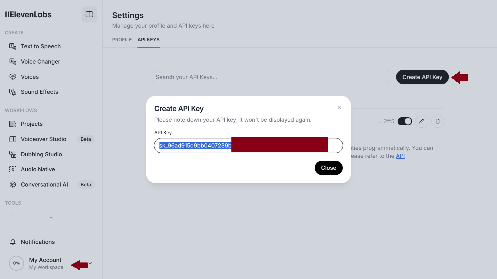

In generative AI, prompts act as inputs to the AI. These inputs are used to prompt the generative AI model to generate the desired response which can be text, images, video, sound, code and more. The goal of the prompt is to give the AI model enough information so that it can generate a response that is relevant to the prompt. For example, if we want ChatGPT to generate an invitation message we can simply ask it to "Generate an invitation message". However, if we were to add more details such as the time, venue, what kind of event is it (wedding, birthday, conference, workshop etc.), targeted audience, speakers; these can improve the quality of the response we get from ChatGPT. ElevenLabs have created a [documentation of AI prompting](https://elevenlabs.io/docs/sound-effects/overview) and it also describes other parameters that they have enabled so that users can get more relevant responses.

For this demonstration project, at first I worked with 3 classes of sounds: dog barking, dog howling and environment sounds (with city streets, construction sites and people talking). In this case, the prompt that I used to generate sound for each class was "dog howling", "dog barking" and "environmental sounds (e.g., city streets, construction sites, people talking)" respectively. The labels for each class was `dog_howling`, `dog_barking` and `environment` respectively. For each prompt, I used a prompt influence of 0.6 (this generated the best sounds), "Number of samples" as 6, "Minimum length (seconds)" as 1, "Frequency (Hz)" as 16000 and "Upload to category" as training. With these configurations, when we click the "Generate data" button on Edge Impulse Studio, this will generate 6 audio samples each of 1 second for one class. To generate sound for another class, we can simply put the prompt for it and leave the other fields unchanged. I used this configuration to generate around 39 minutes of audio files consisting of dogs barking, dogs howling and environment (e.g., city streets, construction sites, people talking) sounds.

However, later on after experimenting with various models, I noticed significant bias in the dog barking class, leading the models to classify any unheard sounds as dog barks (in other words, the models were overpredicting the dog bark class). In this case, I created another class, `noise`, consisting of 10 minute recordings from quiet environments with conversations, silence, and low machine sounds like a refrigerator and a fan. I uploaded the recordings to the Edge Impulse project and used the [split data tool](https://www.edgeimpulse.com/blog/crop-split-data/) to extract 1 second audio samples from the recording. After several experiments, I observed that the model actually performed best when I only had 3 classes: dog barking, dog howling and noise sounds. Therefore, I disabled the `environment` class audio files in the dataset and this class was ignored in the pre-processing, model training and deployment.

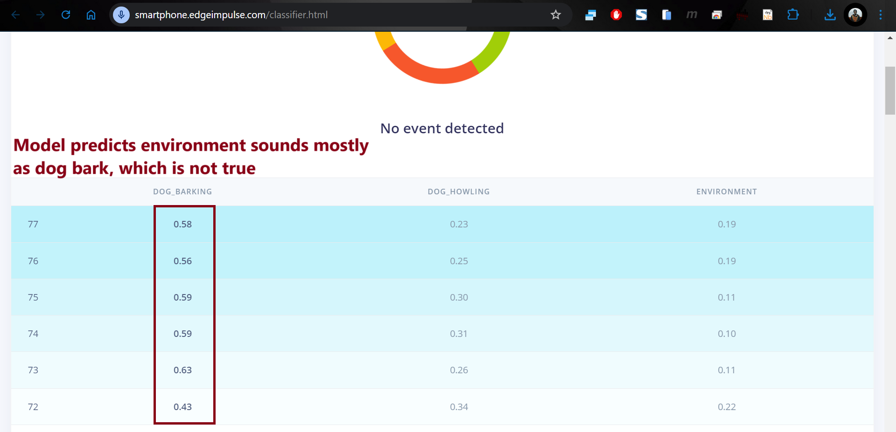

In Machine Learning, it is always a challenge to train models effectively. Bias can be introduced by various factors and it can be very difficult to even identify that this problem exists. In our case, since the device will be continuously recording environment sound and classifying it, we need to also consider that it's not always that there will be a dog barking, dog howling, people talking and city sounds present. The environment can also be calm, with low noise or other sounds that the generative AI model failed to include in the environment class. Identifying this is key to fixing the bias of using the environment sounds (e.g., city streets, construction sites, people talking).

Finally, after using ElevenLabs integration and uploading my `noise` sound recording, I had around 36 minutes of sound data for both training and testing. In AI, the more data, the better the model will perform. For this demonstration project, I found the dataset size to be adequate.

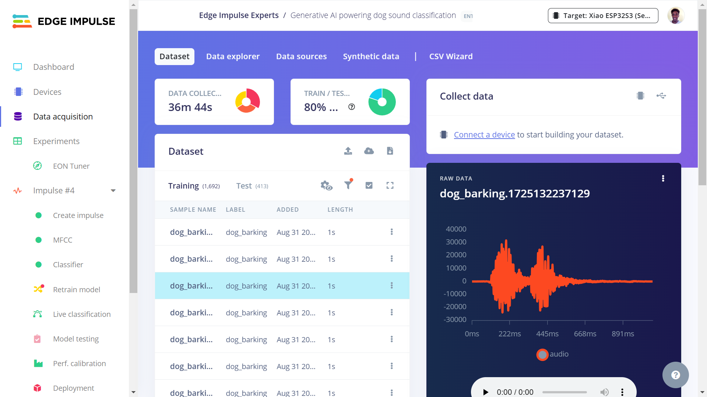

Finally, once we have the dataset prepared, we need to [split](https://docs.edgeimpulse.com/docs/edge-impulse-studio/data-acquisition#dataset-train-test-split-ratio) it for Training and Testing. The popular rule is 80/20 split and this indicates that 80% of the dataset is used for model training purposes while 20% is used for model testing. On Edge Impulse Studio projects, we can click red triangle with exclamation mark (as shown in the image below) and this will open an interface that suggests splitting our dataset. 

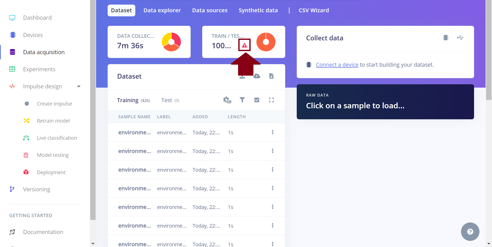

We then click the button "Perform train / test split" on the interface that opens. This will open another interface that asks  us if we are sure of rebalancing our dataset. We need to click the button "Yes perform train / test split" and finally enter "perform split" in the next window as prompted, followed by clicking the button "Perform train / test split".

## Training the Machine Learning Model, with Experiments

After collecting data for our project, we can now train a Machine Learning model for the required sound classification task. To do this, on Edge Impulse we need to create an [Impulse](https://docs.edgeimpulse.com/docs/edge-impulse-studio/impulse-design-and-experiments). An Impulse is a configuration that defines the input data type, data pre-processing algorithm and the Machine Learning model training. In our project, we are targeting to train an efficient sound classification model and "fit" inside a microcontroller (ESP32S3). In this case, there are a great number of parameters and algorithms that we need to choose accurately. One of the great features of the Edge Impulse platform is the powerful tools that simplify the development and deployment of Machine Learning. Edge Impulse recently released the [Experiments](https://docs.edgeimpulse.com/docs/edge-impulse-studio/impulse-design-and-experiments#experiments) feature which allows projects to contain multiple Impulses, where each Impulse can contains either the same combination of blocks or a different combination. This allows us to view the performance for various types of learning and processing blocks, while using the same input training and testing datasets.

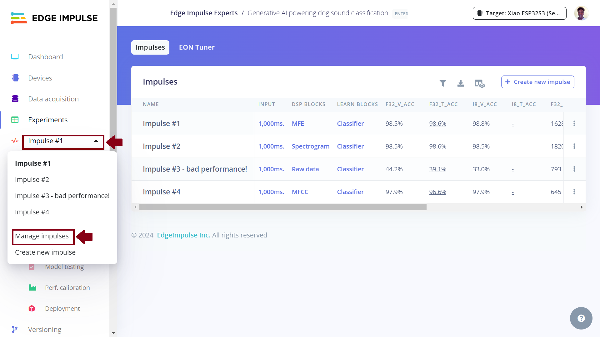

First, for the model input I used a window size of 1 second, window increase size of 500ms (milliseconds), frequency of 16,000Hz and enabled the "Zero-pad data" field so that samples less than 1 second will be filled with zeros. Since we are targeting deployment to a resource constrained device, one way of reducing the size of data being processed is by reducing the length of audio samples being taken. Next, we need to define the audio pre-processing method. This operation is important since it extracts the meaningful features from the raw audio files. These features are then used as inputs for the Machine Learning model. The preprocessing includes steps such as converting the audio files into a spectrogram, normalizing the audio, removing noise, and feature extraction. There are various pre-processing algorithms that are used for sound data, such as [Mel Frequency Cepstral Coefficients (MFCC)](https://docs.edgeimpulse.com/docs/edge-impulse-studio/processing-blocks/audio-mfcc), [Mel-filterbank energy (MFE)](https://docs.edgeimpulse.com/docs/edge-impulse-studio/processing-blocks/audio-mfe), [Spectrogram](https://docs.edgeimpulse.com/docs/edge-impulse-studio/processing-blocks/spectrogram), working with [raw data](https://docs.edgeimpulse.com/docs/edge-impulse-studio/processing-blocks/raw), and more. Choosing the best pre-processing algorithm in sound classification is essential because the quality and relevance of input features directly impact the model's ability to learn and classify sounds accurately. The learning block will be the same for this sound classification project but you can experiment with other pre-processing algorithms to identify the best performing.

On our Edge Impulse project, we create the first Impulse. In this case, I first used [MFE](https://docs.edgeimpulse.com/docs/edge-impulse-studio/processing-blocks/audio-mfe) as the processing block and Classification as the learning block. Similarly to the [Spectrogram](https://docs.edgeimpulse.com/docs/edge-impulse-studio/processing-blocks/spectrogram), the Audio MFE processing extracts time and frequency features from a signal. However this algorithm uses a non-linear scale in the frequency domain, called Mel-scale. It performs well on audio data, mostly for non-voice recognition use cases when sounds to be classified can be distinguished by human ear. After saving this configuration, we click the "Save Impulse" button.

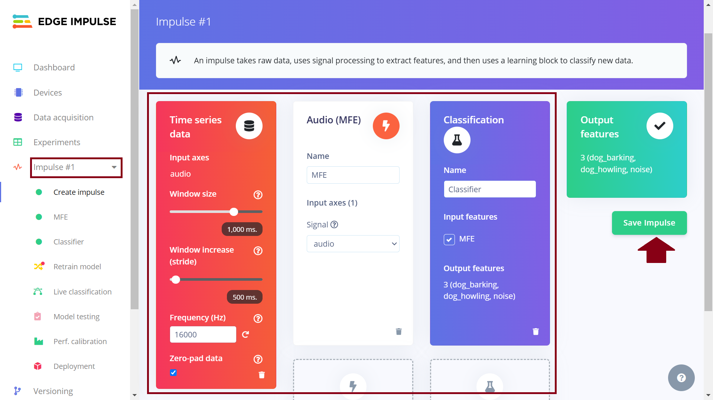

Next, we need to configure the processing block, MFE. Click "MFE" and we are presented with various parameters that we can set such as frame length, frame stride, filter number, FFT length, low frequency, high frequency and Noise floor (dB) for normalization. Selecting the appropriate parameters for configuring the digital signal processing (DSP) can be a troubling and time-consuming task, even for experienced digital signal processing engineers. To simplify this process, Edge Impulse supports [automatic autotuning](https://www.edgeimpulse.com/blog/introducing-wavelets-and-dsp-autotuning/) of the processing parameters. To ensure that I get the best pre-processing, I used this feature by clicking the "Autotune parameters" button. in this setup, we can reduce the inference time by changing the FFT length value to say 256.


By using the Autotune feature on Edge Impulse, the platform updated the processing block to use frame length of 0.025, frame stride of 0.01, filter number of 41, set the Lowest band edge of Mel filters (in Hz) to 80 and set the Noise floor (dB) as -91.

After configuring the processing parameters, we can generate features from the dataset. Still on the MFE page, we click the "Generate features" tab and finally the "Generate features" button. The features generation process will take some time depending on the size of the data. When this process is finished, the [Feature explorer](https://docs.edgeimpulse.com/docs/edge-impulse-studio/processing-blocks/feature-explorer) will plot the features. Note that features are the output of the processing block, and not the raw data itself. In our case, we can see that there is a good separation of the classes and this indicates that simpler Machine Learning (ML) models can be used with greater accuracy.

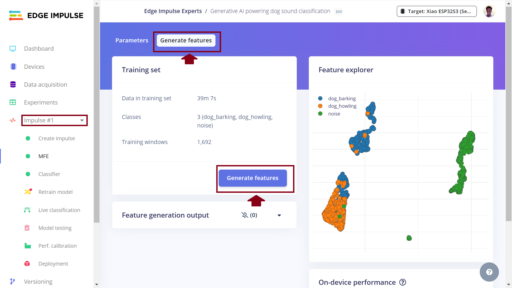

The last step is to train our model. We click "Classifier" which is our learning block that is using a Convolution Neural Network (CNN) model. After various experiments, I settled with 100 training cycles, a learning rate of 0.0005 and a 2D Convolution architecture. Finally, we can click the "Save & train" button to train our first model. After the training process was complete, the model had an accuracy of 98% and a loss of 0.04.

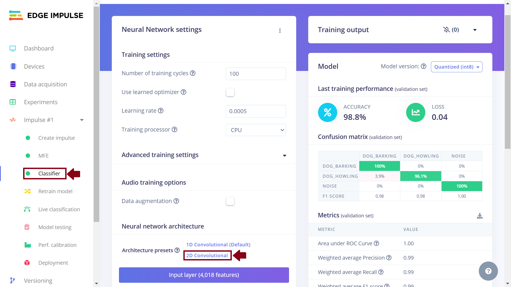

When training our model, we used 80% of the data in our dataset. The remaining 20% is used to test the accuracy of the model in classifying unseen data. We need to verify that our model has not overfit, by testing it on new data. To test our model, we first click "Model testing" then "Classify all". Our current model has an accuracy of 99%, which is pretty good!

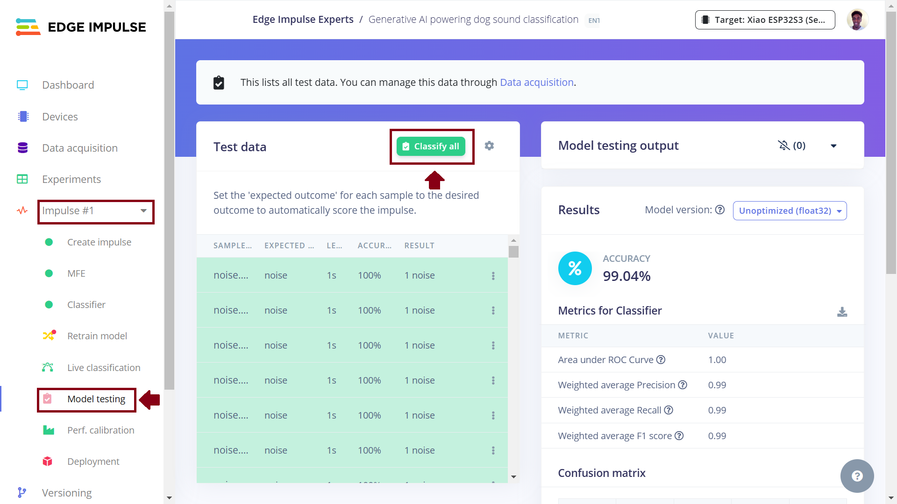

At last, we have a simple Machine Learning model that can detect dog sounds! However, how do we know if this configuration is the most effective? We can experiment with three other processing blocks: Spectrogram, raw data processing and MFCC. To be specific, the difference between the Impulses in this project is the processing block. To add another Impulse, we click the current Impulse (Impulse #1) followed by "Create new impulse".

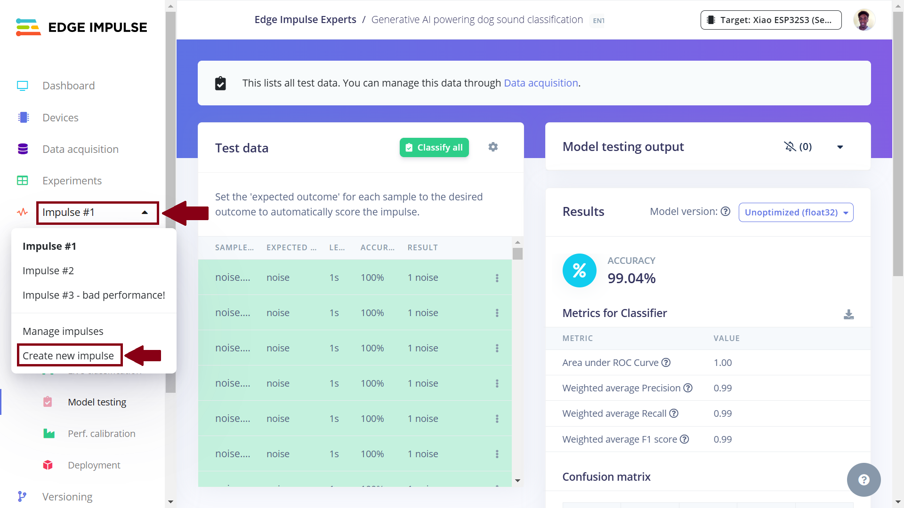

This will create a new Impulse instance. The steps to configure this Impulse are the same with the only difference being that we will select Spectrogram as the processing block. The [Spectrogram](https://docs.edgeimpulse.com/docs/edge-impulse-studio/processing-blocks/spectrogram) processing block extracts time and frequency features from a signal. It performs well on audio data for non-voice recognition use cases, or on any sensor data with continuous frequencies. Once this Impulse has been saved we will again use the Autotuning feature, generate features and train a neural network with the same configurations as the first Impulse. After this process was completed the features generated with Spectrogram were not as well separated as compared to MFE used in the first Impulse, specifically features for the dog barking and howling sounds. The model training accuracy was 98% and the loss was 0.15. Finally, after testing the model on unseen data, the performance was also impressive with 98% accuracy.


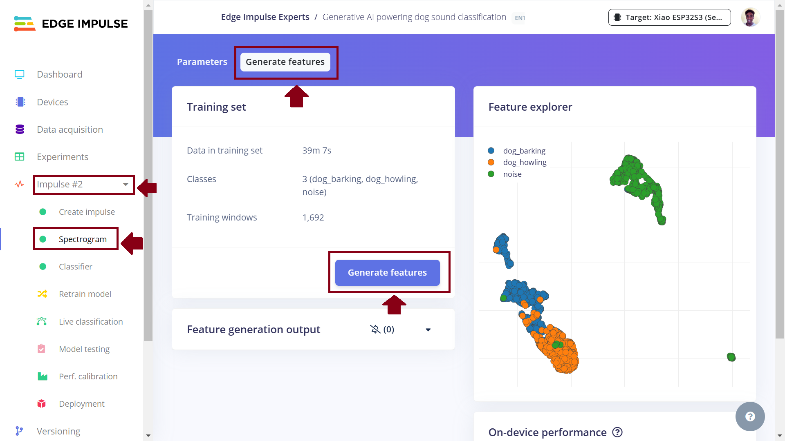

Next, I experimented with using the raw audio files as inputs to the model. The [Raw data](https://docs.edgeimpulse.com/docs/edge-impulse-studio/processing-blocks/raw) block generates windows from data samples without any specific signal processing. It is great for signals that have already been pre-processed and if you just need to feed your data into the Neural Network block.The steps to configure this Impulse are the same as the first two with the only difference being that we will select Raw data as the processing block and we will use dense layers for the neural network architecture. After this process was completed, on the Feature explorer we can see that the audio data are not separated as compared to the first two processing blocks. The model training accuracy was 33% and the loss was 12.48. After testing the model on unseen data, the performance was also poor with an accuracy of 39%.


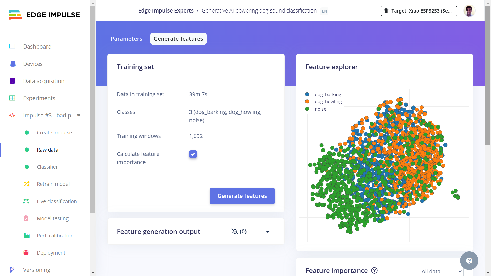

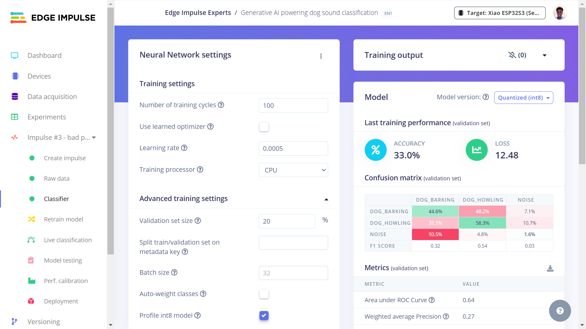

Finally, I experimented with using MFCC processing. The [MFCC](https://docs.edgeimpulse.com/docs/edge-impulse-studio/processing-blocks/audio-mfcc) processing block extracts coefficients from an audio signal. Similarly to the Audio MFE block, it uses a non-linear scale called Mel-scale. It is the reference block for speech recognition but I also wanted to experiment it on non-human voice use cases. The steps to configure this Impulse are the same as the first three with the only difference being that we will select Audio (MFCC) as the processing block. After this process was completed, on the Feature explorer we can see that the audio data are separated but not well as compared to MFE and Spectrogram pre-processing. The training accuracy was 97% and the loss was 0.06. Testing the model on unseen data, the performance was again impressive with an accuracy of 96%.


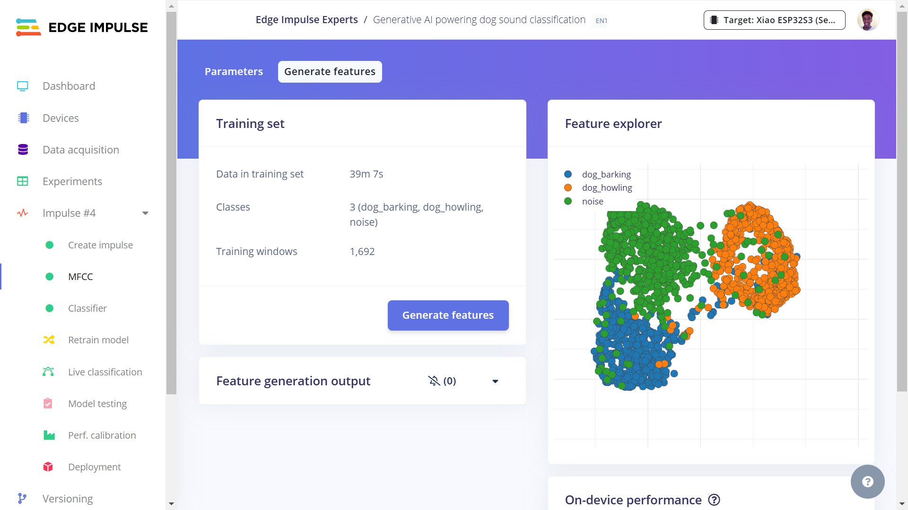

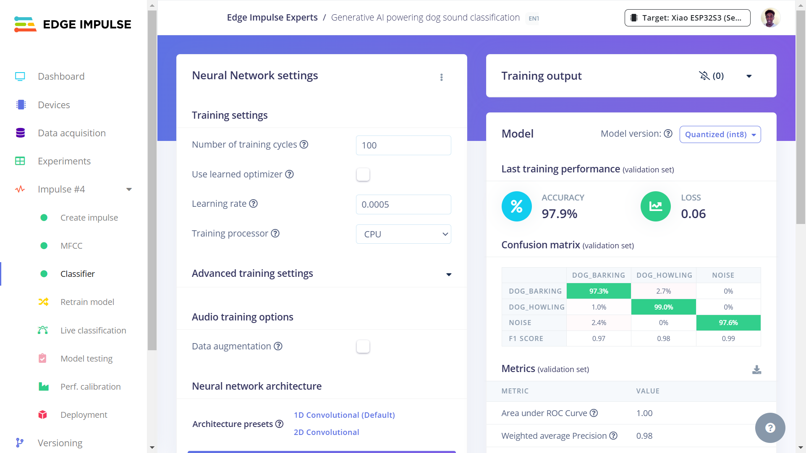

## Deploying the Impulses to XIAO ESP32S3

In this project, we now have four Impulses. The Experiments feature not only allows us to setup different Machine Learning processes, but it also allows us to deploy any Impulse. The MFE, Spectrogram and MFCC Impulses seem to perform well according to the model training and testing. I decided to skip deploying the Raw data Impulse since using raw data as the model input does not seem to yield good performance in this use case.

Edge Impulse [have documented](https://docs.edgeimpulse.com/docs/edge-ai-hardware/mcu/seeed-xiao-esp32s3-sense) how to use the XIAO ESP32S3. We will deploy an Impulse as an [Arduino library](https://docs.edgeimpulse.com/docs/run-inference/arduino-library) - a single package containing the signal processing blocks, configuration and learning blocks. You can include this package (Arduino library) in your own sketches to run the Impulse locally on microcontrollers.

To deploy the first Impulse to the XIAO ESP32S3 board, first we ensure that it is the current Impulse and then click "Deployment". In the field "Search deployment options" we need to select Arduino library. Since memory and CPU clock rate are limited for our deployment, we can optimize the model so that it can utilize the available resources on the ESP32S3 (or simply, so that it can fit and manage to run on the ESP32S3). [Model optimization](https://www.edgeimpulse.com/blog/better-insight-in-model-optimizations/) often has a trade-off whereby we decide whether to trade model accuracy for improved performance, or reduce the model's memory (RAM) usage. Edge Impulse has made model optimization very easy with just a click. Currently we can get two optimizations: EON compiler (gives the same accuracy but uses 27% less RAM and 42% less ROM) and TensorFlow Lite. The [Edge Optimized Neural (EON) compiler](https://docs.edgeimpulse.com/docs/edge-impulse-studio/deployment/eon-compiler) is a powerful tool, included in Edge Impulse, that compiles machine learning models into highly efficient and hardware-optimized C++ source code. It supports a wide variety of neural networks trained in TensorFlow or PyTorch - and a large selection of classical ML models trained in scikit-learn, LightGBM or XGBoost. The EON Compiler also runs far more models than other inferencing engines, while saving up to 65% of RAM usage. TensorFlow Lite (TFLite) is an open-source machine learning framework that optimizes models for performance and efficiency, making them to be able to run on resource constrained devices. To enable model optimizations, I selected the EON Compiler and Quantized (int8).


Next, we need to add the downloaded .zip library to Arduino IDE and utilize the `esp32_microphone` example code. The deployment steps are also documented on the XIAO ESP32S3 [deployment tutorial](https://wiki.seeedstudio.com/xiao_esp32s3_keyword_spotting/#deploying-to-xiao-esp32s3-sense). Once we open the `esp32_microphone` sketch, we need to change the I2S library, update the microphone functions, and enable the ESP NN accelerator as described by MJRoBot (Marcelo Rovai) in [Step 6](https://wiki.seeedstudio.com/xiao_esp32s3_keyword_spotting/#deploying-to-xiao-esp32s3-sense). You can also obtain the complete updated code in this [GitHub repository](https://github.com/SolomonGithu/tinyml_dog_bark_and_howl_classification/blob/main/XIAO_ESP32S3_EI_dog_sound_classification/XIAO_ESP32S3_EI_dog_sound_classification.ino). Before uploading the code, we can follow the [Seeed Studio documentation](https://wiki.seeedstudio.com/xiao_esp32s3_getting_started/#software-preparation) to download the ESP32 board on the Arduino IDE and then select the XIAO ESP32S3 board for uploading. With the XIAO ESP32S3 board still connected to the computer, we can open the Serial Monitor and see the inference results. We can see that the Digital Signal Processing (DSP) takes around 475ms (milliseconds) and the model takes around 90ms to classify the sound - which is very impressive. However, when I played YouTube videos of dog sound in front of the XIAO ESP32S3, like [this one](https://youtu.be/01le4Ln8da0?si=Ozwf-3eCMJA9Tex6), the model did not correctly classify dog barks and we can see most of the confidence was on noise. Although this appears to be an issue, it may actually stem from the difference in sound quality between training and inference - the test using synthetic data performed well but deployment performance was not the same. In this case, the sounds captured during inference have noise, the volume of dog sounds is different, and overall the recordings are not clear as compared to the dataset samples.

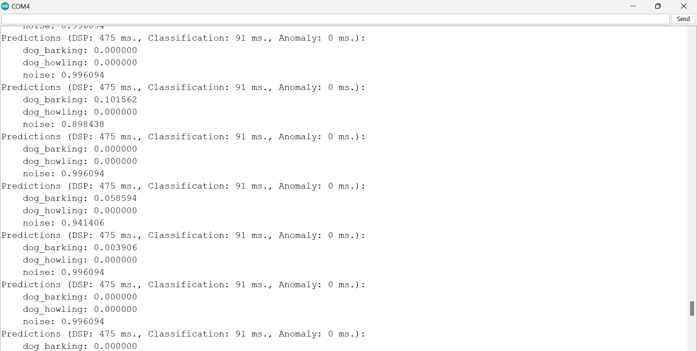

We can then deploy the second Impulse which uses the Spectrogram pre-processing algorithm. The steps for the deployment are similar - we select Arduino library, enable EON compiler, select Quantized (int8) and download the Arduino library. To speed up compilation and use cached files in the Arduino IDE, we can simply unzip the second Impulse Arduino library and copy over the ```model-parameters``` and ```tflite-model``` folders to the first Impulse's Arduino library folder, overwriting the existing files with the updated model parameters. Unfortunately, the model is not able to run on the ESP32S3 board and we get an error ```failed to allocate tensor arena```. This error means that we have run out of RAM on the ESP32S3. 

Lastly, I experimented with deploying the MFCC Impulse. This algorithm works best for speech recognition but the model training and testing show that it performs well for detecting dog sounds. Following similar steps, I deployed the fourth Impulse using the EON Compiler and Quantized (int8) model optimizations. Surprisingly, this Impulse (using the MFCC processing algorithm) delivers the best performance even compared to the MFE pre-processing block. The Digital Signal Processing (DSP) takes approximately 285ms, with classification taking about 15ms. For detecting dog sounds, this Impulse accurately identifies with great confidence, demonstrating the positive impact of a DSP block on model performance!

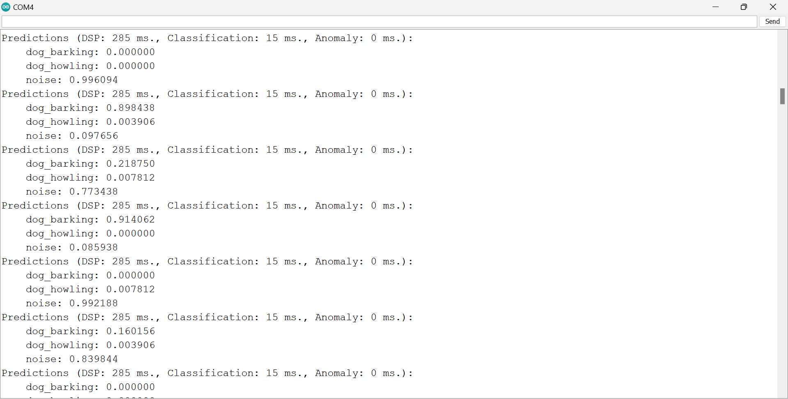

Based on the experiments, I chose to continue with the fourth Impulse due to its accuracy and reduced latency.

## Assembling the Wearable

A solid gadget needs a solid case! We are close, so its time to put our wearable together.

The wearable's components can be categorized into two parts: the electronic components and the 3D printed components. The 3D printed component files can be downloaded from [printables.com](https://www.printables.com/model/1058035-seeed-studio-xiao-esp32s3-sense-wearable-case). The wearable has a casing which is made up of two components: one holds the electrical components while the other is a cover. I 3D printed the housing and cover with PLA material.

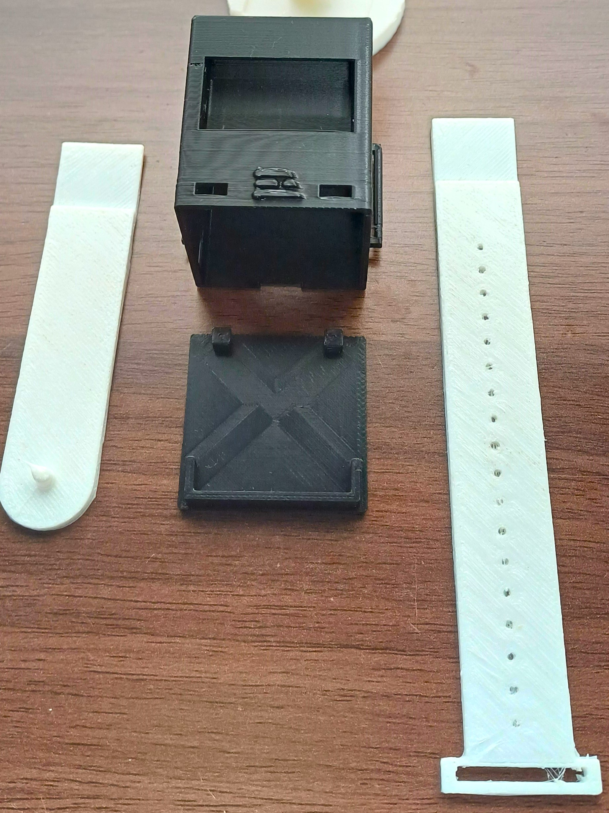

The other 3D printed components are two flexible wrist straps. These are similar to the ones found on watches. I achieved the flexibility by printing them with TPU material. Note that if you do not have a good 3D printer you may need to widen the strap's holes after printing. I used super glue to attach the wrist straps to the case. Always be careful when handling glues!


A cool part is the wearable's dock/stand. This component is not important to the wearable's functionality, but a device's dock/stand is just always cool! It keeps your device in place, adds style to your space, and saves you from the fear of your device being tangled in cables.

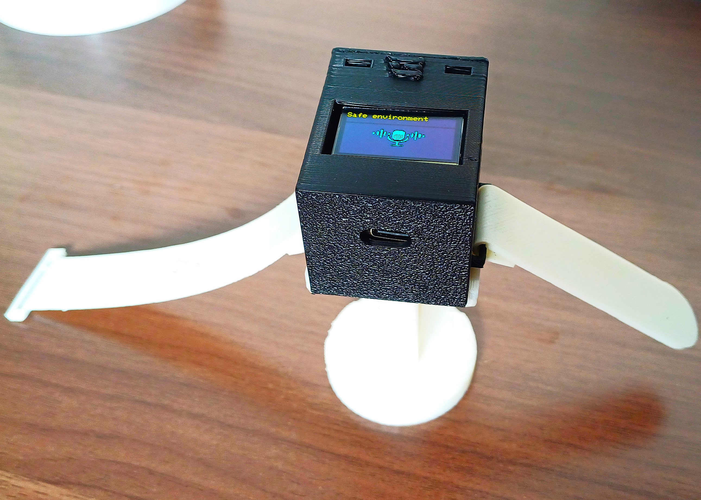

The wearable's electronic components include:
- Seeed Studio XIAO ESP32S3 (Sense) development board with the camera detached
- SSD1306 OLED display
- 3.7V lithium battery. In my case, I used a 500mAh battery.
- Some jumper wires and male header pins

The XIAO ESP32S3 board has a LiPo battery connector copper pads that we can use to solder wires for the battery connection. Note that the negative terminal of the power supply is the copper pad closest to the USB port, and the positive terminal of the power supply is the copper pad further away from the USB port.


The next task is to solder female jumper wires to the XIAO ESP32S3 I2C and power pins. These wires will then be connected to the SSD1306 OLED display. I chose to solder the wires directly to the board instead of using jumper wires on the board's pins since this will make the design more compact and reduce the height of the wearable. The pin list of the XIAO ESP32S3 board can be found [in the Seeed documentation](https://wiki.seeedstudio.com/xiao_esp32s3_getting_started/#hardware-overview).

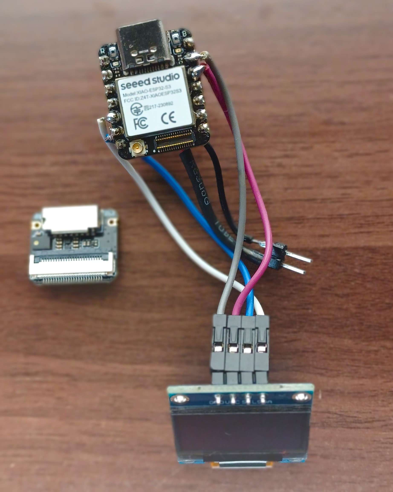

Once the electronic parts have been assembled, they can be put in the wearable's case according to the layout in the image below. Side vents on the case allow the onboard digital microphone to capture surrounding sounds effectively and they also help cool the ESP32S3.

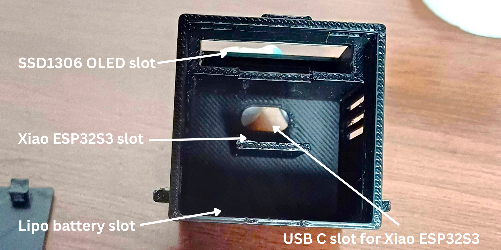

Below is an image of my wearable after assembling the components.

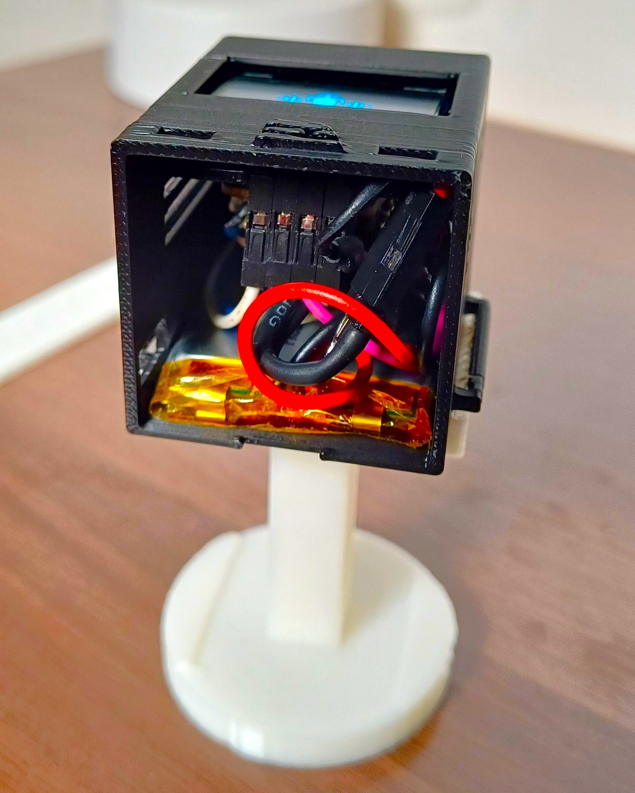

After assembling the wearable, we can connect to the XIAO ESP32S3 board using the USB-C slot on the case to program it, and charge the LiPo battery! We can get the inference code from this GitHub repository [tinyml_dog_bark_and_howl_classification](https://github.com/SolomonGithu/tinyml_dog_bark_and_howl_classification/blob/main/XIAO_ESP32S3_EI_dog_sound_classification/XIAO_ESP32S3_EI_dog_sound_classification.ino). This Arduino sketch loads the model and runs continuous inference while printing the results via Serial. After a successful run of the inference code, I updated the code and added further processing of the inference results to display images on the OLED according to the predicted class with the highest confidence. This updated code can also be found in the GitHub repository: [XIAO_ESP32S3_EI_dog_sound_classification_OLED_display](https://github.com/SolomonGithu/tinyml_dog_bark_and_howl_classification/blob/main/XIAO_ESP32S3_EI_dog_sound_classification_OLED_display/XIAO_ESP32S3_EI_dog_sound_classification_OLED_display.ino).


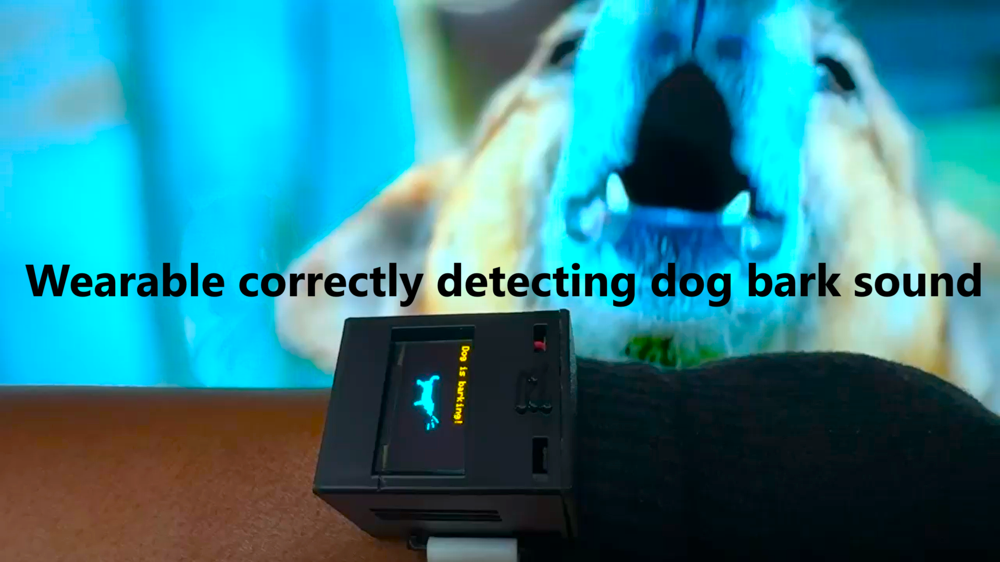

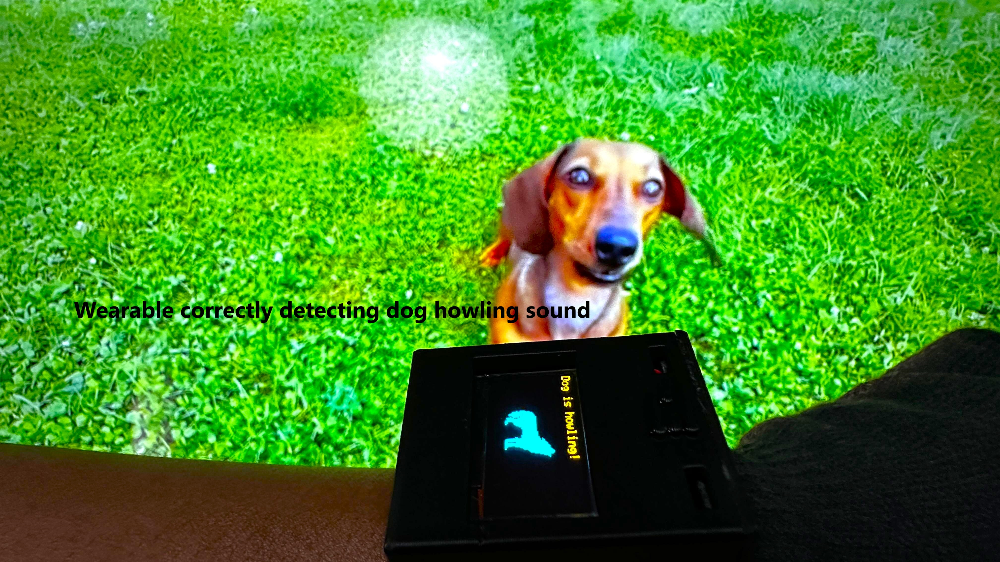

## Result

At last, our dog sound detection wearable is ready. We have successfully trained, tested, optimized, and deployed a Machine Learning model on the XIAO ESP32S3 Sense board. Once the wearable is powered on, the ESP32S3 board continuously samples sound of 1 second and predicts if it has heard dog sounds or noise. Note that since there is a latency of around 300 milliseconds (285ms for Digital Signal Processing and 15ms for classification) between the sampling and inference results. Some sounds may not be captured in time since other processes of the [program](https://github.com/SolomonGithu/tinyml_dog_bark_and_howl_classification/blob/main/XIAO_ESP32S3_EI_dog_sound_classification_OLED_display/XIAO_ESP32S3_EI_dog_sound_classification_OLED_display.ino) will be executed. In this case, to achieve a smaller latency, we can target another hardware, such as the [Syntiant TinyML board](https://docs.edgeimpulse.com/docs/edge-ai-hardware/mcu-+-ai-accelerators/syntiant-tinyml-board) which features an always-on sensor and speech recognition processor, the [NDP101](https://www.syntiant.com/ndp101).

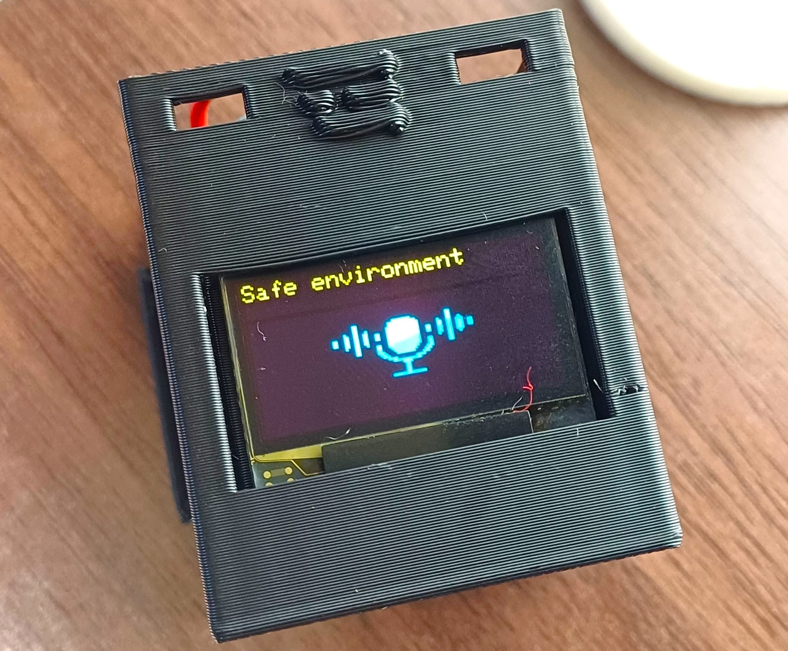

To test the wearable, I used a television to play YouTube videos of construction sites and dog sounds. At first, I was expecting the model to not perform well since the YouTube playback sounds were not the same as the sounds that were generated by ElevenLabs. In Machine Learning, we target to train the model on a dataset that is the same representation of what it will be seeing during deployment. However, the model, and using the MFCC algorithm, performed well and it was able to accurately detect dog sounds, though sometimes barks were classified as howls and vice versa.

Let’s now put on our safety hats, or get packages to deliver, and put the TinyML wearable to test.



## Conclusion

This low cost and low-power environmental sensing wearable is one of the many solutions that embedded AI has to offer. The presence of security dogs provides a sense of security and an unmatched source of environment state feedback to us humans. However, there is a great need to also understand how these intelligent animals operate so that we can understand and treat them better. The task at hand was very complicated, to capture sounds without causing disturbance to dogs, train a dog sound detection model, and optimize the model to run on a microcontroller. However, by utilizing the upcoming technologies of synthetic data generation and powerful tools offered by the Edge Impulse platform; we have managed to train and deploy a custom Machine Learning model that can help workers.

The new Experiments feature of Edge Impulse is a powerful tool and it comes in very handy in the Machine Learning development cycle. There are numerous configurations that we can utilize to make the model more accurate and reduce hardware utilization on edge devices. In my experiments, I tried other configuration combinations and chose to present the best and worst performing ones in this documentation. Are you tired of trying out various Impulse configurations and deployment experimentation? Well, Edge Impulse offers yet another powerful tool, the [EON Tuner](https://docs.edgeimpulse.com/docs/edge-impulse-studio/eon-tuner). This tool helps you find and select the best embedded machine learning model for your application within the constraints of your target device. The EON Tuner analyzes your input data, potential signal processing blocks, and neural network architectures - and gives you an overview of possible model architectures that will fit your chosen device's latency and memory requirements. First, make sure you have data in your Edge Impulse project. Next, select the "Experiments" tab and finally the "EON Tuner" tab. On the page, configure your target device and your application budget, and then click the "New run" button.

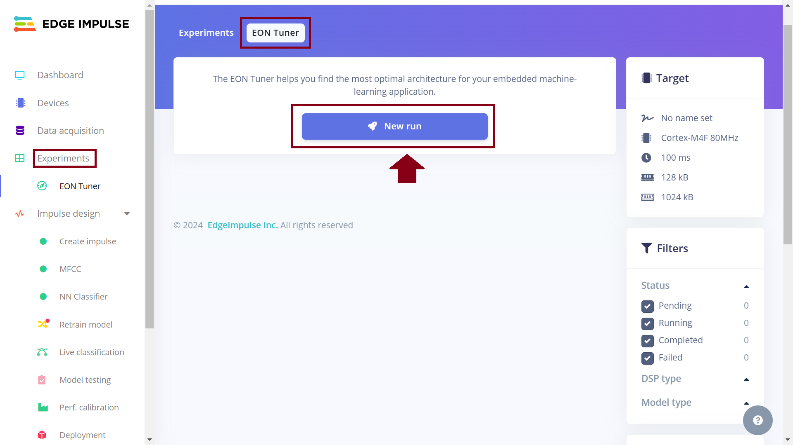

You can find the public Edge Impulse project here: [Generative AI powering dog sound classification](https://studio.edgeimpulse.com/public/497492/latest). This [GitHub repository](https://github.com/SolomonGithu/tinyml_dog_bark_and_howl_classification) includes the deployed Edge Impulse library together with inference code and OLED usage functions. A future work on this project would be to include other alert features such as sending SMS messages or including a vibration motor such that the wearable can vibrate when dog sounds are detected. This vibration can then be felt by the user, in case of headphone or earplug usage in certain situations or environments.


