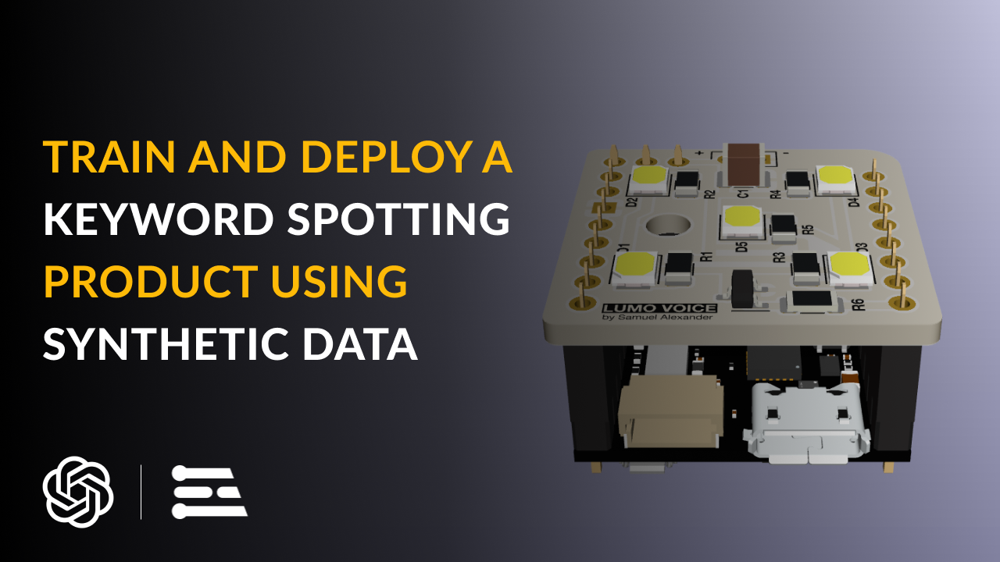
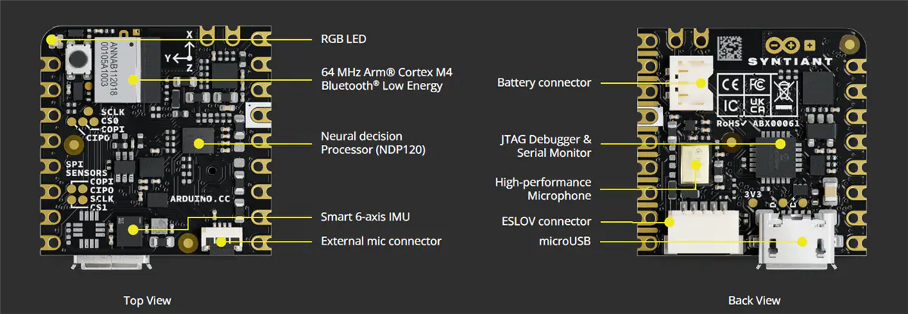
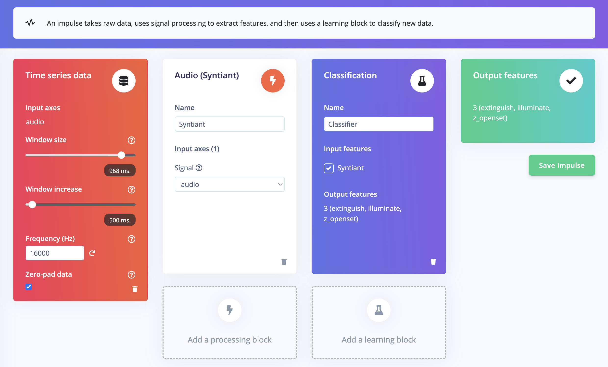
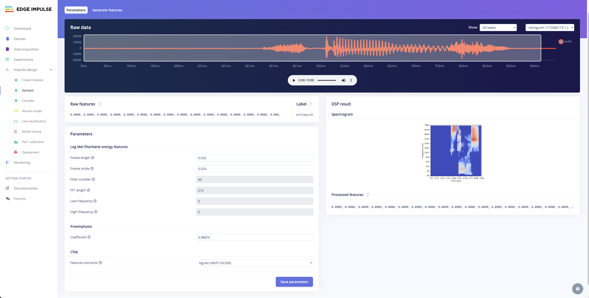
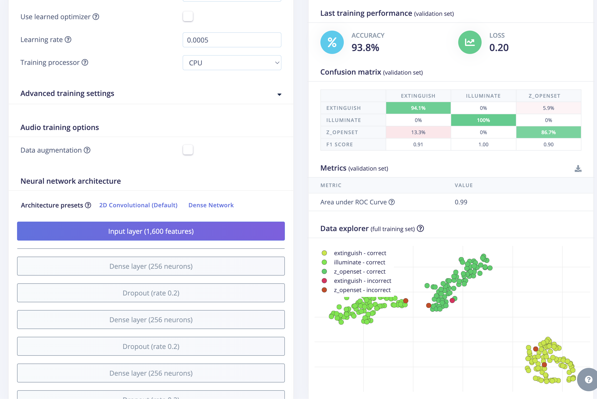
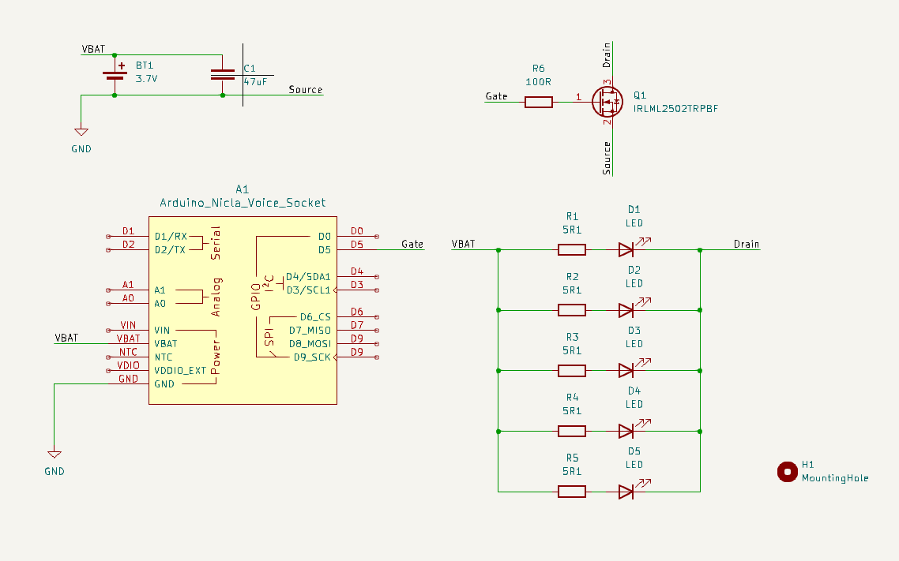

# Developing a Voice-Activated Product with Edge Impulse's Synthetic Data Pipeline

Created By: Samuel Alexander

Public Project Link: [https://studio.edgeimpulse.com/public/379737/live](https://studio.edgeimpulse.com/public/379737/live)

GitHub Project Link: [https://github.com/SamuelAlexander/KWS-lumovoice-edge-impulse/tree/main](https://github.com/SamuelAlexander/KWS-lumovoice-edge-impulse/tree/main)

## Introduction

In the era of smart devices and voice-controlled technology, developing effective keyword spotting (KWS) systems is crucial for enhancing user experience and interaction. This documentation provides a comprehensive guide for creating a portable LED product with KWS capabilities, using Edge Impulse's end-to-end synthetic data pipeline. Synthetic voice/speech data, generated artificially rather than collected from real-world recordings, offers a scalable and cost-effective solution for training machine learning models. By leveraging AI text-to-speech technologies, we can create diverse and high-quality datasets tailored specifically for our KWS applications. This guide not only serves as a blueprint for building a responsive LED product but also lays the groundwork for a wide range of voice-activated devices, such as cameras that start recording on command, alarms that snooze with a keyword, or garage doors that respond to voice prompts.

## Problem Exploration

Traditional methods of training keyword spotting models often rely on extensive datasets of human speech, which can be time-consuming and expensive to collect. Moreover, ensuring diversity and representation in these datasets can be challenging, leading to models that may not perform well across different accents, languages, and speaking environments. Synthetic data addresses these challenges by providing a controlled and flexible means of generating speech data. Using AI text-to-speech technology, we can produce vast amounts of speech data with varied voices, tones, and inflections, all tailored to the specific keywords we want our models to detect.

This approach opens up numerous possibilities for product development. For instance, a smart LED light can be designed to turn on or off in response to specific voice commands, enhancing convenience and accessibility. A camera can be programmed to start recording or take a group photo when a designated keyword is spoken, making it easier to capture moments without physical interaction. Similarly, an alarm system can be configured to snooze with a simple voice command, streamlining the user experience. By utilizing synthetic data, developers can create robust and versatile KWS models that power these innovative applications, ultimately leading to more intuitive and responsive smart devices.

## Project Overview

This project outlines the creation of a keyword spotting (KWS) product using Edge Impulse's synthetic data pipeline. The process involves generating synthetic voice data with OpenAI's Whisper text-to-speech model via Edge Impulse Studio and training the KWS model using Syntiant's audio processing blocks for the NDP120 on the Arduino Nicla Voice. The phrase 'illuminate' and 'extinguish' will be generated and used for training the model.

After training, the model is deployed onto the Arduino Nicla Voice hardware. A custom PCB and casing are designed to incorporate LED lights and power circuitry, ensuring portability and ease of use. This guide serves as a practical resource for developers looking to implement KWS functionality in voice-activated devices, demonstrating the efficiency of synthetic data in creating responsive and versatile products.

### Hardware selection: Arduino Nicla Voice

The Arduino Nicla Voice is an ideal choice for this project due to its use of the Syntiant NDP120, which offers great power efficiency for always-on listening. This efficiency allows the NDP120 to continuously monitor for keywords while consuming minimal power, making it perfect for battery-powered applications. Upon detecting a keyword, the NDP120 can notify the secondary microcontroller, Nordic Semiconductor nRF52832, which can then be programmed to control the lighting system. The compact size of the Nicla Voice also makes it easy to integrate into a small case with a battery. Furthermore, the Nicla Voice's standardized footprint simplifies the prototyping process, allowing for the easy creation of a custom PCB module with LED circuitry that can be easily connected.

## Hardware Requirements

* Arduino Nicla Voice (or other Edge Impulse supported MCU with mic)
* PCB and SMD components (parts breakdown explained later)

## Software Requirements

* Edge Impulse CLI
* Arduino IDE
* OpenAI API account

## Dataset Collection

### Creating an OpenAI API Secret Key

To create an OpenAI API secret key, start by visiting the [OpenAI website](https://www.openai.com/). If you don't have an account, sign up; otherwise, log in. Once logged in, navigate to the API section by clicking on your profile icon or the navigation menu and selecting "API" or "API Keys." In the API section, click on "Create New Key" or a similar button to generate a new API key. You may be prompted to name your API key for easy identification. After naming it, generate the key and it will be displayed to you. Copy the key immediately and store it securely, as it might not be visible again once you navigate away from the page.

You can now use this API key in your applications to authenticate and access OpenAI services, for this project we will use the API key for generating synthetic voice data via Edge Impulse's transformation blocks. Ensure you keep your API key secret and do not expose it in client-side code or public repositories. You can manage your keys (regenerate, delete, or rename) in the API section of your OpenAI account. For more detailed instructions or troubleshooting, refer to the [OpenAI API documentation](https://beta.openai.com/docs/) or the help section on the OpenAI website.

Once you have your secret key, you can navigate to your Edge Impulse organization page and enter your API key. Please also note that this Text to Speech Data Generation feature is only available for Edge Impulse Enterprise accounts.

### Generating TTS Synthetic Data

Now that we have the environment configured, and our OpenAI API saved in the Edge Impulse Studio, we are ready to start a new project and begin generating some synthetic voice data.

On your project's page select Data acquisition --> Data sources --> + Add new data source --> Transformation block --> Whisper Synthetic Voice Generator --> Fill out the details as follow:

**Phrase: illuminate**

We need to generate speech for the words "_illuminate_" and "_extinguish_", we can start with illuminate for this 'action' first and then set up another data source 'action' for extinguish after we finish configuring this one.

**Label: illuminate**

Match the label name to the voice sample we want to generate.

**Number of samples: 10**

We can start with generating 10 samples to test creating this action, if everything works feel free to generate an action that generates more than 10 samples. Once created you can also run the action multiple times.

**Voice: random**

We want to create diversity of voice and accent in our dataset, so choose random.

**Model: tts-1**

I tested tts-1 and tts-1-hd, I think the quality difference is negligible for this case, but feel free to select either one. Note that tts-1-hd will cost you more OpenAI credits.

**Speed: 0.6, 0.7, 0.8, 0.9, 1.0, 1.1, 1.2**

We want to vary the speed of the voice pronouncing the word we want to generate. 0.6 means 60% of its original speed, and 0.6 - 1.2 should give enough range.

Now you can run the action. If successful, the tts voice generation should begin and it may take a few minutes to complete. If the job failed you should be notified and you can recheck if the API key is entered correctly, then you can retry again.

Once satisfied with all the data generated, perform a Train / Test split into approximately 80/20 ratio.

## Impulse Design

The Impulse design values are chosen for optimal keyword spotting performance. The 968 ms window size captures enough audio for accurate detection, while the 500 ms window increase balances responsiveness and efficiency. The 16000 Hz frequency is standard for capturing human voice, ensuring quality without excessive data. Using the Audio (Syntiant) block leverages the NDP120's capabilities for efficient digital signal processing. The Classification block distinguishes between commands, with output classes "extinguish," "illuminate," and "z\_openset" allowing for control of the lighting system and handling unknown inputs.

* Window size: 968 ms
* Window increase: 500 ms
* Frequency: 16000 Hz
* Audio (Syntiant)
* Classification
* Output: extinguish, illuminate, z\_openset

Under Classifier, set the learning rate to 0.0005 and change the architecture preset to use **Dense Network**.

Our audio classifier gives in accuracy of 93.8% which is satisfactory. We can continue tuning the hyperparameters and try using some data augmentation, but for the purpose of this demonstration we are satisfied with the current result and can move to the deployment phase.

## Deployment

Now the AI model is ready to be deployed to the Arduino Nicla Voice. Let's select the Arduino Nicla Voice deployment.

After building our model, we'll get the new firmware. Follow this guide for more detail on how to flash the audio firmware: [https://docs.edgeimpulse.com/docs/edge-ai-hardware/mcu-+-ai-accelerators/arduino-nicla-voice](https://docs.edgeimpulse.com/docs/edge-ai-hardware/mcu-+-ai-accelerators/arduino-nicla-voice)

Please note that we want to flash the firmware that you have just built, instead of the default audio firmware for the Nicla Voice's NDP120.

Once we have flashed the firmware, we can upload the Arduino code using the Arduino IDE. You can find the code on my GitHub repository here: [https://github.com/SamuelAlexander/KWS-lumovoice-edge-impulse/tree/main](https://github.com/SamuelAlexander/KWS-lumovoice-edge-impulse/tree/main)

Once the code is uploaded you can verify if everything works by saying out loud the words 'Illuminate' and 'Extinguish'. When the keyword 'Illuminate' is detected, the blue built-in led will blink and when the keyword 'Extinguish' is detected, the red built-in led will blink.

Next we will design and manufacture the PCB socket which holds the LED and power circuitry which can turn on when 'Illuminate' is detected and turn off when 'Extinguish' is detected.

## Designing and Building the KWS Product

The schematic and PCB is designed using KiCAD. A single sided aluminum PCB is selected for this project due to its excellent thermal conductivity, which helps dissipate heat generated by the LEDs and other components, ensuring reliable performance and longevity. The design of this PCB is simple enough to make it possible to route using one side only.

The schematic, pcb, and gerber (manufacturing) files are accessible in the project's github page.

| LCSC Part Number | Manufacture Part Number                                   | Manufacturer                               | Package | Description                                                                                                         | Order Qty. | Unit Price($) | Order Price($) |
| ---------------- | --------------------------------------------------------- | ------------------------------------------ | ------- | ------------------------------------------------------------------------------------------------------------------- | ---------- | ------------- | -------------- |
| C176224          | QR1206F5R10P05Z                                           | Ever Ohms Tech                             | 1206    | 250mW Thick Film Resistors 200V ą1% ą400ppm/? 5.1? 1206 Chip Resistor - Surface Mount ROHS                          | 50         | 0.0156        | 0.78           |
| C516126          | HL-AM-2835H421W-S1-08-HR5(R9) (2800K-3100K)(SDCM<6,R9>50) | HONGLITRONIC(Hongli Zhihui (HONGLITRONIC)) | SMD2835 | 60mA 3000K Foggy yellow lens -40?\~+85? Positive Stick White 120° 306mW 3.4V SMD2835 LED Indication - Discrete ROHS | 50         | 0.0144        | 0.72           |
| C2589            | IRLML2502TRPBF                                            | Infineon Technologies                      | SOT-23  | 20V 4.2A 1.25W 45m?@4.5V,4.2A 1.2V@250uA 1 N-Channel SOT-23 MOSFETs ROHS                                            | 5          | 0.1838        | 0.92           |
| C5440143         | CS3225X7R476K160NRL                                       | Samwha Capacitor                           | 1210    | 16V 47uF X7R ą10% 1210 Multilayer Ceramic Capacitors MLCC - SMD/SMT ROHS                                            | 5          | 0.0765        | 0.38           |
| C153338          | FCR1206J100RP05Z                                          | Ever Ohms Tech                             | 1206    | 250mW Safety Resistor 200V ą5% 100? 1206 Chip Resistor - Surface Mount ROHS                                         | 10         | 0.0541        | 0.54           |

## Conclusion

Synthetic data has demonstrated its value in the development of voice-activated products like Lumo Voice. Its customizable nature allows for the inclusion of diverse accents, languages, tones, and inflections, resulting in robust keyword spotting models that perform well across different speaking styles. Unlike traditional data collection, which requires gathering numerous samples from various individuals, synthetic data offers a more efficient and scalable approach, enabling the rapid generation of high-quality datasets tailored to specific needs. This flexibility, combined with Edge Impulse's incredible streamlined workflow, has made it easier than ever to build and deploy small, efficient models on edge devices. With Edge Impulse, we could quickly generate synthetic data, train, and optimize our models, making it a powerful tool for creating responsive and versatile voice-controlled devices like Lumo Voice.
