# Vandalism Detection via Audio Classification

Created By: Nekhil R.

Public Project Link: [https://studio.edgeimpulse.com/public/149095/latest](https://studio.edgeimpulse.com/public/149095/latest)

GitHub Repository: [https://github.com/CodersCafeTech/Vandalism-Detection](https://github.com/CodersCafeTech/Vandalism-Detection)

## Project Demo



## Story

The direct annual cost of vandalism runs in the billions of dollars annually in the United States alone. Breaking glass and defacing property are some of the serious forms of vandalism. Conventional security techniques such as direct lighting and intruder alarms can be ineffective in so locations and cases, so here we explore another form of prevention. In this project, we are able to detect the sound of glass breaking, and can alert a user instantly about the event.

In this project, we only focus on glass breaking, however, this project can be applied to any other form of vandalism that also produces a unique sound.

## How Does It Work

The device will work as follows. Suppose a vandal tried to break glass, which will of course have a unique sound. The tinyML model running on the device can recognize the event using a microphone. Then the device will send email notifications to a registered user regarding the audio detection.

## Hardware

### Arduino Nano 33 BLE Sense

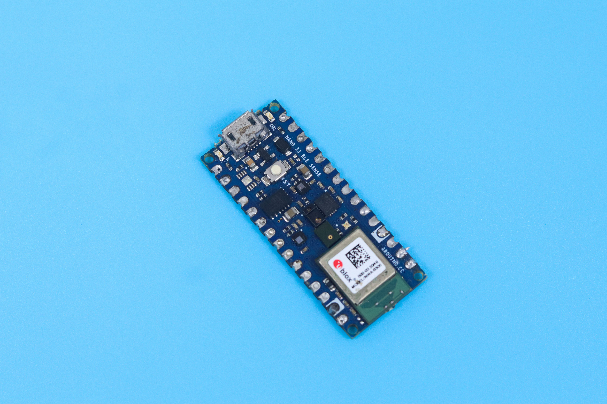

For this project we are using an Arduino Nano 33 BLE Sense. It's a 3.3V AI-enabled board in a very small form factor. It comes with a series of embedded sensors including an MP34DT05 Digital Microphone.

### ESP-01

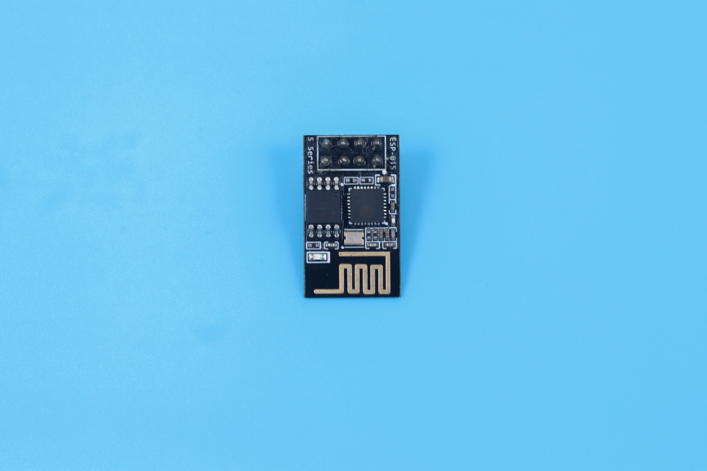

The ESP-01 is used for adding WiFi capability to the device, because the Arduino Nano 33 BLE Sense does not have any native WiFi capability. The WiFi is specifically used for sending email alerts. Serial communication is established between the Arduino and ESP-01, for transmitting the email.

## Software

## Data Acquisition

One of the most important parts of any machine learning model is its dataset. Edge Impulse offers us two options to create our dataset: either direct uploading of files, or recording data from actual the device itself. For this project we chose to record data with the device itself, because as a prototype, the data will be limited. A second reason to record data with the device itself is that it can improve accuracy. To get started connecting the Nano 33 BLE Sense to Edge Impulse, you can have a look at this [tutorial](https://docs.edgeimpulse.com/docs/development-platforms/officially-supported-mcu-targets/arduino-nano-33-ble-sense).

In this scenario, we have only two classes **Glass Break**, and **Noise**. Glass breaking sounds that we have used are from the vivid online resources and the major noise datasets are from the **Microsoft Scalable Noisy Speech Dataset (MS-SNSD)**. We also included the natural noise in the room, apart from the **MS-SNSD** data.

The sound recording was done for **20** seconds at a **16KHz** sampling rate. Something to keep in mind is that you must keep the sampling rate the same between your training dataset and your deployment device. If you are training with **44.1Khz** sound, you need to downsample it to 16KHz when you are ready to deploy to the Arduino.

We collected around 10 minutes of data and split it between Training and a Test set. In the Training data we split the samples to **2s**, otherwise the inferencing will fail because the BLE Sense has a limited amount of memory to handle the data.

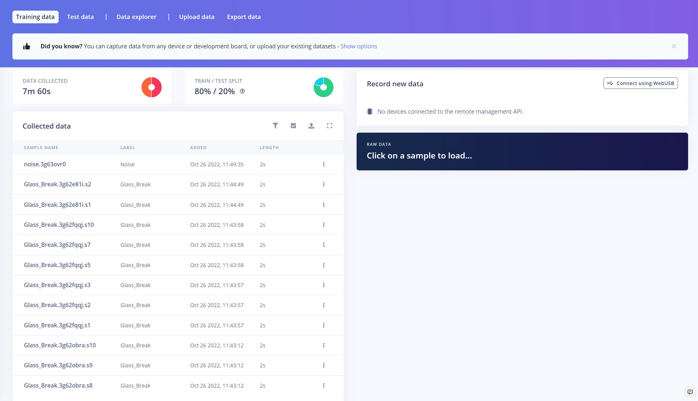

## Impulse Design

This is our Impulse, which is the machine learning pipeline termed by Edge Impulse.

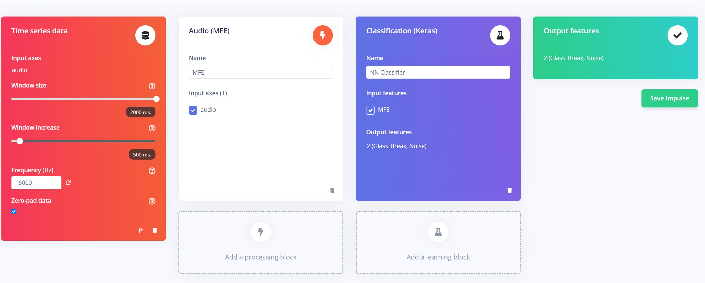

Here we used **MFE** as the processing block, because it is very suitable for non-human voices. We have used the default parameters of the MFE block.

## Neural Network

These are our Neural Network settings, which we found most suitable for our data. If you are tinkering with your own dataset, you might need to change these parameters a bit, and some exploration and testing could be required.

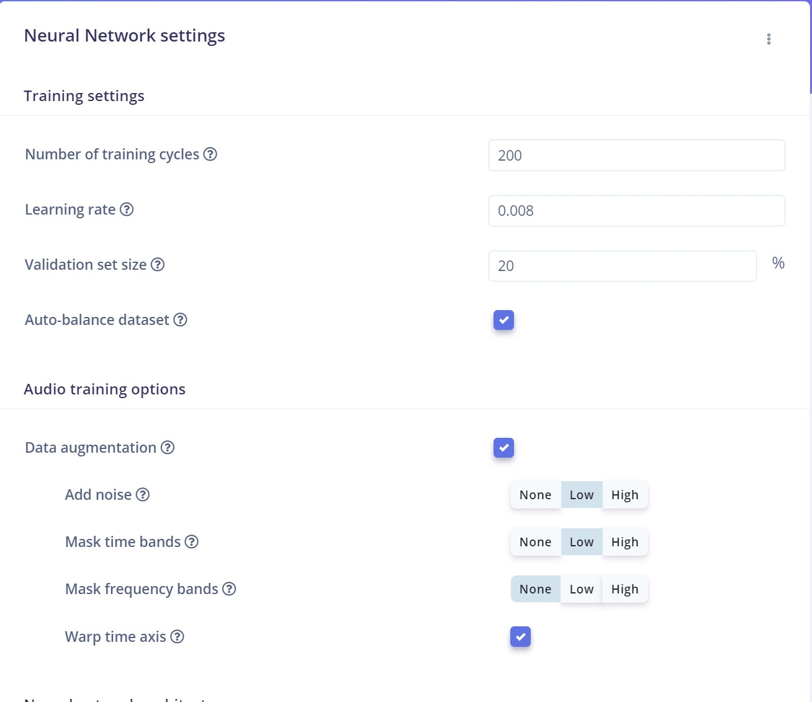

We enabled the Data augmentation feature, which helps us to randomly transform data during training. This we are able to run more training cycles without overfitting the data, and also helps improve accuracy.

This is our Neural Network architecture.

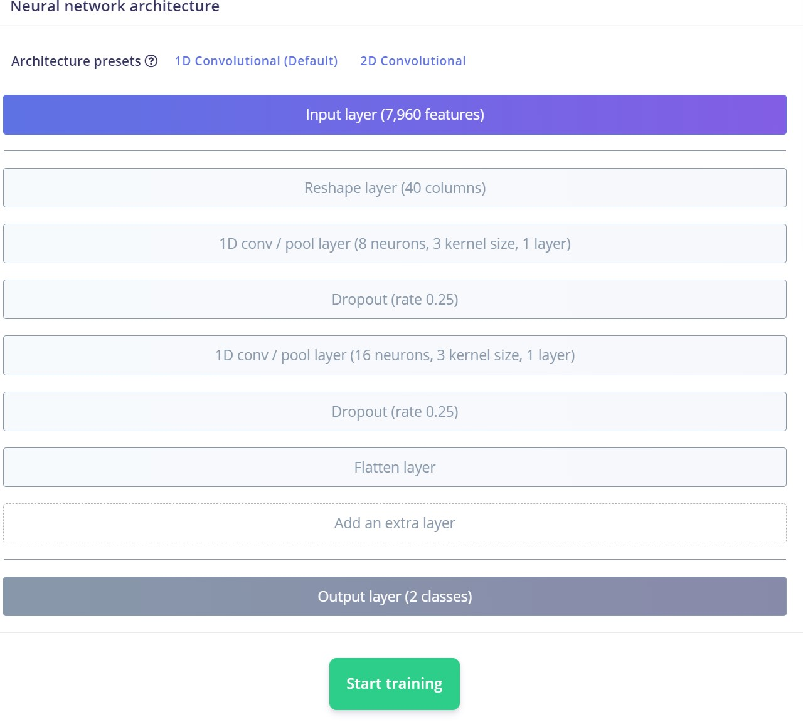

We have used the default 1D convolutional layer, then we trained the model. We ended up with 97% accuracy, which is very awesome. By looking at the confusion matrix it is clear that there is no sign of underfitting and overfitting.

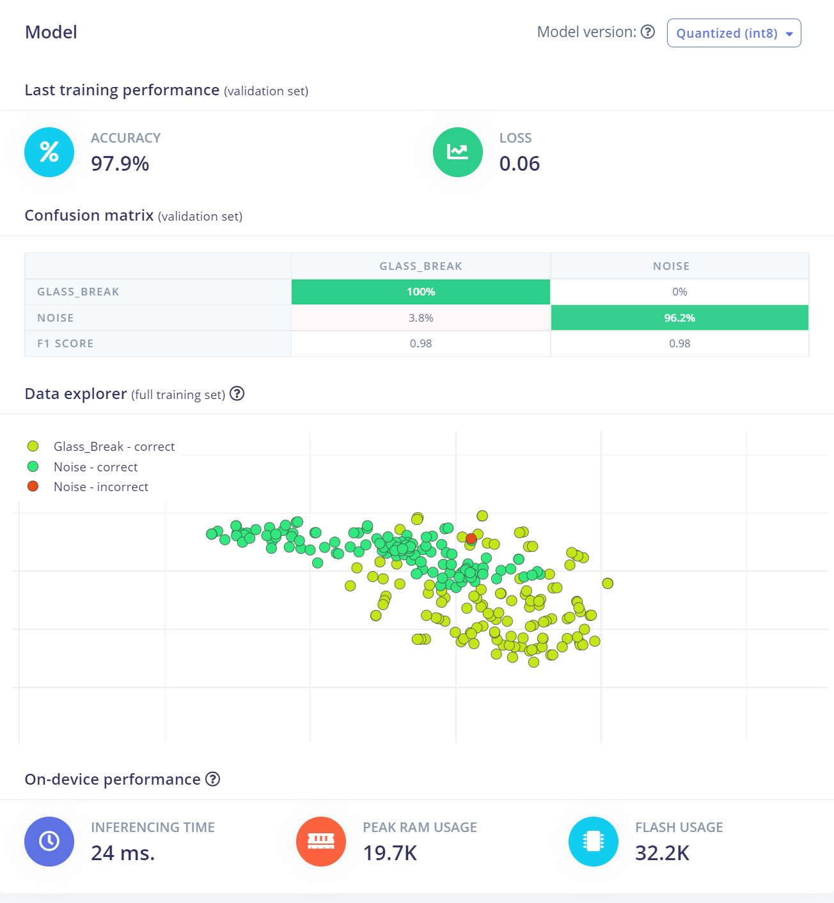

## Model Testing

Before deploying the model, it's a good practice to run the inference on the Test dataset that was set aside earlier. In the Model Testing, we got around 92% accuracy.

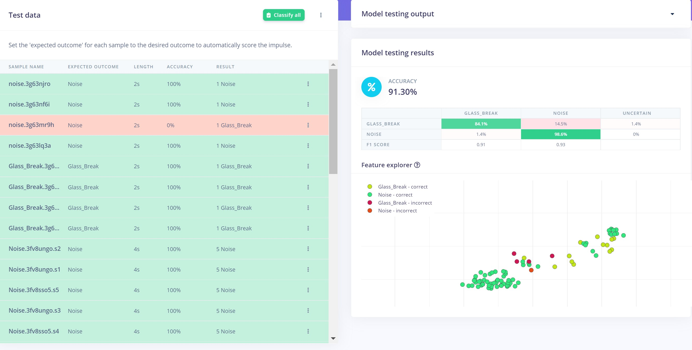

Let's look into some of the misclassifications, to better understand what is happening. In this case, the noise very well resembled the Glass Break sound, which is why it is misclassified:

In this next case, the model performed very well in classifying the data, although the data contains both the Glass\_Break and some noise. The majority of the data was noise however, that's why its misclassified.

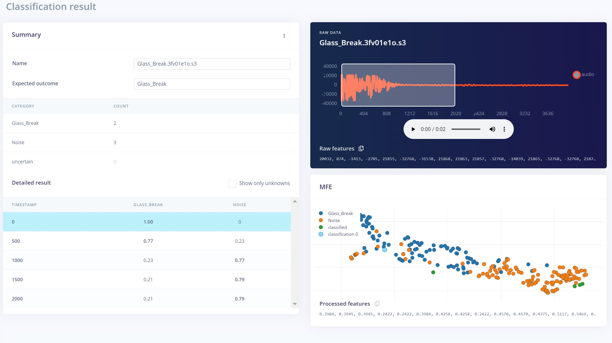

In these two cases shown below, again Noise was the major reason for misclassification:

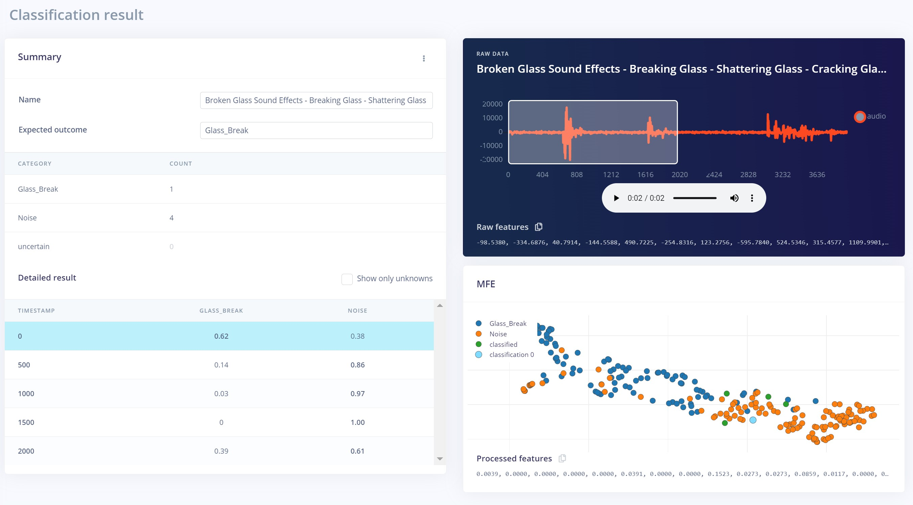

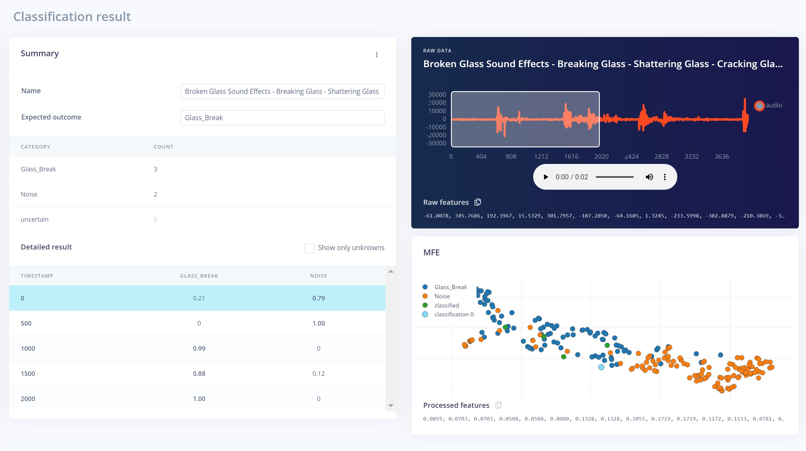

Overall though, the model is performing very well and can be deployed in the real world.

## Deployment

For deploying the Impulse to the BLE Sense, we exported the model as an Arduino library from the Studio.

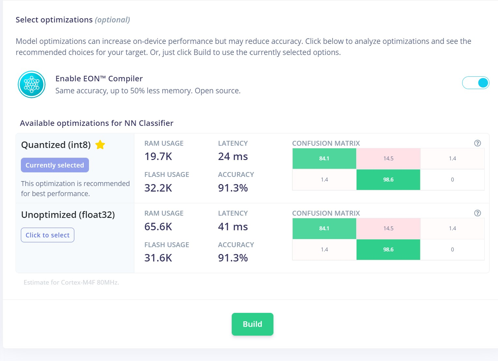

Then we add that library to the Arduino IDE. Next, we modified the example sketch that is provided, to build our application. You can find the code and all assets including the circuit in this [GitHub Repository](https://github.com/CodersCafeTech/Vandalism-Detection).

## IFTT

For triggering the email we used the **IFTT service**. To setup the mail triggering upon any positive detections, please have a look at this [tutorial](https://www.youtube.com/watch?v=MXqWt7oK4JY).

Here is the application I have created:

## Case

All the components were fit inside this case, to make a tidy package:

## Real World Testing

Here are the results of some live testing, after the model is deployed to the device. You can check it out in the below video. The sound of the glass breaking is played on a speaker, and you can see the results of the inferencing and email being sent.


