# Recognize Voice Commands with the Particle Photon 2

Created By: Roni Bandini

Public Project Link: [https://studio.edgeimpulse.com/public/288386/latest](https://studio.edgeimpulse.com/public/288386/latest)

GitHub Repository: [https://github.com/ronibandini/Photon2VoiceCommand](https://github.com/ronibandini/Photon2VoiceCommand)

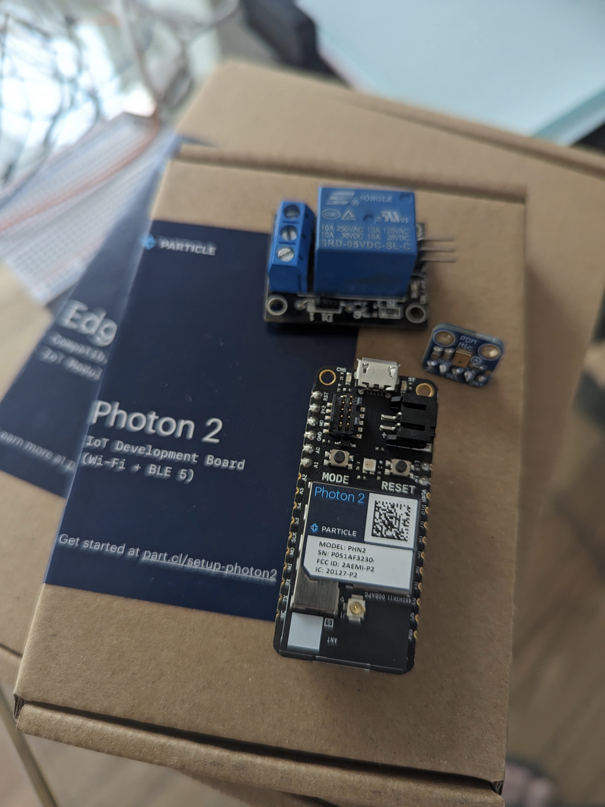

## Introduction

In industrial settings, workers often find themselves unable to operate machinery manually due to concurrent tasks demanding the use of their hands. Machine Learning (ML) has emerged as a transformative solution, enabling compact devices to comprehend and respond to vocal instructions, thereby initiating or halting machines as needed.

In the context of this project, we will leverage the Edge Impulse platform to train a customized ML model. Subsequently, we will deploy this model onto a [Particle Photon 2 microcontroller board](https://store.particle.io/products/photon-2). The Photon 2 board will be connected to a PDA microphone and a Relay module, creating an integrated system for practical demonstration.

## Prerequisites

The Photon 2 is an interesting, high quality board made by Particle. It has 5 GHz WiFi and Bluetooth (BLE) 5, an ARM Cortex-M33 CPU running at 200 MHz, 2 MB of storage for user applications, 3 MB of RAM available to user applications, and a 2 MB flash file system. 

The board size is 1.5 x 0.78 inches (5 x 2cm) and it comes with pre-soldered, labeled male headers. It also has 2 buttons (Reset and Mode), one RGB led, a LIPO charger with a JST-PH port, and a 10-pin micro JTAG connector for SWD (Serial Wire Debug).

Besides the Photon 2 board, the [Edge AI Kit](https://store.particle.io/products/edge-ai-kit-for-photon-2) is required for this project, which includes a W18340-A PDA MEMs microphone by Adafruit. The Edge AI Kit also includes jumper wires, a protoboard, PIR sensor, distance sensor, LED, switches, resistors, vibration sensor, accelerometer, and loudness sensor for many other AI projects. The Relay module is not included, but it is a cheap common device that can be ordered online from many electronic stores.

## Circuit

The PDA MIC comes without header pins soldered, so we need to solder 5 headers and discard the sixth one (if using a 6-pin header as I've done here). After that we will connect the PDA mic to the board using jumper cables. 

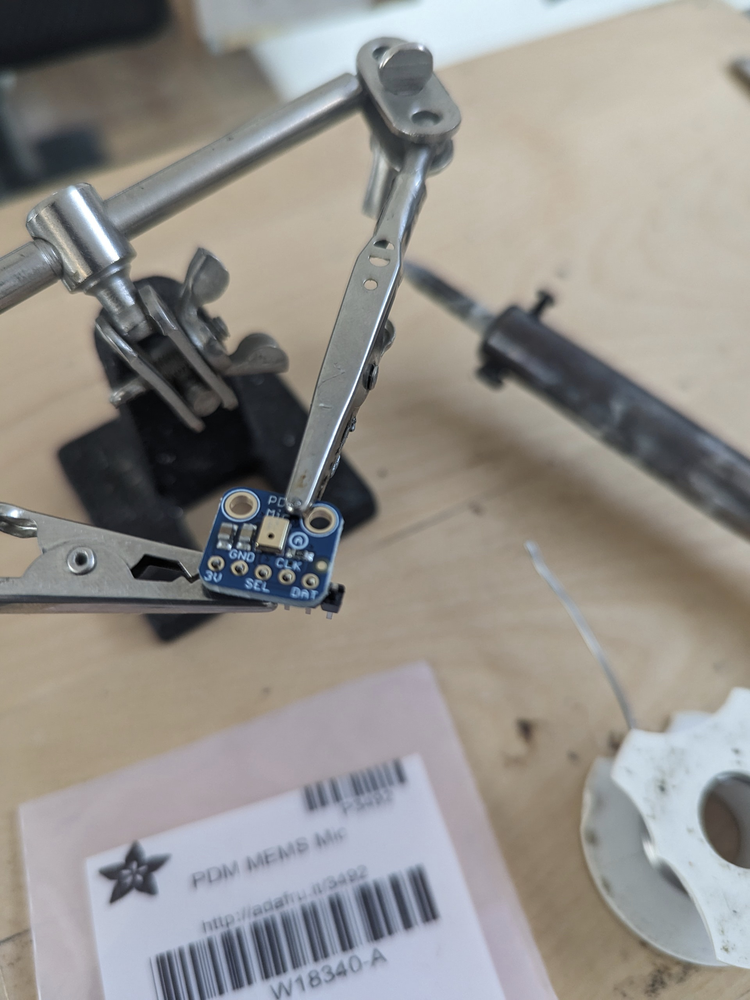

The PDA microphone connections should be:

- PDA GND to Photon 2 GND 
- PDA 3v to Photon 2 3v3
- PDA CLK to Photon 2 A0
- PDA DAT to Photon 2 A1
- The PDA Mic SEL pin is not used for this scenario.

The Relay module should be connected as follows:

- Relay GND to Photon 2 GND
- Relay VCC to Photon 2 VCC
- Relay Signal to Photon 2 D3

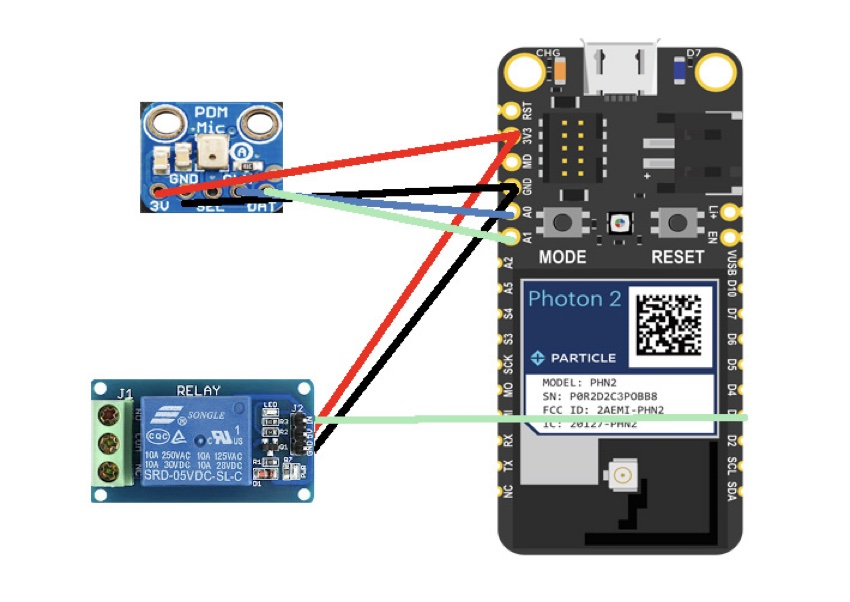

Since the Photon 2 has one GND and one 3v3 pin on the board, the Microphone GND and Relay GND should
be connected together, and also Microphone 3v and Relay 3v. You can do that using the
protoboard and Male-Female jumper cables from the Edge AI kit, or you can also cut and solder the
cables.

## Data Acquisition and Model Training

We will create an account at [Edge Impulse](https://edgeimpulse.com/), then login and reate a new project.

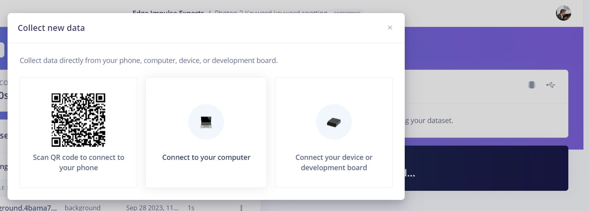

We will use the computer to record data samples for 2 labels: **machine** and **background**. Go to Collect data, Connect a Device, and Connect to your computer. 

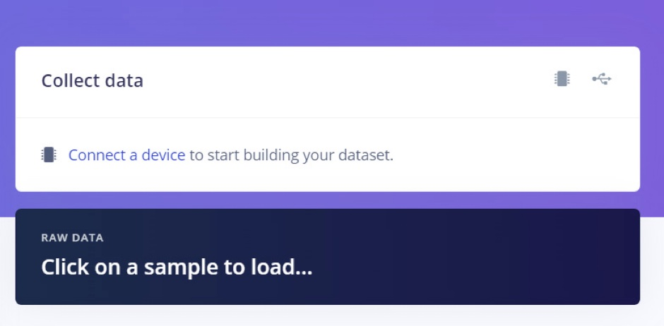

Enable your microphone permissions if necessary, and repeat the word **"machine"** several times, leaving a few seconds in between each. For **background** sound, just record any continuous background sound.

Wait a few seconds to allow the recording to be uploaded to Edge Impulse before going to the next step.

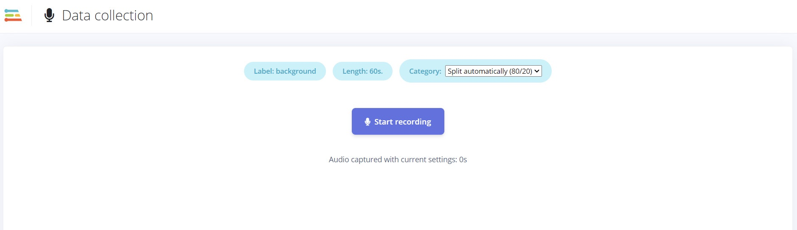

Now we are going to Split the samples. Click on the three vertical dots next to the recording and select "Split sample". Leave the length set to the default, 1000ms. Repeat this process for both labels.

Now we will design an Impulse. In the Edge Impulse Studio, go to **Create impulse**, set the Window size to 1000ms, the Window increase to 500ms, and add the 'Audio MFCC' Processing Block, which is perfect for voices. Then add 'Classification (Keras)' as the Learning Block. Now click **Save impulse**.

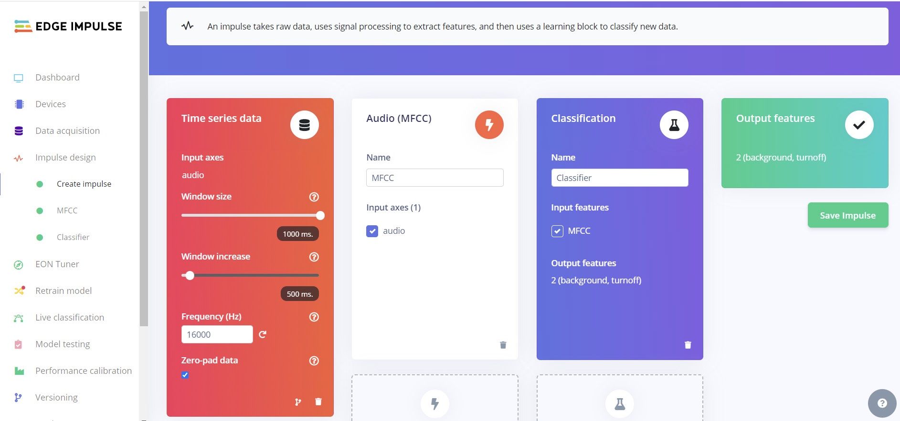

Next we will go to MFCC parameters. This page allows us to configure the MFCC block, and lets us preview how the data will be transformed. The MFCC block transforms a window of audio into a table of data where each row represents a range of frequencies, and each column represents a span of time. The value contained within each cell reflects the amplitude of its associated range of frequencies during that span of time.

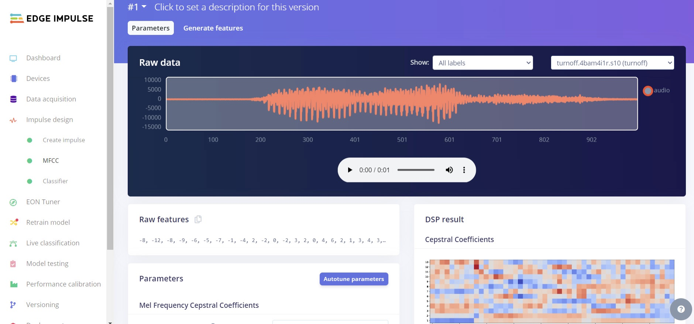

We will leave the default values, which are pre-configured according to the data. Then we click on Generate Features.

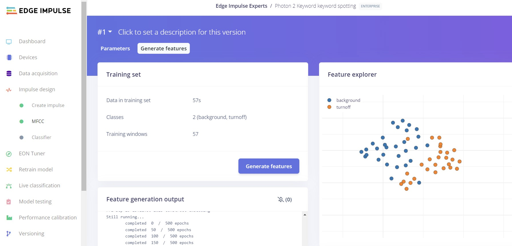

Now we go to Neural Network configuration. Click on **Classifier**, and the settings can be left on their default values, then scroll down to click **Start Training**. In this case, we have got a 100% accuracy, which is uncommon, but the data and recordings are quite different so the neural network is able to segment them quite well.

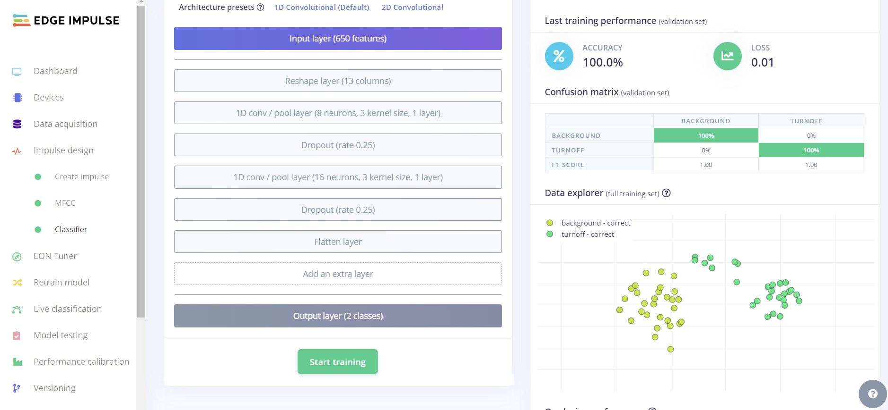

You can upload new samples and test them with Model Testing feature.

The final step is to deploy a library to the Particle Photon 2. We will click **Deployment**, begin to type the word Particle in the search box, then select the Particle Library and click **Build**.

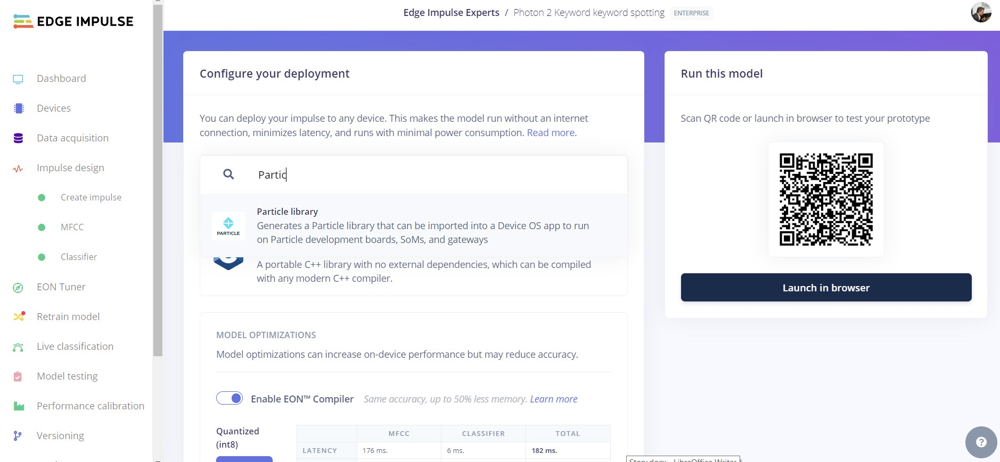

## Visual Studio Code

The main difference about working with the Photon 2 is that the Arduino IDE is not used to upload the code and libraries. Instead, Microsoft Visual Studio Code is used, and there are several setup steps to carefully follow. 

### Windows Installation

Install [Microsoft Visual Studio Code](https://code.visualstudio.com), then add the [Particle Workbench](https://marketplace.visualstudio.com/items?itemName=particle.particle-vscode-pack) extension.

Unzip the Particle library exported from Edge Impulse Studio. 

In VS Code, press Ctrl+Shift+P to bring up the Particle menu and select the "Particle: Import Project" feature to choose the library. The first time, VSCode will download dependencies.

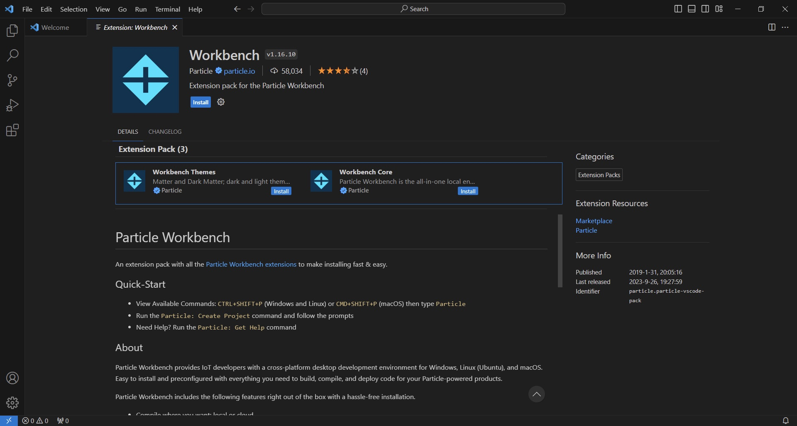

In Visual Studio, at the lower right there will be a button to open the Properties file. Navigate to the unzipped folder, select `project.properties` and select "Yes, I trust confirmation".

The `src/main.cpp` code included in the zip file detects the trained keyword, and prints predictions over serial console. So we need to add some code to control the Relay.

We will open `src/main.cpp` and add the following:

```
// Before Setup function

float myLimit=0.8; // the limit to detect the word
int machineOn=0; // machine current state
```

and

```
// Inside Setup function

pinMode(3, OUTPUT); // set pin 3 to control the Relay Module
```

Then, inside the loop we will add this code to control the Relay. In this case, the label contains the keyword "muted" instead of "machine", as I was exploring audio output. If you are going to use another label, just change the word "muted" to the keyword contained in your own label.

```
 for (size_t ix = 0; ix < EI_CLASSIFIER_LABEL_COUNT; ix++) {
            if (strstr(result.classification[ix].label, "muted") && result.classification[ix].value > detectionLimit) {
                if (machineOn==1){
                    ei_printf(" - Turning the machine off");
                    digitalWrite(3, HIGH);
                    machineOn=0;
                }
                else{
                    ei_printf(" - Turning the machine on");
                    digitalWrite(3, LOW);
                    machineOn=1;

                }                              
            } 
```

> Note: you can also download the `main.cpp` file from [https://github.com/ronibandini/Photon2VoiceCommand](https://github.com/ronibandini/Photon2VoiceCommand) to make sure you have everything entered correctly.

Now press Ctrl+Shift+P to bring up the Particle menu again, and this time select "Particle: Configure Project for Device".  Select deviceOS@5.5.0, board P2, and ESC for device name.

> Note: if you get a Microphone library not found, press Ctrl+Shift+P, install the 'Microphone_PDM@0.0.2' library.

Finally, bring up the Particle menu again with Ctrl+Shift+P and select "Particle: Flash application and device, local" (For Windows, it will take around 5 minutes to flash).

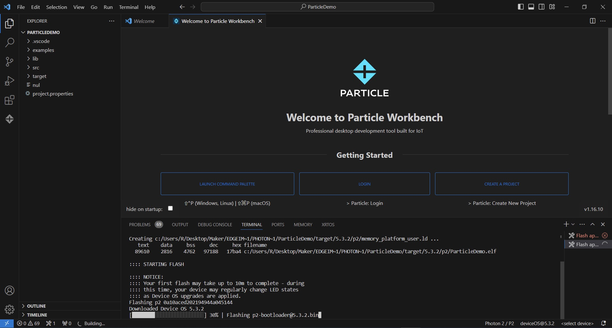

If you obtain an "Argument list too long" error during flashing, Particle Support recommends using Docker instead to build: 

- [https://docs.particle.io/firmware/best-practices/firmware-build-options/#using-buildpack](https://docs.particle.io/firmware/best-practices/firmware-build-options/#using-buildpack)
- [https://docs.docker.com/desktop/install/windows-install/](https://docs.docker.com/desktop/install/windows-install/)

Another option is to use Mac or Linux. For the demo below, the `main.cpp` modifications were made following the work done by Particle for this example [https://docs.particle.io/getting-started/machine-learning/youre-muted](https://docs.particle.io/getting-started/machine-learning/youre-muted)

### Linux (Ubuntu) Installation

1. Install a lightweight Ubuntu, such as [Lubuntu](https://lubuntu.me/downloads)
2. Install [VSCode](https://code.visualstudio.com/docs/?dv=linux64_deb)
3. Open a Terminal window and execute: `sudo apt-get install libarchive-zip-perl` (this step is to avoid an error where crc32 tool is not found)
4. Click Ctrl+P: Extension Install and locate and install `particle.particle-vscode-pack` and press Enter.
5. Login with Particle credentials
6. Create a Project
7. Import the unzipped folder. Accept "Trust all"
8. Now click Ctrl+Shift+P, choose "Particle: Configure Project for Device", and choose deviceOS@5.3.2, board P2
9. Bring up the Particle menu again with Ctrl+Shift+P and choose "Particle: Flash Application and Device, local"

## Demo Video


 

## Conclusion

Machine Learning not only facilitates the recognition of voice commands but also empowers the identification of distinct machine-generated sounds, enabling automatic shutdown in response to specific malfunction indicators. This functionality proves invaluable in enhancing operational safety and efficiency within industrial environments.

Moreover, the compact form factor and cost-effectiveness of boards like the Particle Photon 2, coupled with their ability to manage external devices, render them an enticing augmentation for various industries. They offer a gateway to harnessing the potential of ML-powered automation within diverse manufacturing settings.

## Contact

[https://www.instagram.com/ronibandini](https://www.instagram.com/ronibandini)
[https://twitter.com/RoniBandini](https://twitter.com/RoniBandini)
[https://bandini.medium.com](https://bandini.medium.com)


