# Voice Controlled Power Plug with Syntiant NDP120 (Nicla Voice)

Created By: Jallson Suryo

Public Project Link: [https://studio.edgeimpulse.com/public/297564/latest](https://studio.edgeimpulse.com/public/297564/latest)

GitHub Repo: [https://github.com/Jallson/Voice\_Controlled\_PowerPlug](https://github.com/Jallson/Voice\_Controlled\_PowerPlug)

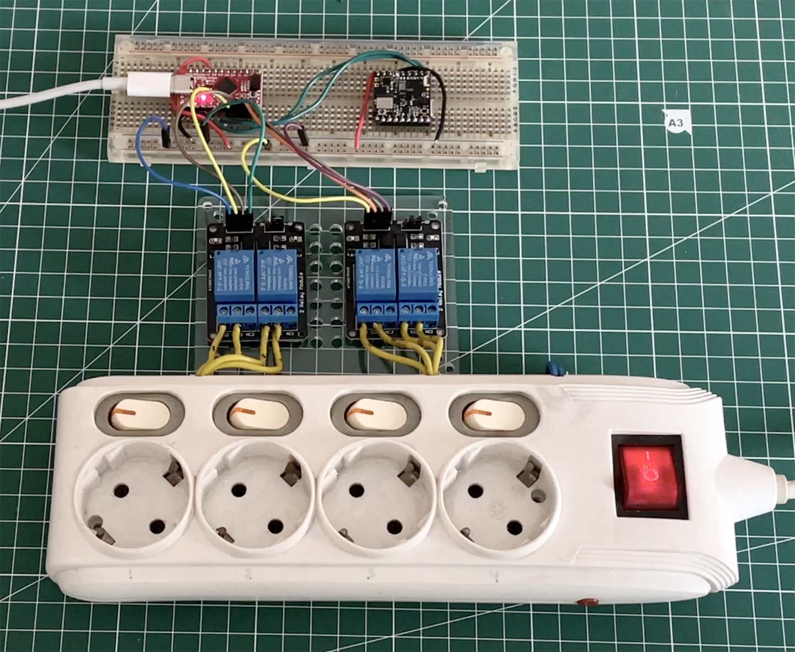

## Introduction

Can you imagine Amazon Alexa without the cloud?

For most services, adding voice means adding an internet connection and it means extra expense, privacy and security concerns, and you need to install an app (or access to the web) for everything in your home. Another problem is the time delay between a voice command being given, the command being sent to a cloud server and then back to the device for execution, creating a poor user experience.

## Our Solution

A power-plug which can be controlled using voice commands, with no connection to the internet. By using a machine learning model embedded in a microcontroller that has been trained to recognize several commands, which are then passed to relays which will turn the power on or off at each socket according to the issued command, instantly. Practicality, privacy concerns, and cost-effectiveness are the goals of this Non-IoT Voice Controlled Power Plug project.

## Description

This project takes advantage of Edge Impulse's Syntiant audio processing block that extracts time and frequency features from a signal, specific to the Syntiant NDP120 accelerator included in the Nicla Voice. The NDP120 is ideal for always-on, low-power speech recognition applications with the “find posterior parameters” feature that will only react to the specified keywords.

Devices with an embedded ML model will accept voice commands, but won't need a WIFI or Bluetooth connection. All processing is done locally on the device, so you can directly tell a lamp, air conitioner, or TV to turn on or off without Alexa or Siri, or any digital assistant speaker/hub.

This project will use relays and a power strip connected to various appliances such as a lamp, fan, TV, etc. An Arduino Nicla Voice with embedded ML model has been trained to recognize various keywords like: `one`, `two`, `three`, `four`, `on`, and `off` is the center of the decision process. From the Nicla Voice we use the I2C protocol which is connected to an Arduino Pro Micro to carry out voice commands from the Nicla Voice, and forwarded to the relays which control power sockets.

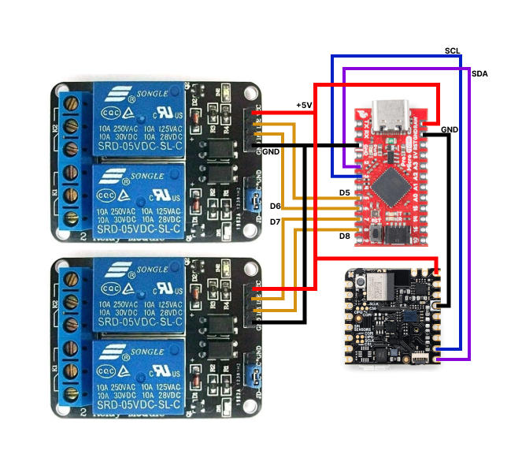

### Hardware Requirements:

- Arduino Nicla Voice (with Syntiant NDP120)
- Any microcontroller or Arduino (I use Pro Micro)
- 5V Relay (4pcs)
- Breadboard
- Cable jumper
- Cable for 110/220V
- Powerstrip (4 sockets)

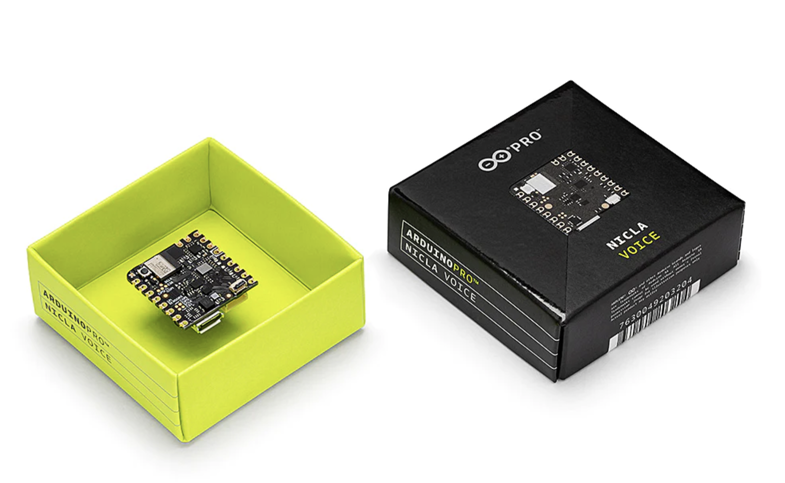

### Software & Online Services:

- Edge Impulse Studio (Enterprise account or Free Trial for more than 4 hours of training data)
- Arduino IDE
- Terminal

## Steps

### 1. Upload or Collect Audio Data

Before we start, we need to install the Arduino CLI and Edge Impulse tooling on our computer. 

You can follow this guide [https://docs.edgeimpulse.com/docs/development-platforms/officially-supported-mcu-targets/arduino-nicla-voice](https://docs.edgeimpulse.com/docs/development-platforms/officially-supported-mcu-targets/arduino-nicla-voice) to get everything installed.

Open [https://studio.edgeimpulse.com](https://studio.edgeimpulse.com) in a browser, and sign in, or create a new account if you do not have one. Click on _New project_, then in _Data acquisition_, click on the _Upload Data_ icon for uploading .wav files (e.g. from Kaggle, Google Speech Commands Dataset, etc.). Other methods to collect data are from devices such as a connected smartphone with QR code link, or a connected Nicla Voice with Edge Impulse audio firmware flashed to it. For ease of labelling, when collecting or uploading data, fill in the name according to the desired label, for example `one`, `two`, `three`, `on`, `off`, or `zzz` for words or sound that can be ignored.

> Note: With over 4 hours of audio data, multiple classes and higher performance settings to build the model, this project uses an [Enterprise account](https://edgeimpulse.com/product) for more capable and faster results.

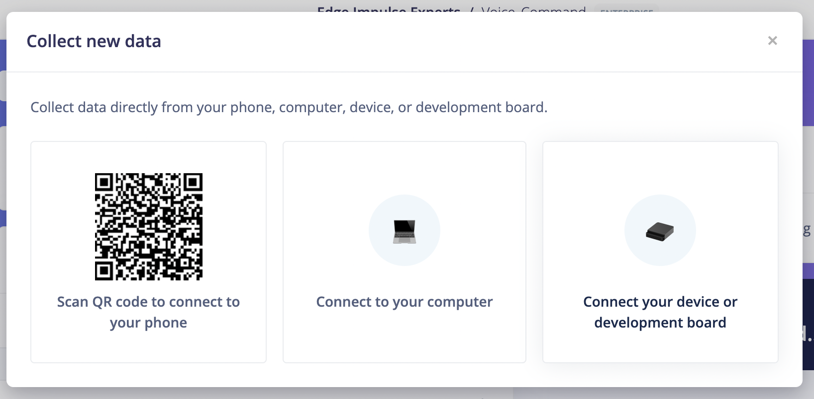

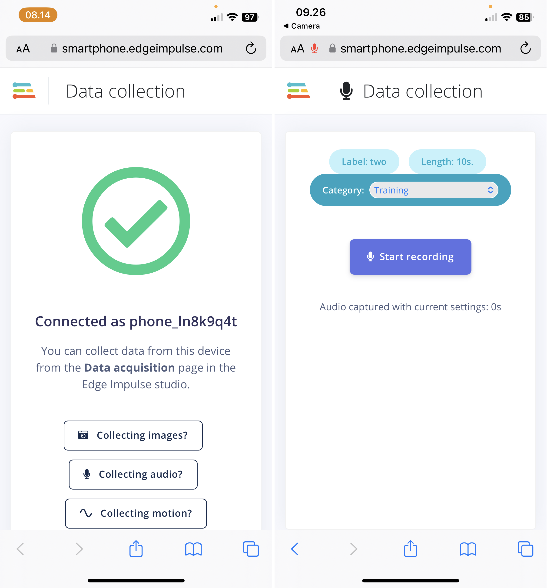

### 2. Split and Balancing

Click on a data sample that was collected, then click on the 3 dots to open the menu, and finally choose _Split sample_. Set the segment length to 1000 ms (1 second), or add segments manually, then click **Split**. Repeat this process until all samples are labeled in 1 second intervals. Make sure the comparison between one, two, three, four, on, off and unknown data is quite balanced, and the ratio between Training and Test data is around 80/20.

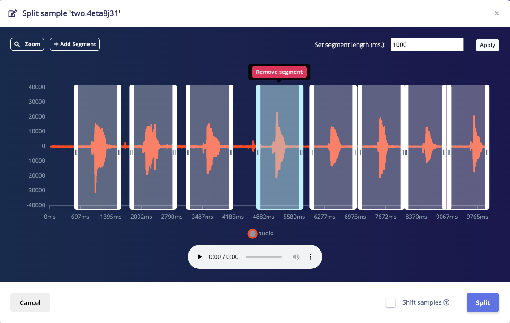

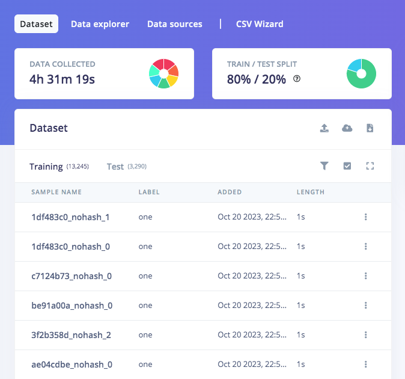

### 3. Train and Build the Model (Syntiant)

Choose _Create Impulse_, set _Window size_ to 968ms, then add an _Audio (Syntiant)_ Processing block, and choose _Classifier_ for the Learning block, then **Save Impulse**. In the Syntiant parameters, choose **log-bin (NDP120/200)** then click **Save**. Set the training to around 50 cycles with 0.0005 Learning rate, and choose _Dense Network_ with Dropout rate around 0.5, then click **Start training**. It will take a short while, but you can see the progress of the training on the right. If the results show a figure of around 80% accuracy upon completion, then we can most likely proceed to the next stage.

Now we can test the model in _Live classification_, or choose _Model testing_ to test with the data that was set aside earlier (the 80/20 split), and click **Classify all**. If the result is quite good -- again around 80% accuracy, then we can move to the next step -- Deployment.

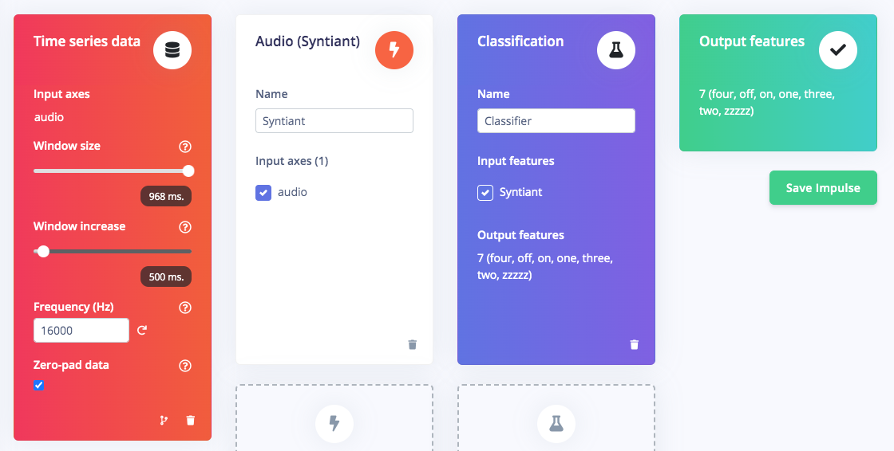

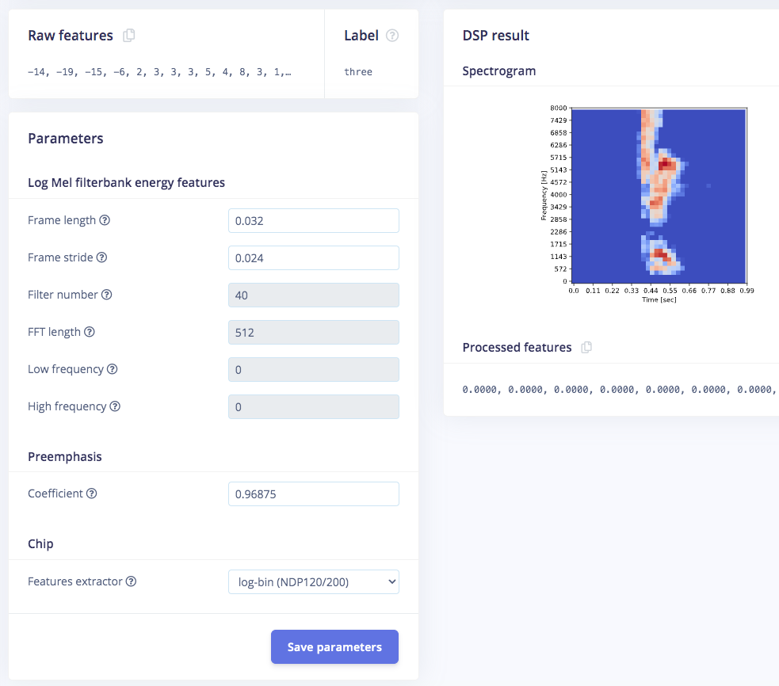

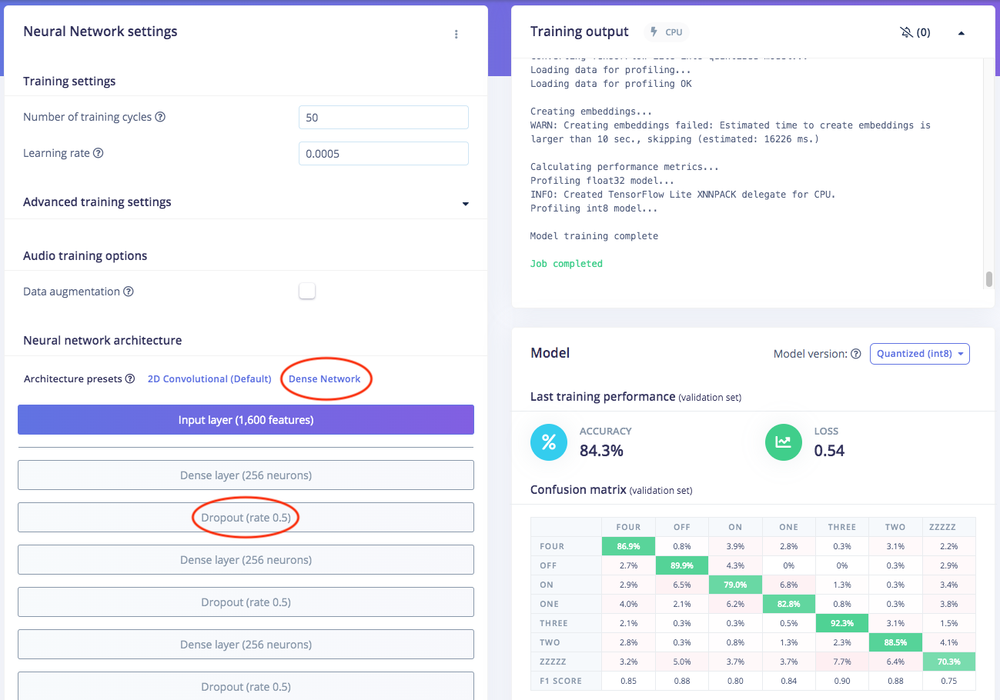

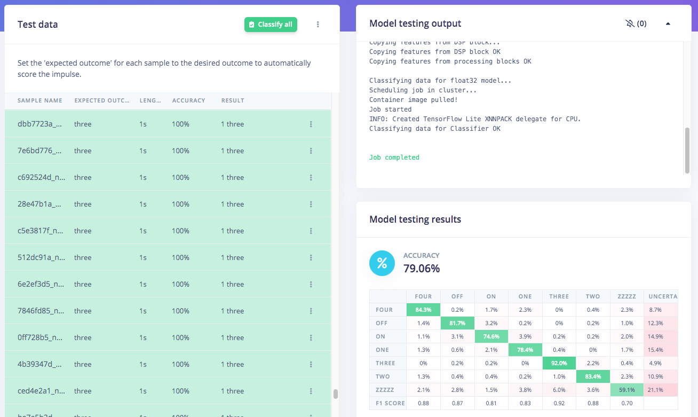

### 4. Deploy to Nicla Voice

For a Syntiant NDP device like the Nicla Voice, we can configure the [Posterior parameters](https://docs.edgeimpulse.com/docs/run-inference/hardware-specific-tutorials/responding-to-your-voice-syntiant-rc-commands-go-stop#8.-deploying-to-your-device) (in this case tick all labels except `zzz`). To run your Impulse locally on the Arduino Nicla Voice, you should select the Nicla Voice in the _Deployment_ tab, then click **Build**. The binary firmware will start building and automatically download to your computer once it is complete, and a video with instructions on how to flash the firmware will pop-up. [Flash this firmware to the Nicla Voice](https://docs.edgeimpulse.com/docs/run-inference/hardware-specific-tutorials/responding-to-your-voice-syntiant-rc-commands-go-stop#9.-flashing-the-device) as instructed. Once complete, Now you can run this model in a Terminal for live classification.

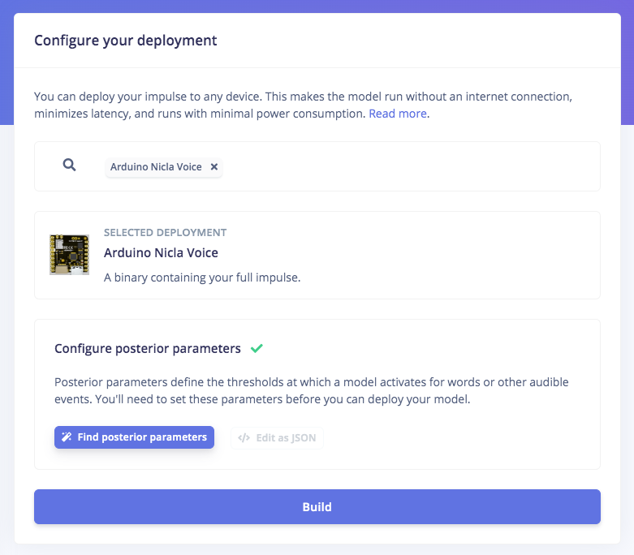

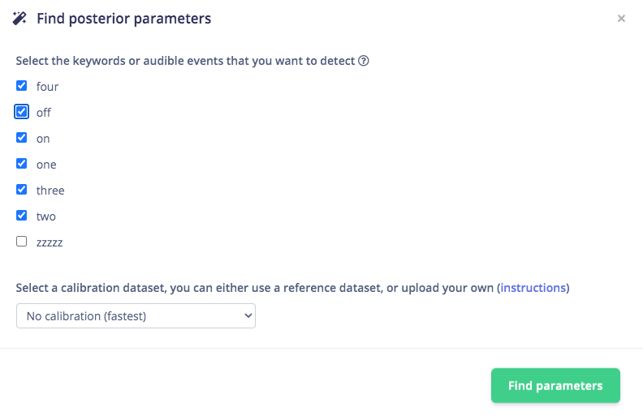

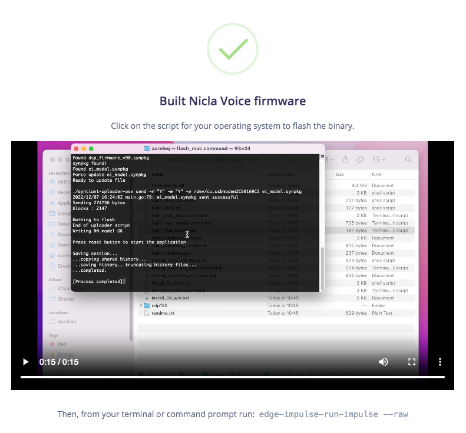

### 5. Upload the Arduino Code

Because there are two MCU's in this solution, two seperate applications are needed:

#### Nicla Voice

Upload this code [https://github.com/Jallson/Voice_Controlled_PowerPlug/blob/main/relayvoice_niclavoice.ino](https://github.com/Jallson/Voice_Controlled_PowerPlug/blob/main/relayvoice_niclavoice.ino) to the Arduino Nicla Voice using the Arduino IDE. This code will override the existing application code in the Nicla Voice's MCU, but not the machine learning model on the NDP120. The code basically sends a byte via I2C every time a keyword is detected, the value of the byte will depend on the keyword detected.

#### Pro Micro

Upload this code [https://github.com/Jallson/Voice_Controlled_PowerPlug/blob/main/relayvoice_promicro.ino](https://github.com/Jallson/Voice_Controlled_PowerPlug/blob/main/relayvoice_promicro.ino) to the Pro Micro using the Arduino IDE. This application receives the incoming byte via I2C and will switch on or off the relay based on the values of the data received from the Nicla Voice.

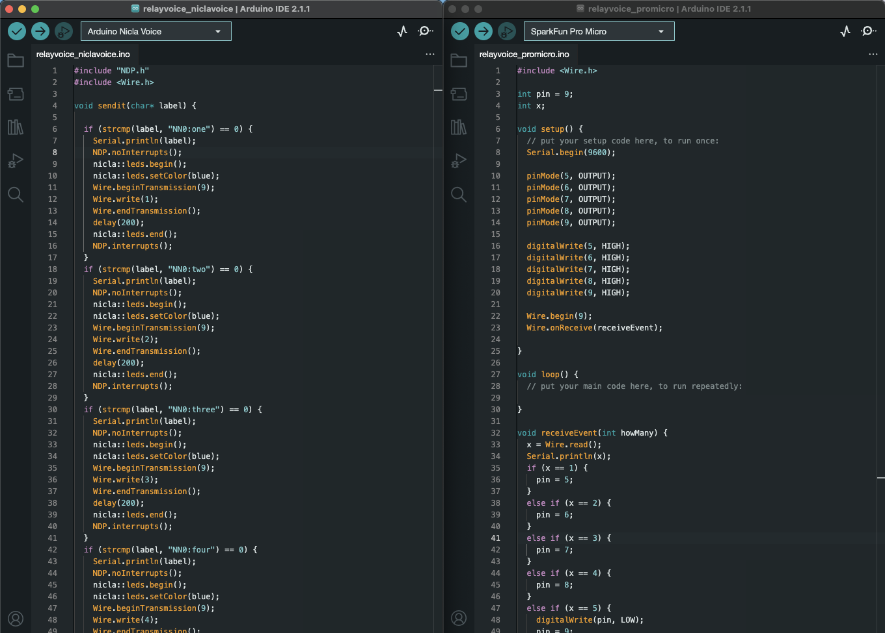

## Demo



## Conclusion

Finally we succeeded in making this **Non IoT** Voice Controlled Power-plug idea a reality and implemented in a home appliances setting. I believe in the future this kind of non-IoT smart home system will be widely implemented, and could be built-in to every home appliance with specific keywords. Concerns about privacy, security, as well as practicality and energy efficiency can be achieved for a more sustainable future.
