# Automated Inventory Management With Computer Vision 

Created By:
Shebin Jose Jacob

Public Project Link:
[https://studio.edgeimpulse.com/public/156676/latest](https://studio.edgeimpulse.com/public/156676/latest)

## Project Demo



## Intro

A store may experience a loss of sales as a result of the products being unavailable or being positioned incorrectly on the shelves of a major store. Visual audits are undertaken by the staff to discover out-of-stock and misplaced products on a shelf.

We are trying to automate the visual inspection process where computer vision act as another set of eyes watching over every shelf in a store. The FOMO model trained can identify the products in a store's inventory and it alerts the staff when the item needs to be restocked. The FOMO model is trained to identify all the products in the store. The model can identify and count the number of objects available on the shelf. When the count falls below a threshold, the staff is alerted immediately, which ensures a proper supply of products. 

Artificial intelligence-powered inventory control also enables managers to track product trends and place new product orders more easily to satisfy future demands.

## Advantages

* Realtime detection and counting of products in the store
* Immediate alert in case the stocks are running low
* The system can be upgraded to monitor the stock-in and stock-out time which helps managers to track product trends
* User behaviour can be analysed to modify the alignment of the products in the store
* Less number of staff needed to manage the store.
* A staff interference-free environment provides customers with more room for exploration.

## How Does It Work?

The key component of the system is a smart camera. The smart camera consists of a Raspberry Pi 4 and a compatible camera module, running an object detection model in it. The object detection model counts the number of products on the shelf and when the number falls below the threshold, an alert is generated in the web interface.

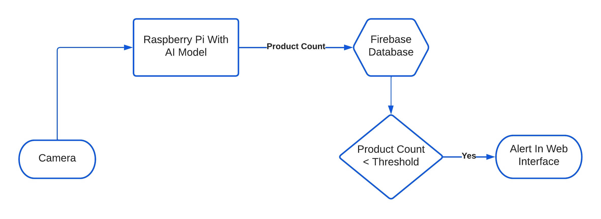

## Hardware Requirements
* Raspberry Pi 4B
* 5MP Camera Module
* Compatible Power Supply

## Software Requirements
* Edge Impulse Python SDK
* Python 3.x
* HTML, CSS, JS

## Hardware Setup

The current hardware setup is very minimal. The setup consists of a 5 MP camera module connected to a Raspberry Pi 4B using a 15-pin ribbon cable.


## Software Setup

If you're new here and haven't set up the Raspberry Pi for EdgeImpulse yet, follow this [quick tutorial](https://docs.edgeimpulse.com/docs/development-platforms/officially-supported-cpu-gpu-targets/raspberry-pi-4)  to connect the device to the EdgeImpulse dashboard.

After successfully connecting the device, you should see something like this in the **Devices** tab.

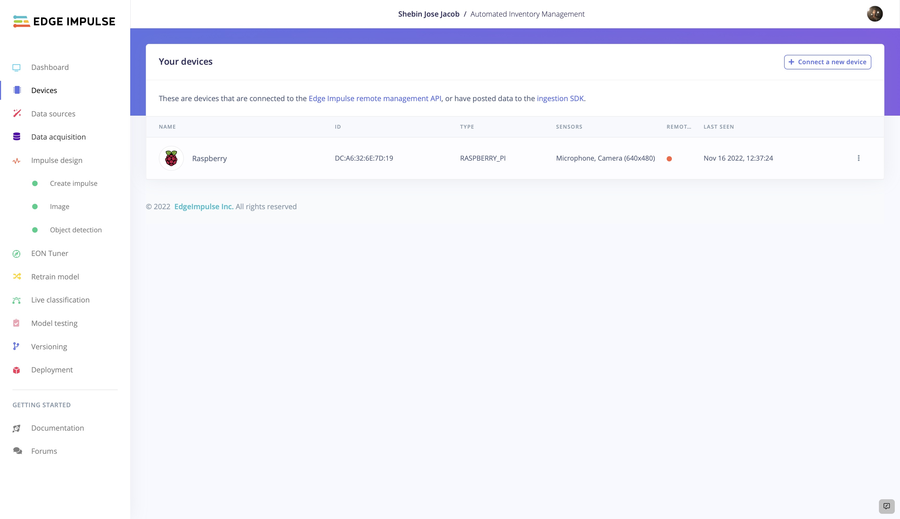

## Build The TinyML Model

### 1. Data Acquisition And Labelling

After the preliminary software and hardware setup, now it's time to build the object detection model. Let's start by collecting some data. We can use two methods to collect data. Either we can directly collect the data using the connected device or we can upload the existing data using the **Uploader**. In this project, we are using the former method.

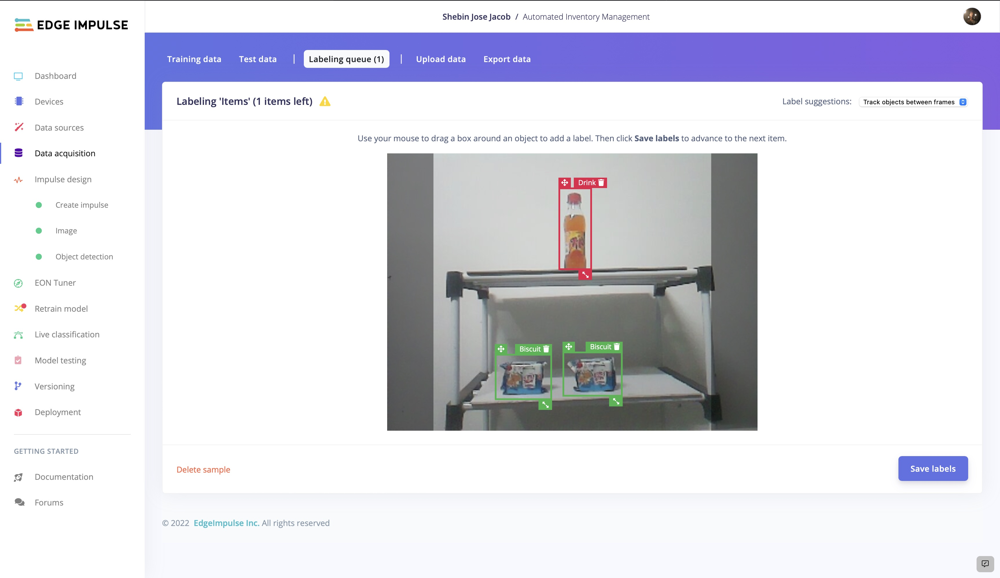

Once the data is uploaded, from the labeling queue we can label the unlabelled images. Here we have two classes and hence two labels - *Drink and Biscuit*.

### 2. Impulse Design

As our case is real-time detection and counting, we need a faster-performing model with reliable accuracy. So we are using FOMO which generates a lightweight, faster model. Since FOMO performs better with 96x96 images, we are setting the image dimensions to 96px. Keeping **Resize Mode** to **Fit shortest axis**, add an **Image processing block** and an **Object Detection (Images)** learning block to the impulse.

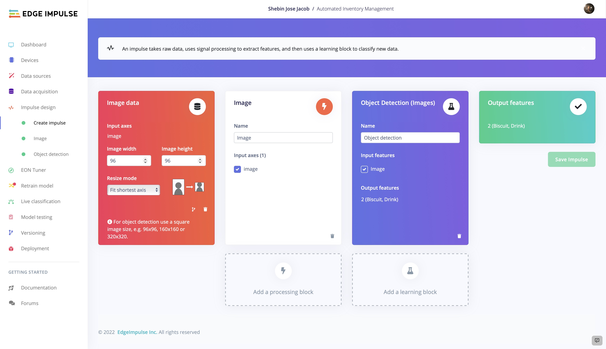

Moving on to the **Image** tab, choose the color depth and save the parameters for feature generation. We are choosing **RGB** as the color depth. Once the features are generated, continue to train the model.

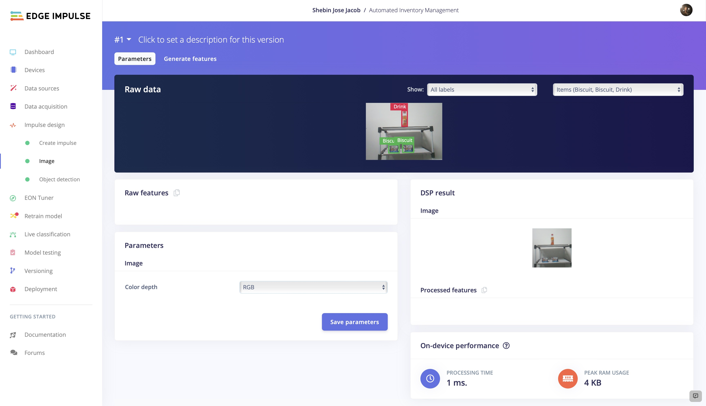

### 3. Model Training

Now that we have our impulse designed, let's proceed to train the model. The settings we employed for model training are depicted in the picture. You can play with the model training settings so that the trained model exhibits a higher level of accuracy, but be cautious of overfitting.

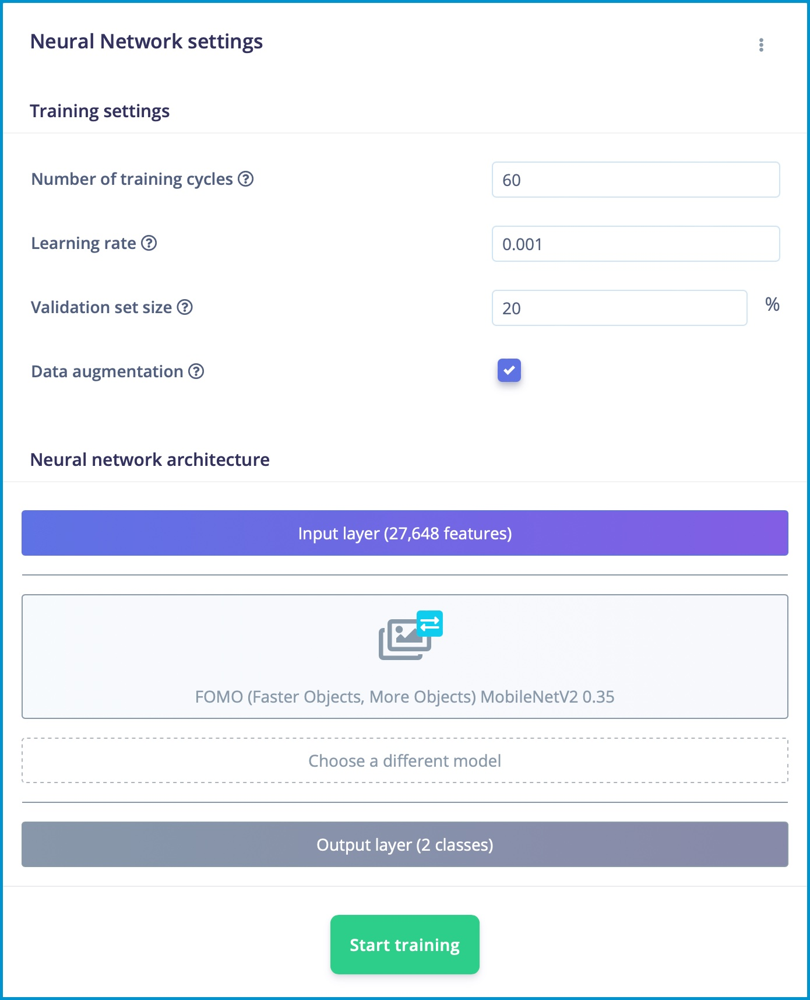

We are using **FOMO (MobileNet V2 0.35)** as the neural network. Let's train the model with default training settings and see how accurate the output model will be.

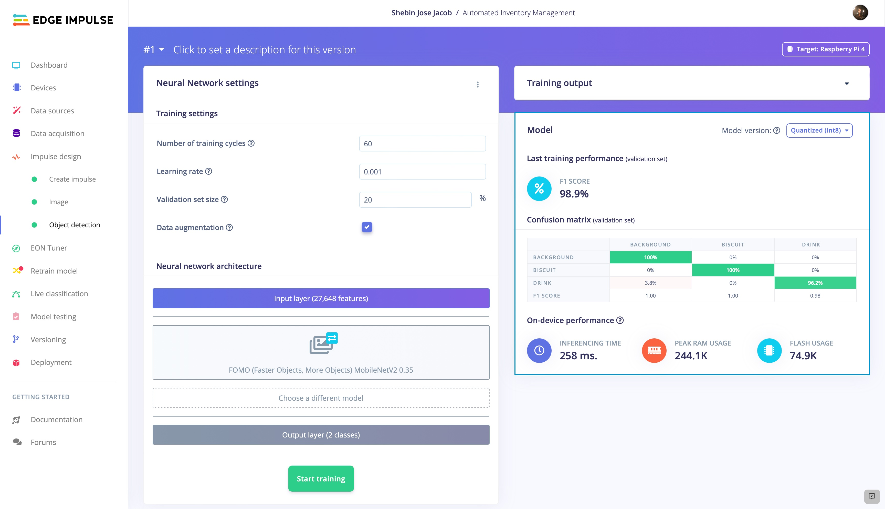

With an ample amount of training data, we have reached a very good accuracy of 98.9% with the default training settings itself. Now let's see how well the model performs with the test data. For that move on to **Model Testing** and **Classify All**.

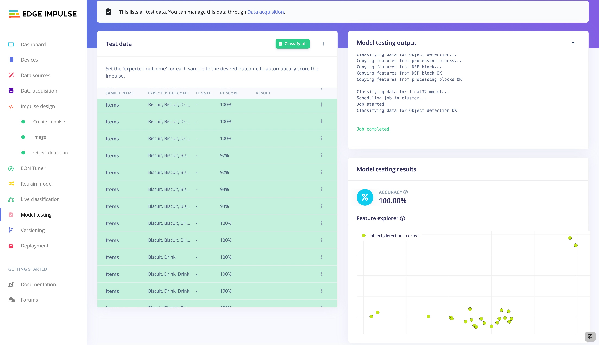

The model performs excellently with the test data too. Now it's time for the final phase of testing or rather a mock deployment. Move to the **Deployment** tab and **Run Impulse Directly** on your **Mobile Phone**. Now place the phone in front of your products and see how well the model performs in the real world. 

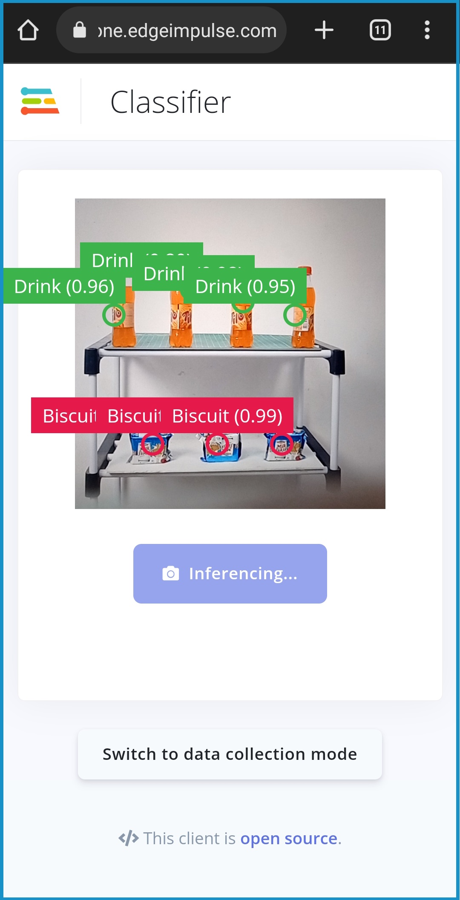

The model performs very well in the real world. So, let's proceed with the deployment. 

## Firebase Realtime Database

For our project, we used Firebase real-time database that allows us to rapidly upload and retrieve data without any waiting. In this case, we made advantage of the Pyrebase package, a Python wrapper for Firebase.

To install Pyrebase,
```
pip install pyrebase
```
In the database, follow the given steps.
* Create a project.
* Then navigate to the Build section and create a real-time database.
* Start in test mode, so we can update the data without any authentication
* From Project Settings, copy the config.

Now add this piece of code by replacing the config details, into your python file to access data from firebase.

```
import pyrebase
config = {
  "apiKey": "apiKey",
  "authDomain": "projectId.firebaseapp.com",
  "databaseURL": "https://databaseName.firebaseio.com",
  "storageBucket": "projectId.appspot.com"
  }
firebase = pyrebase.initialize_app(config)
```

## Web Interface

We are using a webpage created using HTML, CSS, and JS to display the defects in real-time. The data updated in Firebase Realtime Database is updated on the webpage in real time. The webpage displays the current count of each product across the store. If the count is lesser than a prefixed threshold, it displays an alert in the web interface.

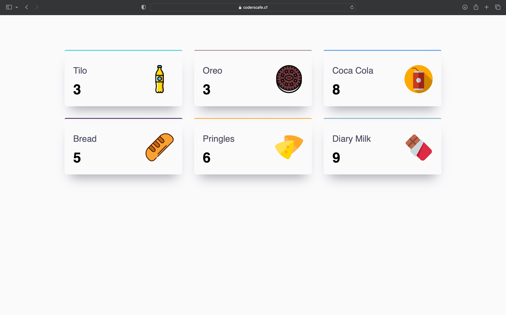

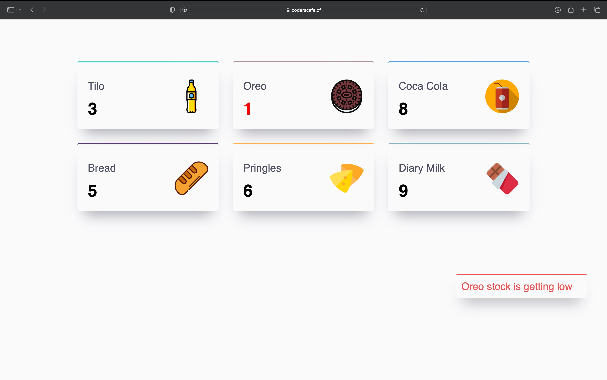

## Code

The code for this project is developed using Python and the Edge Impulse Python SDK. The entire code and assets are available in the [GitHub repository](https://github.com/CodersCafeTech/Automated-Inventory-Management).


