# Azure Machine Learning with Kubernetes Compute and Edge Impulse

Created By: Attila Tokes

GitHub Repo: [https://github.com/attila-tokes/edge-impulse-expert-projects/tree/main/azure-ml-voice-to-text](https://github.com/attila-tokes/edge-impulse-expert-projects/tree/main/azure-ml-voice-to-text)

## Intro

**Edge ML** enables developers to run Machine Learning (ML) on Internet of Things (IoT) and Edge devices. This offers many advantages, such as reduced power consumption, low latency, reduced bandwidth, and increased privacy.

On the other hand, Edge ML can also be limited in functionality, given the reduced hardware capability of the edge devices. In these cases, it can be a good idea to combine **Edge ML** with **Cloud ML** functionality. This is usually done by running an ML model on the Edge device continuously, combined with a Cloud endpoint which is only called by the edge device when advanced functionality is needed.

In this project, I will demonstrate how to create a solution using **Edge ML** functionality provided by **Edge Impulse**, in combination with a **Cloud ML** endpoint implemented with **Azure ML**.

In this project we will implement a **Voice-to-Text** solution running on a low power edge device like the Raspberry Pi.

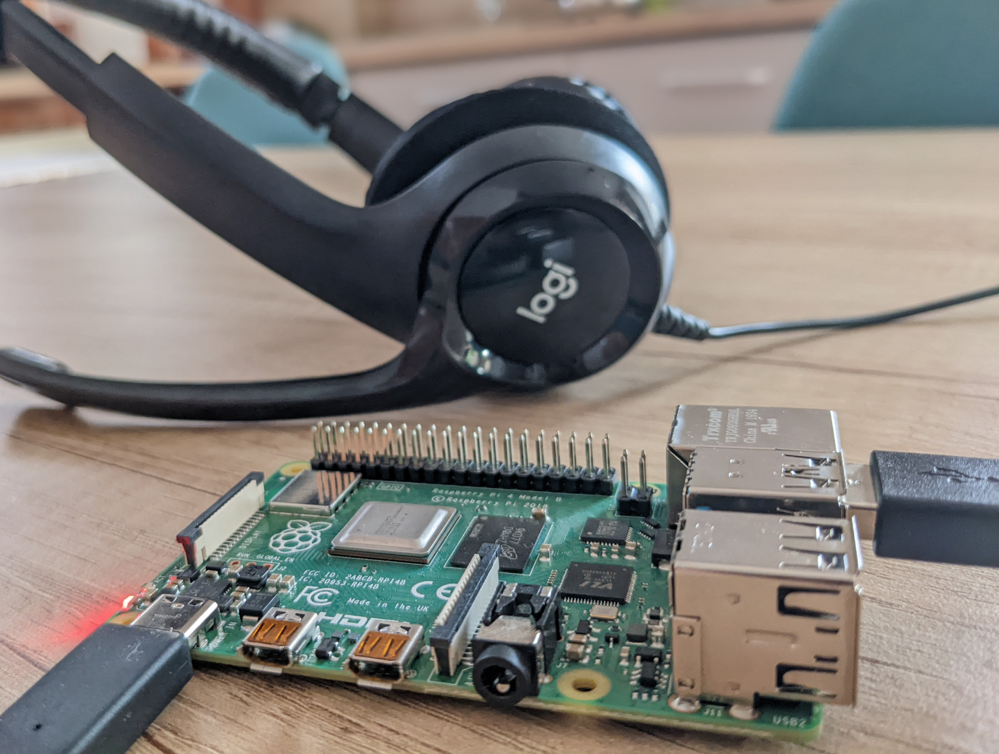

The device will be able to detect a keyword like _"Listen!"_ and then record and translate voice to written text. The keyword detection will be implemented locally using an **Edge Impulse** model, while the voice-to-text transformation will use a model running in an **Azure ML** endpoint.

Below is short video showing the project in action:



In the following sections I will describe how such an application can be implemented. We will start with the voice-to-text endpoint implemented with Azure ML, and then we will integrate this into an Edge Impulse application running on the Raspberry Pi.

## Cloud ML with Azure ML

[**Azure Machine Learning**](https://azure.microsoft.com/en-us/services/machine-learning/#product-overview) is Microsoft's cloud offering of machine learning services, covering the machine learning project lifecycle, including training and inference. It supports all the popular open-source machine learning frameworks such as TensorFlow, PyTorch and others.

In this section I will show how to implement a voice-to-text translation endpoint with Azure ML.

### The Model

The machine learning model we will use for voice-to-text transformation is the [**Wav2vec 2.0**](https://ai.facebook.com/blog/wav2vec-20-learning-the-structure-of-speech-from-raw-audio/) NLP framework, more specifically a pre-trained version of it. Wav2vec 2.0 is the second version of a speech recognition model developed by Facebook / Meta researchers:

> _**Wav2vec 2.0: Learning the structure of speech from raw audio**_\
> _https://ai.facebook.com/blog/wav2vec-20-learning-the-structure-of-speech-from-raw-audio/_

A [pre-trained version](https://huggingface.co/docs/transformers/model\_doc/wav2vec2) of Wav2vec 2.0 is available through the [🤗 Transformers](https://huggingface.co/docs/transformers/index) library. The pre-trained model supports both PyTorch and TensorFlow libraries. We will use it with PyTorch.

### Getting Started with Azure ML

The functionality offered by Azure Machine Learning is accessed via the [**Azure ML Studio**](https://ml.azure.com/?tid=73ca4d26-c417-45d6-99b9-fe3b050cb52e\&wsid=/subscriptions/ec0bd9e0-a8d0-42aa-a244-c9aa130dc6fd/resourcegroups/azure-ml/workspaces/AzureML).

As a prerequisite to accessing Azure ML Studio, we will need an Azure account and an active Subscription. Users whoa are new to Azure can also create a [free account](https://azure.microsoft.com/en-us/free/), with one year of free services and some credits for experimentation.

Opening the [Azure ML Studio](https://ml.azure.com/?tid=73ca4d26-c417-45d6-99b9-fe3b050cb52e\&wsid=/subscriptions/ec0bd9e0-a8d0-42aa-a244-c9aa130dc6fd/resourcegroups/azure-ml/workspaces/AzureML) brings us to a welcome page:

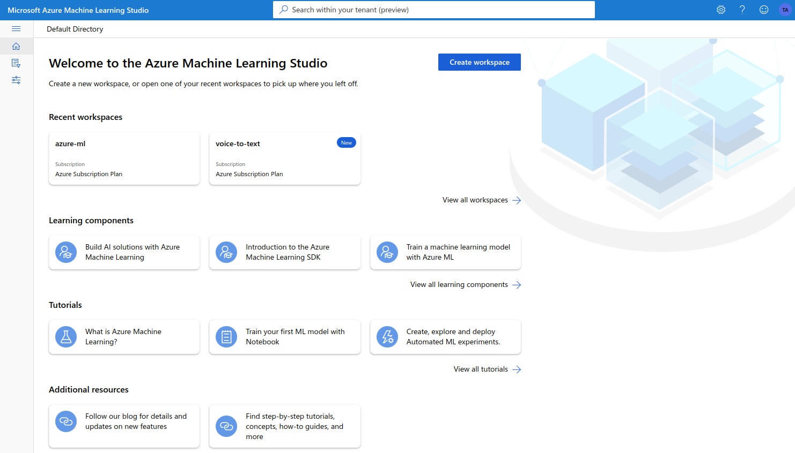

Here we can create a new **Workspace**, if we don't already have one:

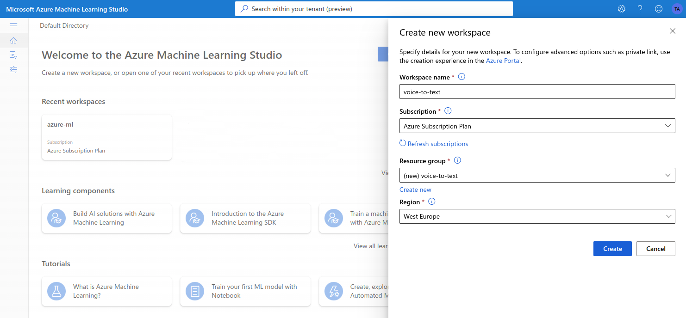

When we enter the workspace we want to use, a page with an overview and quick actions is shown:

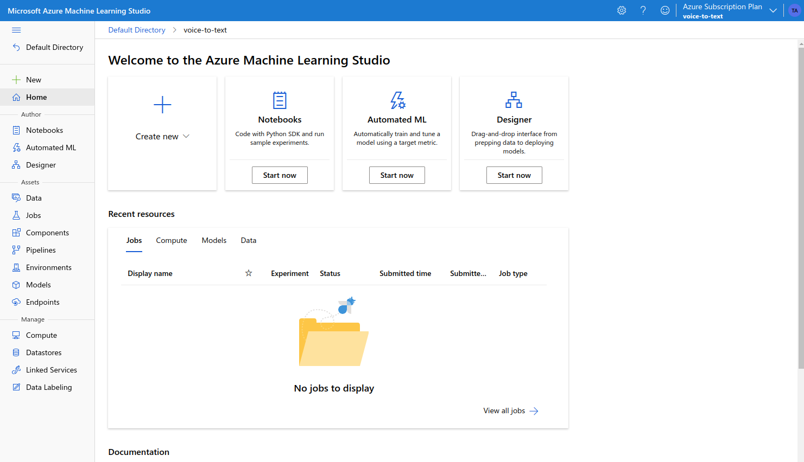

### Jupyter Notebooks

On the workspace overview page there are a couple of quick actions to choose from. I think **Notebooks** can be a good starting point. Notebooks allows us to work with a custom version of [Jupyter Notebook](https://jupyter.org/), a tool which should be familiar for most people involved with ML projects.

On the [Notebooks page](https://ml.azure.com/fileexplorerAzNB), we can either choose to create a new notebook, or to an upload existing one. I went ahead and created a new notebook, as I wanted to experiment with the Wave2Vec 2.0 model.

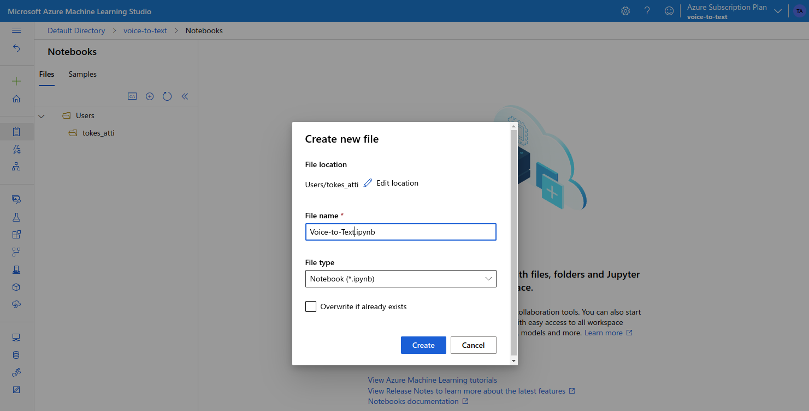

The _"Wave2vec 2.0 Demo"_ notebook I used can be found [here](https://github.com/attila-tokes/edge-impulse-expert-projects/blob/main/azure-ml-voice-to-text/cloudml/notebooks/Voice-to-Text.ipynb).

The Notebooks interface is similar to that of a standard Jupyter install, but to run code we need an [**Azure Compute Instance**](https://docs.microsoft.com/en-us/azure/machine-learning/concept-compute-instance):

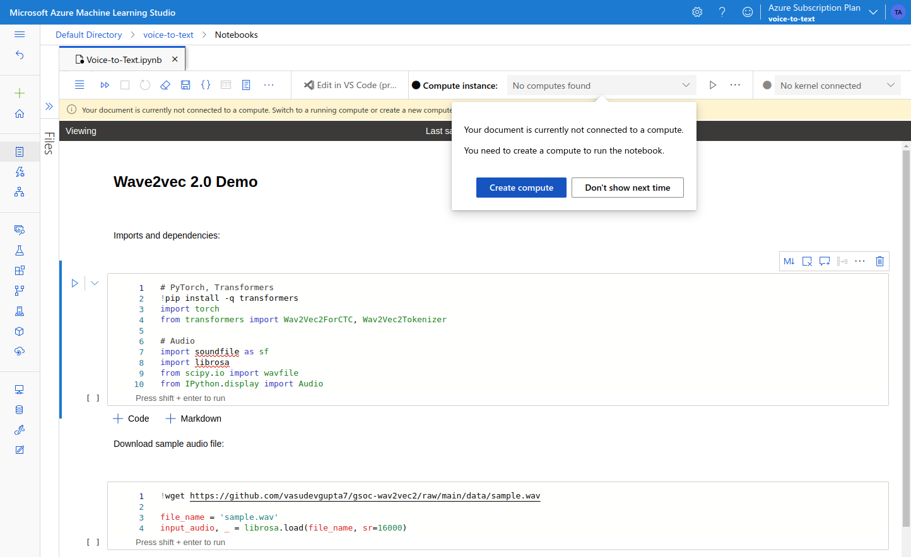

The compute instance can be created on-the-fly when we try to run the notebook:

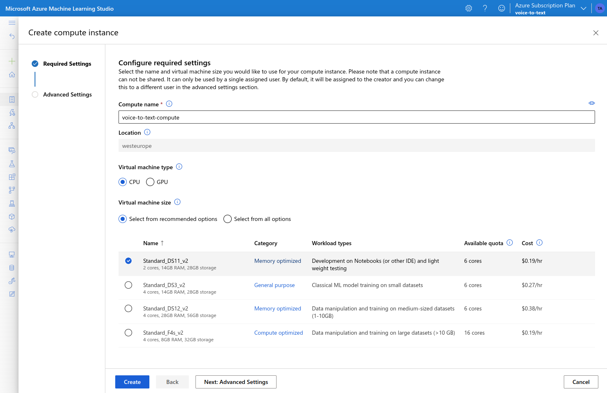

_(note: choosing the smallest and cheapest options should be sufficient)_

It takes a couple of seconds for the instance to be started, after which we should be able to run the demo. What it does is:

* downloads a sample audio file (WAV), with a person saying: _"She had your duck soup and greasy washwater all year"_
* downloads a pre-trained version of the Wave2Vec 2.0 model (`wav2vec2-base-960h`)
* runs the model on the sample audio file, and shows us the resulting transcript

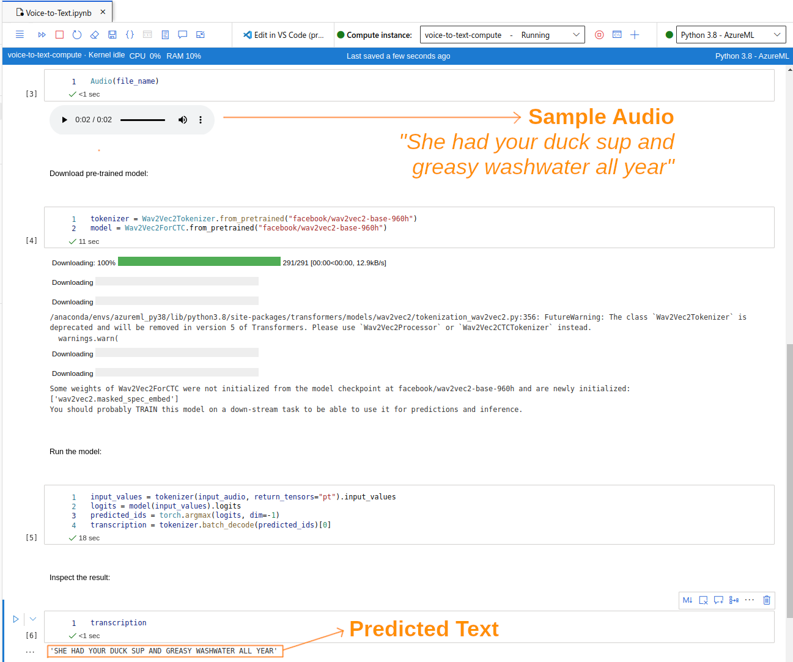

### ML Endpoints

Notebooks are a good way for experimenting with ML models. But, in order to make use of the functionality offered by the model, we need a way to expose the model for consumption by other components.

One way to do this is by using [**Azure Machine Learning Endpoints**](https://docs.microsoft.com/en-us/azure/machine-learning/concept-endpoints). Endpoints allows us to expose ML functionality over HTTPS endpoints, with features like SSL termination, authentication, DNS names and canary releases provided out-of-the-box.

In order to deploy an ML Endpoint we need to setup two things: a [**Model**](https://docs.microsoft.com/en-us/azure/machine-learning/concept-train-machine-learning-model) and an [**Environment**](https://docs.microsoft.com/en-us/azure/machine-learning/how-to-use-environments).

The **Model** contains a machine learning model packaged in some form. Supported formats are [Score Model](https://docs.microsoft.com/en-us/azure/machine-learning/component-reference/score-model), [MLFlow](https://mlflow.org/) and [Triton](https://github.com/triton-inference-server/server). The **Score Model** is the easiest option to implement. All we need is a Python _"scoring file"_ of the following form:

```py
# The init() is called once at start-up
def init():
    # ... initialize model ...
   
# The run() method is called each time a request is made to the scoring API.
@input_schema(...)
@output_schema(...)
def run(data):    
    # ... run inference, and return the result ...
```

Using this file Azure ML will create a simple web server that exposes a `/score` endpoint. This endpoint can be accessed using a simple HTTP call.

The scoring file for our voice-to-text application can be found in the `scoring-func/score_audio.py` file.

We can upload this to Azure ML from the [Models](https://ml.azure.com/model/list) page:

* first we need to select the _"Custom"_ model type, and upload the `scoring-func` folder


* then we choose a name

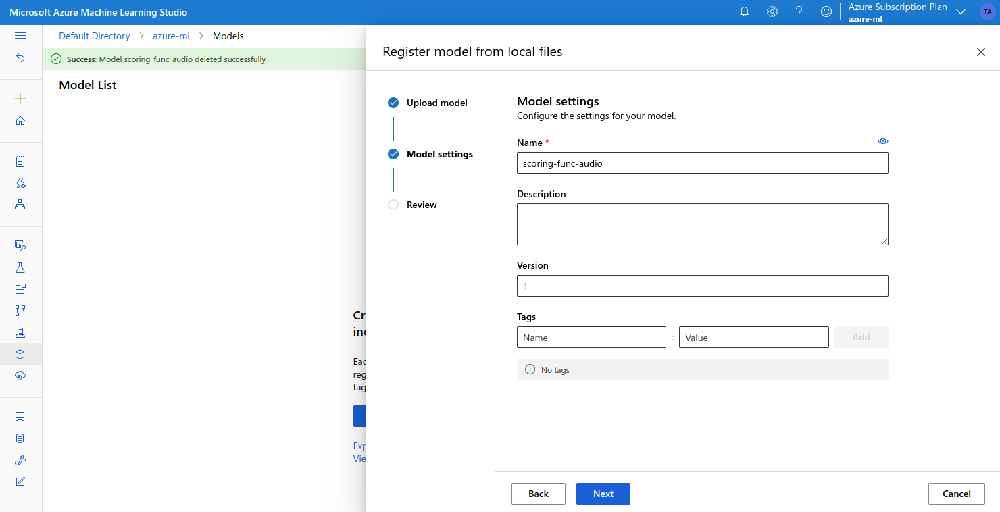

* and register the model

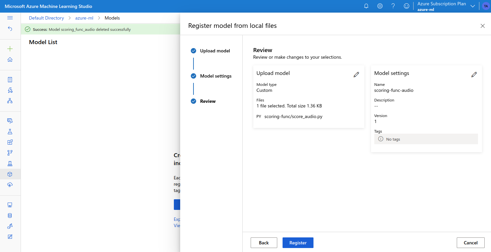

Next we need an **Environment** in which the model can run. The Environment will define aspects such as the OS, Python version, and libraries installed in the Docker container where the Model will run.

There are two types of models we can use:

* **Curated Environments** - these are ready-to-use environments created by Microsoft, and they have popular ML frameworks like TensorFlow or PyTorch pre-installed
* **Custom Environments** - can be used we need custom libraries, or something that is not already present in the curated environments

As our model uses custom Python libraries like `transformers`, we need a Custom Environment. This can be created from the [Environments](https://ml.azure.com/environments) page. We can choose to start from a Curated Environment, or we can use our own `Dockerfile`. After multiple tries, I ended up creating a Custom Environment based on the `mcr.microsoft.com/azureml/pytorch-1.10-ubuntu18.04-py37-cpu-inference` image.

This is PyTorch based image, supporting only CPU inference. It also has Python 3.7 and the `transformers` library installed.

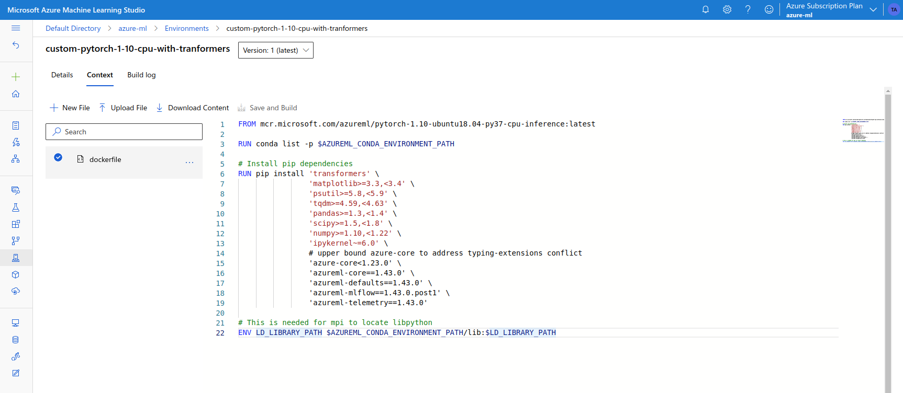

After this we should be ready to create an **Endpoint**. In the [Endpoints](https://ml.azure.com/endpoints) page we need to do the following:

* choose a name, the compute type _"Managed"_, and _"Key-based authentication"_

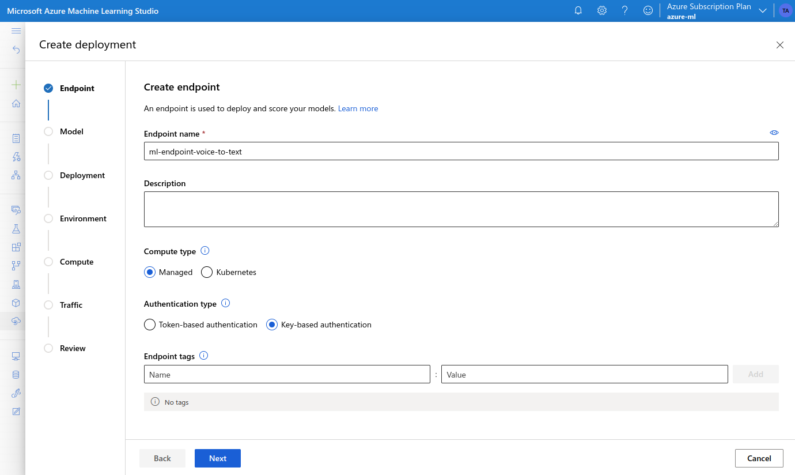

* select the model we created earlier

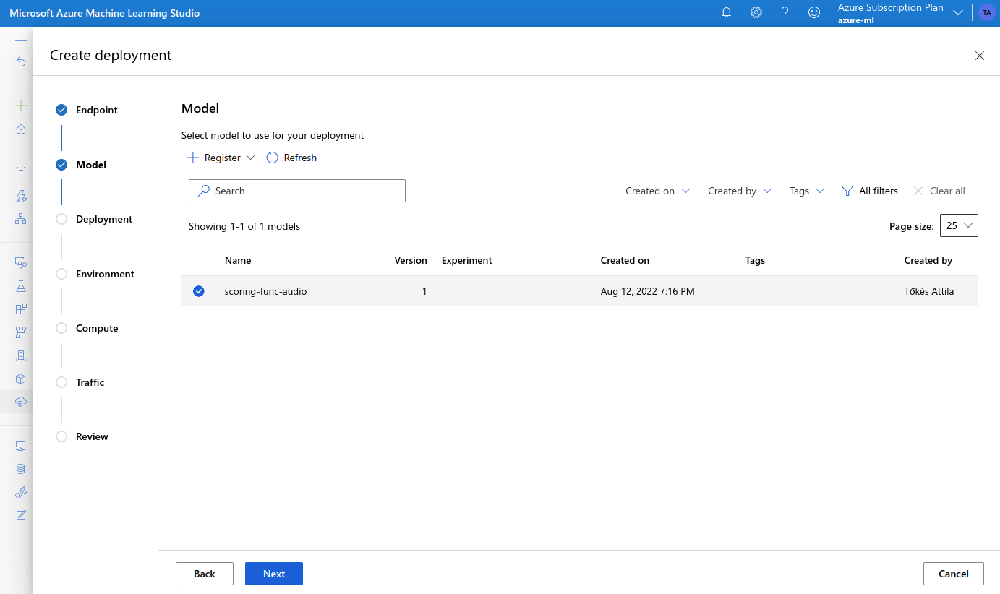

* on the Environment page we select our Custom Environment

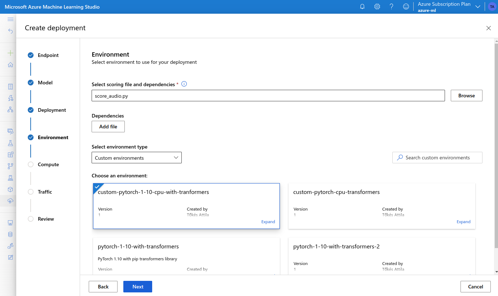

* choose a VM type, and set the Instance count to 1

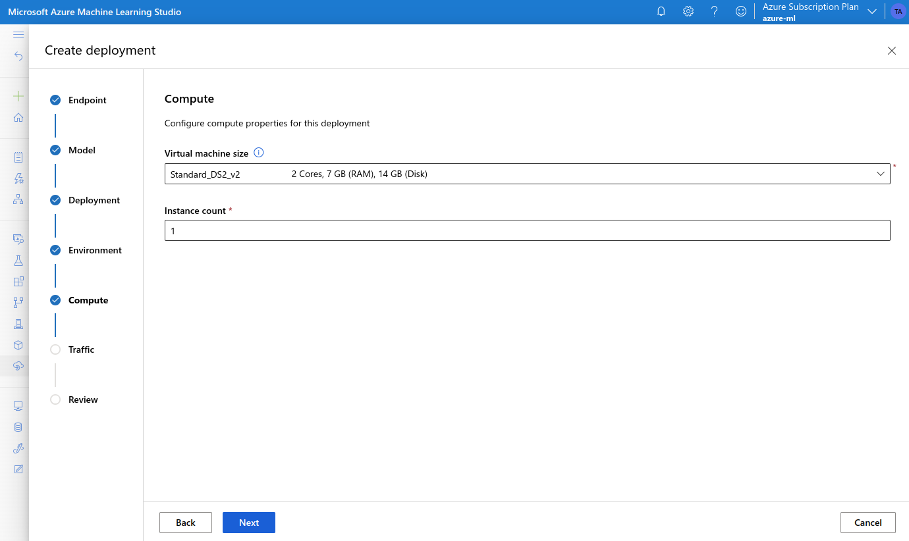

* review and confirm the settings, and click **Create**

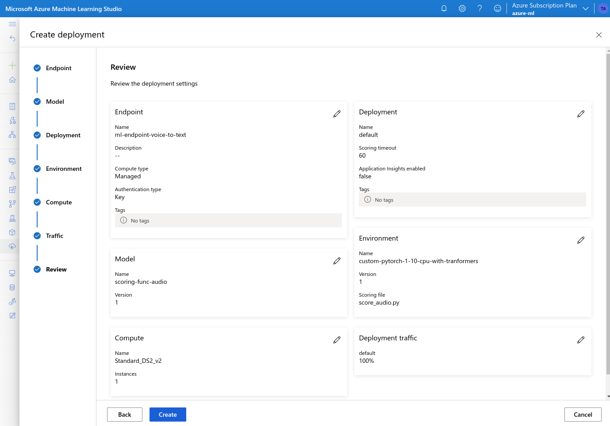

The provisioning of our endpoint will take a couple of minutes. When the endpoint is ready it should like something like:

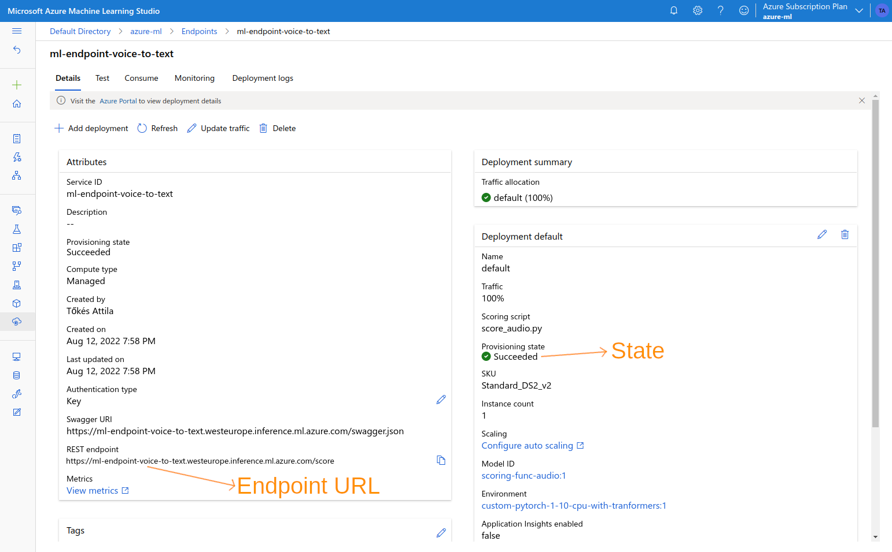

In order to consume the endpoint, we need to take note of the "REST endpoint" listed above, and as well the API Key from the **Consume** page:

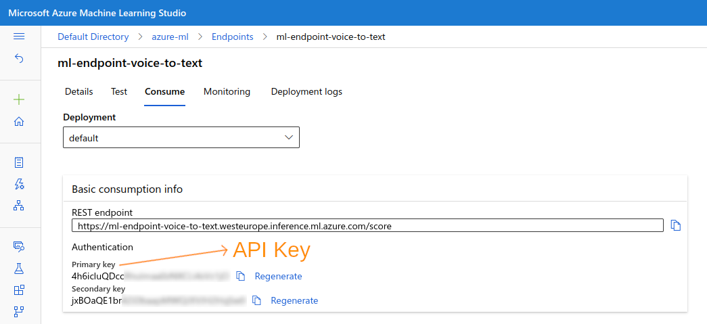

Using these two pieces, we should now be able to make HTTP calls to our ML endpoint:

```
POST /score HTTP/1.1
Host: <name>.<region>.inference.ml.azure.com
Authorization: Bearer <api-key>
...
<data>
```

The endpoint accepts audio input as a numeric array in the `data` field. To call it with a real audio file we can use a client side Python script like this:

```python
from scipy.io import wavfile
import requests
import librosa

# Read audio file
file_name = 'sample.wav'
input_audio, _ = librosa.load(file_name, sr=16000)

# Make request to the Azure ML endpoint
r = requests.post('https://ml-endpoint-voice-to-text.westeurope.inference.ml.azure.com/score',
             json={"data": input_audio.tolist()}, headers={"Authorization":"Bearer 4h6ic..."})

print("Status code: %d" % r.status_code)
print("Result: %s" % r.json())
```

This should produce the same result as the one seen in the Jupyter notebook example:

```bash
$ python3 sample-client.py

Status code: 200
Result: {'result': 'SHE HAD YOUR DUCK SOUP AND GREASY WASHWATER ALL YEAR'}
```

In the Monitoring tab we can see metrics like Request count and latency:

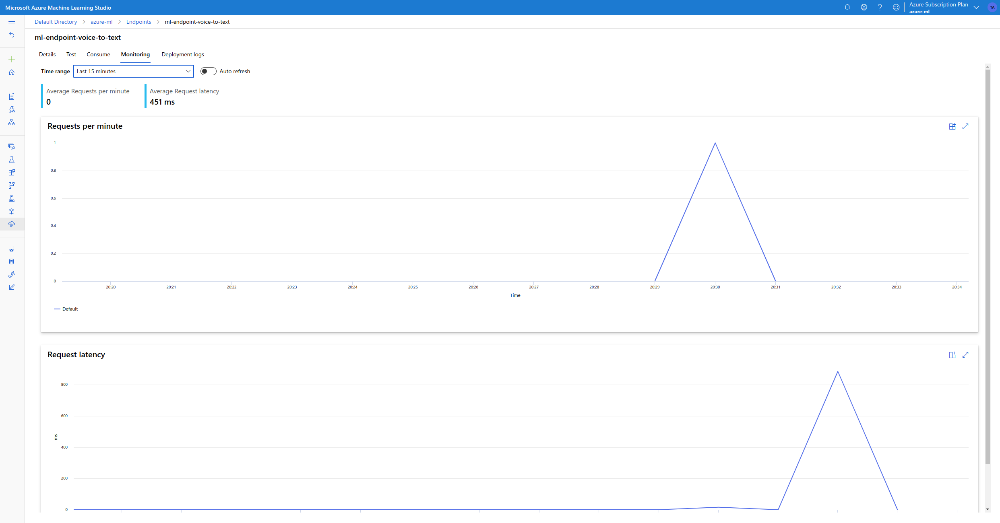

### Kubernetes Compute

Up to this point, we have used the **Managed Compute Instances / Clusters** with Azure ML. Managed Compute Instances are Azure VM instances with lifecycle, OS updates, and software stacks fully managed by Azure. When using Managed Compute Instances we are able to select the VM instance type and size. Clusters can have either a fixed number of VM instances, or varying number of VM instances managed by auto-scaling functionality. Virtual Machines with dedicated GPUs are also supported.

Along with Managed Compute Instances, Azure ML also supports several other instance types. The most notable is [**Kubernetes**](https://kubernetes.io/) based compute clusters. Kubernetes is a widely used open-source container orchestration system. It supports automatic deployment, scaling and management of container based application. Thus, it is a great choice for cloud-based systems.

Azure ML supports two types of Kubernetes compute clusters:

* [**Azure Kubernetes Service (AKS)**](https://azure.microsoft.com/en-us/services/kubernetes-service/#overview) cluster - these are fully managed clusters offered by Azure
* [**Azure Arc**](https://azure.microsoft.com/en-us/services/azure-arc/#product-overview) enabled Kubernetes clusters - these are customer managed clusters connected to Azure via Arc

Running machine learning workloads on an already existing Kubernetes cluster can have many advantages, such as better resource utilization and scalability. On the other hand, setting up a Kubernetes compute cluster is not as easy, so using a managed solution can be helpful.

To set a Kubernetes compute in Azure ML, first we need to install the Azure Kubernetes ML Extension to our K8S cluster. For this project, I used a Azure Kubernetes Service (AKS cluster) which looked like this:

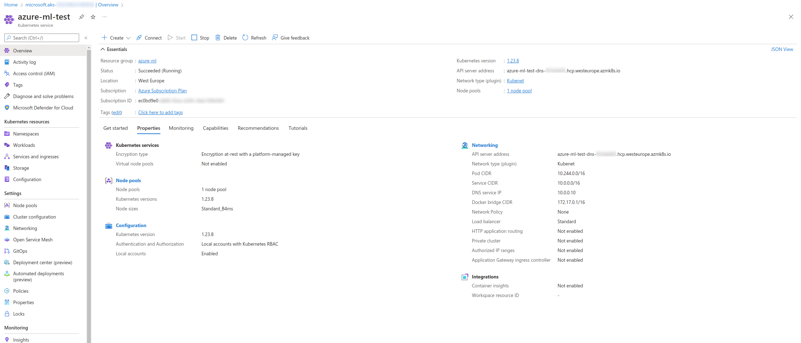

The Azure ML Extension can be installed using Azure CLI, by running the following command:

```
$ az k8s-extension create --name <cluster-name> --extension-type Microsoft.AzureML.Kubernetes --config enableTraining=True enableInference=True inferenceRouterServiceType=LoadBalancer allowInsecureConnections=True inferenceLoadBalancerHA=False --cluster-type managedClusters --cluster-name <cluster-name> --resource-group <resource-group> --scope cluster
```

After the extension is installed successfully, the Kubernetes clusters can be attached to Azure ML from the [Compute](https://ml.azure.com/compute/) view: 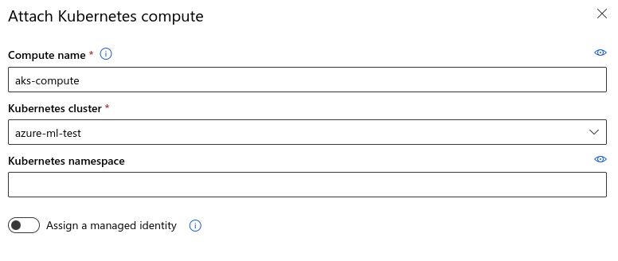

The attached Kubernetes Compute then can be used to create Endpoints with Kubernetes compute type: 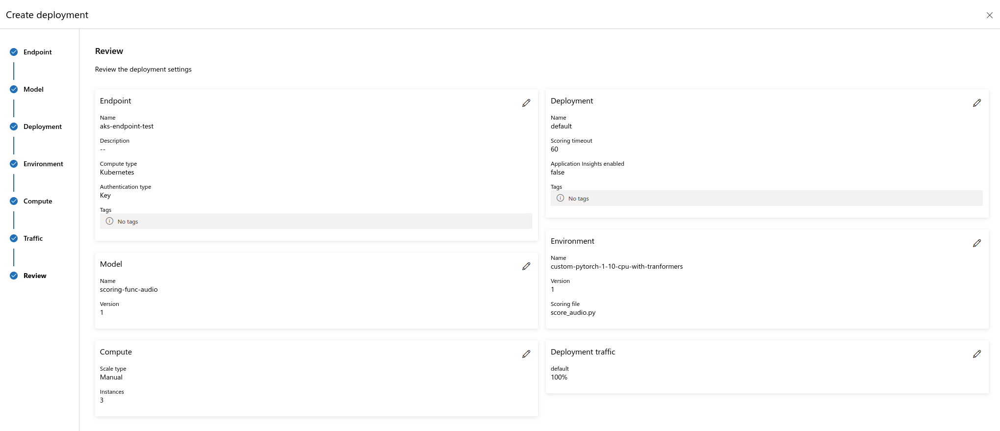

The deployed ML Endpoint will look and work similar to one with managed compute type: 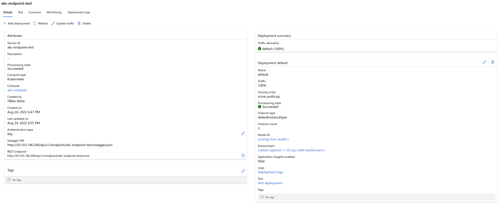

Using a `kubectl` CLI tool we can also see what resource Azure ML deployed in our Kubernetes Cluster: 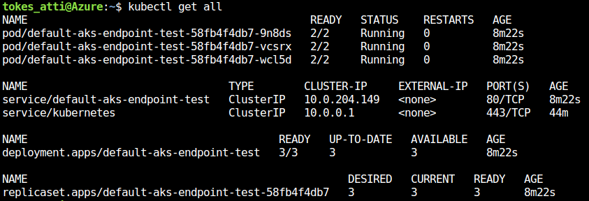

### Azure ML CLI & SDK

**Azure ML Studio** offers a good visual UI for creating and managing Azure ML resources. For people using Azure ML for the first time, it offers a great overview of how to get started and what features are available on the platform.

Additionally, Azure ML also has a **CLI**, and **Python SDK** for direct interaction from a console and code:

> _What is Azure Machine Learning CLI & Python SDK v2?_\
> _https://docs.microsoft.com/en-us/azure/machine-learning/concept-v2_

The Azure ML CLI and Python SDK enable engineers the use [**MLOps**](https://en.wikipedia.org/wiki/MLOps) techniques. Similar to DevOps, MLOps is a set of practices that allows the reliable and efficient management of AI / ML application lifecycle. It enables processes like:

* deployment automation
* consistent and repeatable deployment
* ability to create / manage / deploy resources programmatically
* continuous integration and development (CI/CD)

## Edge ML with Edge Impulse

[**Edge Impulse**](https://www.edgeimpulse.com/) is the leading development platform for Edge Machine Learning (Edge ML). It enables the creation of smart solutions via efficient machine learning models running on edge devices.

As a demonstration we will implement a voice-to-text application on a Raspberry Pi. The solution will feature a **keyword spotting** model implemented with **Edge Impulse**, as as well the Cloud ML endpoint we created in the previous section.

### Hardware

The hardware we will use is a **Raspberry Pi 4 (2GB)** development board, along with a Logitech USB headset used as the microphone input.


The **Raspberry Pi 4** is a relatively low power single board computer, popular among makers. It is a [fully supported Edge Impulse development board](https://docs.edgeimpulse.com/docs/development-platforms/fully-supported-development-boards). As a note, we are using a Raspberry Pi 4 mostly for convenience. The project probably could be implemented on any of the supported development boards with a microphone and Internet connectivity. The tools / programming languages may differ.

The **Raspberry Pi 4** can be set up the standard way. The Raspberry Pi OS is flashed to an SD Card, then we set up network connectivity / Wifi and SSH access. The official documentation describes in great details how to do this:

> _**Setting up your Raspberry Pi**_\
> _https://projects.raspberrypi.org/en/projects/raspberry-pi-setting-up/0_

Next, there are couple steps to be done in order to connect the device to EdgeImpulse. The goal is to install the `edge-impulse-linux` utility, which can be done as follows:

```
$ curl -sL https://deb.nodesource.com/setup_14.x | sudo bash -
$ sudo apt install -y gcc g++ make build-essential nodejs sox gstreamer1.0-tools gstreamer1.0-plugins-good gstreamer1.0-plugins-base gstreamer1.0-plugins-base-apps
$ npm config set user root && sudo npm install edge-impulse-linux -g --unsafe-perm
```

After running these commands, we should be able to connect to Edge Impulse Studio by running:

```
$ edge-impulse-linux --disable-camera
```

The full set of instructions can be found in the [official guide](https://docs.edgeimpulse.com/docs/development-platforms/officially-supported-cpu-gpu-targets/raspberry-pi-4).

### Audio Project with Raspberry Pi

Next, we can login to the [**Edge Impulse Studio**](https://studio.edgeimpulse.com/), and create a new project:

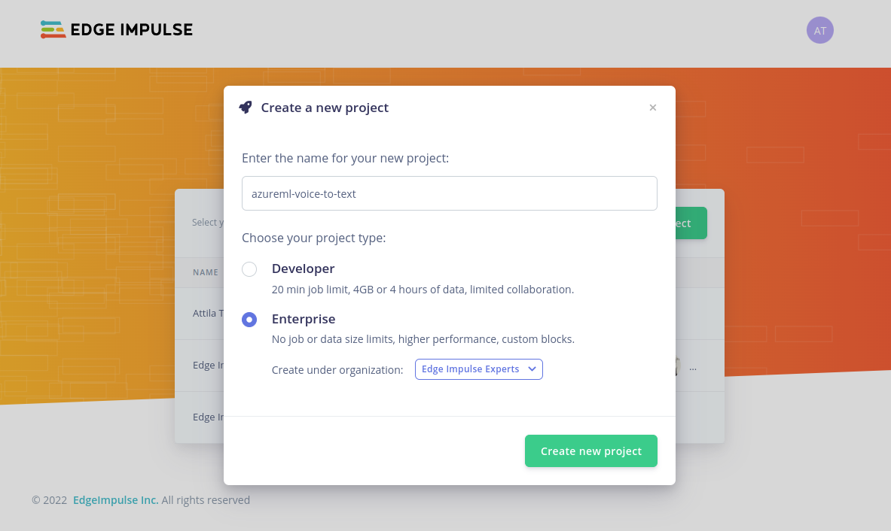

and select the Audio project template

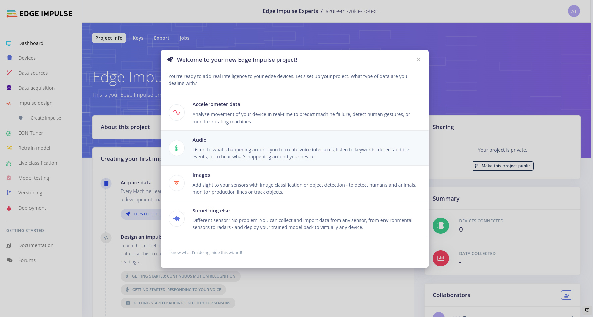

At this point, among other things, Studio offers us to connect a device to this project.

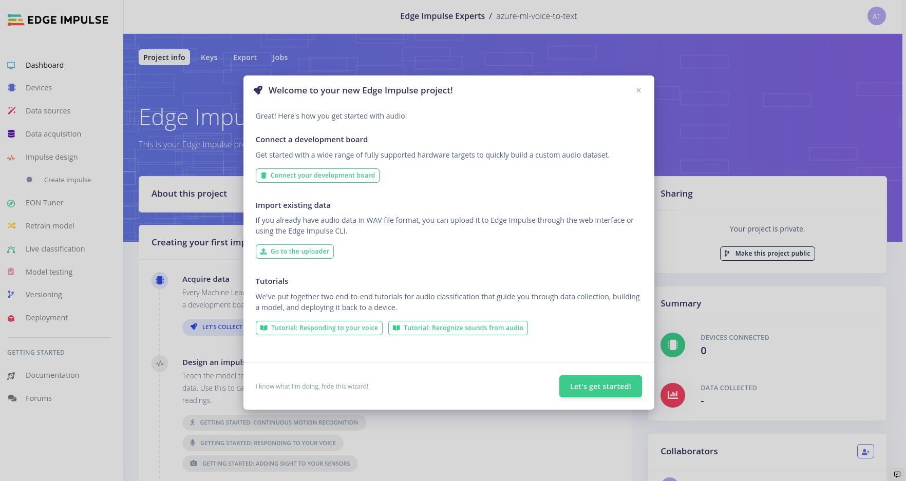

After we select _"Connect your development board"_, we need to launch `edge-impulse-linux` on the Raspberry Pi:

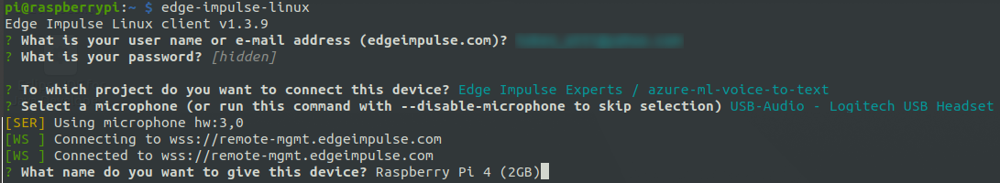

The tool asks us to login to Edge Impulse, select a project and a microphone to be used. After completing these steps the device should show up the in the Devices tab:

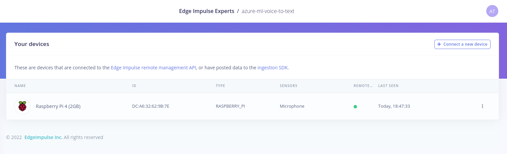

### Data Collection

Now we can start building our **keyword spotting** model. Edge Impulse has a great tutorial on this:

> _**Responding to your voice** https://docs.edgeimpulse.com/docs/tutorials/responding-to-your-voice_

The first step in training a keyword spotting model is to collect a set of samples of the word we want to detect. This can be done in the Data Acquisition tab:

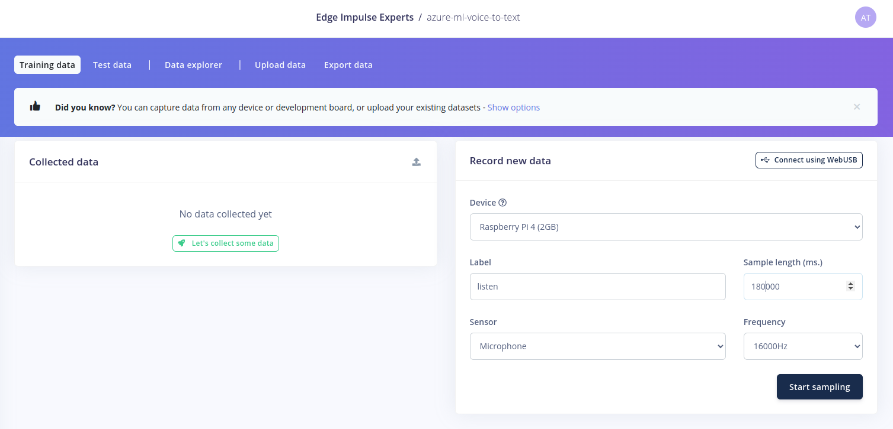

In our case the word we want to detect is "Listen!", so I collected about 3 minutes of audio data, which contained about \~ 130 samples of the word "Listen!":


Initially the data collection produces a single sample. This needs to be split up, so that each sample contains one instance of the word. Fortunately, this is easily done by selecting the Split Sample option from the context menu:

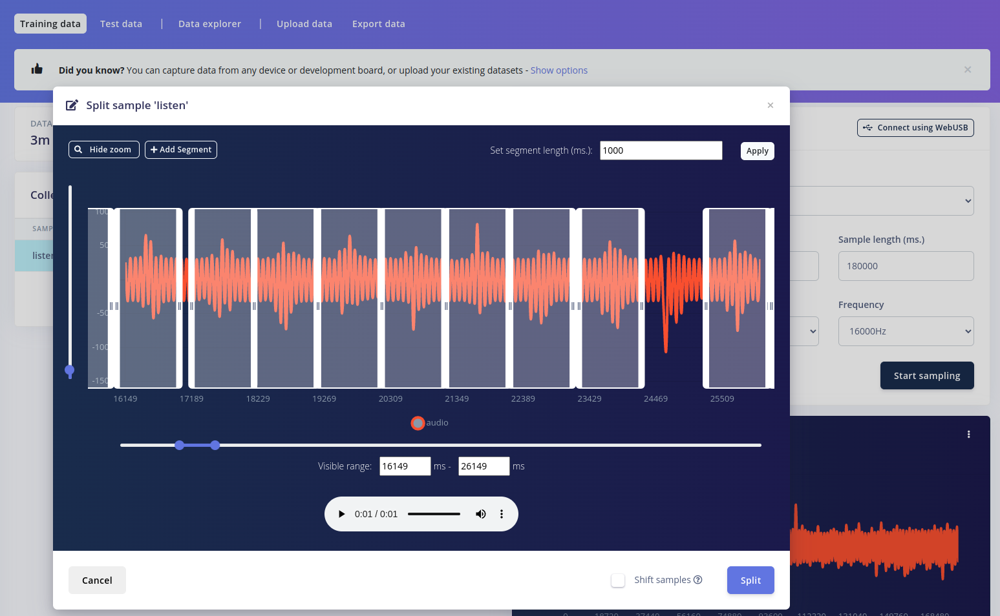

As a note, I ended up re-doing the data acquisition process, as I realized the recorded audio had a 50Hz mains interference noise picked up from the power supply of the Raspberry Pi. To fix this, I switched to using a power bank instead of a wall power supply and re-did the data collection.

Along with the recorded keyword samples, we will also need some sample for other categories such as _"Noise"_ and _"Unknown"_ words. Luckily Edge Impulse already has a pre-built [keyword spotting dataset](https://docs.edgeimpulse.com/docs/pre-built-datasets/keyword-spotting), which contains samples for these classes.

To use these samples we can:

* download the dataset to the Raspberry Pi

```
$ wget https://cdn.edgeimpulse.com/datasets/keywords2.zip
$ unzip keywords2.zip
```

* reduce the number of samples to about \~130 per class _(so that it matches the `Listen!` samples we have)_:

```
$ find noise/ | sort -R | tail +130 | xargs -n 1 -I % rm %
$ find unknown/ | sort -R | tail +130 | xargs -n 1 -I % rm %
```

* use the [Edge Impulse Uploader](https://docs.edgeimpulse.com/docs/edge-impulse-cli/cli-uploader) tool to upload the samples to our project:

```
$ edge-impulse-uploader --label noise --category split noise/*.wav
$ edge-impulse-uploader --label unknown --category split unknown/*.wav
```

The samples should appear in Edge Impulse, and we should see that samples for the 3 classes (`listen`, `noise`, `unknown`) are evenly distributed:


### Training a Keyword Spotting Model

At this point our dataset is complete, and we can start building and training an ML pipeline / Impulse. This is relatively easy, as we can create an Impulse containing:

* a [Time series data](https://docs.edgeimpulse.com/docs/edge-impulse-studio/impulse-design#input-block) input with windows size of 1 sec
* an [Audio MFCC](https://docs.edgeimpulse.com/docs/edge-impulse-studio/processing-blocks/audio-mfcc) processing block, which extracts cepstral coefficients from the audio data
* a [Classification (Keras)](https://docs.edgeimpulse.com/docs/edge-impulse-studio/learning-blocks/classification) neural network based learning block
* an Output block for our 3 classes

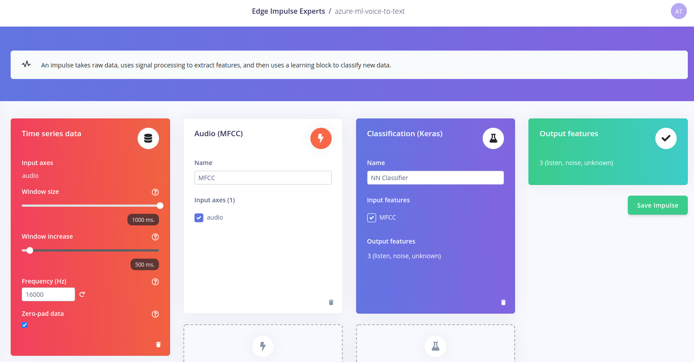

The [**MFCC **_**(Mel Frequency Cepstral Coefficients)**_](https://docs.edgeimpulse.com/docs/edge-impulse-studio/processing-blocks/audio-mfcc) block extracts coefficients from an audio signal. For keyword spotting, training it with the default parameters usually works:

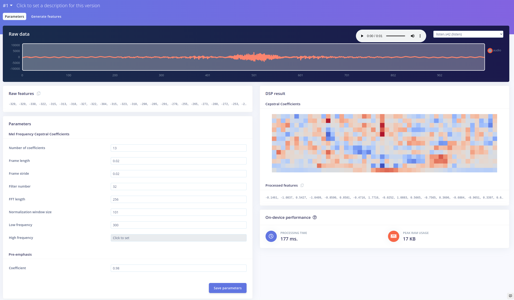

The [**NN Classifier**](https://docs.edgeimpulse.com/docs/edge-impulse-studio/learning-blocks/classification) block is a neural network classifier, that takes the cepstral coefficients produced by the MFCC block, and tries to predict our 3 classes from it. We can train it with the default setting, but we also have the possibility to add some noise and randomness to the inputs:

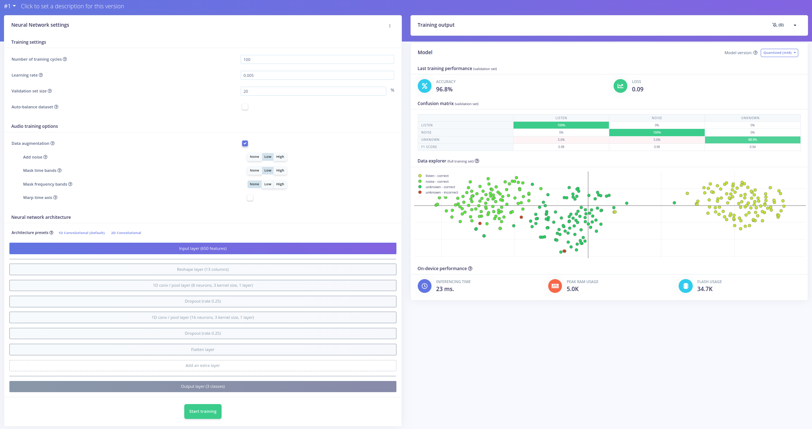

The overall accuracy I got is 96.8%, which is pretty good. In the Data Explorer section we can see that sample of our keyword (`listen`) are clearly separated from the `unknown` and `noise` samples.

Our Impulse at this point is ready to be used. We can try it out in the Live classification tab.

### Raspberry Pi Deployment

The next step is to deploy the model as a standalone app on the Raspberry Pi. One way to do this is to use the `edge-impulse-linux-runner` app.

The `edge-impulse-linux-runner` tool automatically downloads and optimizes the model for the Raspberry Pi. Then it runs a sample app that continuously analyses the input audio, and gives the probabilities of the predicted classes:

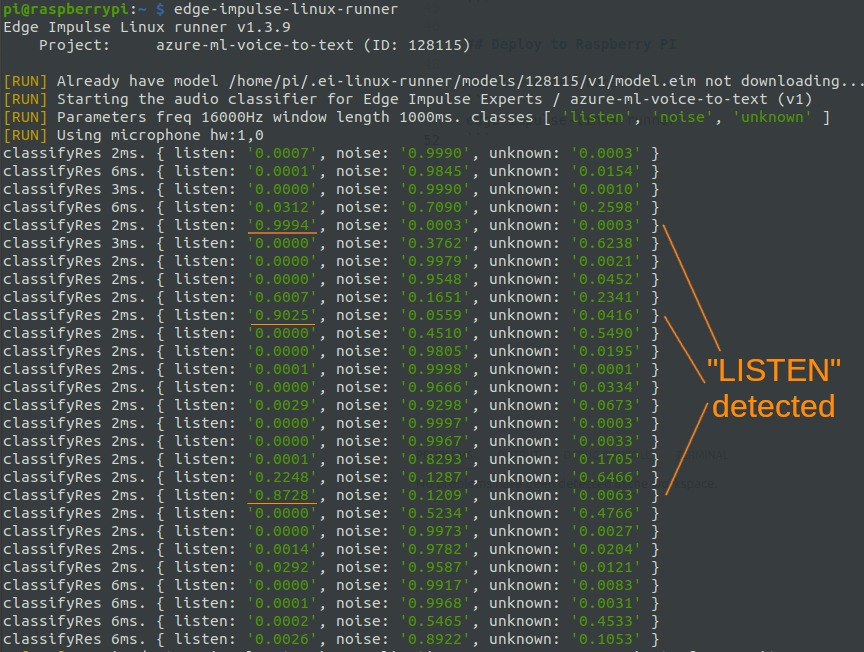

If we want to modify / extend this application we can make use of the [**Edge Impulse SDKs**](https://docs.edgeimpulse.com/docs/edge-impulse-for-linux/edge-impulse-for-linux) offered for Linux development boards. I opted for the Python SDK, which can be installed on the Raspberry Pi as follows:

```
$ sudo apt-get install libatlas-base-dev libportaudio2 libportaudiocpp0 portaudio19-dev
$ pip3 install edge_impulse_linux -i https://pypi.python.org/simple
$ pip3 install pyaudio
```

We can also get a set of examples by downloading the following GitHub repository:

```
$ git clone https://github.com/edgeimpulse/linux-sdk-python
```

An audio classification example app can found in the `examples/audio/classify.py` file. We can launch it as follows:

```
$ python3 linux-sdk-python/examples/audio/classify.py  /home/pi/.ei-linux-runner/models/128115/v1/model.eim
```

### Cloud ML Integration

Now that we have the keyword spotting working, we can develop an app that also takes advantage of the Cloud ML functionality. So, using the Python SDK I created a simple app that does the following:

* detects the _"Listen!"_ keyword using the Edge Impulse model
* when the keyword is spotted, records a couple seconds of audio
* sends the recorded audio to the Cloud ML endpoint for voice-to-text transformation
* displays the result / decoded text

This is what the output of the app looks like:

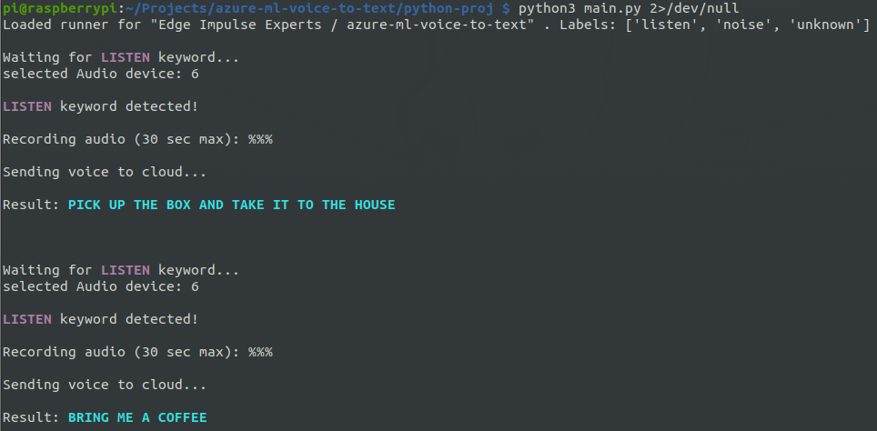

The app is built up from the following Python classes / files:

* `EdgeML` / _`edgeml.py`_ - responsible for running the keyword spotting model, until a given keyword is detected
* `Audio` / _`audio.py`_ - contains the audio recording functionality, with silence detection
* `CloudML` / _`cloudml.py`_ - responsible for talking to the Cloud ML endpoint
* `main.py` - the entry point of the app, with a control loop linking the above parts together

The source code of the app can be found in the `edgeml/python-app/` folder.

## Conclusions

Using a combination of **Edge ML** and **Cloud ML** enables the creation of smart solutions with advanced functionality on low power edge devices. Edge ML is great for simpler tasks such as audio and signal processing, while Cloud ML enables the addition of more advanced functionality that would not otherwise be possible on edge devices.

Platforms like **Edge Impulse** and **Azure ML** enable developers to create machine learning solutions, without the need for deep knowledge of machine learning architectures and frameworks.

## References

1. Azure Machine Learning Documentation: https://docs.microsoft.com/en-us/azure/machine-learning/
2. Edge Impulse Documentation: https://docs.edgeimpulse.com/docs/
3. Wav2vec 2.0: Learning the structure of speech from raw audio: https://ai.facebook.com/blog/wav2vec-20-learning-the-structure-of-speech-from-raw-audio/
4. Realizing Machine Learning anywhere with Azure Kubernetes Service and Arc-enabled Machine Learning: https://techcommunity.microsoft.com/t5/azure-arc-blog/realizing-machine-learning-anywhere-with-azure-kubernetes/ba-p/3470783
