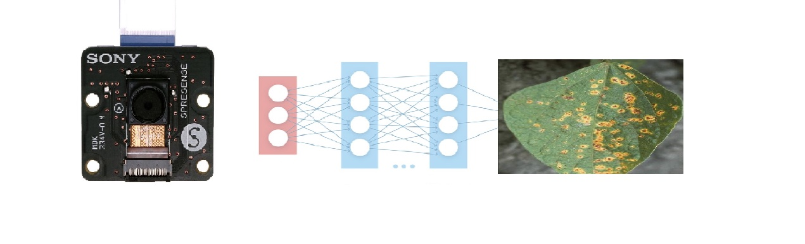
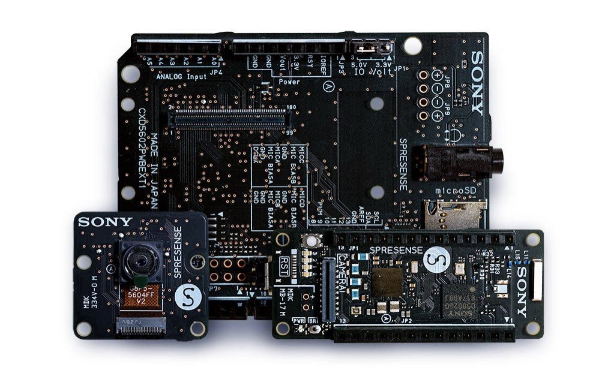
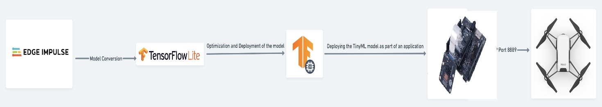
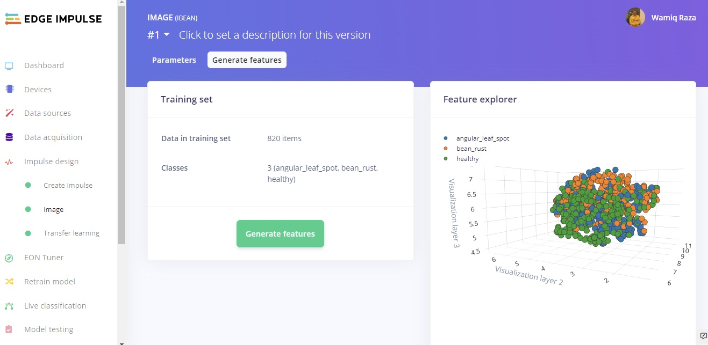
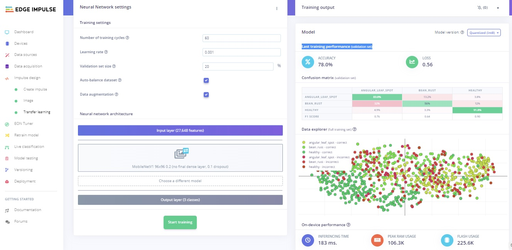
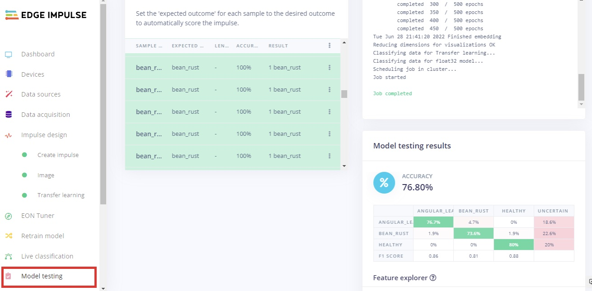
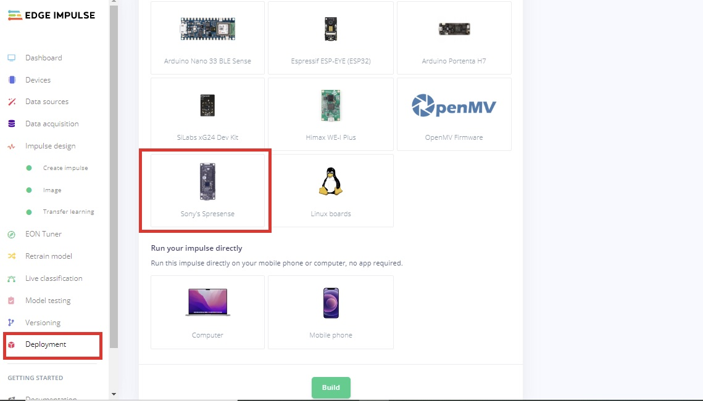
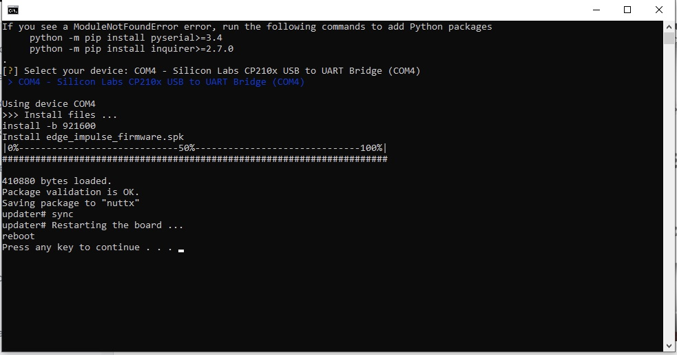

# Bean Leaf Disease Classification Using Sony Spresense 

Created By:
Wamiq Raza 

Public Project Link:
[https://studio.edgeimpulse.com/public/119787/latest](https://studio.edgeimpulse.com/public/119787/latest)

## Project Demo



## Introduction

Modern technology has enabled human civilization to generate enough food to feed more than 7 billion people. Nevertheless, food security continues to be challenged by a variety of reasons, including climate change, disease etc. Plant leaf diseases have become a widespread issue, necessitating precise study and the quick use of deep learning in plant disease classification. Beans are also one of the most essential plants that are utilized in cuisine across the world, whether dried or fresh. There are several illnesses connected with beans leaves that impede productivity, including angular leaf spot disease and bean rust disease.

To treat the problem at an early stage, a precise classification of bean leaf diseases is required. In this project, using a public collection of leaf images, a TinyML integration with UAVs strategy is presented to discover and categorize bean leaf disease. The model was train on 450 images and tested on 150 images of bean leaf, the obtained results showed that our model achieves better classification performance for beans leaf disease.

### Things used in this project

Hardware components
 - [Spresense main boards](https://developer.sony.com/develop/spresense/) x 1
 - Extension board x 1
 - Spresense camera x 1
 - USB micro cable x 1
 - UAVs x 1

Software
 - Edge Impulse Studio

## Background

The computerized categorization of illnesses using photographs has piqued the interest of academics in recent years. Despite these efforts, these diseases continue to pose a significant threat to sustainable agriculture. Furthermore, there is still a significant need for a serious procedure carried out by a large team of specialists to continuously monitor these diseases for early stages, since most current disease classification and detection methodology relies solely on specialist visual assessment for detecting plant diseases. Several research have been conducted employing deep learning-based models for the classification and detection of plant leaf diseases in various crop species.

## Dataset Description

The dataset is of leaf images taken in the field in different districts in Uganda by the Makerere AI Lab in collaboration with the National Crops Resources Research Institute (NaCRRI), the national body in charge of research in agriculture in Uganda [1]. Figure 1 shows an example of each of three classes and their corresponding label. The data is of leaf images representing 3 classes: the healthy class of images, and two disease classes including Angular Leaf Spot and Bean Rust diseases. In total 600 images were taken from the dataset; 200 images for each class.

## Hardware and Connectivity Description

The Sony Spresense main board, Extension board, Spresense camera, a USB-micro cable, and UAVs were used in this project. The Sony Spresense is a small, but powerful development board with a 6 core Cortex-M4F microcontroller and integrated GPS, and a wide variety of add-on modules including an extension board with headphone jack, SD card slot and microphone pins, a camera board, a sensor board with accelerometer, pressure, and geomagnetism sensors, and Wi-Fi board - and it's fully supported by Edge Impulse [2].
 
Drones, in the form of both Remotely Piloted Aerial Systems (RPAS) and unmanned aerial vehicles (UAV), are increasingly being used to revolutionize many existing applications. The Internet of Things (IoT) is becoming more ubiquitous every day, thanks to the widespread adoption and integration of mobile robots into IoT ecosystems [3]. As a basis for the development of our autonomous system, the [DJI Tello](https://store.dji.com/product/tello?vid=38421) was chosen due to its easy programmability and wide availability. The Tello drone [4] has a maximum flight time of up to 13 minutes, a weight of about 80 g (with propellers and battery), and dimensions of 98 mm x 92.5 mm x 41 mm. It mounts 3-inch propellers and has a built-in WIFI 802.11n 2.4ghz module. As for the TinyML platform, the Sony Spresense microcontroller [5] was chosen, which acted as a decision unit shown in Figure 2. The platform is a small, low power microcontroller that enables the easy and intuitive implementation of image processing applications. It can be programmed using high-level Python scripts (MicroPython).

For connectivity I follow the same approach used in "Energy-Efficient Inference on the Edge Exploiting TinyML Capabilities for UAVs" [3] by the authors and the block diagram shown in Figure 3 represents the workflow. The only difference is that instead of the wireless connectivity, in this project the UAVs were integrated with the USB cable.

## Data Acquisition

First, on the Project Dashboard, we have set Labeling method to "Bounding boxes (object detection)" but in our case it was split into three different classes and no labeling was required. To add more images to the dataset, Edge Impulse has an [Uploader](https://docs.edgeimpulse.com/docs/edge-impulse-cli/cli-uploader#upload-data-from-the-studio) that enables different ways of adding data to your project.

## Impulse Design

Our dataset is ready to train our model. This requires two important features: a processing block and learning block. Documentation on Impulse Design can be found [here](https://docs.edgeimpulse.com/docs/edge-impulse-studio/create-impulse).

We first click "Create Impulse". Here, set image width and heigh to 96x96; and Resize mode to Squash. The Processing block is set to "Image" and the Learning block is "Transfer Learning (Images)". Click 'Save Impulse' to use this configuration. We have used a 96x96 image size to lower the RAM usage, shown in Figure 4.

Next, on the "Image" processing block, set Color depth to RGB. "Save parameters", and this will open the "Generate Features" tab. On the window 'Generate features', we click the "Generate features" button. Upon completion we see a 3D representation of our dataset. These is what will be passed into the neural network, and the visualization can be seen in Figure 5.

## Building and training the model

To train a model, MobileNetV1 96x96 0.2 algorithm was then used. As MobileNetV1 is a unique machine learning approach that extends object classification to devices with limited processing power, it allows you to count things, locate objects in an image, and track numerous objects in real time while consuming less computing power. Dataset visualization and separability of the classes is presented in Figure 6. Even after rescaling and color conversions, image features have a high dimensionality that prevents suitable visualization. Each image was resized to 96 x96 pixels, in addition to that, data augmentation technique was applied.

The number of epochs is the number of times the entire dataset is passed through the neural network during training. There is no ideal number for this, it depends on the data in total. The model was run for 60 epochs, with learning rate set to 0.001 with the dataset split into training, validation, and testing.

After introducing a dynamic quantization from a 32-bit floating point to an 8-bit integer, the resulting optimized model showed a significant reduction in size (106.3K). The onboard inference time was reduced to 183 msec and the use of RAM was limited to 225.6K, with an accuracy after the post-training validation of 78%. The model confusion matrix and on a mobile device performance can be seen in Figure 6.

## Model Testing

When training our model, we used 80% of the data in our dataset. The remaining 20% is used to test the accuracy of the model in classifying unseen data. We need to verify that our model has not overfit, by testing it on new data. If your model performs poorly, then it means that it overfit. Click "Model testing" then "classify all". Our current model has an accuracy of 76%, as can be seen in Figure 7.

## Model deployment on Sony Spresense

In order to deploy a model on a microcontroller we must build firmware using the Edge Impulse platform. Figure 8 represents the steps for the Sony Spresense with red bounding boxes. Impulses can be deployed as a C++ library and included in your own application, or full firmware with the model included can be downloaded. Choosing the firmware version, a Zip file is created and a download is generated.

After downloading, unzip the file, as shown in Figure 9. Click on the `flash` command that corresponds to your operating system.  In my case, this was Windows.


Go through this [post](https://docs.edgeimpulse.com/docs/development-platforms/officially-supported-mcu-targets/sony-spresense) from Edge Impulse official in order to know how to connect Sony Spresense to your computer.


A Terminal will open as shown in Figure 10. Wait for it to finish processing and flashing the board, then open a new Terminal and run the command `**edge-impulse-run-impulse –continuous**`. The prediction score for every class can be seen, as shown in Figure 11 and in the YouTube video.

## Conclusion

In this project, we build upon the approach used by the author of "Energy-Efficient Inference on the Edge Exploiting TinyML Capabilities for UAVs" to endow drones with a larger autonomy and intelligence thanks to the integration of a joint flight and mission control embedded system. Thanks to the adoption of a powerful lightweight processing architecture, a suitably designed ML inference engine and Edge Impulse, the system implemented an edge computing solution that enabled the achievement of sophisticated mission goals.

## References

[1] [https://github.com/AI-Lab-Makerere/ibean](https://github.com/AI-Lab-Makerere/ibean)

[2] [https://docs.edgeimpulse.com/docs/development-platforms/officially-supported-mcu-targets/sony-spresense](https://docs.edgeimpulse.com/docs/development-platforms/officially-supported-mcu-targets/sony-spresense)

[3] (PDF) [Energy-Efficient Inference on the Edge Exploiting TinyML Capabilities for UAVs](https://www.researchgate.net/publication/355781811_Energy-Efficient_Inference_on_the_Edge_Exploiting_TinyML_Capabilities_for_UAVs) (researchgate.net)

[4] RAZE. Tello. 2019. Available online: [https://www.ryzerobotics.com/kr/tello](https://www.ryzerobotics.com/kr/tello)  (accessed on 06 June 2022)

[5] [https://developer.sony.com/develop/spresense/buy-now](https://developer.sony.com/develop/spresense/buy-now)

