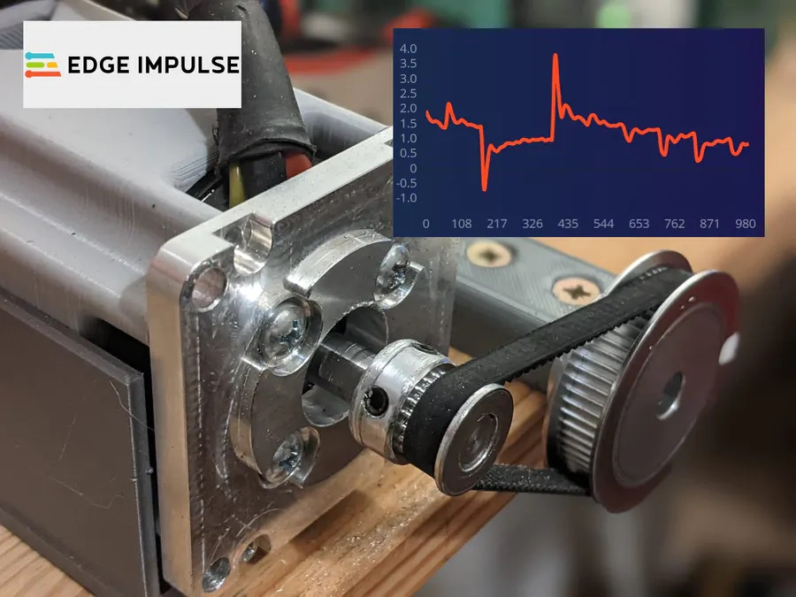

# Brushless DC motor anomaly detection

Created By:
Avi Brown 

Public Project Link:
[https://studio.edgeimpulse.com/public/84373/latest](https://studio.edgeimpulse.com/public/84373/latest)

## Background
