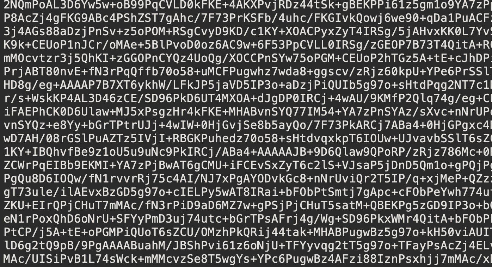
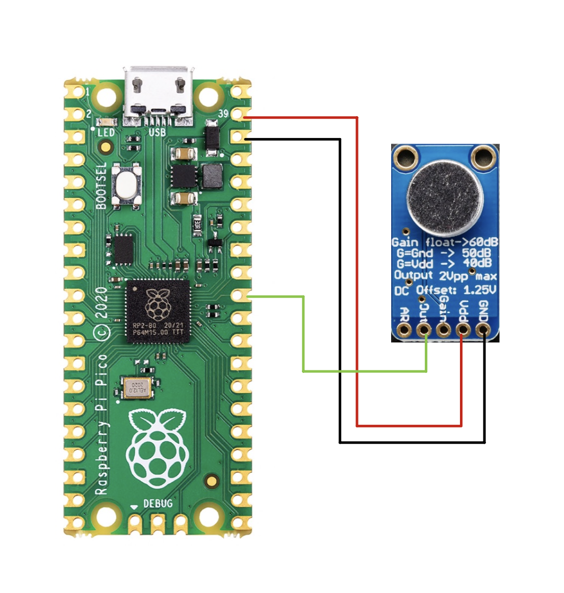

# Collect Data for Keyword Spotting with Raspberry Pi Pico and Edge Impulse

Created By:
[Alex Wulff](https://www.alexwulff.com/)

## Project Overview

Keyword spotting is an important use case for embedded machine learning. You can build a voice-activated system using nothing but a simple microcontroller! Since this use case is so important, Edge Impulse has [great documentation](https://www.edgeimpulse.com/blog/getting-started-wizard-train-your-first-keyword-spotting-model-in-under-5-minutes) on best practices for keyword spotting.

Edge Impulse also [now supports the Raspberry Pi Pico](https://www.edgeimpulse.com/blog/announcing-official-support-for-the-raspberry-pi-pico-rp2040). This is fantastic because, at $4, Pico is a very capable and low-cost platform. And now, with machine learning, it can power tons of projects. The only problem is that Edge Impulse’s [firmware for Pico](https://github.com/edgeimpulse/firmware-pi-rp2040) only supports direct data collection at a low sample rate. Audio waveforms vary relatively quickly—therefore, we need some way of collecting data at a rapid sample rate and getting it into Edge Impulse. That’s the purpose of this project!

This project is not just useful for audio; any Pico project that needs a higher sample rate can use this same code.

## Machine Learning and Data Collection

Most machine learning applications benefit from using training data collected from the system on which you will perform inferencing. In the case of embedded keyword spotting, things are no different. Subtle variations between device microphones and noise signatures can render a model trained on one system useless on another. Therefore, we want to collect audio data for training using the very circuit that we’ll use to perform inferencing.

The Raspberry Pi Pico can actually collect data at an extremely high sample rate. [In my testing](https://www.hackster.io/AlexWulff/adc-sampling-and-fft-on-raspberry-pi-pico-f883dd), you can achieve sample rates of up to 500 kHz. Pretty neat! For audio, of course, a much lower sample rate is sufficient. Lossless audio is sampled at up to 44 kHz (twice the maximum frequency that human ears can hear thanks to the Nyquist sampling theorem), but for keyword spotting we can get away with something as low as 4 kHz. Lower sample rates are generally better because they decrease the computational burden on our inferencing platform; if we go too low, we start to sacrifice audio fidelity and spotting keywords becomes impossible.

## Getting Data to Your Computer

So — Pico is collecting 4,000 samples every second. How do we actually save these off into a useful format? If we had an SD card hooked up to Pico we could simply write the data to that. I want this project to be entirely self-contained, however, so that idea is out. Pico does have 2 MB of onboard flash, but this would fill up relatively quickly and it’s possible to have some messy side effects like overwriting your program code.

This leaves us with one option — the serial port. We can dump data over the serial port where it can be read and saved off by the host computer. In my testing, we can only push out a few kB per second of data this way, but it is sufficient for audio data. There’s also the added complication that most convenient serial interfaces are text-based. We can’t simply send raw bytes over serial, as these may be interpreted as control characters such as line returns that won’t actually be saved off. Instead, we can encode the data into a text format such as base-64 and then decode it later.

Another program can convert the raw bytes into a useable audio file once the data is saved off on the computer.

## The Circuit

All you need for this project is a microphone for data collection (and a Pico, of course)! Check out the circuit above for how to hook the microphone up to Pico. I recommend [this microphone from Adafruit](https://www.amazon.com/Adafruit-Electret-Microphone-Amplifier-MAX9814/dp/B00SLYAI9K?crid=1X1U8WDI8EWI2&keywords=agc+microphone+adafruit&qid=1657032384&sprefix=agc+microphone+adafruit,aps,60&sr=8-4&linkCode=sl1&tag=alex040-20&linkId=cea31751db0847b9031760d4304b0be2&language=en_US&ref_=as_li_ss_tl). It has automatic gain control, which means that as you get further from the microphone the module will automatically turn up the gain so you don’t get too much quieter. This is essential for a project where you might be a varying distance away from the microphone.

## Pico Code

You can find all the code for this project [here](https://github.com/AlexFWulff/awulff-pico-playground/tree/main/pico-daq). It compiles using the standard Pico `CMake` and `make` procedure. If you’re not sure how this process works, look through Raspberry Pi’s tutorials for getting set up with the Pico C++ SDK and building/flashing your code.

The main code is in `pico_daq.cpp`. The program starts the Pico’s ADC sampling routine, normalizes the data and converts it to floats, converts the float data to base-64, and then prints this out over the serial console to the host computer.

This is where we encounter our first problem — at 4 kHz, with four bytes per floating point value, the serial port cannot write data as fast as we collect it. The way I handle this problem in this code is by dropping chunks of samples. While we’re busy sending the rest of the data that could not be sent during the sampling window, the ADC is not collecting data. This leads to some jumps within the final audio file, but for the purposes of collecting data for keyword spotting it is sufficient. 

Compile this code and flash it to your Pico.

## Saving Off Serial Data

On Linux and macOS systems, saving serial data is relatively easy with the `screen` utility. You can install `screen` using your package manager in Linux, or using homebrew on macOS. Most Windows serial console clients also give you some means of saving off data from the serial console, but I won’t provide instructions for these.

Before using `screen`, you’ll first need to identify the device name of your Pico. On macOS, this will be something like `/dev/tty.usbmodem....`. On Linux, this will be something like `/dev/ttyACM...`. You can use `lsusb` and `dmesg` to help you figure out what device handle your Pico is.

With the code running on your Pico, the following command will open the Serial port and save off the data (make sure you replace `/dev/...` with your Pico’s device handle):
`screen -L /dev/tty.usbmodem1301`

Go ahead and start speaking one of your keywords for a period of time. Base-64 characters should constantly flash across your screen. Follow best practices listed in the [Edge Impulse tutorial](https://docs.edgeimpulse.com/docs/tutorials/responding-to-your-voice) for creating datasets for keyword spotting as you collect your data.

To exit `screen` when you’re done collecting data, type `Control-A` and then press `k`. You will now have the raw base-64 data saved in a file called `screenlog.0`.

You can rename this file to something that indicates what it actually contains (“{keyword}.raw” is a good choice), and keep collecting others.

## Converting Base-64 Data to a .wav File

Edge Impulse doesn’t know how to understand the data in base-64 format. What we need is a way to convert this base-64 data into a .wav file that you can import directly into Edge Impulse using its data uploader. I made a Python 3 program to do just that, which you can find [here](https://github.com/AlexFWulff/awulff-pico-playground/blob/main/pico-daq/py/b64_float_to_wave.py). This code requires the `scipy`, `numpy`, and `pydub` packages, which you can install via `pip`.

Replace `infile` with the path to the base-64 data output by `screen`, and `outfile` with the desired output path of your .wav file. You should be ready to run the Python program!

Once the program is done, you’ll have a finished audio file. You can play this with any media player. Give it a try — if all goes well, you should be able to hear your voice!

## Deploying a Machine Learning Model

You can now follow the rest of Edge Impulse’s tutorial for training your model. Everything else, including all the tips, applies! Make sure you have enough training data, have a balanced dataset, use enough classes, etc.

For instructions on how to deploy a keyword spotting model on Pico, check out [my project](https://docs.edgeimpulse.com/experts/voice-activated-led-controller) that uses Pico as the brains of a voice-activated lighting controller. In that project I use this code to collect data, and then show how to use the deployed model to control your projects!

