# Industrial Compressor Predictive Maintenance - Thingy:53 

Created By:
[Zalmotek](https://zalmotek.com) 

Public Project Link:

[https://studio.edgeimpulse.com/studio/135470](https://studio.edgeimpulse.com/studio/135470)

GitHub Repository:

[https://github.com/Zalmotek/edge-impulse-predictive-maintenance-vibration-thingy-53-nordic](https://github.com/Zalmotek/edge-impulse-predictive-maintenance-vibration-thingy-53-nordic)


## Introduction

Data and analytics are used in predictive maintenance to foretell when equipment may fail. Predictive maintenance can help you save money by spotting possible issues before they become costly problems and require repairs. Monitoring the device's temperature, sound levels, and vibration level are three methods for anticipating machinery failure, each of them being appropriate for a certain type of machinery.

Vibration data is a great dimension to monitor in machinery that has moving parts. When such machinery starts manifesting anomalous vibration patterns, a possible malfunction may have occurred and critical equipment failure may be inbound. Such modifications may take place over a span of hours or days and they are seldom picked up by human operators. By harnessing IoT devices and machine learning algorithms, such phenomena can be detected and maintenance teams may be alerted before machinery failure takes place.

### The Challenge

In industrial settings, compressors are used to provide air to power air tools, paint sprayers, and abrasive blast equipment, to phase shift refrigerants for air conditioning and refrigeration and to propel gas through pipelines.

Fundamentally, an air compressor is a pump that pulls air from the atmosphere and pressurizes it into a reducing volume. The two most common types of compressors are piston compressors, in which a piston moves up and down in a cylinder, drawing air on the downstroke, and rotary screw compressors that employ a set of helical screws to draw air from the atmosphere. 

In our application, the compressor is used in a laser cutting machine to eliminate all the debris and cool the material at the point of contact between the workpiece and the laser beam. Failure of doing this may lead to ruining the workpiece, as the material will warp near the laser beam and also pose a structural risk to the whole machinery as the debris might accumulate and ignite from the heat. 

There are not many ways of preventing such accidents from happening, except doing routine preventive maintenance procedures on the compressor unit, like changing the oil, the gaskets and the tubing. 

### Our Solution

The whole principle of operation of a compressor being based on moving parts, any eccentricity or imbalance will be characterized by a different vibration pattern compared to normal functioning regime.

To address this, we will be developing a predictive maintenance solution that gathers vibration data from an oil-less compressor and uses machine learning algorithms to detect if the piston is unbalanced or if the compressor manifests an anomalous behavior.

### Hardware Requirements

- [Nordic Thingy:53](https://www.nordicsemi.com/Products/Development-hardware/Nordic-Thingy-53)
- USB-C cable

### Software requirements
- nRF Programmer Android/IoS App
- Edge Impulse account
- [Edge Impulse CLI](https://docs.edgeimpulse.com/docs/edge-impulse-cli/cli-installation)
- Git

## Hardware Setup

For this application, we will be using the Thingy:53, a prototyping platform developed by Nordic Semiconductor, based on the nRF5340 SoC, packed with temperature, humidity, AQ and color sensors, alongside a high precision accelerometer and a MEMs microphone.


The application processor is performance-optimized and can run at either 128 or 64 MHz thanks to voltage-frequency scaling. It has a DSP instruction capability, a floating-point unit (FPU), an 8 KB 2-way associative cache, 1 MB Flash, and 512 KB RAM. The network processor operates at 64 MHz and is built with low power and efficiency in mind (101 CoreMark/mA). It has 256 KB Flash and 64 KB RAM. This makes it a great pick for developing edge ML applications. Moreover, if the use case requires it, a communication layer can be added over the detection algorithm, the Thingy:53 being capable of Bluetooth LE, Bluetooth mesh, Thread, Zigbee and Matter.

Having everything on one single prototyping platform, there is no wiring needed. Just attach the board to the device you wish to monitor and connect it to a computer using a USB cable.

## Software Setup

### Creating an Edge Impulse Project

Let's start by developing an Edge Impulse project.

Log into your Edge Impulse account, pick **Create new project** from the menu, give it a recognizable name, choose **Developer** as the project type, and then click **Create new project**.

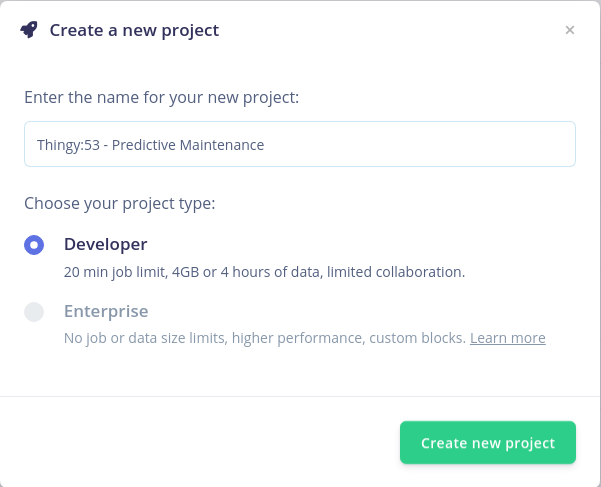

Afterward, select **Accelerometer** data as the type of data you will be dealing with.

### Connecting the Device

The Nordic nRF Edge Impulse iPhone and Android apps will work with new Thingy:53 devices right out of the box.

The firmware of Thingy:53 needs to be updated before it can be connected to the Edge Impulse project. Launch the **nRF Programmer mobile application** after downloading it from Apple Store or Google Play. You will be presented with several available firmware that can be uploaded on the board.


Select the **Edge Impulse** application and tap **Download**. Afterward, hit **Install**. A list with all the nearby devices will show up and you must select the Thingy:53 board that you wish to program.


With the firmware updated, connect the Thingy:53 board to a computer that has the edge-impulse-cli suite installed, turn it on, launch a terminal and issue the following command:

```
$edge-impulse-daemon --clean
```

Fill in your username and password when asked to.

```
Edge Impulse serial daemon v1.14.10
? What is your user name or e-mail address (edgeimpulse.com)? <your user>
? What is your password? [hidden]
```

Afterward, select the project you wish to attach the board to and hit **Enter**.

If everything is successful, the Thingy:53 will show up in the **Devices** tab with a green dot, signaling that it is online and ready to gather data.


### Building the Dataset

After the board shows up in the Devices tab, navigate to the **Data acquisition** to start gathering data. Your device will show up in the Record new data window. Write down a label that corresponds to the phenomenon you are capturing, use 10000ms as the Sample length, Accelerometer as Sensor and use a Frequency of 100Hz. With everything set up, tap **Start sampling**.

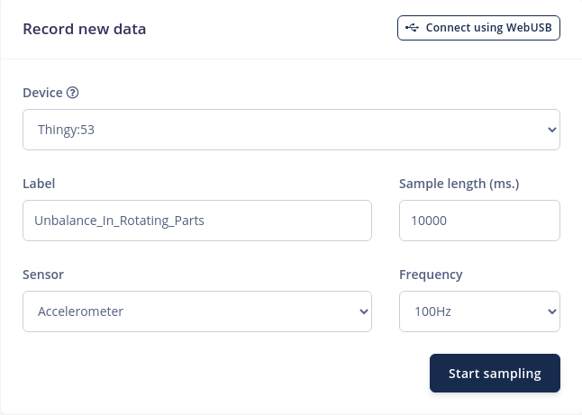

For this application, the Nordic Thingy:53 will be mounted directly on the compressor unit by using a strong adhesive and we will be recording data for 2 classes: “Unbalance_In_Rotating_Parts” and “Normal_Operation”. The “Normal_Operation” class is very important because neural networks can only "understand" the training data that was used to create them, and any new data that will be presented to them will have to end up in one of the defined categories.

For this model, aim for around 4 minutes of data for each class. Every time you record a new data entry, it will show up in the **Collected data** field, and the time-domain representation of the signal will be displayed in the **Raw Data** window.


During normal operation, the compressor manifests a vibration with a low amplitude, with rhythmic increases in amplitude once every cycle, followed by a slow reduction back to normal levels. 


When the piston is damaged or unbalanced, notice how multiple rhythmic spikes appear in the signal.


After you have gathered at least 2 minutes of data for every, the data must be split between two categories: Training dataset and Testing dataset. An adequate split ratio should be 80% Training data to 20% Testing data.


### Designing the Impulse

After the datapool is populated, it’s time to create the Impulse. An Impulse is an abstraction of the process of gathering data, processing it, feeding it into a neural network and outputting it, each step of the process being customizable.

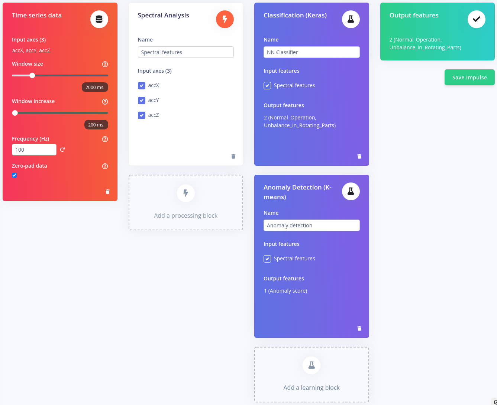

For this application, we will be using an input block with a 2000ms window size, with a window increase of 200ms at an acquisition frequency of 100Hz, a **Spectral Analysis** block as our processing block and a combination of learning blocks, a **Classification(Keras)** and an **Anomaly Detection** block.

The Anomaly Detection block is necessary for this application because not all failures that may occur during normal operation of the compressor can be simulated. 

### Configure the Spectral Analysis Block

The Spectral Analysis block is used to extract the frequency and power characteristics of a signal. Low-pass and high-pass filters can be used in this block to eliminate undesirable frequencies. As with our use case, this block typically performs well when decoding recurrent patterns in a signal, such as those caused by the vibrations or motions picked up by an accelerometer unit.

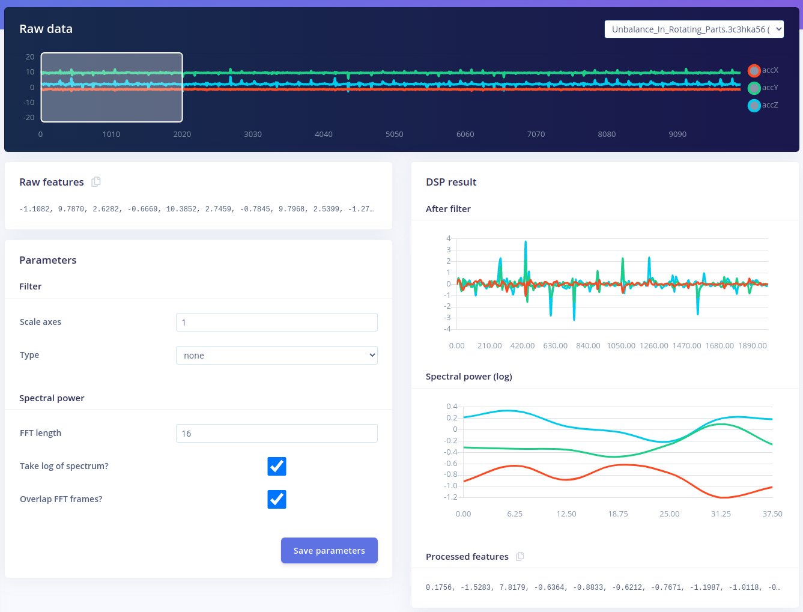

For the moment, the default parameters value set by Edge Impulse offer great results. Leave everything as is and click **Save parameters**. To figure out if the settings used are good for your dataset, explore the datapool and see if for similar data you get similar results.


After you are redirected to the feature generation tab, check “Calculate feature importance” and then press **Generate features**. The ability to calculate the importance of each individual signal feature is a great asset of the Edge Impulse platform, as it allows the Anomaly Detection block to prioritize those values as they are the most meaningful for the observed phenomenon.

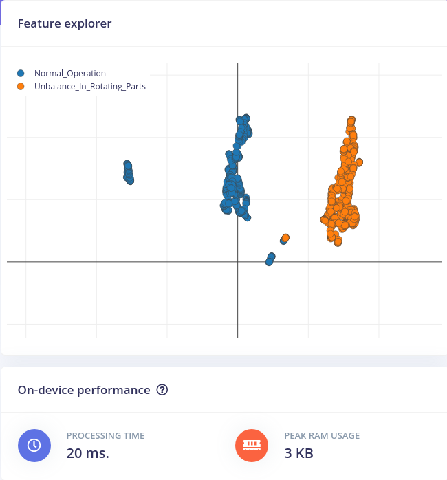

The **Feature explorer** allows you to quickly check if the data separates nicely, as it is a visual representation of all the data from the Training dataset. Any point in the feature explorer can be hovered over to reveal the source for that point. If you work with time series data, clicking on a data item will show you the raw waveform, the signal window that was utilized, and a quick link to the signal processing page. This makes identifying the outlier data points in your dataset very simple.

### Configure the NN Classifier

The NN Classifier block's configuration is the next phase in the development of the machine learning algorithm. The number of training cycles, learning rate, size of the validation set, and whether or not the Auto-balance dataset function is enabled are just a few of the factors that can be modified. They provide users control over the number of epochs the NN is trained on, how quickly the weight of the links between neurons is modified each epoch, and the proportion of samples from the training dataset that are used for validation. The architecture of the NN is detailed underneath.

Leave everything on default settings for the time being and click **Start training**.

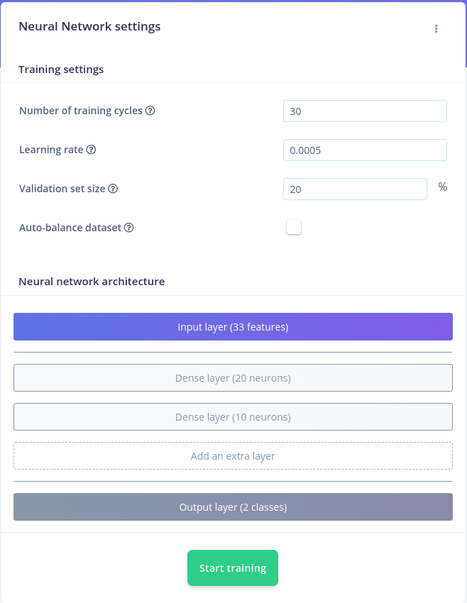

After the training has been assigned to a cluster, the training performance tab will be displayed. Here, you can view in tabulated form the correct and incorrect predictions made by the model after being presented with the Validation data set. 
When training a neural network, we aim for a high **Accuracy** (the percentage of predictions where the expected value matches the actual value of the data input) and a low **Loss** (the total sum of errors produced for all the samples in the validation data set).

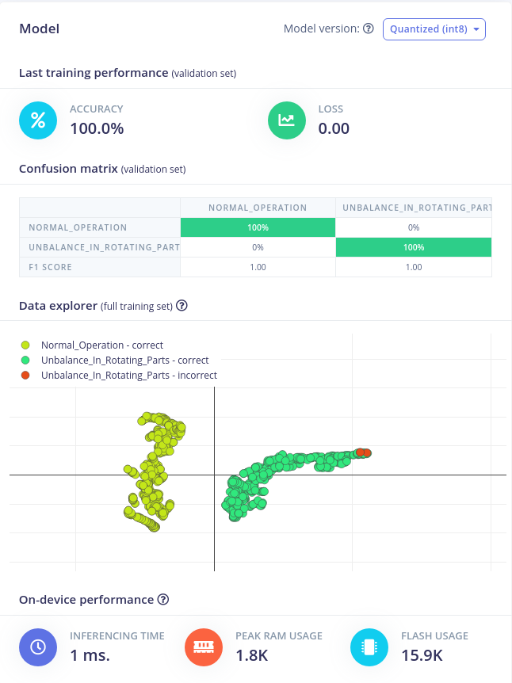

Underneath those performance indices, you can visually explore the data to find the outliers and the mislabeled data. You can see that in the right side of the graphic there is a small cluster of “Unbalance_In_Rotating_Parts” data points that were mislabeled, represented with red dots.

### Configure the Anomaly Detector

A secondary neural network called the Anomaly Detector will be used to identify data that does not fall into any of the categories we established in the previous step.

By enabling the Generate Feature importance during the Generate Feature step, the users can greatly improve the performance of this Neural Network and drastically reduce the processing resources needed for using it.


Click on **Select suggested axes**. As you can see, the **accY Spectral Power 3.12-9.38Hz**, the **acY Spectral Power 3.12-9.38Hz**, **accz Spectral Power 15.62-21.88HZ** and **accY Spectral Power 3.12-9.38HZ** are the most meaningful characteristics in our dataset. Afterward, with the axes selected, press **Start training**.

You will be provided with the training results after the training is complete. You can see that the Anomaly Explorer defines zones around the acquired data and plots the two most significant features against one another. The same coordinate system is used to plot new data, and if it is not located near one of the predefined clusters, it is marked as an anomaly.


### Model Testing

The **Model Testing** tab allows users to quickly evaluate how the machine learning model fares when presented with new data. The platform uses the data available in the Test data pool, defined during the data acquisition phase and evaluates the performance of the model.


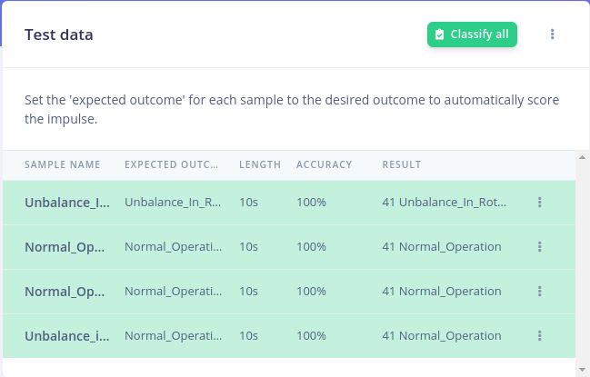

## Deploying the Model on the Edge

### Upload the Impulse via USB Cable

Edge impulse allows its users to export the machine learning model they have just created in the form of a pre-compiled binary that can be easily uploaded on the board, without going through the effort of building custom firmware for it. To do so, click **Build** and wait for the process to end. Once it’s done, download the .hex file and follow the steps in the video that shows up to upload it on the Thingy:53 board.


Connect the board to your computer when the impulse has been uploaded, open a Terminal, and type the following command to view the inferencing results:

```
$edge-impulse-run-impulse
```

### Upload the Impulse via Android/iOS App

An alternative and easy way of quickly deploying the model on the edge is using the **Nordic nRF Edge Impulse** app for iPhone or Android:

1. Download and install the application from Google Play/Apple Store.
1. Launch the application and login with your Edge Impulse credentials.
1. Select your Predictive Maintenance project from the list:

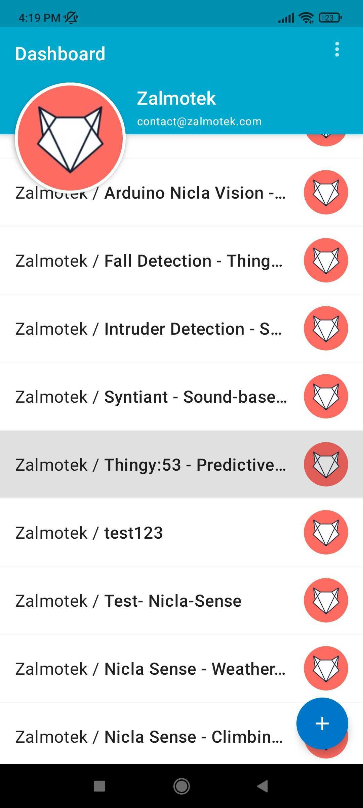

1. Navigate to the Devices tab and connect to the Thingy:53:

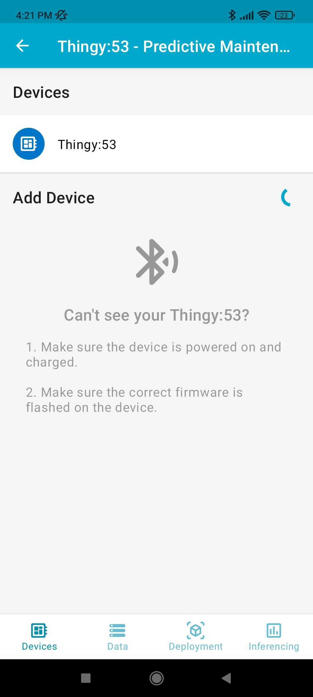

1. Navigate to the Data tab and press **Connect**. You will see the status on the button changing from **Connect** to **Disconnect**.

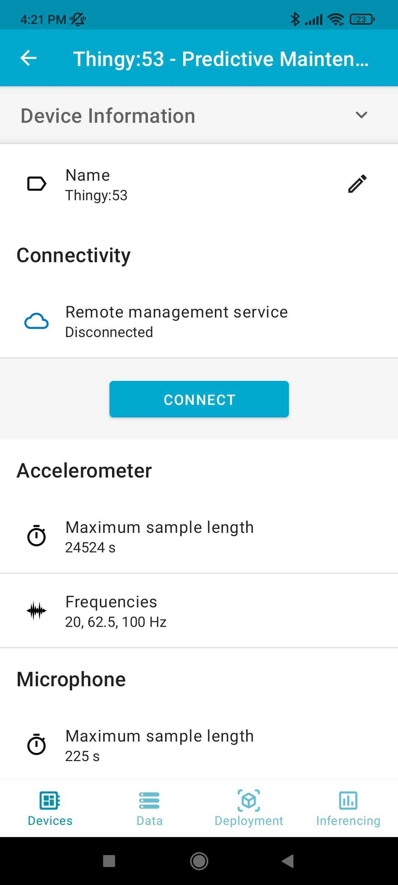

1. Navigate to the deployment tab and press **Deploy**.


1. In the **Inferencing** tab, you will see the results of the Edge Impulse model you have flashed on the device:

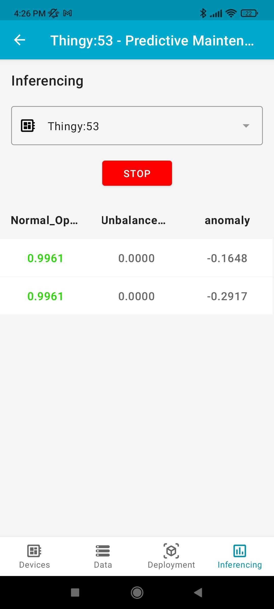

### EON Compiler and Resource Optimization

The EON compiler enables you to run NN with up to 35% less storage and 25-55% less RAM without compromising model performance.

At the bottom of your project's deployment page, on all supported boards, this feature is automatically turned on.

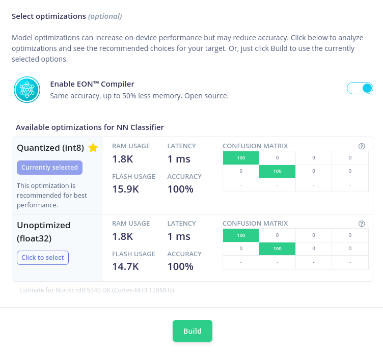

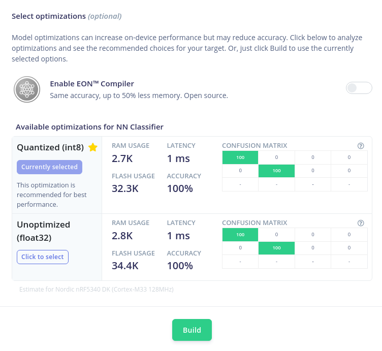

Usually, microcontroller targets have less than 128K of RAM and implicitly, have trouble running machine learning models on the edge, especially when other functionality is added, like a communication layer or special conditions. EON Compiler allows users to overcome that impediment by greatly optimizing the resources needed to run said models on the edge.

## Conclusion


By employing IoT devices powered by machine learning algorithms running on the edge, predictive maintenance is closer to becoming a common practice in industrial environments, making it cheaper, more accessible and more powerful than ever. While simple in their principle of operation, predictive maintenance systems improve the Overall Equipment Effectiveness and positively impact the equipment Remaining Useful Life (RUL). 

If you need assistance in deploying your own solutions or more information about the tutorial above please reach out to us!

