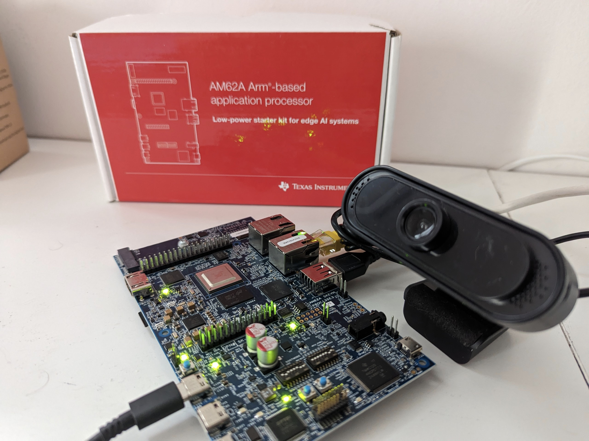
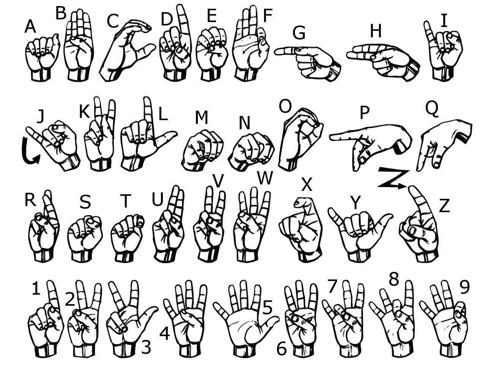
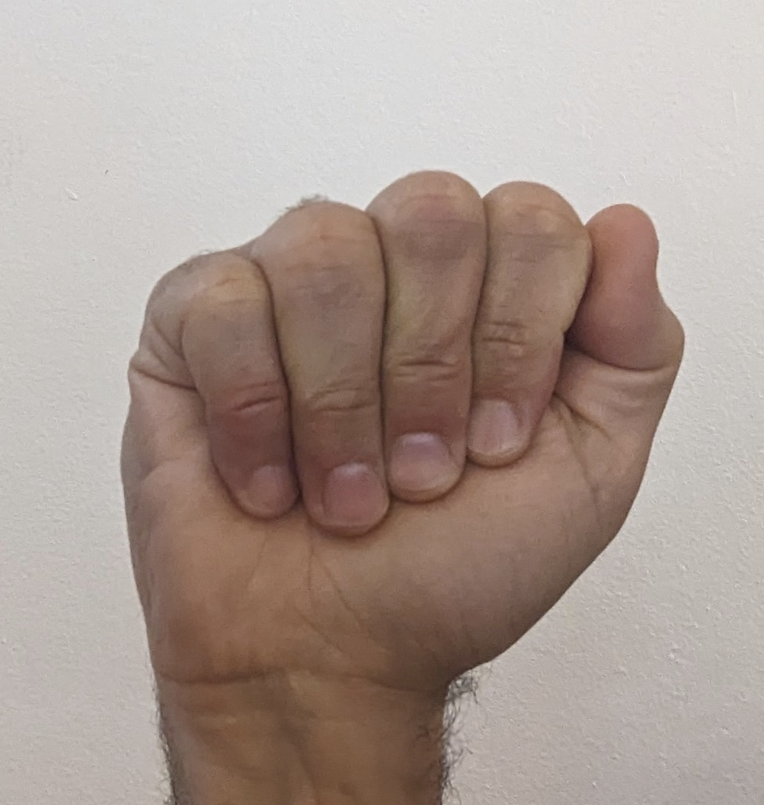
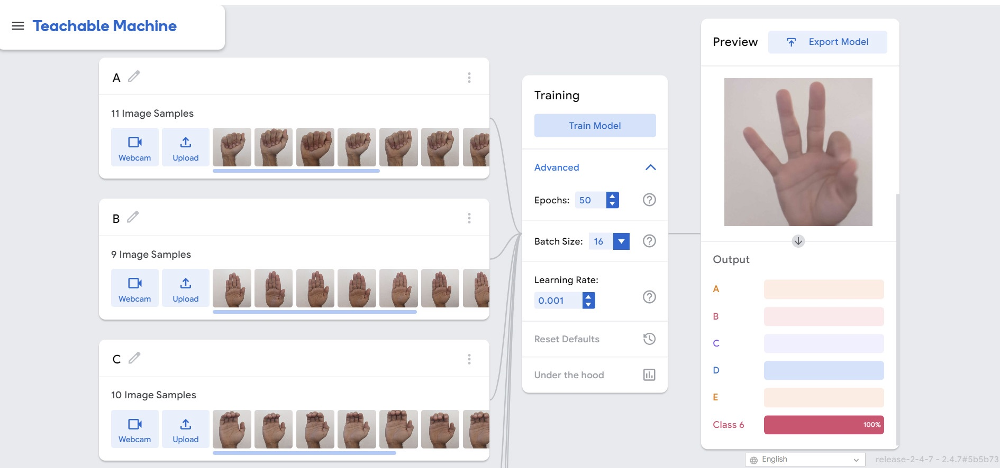
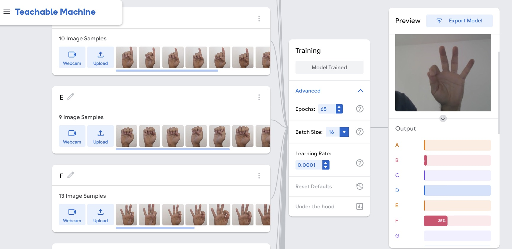
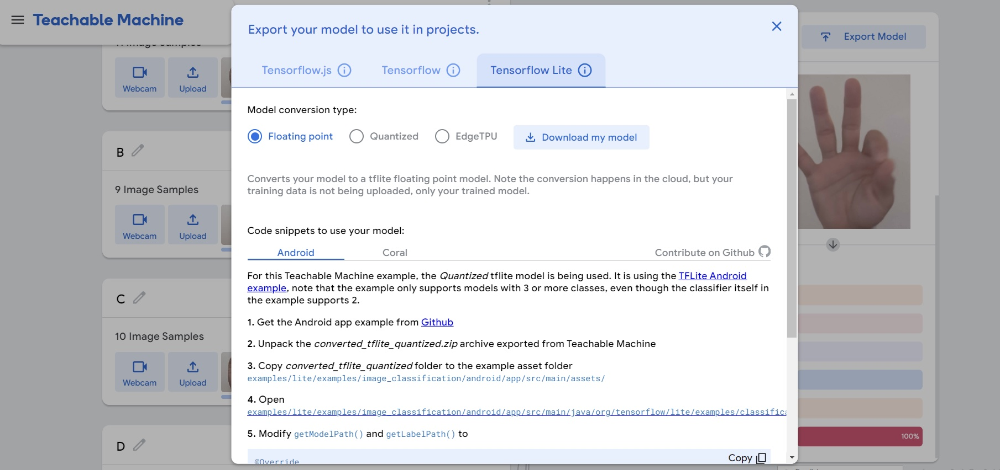
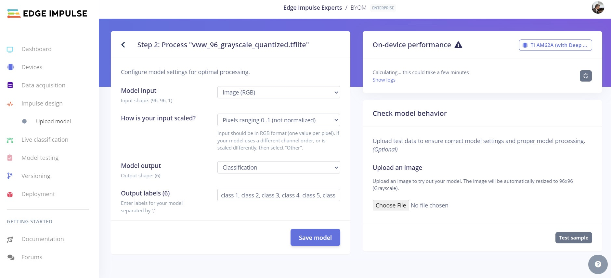
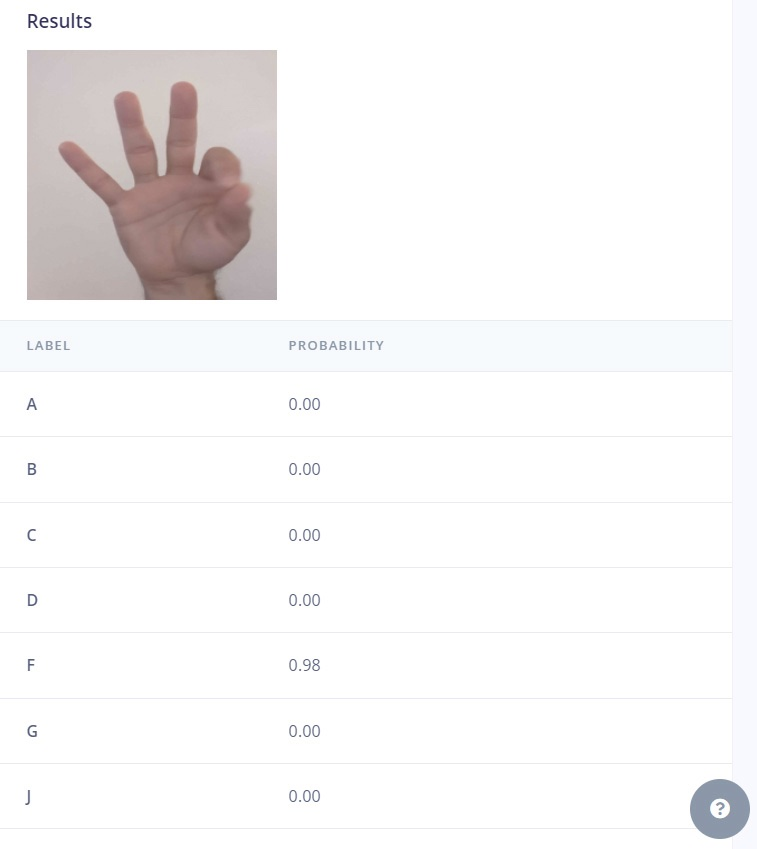
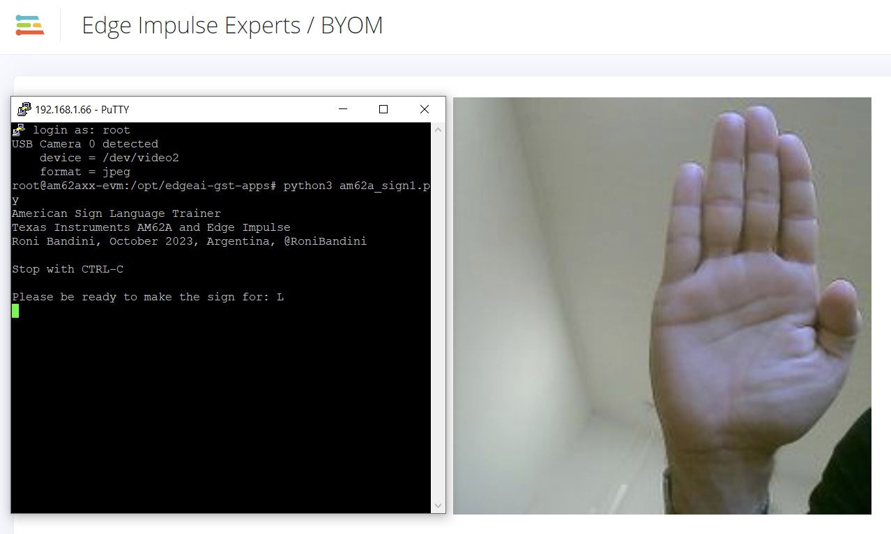
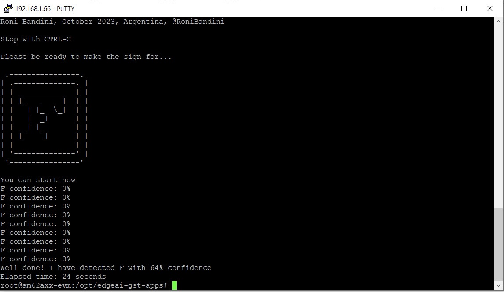

# Import a Pretrained Model with "Bring Your Own Model" - Texas Instruments AM62A

Created By: Roni Bandini

Public Project Link: [https://studio.edgeimpulse.com/public/270046/latest](https://studio.edgeimpulse.com/public/270046/latest)

GitHub Repository: [https://github.com/ronibandini/ASLTrainer](https://github.com/ronibandini/ASLTrainer)



## Introduction

If you work with Machine Learning, you know how much time it takes to collect data and train a model. But one of the cool things about the AI ecosystem is that you can find ready-made datasets and models that can help you speed up your projects.

Edge Impulse has a new feature called [Bring Your Own Model (BYOM)](https://docs.edgeimpulse.com/docs/edge-impulse-studio/bring-your-own-model-byom) that lets you import, optimize and deploy a pre-trained model in any of these formats: TensorFlow SavedModel, ONNX, or TensorFlow Lite. You can then deploy and run projects with this model on many boards and devices.

I decided to try out this feature by importing an American Sign Language model and deploying it to a Texas Instruments AM62A Development Kit. I also created a simple ASL training game in Python.

## American Sign Language Model



One thing I learned from this project is that sign language is not the same everywhere. In the US and most of Canada, they use American Sign Language, but in Argentina where I am located, they use a different version. Both versions have some signs that are static, and some that have movement, like the letter Z. For the moving signs, I only used the final position of the movement to train and recognize the letter, since I was using images and not videos. For motion activity, video classification would be needed.

Another thing to keep in mind is that some signs, like **A, M, N, S and T**, can look very similar from a distance. This makes data collection and model training more challenging.

## Model Import

From the original idea to the point where I actually started the project, the [ASL Hugging Face model](../image-projects/\(https:/huggingface.co/spaces/datasciencedojo/AmericanSignLanguage-Detection\)/) I wanted to use was no longer available.

So at this point I decided to train a simple ASL model outside Edge Impulse, export the model as a TensorFlow Lite file, import to Edge Impulse, deploy the model to the Texas Instruments AM62A board, and develop a simple Python training game.

> Note: the signs used for training were not made by someone with experience in ASL, so please note that detection rates could be far from perfect.

The first step was to take the pictures. I used a smartphone camera, and took at least 3 pictures for every sign, based on a standard ASL chart.



For training the model I used Google's _Teachable Machine_. Of course I could have done the same inside Edge Impulse, but the whole idea was to test an external pre-trained model.



Before importing to Edge Impulse, I tested the model with a live feed from the computer camera.



For the exporting step in _Teachable Machine_, I used TensorFlow Lite, Floating Point. That generates a `.zip` file download, which I then unzipped. Inside, I found 2 files: the model with the `.tflite` extension, and a label .txt file. This label file has 2 columns: **order** and **label name**. To prepare everything for Edge Impulse BYOM, I removed the **order** column and compiled everything in one row, comma separated.

Example:

```
A, B, C, D, E, F, G, H, I, J, K, L, M, N, O, P, Q, R, S, T, U, V, W, X, Y, Z
```

Instead of:

```
0 A
1 B
2 C
```



## BYOM Procedure

If you don't have an Edge Impulse account, you can [create one for free](https://studio.edgeimpulse.com/signup). I logged in to my existing Edge Impulse account, and have created a new project named **BYOM**, though any name could be used. I then clicked "Upload Your Model", and selected the Tensor Flow Lite file.


Then I went to Step 2.



In Step 2, I have selected _RGB Images_ (you can also import other data type models like audio), not normalized pixels, and _Classification_ as the model output, and copied the label row that I prepared ealrier.

After importing the model you can use **On Device Performance** and select the target device, to estimate memory and processing time. I chose the TI AM62A, and obtained: 2ms processing time, 4.7M RAM usage and 2.0M flash needed.

**"Check model behavior"** is an excellent utility to immediately test if the model import parameters were correct. You can upload an image that is not part of the model training, and get an inference result. After confirming the behavior and functionality of the model, everything is ready for deployment.



## Deployment

The deployment procedure varies from board to board. In this case, the deployment will be made directly from the Texas Instruments AM62A command line, so it is not required to export a file from the Edge Impulse platform.

## Texas Instruments AM62A Setup and Deployment

* Download this operating system image version: [https://www.ti.com/tool/download/PROCESSOR-SDK-LINUX-AM62A/08.06.00.45](https://dr-download.ti.com/software-development/software-development-kit-sdk/MD-D37Ls3JjkT/08.06.00.45/tisdk-edgeai-image-am62axx-evm.wic.xz)
* Flash the image to a 16gb or larger microSD card with Balena Etcher or any other similar software
* Connect the Power Supply, HDMI, USB Camera, and Ethernet Cable
* Check the board IP on the HDMI screen when board boots up and the default application loads
* Login to that IP using Putty or any other SSH client, using `root` as the user, and no password
* Run `npm config set user root && sudo npm install edge-impulse-linux -g --unsafe-perm`
* Run `pip3 install art` (a library to display bigger letters)
* Run `edge-impulse-linux-runner`. The first time you run this, you will need to login to your Edge Impulse account and select the BYOM project. Once running, launch a web browser and navigate to your board's IP address, port 4912. For example, `http://192.168.1.66:4912` in my case.
* Download the `am62a_signlanguage.py` file [from the GitHub repository](https://github.com/ronibandini/ASLTrainer) and upload the script to the AM62A board using SFTP. The credentials are the same as logging in directly: You'll need your IP address, username is `root`, and there is no password.
* Run `python3 am62a_signlanguage.py`

## Training Game

You will see a letter printed on screen, then you have to form the letter sign in front of the camera. The script will show an inference confidence percent, and the seconds until detection.



Inside the Python code you can edit confidence limit, altering this line:

```
confidenceLimit=0.6
```



## Demo Video



## Conclusions

The ability to import a pre-trained model to the Edge Impulse platform is a very valuable feature. In a matter of minutes and using a simple and intuitive interface, the imported model could be deployed to one of the many available platforms like Arduino, BrainChip, Cube, Ethos, OpenMV, Linux, Mac, Sony's Spresense, etc.

It is important to note that Edge Impulse's visualizations and tuning for external pre-trained models are not available, so you should check the model quality in advance.

## Resources

### Files

* Source Code: [https://github.com/ronibandini/ASLTrainer](https://github.com/ronibandini/ASLTrainer)
* Edge Impulse Public Project: [https://studio.edgeimpulse.com/public/270046/latest](https://studio.edgeimpulse.com/public/270046/latest)
* [https://huggingface.co/ronibandini/AmericanSignLanguage](https://huggingface.co/ronibandini/AmericanSignLanguage) (this model has all the letters)

### References

[https://teachablemachine.withgoogle.com](https://teachablemachine.withgoogle.com)

### Contact

If you are interested in other Artificial Intelligence and Machine Learning projects: [https://www.youtube.com/playlist?list=PLIw\_UcVWFyBVYAQXp8S2pfe2frzGcyxlP](https://www.youtube.com/playlist?list=PLIw_UcVWFyBVYAQXp8S2pfe2frzGcyxlP)

#### Social Media

[https://twitter.com/RoniBandini](https://twitter.com/RoniBandini) [https://www.instagram.com/ronibandini](https://www.instagram.com/ronibandini)

#### Web

[https://bandini.medium.com/](https://bandini.medium.com/)
