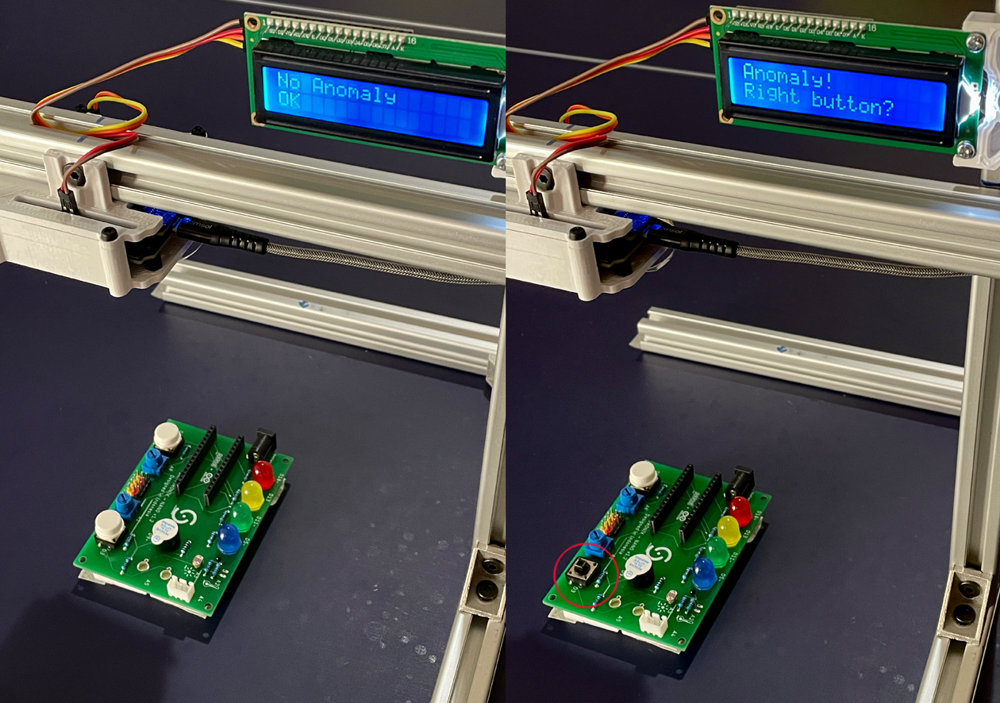
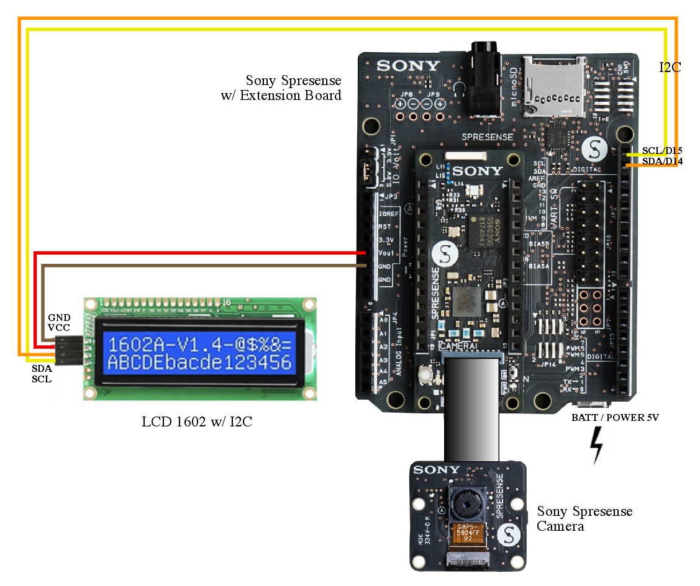
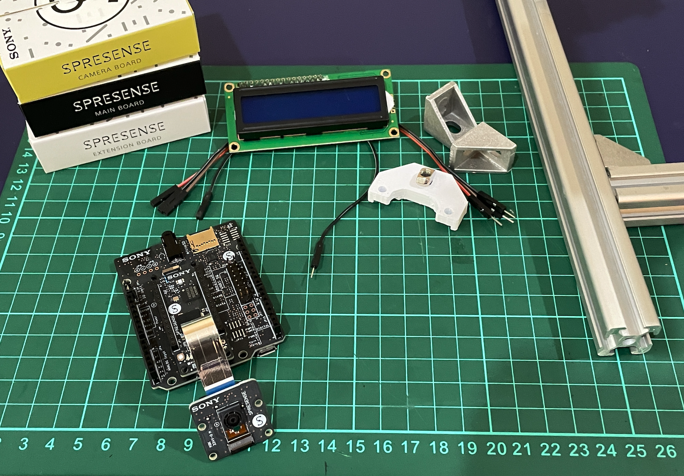
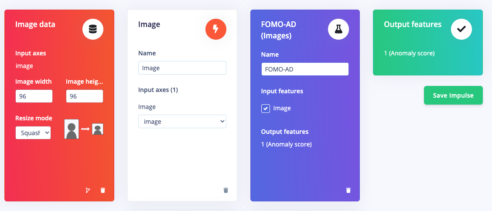
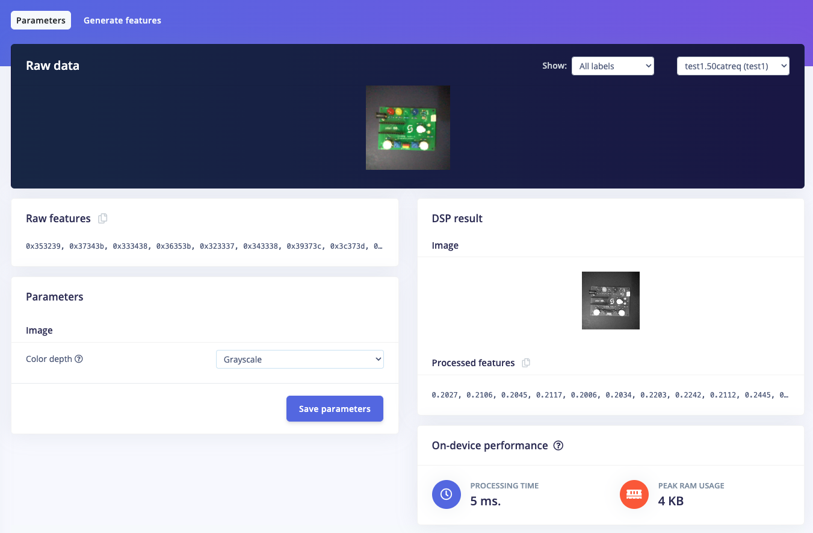
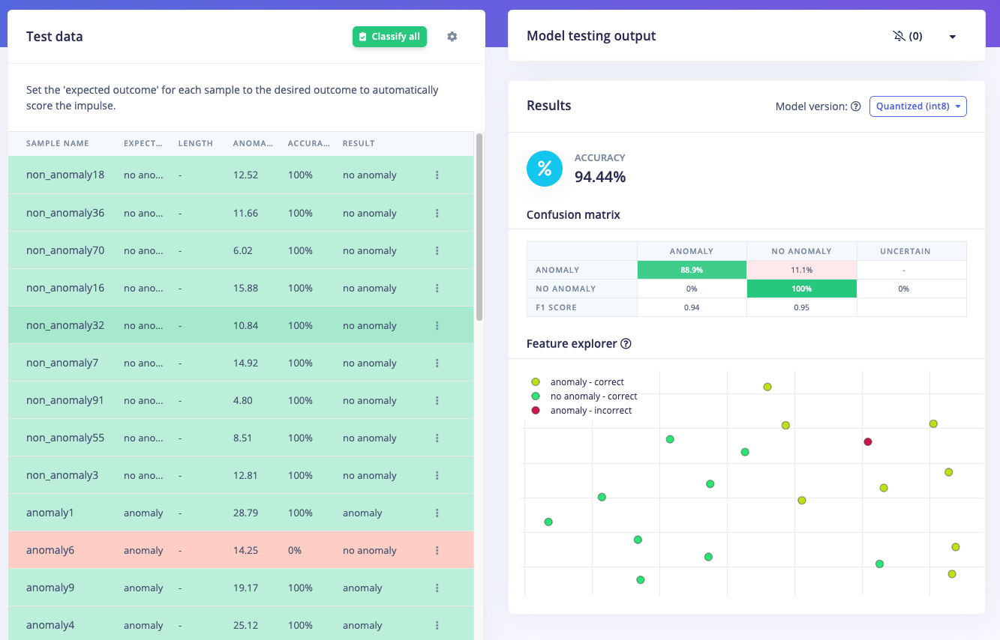
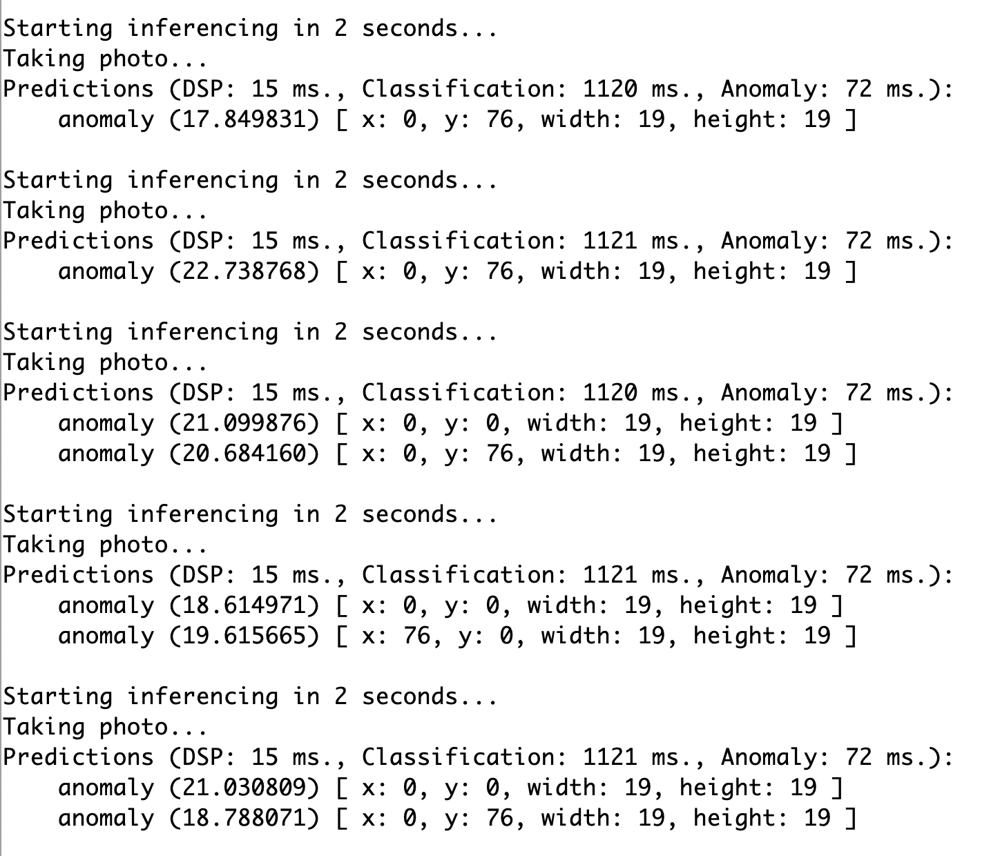
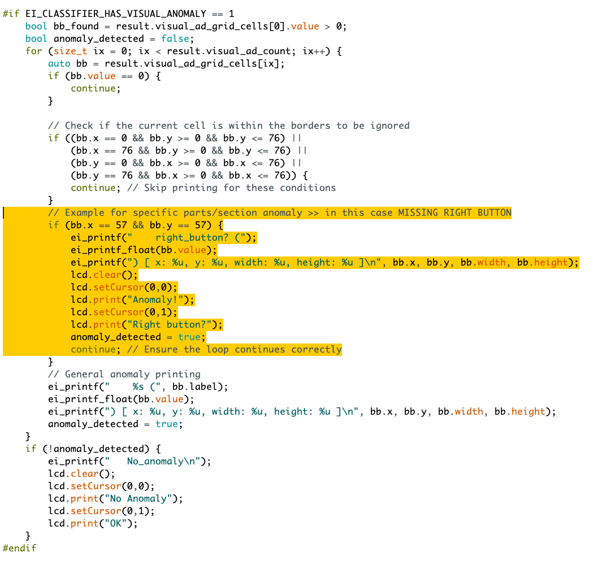

# Product Inspection with Visual Anomaly Detection (FOMO-AD) - Sony Spresense

Created By: Jallson Suryo

Public Project Link: [https://studio.edgeimpulse.com/public/391673/live](https://studio.edgeimpulse.com/public/391673/live)

GitHub Repo: [https://github.com/Jallson/FOMO_AD-with-Sony-Spresense/](https://github.com/Jallson/FOMO_AD-with-Sony-Spresense/)

## Problem Statement

Detecting anomalies in a product necessitates a complex system, often involving the labeling of various potential issues, such as damage or missing parts in specific areas. This process presents endless possibilities for anomalies. Consequently, developing machine learning models with numerous classes or labels requires robust systems containing a CPU or GPU. This results in significant costs, high energy consumption, and latency issues.

## Our Solution

By using Edge Impulse's Visual Anomaly Detection (FOMO-AD), it's possible to train machine learning models using images using only "ideal" or "normal" products. If an anomaly is detected, its location can be identified, allowing for immediate determination of the damaged or missing part. The compact size of this ML model enables deployment on microcontrollers such as the Arduino Nicla Vision or Sony Spresense (as used here). Low latency, cost efficiency, accuracy, and ease of deployment are the reasons we chose FOMO-AD for this project.

## How it Works

This project uses Edge Impulse's FOMO-AD (Faster Objects, More Objects - Anomaly Detection) learning block based on GMM (Gaussian Mixture Model) which clusters data points with similar characteristics, then will compare and provide an anomaly value for which a threshold can be determined. This can then be used to determine which parts are considered anomalies. In this ML model, the resulting anomaly value also contains the coordinates, and with some translation code we can use the coordinates to identify which parts are broken or not complete. The setting we'll use is an electronics manufacturing process, with a conveyor belt and sorting system or an LCD display for information on anomalies or missing parts.

Hardware: Sony Spresense with camera and 1602 LCD display.

## Hardware Components

- Sony Spresense Main Unit
- Sony Spresense Extension Board
- Sony Spresense Camera
- 3d print parts (case & mount)
- Jumper cables
- Aluminium extrusion/frame
- Battery/Powerbank
- Objects

## Software & Online Services

- Edge Impulse Studio (FOMO-AD learning block only available in Enterprise account)
- Arduino IDE
- Terminal

## Steps

### 1. Prepare Data / Images

We will first determine the object that will serve as the standard for an ideal (normal) product. This involves taking photos at a consistent distance, with similar angles and lighting. This can be done using a tripod and a smartphone camera or by creating a stand with a mounted Sony Spresense and its camera. There will be two types of objects photographed: those used for Training data with a single classification of "no anomaly", and others photographed under conditions that would be considered "anomaly", such as a removed button or a covered LED. These "incorrect" images will later be included in the Test Data section, mixed with some "no anomaly" images.

### 2. Data Acquisition

Open [http://studio.edgeimpulse.com](http://studio.edgeimpulse.com), login, then create a new project.

In **Dashboard > Project Info**, choose **One label per data item** and Sony Spresense for the target device. Then click on the **Collect new data** icon, or in _Data acquisition_, click on the _Upload Data_ tab, and choose your photo files. Besides using existing photos, you can also collect data directly by using the Sony Spresense with its camera connected to Edge Impulse Studio by uploading the Edge Impulse firmware to the Sony Spresense and running `edge-impulse-daemon`, which is explained in detail at the following link: [https://docs.edgeimpulse.com/docs/edge-ai-hardware/mcu/sony-spresense](https://docs.edgeimpulse.com/docs/edge-ai-hardware/mcu/sony-spresense).

Whichever method you use, make sure to label each normal product photo as "no anomaly" for the **Train** Data category, as shown in the photo below. Ensure that the Train Data contains only "no anomaly" photos, while the Test Data contains some "no anomaly" photos as well as "anomaly" photos.

### 3. Build Model using FOMO-AD

Once your dataset is ready, go to **Create Impulse** and set the image width and height to **96 x 96**. Choose **Squash** as the image crop method, and select **Image** and **FOMO-AD** as the Learning and Processing blocks, then click **Save Impulse**.

Next, go to the **Image** parameter section, select **Grayscale** for the color depth, and **Save Parameters**, then click on **Generate features**. In the Anomaly Detection settings, set the training processor to _CPU_ with a capacity of _High_. Choose **MobileNet V2 0.35** for the neural network architecture with a 1-class output layer. Start training the model by pressing **Start Training** and monitor the progress.

If everything is functioning correctly, once complete proceed to the **Live Classification** with a connected camera or test the model by going to the **Model Testing** section and clicking **Classify all**. After these steps, you can adjust the confidence thresholds to set the minimum score required before tagging as an anomaly and click **Classify all** again. If your model's test result is above 80%, you can proceed to the next step: _Deployment_.

### 4. Deploy Model for Sony Spresense (or Arduino)

Click on the **Deployment** tab then search for _Arduino Library_ then select **Quantized (int8)** and click **Build**. This will build an Arduino library for running inferencing targeting Arduino compatible devices, such as the Sony Spresense we're using. After the .ZIP library downloads, open the Arduino IDE, click on **Sketch > Include Library > Add ZIP Library**, then follow the next step.

### 5. Build the Program (Arduino code)

Before we start with the program, we need to install the Spresense Library using the _Board Manager_ in Arduino IDE. Follow the steps from this link to complete the install: [https://developer.sony.com/spresense/development-guides/arduino_set_up_en.html#_installation_through_arduino_ide_board_manager](https://developer.sony.com/spresense/development-guides/arduino_set_up_en.html#_installation_through_arduino_ide_board_manager)

To connect the Spresense to Arduino IDE, choose **Tools > Board: "Spresense"**, then set the **Debug, Core, Memory, Upload Speed, Programmer** values setup as shown in the image below. With the Spresense connected, then we can open the program example in **File > Examples > Visual_Anomaly_Detection_FOMO_AD > Sony Spresense Camera**. Upload this code to your Spresense and now you can test the model with the physical Spresense hardware and camera setup, and one of the "normal" products. Click on **Serial Monitor** icon and check the output results.

With the results being displayed on the Serial Monitor accurately, we can now modify this sample program to include more functionality. However, to display the output without a computer, we need to install a 1602 LCD as the display (follow the instructions in the diagram above). Find the specific library for your LCD and include it in your program.

If we observe the output on the Serial Monitor, the detected anomalies at coordinates `x` and `y` can be mapped to specific parts or sections of the inspected product. For example, x: 57 and y: 57 correspond to the right button, so we can add a condition that, if an anomaly is detected at that location, the LCD will display **"Anomaly! Right button?"**. Apply the same approach for other anomaly conditions, and if no anomaly is detected, the LCD will display **"No Anomaly, OK"**.

For more detail, you can check or download and modify my code in this GitHub repository, [https://github.com/Jallson/FOMO_AD-with-Sony-Spresense](https://github.com/Jallson/FOMO_AD-with-Sony-Spresense)

Now it's time to upload and run the program without using a computer. Set up the hardware as shown in the diagram above, connect the battery or power bank, and test your Product Inspection with the Visual Anomaly Detection program.

Check our demo test video for an example of how it works: 



## Conclusion

We have successfully created a Product Inspection with Visual Anomaly Detection project by training a machine learning model with only one class label, "No Anomaly." The model has successfully detected anomalies along with their locations, making it easier for us to identify which part or section has an issue. By using FOMO-AD, the machine learning model can be deployed to a microcontroller. This enables a cost-effective and energy-efficient solution for the manufacturing industry, especially in sorting systems and visual inspection lines.
