# Hardhat Detection in Industrial Settings - Alif Ensemble E7

Created By: Wamiq Raza, Varvara Fadeeva

Public Project Link: [https://studio.edgeimpulse.com/public/258261/latest](https://studio.edgeimpulse.com/public/258261/latest)

## Introduction

Safety helmets as personal protective equipment are mandatory in a number of industries, including building construction and manufacturing, to avoid potential injuries of workers. Failure to wear safety helmets leads to a higher risk of accidents in industrial environments. In the past, supervisors were responsible for ensuring everyone wore a helmet. However, manual oversight of safety helmets usually results in higher cost and compromised precision due to human factors. Therefore, an application of machine learning using computer vision algorithms for helmet detection proves to be a promising and effective approach.

In this project the objective is to enhance safety measures and mitigate potential risks by utilizing a TinyML approach of detecting the presence of hardhats on workers’ heads. This project aims to leverage the Edge Impulse platform to build an efficient and lightweight model that can be deployed on edge devices, enabling real-time monitoring and immediate alerting in case of non-compliance, using the Alif Ensemble E7 development platform.

## Alif Ensemble E7 Configuration with Edge Impulse

To get started with the Alif Ensemble E7 hardware on Edge Impulse, you’ll need an Alif Ensemble hardware kit, available here:  [https://alifsemi.com/products/ensemble](https://alifsemi.com/products/ensemble).  You will also need to install the following software:

1. Edge Impulse CLI -  used to control local devices, act as a proxy to synchronize data for devices that don’t have an internet connection, and to upload and convert local files. [Follow the instructions here for installation](https://docs.edgeimpulse.com/docs/tools/edge-impulse-cli/cli-installation).

2. Follow the procedure to install the Alif Security Toolkit - this can be requested from Alif after [registration on their website](https://alifsemi.com/login/register), which has all the relevant files. Below is the explanation for setting up the hardware once you have these files.

	a. Unzip the Alif Security Toolkit Release to any directory on your Windows PC or Linux machine.

	b. The recommended <release-location> installation directories are:
		i. Windows: C:\app-release-exec
		ii. Linux: /home/$USER/app-release-exec-linux

	c. The directory structure is as follows:

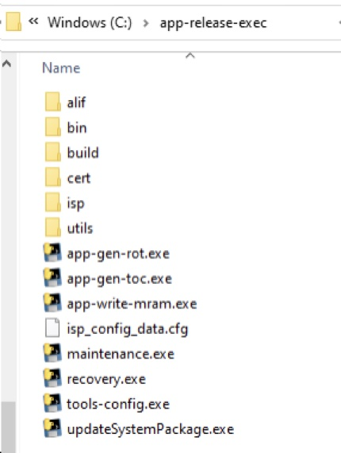

3. You can create an ATOC image with 3 SRAM debug stubs for the 3 CPU cores by opening a command prompt in the `SETOOLS` directory (the default is C:\app-release-exec) and running:

	a. `app-gen-toc -f build/config/ei-appkit-gcc.json`

	b. Then erase the application part of MRAM by running:	`app-write-mram -e app`

	c. Write the image with 3 debug stubs to MRAM by running:  `app-write-mram`

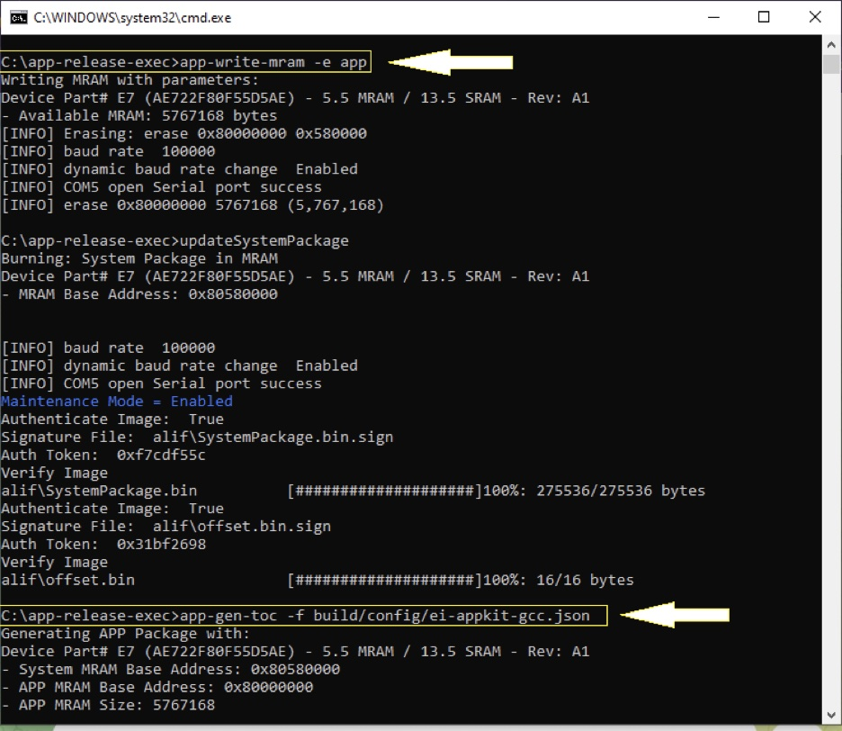

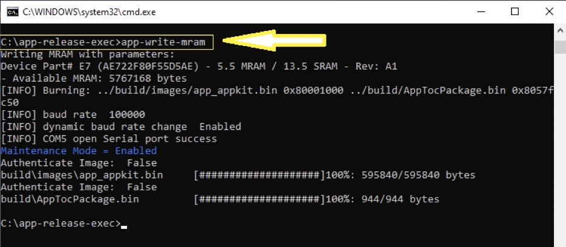

4. Run `edge-impulse-daemon`

	a. This will start a wizard which will ask you to log in and choose an Edge Impulse project. You should see your new or cloned project listed on the command line. Use the arrow keys and hit Enter to select your project.

## Data Collection Process

After the device is configured, now the task is to collect data. For this project a comprehensive image dataset was used from a publicly available resource. To train the model, 160 images captured in various industrial settings from the dataset were selected. Then, the data was uploaded to the Edge Impulse platform via the Upload Data process as shown below. The dataset was automatically split between Training (80%) and Testing (20%).

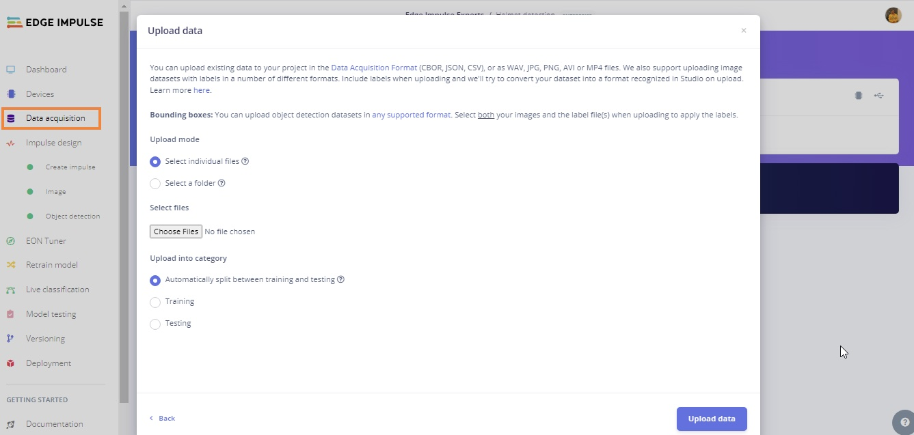

The uploaded dataset was labeled, using two classes: ‘Helmet’ for cases where a person is wearing a helmet and ‘No helmet’ for cases where there is no helmet on the head.

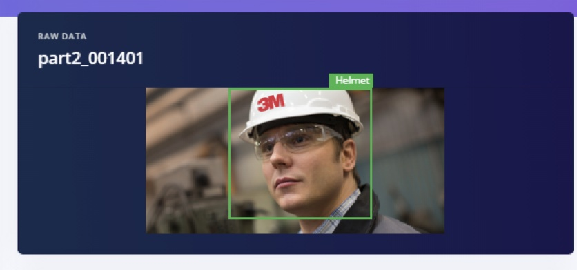

## Impulse Design

After uploading and labeling is completed, our labeled dataset is prepared to train a model. In this step, by clicking on ‘Create Impulse’ we resize the image dimensions to 96x96 pixels, and ‘Fit shortest axis’ Resize mode. Additionally, we set up the Processing block as ‘Image’ and a Learning block as ‘Object Detection (Images)’.

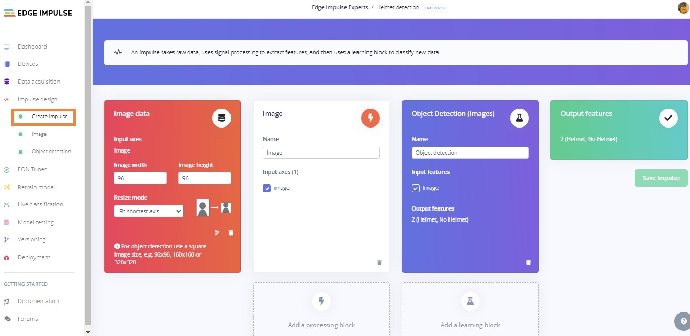

In the next step, we go to the ‘Image’ Processing block details, setting Color depth to RGB. By clicking on ‘Save parameters’, the ‘Generate Features’ tab will be opened. We select the ‘Generate features’ option on the Generate features page. After everything is done, we will see a 3D
depiction of our dataset and evaluate separability of the classes. Later, these will be passed into the neural network model.

## Building and Training the Model

To train the model, the FOMO (Faster Objects, More Objects) MobileNetV2 0.35 algorithm was used, with hyperparameters of 120 epochs, learning rate set to 0.04, batch size set to 32, and ‘Data augmentation’ enabled. Considering the selection of the algorithm, FOMO MobileNetV2 0.35 combines the speed of MobileNetV2 with the detection capabilities of YOLOv5 and MobileNetV2 SSD FPN-Lite. It excels in real-time applications, striking a balance between accuracy and computational efficiency for object detection tasks. Here, the dataset is split into training, validation, and testing. The optimized model’s size was significantly reduced after adding a dynamic quantization that changed the model from a 32-bit floating point to an 8-bit integer.

## Model Deployment

For the deployment of our proposed approach, we select Alif Ensemble E7 from the selection box.  The Ensemble E7 utilizes ARM’s low power Cortex-M55 CPUs with dedicated Ethos-U55 microNPUs to run embedded ML workloads and FOMO object detection architecture. The Ensemble E7 kits feature multiple core types, dual MEMS microphones, accelerometers, and a MIPI camera interface. The figure below represents the process to deploy a model on a microcontroller. The red bounding box is the steps where the first model is trained on given data, after that the model is converted to a `.tflite` file, then deployed on a microcontroller. Here in our case, we have to build firmware using the Edge Impulse platform. After the block diagram the second figure below represents the firmware build steps for Alif, with a red bounding box. Once you have the firmware file downloaded from the Edge Impulse Studio, follow the instructions and commands from the **Configuration** section above, then run ‘edge-impulse-run-impulse --debug’ for inference on the device.

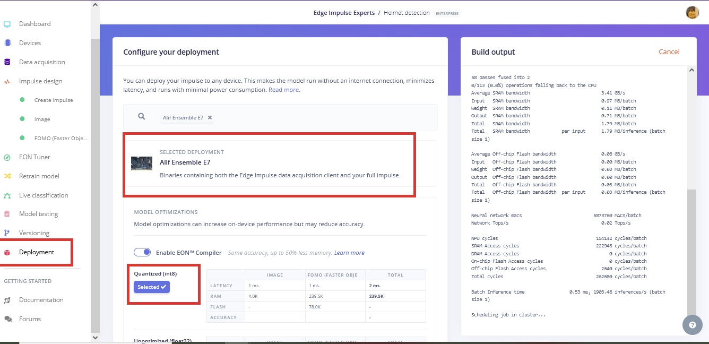

## Results

To test the model, images of a person wearing a helmet or not wearing a helmet are needed. The dataset was split earlier, with 20% being set aside for Testing, that can be used now. The Studio takes the input image as a parameter and predicts the class it belongs to. Before passing the image, we need to ensure that we are using the same dimensions that we used during the training phase; here it’s by default the same dimension. You can also test with a live image taken directly from the development board, if you have a camera attached. In this case, we have a low resolution camera with our kit, and lighting is not optimal, so the images are dark.  However, with a high resolution camera and proper lighting condition, better results can be acheived. But having another look at the Test dataset images, which are bright and high quality, we can see that the model is predicting results (hardhats) effectively. 

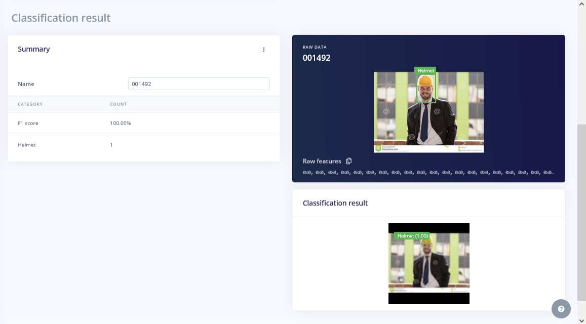

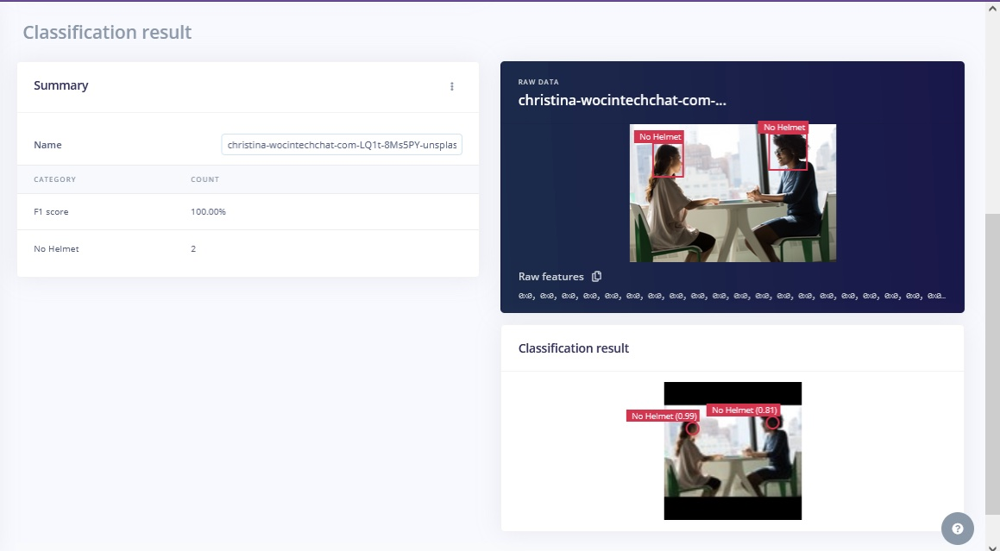

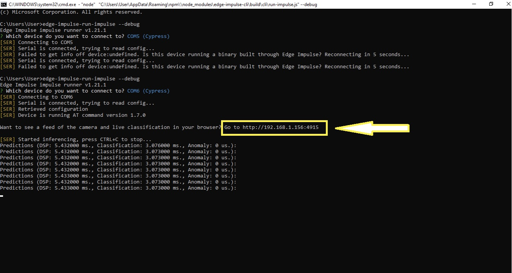

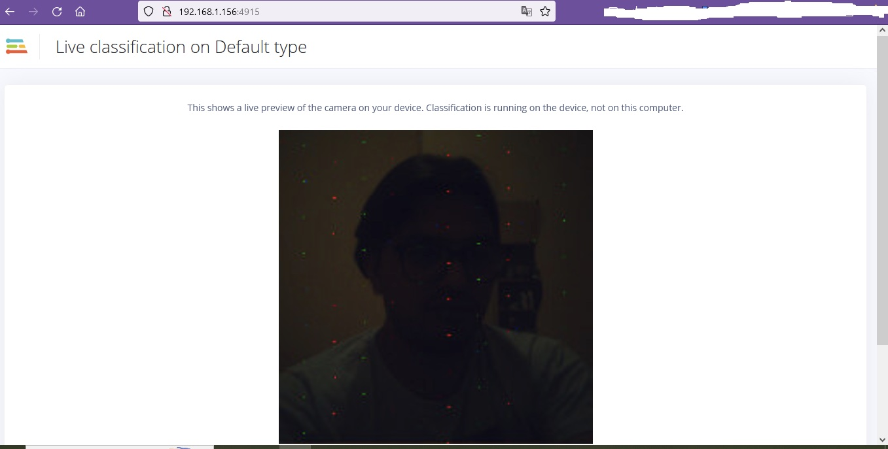

## Conclusion

In conclusion, this project demonstrates a significant advancement in industrial safety measures through the integration of TinyML for hardhat detection using computer vision. By harnessing the power of machine learning and computer vision algorithms, we have successfully developed an efficient and lightweight model that can be deployed on edge devices, enabling real-time monitoring and immediate alerting in case of non-compliance.

Overall, this project exemplifies the potential of TinyML in revolutionizing safety practices in industrial settings. The combination of Edge Impulse’s platform, the Alif Ensemble E7, and our developed model showcases a powerful solution for ensuring compliance with safety regulations and safeguarding the well-being of workers in high-risk environments. This innovative approach sets a new standard for leveraging machine learning and computer vision in industrial safety applications.

