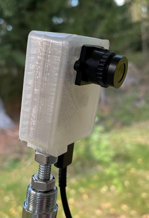
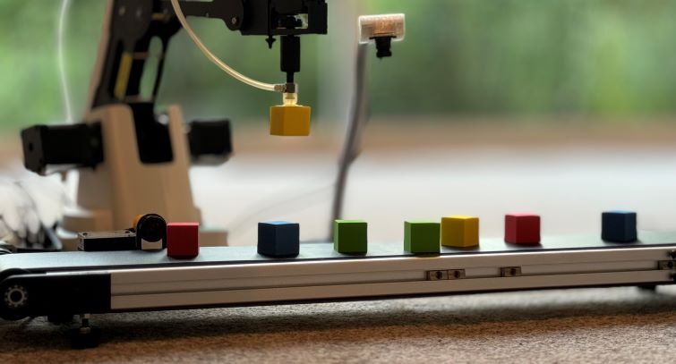
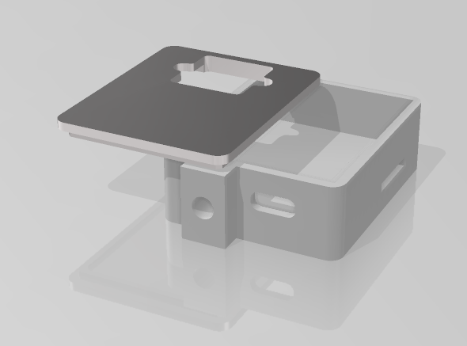
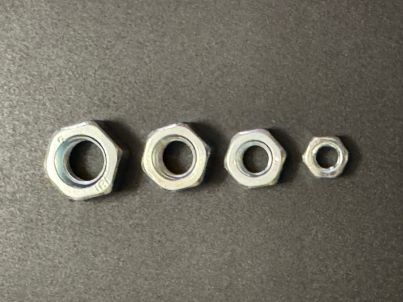
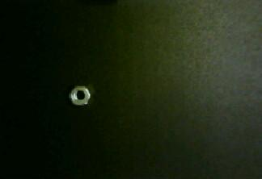
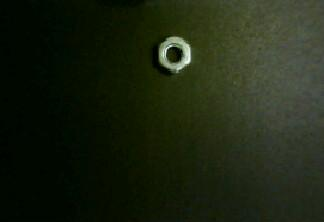
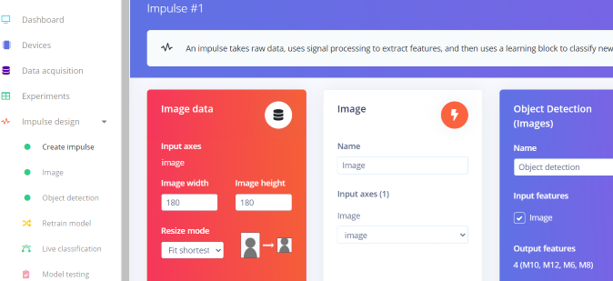
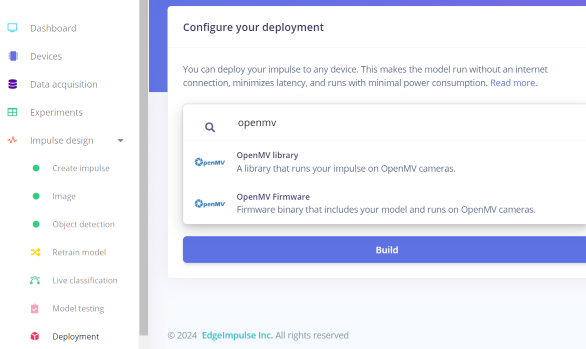

# Object Counting with FOMO - OpenMV Cam RT1062

Created By: Thomas Vikstrom

Public Project Link:

[https://studio.edgeimpulse.com/studio/527570/live](https://studio.edgeimpulse.com/studio/527570/live)

GitHub Repo:

[https://github.com/baljo/count_nuts](https://github.com/baljo/count_nuts)

## Introduction

This tutorial shows how you can use the FOMO object detection algorithm and Edge Impulse with the OpenMV Cam RT1062 to count different sizes of nuts on a moving conveyor belt. The solution automates the process of detecting and counting objects on a conveyor belt, improving efficiency and reducing manual labor. A real-time visualization application provides immediate feedback, allowing you to monitor and control the process accurately.

The hardware used in this project is the aforementioned OpenMV Cam RT1062, together with a Dobot conveyor belt. The OpenMV was chosen because it is a very powerful camera based on the NXP RT1062 microcontroller, and being fully supported by Edge Impulse, is very easy to get started with. The main steps in this tutorial are collecting data with the camera, training and deploying from Edge Impulse, and finally testing on the moving conveyor belt.

A demonstration video provides an overview of the project:





## Use-case Explanation

Counting objects moving on a conveyor belt offers significant advantages for businesses. It enhances inventory management by providing accurate counts that help maintain optimal stock levels, preventing shortages or overstock situations. Additionally, monitoring the count of products ensures quality control, allowing for the detection of defects or missing items, thus upholding product standards. In this project I wanted to learn how a prototype of counting nuts of different sizes can be done, without spending a large sum of money.

The OpenMV cameras run MicroPython, and in addition to machine learning, they also provide more traditional computer vision algorithms. You can read more about the OpenMV RT1062 camera [here](https://openmv.io/products/openmv-cam-rt). The conveyor belt chosen in this tutorial was from [Dobot](https://www.amazon.com/DOBOT-Conveyor-Belt-Simplest-Production/dp/B073NXVW1H), but pretty much any belt can be used.



## Components and Hardware/Software Configuration

### Components

- A supported computer, pretty much anyone with a USB-port for the camera, the Dobot conveyor belt is connected to a Dobot Magician robot, also through USB.
- I strongly recommend to 3D-print a case for the camera, official STL-files can be [found here](https://grabcad.com/library/openmv-cam-rt1062-v4-case-1). As they were not available earlier, I forked a previous version and made some adjustments, resulting in [this STL-file](../.gitbook/assets/object-counting-fomo-openmv-rt1062/OpenMV_RT-1062_case.stl).
    - I've printed with semitransparent TPU as it's more flexible and the LED light shines through the case
    - I recommend to mount the camera to some type of tripod like I did.



### Hardware and Software Configuration

In this project the novel FOMO machine learning algorithm developed by Edge Impulse is used. FOMO (Faster Objects, More Objects) brings object detection to highly constrained devices like MCU's, which lets you count multiple objects and find their location in an image in real-time using up to 30x less processing power and memory than MobileNet SSD or YOLOv5. FOMO as a concept is explained more [here](https://docs.edgeimpulse.com/docs/edge-impulse-studio/learning-blocks/object-detection/fomo-object-detection-for-constrained-devices).

By following the same [tutorial](https://docs.edgeimpulse.com/docs/tutorials/end-to-end-tutorials/image-classification/image-classification-openmv) as I did, you'll be technically up and running in just a few minutes. While the tutorial is for the STM32H7 version of the OpenMV camera, I found that the steps are the same.

- When it comes to the ```Dataset_Capture_Script.py``` program used to capture images, I wanted the camera to only see the black conveyor belt, hence I played with the ```img.scale``` function until I found the correct coordinates (see code snippet below). I also added lens correction although I'm not sure it makes a difference. Remember to later use exactly the same code lines in the inferencing program!

```
...
while(True):
    clock.tick()
    img = sensor.snapshot()
    img.scale(x_scale=1.2, roi=(50, 55, 540, 240))     # <<<<======   Results in a resolution of 324 x 222
    
    # Apply lens correction if you need it.
    img.lens_corr()
...
```

- In this tutorial I created a [Python program](../.gitbook/assets/object-counting-fomo-openmv-rt1062/Dobot%20conveyor%20-%20object%20counting.py) for controlling the conveyor belt, showing a live video feed, and visualizing the counting. You can use any programming language or environment, as the OpenMV camera is simply using the serial terminal to transmit the total count of objects it found in the frame, followed by each class and its corresponding count. E.g. this string ```"3, M10: 2, M8:1"``` means that 3 nuts were found, 2 M10's and 1 M8.
    - The live feed in the program needs a separate camera, the OpenMV camera can't be used as its serial port is occupied by transmitting inferencing data. Starting from around row 102 in the program, you'll find the function ```show_video_feed()```, the camera can if needed be changed from 0 to another in ```cap = cv2.VideoCapture(0)```.

## Data Collection Process

The process of capturing and uploading the images is described in the previous mentioned [tutorial](https://docs.edgeimpulse.com/docs/tutorials/end-to-end-tutorials/image-classification/image-classification-openmv). Once data is uploaded, you need to label the objects, I recommend to use the [AI-assisted labeling queue](https://docs.edgeimpulse.com/docs/edge-impulse-studio/data-acquisition/labeling-queue) as it often dramatically speeds up the process.

For this use case, I suspected beforehand that lighting would play a crucial role, and that one nut might look quite similar to another nut, even if they are of different sizes. To mitigate possible issues, I decided to take pictures with partially different lighting, ending up with approximately 60 pictures per class. 

This picture shows the four different sizes I used: **M12, M10, M8, M6**



When it comes to this type of project, counting similar objects but of different sizes, it's very important that the distance from the camera to the objects is same every time. Hence a tripod or similar is a necessity.

Below is one raw picture of each of the nuts in order of size (M6, M8, M10, M12). As you can see the lighting was not uniform (the black belt is absorbing a lot of light), it's also not that easy to distinguish between M10s and M12s, but in this project the final model outperformed the human model!

**M6**


**M8**


**M10**


**M12**


## Training and Building the Model

After you've uploaded data to Edge Impulse, the next steps are to set up the ML pipeline in the platform. It's made so easy so I did not need to use a tutorial, but for a newcomer I warmly recommend this tutorial [Detect objects with FOMO](https://docs.edgeimpulse.com/docs/tutorials/end-to-end-tutorials/object-detection/detect-objects-using-fomo).

- I played around with different image sizes, and found the sweet spot to be 180 x 180 pixels.



- In the Image block configuration I selected ```Grayscale``` instead of ```RGB``` as the conveyor belt is black and the nuts quite colorless, hence no need to use colors.
- Start the training process from the Object detection configuration page. I tried different settings, but found the default ones to be perfect!
- After a while, depending on the amount of data, you'll get a verdict in form of a F1 score (a mix of precision and recall). If it is unsatisfactory, you need to check your data and most probably add more images. In my case the score was 92 % which was ok for this tutorial, but in a real scenario would need to be improved.


## Model Deployment

Now it's time to test the model in real life!

- Head over to the Deployment tab, and search for 'OpenMV'.



- When just testing, and with smaller models like mine, it's ok to use the library option, but for real production usage it's better to build a firmware version.
- After the build process is completed, instructions are shown for how to deploy the model to the OpenMV camera. With the library option, you just extract the files from the generated .zip file to the camera's memory, while you with the firmware option need to flash the compiled firmware to the camera with help of the OpenMV IDE.
- When the camera is powered, it automatically runs ```main.py``` from its memory. Ensure this program has the proper image conversions you used in the capturing phase! 
- Run the [Python program](../.gitbook/assets/object-counting-fomo-openmv-rt1062/Dobot%20conveyor%20-%20object%20counting.py) or your own version to receive inferencing data from the OpenMV camera. 
    - Remember that if you want a live video feed, you need to connect a separate camera to your computer

## Results

The results from this project met the objectives, to be able to count objects with the OpenMV camera, using FOMO. The whole solution is not perfect as the accuracy could be improved by adding more data. The current version is counting all the nuts it identifies, but adding a running total would obviously be beneficial in a production scenario. This needs partially another approach on the Python-side as the conveyor belt would need to be paused, inference run on the camera, before resuming. I tried to implement this, but as the conveyor belt is running completely asynchronously, it is challenging to stop at a given time. As the ML model itself is technically working perfectly, I decided to leave this improvement for later.


## Conclusion

The goal of this tutorial was to show how to count objects, using FOMO and the OpenMV Cam RT1062. As mentioned, the goal was achieved, and while a few technical issues occurred on the conveyor belt implementation, the overall process was quite straightforward. 

All the code and files used in this write-up are [found on Github](https://github.com/baljo/count_nuts), and the public Edge Impulse project is [located here](https://studio.edgeimpulse.com/studio/527570). Feel free to clone the project for your own use case.

