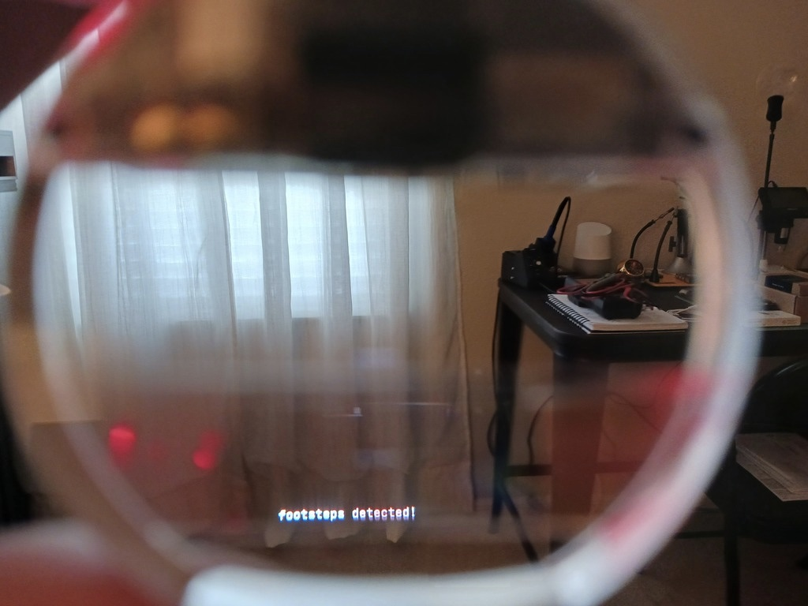
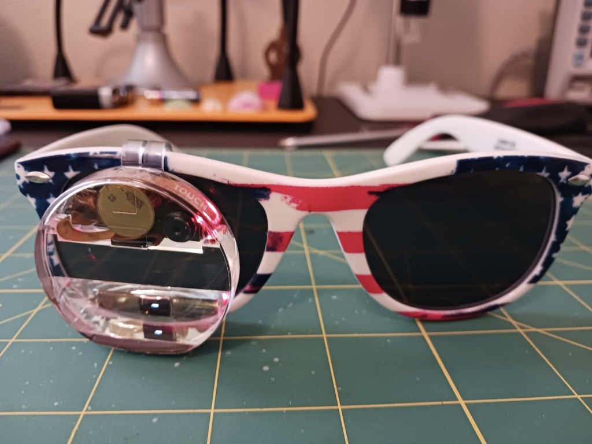
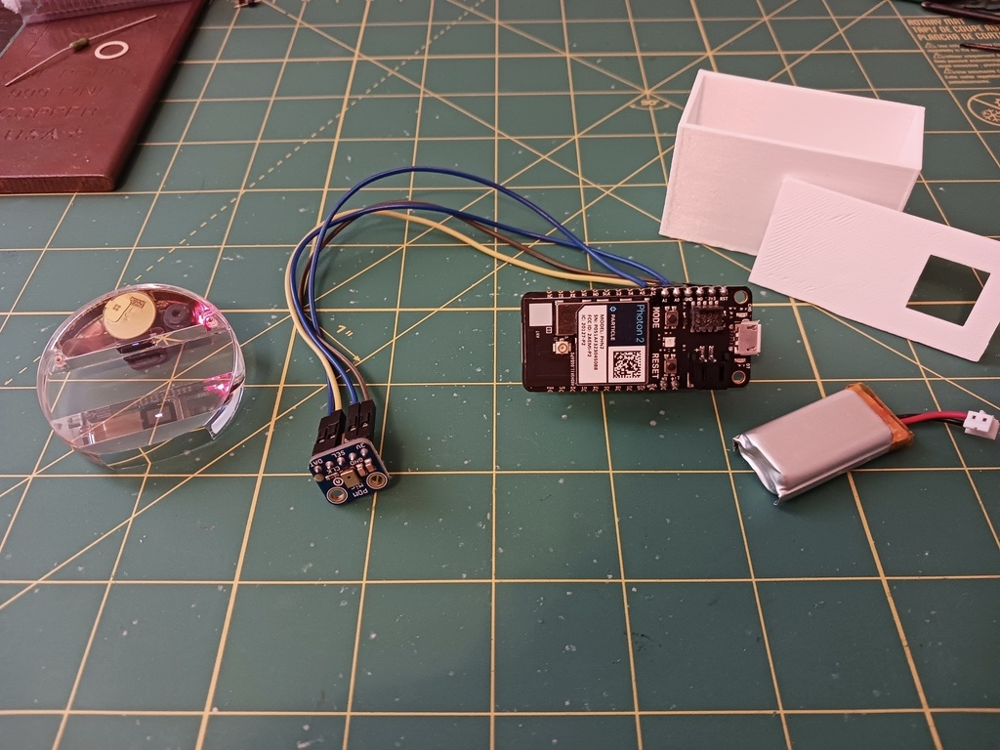
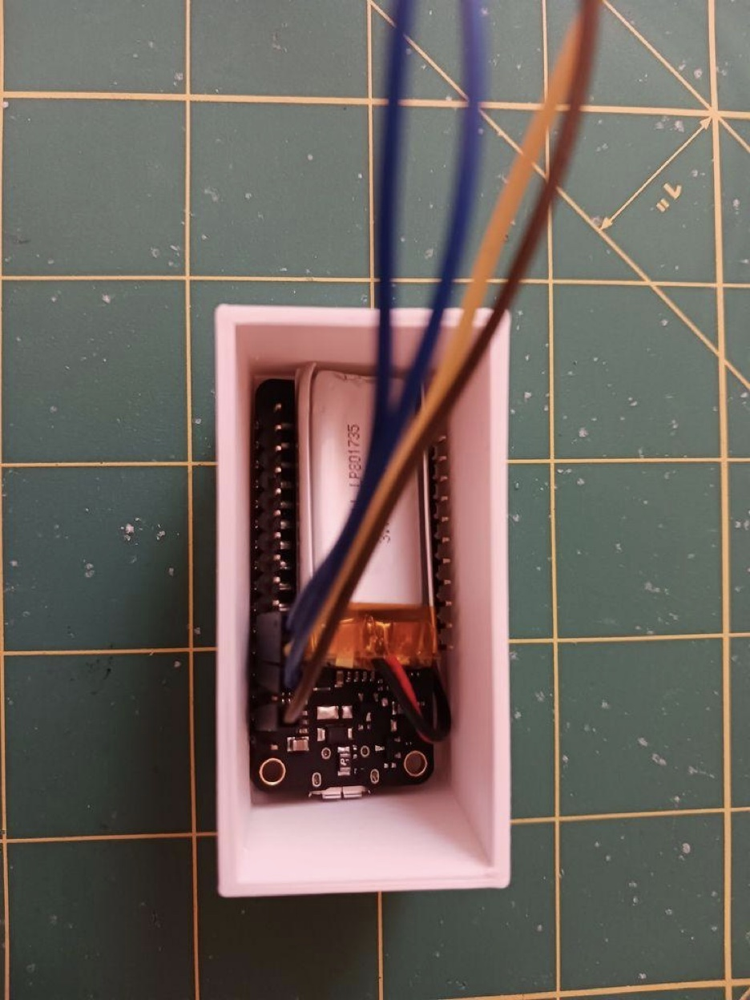
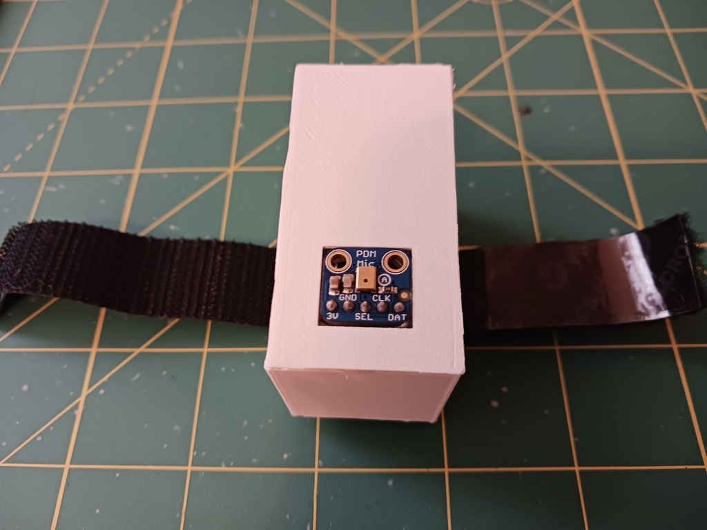
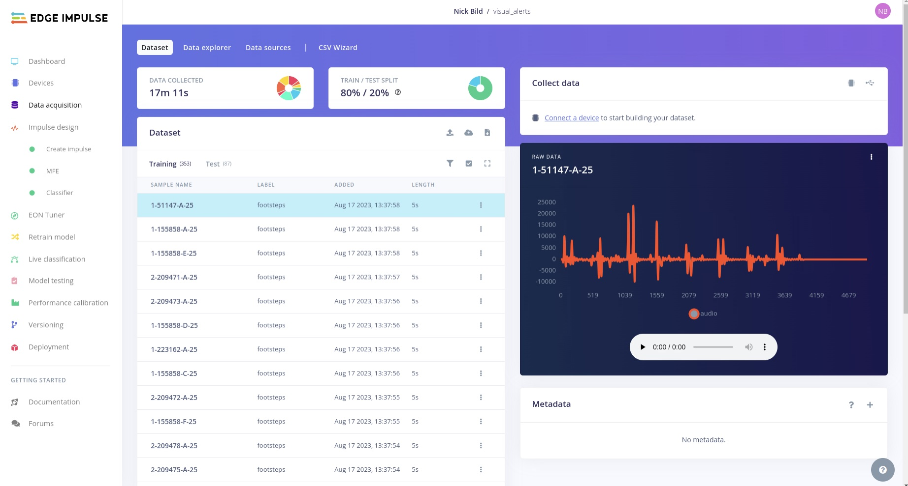
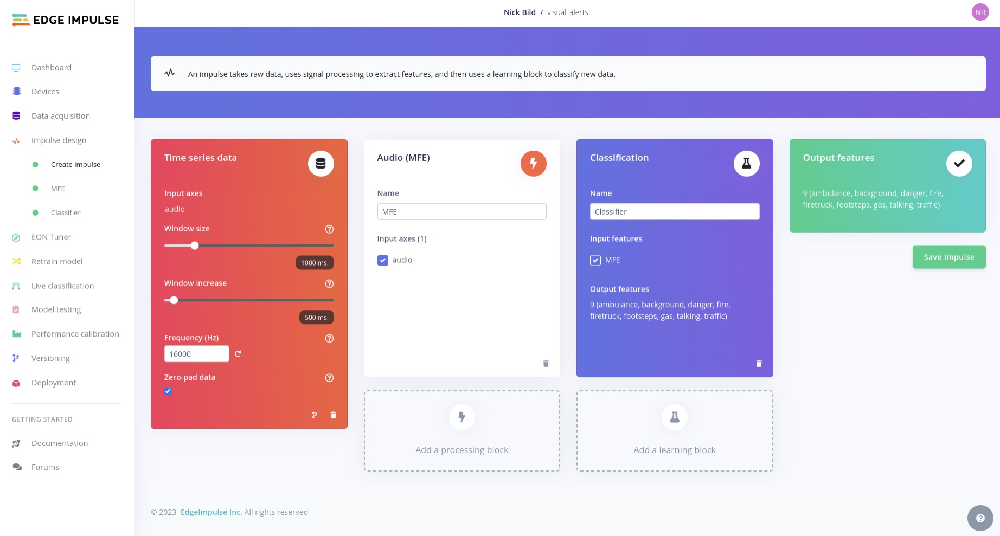
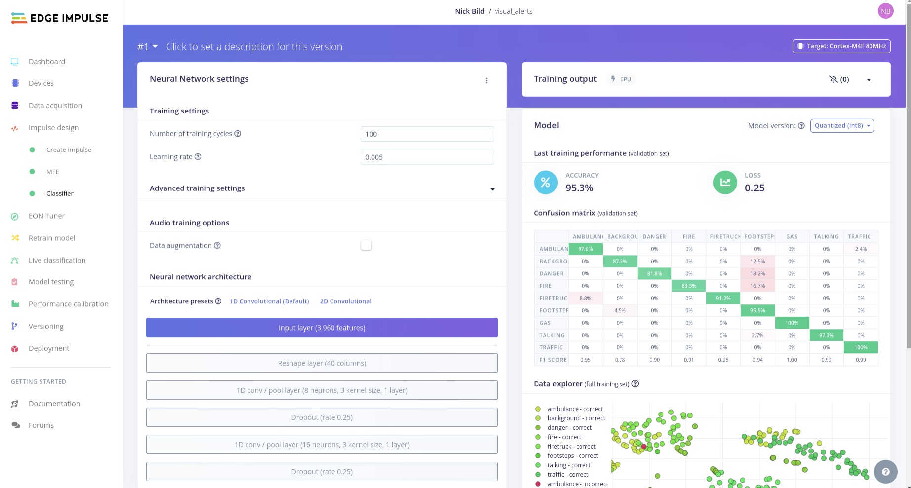
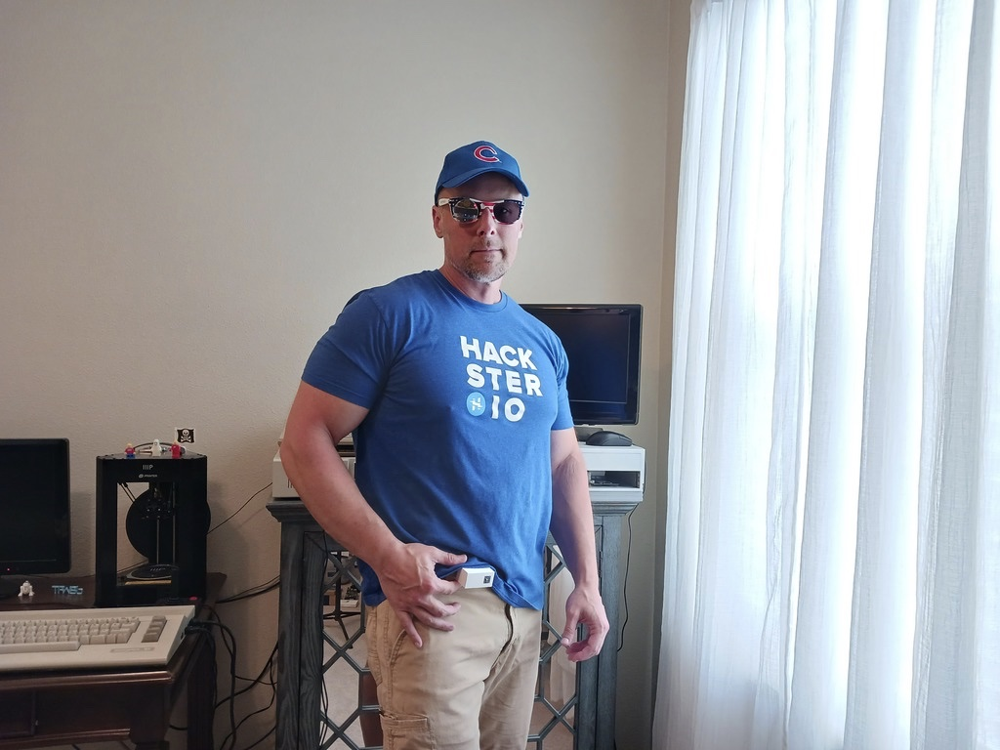

# SonicSight AR - Sound Classification with Feedback on an Augmented Reality Display

Created By: Nick Bild

Public Project Link: [https://studio.edgeimpulse.com/public/272259/latest](https://studio.edgeimpulse.com/public/272259/latest)

GitHub Repo: [https://github.com/nickbild/visual\_alert](https://github.com/nickbild/visual\_alert)

## Intro

Hearing-impaired people face significant challenges due to their inability to perceive auditory cues, such as emergency sirens, alarms, and traffic sounds. These cues are essential for alerting people to potential dangers and ensuring their safety. Without auditory awareness, hearing-impaired people may not be aware of approaching emergency vehicles, fire alarms, or even oncoming traffic, which can lead to life-threatening situations.

According to the World Health Organization, around 466 million people worldwide have a disabling hearing loss, which accounts for approximately 5% of the global population. In the United States alone, the Centers for Disease Control and Prevention reported that about 15% of adults aged 18 and over experience some degree of hearing loss.

In an attempt to address this problem, I have created SonicSight AR. This device uses machine learning to recognize sounds, like emergency vehicles and various types of alarms. When these sounds are detected, the user of SonicSight AR is alerted to that fact via a message that floats within their field of vision through the use of a low-cost augmented reality display.

SonicSight AR also solves some other unique problems often experienced by the hearing-impaired — it also detects footsteps and talking to prevent the wearer from being startled when someone approaches them unexpectedly.

To achieve this, a [Particle Photon 2](https://store.particle.io/products/photon-2) is used for listening and running the machine learning model, and a [Brilliant Labs Monocle](https://brilliant.xyz/products/monocle) is used for the display.

## Hardware Requirements

* 1 x Particle Photon 2
* 1 x PDM MEMS microphone
* 1 x Brilliant Labs Monocle
* 1 x 400 mAh LiPo battery
* Optional 3D printed case and lid
* Optional velcro strap

## Software Requirements

* Edge Impulse Studio
* Particle Workbench

## How It Works

The [Particle Photon 2 development board](https://store.particle.io/products/photon-2) is wired to a supported PDM MEMS microphone that comes with the [Edge ML Kit for Photon 2](https://store.particle.io/products/edge-ai-kit-for-photon-2?variant=40586378051653). Wiring diagrams can be found [in the documentation](https://docs.edgeimpulse.com/docs/development-platforms/officially-supported-mcu-targets/particle-photon-2). After assembly is completed, this hardware can be powered by a LiPo battery (a 400 mAh battery was used in this project).

An audio classification neural network was developed with Edge Impulse Studio to distinguish between eight types of sounds (ambulance, danger alarm, fire alarm, firetruck, footsteps, gas alarm, talking, traffic sounds), as well as normal background noises.

When one of the sounds is recognized, the Photon 2 will send a program to the Brilliant Labs Monocle, wirelessly via Bluetooth Low Energy, which is attached to a pair of glasses. This causes text to be overlaid on the wearer’s peripheral vision. The text provides a visual alert to warn of a sound that otherwise could not be heard.

The Photon 2, microphone, and battery were placed inside a 3D printed case. A velcro strap was attached to the case such that it could be attached to a belt.

## Data Preparation

Data was extracted from the following publicly available datasets:

[https://www.kaggle.com/datasets/devisdesnug/alarm-dataset-3000](https://www.kaggle.com/datasets/devisdesnug/alarm-dataset-3000) [https://www.kaggle.com/datasets/javohirtoshqorgonov/noise-audio-data](https://www.kaggle.com/datasets/javohirtoshqorgonov/noise-audio-data) [https://www.kaggle.com/datasets/mrgabrielblins/speaker-recognition-cmu-arctic](https://www.kaggle.com/datasets/mrgabrielblins/speaker-recognition-cmu-arctic) [https://www.kaggle.com/datasets/vishnu0399/emergency-vehicle-siren-sounds](https://www.kaggle.com/datasets/vishnu0399/emergency-vehicle-siren-sounds)

A total of 50 audio clips were extracted from each class, then were uploaded to Edge Impulse Studio via the Data Acquisition tool. Labels were applied during the upload, and an 80%/20% train/test dataset split was automatically applied.

## Building the ML Model

To analyze the data and make classifications, an Impulse was designed in Edge Impulse Studio. It consists of preprocessing steps that split the incoming audio data into one second segments, then extract the most meaningful features. The features are then forwarded into a convolutional neural network that determines which one of the classes the sample most likely belongs to.

The training accuracy was quite good considering I supplied such a small training dataset, coming in at 95.3%. Model testing showed that this result was not simply overfitting of the model to the training data, with a reported classification accuracy of better than 88%. This is better than what is needed to prove the concept, but by supplying more data, and more diverse data, I believe that the accuracy could be improved significantly.

## Deploying the Model

The Photon 2 is fully supported by Edge Impulse, so I downloaded a Particle library using the Deployment tool. This was easily imported into Particle Workbench, where I could further customize the code to fit my needs.

In this case, I modified the code to connect to the Monocle via Bluetooth Low Energy, then when sounds are recognized, it sends the Monocle a message to display in front of the user. Using Particle Workbench the program was compiled and flashed to the Photon 2 in a single step.

## Conclusion

For a proof of concept, I found SonicSight AR to work surprisingly well. And given that it is battery powered, completely wireless, self-contained, and unobtrusive to use, I could see a device like this being used in real-world scenarios with just a bit of refinement. Not bad for a few hundred dollars in parts and a couple days of work.
