# Vehicle Security Camera - Arduino Portenta H7 

Created By: Solomon Githu

Public Project Link: [https://studio.edgeimpulse.com/studio/552230](https://studio.edgeimpulse.com/studio/552230)

GitHub Repo: [https://github.com/SolomonGithu/image_classification_on_Arduino_Portenta_H7](https://github.com/SolomonGithu/image_classification_on_Arduino_Portenta_H7)

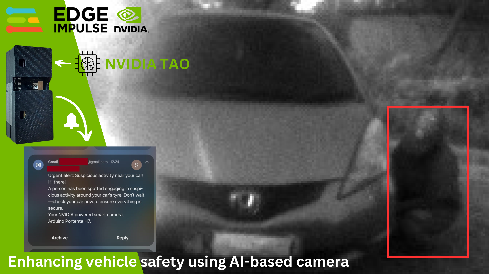

## Introduction

According to the National Highway Traffic Safety Administration in America, over 1 million vehicle thefts were reported in 2023 - showing that a vehicle was stolen every 32 seconds! The estimated value of vehicles stolen nation-wide reaches nearly $4.1 billion each year, with 45 percent of stolen vehicles never recovered. 

As vehicle usage continues to grow, so does the rise in their thefts. Several factors contribute to this issue, such as the location where the vehicle is parked, its value, security features such as reinforced components (riveting), car alarms, dashboard cameras, etc. While existing anti-theft measures are widely used, they have proven to be insufficient in curbing the increasing number of thefts. Parking lots remain hotspots for such crimes, and most of the current vehicle monitoring systems lack the ability to detect suspicious activities near vehicles, leaving them highly vulnerable to theft.

Computer vision is a sector of Artificial Intelligence (AI) that enables computers to see and analyze images similar to our sense of sight. The goal is to allow models to be taught to recognize visual cues and make data-driven decisions, interpreting their environment to perform tasks requiring visual understanding. Imagine a security guard stationed in a parking lot, attentively monitoring vehicles and being able to identify suspicious activities, such as someone attempting to break into a car or detach components like side mirrors, tires, or wipers. In a similar way, computers can also be trained to recognize such visual actions. Using AI and computer vision, systems can be developed to detect unauthorized behavior, such as a person tampering with car tires or breaking a window, replicating the way a person would interpret the visual actions.

## Project Overview

My intention in this project is to develop an innovative smart surveillance camera that can interpret suspicious visual actions around a vehicle such as spotting someone tampering with car tires, or spotting someone trying to break a car's window.

To protect our vehicles, we often rely on security guards to keep watch and occasionally we also check on our cars to ensure that they are safe and intact. Even with CCTV cameras in parking lots, human intelligence is still essential for visual inspection and interpreting activities around vehicles. This got me thinking: what if we could transfer our human intelligence to machines and enable them to interpret suspicious actions, such as tampering with a car tire or attempting to break a window. This task can be realized with image classification and/or object detection, showcasing an innovative application of AI to enhance vehicle security.

A Machine Learning model needs to be trained to recognize the actions that we seek to monitor. For demonstration and hypothesis testing, we can train a model to detect various scenarios: when a vehicle is safe, when someone is tampering with its tires, or when someone is attempting to break into its window. By simulating these actions on a vehicle and capturing them as video or image data, we can use this dataset to train the model. Once trained, the model can identify these activities in real-time and send alerts whenever such actions are detected, enhancing vehicle security.

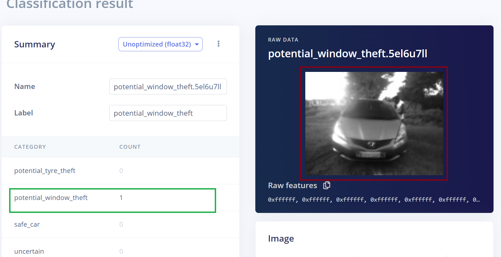

I used the [Arduino Portenta H7](https://docs.arduino.cc/hardware/portenta-h7), with a Vision Shield, to run a Machine Learning model that can monitor a vehicle and alert a user when situations of tire tampering and window breaking are detected. The Arduino Portenta H7 is a powerful development board with both a Cortex-M7 microcontroller and a Cortex-M4 microcontroller, WiFi and Bluetooth  connectivity, and an extension slot to connect the Portenta vision shield - which has a camera and dual microphones for intelligent voice and vision AI solutions. The M4 core runs at 240MHz while the M7 core runs at 480MHz. For this use case, the Arduino Portenta H7 is a good choice as it has a camera, wireless communication capabilities useful for sending messages, and the ability to run optimized Machine Learning models. While this project could have been implemented using more powerful hardware such as a GPU, AI accelerator, or a CPU, there have been huge advancements in hardware and software ecosystems enabling Machine Learning to be brought to small, low-power and resource-constrained devices like microcontrollers. Some problems don't need high performance computers to be solved. A small, low-cost and low-power device like an Arduino board can also get the job done!

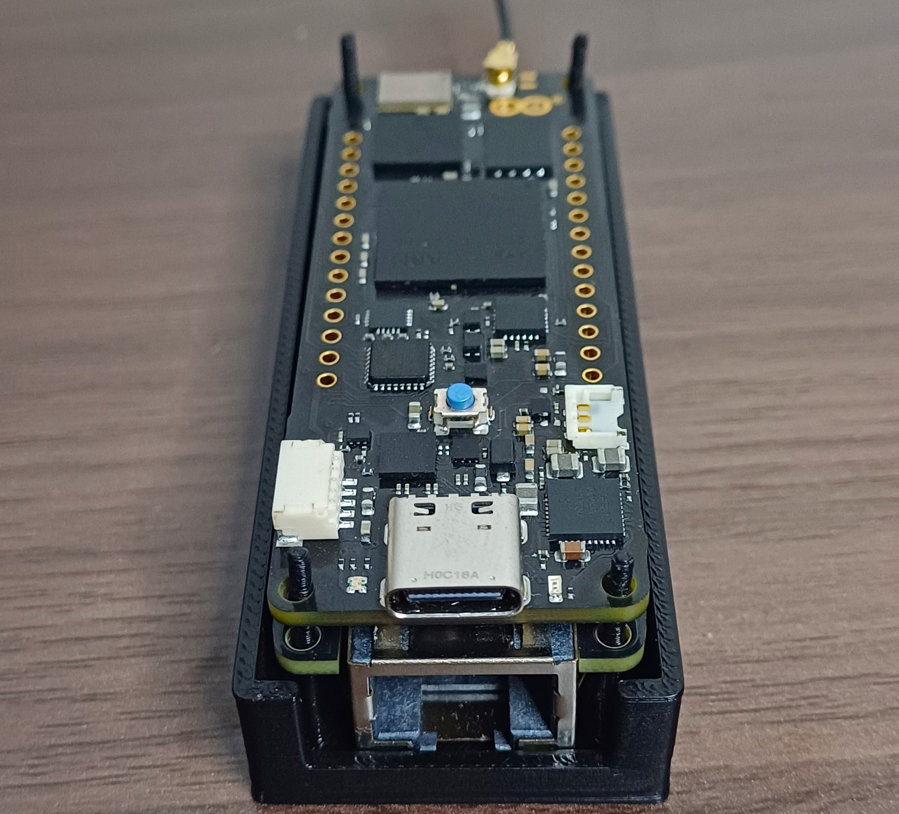

As embedded technology is also advancing, software developments are also coming up and they are enabling TinyML. For training and deploying a model, I chose the [Edge Impulse](https://edgeimpulse.com/) platform because it simplifies the development and deployment of Edge AI applications. The platform supports collecting data such as images directly from the edge device (in this case the Arduino Portenta H7 with camera), has the ability to build various machine learning pipelines each with its deployment performance shown, and the ability to optimize Machine Learning models, enabling them to run even on microcontrollers with less flash and RAM storage. This documentation will cover everything from preparing the dataset, training the model, deploying it to the Arduino Portenta H7, and adding a feature that sends an email when a potential tire theft or window breaking is detected.

You can find the public Edge Impulse project here: [Advanced vehicle security monitoring](https://studio.edgeimpulse.com/public/552230/latest). To add this project into your Edge Impulse account, click "Clone this project" at the top of the page. Next, go to the section "Deploying the Impulses to Arduino Portenta H7" for steps on deploying the model to the Portenta H7 development board.

## Use Case Explanation

The use of security guards to guard vehicles has proven to be effective, and in certain circumstances it outperforms security alternatives like car alarms and CCVT cameras. While CCTV has numerous benefits, the debate over whether the technology is more successful than security personnel remains. However, one thing is certain: both CCTV and security guards are effective deterrents to potential criminals. Studies have found that neighborhoods with visible cameras have decreased crime rates, including vehicle theft. A combined approach of CCTV and security guards will maximize deterrent, monitoring, and response capability, resulting in increased protection.

While CCTV technology has existed for some time, it still requires human intervention to analyze the footage. However, progress in the Artificial Intelligence (AI) field combined with an increase in computational power has improved the scale, accuracy and development time of image data processing. At its core, computer vision seeks to replicate the capabilities of human vision by digitally perceiving and interpreting the world. In this project, the intention is to have a computer look at an image and interpret the actions seen in the image such as someone touching a car tire, or someone attempting to break a window. Once these actions are detected, the device will then send an email notification to the vehicle owner.

By using pre-trained networks, we can train Machine Learning models to understand visual actions such as breaking a car window, removing a car tire, removing components such as a side mirror, etc.  The transfer learning approach uses a pretrained model which is already trained using a large amount of data. This approach can significantly reduce the amount of labeled data required for training. It also reduces the training time and resources, and improves the efficiency of the learning process, especially in cases where there is limited data available. Even for a demonstration project, we are still looking for a faster, easier way to create highly accurate, customized, and enterprise-ready AI model to power our smart vehicle surveillance camera. In this case, I experimented with the [Nvidia TAO](https://developer.nvidia.com/tao-toolkit) (Train, Adapt, Optimize) Toolkit. Nvidia TAO Toolkit uses the power of transfer learning while simultaneously simplifying the model training process and optimizing the model for inference throughput on the target platform. With TAO, users can select one of 100+ pre-trained vision AI models from NGC and fine-tune and customize on their own dataset without writing a single line of code. The image below shows an overview of TAO (source: https://docs.nvidia.com/tao/tao-toolkit/text/overview.html)

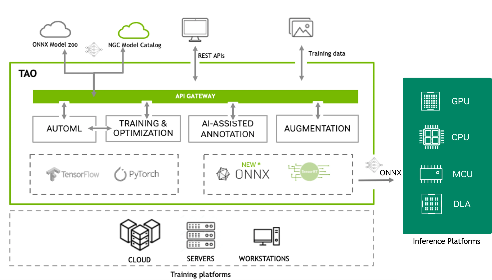

Training a model requires setting up various configurations, such as data processing formats, model type, and training parameters. As developers, we experiment with different configurations and track their performance in terms of processing time, accuracy, classification speed, Flash and RAM usage. To facilitate this process, Edge Impulse offers the [Experiments](https://docs.edgeimpulse.com/docs/edge-impulse-studio/impulse-design-and-experiments) feature. This enables us to create multiple Machine Learning pipelines (Impulses) and easily view the performance metrics for all pipelines, helping us quickly understand how each configuration performs and identify the best one. Edge Impulse has also [integrated Nvidia TAO](https://docs.edgeimpulse.com/docs/edge-impulse-studio/learning-blocks/nvidia-tao) in the Studio platform, allowing us to import various pre-trained models or train custom ones, and optimize them for deployment, even on MCUs such as the Arduino Portenta H7.

Finally, for deployment, the project requires a low-cost, small and powerful device that can run optimized Machine Learning models with low latency. I also wanted the device to have wireless communication capabilities so that it can send an SMS or email (for demonstration) when the actions of tire theft and window breaking are detected. In this case, the deployment mode makes use of the Arduino Portenta H7 development board owing to it's small form factor, high performance and seamless support for vision AI applications.

## Components and Hardware Configuration

Software components:
- Edge Impulse Studio account
- OpenMV IDE
- Arduino IDE

Hardware components:
- A personal computer
- [Arduino Portenta H7 with Portenta Vision Shield](https://store.arduino.cc/products/portenta-h7?srsltid=AfmBOorl4bLVv4h8-kFwO1e0YO5YquozZKuf8Ra_F09hf-w1Feq56g2S)
- 2.4GHz WiFi antenna with female U.FL connector
- [3D printed case for the Portenta H7](https://www.printables.com/model/1110681-arduino-portenta-h7-case-ethernet-vision-shield). Available to download on Printables.com
- USB-C cable for programming the Portenta H7

## Building the Model

### Collecting Data

In this project, a Machine Learning model will be classifying images into three classes: safe_car, potential_window_theft and potential_tire_theft for three situations where a car is safe, someone is seen tampering with a window, or tire respectively. In Machine Learning, it is best to train a model with data that is a good representation of what the model will see when it is deployed. In this case, instead of relying on open source car images datasets, I opted to collect custom data by simulating vehicle tampering scenarios in a controlled environment. Using a personal car in a compound, I safely acted out scenarios that I was tampering with the car tires and attempting to break the windows. During these simulations, the Arduino Portenta H7 was capturing images and automatically uploading them to an Edge Impulse project, ensuring the dataset was both relevant and tailored for the task.

Since the Arduino Portenta H7 is fully supported by Edge Impulse, the data collection process is easy. Following the [Edge Impulse documentation](https://docs.edgeimpulse.com/docs/edge-ai-hardware/mcu/arduino-portenta-h7) we first [download the Edge Impulse data collection firmware](https://docs.edgeimpulse.com/docs/edge-ai-hardware/mcu/arduino-portenta-h7#id-3.-update-the-firmware) for the Portenta H7. This firmware allows us to collect sensor data from the Portenta H7 (such as an image or sound) and automatically have the data uploaded to an Edge Impulse project. Using a USB-C cable with data transfer, connect the Portenta H7 to your computer and double-press the reset button to put it in bootloader mode (this allows us to update the device's firmware). Run the flashing script according to your Operating System and then press the reset button once to launch the new firmware. Edge Impulse has also created a short and comprehensive [video tutorial](https://youtu.be/9eyygfjGLLQ) on these steps.

Next, create a project in the Edge Impulse [Studio](https://studio.edgeimpulse.com/login) platform. Before starting to work on the project, I prefer informing the platform about the device that I am targeting. To do this we can click the "Target" button on the top right section of the page and select "Arduino Portenta H7 (Cortex-M7 480MHz)" from the dropdown list for "Target device". When you set the target device in the Studio (or using the Python SDK), it automatically generates on-device performance metrics for tasks such as the digital signal processing, model's classification time, and RAM and ROM usage. This information is invaluable as it provides insights into how efficiently the digital processing and model will perform on the targeted device, such as the Portenta H7. Most importantly, the information also assists us to determine whether the processing algorithm and model are capable of "fitting" within the constraints of the target device.

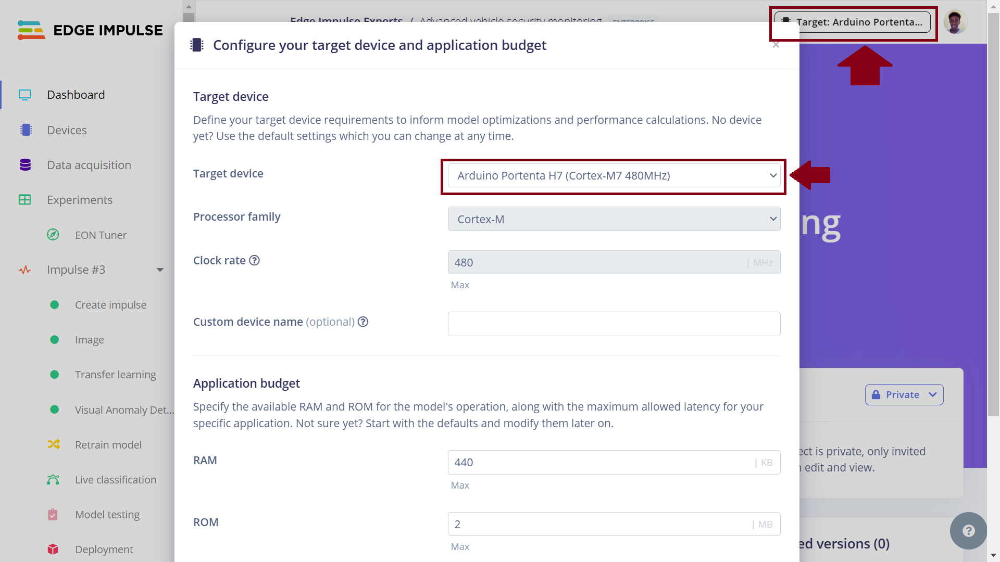

To sample images from the Arduino Portenta H7, I used the [WebUSB feature](https://www.edgeimpulse.com/blog/collect-sensor-data-straight-from-your-web-browser/) which allows connecting to a development board via Web Serial. Currently the Web Serial integration only works with [fully-supported development boards](https://docs.edgeimpulse.com/docs/fully-supported-development-boards). If you are relying on the data forwarder you will still need to use the Edge Impulse CLI. With the Portenta H7 connected to your computer, on the Edge Impulse project go to "Data acquisition" and click the USB icon which is in the "Collect data" card. This will open a window that prompts us to select the available USB device on the computer. In my case, I selected the device on COM11 which is the Portenta H7.

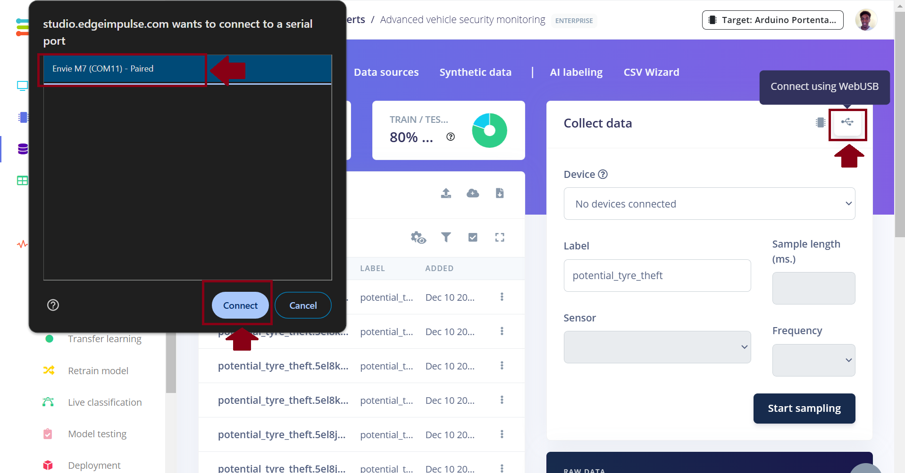

After connecting to the Arduino Portenta H7, we will see a live feed coming from the camera and this confirms that the Portenta H7, camera and connection to the Edge Impulse project work well. In the configuration menu, we can enter the label for the first class, "safe_car", in the Label field and set the camera sensor to 128x96.

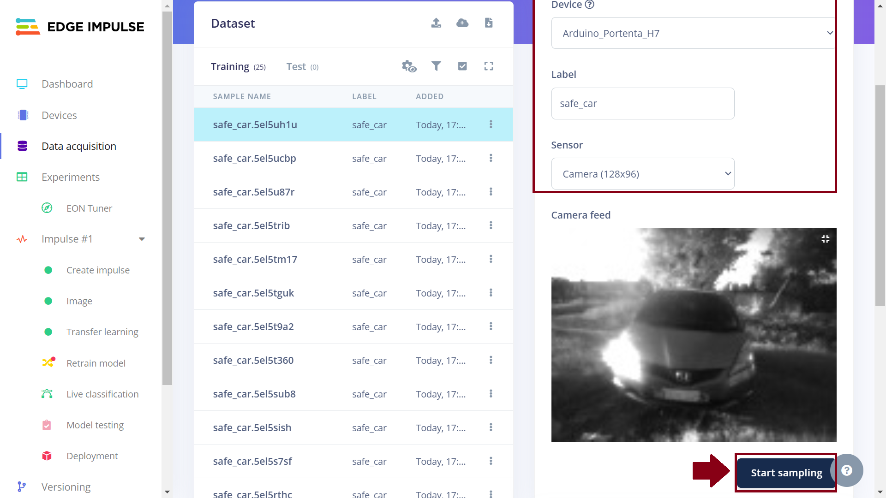

Before starting to collect data, during the daytime, I mounted the Portenta H7 on a tripod and faced it on a car in a compound. With no one around the vehicle, I captured 60 images of the situation by pressing the "Start sampling" button below the camera feed.

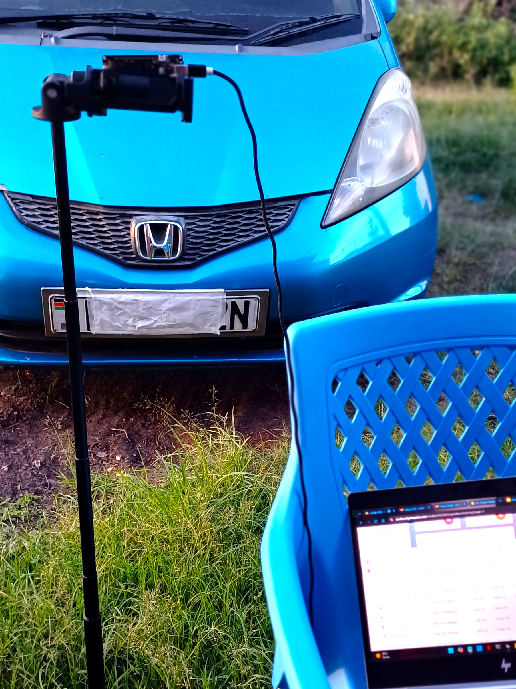

Since this was an outdoor activity I saw that the HM01B0 camera on the Vision Shield did not manage to take clear images especially when it was sunny. There was overexposure whereby the camera was receiving too much light, resulting in a washed-out image with low detail. It was also difficult to spot someone standing next to the vehicle since the sunshine would be reflected by their body and the camera would only receive light. In this case, I collected the images, and also run inference, during sunset when there was a lower amount of sunshine. Alternatively, camera filters or exposure settings could also be changed.

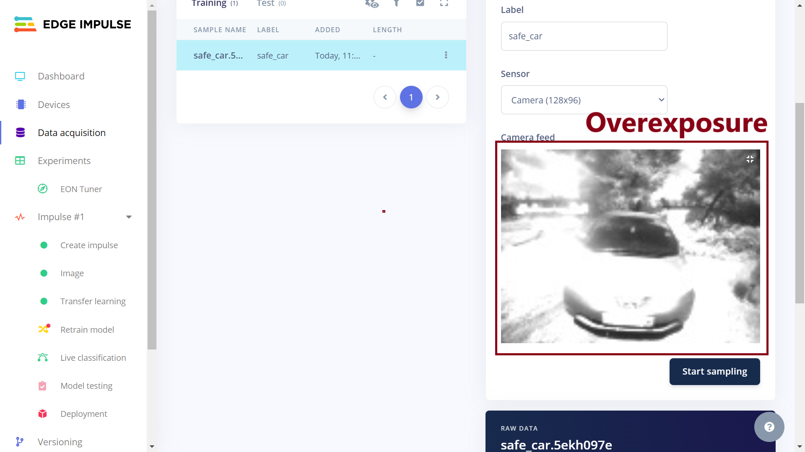

After collecting images of the safe car situation (when no person is around it), I then acted like I was tampering with the front tires and had someone sample images from the Portenta H7. At the end we collected 68 images for this class.

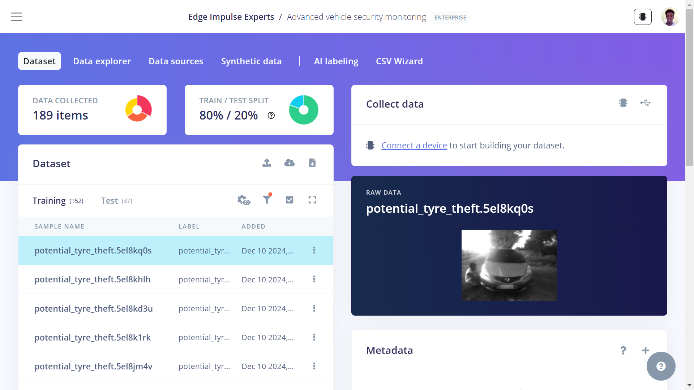

Finally, for the third situation, I acted as if I was breaking the car windows and had someone collect images as this activity was ongoing. For this class, we took 61 images.

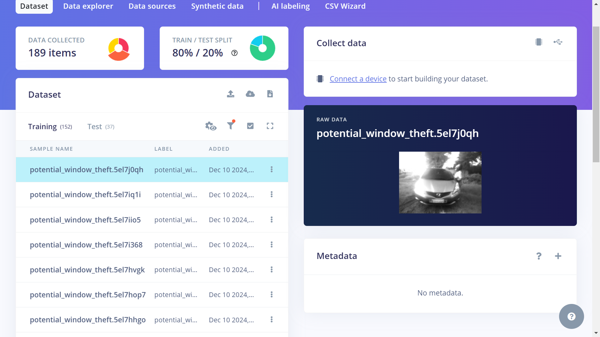

Once we have the entire dataset prepared, we first need to [split](https://docs.edgeimpulse.com/docs/edge-impulse-studio/data-acquisition#dataset-train-test-split-ratio) it for Training and Testing. The popular rule is 80/20 split and this indicates that 80% of the dataset is used for model training purposes while 20% is used for model testing. In the Edge Impulse Studio, we can click red triangle with exclamation mark (as shown in the image below) and this will open an interface that suggests splitting our dataset.

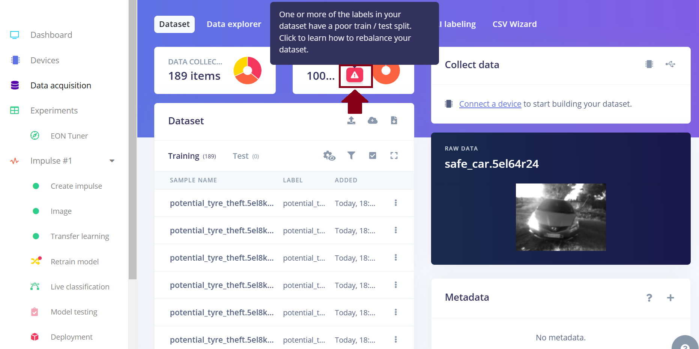

We then click the button "Perform train / test split" on the interface that opens. This will open another interface that asks us if we are sure of rebalancing our dataset. We need to click the button "Yes perform train / test split" and finally enter "perform split" in the next window as prompted, followed by clicking the button "Perform train / test split".

### Training the Machine Learning Model, with Experiments

After collecting data for our project, we can now train a Machine Learning model for the required image classification task. To do this, on the Edge Impulse project, we need to create an [Impulse](https://docs.edgeimpulse.com/docs/edge-impulse-studio/impulse-design-and-experiments). An Impulse is a configuration that defines the input data type, data pre-processing algorithm, and the Machine Learning model training.

One of the great features of the Edge Impulse platform is the simplified development and deployment of Machine Learning models. Recently, Edge Impulse released the [Experiments](https://docs.edgeimpulse.com/docs/edge-impulse-studio/impulse-design-and-experiments#experiments) feature which allows projects to contain multiple Impulses, where each Impulse can contains either the same combination of blocks or a different combination. This allows us to view the performance for various types of learning and processing blocks, while using the same input training and testing datasets.

#### 1. Experimenting with Nvidia TAO Toolkit

Still on the Edge Impulse project, I proceeded to create the first Impulse. For the image data configuration, I set it to 128x128 pixels and the resize mode to squash. I selected the "Image" processing block since it preprocesses and normalizes image data, and optionally reduces the color depth. For the learning block, I selected "Transfer Learning (Images)" as this fine tunes a pre-trained image classification model on your data. It gives a good performance even with relatively small image datasets. Once set, click "Save Impulse" to set these configurations.

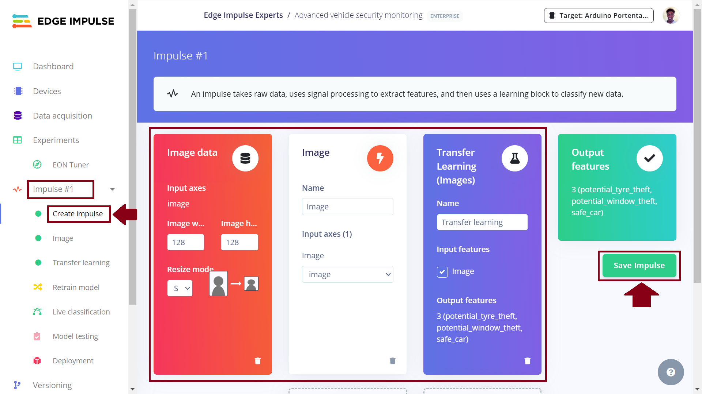

Next, we need to configure the processing block, Image. Click "Image" and on the user interface select the "RGB" option for the color depth. Next, click "Save parameters" followed by the "Generate features" button on new user interface that will come up. The feature generation process will take some time depending on the size of the data. When this process is finished, the [Feature explorer](https://docs.edgeimpulse.com/docs/edge-impulse-studio/processing-blocks/feature-explorer) will plot the features. Note that these features are the output of the processing block, and not the raw images. In my case, we can see that there is a good seperation of the classes (represented with the orange, green and blue dots) and this indicates that simpler Machine Learning (ML) models can be used with greater accuracy.

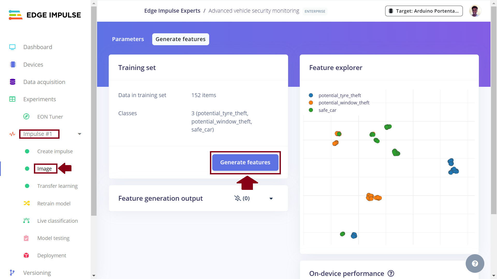

The last step is to train our model. We click "Transfer learning", which is our learning block that trains a model using the data generated by the processing block, Image. On the page, scroll down under the "Transfer Learning (Images) settings" up to "Neural network architecture". First click the trash bin icon on the default model followed by clicking "Choose a different model" and this will bring up a window with a list of various models that we can seamlessly select and train with our data. 

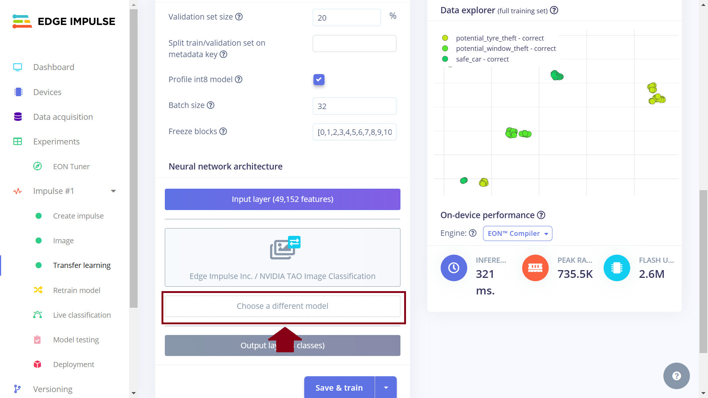

Select add for the "NVIDIA TAO Image Classification" item on the list. Note that the Nvidia TAO model is offered in the Professional and Enterprise packages, but users can access the Enterprise package with a [14-day free access](https://studio.edgeimpulse.com/trial-signup) that doesn't require a credit card.

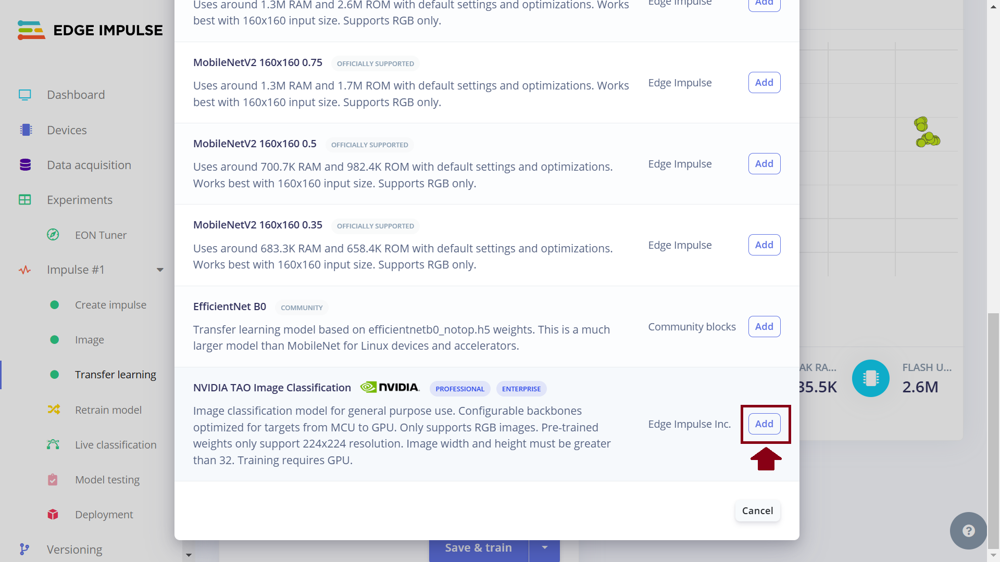

Edge Impulse has simplified the process of using Nvidia TAO by presenting only essential parameters from the TAO specification files through simple menus on the user interface. Model architectures in the Nvidia Model Zoo were originally developed to run on Nvidia hardware, but as of this time, Edge Impulse has adapted YOLOv3, YOLOv4, SSD and RetinaNet TAO models for deployment to embedded devices. The above TAO models can be used with Darknet, GoogleNet, MobileNet, Resnet, SqueezeNet, VGG and CSPDarknet backbones. To learn more about the Nvidia TAO Toolkit and the Edge Impulse integration, I would recommend checking out the [Nvidia TAO and Edge Impulse for Renesas RA8 ebook](https://pages.edgeimpulse.com/nvidia-tao-and-edge-impulse-for-renesas-ra8) as it has a more comprehensive explanation and guide. For my case, I chose the MobileNetV2 800K params backbone since I was targeting a resource constrained device, the Portenta H7 which has 1MB of RAM and 2MB of ROM in the STM32H747 MCU. I enabled GPU training processor, set the number of training cycles (epochs) to 100 and used 0.01 for the learning rate. Once the training was completed, the model had an accuracy of 100% and a loss of 0.01.

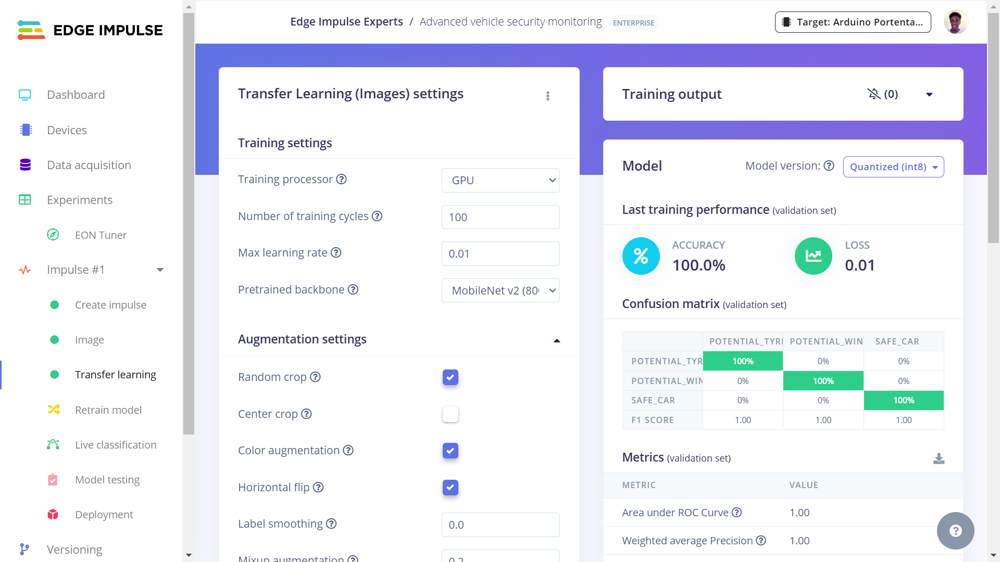

When training our model, we used 80% of the data in our dataset. The remaining 20% is used to test the accuracy of the model in classifying unseen data. We need to verify that our model has not overfit, by testing it on new data. To test our model, we first click "Model testing" then "Classify all". Our current model has an accuracy of 100%. This may seem as an impressive performance, but there is still need to add more data and also add diversity to the data such as capturing images of a car in different places, using different car models and also have different people act the targeted actions.

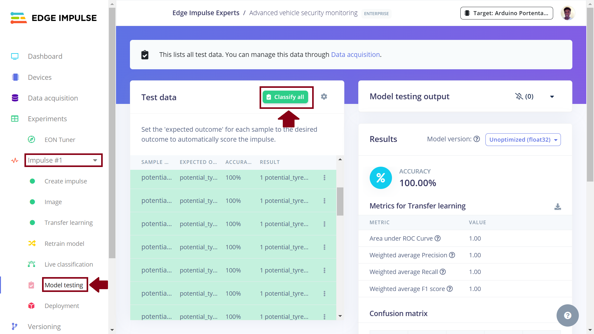

At last, we have a simple Machine Learning model that can detect suspicious activity around a vehicle! However, how can we tell if this configuration is the most effective? For my experimentation, I decided to first test a MobileNetV2 model and later test visual anomaly detection that can be used to handle unseen data such as a missing car image.

#### 2. Experimenting with MobileNetV2

Edge Impulse offers the MobileNetV2 model, in the free version, and I wanted to experiment how it would perform compared to the MobileNetV2 backbone in the Nvidia TAO. The Impulse design is similar to the first one with the only difference being in the model choice for the learning block. To add another Impulse, we click the current Impulse (Impulse #1) followed by "Create new Impulse".

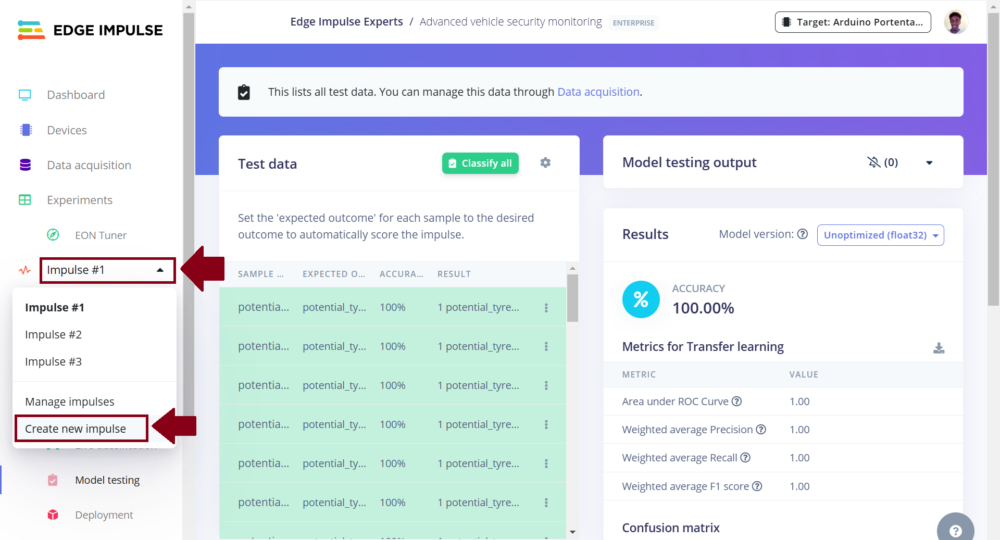

This will create a new Impulse instance. The steps to configure this Impulse are the same, with the only difference being that I selected "MobileNetV2 160x160 0.35" for the Neural Network architecture in the Transfer Learning block. This MobileNet model uses around 683.3K RAM and 658.4K ROM with default settings and optimizations, and I was interested in comparing how it would perform in terms of accuracy, RAM and ROM utilization, and inference times, as compared to the Nvidia TAO model. I trained the model with 100 epochs and a learning rate of 0.01. The model training accuracy was 100% and the loss was 0.0, and the test performance was 97.30% accurate.

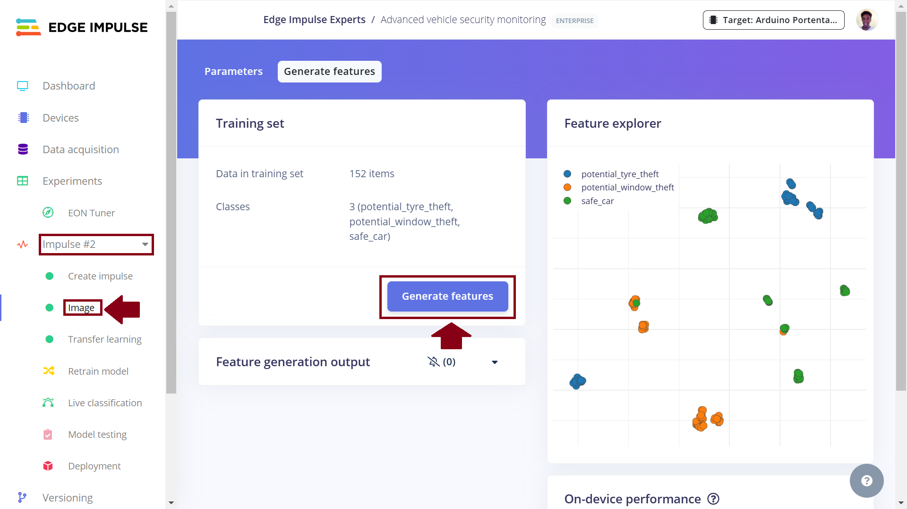

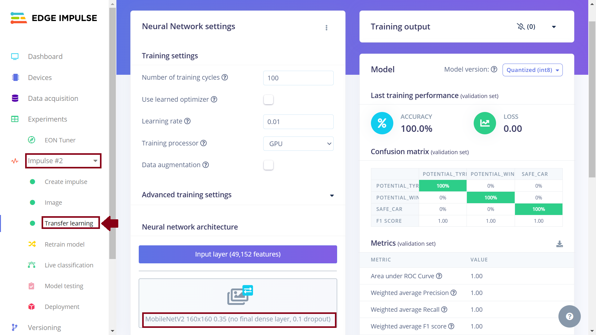

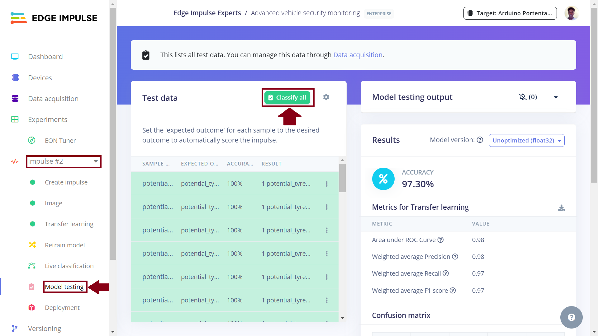

#### 3. Experimenting with both MobileNetV2 and Visual Anomaly Detection

In my third experiment, I wanted to explore visual anomaly detection. Edge Impulse recently added a visual anomaly detection model, [FOMO-AD](https://docs.edgeimpulse.com/docs/edge-impulse-studio/learning-blocks/visual-anomaly-detection) that can identify unusual patterns or anomalies in image data that do not conform to the expected behavior. Neural networks are powerful, but have a major drawback: handling unseen data, like an photo with no vehicle present, is a challenge due to their reliance on existing training data. Even entirely novel inputs often get misclassified into existing categories. During my data collection, I did not take into account situations such as when a vehicle is not present in a photo, or when there is more than 1 person being seen tampering with a car tires/windows. FOMO-AD is offered in the Professional and Enterprise packages, but users can access the Enterprise package with a [14-day free access](https://studio.edgeimpulse.com/trial-signup) that doesn't require a credit card.

The Impulse design is similar to the first two, with the difference being that we add two learning blocks: Transfer Learning (Images) and Visual Anomaly Detection - FOMO-AD. To be precise, this impulse is a duplicate of the second Impulse with an additional learning block. I created a new Impulse and similar to how we selected "Transfer Learning (Images)" from the learning block list, I added another block, "Visual Anomaly Detection - FOMO-AD". Next, I generated features and trained a "MobileNetV2 160x160 0.35" model with the same parameters as the second Impulse. Once the training is finished, I clicked the "Visual Anomaly Detection" and trained the model with a low capacity setting.

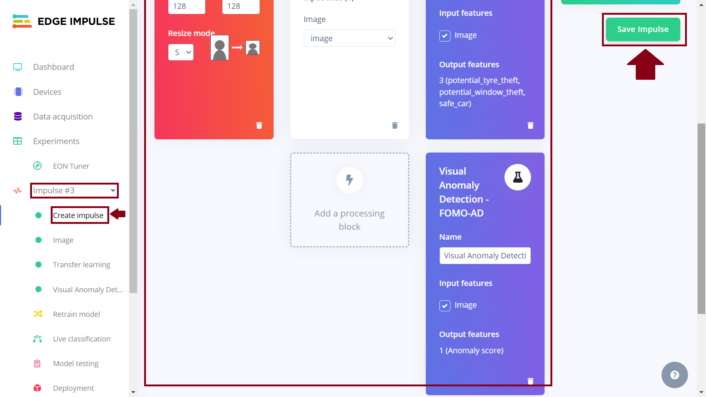

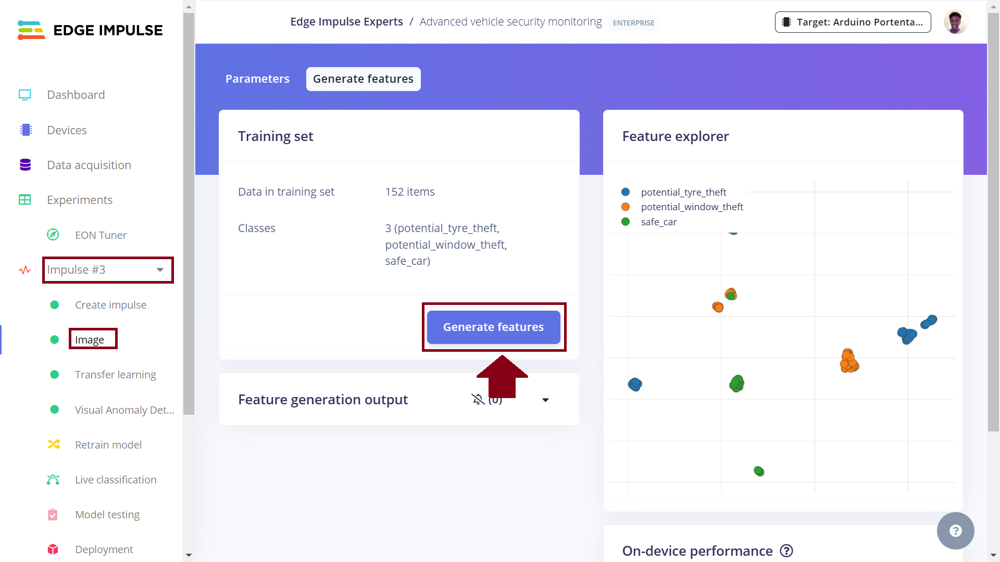

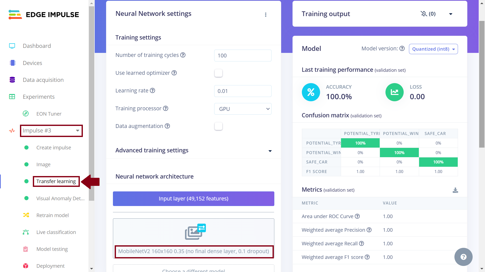

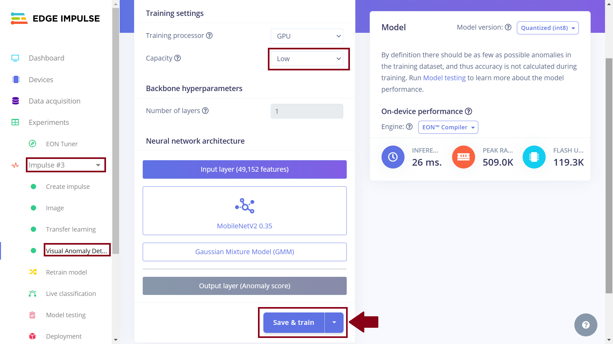

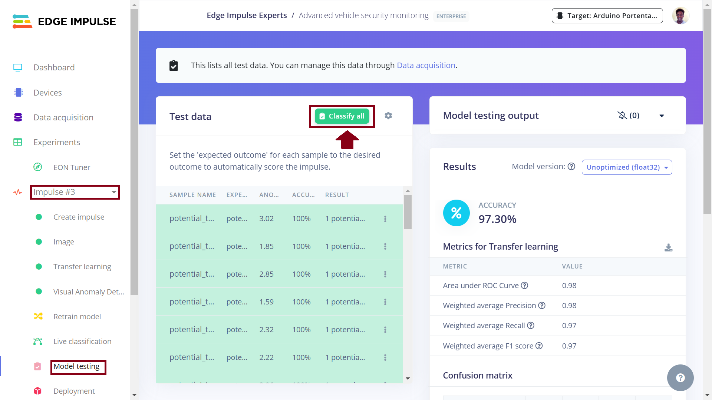

### Deploying the Impulses to Arduino Portenta H7

In this project, we now have three Impulses utilizing Nvidia TAO model, MobileNetv2, and both MobileNetv2 and visual anomaly detection, respectively. The Experiments feature not only allows us to setup different machine learning processes, but it also allows us to deploy any Impulse to a wide variety of hardware ranging from MCUs, CPUs and AI-accelerated boards. Among the various deployment options that are available, I chose to experiment with an Arduino library, OpenMV library, and deploying the Impulses as binary firmware. 

In my deployment experiments, I faced several challenges whereby the Studio and even Arduino IDE would fail to compile the library and camera example code, respectively, since the sketch ran out of the available flash that is on the board. Deploying the Impulse with Nvidia TAO model as an Arduino Library was too large to fit in the Portenta's memory. Later, I realized that we can fix this issue by deploying an Impulse as an OpenMV library. However, for the third Impulse, this option cannot work since Impulses can only support a single learning block when deploying to OpenMV.

To deploy an Impulse as a binary firmware, first ensure it is the current Impulse and then navigate to the "Deployment" section. In the field "Search deployment options" select Arduino Portenta H7. Since memory and CPU clock rate is limited for our deployment, we can optimize the model so that it can utilize the available resources on the Arduino Portenta H7 (or simply, so that it can fit and manage to run on the board). [Model optimization](https://www.edgeimpulse.com/blog/better-insight-in-model-optimizations/) often has a trade-off whereby we decide whether to trade model accuracy for improved performance, or reduce the model's memory (RAM) use. Edge Impulse has made model optimization very easy with just a click. Currently we can get two optimizations: EON compiler (gives the same accuracy but uses 18% less RAM) and TensorFlow Lite. The [Edge Optimized Neural (EON) compiler](https://docs.edgeimpulse.com/docs/edge-impulse-studio/deployment/eon-compiler) is a powerful tool, included in Edge Impulse, that compiles machine learning models into highly efficient and hardware-optimized C++ source code. It supports a wide variety of neural networks trained in TensorFlow or PyTorch - and a large selection of classical ML models trained in scikit-learn, LightGBM or XGBoost. The EON Compiler also runs far more models than other inferencing engines, while saving up to 65% of RAM usage. TensorFlow Lite (TFLite) is an open-source machine learning framework that optimizes models for performance and efficiency, making them able to run on resource constrained devices. To enable model optimizations, I selected the EON Compiler and Quantized (int8).

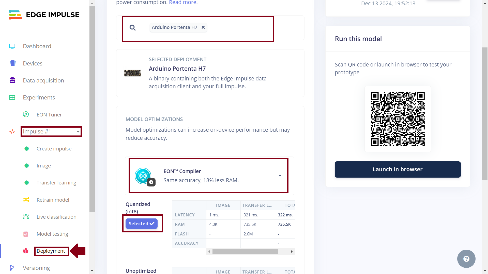

Unfortunately, the build option for the first and third Impulse, utilizing Nvidia TAO and FOMO-AD failed.

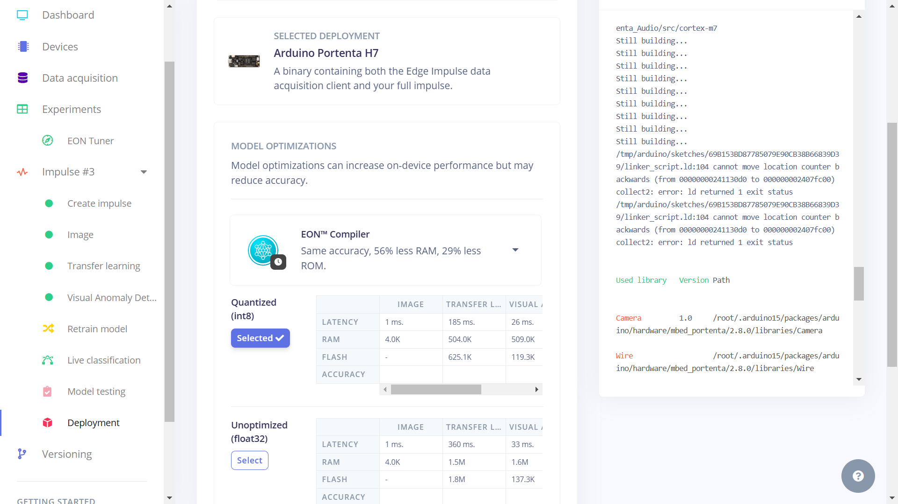

The build firmware for the second Impulse, utilizing MobileNetV2, is successful and the Digital Signal Processing time is 1ms (milliseconds) while the classification time is 195ms which is impressive. However, the model does not perform well and it classifies any image to belong to the safe car. Similarly, deploying the third Impulse as a binary firmware also fails. This was also the same result when I deployed the second Impulse as an OpenMV library.

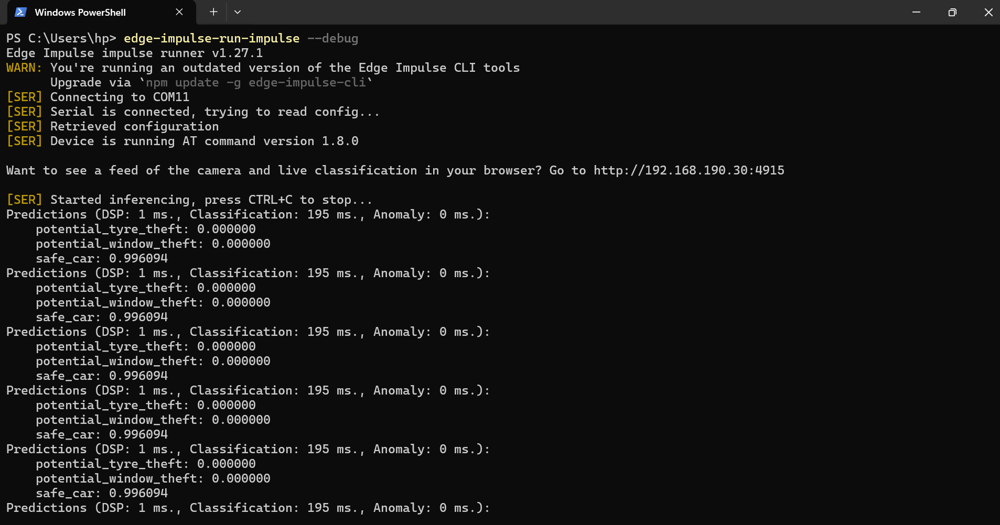

Following the failing build results for Arduino library and binary firmware (which can be related to the compiled software not being able to fit in the board), I decided to deploy the first Impulse, which utilized Nvidia TAO, as an OpenMV library. The model was able to accurately classify situations around the vehicle. Note that there are other deployment options that we can experiment with, such as deploying the Impulse as C++ library, but for this demonstration project, the OpenMV library option works well. 

The Nvidia TAO model works well but there is still a huge challenge in diversity of data - with different locations, different vehicle models, different suspicious activities, and different people. For this, I decided to experiment with the combined MobileNetV2 and FOMO-AD Impulse. In the test image below, we can see a person doing a suspicious activity near the front right car tire. In the classification result, we can see that the MobileNetV2 model is able to accurately classify this action as a potential tire theft. At the same time, the FOMO-AD visual anomaly detection model is able to accurately classify that there is no anomaly in this activity, since this image is similar to others that were used in the model training. The default minimum score before tagging data as anomaly is 9.3 and the current score is 2.2 which shows that the anomaly detection model is working well.

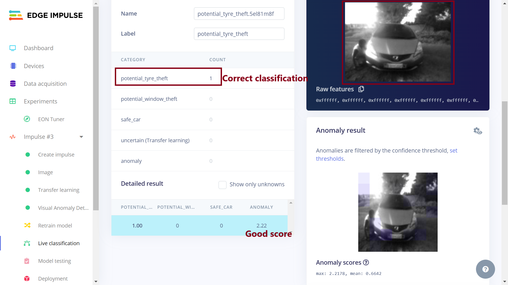

Afterwards, I flashed the Portenta H7 with the [Edge Impulse data collection firmware](https://docs.edgeimpulse.com/docs/edge-ai-hardware/mcu/arduino-portenta-h7#id-3.-update-the-firmware) and then navigated to "Live Classification" of the third Impulse and sampled an image using Web Serial. This time, I faced the Vision Shield camera to a couch and sampled an image. Impressively the result of this Impulse is that the photo is classified as an anomaly. The MobileNetV2 model classifies the image as a safe car (not accurate!) but the anomaly detection score is very high, at 17.28, such that the combined result is the entire image being classified as an anomaly, which is very correct. This approach would give us a more effective image classification system, but for this demonstration I chose to proceed with the Nvidia TAO model.

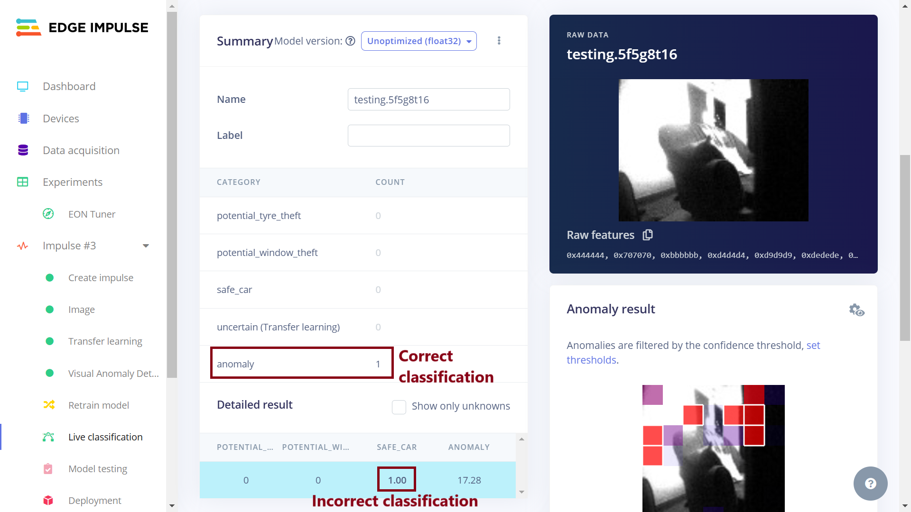

## Assembling a Smart Camera

### Uploading Code to the Portenta H7

We are close to finishing the smart vehicle surveillance camera — time to put the camera together.

First, we need to download first Impulse as an OpenMV library and also download the [OpenMV IDE](https://openmv.io/pages/download?gad_source=1&gclid=Cj0KCQiAvP-6BhDyARIsAJ3uv7bpajrcc1eE5SOEwVjxHLUwDz1WPFKnTaeVmpCS6DbjRkDXhgI7MBYaAqPyEALw_wcB). Once we have installed the OpenMV IDE, we need to ensure that we have the latest version of the bootloader. To do this, we can use the Arduino IDE to upload the sketch for updating the bootloader. Afterwards, we connect the Portenta H7 board to the OpenMV IDE and install the latest firmware. These procedures have been well documented by Marcelo Rovai in one of his [Hackster.io projects](https://www.hackster.io/mjrobot/mug-or-not-mug-that-is-the-question-d4062a) - in the section "Installing the OpenMV IDE" of the tutorial.

Having the Portenta H7 connected to the computer and flashed with the latest OpenMV firmware, we will see a new drive on our computer. We need to extract the downloaded .zip file from Edge Impulse and drag and drop the .zip file contents to the Portenta H7 drive. The zip file has the Nvidia TAO model, a labels file, and an python script that runs inference while showing results. To include processing the inference results and sending an email, I created a simple [python script](https://github.com/SolomonGithu/image_classification_on_Arduino_Portenta_H7/blob/main/ei_image_classification_send_SMTP2GO_email.py) that analyzes the inference results and sends an email via [SMTP2GO](https://www.smtp2go.com/) service when a person is seen around the vehicle tampering with tires or windows. The Portenta H7's WiFi capabilities is used to connect to a WiFi network and an email will be sent when the model is 0.8 confident that either a potential tire theft or window break-in attempt is ongoing. Note that before copying this Python file to the Portenta H7, we need to connect a 2.4GHz WiFi antenna.

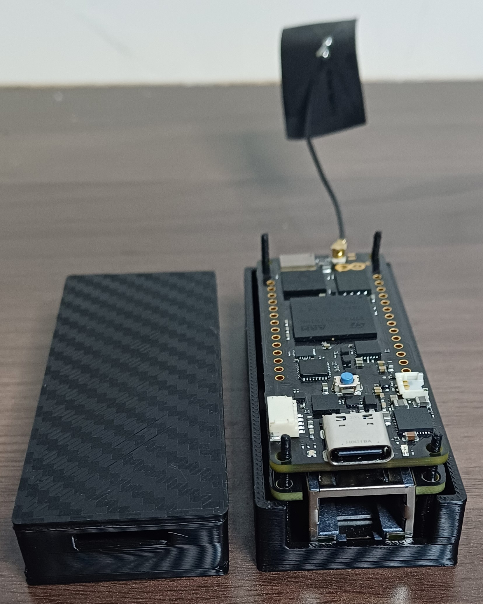

[SMTP2GO](https://www.smtp2go.com/) is a cloud-based email and SMS service provider that helps businesses and individuals send emails reliably and securely. This service allows us to send emails from our Gmail accounts but by using API calls. We can easily sign up using an organization email and get up to 1,000 free email credits per month. Once we sign up, we need to turn on SMTP authentication and give an SMTP username and SMTP password. We then encode the username and password using [Base64](https://en.wikipedia.org/wiki/Base64) and put them in the Python script. We also need to set the WiFi credentials and the recipient email address. Once these variables are filled, we can copy the script to the Portenta H7 drive.

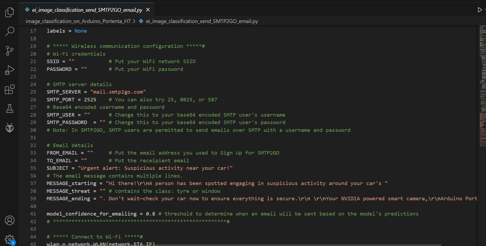

### 3D Printing Case Designs and Assembly

To secure the Portenta H7, I designed a simple case for the development board and later 3D printed them with PLA material. The case has cutouts for the camera, microphone, Ethernet and USB-C slots. For future use, I would advise adding slots for the connectors on the Portenta board such as the battery slot. The [design files](https://www.printables.com/model/1110681-arduino-portenta-h7-case-ethernet-vision-shield) can be downloaded from Pritables.com.

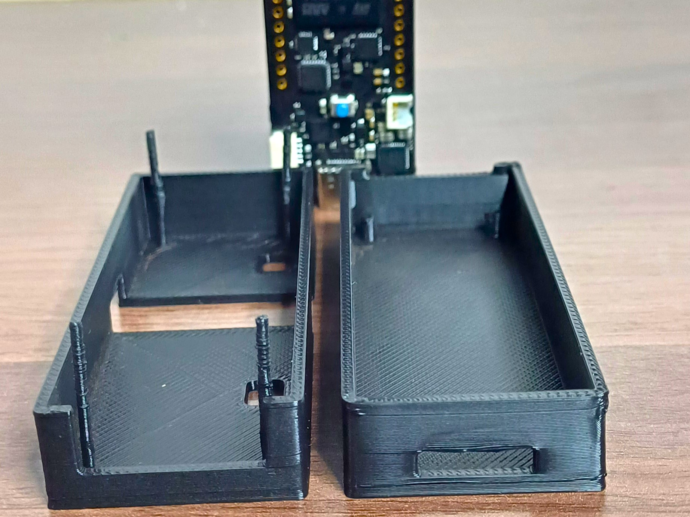

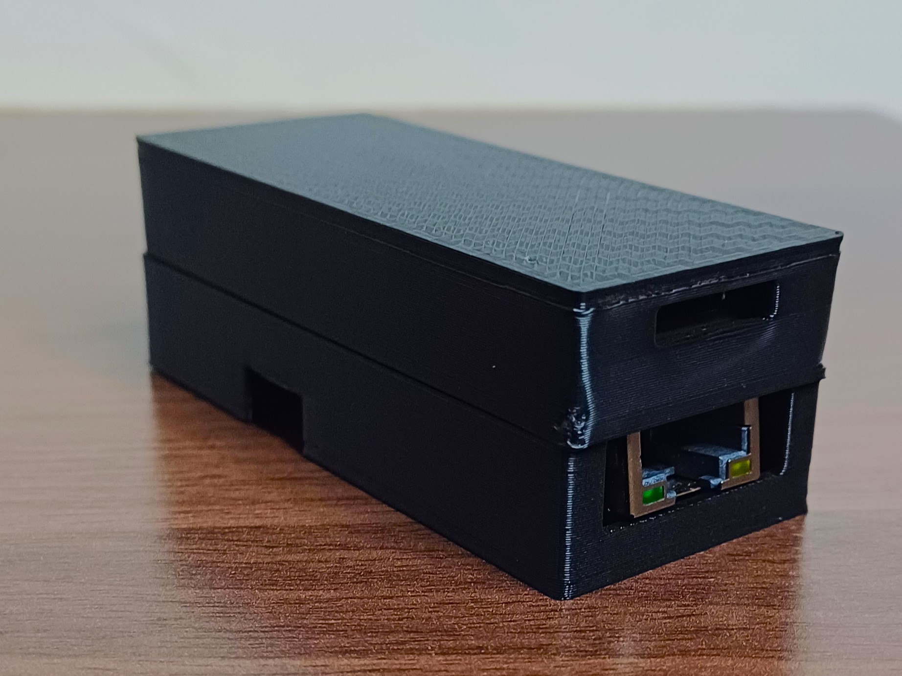

After assembling the Portenta H7 in the case, I mounted the device on a tripod and faced it toward the vehicle, similar to the data collection step. Using the OpenMV IDE, I then ran the [Python script](https://github.com/SolomonGithu/image_classification_on_Arduino_Portenta_H7) that I had copied to the Portenta H7 drive on my computer. The code first connects to the configured WiFi and once successful, the inference starts. On the logs, we can see that the the device is running at around 1 frame per second and the model is able to correctly classify that the vehicle is safe since no person is close to it.

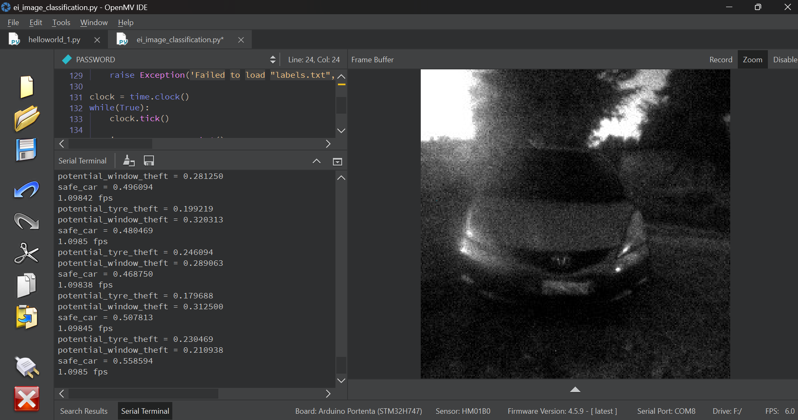

When the model sees suspicious activity near the vehicle's tires or window, the code sends an email notifying the user about the specific threat that has been identified: threat to tires or windows.

## Results

Finally, our smart vehicle surveillance camera is complete. We have successfully trained, tested, optimized, and deployed a Machine Learning model to the Arduino Portenta H7 board. Once the device is powered, the Portenta H7 board will first connect to the configured WiFi and after this is successful, the code will load the Nvidia TAO model and start running inference. This process runs at around 1 frame per second and the software is constantly analyzing the model predictions to see if situations where someone is near the vehicle tires or window is detected. Once these threatening situations are detected, and with a confidence of 0.8 and above, the Portenta H7 then automatically sends an email to the set email address using SMTP2GO. I chose email notifications as it was the easiest alternative for this demonstration since the service is free. For a commercial product it will be better to alert the vehicle owner using SMS, voice calls, and even alerting the authorities.

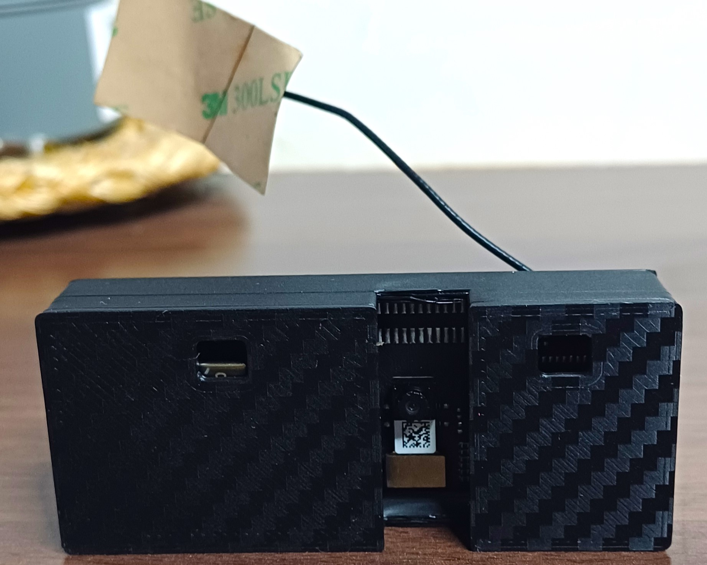

I mounted the enclosed Arduino Portenta H7 on a tripod and acted out theft actions similar to when collecting the data.

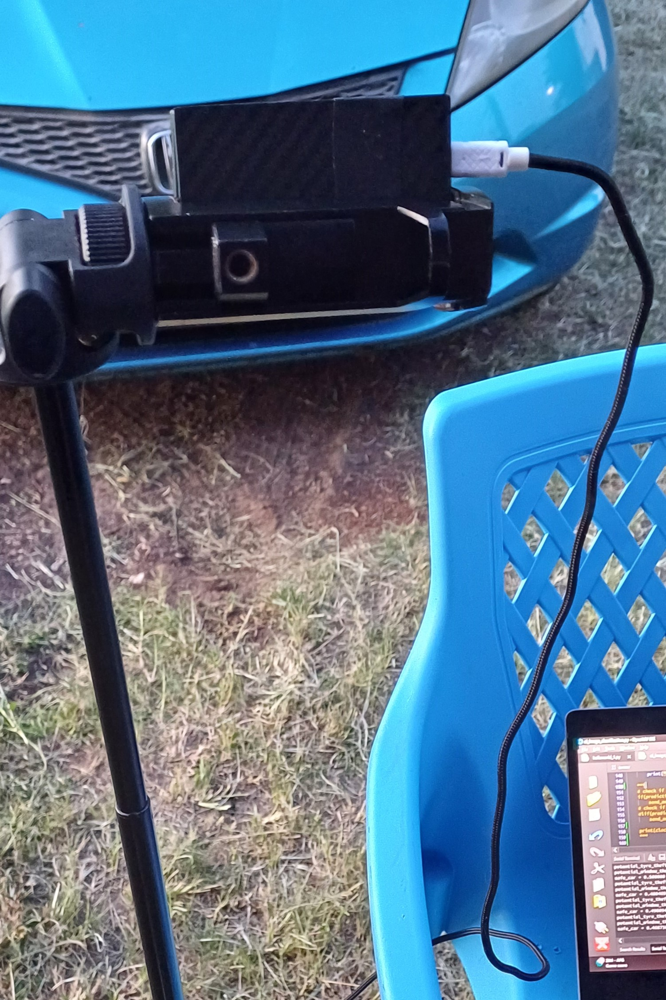

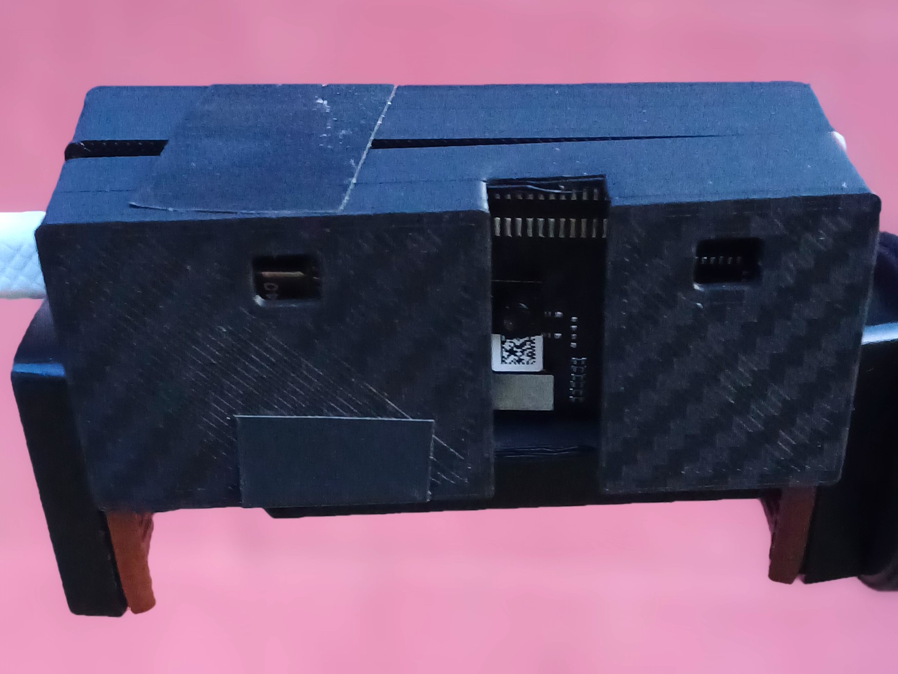

When running inference, I observed that on average, the model's confidence when detecting the `potential_tire_theft` and `potential_window_theft` classes was low at around 0.28 to 0.3, but a good number of times the model would accurately classify the action with a confidence of 0.8. This can be related to several factors such as change in sunshine from the day when data was collected for training. We can also improve the model's performance by adding more training data and increasing the number of training cycles.

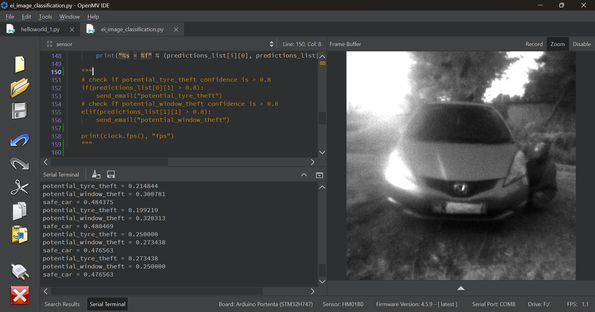

Below is a screenshot of one of the emails that the Portenta H7 sent. The notification informs the user about the specific suspicious activity that the camera has detected. A future work in this email notification could be to attach the suspicious image to the user.

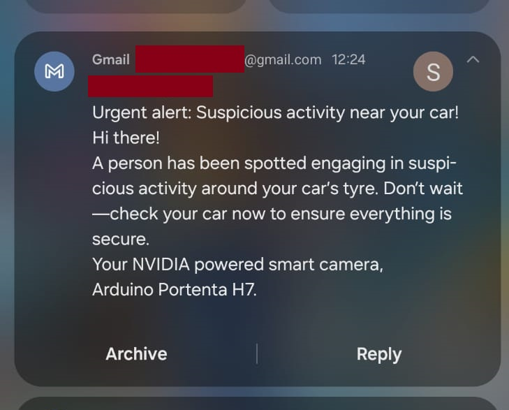

## Conclusion

This small, low-cost and low-power camera device is one of the many solutions that embedded AI has to offer. Every minute a car is stolen in the world, but yours doesn't have to be one of them! Current cutting edge surveillance cameras integrate AI for detecting persons, packages, animals etc., but every day there are new ideas and frameworks that are released for coming up with more advanced and innovative uses cases.

The task at hand was very complicated; train a computer to interpret a person's activity around a vehicle, and optimize the model to run on a microcontroller. By utilizing the seamless and powerful tools offered by the Edge Impulse platform; we have managed to train and deploy a custom Machine Learning model to save our vehicles. The new Experiments feature of Edge Impulse is a powerful tool and it comes in very handy in the machine learning development cycle. There are numerous configurations that we can utilize to make the model more accurate, and reduce hardware utilization on edge devices. In my experiments, I tried other configuration combinations and chose to present the best and worst performing ones in this documentation.

You can find the public Edge Impulse project here: [Advanced vehicle security monitoring](https://studio.edgeimpulse.com/public/552230/latest). This [GitHub repository](https://github.com/SolomonGithu/image_classification_on_Arduino_Portenta_H7) includes the deployed OpenMV library, the [Nvidia TAO model](https://github.com/SolomonGithu/image_classification_on_Arduino_Portenta_H7/blob/main/ei-nvidia-tao-openmv-v48/trained.tflite), and the python code for running inference and sending email notifications. 

A future work on this project would be to include other alert features such as sending SMS messages, and training the machine learning model to interpret other suspicious actions such as an unwanted person tampering with other vehicle components such as the wipers or side mirrors. Also, making the camera and model work well also during the night would be an interesting extension of this project.
