# Visual Anomaly Detection - Seeed Grove Vision AI Module V2

Created By: Roni Bandini

Public Project Link: [https://studio.edgeimpulse.com/public/513864/live](https://studio.edgeimpulse.com/public/513864/live)

GitHub Repository: [https://github.com/ronibandini/visualAnomalyGroveV2](https://github.com/ronibandini/visualAnomalyGroveV2)


## Introduction

In the 1970s, a Russian engineer named Bikov trained pigeons for visual anomaly detection. According to Bikov, pigeons have better sight and concentration than humans (Máquinas del siglo XX, Muslin, E., 1974). Fortunately, today we have better options than becoming bird experts or paying people not to blink in front of an inspection line. With the right tools, we can easily train a Machine Learning model and set up a system to spot visual anomalies, to automatically remove faulty pieces from the manufacturing production line.

## Parts Required

For this project I will use the [Seeed Grove Vision AI Module V2](https://www.seeedstudio.com/Grove-Vision-AI-V2-Kit-p-5852.html). This module has a WiseEye2 HX6538 processor with a dual-core Arm Cortex-M55 and integrated Arm Ethos-U55 neural processing unit (NPU). It also has 16mb flash memory, a PDM microphone, SD card slot, USB Type-C, and Grove interface.

For the inspection servo arm, I will use a separate module made with an Arduino Nano and an SG90 servo motor.

* Seeed Grove Vision AI Module V2
* OV5647-62 Raspberry Pi Cam
* CSI Cable
* Arduino Nano
* Servo motor SG90

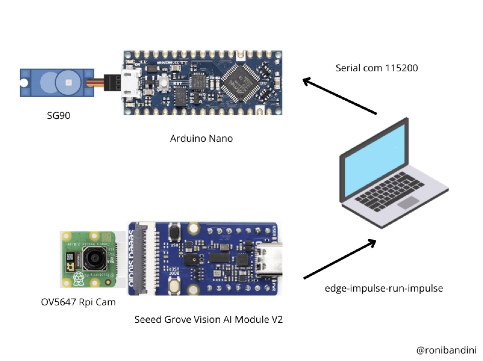

Connect the servo to the Arduino Nano using VCC, GND and digital PIN 3.

Connect the cam to the module using a CSI cable.

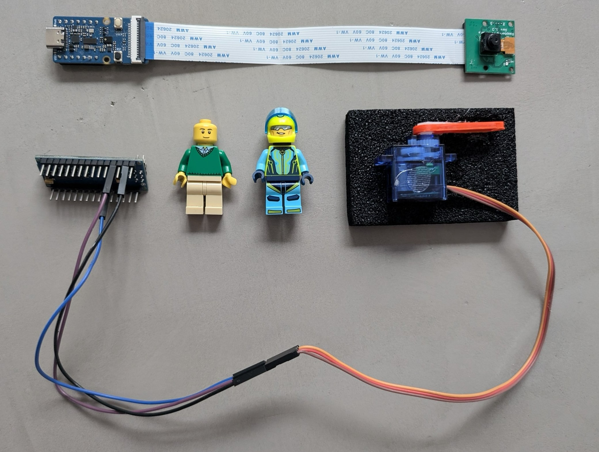

## Model Training

FOMO-AD requires an Enterprise version of Edge Impulse. To explore the capability, you can sign up for a free Enterprise Trial at [https://studio.edgeimpulse.com/trial-signup](https://studio.edgeimpulse.com/trial-signup), then create a new project named **Visual Anomaly**.

The Seeed Grove Vision AI V2 board does not come with Edge Impulse firmware out-of-the-box, so it will need to be flashed. To update the firmware, [download this file](https://cdn.edgeimpulse.com/firmware/seeed-grove-vision-ai-module-v2.zip) and extract it.

Connect the Grove Vision AI V2 to a PC/Mac/Linux via a USB Type-C cable.

Within the contents of the extracted firmware `.zip` file, there are install scripts that will flash your device:

* For MacOS run `flash_mac.command`
* For Windows run `flash_windows.bat`
* For Linux run `flash_linux.sh`

Now install the Edge Impulse CLI:

1. For Windows, [install Python 3](https://www.python.org/) (it is required later for the parsing script)
2. Install [Node.js](https://nodejs.org/en/)
3. Open a terminal and execute `npm install -g edge-impulse-cli --force`

For other OS'es, visit [https://docs.edgeimpulse.com/docs/tools/edge-impulse-cli/cli-installation](https://docs.edgeimpulse.com/docs/tools/edge-impulse-cli/cli-installation)

4. Run `edge-impulse-daemon`, login to Edge Impulse, and select your project to start collecting data.

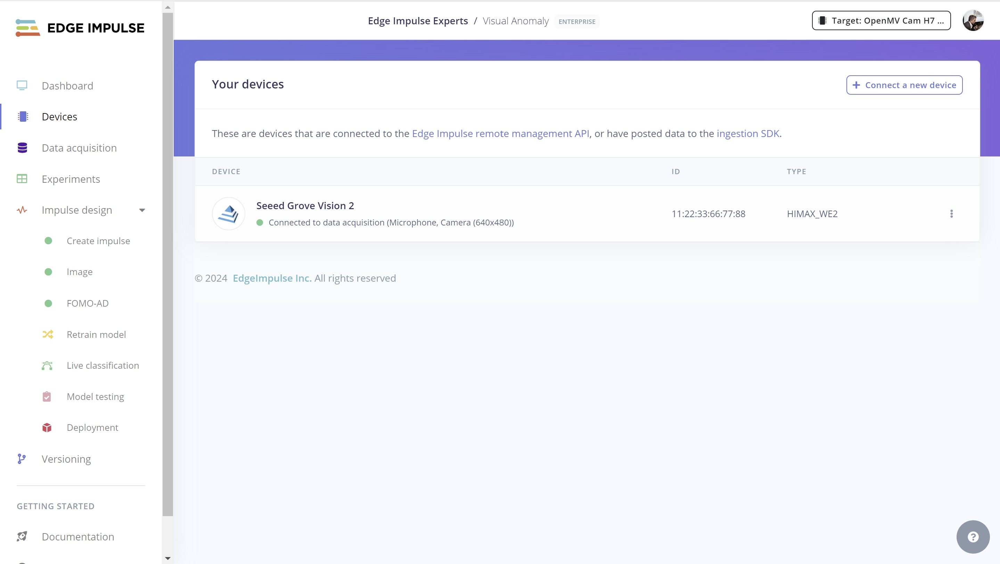

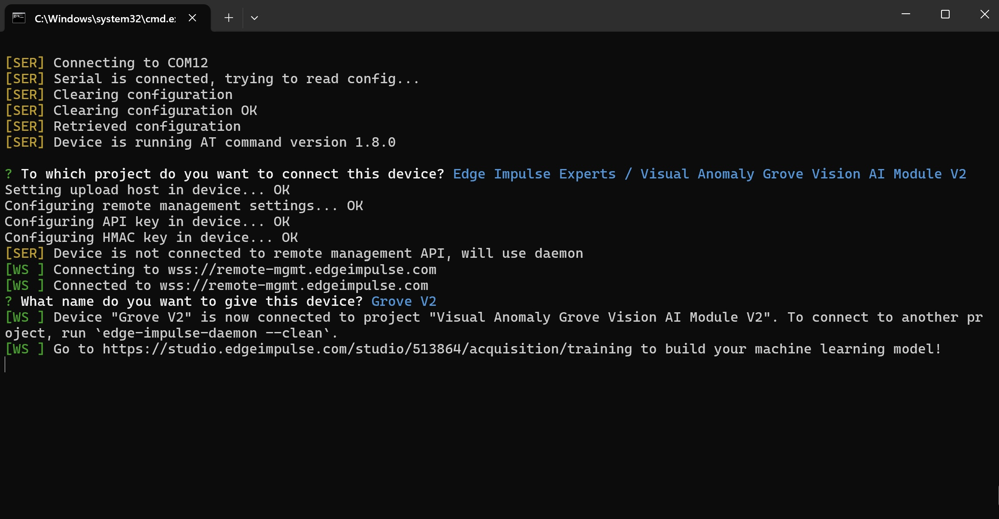

* Sample around 100 pictures using `no anomaly` as the label.
* Select Image Data, 96x96 pixels, "Squash" as the resize mode, and **Visual Anomaly Detection** as the Learn block.
* Select Image, RGB Image, Generate Features.

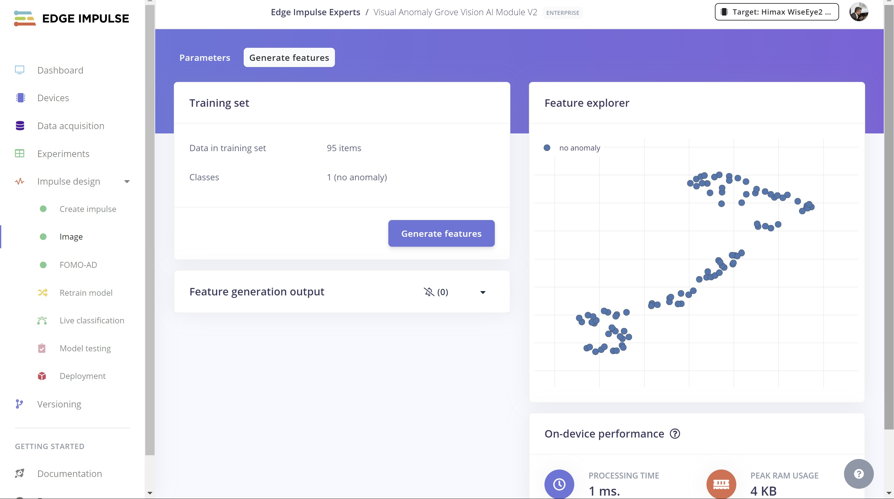

5. On the Neural Network settings page, choose FOMO-AD as the architecture, and then select **Medium** capacity.

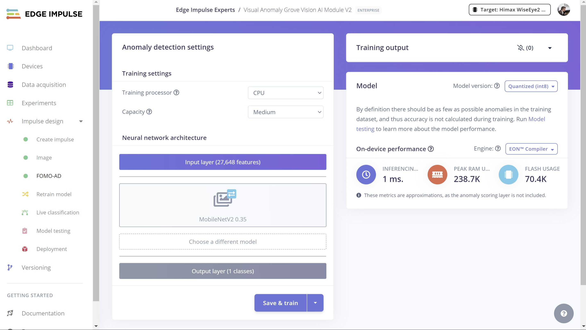

> Capacity setting: the higher the capacity, the higher the number of Gaussian components, and the more adapted the model becomes to the original distribution.

There should not be any anomalies in the training dataset, as we are only interested in "good" examples, thus accuracy is not calculated here.

To calculate an F1 score, after the training has completed, you can upload a set of **anomaly** pictures and label them as `anomaly`.

Every learning block has a threshold. This can be the minimum confidence that a neural network needs to have, or the maximum anomaly score before a sample is tagged as an anomaly. You can configure these thresholds to tweak the sensitivity of these learning blocks. This affects both live classification as well as model testing.

Then you can click **Classify All** and analyze both the global results and specific classifications.

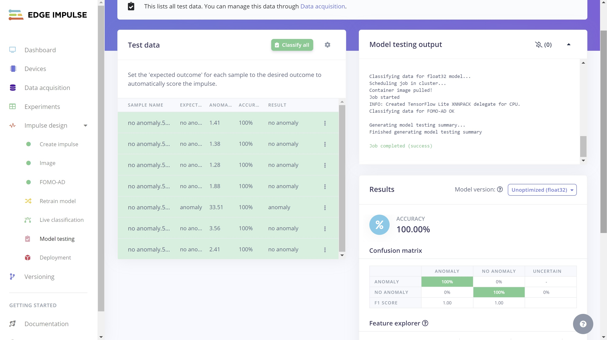

## Deployment

On the **Deployment** page, select **Seeed Grove Vision AI Module V2**.

> Note: that there is also a `Seeed Grove Vision AI` for the previous version of the hardware. That should **not** be selected.

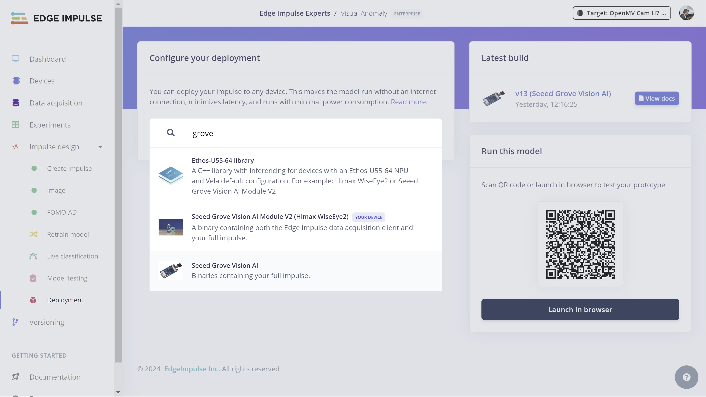

Download the `.zip` file by clicking **Build**, and then extract the contents. Connect the Grove Vision AI Module V2 to your computer using a USB-C cable.

Like before, run the flashing script inside of the extracted `.zip` file that corresponds to your OS. If you get a security warning, you will need to Allow or Accept in order to continue with the flashing of the device.

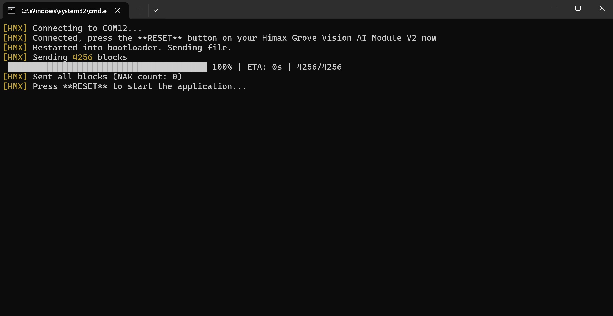

Now the Grove Vision AI Module V2 is ready to take pictures and identify visual anomalies.

## Results

In a terminal, run `edge-impulse-run-impulse`, login to your Edge Impulse account, and you will notice the inferences begin in the terminal.

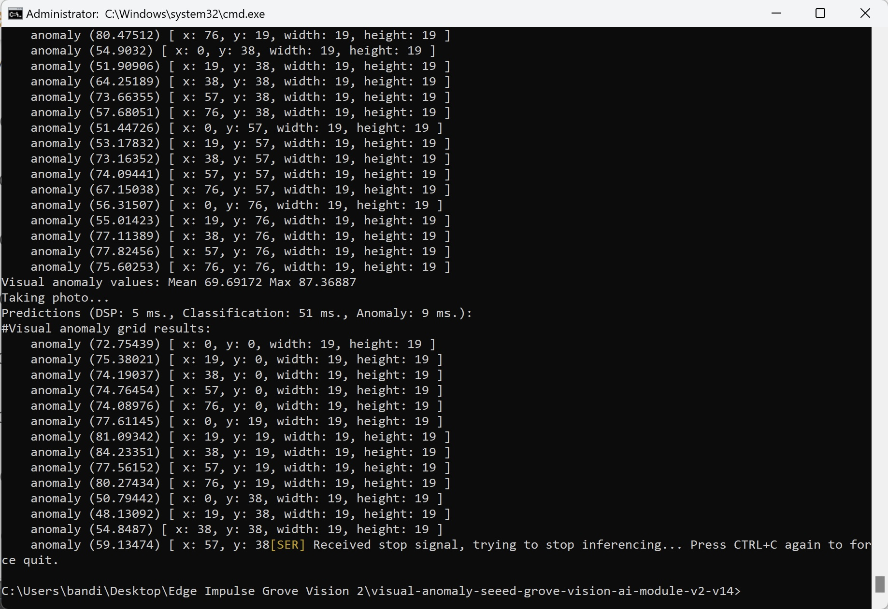

As you can see in the output, there is a grid to spot any anomalies per image sector, and there are also Mean and Max Anomaly scores for the entire picture.

Since we want to remove pieces automatically from the inspection line, we need a way to parse the Max Anomaly value and then move a servo arm.

I've put together some Python to get started with the process. Download `anomalyParser.py` from [https://github.com/ronibandini/visualAnomalyGroveV2](https://github.com/ronibandini/visualAnomalyGroveV2).

Next, install these dependencies in your development environment:

```
pip install keyboard
pip install art
```

Then edit these settings:

```
outputFile = open('output.txt', 'w')  #file name used for parsing
arduino = serial.Serial(port='COM26', baudrate=115200, timeout=.1)  #configure here the USB port assigned to the Arduino Nano
discardLines=30  #how many lines to be discarted to avoid sending extra signals to servo arm
anomalyThreshold=85  #limit to consider an anomaly
```

> Note: If you are going to use Linux, please remove `shell=True` and `bufsize` from the procedure call on line 35.

Run the script using: `python anomalyParser.py`

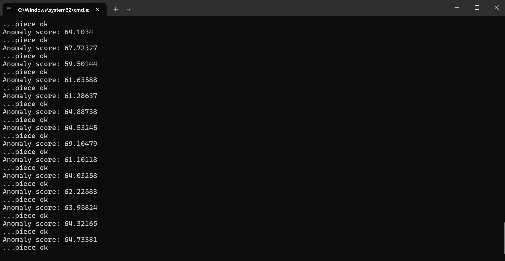

This script will call `edge-impulse-run-impulse` as a subprocess, parse the inference values being output, and send a serial signal to the arm unit made with an Arduino Nano and servo motor.

On the Arduino Nano, we will monitor the serial communication and if there is a `1` we will move the servo.

One issue I found is that having 2 USB devices connected will require a port selection to be made with `edge-impulse-run-impulse`. With the `keyboard` Python library, I'm just forcing an _Enter_ for the first option - _COM12_ in my case - which is my Grove Module port. If you have a COM number higher than the COM assigned to the Arduino servo arm, just insert a down arrow before the "Enter".

## Final Notes

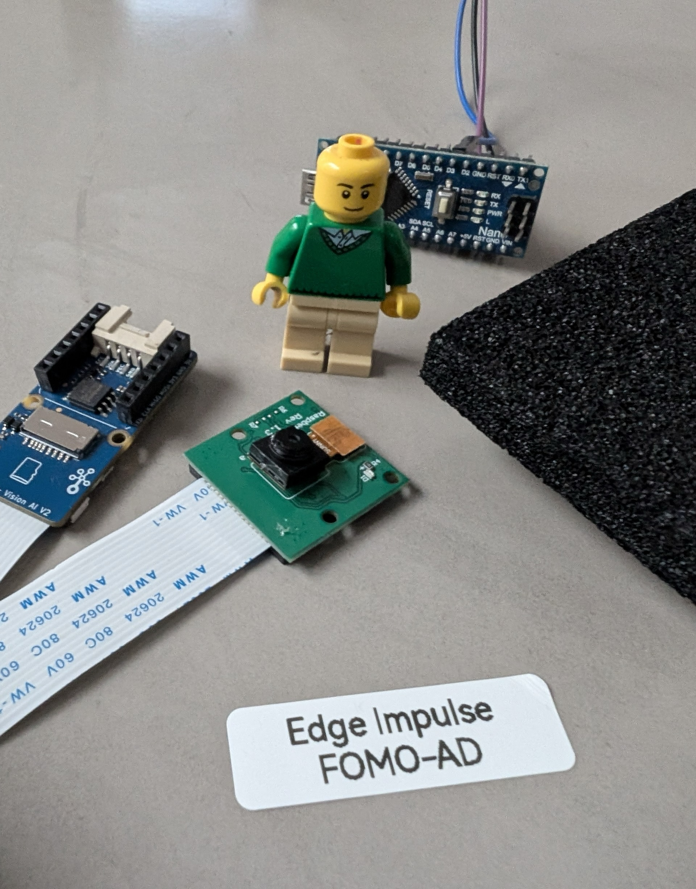

As we saw in this project, implementing automated visual anomaly detection for a production line is neither complicated nor expensive, as long as you have the right tools. For this project, using the Grove Vision AI Module V2 and Edge Impulse, data ingestion, model training, and firmware deployment were easy and straightforward. Being an inexpensive module, the Seeed Grove Vision AI V2 still delivers an impressive 1ms inference time.

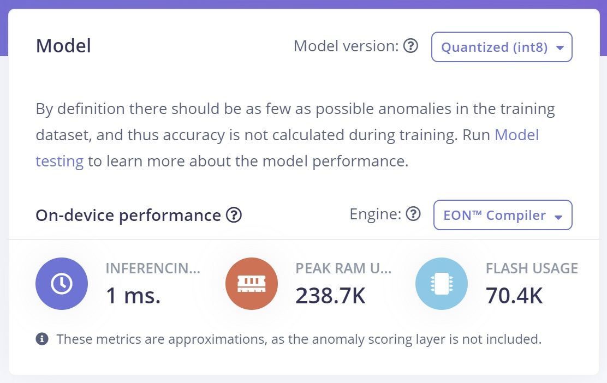

Besides using this firmware method, you can also deploy the Edge Impulse model as an Arduino Library, add a XIAO ESP32 to the Grove Module V2, and set up a tiny offline, standalone Visual Anomaly Detection device.

## Links

* Project: [https://studio.edgeimpulse.com/public/513864/live](https://studio.edgeimpulse.com/public/513864/live)
* Source Code: [https://github.com/ronibandini/visualAnomalyGroveV2](https://github.com/ronibandini/visualAnomalyGroveV2)

Demo video:



## References

* [https://www.edge-ai-vision.com/2023/06/visual-anomaly-detection-with-fomo-ad-a-presentation-from-edge-impulse](https://www.edge-ai-vision.com/2023/06/visual-anomaly-detection-with-fomo-ad-a-presentation-from-edge-impulse)
* [https://docs.edgeimpulse.com/docs/edge-ai-hardware/mcu-+-ai-accelerators/himax-seeed-grove-vision-ai-module-v2-wise-eye-2#deploy-model-to-seeed-grove-vision-ai-module-v2-himax-wiseeye2](../image-projects/\[https:/docs.edgeimpulse.com/docs/edge-ai-hardware/mcu-+-ai-accelerators/himax-seeed-grove-vision-ai-module-v2-wise-eye-2/#deploy-model-to-seeed-grove-vision-ai-module-v2-himax-wiseeye2)
* [https://bandini.medium.com/ia-palomas-y-detecci%C3%B3n-de-anomal%C3%ADas-a9870850795a](https://bandini.medium.com/ia-palomas-y-detecci%C3%B3n-de-anomal%C3%ADas-a9870850795a)
