# Counting Containers with an Arduino Nicla Vision and FOMO

Created By:
[Zalmotek](https://zalmotek.com) 

Public Project Link:

[https://studio.edgeimpulse.com/studio/122050](https://studio.edgeimpulse.com/studio/122050)

## Introduction

Accurate inventory management is critical for any business that relies on the sale of physical goods. Inventories can represent a significant investment of capital, and even a small error in inventory levels can have a major impact on a company's bottom line. Furthermore, customers expect to be able to find the products they need when they want them, and out-of-stock items can lead to lost sales. In order to properly manage their inventories, businesses need to keep track of both the level of stock on hand and the rate at which stock is being sold. By using this information to forecast future demand, businesses can avoid both overstock and stockouts. In today's competitive marketplace, effective inventory management can be the difference between success and failure.

Machine Learning algorithms power automatic inventory tracking systems that can automatically detect and classify objects in images, even as items are moved around. This is important because it helps to ensure that inventory levels are accurate, which is essential for businesses to run smoothly. Machine Learning can also be used to automatically count items in containers, such as boxes on a shelf. This is important because it helps to reduce the amount of time that employees need to spend counting inventory manually. As a result, automatic inventory tracking can save businesses time and money.

## Our Solution

In this tutorial we'll show you how to use Computer Vision and Machine Learning to count the number of containers that enter a warehouse in real-time. We will use the Arduino Nicla Vision camera to capture the training data and run the ML model. The Edge Impulse platform will enable us to build, train and deploy an object recognition model. We’ll explain how to use the FOMO (Faster Objects, More Objects) novel machine learning algorithm that enables object detection for highly constrained devices, such as the Arduino Nicla Vision.

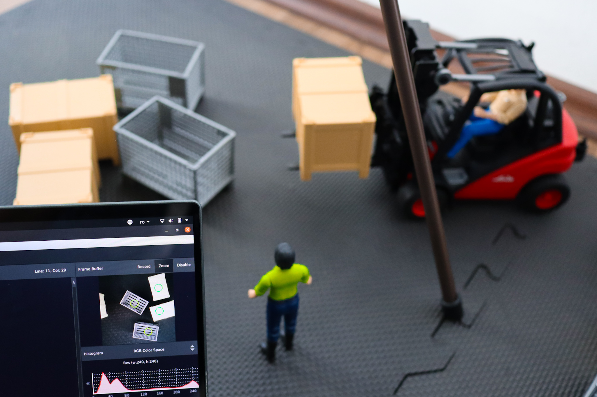

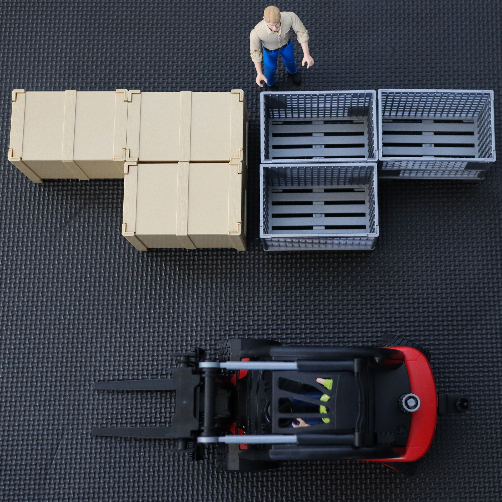


Arduino Nicla Vision is the perfect match for this use case, as it has a powerful processor with a 2MP color camera that supports TinyML and can easily be integrated into Edge Impulse. It also offers WiFi and Bluetooth Low Energy connectivity so you can send your data to the cloud without having to use another development board. All of these features packed on a really tiny board for around $100 can be an attractive package for an Edge Computing mini computer.

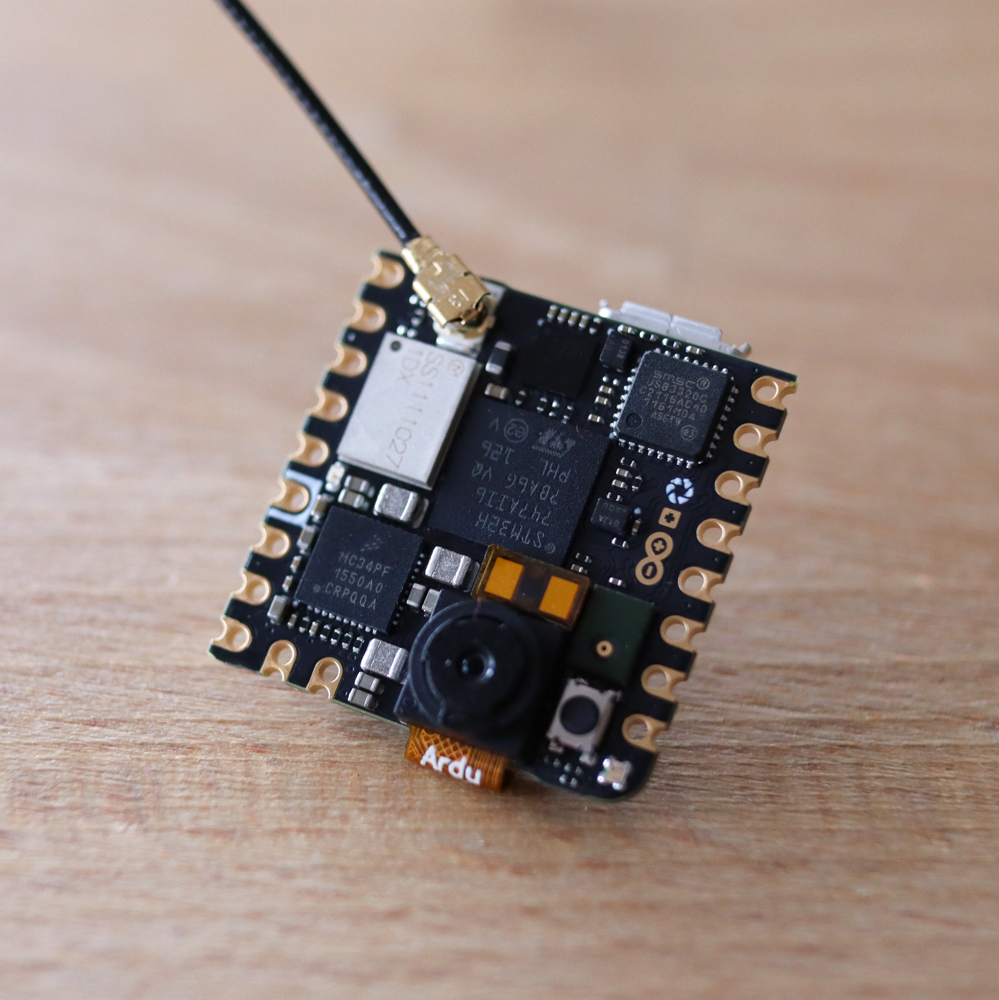

### Hardware requirements

- [Arduino Nicla Vision](https://store.arduino.cc/products/nicla-vision)
- Micro USB cable

### Software requirements

- Edge Impulse account
- Adafruit IO account
- [OpenMV IDE](https://openmv.io/pages/download)

## Hardware Setup

We’ve 3D printed an enclosure for the Arduino Nicla Vision board (you can [download it from here](https://www.myminifactory.com/object/3d-print-nicla-vision-enclosure-238325)) and mounted it at a high enough point to get a bird's-eye view that captures all the important objects from the scene (the entire storing area and the containers on it). The case provides an extra layer of protection against environmental factors. 

The lid is secured by using M3 bolts and threaded inserts that were placed inside the base piece using a soldering iron. This ensures a good fit of the lid over the base piece and allows the case to be opened and closed repeatedly without having to worry about damaging a 3D printed thread. Moreover, we have opted to use a GoPro mount on the lid, a common pick in the open-source hardware community, that makes this design compatible with numerous other mounts available online that will fit your application.

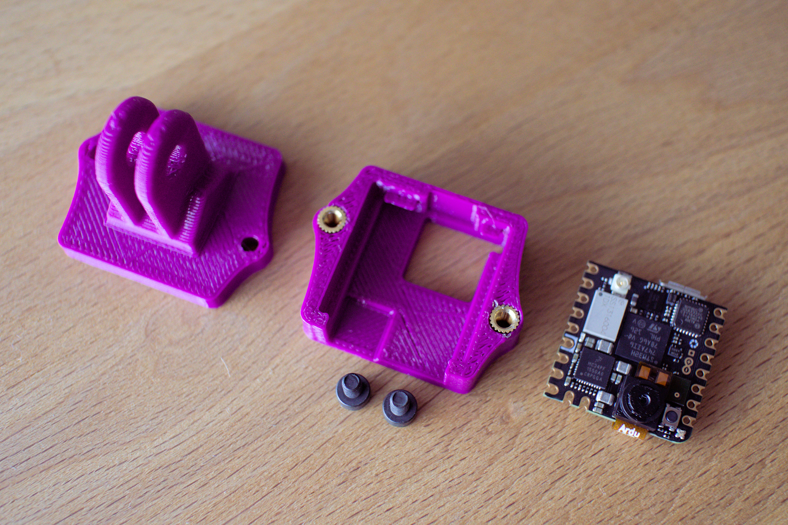

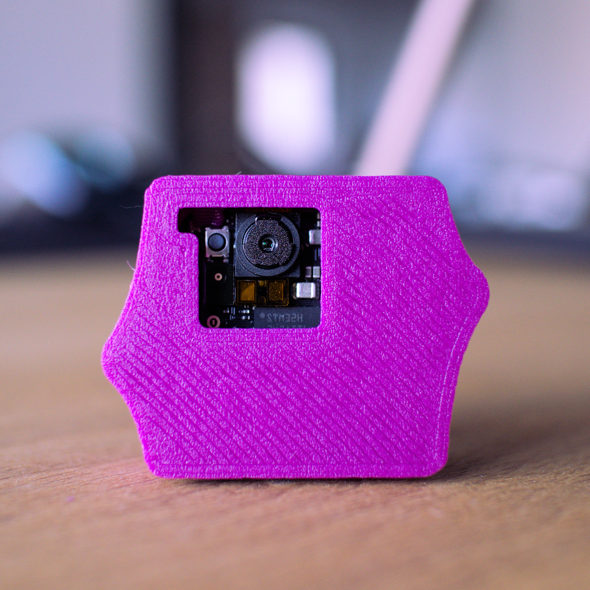

Depending on your setup, lighting may vary throughout the day so you can also add a light source to ensure constant illumination. This is a crucial aspect to ensure the performance of the ML model, as it can heavily influence the detected features.

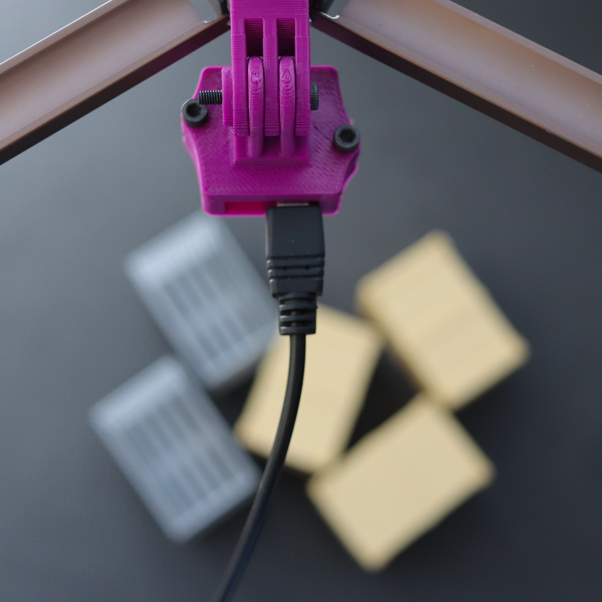

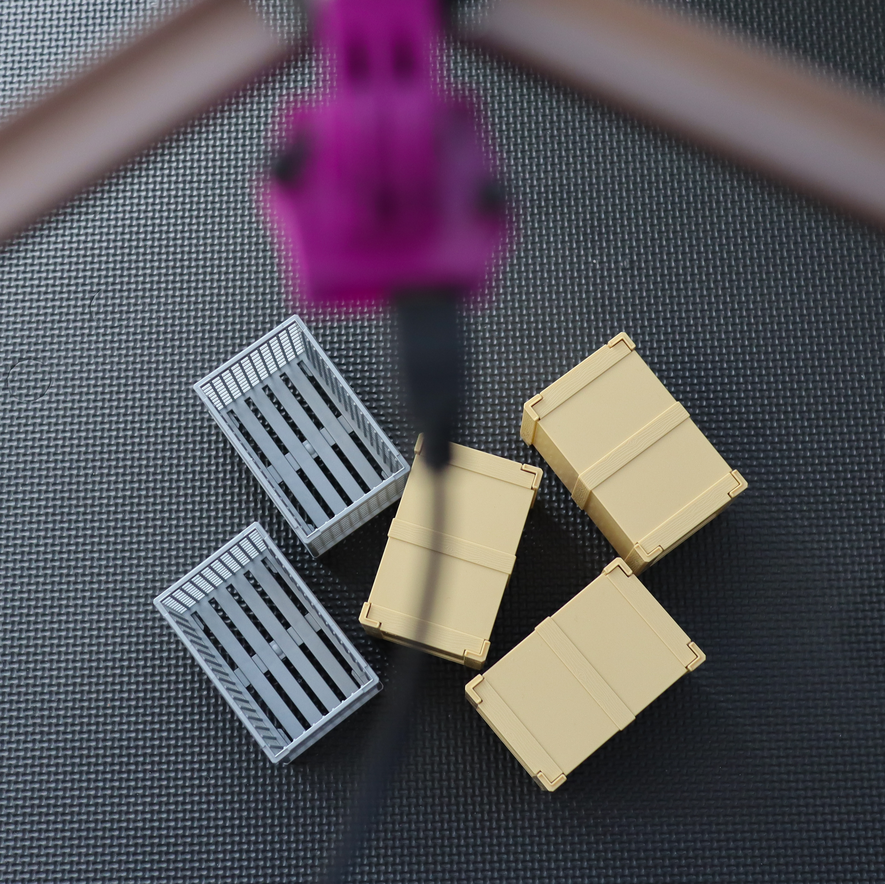

## Software Setup

Start by installing the [OpenMV IDE](https://openmv.io/pages/download) and creating an Edge Impulse account if you haven’t already. 

### Data Collection

First, we must gather some images to train the model. We’ve used two types of containers, so we’ll define two corresponding classes (_Gray_ and _Beige_).  If your containers come in all sorts of sizes and colors you could go for adding a marker on them and training the model to recognize the marker rather than the entire container.

Connect the Nicla Vision board to your laptop, go to OpenMV and click on the **Connect** button in the bottom left corner. If you cannot connect the board from the first try, double click the button on the Nicla Vision to put the board into bootloader mode (the green LED should be blinking). Then go to **Tools -> Dataset Editor -> New Dataset** and choose a folder where you want to save the images.

Click on **New Class Folder** and give it a name, do this for each class. Select the class by clicking on it and then click on the image button under **New Class Folder** to capture an image. Rotate the container each time you take a picture to make sure you capture all the possible angles. You can take around 40 pictures for each class.

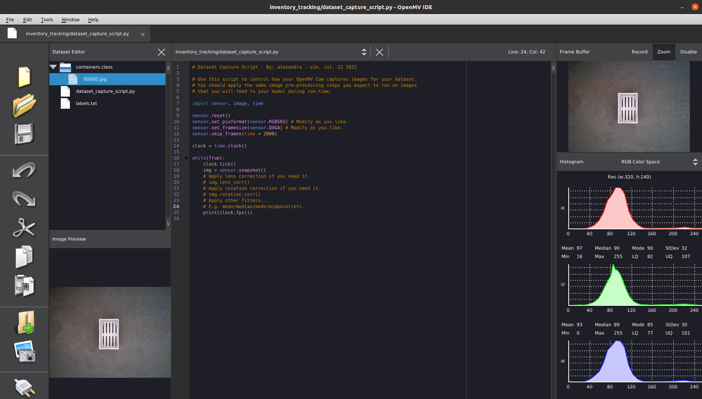

Now that we have a proper dataset, we can create a new Edge Impulse Project. Once logged in to your Edge Impulse account, you will be greeted by the Project Creation screen. Click on **Create new project**, give it a meaningful name and select **Developer** as your desired project type. Afterward, select **Images** as the type of data you wish to use. Next, choose **Object Detection** and go to the **Data acquisition** menu. Click on **Upload existing data** and upload all the images you’ve just taken for both classes.

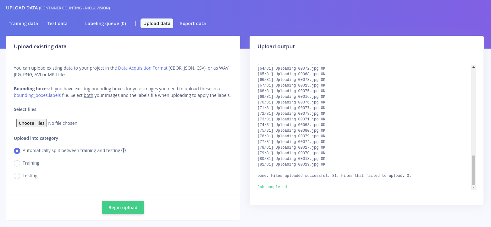

Go to **Labelling queue** and draw a bounding box around the container. You won’t have to do this manually for each image because Edge Impulse will automatically detect the marking and draw the bounding boxes on the rest of the dataset in order to greatly speed up the process. Just make sure you go through all of the images and adjust the bounding box when needed.

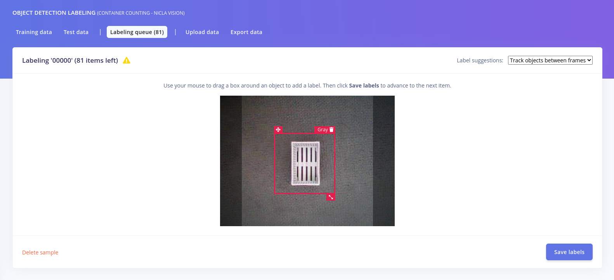

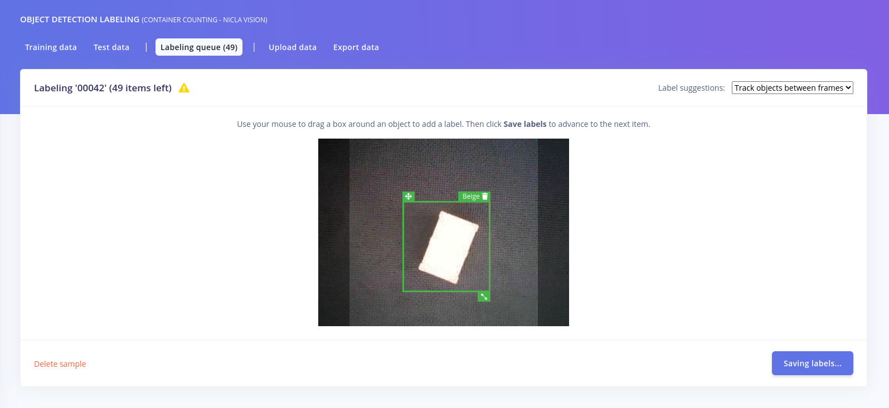

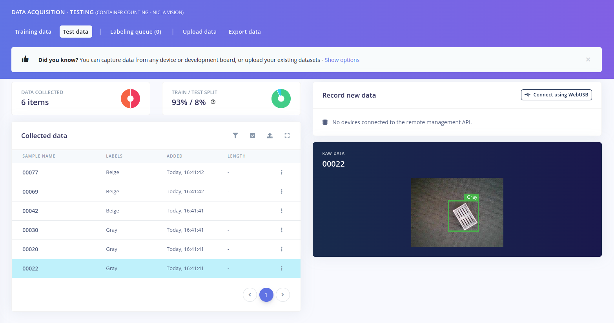

### Creating the Impulse

Now we can create the Impulse. Go to **Impulse Design** and set the image size to 96x96px, add an **Image** processing block, and an **Object Detection** block. We chose to use 96x96px images because the Nicla Vision board only has 1MB RAM and 2MB Flash memory available. We use Object Detection as the project type because we want to detect multiple objects in an image.

The output features will be our categories, meaning the labels we’ve previously defined (high, low, and normal).

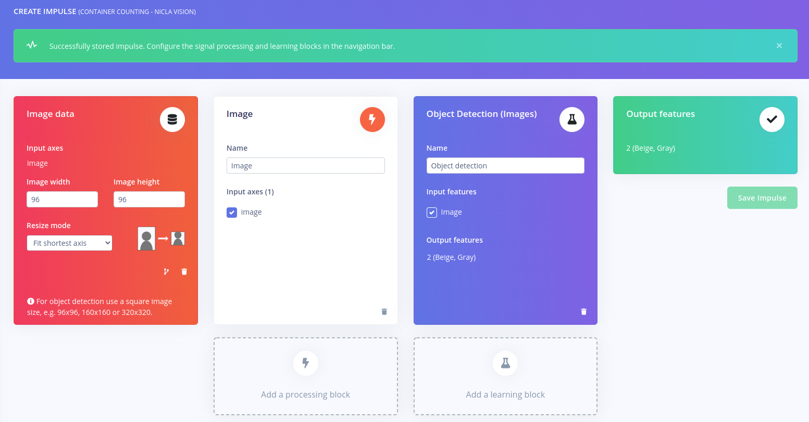

### Generating Features

Now go to the **Image** menu in the **Impulse Design** menu. Select Grayscale as the **Color depth** (the FOMO algorithm only works with this option, not RGB) and click on **Save Parameters** and **Generate Features**. This will resize all the images to 96x96px and change the color depth of the images. You’ll also be able to visualize the generated features in the **Feature Explorer**, clustered based on similarity. A good rule of thumb is that clusters that are well separated in the feature explorer will be easier to learn for the machine learning model.

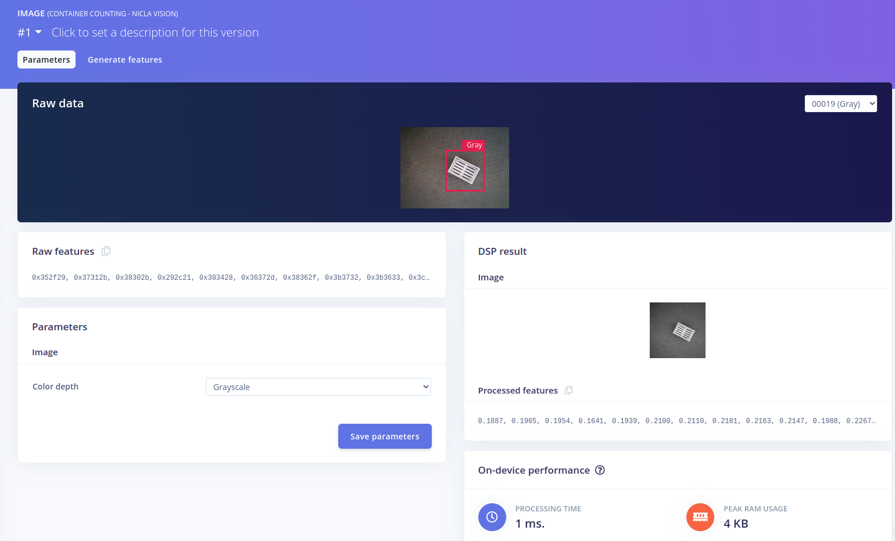


### Training the Model

Now that we have the features we can start training the neural network in the **Object Detection** menu. When choosing the model we have to consider the memory constraints of the Nicla Vision board (1MB RAM and 2MB Flash memory). The FOMO (Faster Objects, More Objects) model is perfect for this use case as it uses 30x less processing power and memory than MobileNet SSD or YOLOv5 for real-time object tracking. Specifically, we’ve used the **FOMO MobileNetV2 0.35** model. You can select the model and check out its memory requirements by clicking **Choose a different model**.

Make sure the Learning rate is 0.001 and you can use the rest of the settings with their default values. After training the model you can come back and tweak them to obtain better accuracy. There is no certain answer to what are the best settings for the model, as it depends from case to case, but you can experiment with different values, making sure to avoid underfitting and overfitting. As an example, this is what worked for us: 

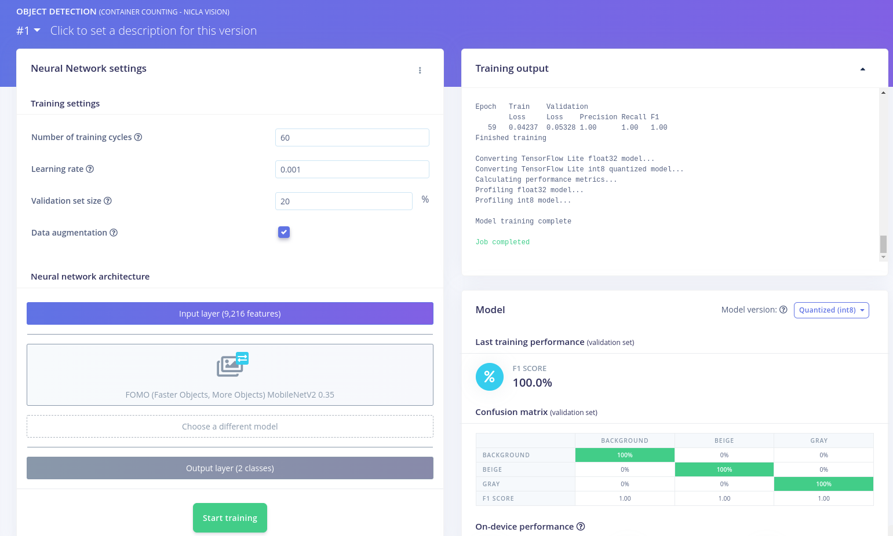

### Testing the model

To test the model, go to **Model testing** and select **Test all**. The model will classify all of the test set samples and provide you with an overall accuracy score for the model.

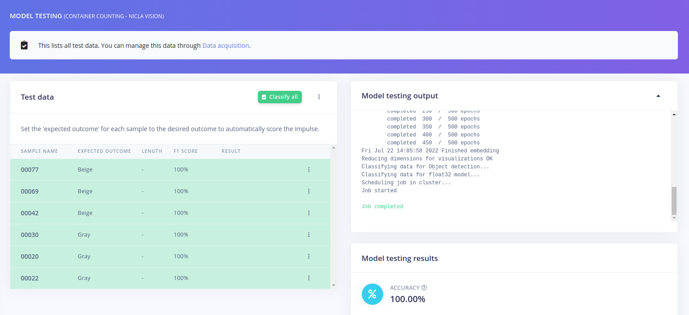

### Deploying the Model on the Edge

We’ve created, trained, and validated our model, so now it’s time to deploy it to the Nicla Vision Board. Go to **Deployment** in the Edge Impulse menu, select **OpenMV Firmware** and click on the **Build** button at the bottom of the page. This will generate an OpenMV firmware and download it as a ZIP file. Unzip it and you’ll find inside several files including **edge_impulse_firmware_arduino_nicla_vision.bin** and **ei_object_detection.py**, which we are interested in.

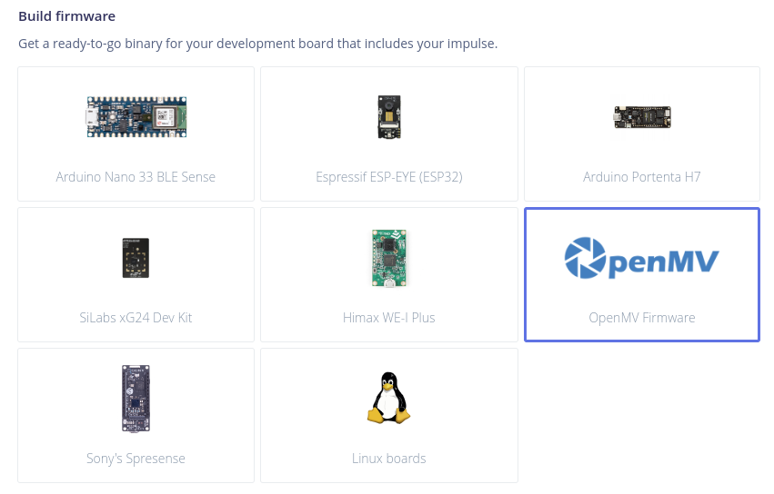

The next step is loading the downloaded firmware containing the ML model to the Nicla Vision board. So go back to OpenMV and go to **Tools ->  Run Bootloader (Load Firmware)**, select the `.bin` file, and click **Run**. Now go to **File -> Open File** and select the Python file from the archive.

To save memory, you can adjust the frame size and the window size:

```
sensor.set_framesize(sensor.QQVGA)     # Set frame size to QQVGA (160x120) or QVGA (240x240)
sensor.set_windowing((240, 240))       # Set 240x240 window.
```

If you hover over **set_framesize** you’ll find all the available options. In our case, both QVGA and QQVGA work well.

Finally, click **Connect** and **Run** and you can test the model!

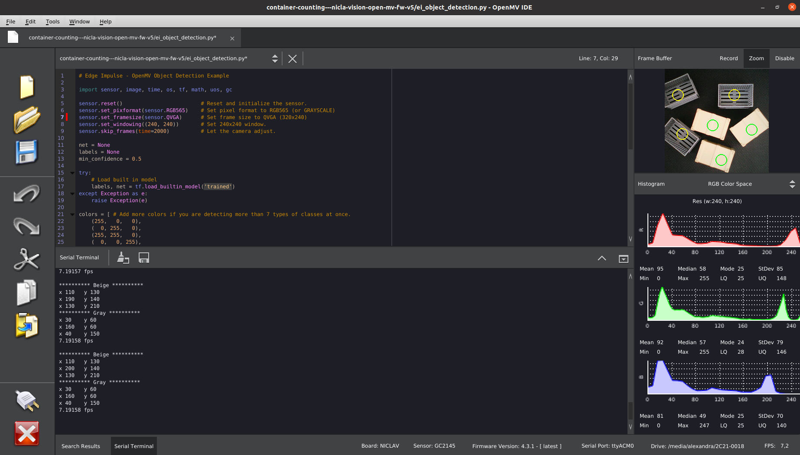

## Sending Data to the Cloud Using Adafruit IO

Adafruit IO is a cloud-based platform that allows you to easily interact with embedded devices. For example, you can use Adafruit IO to collect data from sensors and control actuators in real-time. You can also use Adafruit IO to create interactive interfaces, such as dashboards and data visualizations. It is easy to get started with Adafruit IO, and there is a large community of users who can provide support. In addition, Adafruit IO is compatible with a wide range of hardware platforms, making it a versatile tool for IoT applications.

For this use case, we’ve used Adafruit IO to visualize the number of detected containers in real-time, through a Dashboard. To do this, first go to [io.adafruit.com](https://io.adafruit.com/) and define a feed for each detected class.

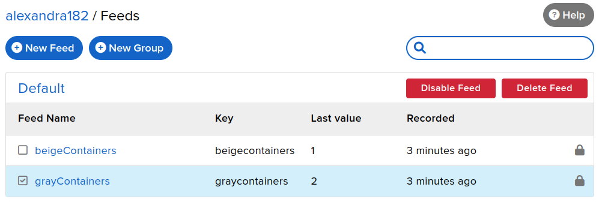

We’ve modified the previous MicroPython code by adding a few lines to connect to WiFi and to send an MQTT request to publish data to Adafruit IO. You have to adjust the WiFi credentials in the following code, as well as the client ID, Adafruit IO username, and Adafruit IO API key in the MQTT Client definition. Also adjust the feed names in `client.publish()`.

```
# Edge Impulse - OpenMV Object Detection (FOMO) Example

import sensor, tf, math, network, time
from mqtt import MQTTClient

SSID='<WIFI_SSID>' # Network SSID
KEY='<WIFI_PASS>'  # Network key

sensor.reset()                         # Reset and initialize the sensor.
sensor.set_pixformat(sensor.RGB565)    # Set pixel format to RGB565 (or GRAYSCALE)
sensor.set_framesize(sensor.QVGA)      # Set frame size to QVGA (320x240)
sensor.set_windowing((240, 240))       # Set 240x240 window.
sensor.skip_frames(time=2000)          # Let the camera adjust.

# Init wlan module and connect to network
print("Trying to connect... (may take a while)...")

wlan = network.WLAN(network.STA_IF)
wlan.active(True)
wlan.connect(SSID, KEY)

while not wlan.isconnected():
   print(".")
   pass

# We should have a valid IP now via DHCP
print(wlan.ifconfig())

def sub_cb(topic, msg):
   print((topic, msg))

client = MQTTClient('<CLIENT_ID>', 'io.adafruit.com', 1883, '<ADAFRUIIO_USERNAME>', '<ADAFRUITIO_KEY>', keepalive=30)
client.connect()

net = None
labels = None
min_confidence = 0.5

try:
   # Load built in model
   labels, net = tf.load_builtin_model('trained')
except Exception as e:
   raise Exception(e)

colors = [ # Add more colors if you are detecting more than 7 types of classes at once.
   (255,   0,   0),
   (  0, 255,   0),
   (255, 255,   0),
   (  0,   0, 255),
   (255,   0, 255),
   (  0, 255, 255),
   (255, 255, 255),
]

while(True):
   img = sensor.snapshot()

   # detect() returns all objects found in the image (splitted out per class already)
   # we skip class index 0, as that is the background, and then draw circles of the center
   # of our objects

   count = [0, 0]

   for i, detection_list in enumerate(net.detect(img, thresholds=[(math.ceil(min_confidence * 255), 255)])):
       if (i == 0): continue # background class
       if (len(detection_list) == 0): continue # no detections for this class?

       print("********** %s **********" % labels[i])
       for d in detection_list:
           [x, y, w, h] = d.rect()
           center_x = math.floor(x + (w / 2))
           center_y = math.floor(y + (h / 2))
           print('x %d\ty %d' % (center_x, center_y))
           img.draw_circle((center_x, center_y, 12), color=colors[i], thickness=2)
           count[i-1] = count[i-1] + 1

   time.sleep(5)
   print("Beige: " + str(count[0]) + " Gray: " + str(count[1]))
   client.publish('alexandra182/feeds/beigeContainers', str(count[0]))
   client.publish('alexandra182/feeds/grayContainers', str(count[1]))
```

Create a new dashboard and from ***Dashboard Settings -> Create a new block**, choose **Line Chart**. Connect both Feeds, check **Stepped Line**, and now you should be able the visualize the data in real-time!

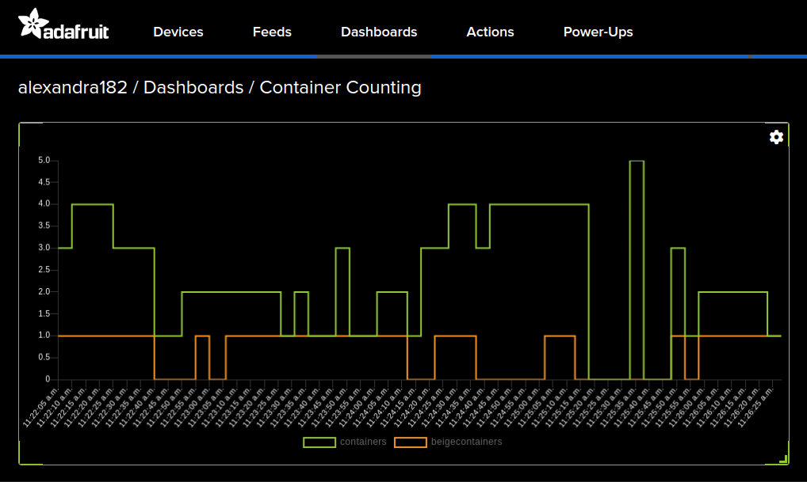

## Conclusion

Arduino Nicla is an innovative computer vision system that is ideal for a variety of uses, and it can detect and track objects in real-time, even under challenging conditions. Furthermore, it is highly customizable, making it possible to tailor it to suit any specific application. Whether you need to monitor traffic flows or count containers in real-time like in our example, Arduino Nicla is a perfect choice. Combining it with the new FOMO feature from Edge Impulse you can run a slim but powerful Computer Vision system at the edge.

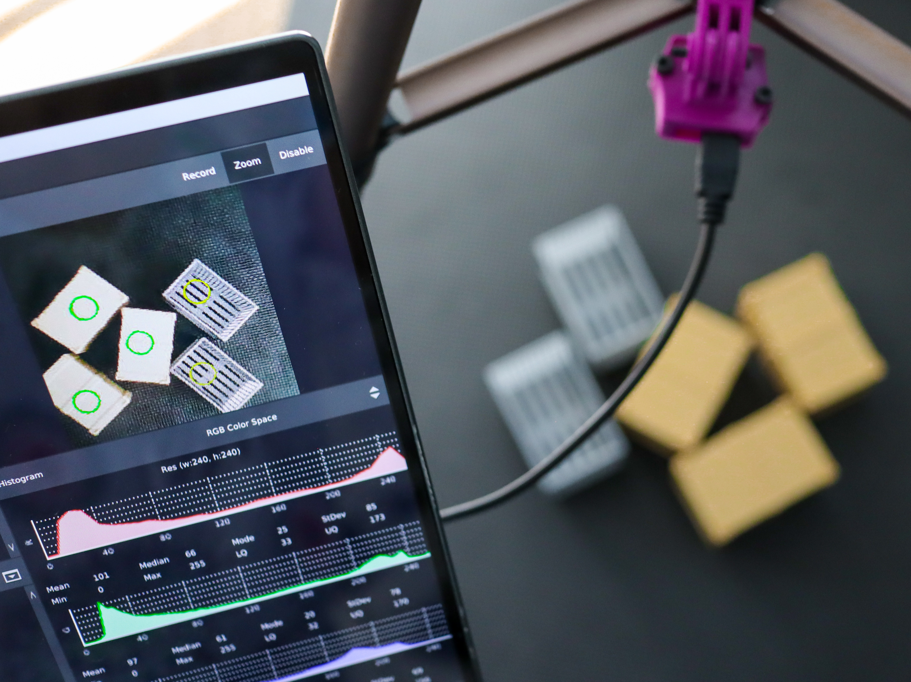


If you need assistance in deploying your own solutions or more information about the tutorial above please [reach out to us](https://edgeimpulse.com/contact)!
