# Steel Corrosion Detection with the Seeed reTerminal 

Created By:
Wamiq Raza 

Public Project Link:
[https://studio.edgeimpulse.com/public/133890/latest](https://studio.edgeimpulse.com/public/133890/latest)

## Introduction

We utilize metal objects crafted from iron and steel in our everyday lives. When these materials are exposed to moisture, there is a risk of corrosion occuring. Corrosion is a chemical process that destroys the surface of metals, as a result of chemical and electrochemical reactions caused by environmental circumstances. This leads to a loss of metallic components, which may contribute to diminished efficiency in the metal part's end-use applications. This reduces the life of metallic parts and can increase maintenance costs. The study of corrosion growth aids in the development of preventative strategies to avert such losses.

In this project the idea is to perform a demonstration on detecting corrosion, using TinyML. In heavy industries such as transportation, mining, construction, ship building, etc, corrosion remains a serious risk of operational safety. The cost associated with inadequate protection against corrosion can be huge. A lot of these industries rely on visual inspection of industrial environments by humans. However, in some cases, these industrial environments can be in remote or adverse conditions, thereby putting humans at risk. Additionally, the process of detecting and analyzing different types of corrosion is also subject to interpretation by humans. Using Deep Learning, it is possible to reduce and, in many cases, even remove the subjectivity. By using vehicles, such as robots or drones, it is possible to automate the process of inspection of such industrial environments. This can reduce risks to humans, as well as control costs for such operations. In this demonstration, we're proposing to build a deep learning model, using an edge AI device based upon the [Seeed Studio reTerminal](https://www.seeedstudio.com/ReTerminal-with-CM4-p-4904.html). And we'll integrate this with a webcam for you to visualize such corroded parts.

A promising way to overcome the aforementioned drawbacks is to develop an artificial intelligence-based algorithm that can recognize corrosion damage in a series of photographic images. Since an image with small dimensions, but still showing important features, demands less time for the processing, resizing large and high-quality images to smaller ones might be an option for an end-users. This diagram shows the process in more detail.

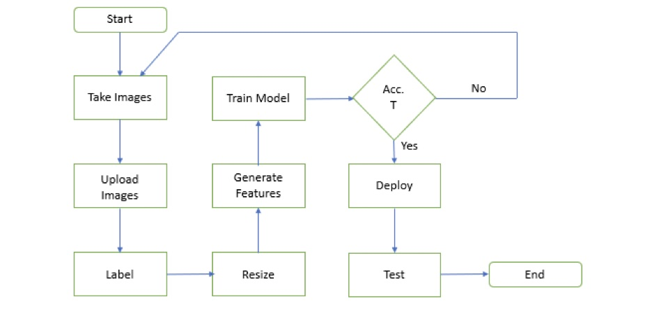

Requirements to build this project are a [Seeed Studio reTerminal with Raspberry Pi](https://www.seeedstudio.com/ReTerminal-with-CM4-p-4904.html) and a [Raspberry Pi Camera Module V2](https://www.raspberrypi.com/products/camera-module-v2/), a dataset, and Edge Impulse platform in order to develop the TinyML model and deploy it on the device. The rest of tutorial is Divided into three sections, section 1 is reTerminal hardware configurations, in second section the model development part is explained, and in last section the deployment and Edge Impulse CLI process are described.

## 1. reTerminal Configuration

The reTerminal is an HMI device built around the Raspberry Pi Compute Module 4 (CM4) with a 1.5GHz quad-core Cortex-A72 CPU and a 5-inch IPS capacitive multi-touch screen with a resolution of 1280 x 720. It has enough RAM (4GB) to multitask and enough eMMC storage (32GB) to install an operating system, allowing for quick startup times and an enjoyable overall experience. It has dual-band 2.4GHz/5GHz Wi-Fi and Bluetooth 5.0 BLE for wireless networking.

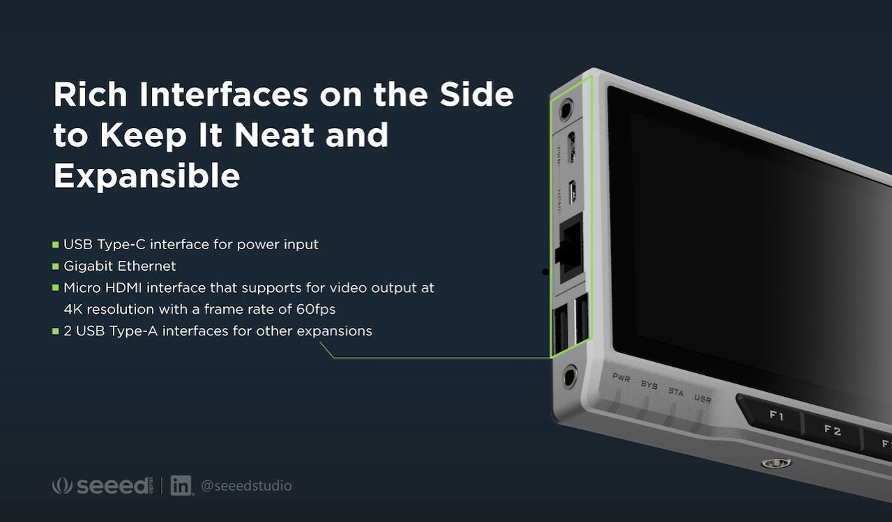

Further information on the reTerminal can be found in the [Seeed Studio Wiki here](https://wiki.seeedstudio.com/reTerminal).

### Hardware Required

You need to prepare the following hardware before getting started with reTerminal:

- reTerminal
- Ethernet cable or Wi-Fi connection
- Power adapter (5V/3A)
- USB Type-C cable

### Software Set Up

reTerminal comes with Raspberry Pi OS pre-installed out-of-the-box.  Be sure to go through the out-of-box setup process [documented here](https://wiki.seeedstudio.com/reTerminal/#quick-start-with-reterminal) to prepare your reTerminal for use. 

Once you have setup the hardware, the next step is to upload images into the Edge Impulse Studio and begin training a machine learning model.

## Model Developement

### Dataset

Rust is the most common form of corrosion. Rusting is oxidation of iron in the presence of air and moisture and occurs on surfaces of iron and its alloys, such as steel. A dataset of curated images, labeled as **CORROSION** and **NO CORROSION**  were collected from [2]. The figure below represents the Corrosion and No Corrosion images of a steel plate. In total 150 images were used for both classes, and were labeled in the Studio as `Rust` and `No Rust`. Information on how to upload images in to the Studio can be [found here](https://docs.edgeimpulse.com/docs/edge-impulse-studio/data-acquisition/uploader).

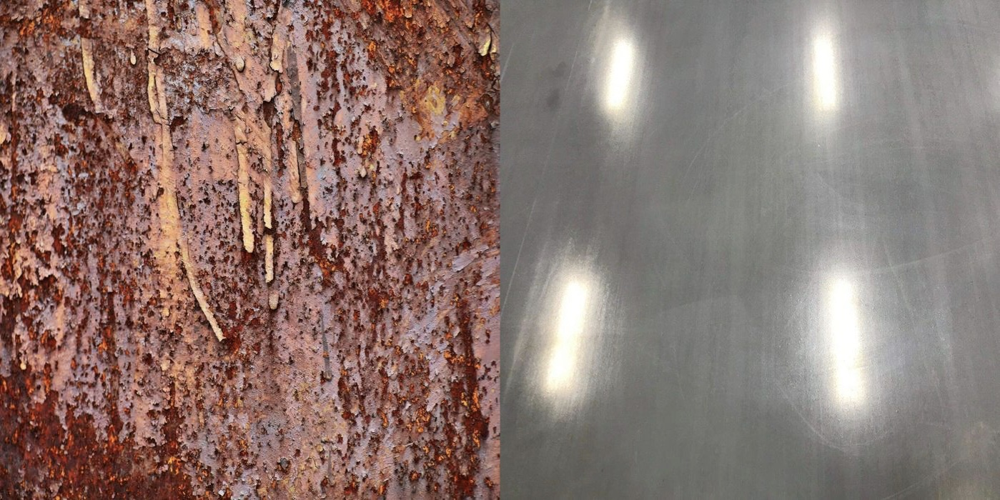

### Impulse Design

Once the dataset is uploaded, we are ready to train our model. This requires two important features: a processing block and a learning block. Documentation on Impulse Design can be [found here](https://docs.edgeimpulse.com/docs/edge-impulse-studio/create-impulse).

We first click "Create Impulse". Here, set image width and heigh to 96x96; and Resize mode to Squash. The Processing block is set to "Image" and the Learning block is "Transfer Learning (Images)". Click 'Save Impulse' to use this configuration as shown in below figure. We have used a 96x96 image size to lower the RAM usage, presented in [3]. Higher resolution images will cause a subsequent increase in RAM usage when running the model.

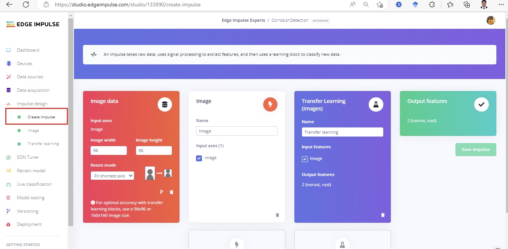

Next, on the "Image" processing block, set Color depth to RGB. "Save parameters", and this will open the "Generate Features" tab as shown in below figure. On the window 'Generate features', we click the "Generate features" button. Upon completion we see a 3D representation of our dataset. These is what will be passed into the neural network.

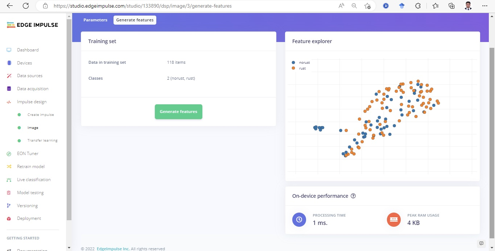

### Building and Training the Model

To train a model, the **MobileNetV2 96x96 0.2** algorithm was then used with a hyperparameter of 60 epochs, and learning rate set to 0.005 with the dataset split into Training, Validation, and Testing. After introducing a dynamic quantization from a 32-bit floating point to an 8-bit integer, the resulting optimized model showed a significant reduction in size (346.3K). The onboard inference time was reduced to 93 msec and the RAM use was limited to 585.6K, with an accuracy after the post-training validation of 79.2% shown.

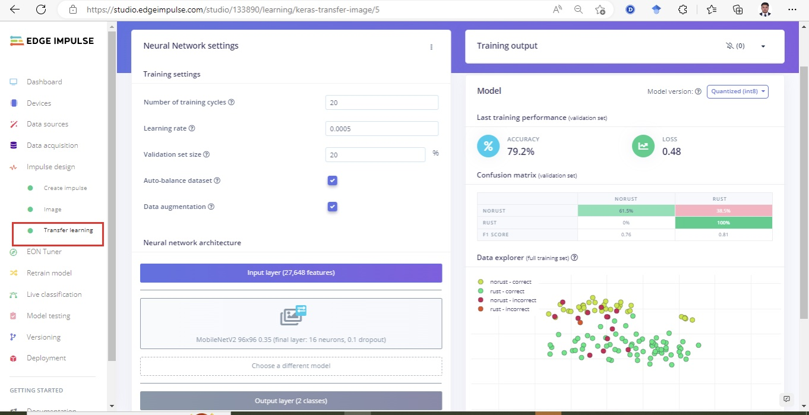

## Deploying to the reTerminal

In order to deploy a model on to the reTerminal, the Edge Impulse CLI will be needed. The installation process is described in the [documentation here](https://docs.edgeimpulse.com/docs/edge-impulse-cli/cli-installation), but basically comes down to a few simple steps:

```
curl -sL https://deb.nodesource.com/setup_12.x | sudo bash -
sudo apt install -y gcc g++ make build-essential nodejs sox gstreamer1.0-tools gstreamer1.0-plugins-good gstreamer1.0-plugins-base gstreamer1.0-plugins-base-apps
npm config set user root && sudo npm install edge-impulse-linux -g --unsafe-perm
```

After the Edge Impulse CLI is installed, make sure you have the camera connected - I used a simple USB Web camera; if you use the official Raspberry Pi camera, remember to enable it in `raspi-config`.

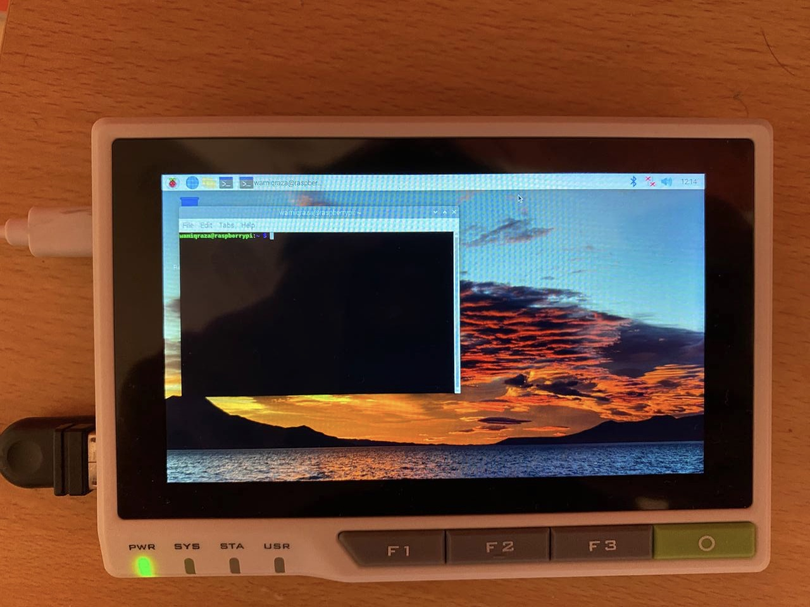

One of the best things about the Linux support for Edge Impulse is the `edge-impulse-linux-runner`. When the model training is finished and you're satisfied with the accuracy on your Validation dataset (which is automatically split from Training data), you can test the model in **Live classification** before deploying it on the device. In this case it is as simple as running:

```
edge-impulse-linux-runner
```

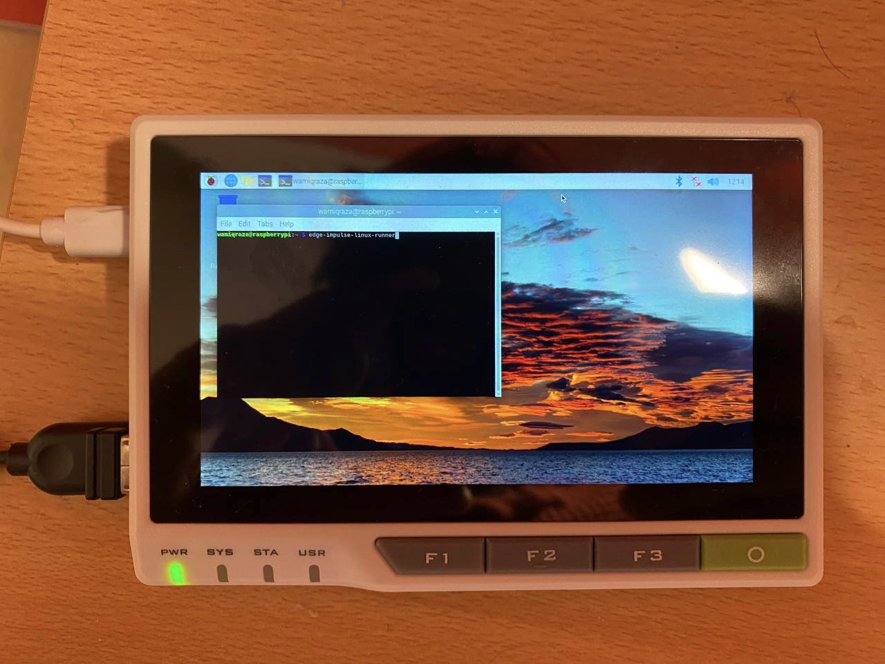

After launching the command, you will need to enter your username and password to login to Edge Impulse, as shown below.

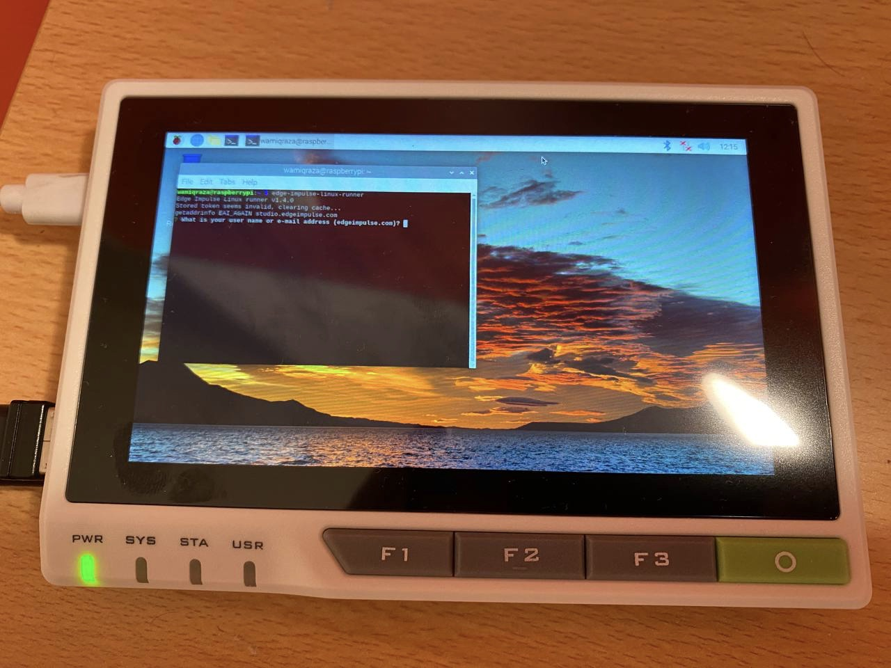

In the terminal, select the Project and the model will be automatically downloaded and prepared, then the inferencing will begin and results will be displayed in the terminal. In the images below, we can see the results with a probability score for **Rust** and **No Rust**.

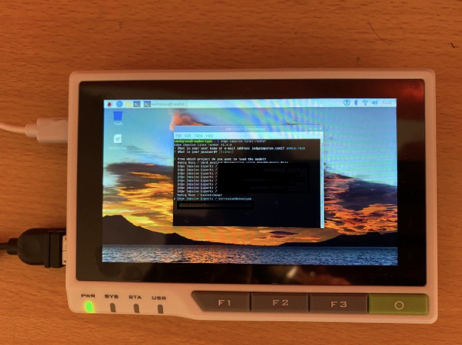

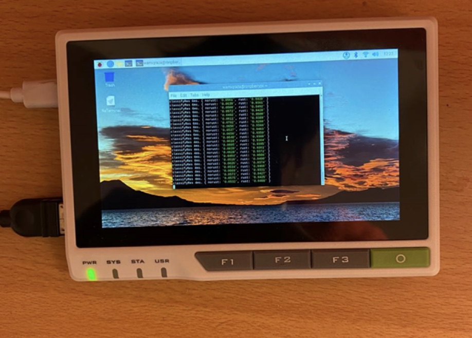

## Conclusion

How do I feel about reTerminal? As long as you optimize your networks properly, machine learning can execute simple computer vision and speech recognition in real time or even quicker on a Raspberry Pi CM4 with enough RAM. I found it comfortable to use as a portable Pi, however a touch-pen is required for the desktop interface. Hopefully, an official image for Ubuntu Touch will be supplied in the near future, which would substantially improve the touch screen's usefulness for interface interaction. In the end, however, we were able to successfully demonstrate a machine learning model running on the reTerminal, performing well, all in a compact and portable device.

## References

[1] [Getting Started with reTerminal - Seeed Wiki (seeedstudio.com)](https://wiki.seeedstudio.com/reTerminal/)

[2] [GitHub - anirbankonar123/CorrosionDetector: Corrosion Detection from Images](https://github.com/anirbankonar123/CorrosionDetector)

[3] [Bean Leaf Classification with Sony Spresense - Expert Projects (edgeimpulse.com)](https://docs.edgeimpulse.com/experts/bean-leaf-classification)


