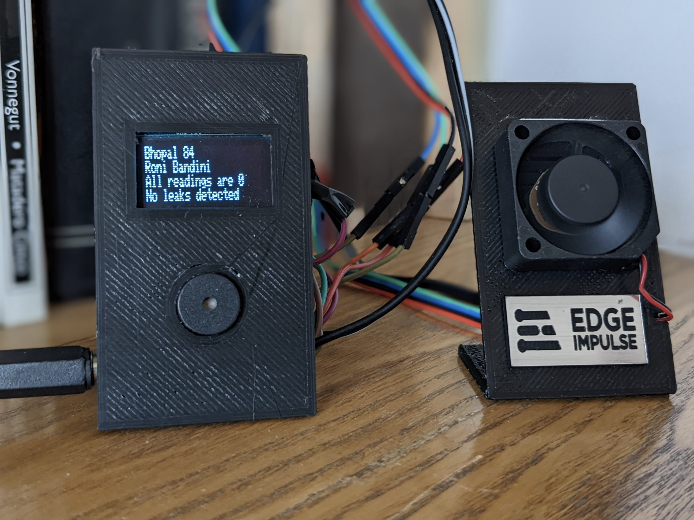
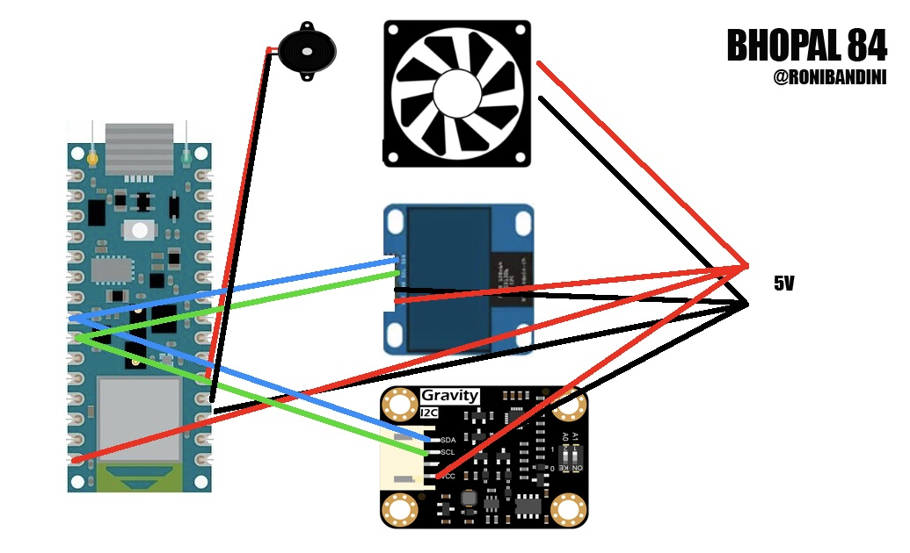
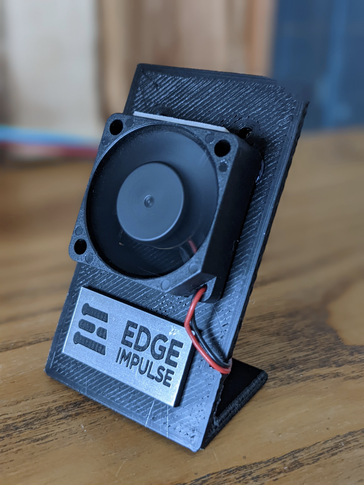
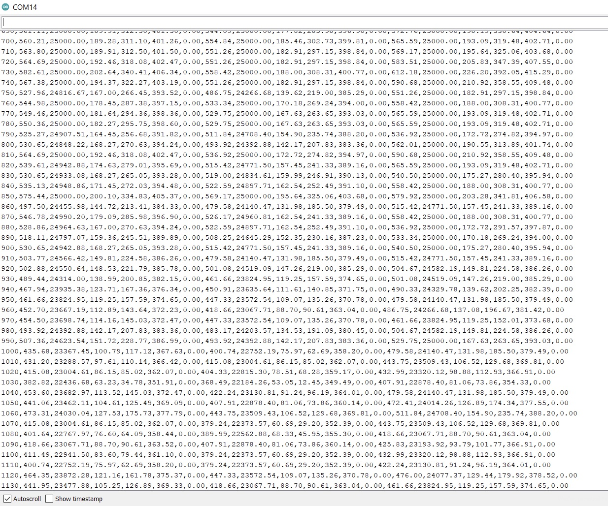
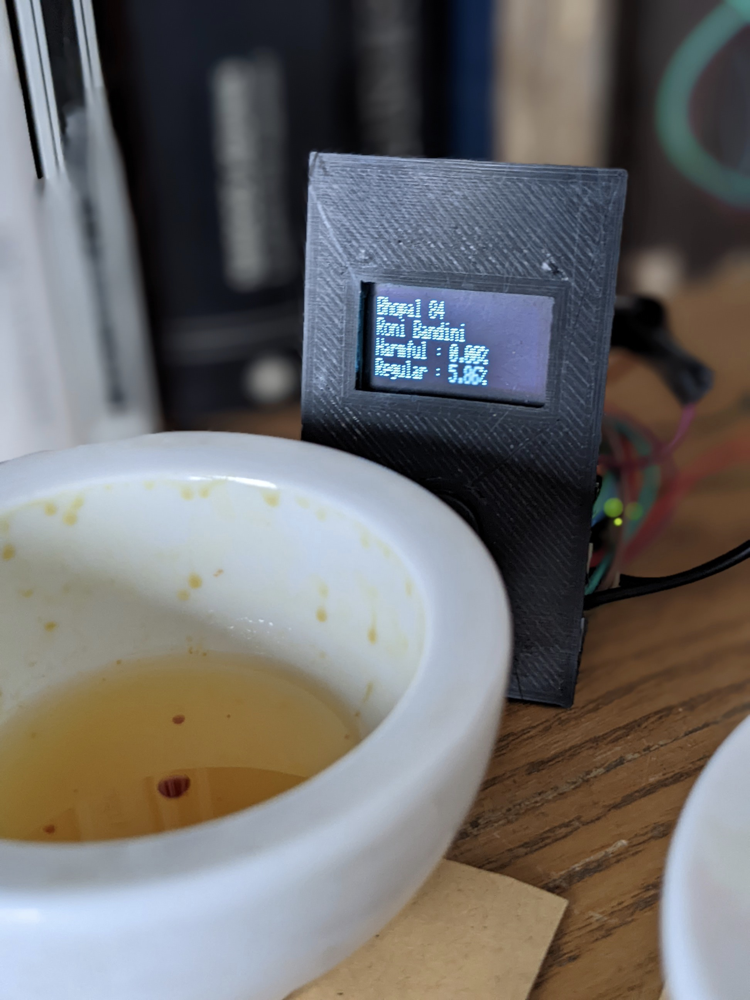
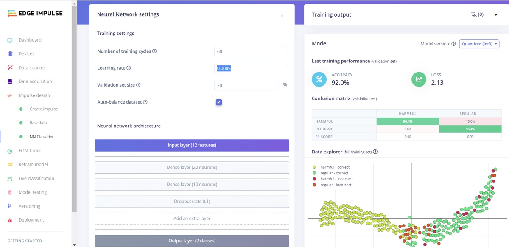

# Bhopal 84: Detect Harmful Gases

Created By:
Roni Bandini 

Public Project Link:
[https://studio.edgeimpulse.com/public/114438/latest](https://studio.edgeimpulse.com/public/114438/latest)

## Project Demo



## Intro

Industries working with chemicals are always subject to leaks that could harm workers. A Machine Learning model could be trained to identify subtle relationships between multiple gas readings to spot custom leaks. 

### Hardware Used

 - Arduino BLE 33 Sense
 - MiCS-4514 gas sensor 
 - 5V Cooler
 - Oled screen 128x32
 - Buzzer
 - 3d printed parts
 - DC female connector
 - 5v Power Supply
 

 
This project uses MiCS-4514 multi gas sensor. The sensor is able to detect the following gases:

 - Methane          (CH4)    (1000–25000) PPM
 - Ethanol          (C2H5OH) (10-500) PPM
 - Hydrogen         (H2)     (1-1000) PPM
 - Ammonia          (NH3)    (1-500) PPM
 - Carbon Monoxide  (CO)     (1- 1000) PPM
 - Nitrogen Dioxide (NO2)    (0.1-10) PPM
 
 

The device will read the gas sensor x times for y seconds and then calculate min, max and average. Those values will be forwarded to the Machine Learning model for inference and then a score will be obtained for “harmful” gas 1 or “regular” gas 2.

## Data Acquisition

Upload to the Arduino BLE 33 Sense the acquisition script. Place the sensor unit close to the gas or substance and open serial monitor. You should see there multi gas sensor values as CSV records. Uncheck timestamp, then copy and paste the serial monitor screen into a text file. Save that file as `harmful.csv` and add this header:

`timestamp, CO2avg, C2H5OHavg, H2avg, NH3avg, CO2min, C2H5OHmin, H2min, NH3min, CO2max, C2H5OHmax, H2max, NH3max`

Repeat the procedure for all the gases to be detected.

## Model Training

Go to Impulse Design, Create Impulse. 

In Times Series Data, use 1500ms Windows Size and 0,6 frequency.

Processing block will be raw data with all axis checked. For classification use Keras with 2 output features: regular and harmful.

In Raw Data you can see all values for regular and harmful inside every windows size. Then you have to click Generate Features.

For NN Classifier use 60 training cycles, 0.0005 Learning Rate, Validation 20 and Autobalance dataset. Add an extra layer Droput Rate 0.1 Click Start Training and check if you get good accuracy. 

If you are ok with results you can go to Model Testing and check the performance with new data. If there are lots of readings with wrong classification you should check again data acquisition procedure. 

## Deployment

Go to Deployment. Select Arduino Library and save the zip file. Now go to Arduino IDE, Sketch, Include Library, Add Zip library and select the downloaded zip file.

Connect the Arduino to the computer with the USB cable and Upload the code. Please note that it will take long minutes to upload.

## Code Settings

If you want to change calibration time in minutes, use
`#define CALIBRATION_TIME   3`

If your OLED screen has a different I2C address, use
`#define SCREEN_ADDRESS 0x3C`

If you want to use another pin for the Buzzer
`# define pinBuzzer 2`

If you want to use more readings for min, max and average
`int   measuresNumber=4;`

If you want to change the measure timeframe
`int   measuresTimeFrame=1500; // 1.5 seconds`

If you want to change the percentage to identify the gases
`float scoreLimit=0.8;`

## Using Bhopal 84

After displaying Bhopal and Edge Impulse logos, the unit will start the calibration phase. During this phase do not place any substance or gas under the sensor unit. It should read normal air conditions. As soon as this step is finished you can put the leaked substance under the sensor unit and it should be detected in 1.5 seconds. Why 1.5 seconds? During that period 4 readings will be made to obtain mix, max and average for all gases. That information will be forwarded to the model and a classification will be returned. 

The prototype is able to detect normal air conditions, a regular gas and a harmful gas. 

## Links

Source code: [https://github.com/ronibandini/bhopal84](https://github.com/ronibandini/bhopal84)

3d parts: [https://www.thingiverse.com/thing:5420469](https://www.thingiverse.com/thing:5420469)

