# Use Computer Vision on a TI TDA4VM to Deter Shoplifting

Created By:
Roni Bandini 

Public Project Link:
[https://studio.edgeimpulse.com/public/153222/latest](https://studio.edgeimpulse.com/public/153222/latest)

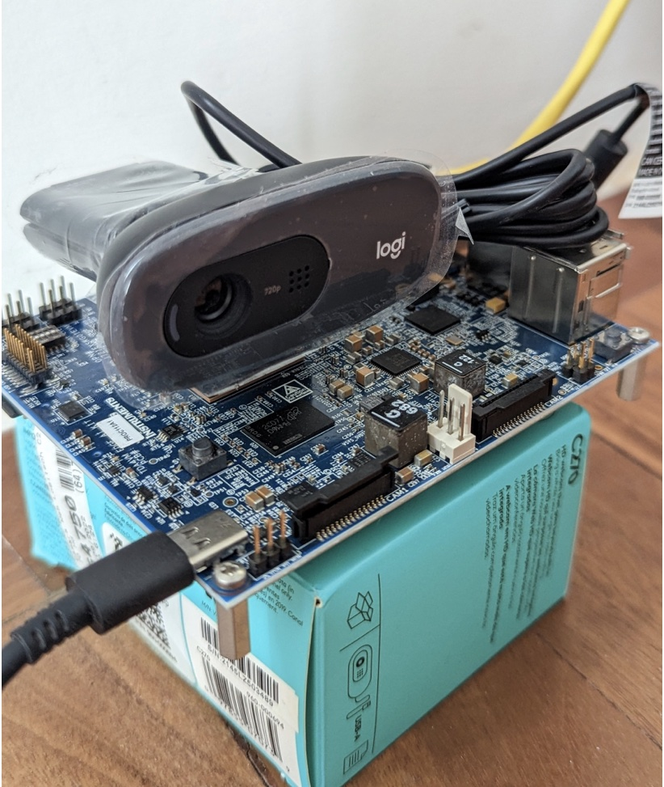

## Intro

As any large retailer knows, lots of potential profits are lost each year due to shoplifting. Shoplifters are rarely caught, and even when they are, many regions have minimal punishment so shoplifters go right back to committing the crime. For this experimental project, I will use a new Vision AI single board computer from Texas Instruments, the TDA4VM, to detect forbidden bags. 

The TDA4VM SoC and it's Starter Kit contains a dual-core Arm Cortex-A72 processor, C7x DSP, and deep learning, vision and multimedia accelerators onboard.

## TDA4VM Starter Kit Setup

First, download the OS image that TI provides here: [https://www.ti.com/tool/download/PROCESSOR-SDK-LINUX-SK-TDA4VM](https://www.ti.com/tool/download/PROCESSOR-SDK-LINUX-SK-TDA4VM)

Flash the image onto a microSD card (there is one included with the kit, along with a power cable) and place the card into the board. 

The TDA4VM Starter Kit board is able to use a Raspberry Pi camera, connected with a standard ribbon cable. In fact, the board actually supports two Raspberry Pi cameras, as there are two connectors on the board. But, at the time of this tutorial, Edge Impulse support for the Raspberry Pi camera is not yet available, so instead you can use popular USB cameras like the Logitech C270, C920 or C922.

Connect the camera to a USB port (use a blue USB 3.0 port if possible) and power the board with at least a 5V/3A power supply. 

Once booted, you'll notice the OS is not a typical Linux version. It called Arago, and has some differences that you might not be used to. Connecting a USB keyboard and HDMI screen won’t work, for example. Instead, you can connect to the board with a UART cable, but since the software tools included are limited (There is no `nano` editor, just `vi` so don't forgot the combinations `:q`, etc!), it is better to connect the Ethernet cable to a router, obtain the IP by checking DHCP lease, and access the board through SSH and SFTP.

The OS user account credentials are username: `root`, and there is no password. After you connect with SSH, you will have to press Enter again since there will be no greeting, otherwise and you may think the board is locked up or powered off. 

If you want to configure the Raspberry Pi camera (though it won't work with Edge Impulse, as mentioned), open `/run/media/mmcblk0p1/uEnv.txt` and edit the file to include:

```
name_overlays=k3-j721e-edgeai-apps.dtbo k3-j721e-sk-rpi-cam-imx219.dtbo
```
Save and reboot the board with `$sudo reboot`

## Data Acquisition

The first step is in a computer vision project is data collection, which in this case requires images. We need pictures of bags, lots of them. How can we get those pictures? Open Camera is an [Android app](https://play.google.com/store/apps/details?id=net.sourceforge.opencamera&hl=en&gl=US&pli=1) that includes a "repeat" option that can take X pictures every Y seconds. Using a white background, I took 100 pictures of different bags in different positions. More pictures is even better, but 100 is enough to get started. Then, upload those files to Edge Impulse and label them. Uploading images is easy, using the Edge Impulse Studio.

> Note: you can also skip this Data acquisition step, by simply cloning my Edge Impulse project, which will provide you with the images I collected.

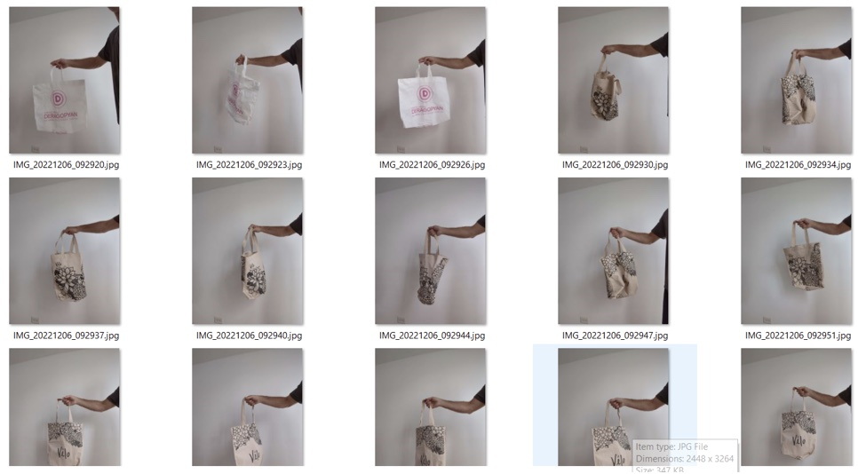

Go to Data Acquisition, Upload Data with "Automatically split between training and testing" selected.

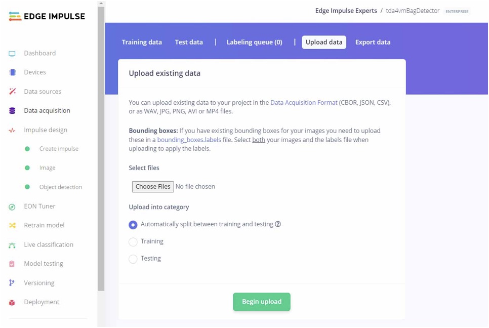

Next, go to the Labeling Queue. Drag a Bounding Box around the location of the bags in each image, and enter the label as 'bag'. This goes relatively quickly as Edge Impulse Studio will attempt to identify the bag automatically on subsequent images, so you may just need to move the box a bit for each picture. 

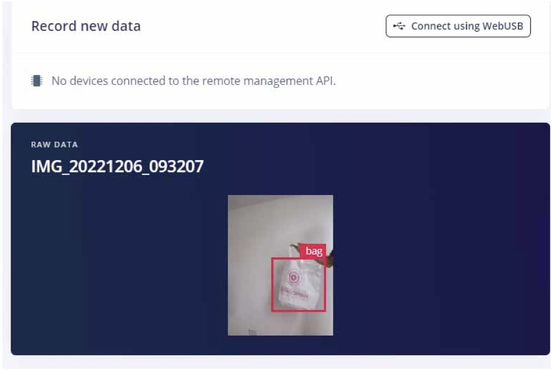

## Model Training

With the data all uploaded and labeled, go to **Impulse Design**. An Impulse is a machine learning pipeline. In the first block, select Image Data if it is not already chosen, and set the image width and height to 96 pixels, and Fit shortest axis. Next, choose Image for the Processing block. Then Object Detection in the Learning block. You can learn more about block choices here: [https://docs.edgeimpulse.com/docs/edge-impulse-studio/impulse-design](https://docs.edgeimpulse.com/docs/edge-impulse-studio/impulse-design).

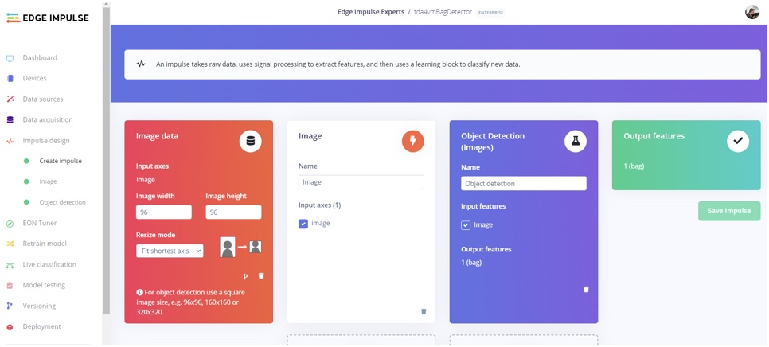

Save the Impulse and move on to Parameters, then next move on to Generate features. Generating features will give you a visual representation of your data, and you should be able to notice the data is clustered.

Move on to Object Detection on the left menu, and you can select the options to begin training your model.  I went with 60 cycles, a 0.01 Learning Rate, set aside 20% of my data for Validation, and chose to enable Data Augmentation. You can click the **Start Training** button to begin the process.

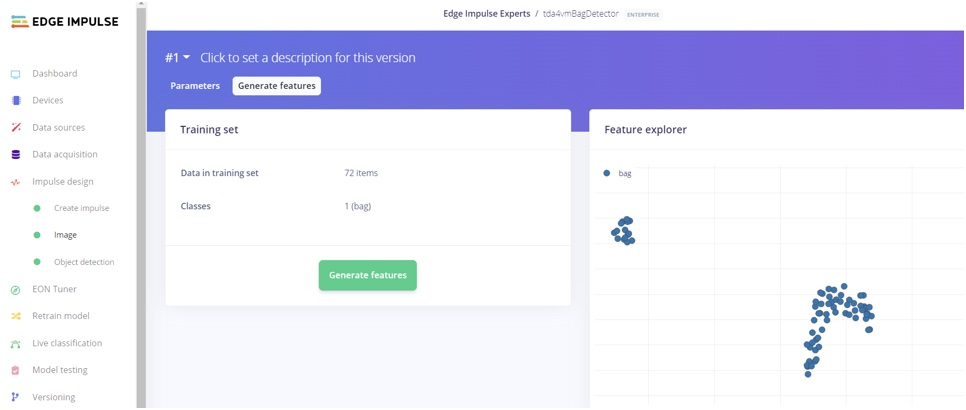

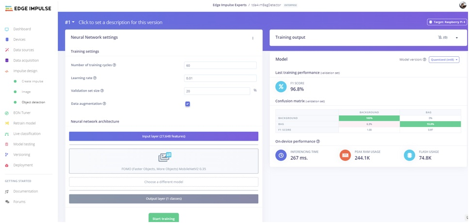

Once training is complete, if you get a good F1 Score (75% could be considered good), you can move on to Test the model. Otherwise, you may need to collect more images of bags, alter lighting conditions, vary the location of the bag in your images, or fine tune the training settings.  More information on these parameters and what they do, is located here: [https://docs.edgeimpulse.com/docs/edge-impulse-studio/learning-blocks/classification](https://docs.edgeimpulse.com/docs/edge-impulse-studio/learning-blocks/classification)

To test your model, you can choose **Model testing** on the left navigation, and check to see how well your model performs on unseen data that was set aside when uploading your data.

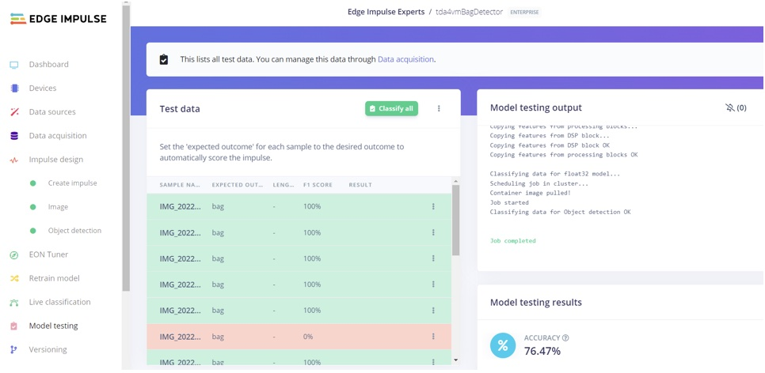

## Model Deployment 

To take the built model and install it on the TDA4VM Starter Kit board, head back to your SSD connection to the board.

Run this command to install the Edge Impulse Linux runner on the board:

```
$ npm install -g --unsafe-perm edge-impulse-linux
```

Follow the prompts to login to your account, and select the Project to connect to.

Back in the Edge Impulse Studio, click on Deployment on the left menu, and you will find all of the methods for building firmware and libraries. In this case, select Texas Instruments, TIDL-RT-Library, and download the `.zip` file that gets generated. That file is going to be needed on the TDA4VM board, so you could use SFTP to place it onto the board, or perhaps just use a USB drive and copy the file from your laptop or desktop PC, onto the USB stick, then place the USB stick into the TDA4VM board and copy it from USB to the local filesystem.

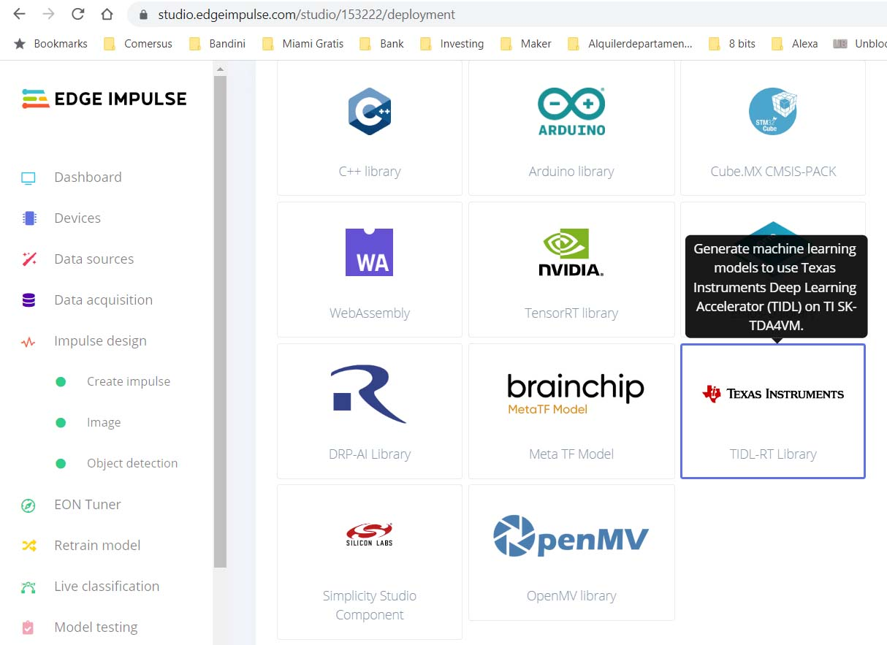

Once it's on the TDA4VM board, unzip the file with:

`$ unzip tda4vmbagdetector-tidl-lib-v17.zip`

Then run:

```
$ edge-impulse-linux-runner --force-engine tidl --force-target runner-linux-aarch64-tda4vm 2>&1 | tee bagdetectorlog.txt
```

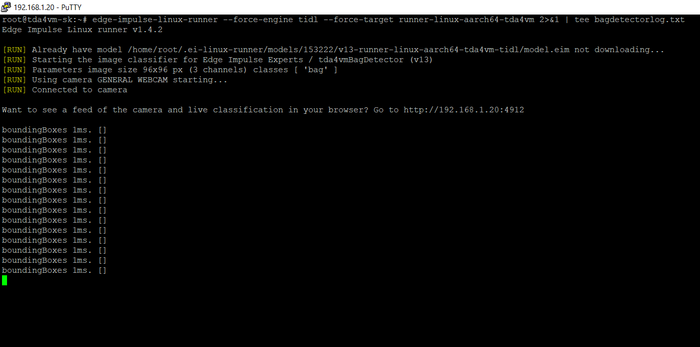

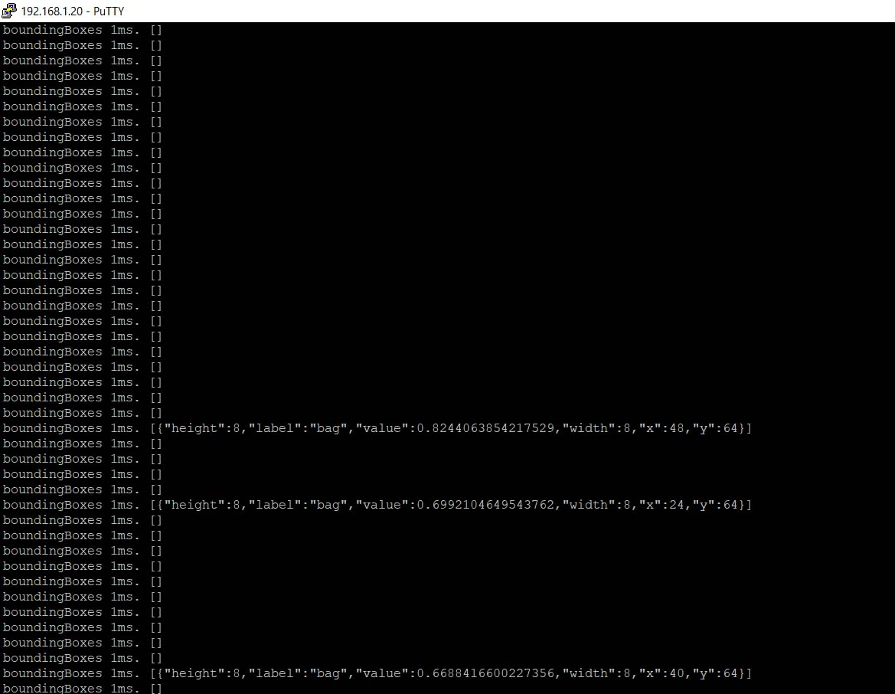

## Output Example

```
boundingBoxes 2ms. [{"height":16,"label":"bag","value":0.9940009713172913,"width":16,"x":64,"y":16}]
boundingBoxes 1ms. [{"height":8,"label":"bag","value":0.5943511724472046,"width":16,"x":40,"y":24}]
boundingBoxes 1ms. [{"height":8,"label":"bag","value":0.6335017085075378,"width":8,"x":40,"y":24}]
boundingBoxes 1ms. [{"height":8,"label":"bag","value":0.7399385571479797,"width":8,"x":64,"y":24}]
boundingBoxes 1ms. [{"height":8,"label":"bag","value":0.7302699685096741,"width":8,"x":64,"y":24}]
boundingBoxes 1ms. [{"height":8,"label":"bag","value":0.5893773436546326,"width":8,"x":64,"y":24}]
boundingBoxes 1ms. [{"height":8,"label":"bag","value":0.6636818647384644,"width":8,"x":64,"y":24}]
boundingBoxes 1ms. [{"height":8,"label":"bag","value":0.545727550983429,"width":8,"x":64,"y":24}]
```

On our laptop or desktop machine, connecting with a browser to the device IP and port 4912 (for example, http://<deviceIP>:4912) we can see inferences in real time. 

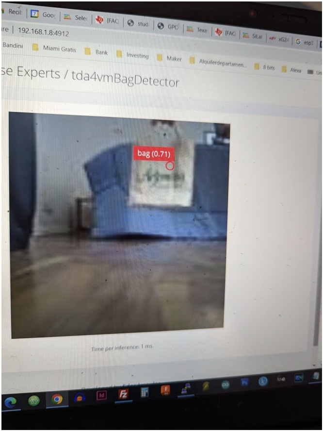

As an extra bit to get you started, I have also developed a Python script that can check the log, filter by Confidence percent above a certain threshold, and send Telegram alerts.  To make use of this script, you just need to: 

- Download `readLog.py` from [https://github.com/ronibandini/TDA4VM-bag-detector](https://github.com/ronibandini/TDA4VM-bag-detector)
- Edit the file to set your Telegram Token, Chat ID and Confidence % threshold
- Transfer the file to the TDA4VM via SFTP, or using a USB stick like previously 
- Run the application with `$ python3 readlog.py`

## Conclusion

In this tutorial, we have built a proof-of-concept project to help deter shoplifting and theft. We used a Texas Instruments TDA4VM Vision AI Starter Kit and Edge Impulse to train a computer vision machine learning model that can detect bags, deployed the model to the TDA4VM board, and then added an application that can send an alert if a bag is identified during inferencing. The hardware acceleration built-in to the TDA4VM board performed inferencing at approximately 1ms, or 100 frames per second in this test. Only one camera is being used in this demonstration, but the TDA4VM [can support up to 8 cameras simultaneously](). 

## Sources

- https://recfaces.com/articles/shoplifting-statistics
- https://software-dl.ti.com/jacinto7/esd/processor-sdk-linux-sk-tda4vm/latest/exports/docs/getting_started.html
- https://e2e.ti.com/support/processors-group/processors/f/processors-forum/1137524/faq-edge-impulse-setup-on-ti-processors-arm-only?tisearch=e2e-sitesearch&keymatch=faq%3Atrue

