# Driver Drowsiness Detection With FOMO

Created By: Shebin Jose Jacob

Public Project Link: [https://studio.edgeimpulse.com/public/168098/latest](https://studio.edgeimpulse.com/public/168098/latest)

GitHub Repository:

[https://github.com/CodersCafeTech/Driver-Drowsiness-Detection-With-FOMO](https://github.com/CodersCafeTech/Driver-Drowsiness-Detection-With-FOMO)

## Intro

Driver drowsiness is a major contributing factor to motor vehicle accidents and can have serious consequences, including injury or death. There are several reasons why driver drowsiness can lead to accidents. When a person is tired, their reaction time slows down, their decision-making abilities are impaired, and they may have difficulty maintaining their focus on the road. As a result, they may miss important visual cues, fail to notice hazards or make poor decisions while driving.

In addition to these physical effects, drowsy driving is also a cognitive impairment, meaning it affects a person's ability to think and make good decisions. When a driver is tired, their judgment and awareness are impaired, which can lead to risky or dangerous behavior behind the wheel. The risk of drowsy driving is higher for certain groups of people, including commercial truck drivers, shift workers, and those with undiagnosed or untreated sleep disorders. However, anyone can be at risk for drowsy driving if they do not get enough sleep or if they are driving for long periods of time without taking breaks.

As drowsy driving continues to be a major safety concern on our roads, we are developing a cutting-edge system to address this problem.

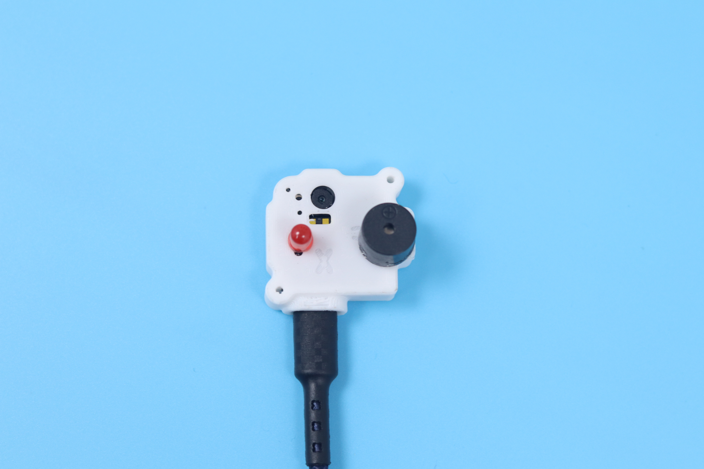

## How Does It Work

Our solution combines the power of Computer Vision and Artificial Intelligence (AI) to monitor the driver's eyes and detect when they are closed for two seconds in a row. To ensure the accuracy and reliability of our system, we have trained and deployed an AI algorithm (model) on to an Arduino Nicla Vision. These algorithms are trained to recognize patterns and trends in the data collected by the camera and to identify when the driver's eyes are closed for an extended period of time.

If the system detects that the driver's eyes are closed for two seconds or longer, it will generate an alert to wake the driver up and remind them to stay focused and alert on the road. This alert can be in the form of a visual or auditory signal, such as a flashing light or a loud beep.

In addition to detecting drowsy driving, our system can also be extended to monitor other behaviors that may impact road safety, such as distracted driving or impairment due to drugs or alcohol. By alerting drivers to these behaviors and reminding them to stay focused and alert, we can help to reduce the risk of accidents and keep our roads safer for everyone.

## Hardware Requirements

* [Arduino Nicla Vision](https://store.arduino.cc/products/nicla-vision)
* LED
* Buzzer

## Software Requirements

* [Edge Impulse](https://edgeimpulse.com)
* [Arduino IDE](https://www.arduino.cc/en/software)

## Hardware Setup

The hardware setup for data collection consists of a Nicla Vision mounted on a tripod.

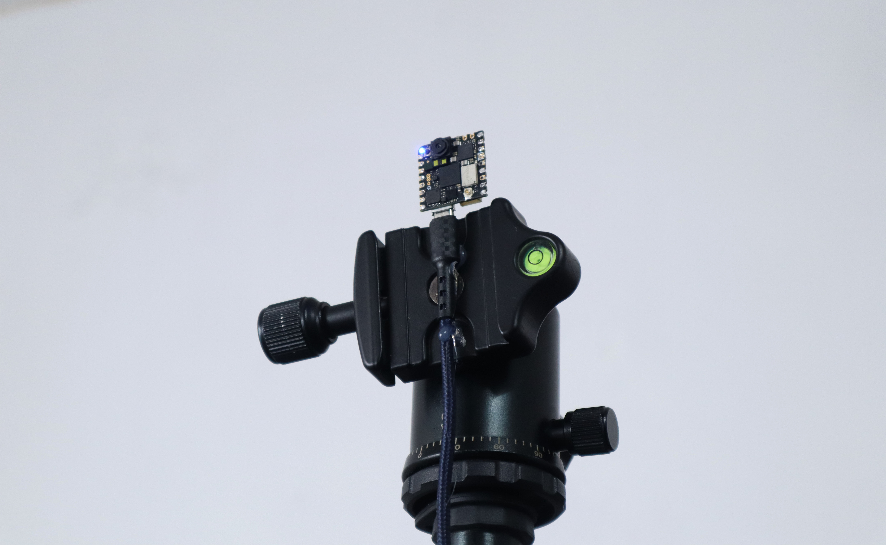

### Arduino Nicla Vision

Nicla Vision is a powerful and versatile product that is designed to enable users to develop and prototype projects involving image processing and machine vision at the edge. It features a 2MP color camera that supports TinyML, as well as a smart 6-axis motion sensor, microphone, and distance sensor, which provide a range of sensing capabilities.

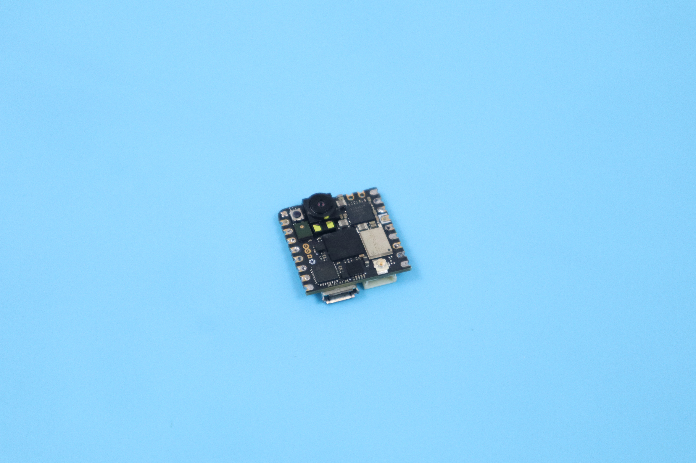

The product is powered by a powerful STM32H747AII6 Dual ARM Cortex M7/M4 IC processor, which enables on-device intelligence and enables users to host machine learning models and other advanced algorithms on the edge. In addition, Nicla Vision is compact in size, with a form factor of just 22.86 x 22.86 mm, which makes it easy to incorporate into a wide range of projects and scenarios. With its combination of machine vision and processing capabilities, as well as its tiny form factor, Nicla Vision is an ideal solution for developing or prototyping projects involving image processing and machine vision at the edge.

## Software Setup

If you are unfamiliar with the process of setting up the Nicla Vision for use with Edge Impulse and haven't yet connected the device to the Edge Impulse dashboard, we recommend following a [quick tutorial](https://docs.edgeimpulse.com/docs/development-platforms/officially-supported-mcu-targets/arduino-nicla-vision) to guide you through the setup process.

Upon successfully establishing a connection between the device and the Edge Impulse dashboard, you should expect to see the device appear in the **Devices** tab.

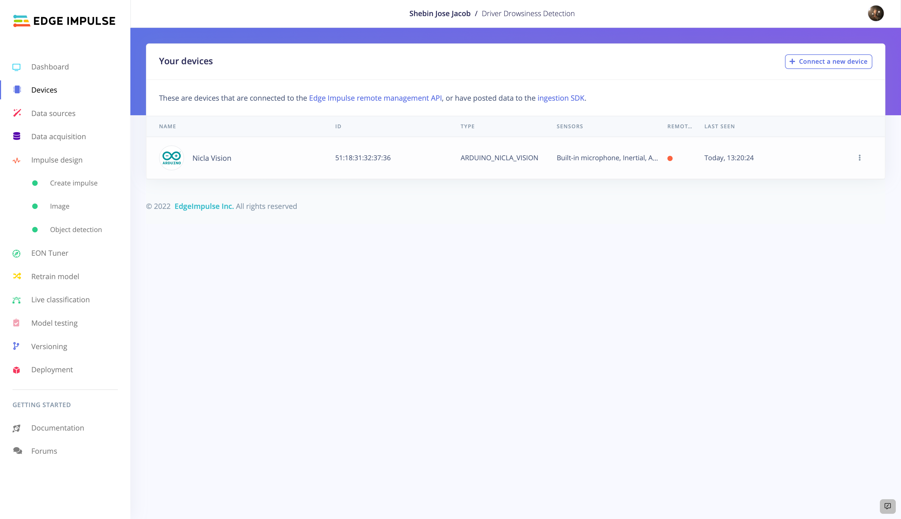

If you do not see the device listed in the **Devices** tab, it is possible that there may be an issue with the connection or the configuration of the device. In this case, it may be necessary to troubleshoot the issue or refer to additional resources for assistance.

## TinyML Model Generation

### 1. Data Acquisition

Now that the necessary software and hardware have been configured, we can proceed to build the object detection model. The first step in this process is to gather data that will be used to train the model. There are two main approaches to collecting data: using the connected device to directly capture data or uploading pre-existing data using the Uploader tool. In this particular project, we will be utilizing the first method and collecting data directly from the connected device. This data will then be used to train the object detection model, enabling it to more accurately identify and classify objects in the future.

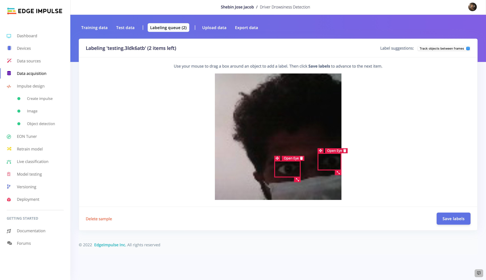

After the data has been uploaded to the Edge Impulse platform, it will be necessary to label the unlabeled images in the **Labeling queue**. In this case, there are two distinct classes that the model will be trained to recognize: _Closed Eye_ and _Open Eye_. As such, there are two corresponding labels that will be applied to the images in the labeling queue. This process of labeling the data is an essential step in training the object detection model, as it allows the model to learn the characteristics and features of each class, enabling it to accurately classify images and recognize objects in the future. By carefully and accurately labeling the images in the labeling queue, we can ensure that the model is well-trained and capable of performing effectively.

### 2. Impulse Design

For our project, we require a high-performing model with a reliable level of accuracy. To meet these requirements, we are utilizing [Edge Impulse FOMO](https://docs.edgeimpulse.com/docs/edge-impulse-studio/learning-blocks/object-detection/fomo-object-detection-for-constrained-devices) (Faster Objects, More Objects), a machine learning algorithm specifically designed for object detection on highly constrained devices. FOMO generates efficient, faster models that are well-suited for applications where processing power and memory are limited.

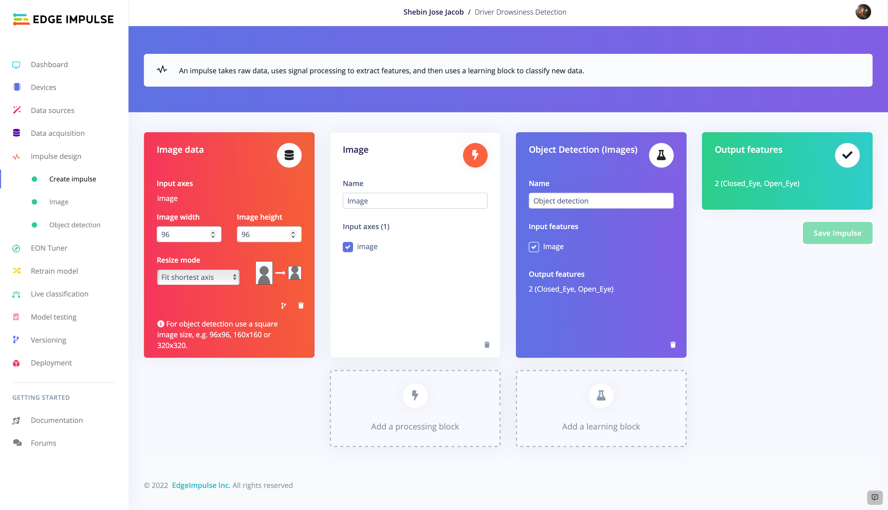

To optimize the performance of FOMO for our use case, we are setting the image dimensions to 96px, as FOMO performs optimally with 96x96 pixel images. To implement FOMO in our project, we are adding an **Image** processing block and an **Object Detection (Images)** learning block to the impulse, with the **Resize Mode** set to **Fit shortest axis**. By leveraging FOMO in conjunction with these blocks, we can effectively detect driver drowsiness in real-time with a high level of accuracy and efficiency.

### 3. Feature Generation

In the next stage of our project, we will focus on generating features. To do this, we will go to the **Image tab** and select the desired color depth. In our case, we have chosen to use **RGB** and now we will initiate the feature generation process.

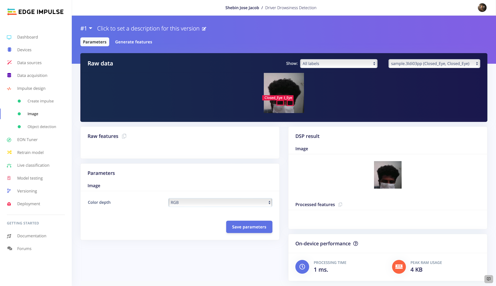

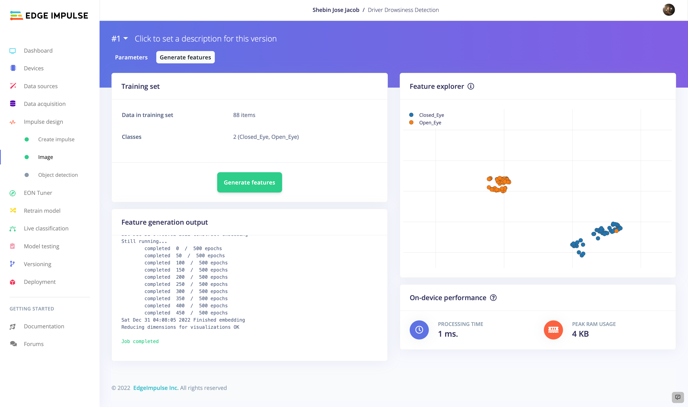

While it is not strictly essential that the generated features be well split, it is generally a good indication that the resulting model will perform well. A well-split set of features typically leads to a model that performs well, as it indicates that there is a clear distinction between the two classes being used. Once the features have been generated, we can move on to the training phase of our project.

### 4. Model Training

With the necessary impulse design complete, we can now move on to the process of training our machine learning model. The specific settings that we have chosen for model training are shown below. It is important to note that these settings can be adjusted in order to improve the accuracy of the trained model, but care must be taken to avoid overfitting.

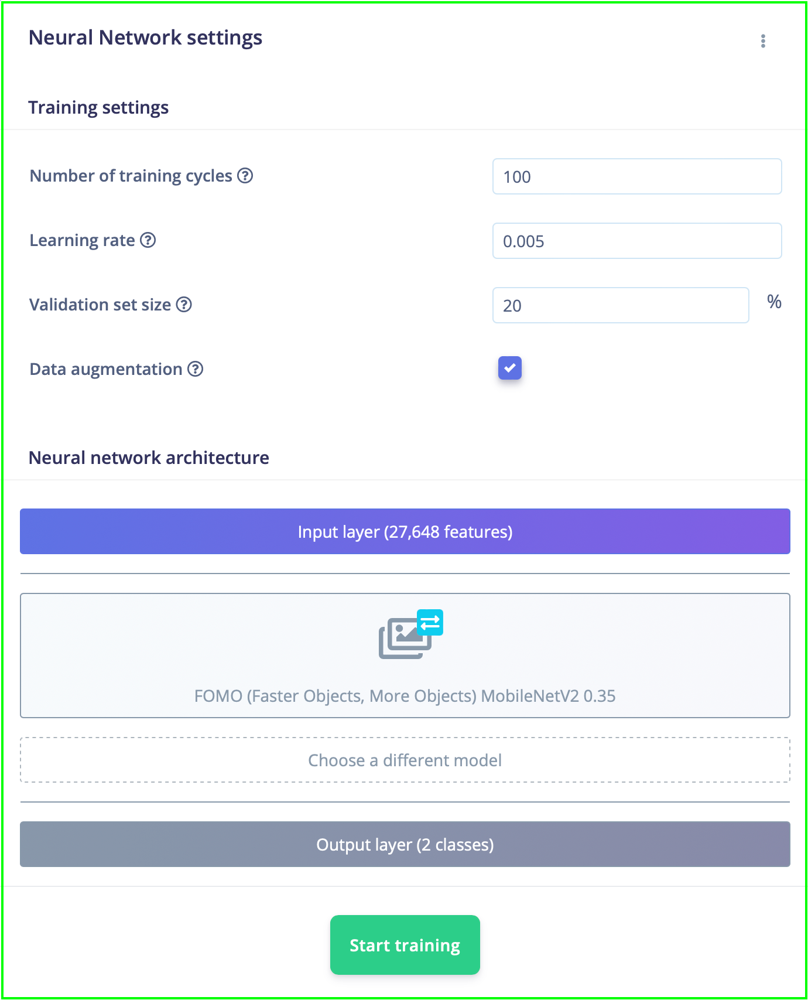

By carefully adjusting the model training settings and employing appropriate techniques to prevent overfitting, we can optimize the performance of our machine learning model and achieve a high level of accuracy. After carefully selecting and preparing a sufficient amount of training data, we have been able to achieve an impressive level of accuracy with our machine learning model. Using the specified training settings, we were able to achieve a training accuracy of 100%, which is a very good result.

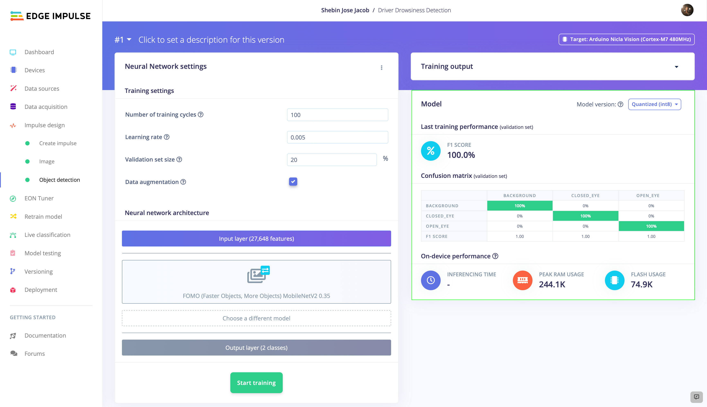

### 5. Model Testing

Now that we have trained our machine learning model, it is time to evaluate its performance on unseen test data. To do this, we will move on to the **Model Testing** tab and use the **Classify All** function. This will allow us to see how well the model performs on the test data and gain insight into its generalization capabilities.

We have got 100% testing accuracy also, which rules out any possibility of overfitting and our model is working very well. It is important to test the performance of a machine learning model on unseen data in order to get a realistic assessment of its capabilities. Testing on the training data alone can lead to over-optimistic results, as the model has already seen and learned from this data. By testing on unseen data, we can more accurately gauge the model's ability to generalize and make predictions on new, unknown input.

### 6. Live Classification

It is now time to move on to the final phase of testing or rather a mock deployment of our machine-learning model. During this phase, we will simulate the use of the model in a real-world setting and evaluate its performance under these conditions. This will allow us to see how well the model performs in a more realistic environment and ensure that it is ready for deployment.

It is now time to proceed to the **Live Classification** tab and acquire a sample from the device. Once we have acquired the sample, we will classify it and observe the results. If our model is able to accurately distinguish between closed and open eyes, we can confidently move forward with deployment.

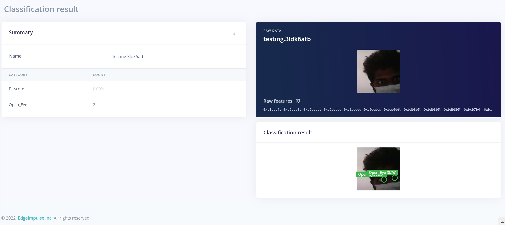

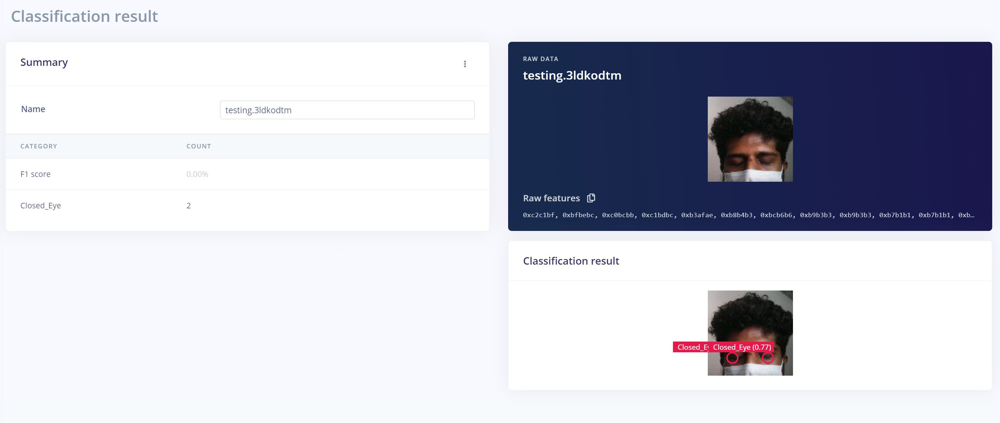

Our machine learning model has demonstrated its capabilities and we are prepared to deploy it in a real-world setting.

## Deployment

In order to deploy our machine-learning model, we will need to create an Arduino library. This library will contain all of the necessary code and resources required to run the model on the Arduino Nicla Vision.

To build the library, we will need to navigate to the **Deployment** tab and follow the steps outlined there. Once we have completed this process, we will have a fully functional library that is ready for use on the Arduino platform. One optional step that we can take is to enable optimizations using the EON Compiler. This compiler is designed to optimize the code in our library, making it faster and more efficient.

Once we have completed the build process, we will be provided with a `.zip` file that contains our model and a set of examples. To use this library on the Arduino platform, we will need to add it to the Arduino Integrated Development Environment (IDE).

To do this, we will need to open the Arduino IDE and navigate to **Sketch > Include Library > Add .ZIP library**. From here, we will be able to browse the zip file that we created earlier and add it to the IDE. Once we have added the library to the Arduino IDE, we will be able to use it to run our machine-learning model on the Arduino platform.

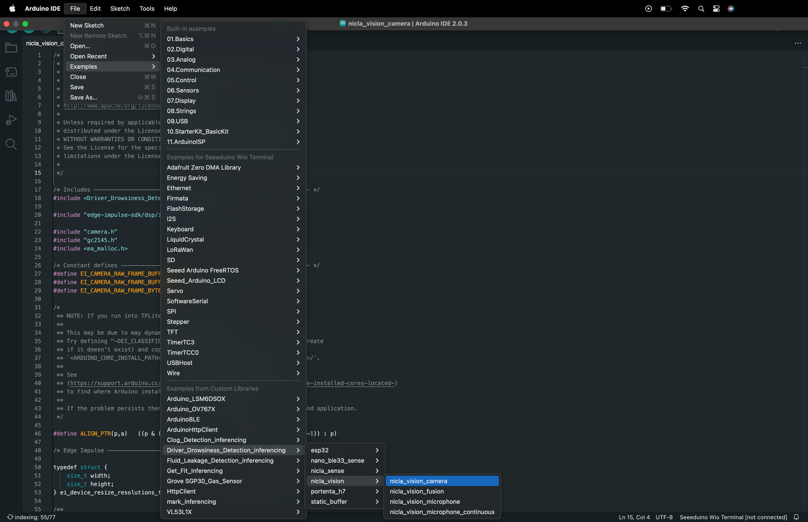

Modify the code located at **File > Examples > Your Project Name > nicla\_vision > nicla\_vision\_camera** incorporating your additions.

## Final Product

After deployment, we developed a device integrating a Nicla Vision, a buzzer, and an LED. The device is enclosed in a neat 3D-printed case which can be easily attached to your car's dashboard.

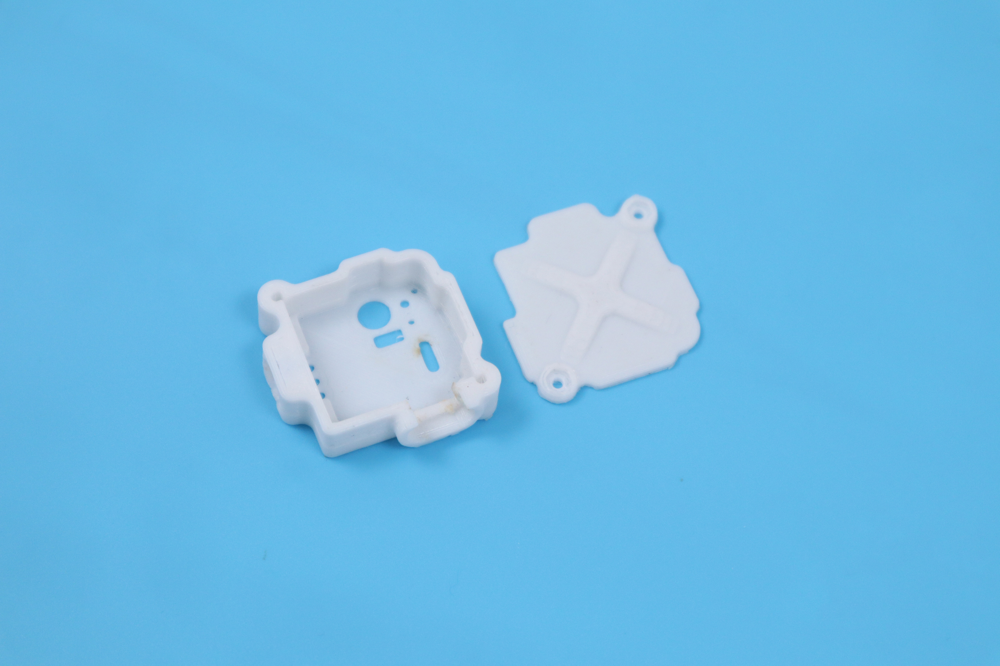

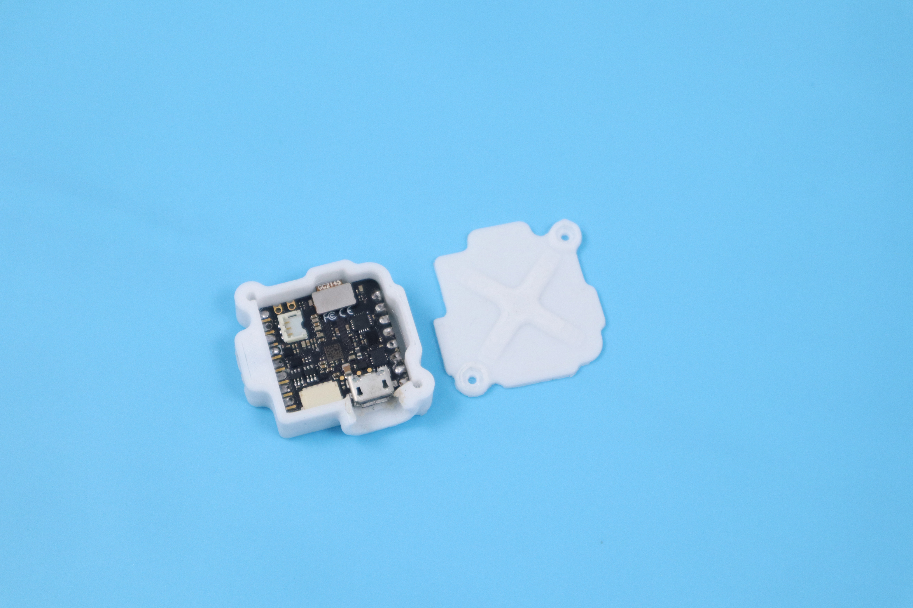

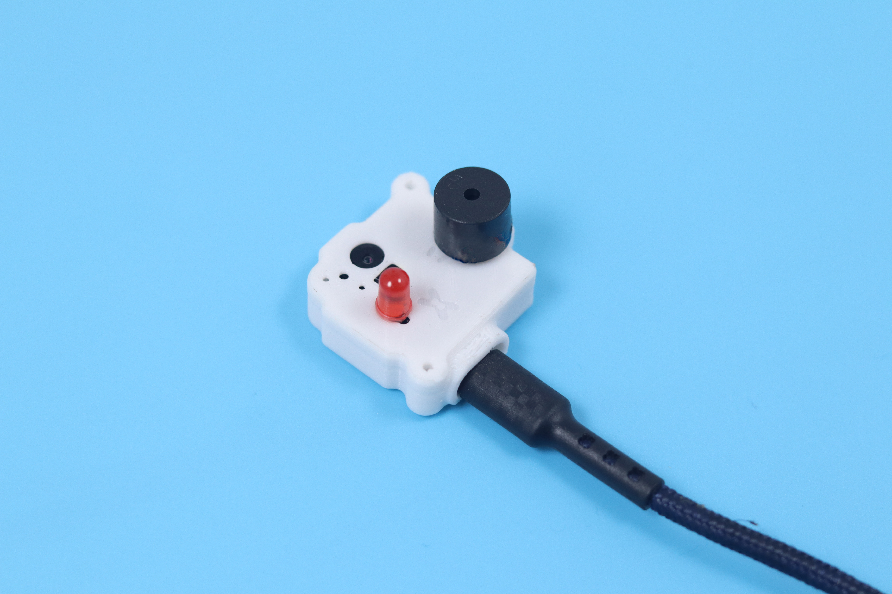

## Code

If you are interested in replicating this project, download the code and other required assets from this [GitHub Repository](https://github.com/CodersCafeTech/Driver-Drowsiness-Detection-With-FOMO).
