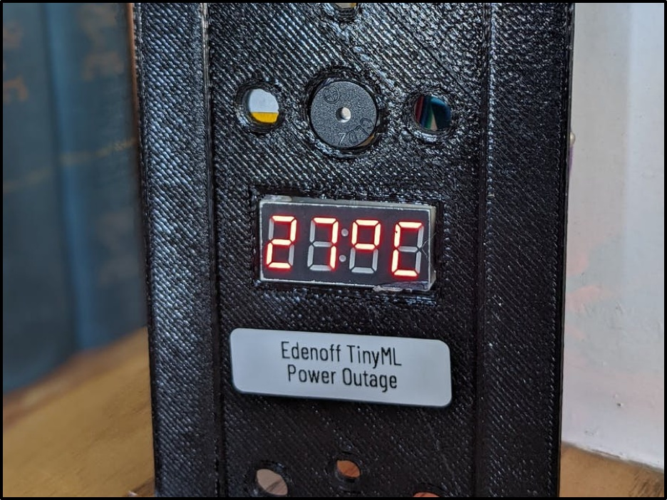
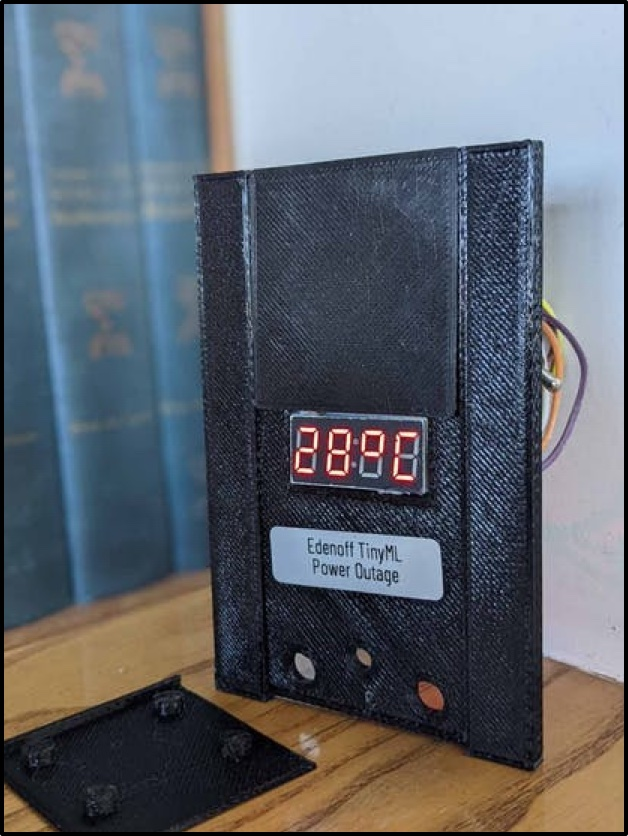
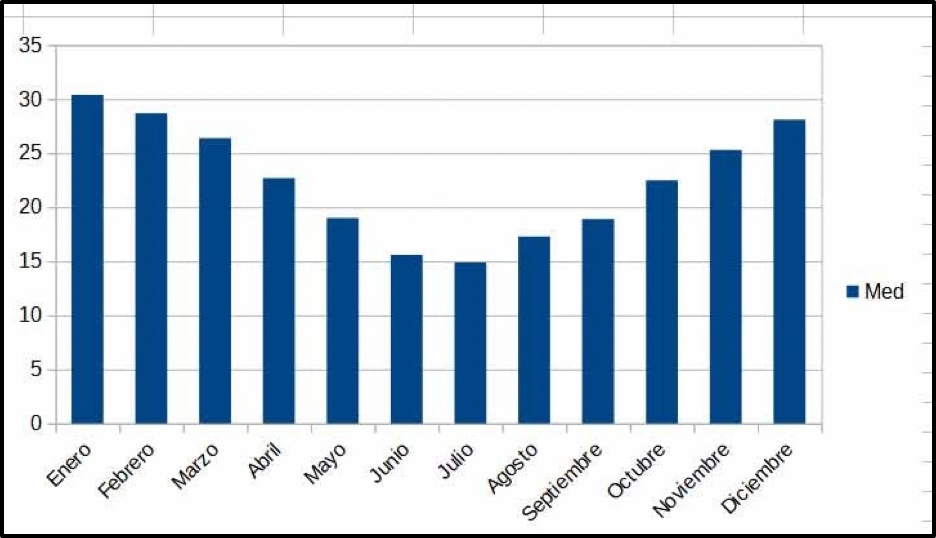
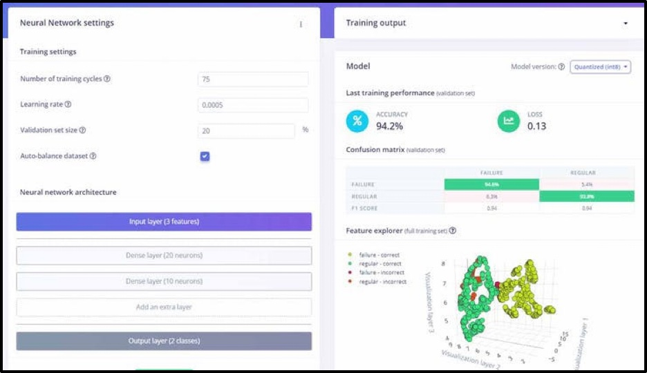
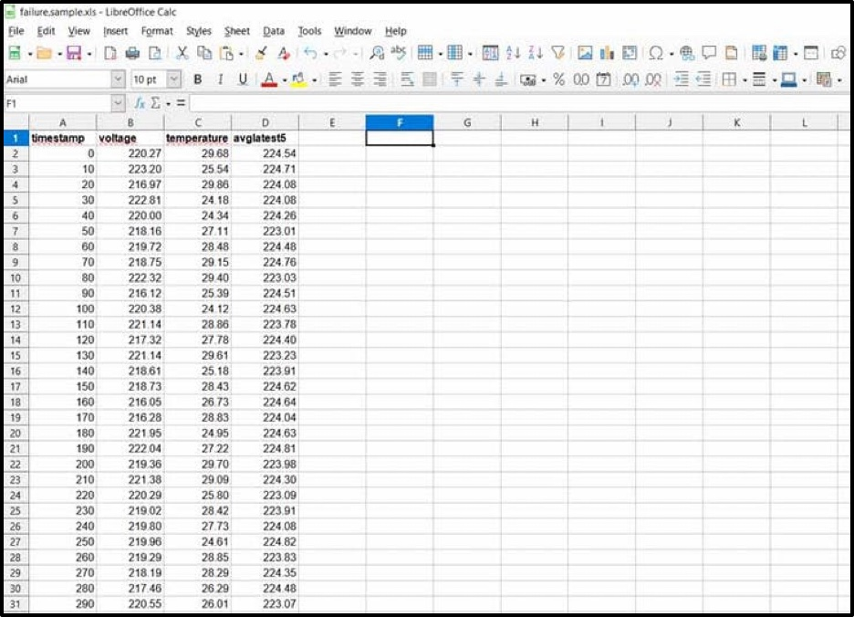
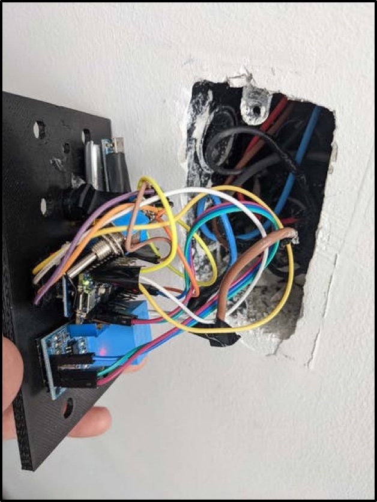

# EdenOff: Anticipate Power Outages with Machine Learning

Created By:
Roni Bandini 

Public Project Link:
[https://studio.edgeimpulse.com/public/90995/latest](https://studio.edgeimpulse.com/public/90995/latest)



## Our Story



With power outages normally occurring in Argentina and other regions of Latin America, we ask the question, “Can a tiny Arduino device placed inside a power outlet anticipate outages using Machine Learning?” On one hand, the Argentinian government says power outages occur due to a lack of private infrastructure investment. On the other, electricity distributors in the area argue that non-discriminated subsidized rates and inadequate regulations are the cause of the power outages. In one case or the other, private companies' production and equipment, which are not  easy to replace or import in Argentina, suffer.

Can we apply Machine Learning to power outages?

This question was the starting point for this project named EdenOff, named after Edenor; one of two power distributors in Buenos Aires. 

What variables could be forwarded to a Machine Learning model to anticipate a power cut? Our answer: temperature. From December through February, there are challenging months in Argentina with peaks of temperature reaching 104 degrees Fahrenheit / 40 degrees celsius resulting in intensive use of air conditioning (AC). Below, Figure 3 depicts the average temperatures in Argentina in these months. 



Another relevant variable is AC reading. AC outlets should be stable at 220 Volts and significant variations usually means trouble.

One of many interesting things about Machine Learning is that we don’t have to determine rules in advance like in standard algorithm based code:

```
if (temperature>X & ACvariation>Y) {alarm=on;}
```

We can just use historical data to train a model and make inferences. That model could be placed into a cheap single-board microcontroller without even an internet connection.

## Model Training



For machine learning (ML) we will use Edge Impulse; a free platform for developers which provides powerful and interesting features that speed up any machine learning project.

Since this prototype does not use Edge Impulse supported sensors, data acquisition will be made separately. 

How can such data be obtained? Data is obtained by power distributors, from auditors, or even from private custom records such as tracking AC variation and temperature to a database. 

The model will be trained with a failure and a regular database with the following labeled columns: timestamp, temperature, voltage, as well as a column with the latest five average AC readings. The purpose of the AC reading column is to detect any recent variations in the service. Figure 5 displays what our failure dataset case looks like.



After a trial and error procedure, Keras (a deep learning API) with 75 training cycles and Neural Network with a 0.0005 learning rate, turned out to be effective. Edge Impulse visual and testing tools were an excellent way to determine whether datasets and training are correct, before starting to code.

Now that we are sure predictions work, we can to export an Arduino-ready library and create the electronics.

## Hardware


 - Arduino Nano BLE 33: powerful board compatible with Edge Impulse TinyML
 - Zmpt101b voltage sensor: to read AC from the outlet
 - 7 Segment 4 digit display
 - Digital Buzzer
 - Female to female jumper wires
 - 3.7v battery
 - Lipo Charger
 
*Note 1: to simplify the project onboard a HTS221 temperature sensor is used, but for a real case scenario an external temperature sensor should be used.*
 
*Note 2: In previous projects, I was asked about using standard Arduino Nano with external sensors. The most important thing about Arduino Nano BLE 33 Sense is not it’s sensors but the processor. You will not be able to replace it with a regular Arduino Nano. If you cannot get BLE 33 Sense, check out the Arduino Portenta H7.*



*Note 3: Zmpt101b voltage sensor requires a setup calibration. You can find a small screw in the board to do that. You may also need to adjust the following function inside the .ino code to obtain reliable voltage readings.*

```
Veff = (((VeffD - 420.76) / -90.24) * -210.2) + 210.2;
```

## Connections

 - Zmpt101b GND and 5V to Arduino GND and 5V. Then signal pin to Arduino A0. AC to screw pins.
 - Display to GND and 5V, D12 and D11
 - Buzzer to GND and D10.
 - Battery to VIN and GND
 
 ## Software
 
 - Install HTS221 library. Even when this is an on board module, the HTS221 library is required. Go to Sketch > Include Library > Manage Libraries > Search HTS221
 - Download this ZIP file > Add vía Sketch > Add Zip.
 - Download the .ino file > load it into Arduino BLE 33 > connect the Arduino using micro USB cable, and upload

Regarding code settings:

**Threesold** is used to compare against **result.classification[ix].value** for failure dataset. See below:

```
float threesold=0.85;
```

**testFail** is used to force a fail message and buzzer for testing purposes on iterations #1, #3, and #5. See below:

```
int testFail=1;
```

If you want to make an average of more than 5 readings, you will have to change the formula. See below:

```
iterationsForAvg=5;
```

## 3D Printed Power Outlet Faceplate


This model was made considering Argentina's power outlet specifications but you can make your own and place the entire prototype inside a power outlet if needed.

Final notes:

Instead of Arduino BLE 33 Sense, Raspberry Pi 4 could be used, temperature could be obtained from the internet along with power distributor's demand data. Several actions could be triggered when a power cut is coming like starting a gas-based generator, alerting employees by Telegram, turning off expensive machines with Linux commands or relays, etc.

This machine learning project covers some points that could be used for other enterprise-related products like third-party sensors, importing CSV datasets, and custom axis for inferences.

