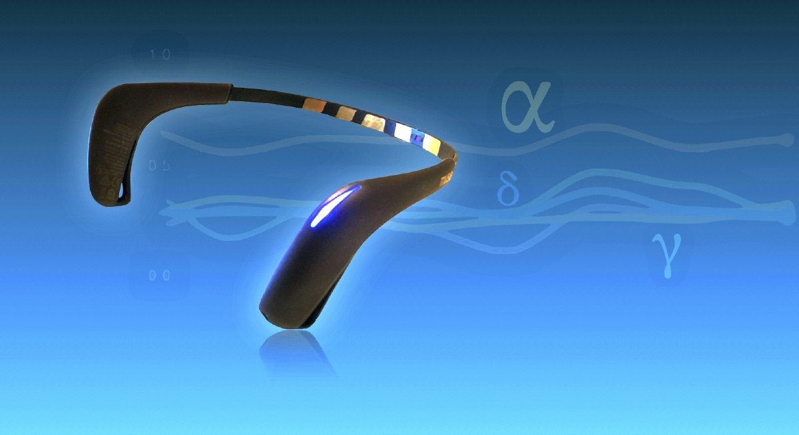
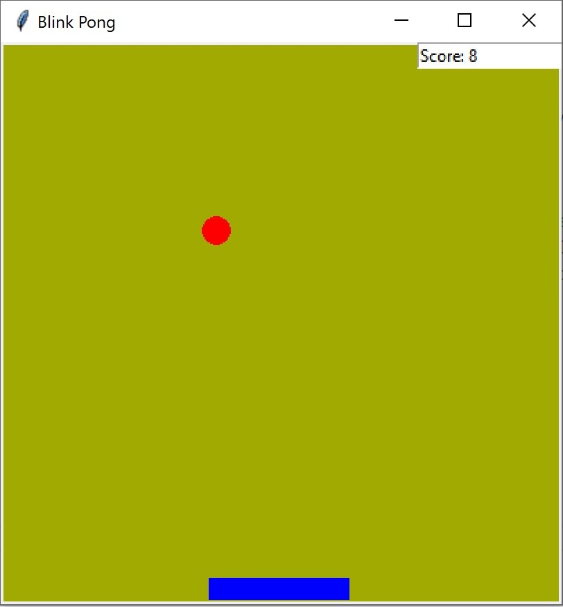
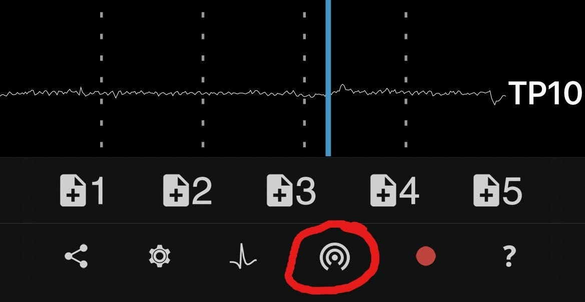
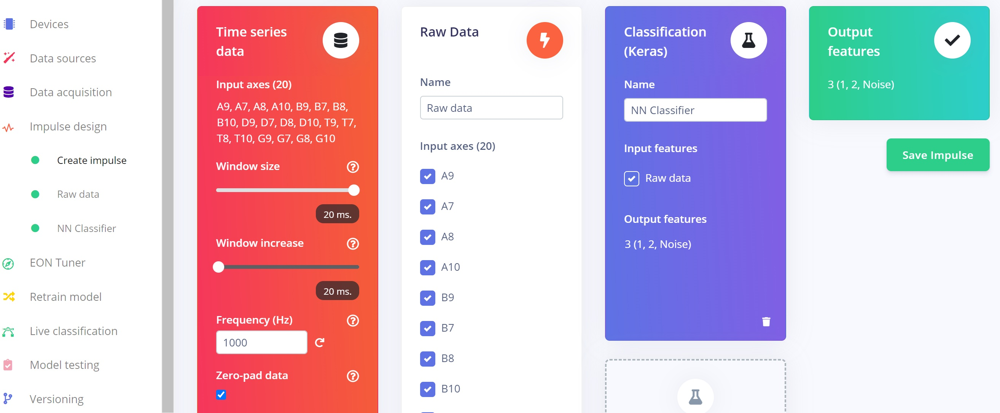
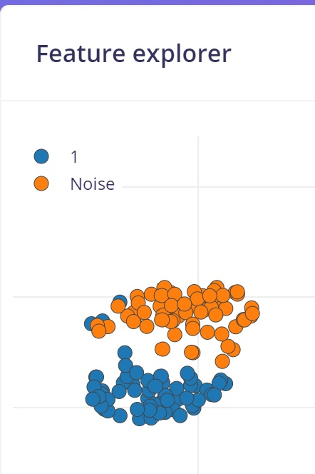
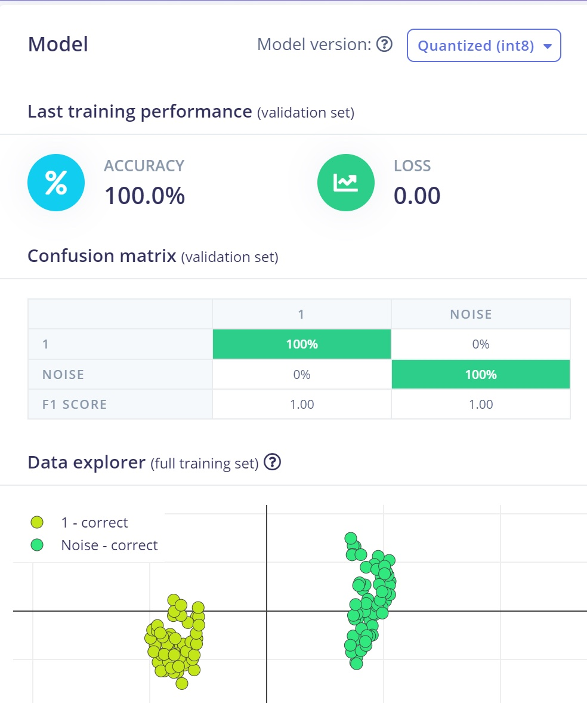
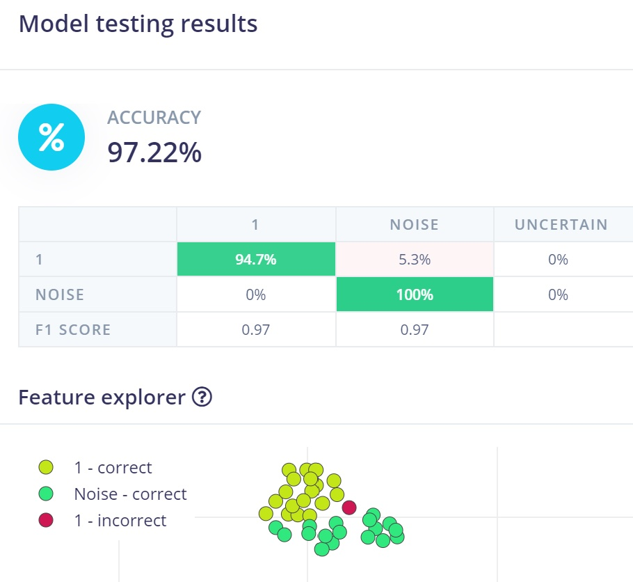

# Using EEG-data and Machine Learning to Control Games 

Created By:
Thomas Vikstrom 

Public Project Link:
[https://studio.edgeimpulse.com/public/136580/latest](https://studio.edgeimpulse.com/public/136580/latest)

## Project Demo



## GitHub Repo

[https://github.com/baljo/Muse-EEG](https://github.com/baljo/Muse-EEG)


## Objective
The objective of this  tutorial is to show how you, by using a Muse EEG-device, can control a simple Pong game just by blinking your eyes.  

## Introduction


As a gentle introduction to the concept of human and machine communication, the first part shows how to use Muse's *built-in* blink detection functionality and the second part shows how you can use Machine Learning (ML) with Edge Impulse (EI) to be able to expand the game. And while this is just playing a simple game by blinking, there is a lot happening in the area of connecting brain and machine. Research in BCI-technology (Brain Computer Interface) has enabled tasks earlier believed impossible to become reality. One example of this is when patients suffering from ALS had a [brain implant inserted](https://www.bloomberg.com/news/articles/2022-07-18/brain-computer-interface-company-implants-new-type-of-device?leadSource=uverify%20wall) into a blood vessel in their brains, and after some training were able to communicate e.g. through WhatsApp messages. 

Once you understand the benefits and limitations of using EEG-data from a consumer-based device, you can yourself step up and try to control external devices like robots by using eye-blinks or perhaps even by thinking!

---------------
## What is EEG?


Electroencephalography, or EEG, is a method to record the electrical activity generated by the brain via electrodes placed on the scalp surface. More detailed information is found e.g. from [(Farnsworth, 2021)](https://imotions.com/blog/what-is-eeg/) or from [Wikipedia](https://en.wikipedia.org/wiki/Electroencephalography).

Professional or clinical EEG-devices are typically equipped with between 16 to 64 high-quality electrodes, and the cost is ~800 - 3000+ USD/EUR. They are mostly intended for research and clinical usage. Consumer-based devices on the other hand have only  a few electrodes, but are much more affordable and are often also easier to use. Their main focus is on meditation and relaxation, but can with some limitations also be used for research (more about this in my [Master's thesis](https://urn.fi/URN:NBN:fi:amk-2022090219806)). 



Muse EEG-devices are focused on consumers and they have four EEG-electrodes, two at the forehead, two behind the ears. In addition they also have an accelerometer/gyroscope, and newer models include a PPG-sensor which  measures blood flow, breathing rhytm, and heart rate. In this tutorial however are  only signals from EEG-electrodes being used.  

---------------
## Prerequisites

To be able to reproduce examples found in this tutorial, you'll need:
 - A Muse EEG-device, any model should work, although Muse-01 (from 2014) streams with 220 Hz instead of 256 Hz and might require a few code changes if you are collecting raw data. They cost around 250 USD/EUR and are manufactured by the Canadian company [Interaxon Inc.](https://choosemuse.com/) 
 -  iPhone or Android phone
 - [Mind Monitor app](https://mind-monitor.com/) for iPhone or Android, one-time cost is ~15 USD/EUR
 - A computer able to run Python + WiFi
	 - only PC/Win10 tested although Mac and Linux computers are expected to work
 - Python 3.x  

---------------
## Data flow

The data flow for both Part 1 and Part 2 is:
**Your brain &rarr; Muse &rarr; Bluetooth &rarr; Phone/Mind Monitor &rarr; WiFi &rarr; Computer**  

---------------
## Preparations
**Python modules**

 - Install Python-OSC and Tkinter from a command prompt with `pip install python-osc` and `pip install tk`
 - For Part 2 you'll also need Tensorflow, install it with `pip install tensorflow`
 - The [code repository](https://github.com/baljo/Muse-EEG) (MIT-license) might later include other EEG- and ML-related programs as well.

**Mind Monitor settings**

 - `OSC Stream Target IP`: here you should add your computer's local IP-address, on Win10 you can run `ipconfig` in a command prompt to find it, often starts with 192.168.x.x
 - `OSC Stream Port`: set to `5000`

**Computer**

 - You might need to allow the computer's firewall to allow traffic through port 5000.  

---------------
## Part 1 - play Pong by blinking, no ML involved



In this first part you will learn how to control a Pong game just by blinking your eyes.
A short video of the Pong game is available [here](https://youtu.be/lKLFVqofdu8).

### How does it work?

As mentioned earlier, this version is not using machine learning at all. Instead it is relying on built-in functionality in the Muse EEG-devices that can detect eye blinks and jaw clenches. These events produce distinct EEG-signals which can also be seen in the Mind Monitor graphs. The Pong game is then scanning for the events and reacting on them.

### Installation

 - Download the Python [code](https://github.com/baljo/Muse-EEG/blob/main/Blink%20Pong%20without%20ML.py)
 - Run the game from your favourite IDE or from the command prompt with `python "Blink Pong without ML.py"`

 ## Game play instructions
 - See [Game play instructions, common for both Part 1 and Part 2](https://github.com/baljo/Muse-EEG/blob/main/Project1.md#game-play-instructions-common-for-both-part-1-and-part-2)  
 

---------------
## Part 2 - play Pong by blinking, using ML

### How does it work?

In short, you will here need to collect EEG-data (blinks and non-blinks) from your Muse device, and train a ML model in Edge Impulse. The trained model will then be used in the Pong game which otherwise functions as in Part 1.

### Process flow

While this is not as complex as brain surgery (:smirk:), it is still a bit more involved than Part 1. The main steps are listed here and will later on be explained in detail.
1. Collect EEG-data for the events you want to classify, one event being e.g. eye blinks and another background brain "noise"
2. Create a project in Edge Impulse and upload the EEG-data to it
3. Create, train, and test a ML-model in EI
4. Download the trained Tensorflow ML-model to your computer
5. Plug the model into your game and test it
6. Rinse and repeat from 1 as you'll probably need more data.

### Installation

 - Download the following Python programs into a folder you remember
	- [Collect OSC-data.py](https://github.com/baljo/Muse-EEG/blob/main/Collect%20OSC-data.py) which you will use for collecting data
	- [Blink Pong with ML](https://github.com/baljo/Muse-EEG/blob/main/Blink%20Pong%20with%20ML.py) which is the game itself

### Detailed instructions

In this chapter you will get detailed instructions from start to end how to collect data, train a model, and test it in practice. While not necessarily every click and detail is listed, you should with normal computer proficiency be able to follow and replicate the steps.

**0. Connect Muse and start streaming**

 - Connect the Muse EEG-device to your phone



 - Wait until the horseshoe in MindMonitor has disappeared and the graph lines for all sensors have calmed down like in the picture. You might need to wait a few minutes to acquire good signals, but it's possible to speed up the process a bit by moisturing the sensors with e.g. a wet finger. 
 - Start streaming from Mind Monitor by clicking on the button showed in the picture

 **1. Collect EEG-data**

 In this step you will, using a Python-program, collect data from your Muse EEG-device.

 - Run `Collect OSC-data.py` from your favourite IDE or from the command prompt with `python "Collect OSC-data.py"`
	- Default events being recorded are `1` and `Noise`, both for 2 seconds. If you want, you can later change them or add more events in the code, look for this:
		```
		rec_dict = {
		"1" : 2,
		"Noise" : 2
		}
		```
- To start recording events, click on #1 in MindMonitor (see picture above).
- You will in the terminal window see number `1` for 2 seconds. During this time you should blink once.
- Next time you'll see `Noise` for 2 seconds. During this time you should **not** blink, just relax. 
- The program will record each event in a separate CSV-file. So if you've blinked 100 times and created brain noise 100 times, you'll end up with 200 files of 2 seconds each. 
- It is necessarily not easy to concentrate for a long time, so you are recommended to take a break every now and then. Based on experience, it is also good to remove the EEG-device when not recording and, if you have a longer break, turn it off to save battery. Additionally, next time you use your device it will inevitable be in a slightly different place on your head, and as a result you will probably get a more robust ML-model when recording data.  

**2. Create a project and upload EEG-data to Edge Impulse**
- Head over to [Edge Impulse](https://www.edgeimpulse.com/). If you are new to EI, you are recommended to take a look at their great [Getting started](https://docs.edgeimpulse.com/docs/) instructions.
	- Create a project
	- Select `Data acquisition` and click the icon labeled `Upload existing data`
	- Use default settings
	- Upload the files you've recorded in the previous step.   

**3. Create a model, train, and test it**

In this section you will first create a ML-model, then train it, and finally test it. This can be most rewarding in case you get excellent performance the first time, but if not, then you need to find out how to improve the model. Hint: ML eats data for breakfast, lunch, and dinner :smiley:

**Create a model**
- Click `Create an impulse` and fill in the `Time series data` as shown in the picture. While the length of the samples are in fact 2000 ms (= 2 seconds), I've found that using 20 ms (as in 20 lines for each sample) works at least as good.
- Add the processing block `Raw data` and let all axes be checkmarked. You can later try to find which axes do not impact much or at all for your model and uncheck them, but then you also need to modify the line `expected_samples = 20` in `Blink Pong with ML.py` accordingly. This is explained more detailed in the code itself.
- Add the learning block `Classification (Keras)`, in this tutorial you will have only 2 output features: `1` and `Noise`, but if you want to create an event for double blinks, feel free to record events with e.g. `2` as well, like in the picture.



- Click `Save impulse` and `Raw data` on the left hand menu
	- You will see a graph of one of the samples as well as the raw features.



- In this case you don't need to change anything, so click `Save parameters` which will take you to the second tab.

- Click `Generate features`
	- This processes the samples
	- After a while you will see a graph in the Feature explorer. This gives you a view of how well your data can be clustered into different groups. In an ideal situation all similar samples would be clustered into same group with a clear distinction between groups. If that's not the case, no worries at this point, the neural network algorithm will in many cases still be able to do a very good job!

**Train the neural network**

Here you will train the neural network and analyse its performance.



- Click `NN Classifier` from the left hand menu

- Change the `Number of training cycles` to 200. This is another parameter to tweak, the higher this number is, the longer time the training will take, but also the better the network will perform, at least until it can't improve anymore.
- Click on `Start training`
	- Within a few minutes, depending on the number of labels and data quantity you have, the training will finish.
- The graph shows the training performance and accuracy. While 100 % looks like a perfect score, it isn't necessary so. The reason is that the network might perform poorly in real situations when confronted with sample data not seen before.  

**Test the model in Edge Impulse**

In this step you will see how well the model performs with data it has not seen before. For this purpose Edge Impulse put away approx. 20 % of the training data when you uploaded it.



- Click on `Model testing` in the menu
- Click on `Classify all`
	- This will run the test samples through the trained model
- After just a short while, depending on the amount of test samples and model complexity, you will get a performance report. Unless you have lots of data or a perfect model, the performance is seldom 100 %. Depending on your use case and what performance you require, you might need to go back a few steps by collecting more and different data, or by tweaking the parameters, to reach your minimum expectations.    

**4. Download the trained Tensorflow ML-model to your computer**

Here you will download the trained model to your computer.
- Click `Dashboard` from the left hand menu
- Scroll down to the section `Download block output` and click on the icon next to `NN Classifier model	TensorFlow Lite (float32)`
- Save the file to a folder of your choice (and which you remember as you'll need it soon!)
	- The file will get the name `ei-[ your project name ]-nn-classifier-tensorflow-lite-float32-model.lite`. Although you can rename it if you really want to, why not save your brain cells to more important stuff :smirk:  

**5. Plug the model into your game and test it**

Here you will deploy your model and test it out in the wild real world!

**Deploy your model**

- Copy or move the file from the previous step to the folder where you put your Python programs.
- Open `Blink Pong with ML.py` with your favourite IDE or a text file editor like Notepad
	- Scroll to the first function `initiate_tf` and locate the line with `lite_file = "ei-.......lite"`
	- Replace the file name after ` = ` with your own file name, remember the double quotes `" "` and `.lite` at the end

**Test!**

This can be the most rewarding - or most frustrating - phase in the whole process as you'll find out how well you can control the game with your blinks.
 - Run the game from your favourite IDE or from the command prompt with `python "Blink Pong with ML.py"`  
 - To play, see [Game play instructions, common for both Part 1 and Part 2](https://github.com/baljo/Muse-EEG/blob/main/Project1.md#game-play-instructions-common-for-both-part-1-and-part-2)  
 - Please note the following:
 	- The model explained in this tutorial is based on 2 second long samples. This also means that the Pong game will collect EEG-data for 2 seconds before trying to classify it. When playing the Pong game, the ball might have travelled too far before your blinks have moved the paddle to the desired place.
		- The function `pong` towards the end of the program includes a variable `ball_speed = 5` where you can change the ball speed.
		- By unchecking some of the axes in the `Create an impulse` step, you will also reduce the data needing processing and the time it takes. As earlier mentioned, and as also explained in the code itself, you then need to change the variable `expected_samples` from 20 to something else. If you e.g. reduce the axes from 20 to 10, you would put 10 in this variable.
	- In the [Github repo](https://github.com/baljo/Muse-EEG/tree/main/Models) you'll find a `.lite`-file trained by the author. You can try the game using this, without the need to record own EEG-data, but don't be surprised if it doesn't give good results, brains tend to be different...

---------------
## Game play instructions, common for both Part 1 and Part 2

 - Connect the Muse EEG-device to your phone
 - Start streaming from Mind Monitor by clicking on the button shown in the picture
 


 - The objective of the game is to prevent the ball hitting the floor by moving the paddle.
 - You control the paddle by blinking
	 - Blink once to move the paddle in one direction
	 - Next blink will stop the paddle
	 - Next blink will move the paddle in the other direction
 - The score increases when you manage to hit the ball and decreases when you fail.
 - An intermittent message is shown whenever you blink or clench your jaw. Note that jaw clenches are  only available in Part 1, and they are not linked to any action in the game, that is left up to you to implement!  

---------------
## Final Comments

That's it! Hopefully you were successful in training and recognising eye blinks with your EEG-device. Hopefully it also inspires you to try to improve the performance, e.g. by collecting more samples, by collecting more event types or by tweaking the different parameters and settings in Edge Impulse. And finally, when you have understood the possibilities and limitations with a consumer-based EEG-device, why not challenge yourself with something more advanced than the Pong-game!

<div style="text-align: right"> <em>All images are either the author's own or from Wikimedia Commons</em> </div>
