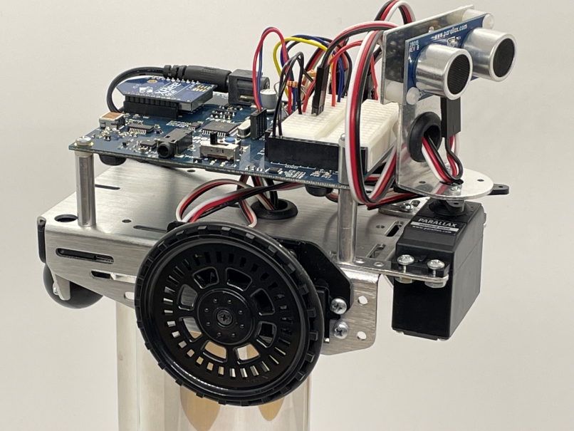
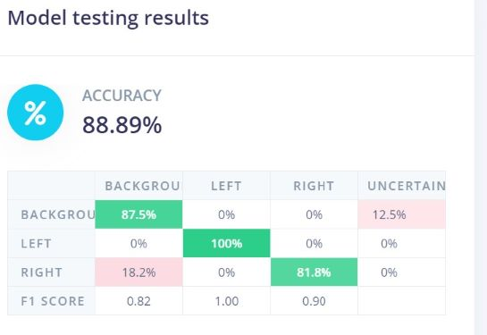
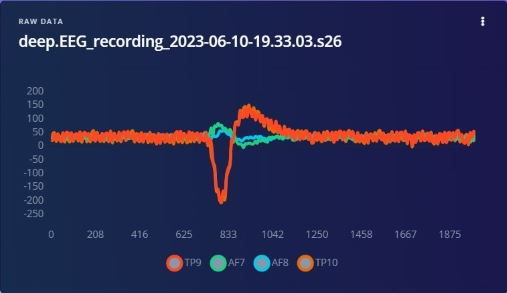
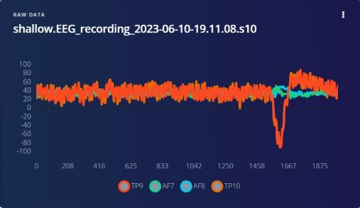
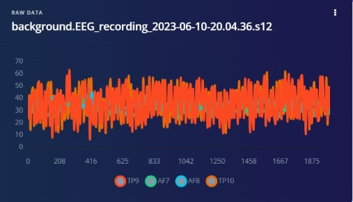

# Using EEG Data and Machine Learning to Navigate a Robot

Created By:
Thomas Vikstrom 

Public Project Link:
[https://studio.edgeimpulse.com/public/134934/latest](https://studio.edgeimpulse.com/public/134934/latest)

## Project Demo



## GitHub Repo

[https://github.com/baljo/Muse-EEG](https://github.com/baljo/Muse-EEG)

## Introduction

This third and final tutorial in the series about Machine Learning (ML) and EEG-data, walks through how you can control a small mobile robot purely with your brain waves! This concept can be used for entertainment purposes, but might also make a big difference for persons unable to use any other method to control external devices such as wheelchairs, televisions, etc.

While this is a stand-alone tutorial, it is still recommended you check [Part 1](https://docs.edgeimpulse.com/experts/prototype-and-concept-projects/eeg-data-machine-learning-part-1) and [Part 2](https://docs.edgeimpulse.com/experts/prototype-and-concept-projects/eeg-data-machine-learning-part-2) in the series for background information.



## Use-case Explanation

The previous two tutorials showed how you, using EEG-data from a consumer EEG-device, can play simple games or use a computer to communicate with the outer world. This tutorial takes it one step further, showing how you can control a small mobile robot, again by the small electric signals your brain emits. Possible users for this type of solution might be people having none or only limited capabilities to move their limbs (but still have "normal" brain functionality), to control physical devices such as wheelchairs, doors, window blinds, televisions etc. In the video this technology is simply used to bring a cold drink to me.

Previously I used a setup with several devices involved: `EEG-device ==> Mobile Phone (MindMonitor/PythonOSC) ==> Wi-Fi ==> Computer`, and while it worked well enough, I discovered that using the same concept when introducing yet an additional device (appending `==> Wi-Fi ==> Mobile Robot` in the equation) caused more latency. In practice this resulted in undesirable delays between the desired action and the action performed. For example, when trying to turn the robot left, the left turn sometimes happened unacceptably late, and it was difficult to understand if it was a misinterpration of the EEG-data, or something else. 

Due to this behavior, and that I wanted to simplify the setup, I explored if it was possible to get rid of the phone in the equation, thus having this setup `EEG-device ==> Computer ==>  Wi-Fi ==> Mobile Robot`. The phone though used MindMonitor and  PythonOSC to communicate with the computer, but also automatically reduced the raw data to spectral bands, so I had to find a way to replace both the technical communication as well as the spectral functionality. The communication challenge got solved by using the Lab Streaming Layer (LSL) protocol, and the spectral challenge by Edge Impulse helping me to use their Python-code for extracting spectral features. Through this I was successful in removing the phone and getting almost no extra delay at all!

The hardware used in this project was a Parallax ActivityBot, equipped with XBee Wi-Fi and a Parallax Ping))) Ultrasonic distance sensor. While more or less any Wi-Fi equipped robot - mobile or not - can be used, I've found the Parallax product line to be very reliable and easy to work with. The microcontroller on the robot is a Propeller P1 processor with 8 separate cores and a shared RAM-memory, which is more than enough for this quite simple use case.

## Components and Hardware/Software Configuration

### Components Needed

- [Interaxon Muse EEG-device](https://choosemuse.com/pages/shop), any "recent" model, my device is from 2018
- [Parallax Activitybot kit](https://www.parallax.com/product/activitybot-360-robot-kit/)
- [PING))) Ultrasonic Distance Sensor](https://www.parallax.com/product/ping-ultrasonic-distance-sensor/) or [LaserPING 2m Rangefinder](https://www.parallax.com/product/laserping-2m-rangefinder/)
    - Note: the distance sensor is not strictly needed for this project, it is only used to reverse the robot in case it comes too close to a hinder, but I still recommend to have a distance sensor for other robot projects
- [Parallax WX ESP8266 WiFi Module – DIP](https://www.parallax.com/product/parallax-wx-esp8266-wifi-module-dip/)
- Computer: Windows, Mac, Linux, even a Raspberry Pi might work. Only tested on Windows 10.

Please note that the components I've used are several years old, and have been replaced with the newer versions linked above. Due to this there's a possibility you'll have to adjust some of the configuration settings, this is of course even more applicable if you use any other brand than Parallax.


### Hardware Configuration

- Assemble the robot, possible distance sensor, and Wi-Fi module according to the instructions distributed py Parallax.
- Before trying to replicate this project, familiarize yourself with the robot and how to program it. An excellent starting point is the [Parallax educational site](https://learn.parallax.com/).

### Software Configuration

- The robot in this project is programmed using [SimpleIDE](https://learn.parallax.com/tutorials/language/propeller-c/propeller-c-set-simpleide), which is an open source programming tool for Propeller C. SimpleIDE is no longer maintained, but was still possible to install and use on Win10 when this tutorial was written (June 2023).
    - You can also use any other language that the Propeller processor family supports as long as you find libraries for the Wi-Fi and distance sensor modules.
    - The program controlling the robot in this project is by purpose very simple, it is just receiving a control code and a direction code (2 bytes) through Wi-Fi and taking actions on the direction code. This makes it easy to adjust for other brands or other type of robots.
    - Using SimpleIDE, compile and upload [this program](https://github.com/baljo/EEG-Robot/blob/main/Code/EEG-Robot%20-%20receiver%20side.c) to the robot.
        - You'll need to match pin and Wi-Fi settings with your own setup, check the code for pointers
- Computer
    - Python 3.x, I've used v3.11
        - install following Python libraries: tensorflow, muselsl (only used when recording data), pylsl, numpy, nltk, socket, spectral_analysis (this is found from [Edge Impulse GitHub](https://github.com/edgeimpulse/processing-blocks/tree/master/spectral_analysis))
        - download the [Python program](https://github.com/baljo/EEG-Robot/blob/main/Code/EEG-robot.py) for communicating with the EEG-device and with the robot
        - around row 13 you'll find the configuration for your XBee IP-address, change this to what your robot's Wi-Fi device is using
        
            ```
                # Network initiation
                ip='192.168.XXX.YYY'          # Enter IP of your Xbee
                p=9750                        # Enter the port number for your Xbee
            ```
    
- BlueMuse or other software able to stream data from Muse EEG headsets via LSL (Lab Streaming Layer)

## Data Collection Process

In this project I started with the aim of collecting data mainly stemming from the motor cortex in our brains. Thus I collected data when **trying** to move my left hand, when **trying** to move my right hand, and when relaxing. I did though not move any limbs at all, neither did I blink, thus simulating I was paralyzed. I got an accuracy of 88% as testing result in Edge Impulse, which for this type of project is surprisingly good. 



But as sometimes also happened with the previous two EEG-projects, I found the accuracy in real life to be only satisfactory, and especially inconsistent with sometimes a very good repeatability, sometimes nothing worked at all. While the reasons for this inconsistent behaviour are not completely clear to me, I later discovered that the place where I usually tested (favorite sofa corner), is affected by electric and/or radio interference. Dependeding on how I sat, the interference could vary between almost nothing, to a small 'hurricane'. With the previous two projects I used the MindMonitor mobile phone app to secure good signal quality, but as the phone was taken out of the setup in this third project I did at first not think about checking the signal quality. I also believe the MindMonitor app is filtering out some of the interference before compiling the data, so with hindsight this is something I should have thought to do in the Python code. Best is of course to try to minimize external interference by going outdoors...while still using Wi-Fi.

With the above mentioned inconsistencies, I decided to simplify the approach and go back to using eye blinks as they create significant and also visible peaks in the EEG-data. Thus I started to record 30 seconds of data chunks when blinking normally (approx. once per 2 seconds), and similarly when blinking 'harder', almost squeezing my eyes. The normal blinks I labeled 'shallow', the hard blinks 'deep'. Additionally I recorded data when not blinking at all, this serves as a background class. Initially I also recorded data with 'double blinks', i.e. two consecutive blinks, with the aim of using them to signal the robot to stop moving. As it was difficult to secure that both blinks fit in same 2 second window, I scrapped that idea.

### Record Data

Connect your Muse device to your computer, start BlueMuse, and use this MuseLSL command from a command prompt:
- `muselsl record --duration 60`
    - This records EEG-data to a CSV-file, in this case for 60 seconds.
    - During this time you should try to blink approximately once per two seconds, as long as you collect many minutes of data in total, it's not a big deal if you blink a bit more frequent. It's anyhow better to sometimes have two blinks in the same 2 second window instead of having none at all, as the latter might be confused with the background class where you are not supposed to blink at all.
- Rename the CSV-files to e.g. `left.<original file name>.csv` for the 'shallow' blinks, `right.<original file name>.csv` for the 'deep' blinks, and `background.<original file name>.csv` for the background class without blinks.
- Start with a smaller amount of data, a minute or so per class, and after you've trained the model add more data. In this project I have only 6 minutes of data, but if I would strive for perfection I'd double or triple this amount.

#### Deep Eye Blinks



#### Normal Eye Blinks



#### Background Noise (no blinks) 



### Upload to Edge Impulse

Use Edge Impulse's CSV Wizard to configure the CSV-file import. This wizard walks you through the process by using one of your recorded files as an example, so it's very easy and straightforward to use. As mentioned before, I've myself used samples of 2 seconds each, and blinked accordingly, but feel free to experiment with smaller or larger samples. Keep in mind though that the larger the sample window is, the longer it will take before the intended action (turn left or right) is taken. You probably don't want to wait 10 seconds after you've asked the robot to turn left before it finally turns!


## Training and Building the Model

### Creating an Impulse

Again, this is quite straightforward in Edge Impulse, you need to create an Impulse by selecting a few parameters. In this project I experimented with a few alternatives, with and without sliding windows, but found out that a sample window of 2 seconds, using Spectral Analysis as processing block, and Classification as learning block was optimal. As there are in practice no memory or latency constraints when using a computer compared to using a microcontroller, there's no need to try to optimize memory usage or processing time.


### Configuring Spectral Features

The following configuration is what I found to be optimal for this use case. Whenever you change any of these, do remember to change the same setting in the Python program as well.
- Click on `Save parameters` and in next screen `Generate features`.


### Training the Model

After some experimentation I found the optimal Neural network settings to be 2 dense layers of 20 and 40 neurons each, with a dropout rate of 0.25 to reduce the risk of overfitting the model exactly to the underlying data. As a computer later will run inferencing, there's no need to create an Int8 quantized model. As the results show, the training performance in this case is 100 %.


### Testing the Model

Before deploying the model to the target device, it is strongly recommended that you test it with data it has not seen before. This is where you use the `Model testing` functionality in Edge Impulse. For this purpose Edge Impulse puts by default approximately 20% of the data aside. Just click on `Classify all` to start the testing.

In this project the test results were quite good with an accuracy of 88%, so I decided this was good enough to start testing the model in practice. If this were a project to be deployed to end users, the accuracy would probably need to be much higher.


## Model Deployment

First part is in this case extremely simple, just head over to `Dashboard` and download the `TensorFlow Lite (float32)` model. This model file should be copied to same directory as where the Python program is.


Second part is to check the Python program (EEG-robot.py) and ensure you have correct configuration:
- Around row 82 you'll find the below code, change the model_path to the exact name of the file you just downloaded
    ```
    # Load the TensorFlow Lite model
    model_path = "ei-muse-eeg-robot-blinks-classifier-tensorflow-lite-float32-model (1).lite"
    ```
- Start the robot, the first time without providing power to the wheel servos, once you have established communication you can provide power to the servos.
- Run the Python program, as this project is all about controlling an external robot, there's no fancy UI. What though will be shown in the terminal window is the result of the inference, i.e. left, right, or background. Remember, left is a 'normal' blink, right is a 'deep' blink, and background is no blinks at all (= the robot moves straight forward).
- If everything works as it should (which it sometimes does even the first time), you can now control your robot by blinking!
    - As there are several devices, programs, libraries etc. involved, there's of course a risk that you'll end up having problems, mainly with device communication or with the model accuracy. As this is neither rocket science or brain surgery, just troubleshoot each issue methodically.

## Results

The results from this project were initially a bit disappointing due to the inconsistencies I could not understand the reasons for. As mentioned earlier I needed to lower my ambition level and use blinks instead of hand movement tries. Still, even then the accuracy was sometimes unexpectedly low. First when I discovered that one major culprit was interference, and I found an exact sweet spot where to sit, I was able to achieve good results in a real setting. Now I believe that my initial goal might be easier to achieve when I know how to reduce interference.

When trying to control a physical robot, you most probably want to look what it's doing or where it's going. This action, i.e. watching the robot, was though in my case a bit different than when collecting blinks where I only focused my eyes on the computer screen. In practice I noticed that this difference caused some misclassifications when I sat on the floor and watched the robot. A lesson learned from this is to record blinks in different settings and positions to improve the accuracy. Still, the accuracy was good enough so I could control the robot to give me a well deserved cold beverage!


## Conclusion

The goal of this tutorial was to show how to control a mobile robot using brain waves, and despite the few pitfalls on the road, the goal was achieved. To scale up from this proof of concept level, one would need to take measures to minimize or mitigate electric and radio interference, physically and/or by filtering it out in the software. The physical device being controlled, in this case a mobile robot, also needs to have fail-safe modes so it does not harm others or itself. I actually tried to implement logic on the robot so it would stop if the communication was interupted for a few seconds, but I was not able to get it working reliably. In addition, it would be nice to have a few more commands available, e.g. double-blinking for stopping or starting the robot, triple-blinking for reversing etc. Technically this is quite easy, the major work needs to be done in designing the ML-model and collecting data.

This ends - at least for now - the tutorial series of applying machine learning to EEG data. While not everything has gone according to initial plans, there has been way more successes than failures. Most satisfying was everything I've learned on the way, and most surprising learning that this concept even is possible with a consumer EEG-device! Luckily I did not listen to one professor telling me it is probably not possible to successfully classify brain waves from the motor cortex with this type of EEG-device!


