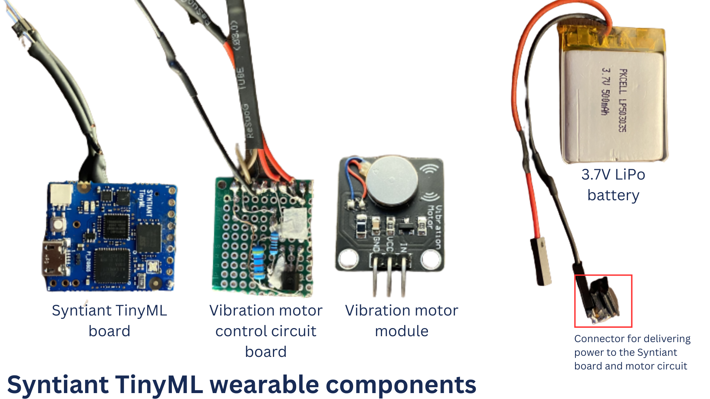
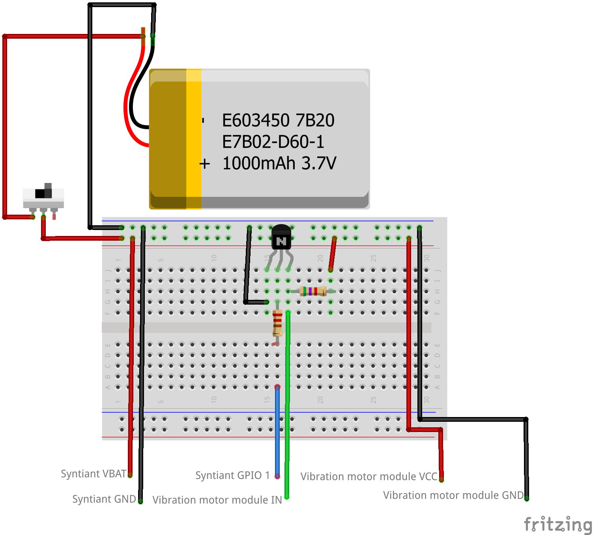
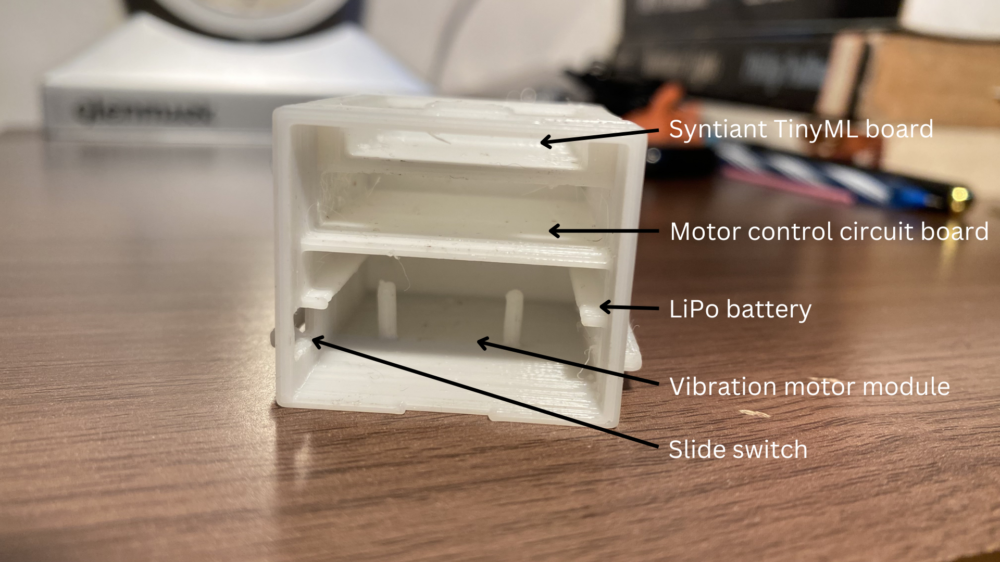
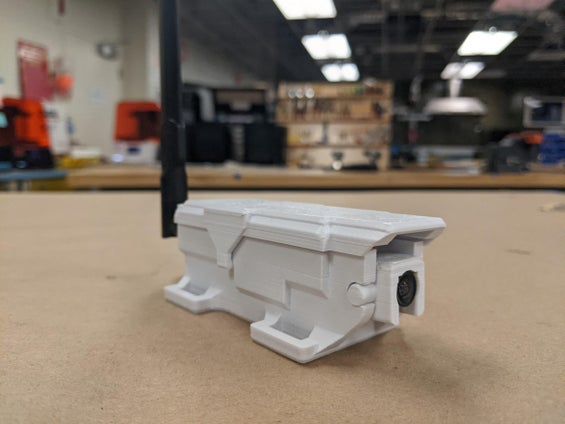

# Environmental Audio Monitoring Wearable with Syntiant TinyML Board - Part 2

Created By:
Solomon Githu 

Public Project Link:
[https://studio.edgeimpulse.com/public/171255/latest](https://studio.edgeimpulse.com/public/171255/latest)

## Overview

In [Part 1 of this project](https://www.edgeimpulse.com/blog/now-hear-this), I demonstrated why wearable technology is on the rise and how TinyML is helping to advance the industry. I used the [Syntiant TinyML board](https://www.syntiant.com/tinyml) to run a Machine Learning model that monitors environmental sounds, and predicts when vehicle sounds are detected. Once the device detects the sound of a vehicle or its horn, it generates a vibration, similar to smartphones, that can be perceived by the wearer.

This project can be used, for example, to help people with hearing impairments navigate the streets safely. At the same time, this wearable device is ideal for people strolling through the streets with headphones on, listening to music or podcasts, while inadvertently neglecting the surrounding traffic!

Based on the outcomes of the initial undertaking, I decided to create a wearable device intended for hand placement. This wearable incorporates a protective casing that encompasses all the electronic components, along with wrist straps that allow it to be comfortably worn around the wrist. For the software components, I was satisfied with the model results so I reused the previous [Edge Impulse project](https://studio.edgeimpulse.com/public/171255/latest). For a detailed description on how the model was trained and deployed, please check [Part 1 of the project's documentation](https://docs.edgeimpulse.com/experts/prototype-and-concept-projects/environmental-audio-monitoring-syntiant-tinyml).

This "Part 2" documentation will outline the process of constructing a similar wearable device. It will provide detailed instructions on how to assemble the device using the publicly available components.

### Components and Hardware Configuration

Software components:
- [Edge Impulse Studio account](https://studio.edgeimpulse.com/)
- [Edge Impulse Project](https://studio.edgeimpulse.com/public/171255/latest)
- Arduino IDE

Hardware components:
- [3D printed components for the wearable](https://www.printables.com/model/511919-syntiant-tinyml-wearable)
- [Syntiant TinyML board](https://www.digikey.com/en/products/detail/syntiant-corp/SYNTIANT-TINYML/15293343)
- [Vibration motor module](https://www.amazon.com/ZYM119-Vibration-Switch-Vibrator-Circuit/dp/B09M84JF6B/ref=sr_1_5?crid=1JOJC8SZS6KR7&keywords=vibration+motor+module&qid=1683818656&sprefix=vibration+motor+module%27%2Caps%2C941&sr=8-5)
- [3.7V LiPo battery](https://www.adafruit.com/product/1578). I used one with 500mAh
- Veroboard/stripboard
- 1 220 Ω resistor
- 1 2N3904 transistor
- 1 5.7 k Ω resistor
- Some jumper wires and male header pins
- Soldering iron and soldering wire
- Super glue. Always be careful when handling glues!

### 1. Deploy the Model to the Syntiant TinyML Board

In the Edge Impulse Studio, the Impulse was deployed as an optimized Syntiant NDP 101/120 library. This packages all the signal processing blocks, configuration and learning blocks up into a single package. Afterwards, a custom Arduino code was created to analyze the model's predictions. This code can be obtained from this [GitHub repository](https://github.com/SolomonGithu/syntiant-tinyml-firmware-environment-hearing-aider). 

The [Arduino code](https://github.com/SolomonGithu/syntiant-tinyml-firmware-environment-hearing-aider/blob/main/syntiant-tinyml-firmware-environment-hearing-aider.ino) turns GPIO 1 `HIGH` when an ambulance, firetruck or car siren/horn sounds are detected. GPIO 1 is then used to trigger a motor control circuit that creates a vibration. If you want to turn GPIO 2 or 3 high and low you can use the commands OUT_2_HIGH(), OUT_2_LOW(), OUT_3_HIGH() and OUT_3_LOW() respectively. These functions can be found in the [`syntiant.h`](https://github.com/SolomonGithu/syntiant-tinyml-firmware-environment-hearing-aider/blob/main/src/syntiant.h) file.

Once the code is uploaded to the Syntiant TinyML board, we can use the Serial Monitor (or any other similar software) to see the logs being generated by the board. Open a terminal, select the COM Port of the Syntiant TinyML board with 115200 8-N-1 settings (in Arduino IDE, that is 115200 baud Carriage return). Sounds of ambulance sirens, firetruck sirens, and cars horns will turn the RGB LED red. For the "unknown" sounds, the RGB LED is off.

### 2.  3D Print the Wearable Parts

The wearable's components can be categorized into two parts: the electronic components and the 3D printed components. 

The 3D printed component files can be downloaded from [printables.com](https://www.printables.com/model/511919-syntiant-tinyml-wearable) or [thingiverse.com](https://www.thingiverse.com/thing:6092871). The wearable casing is made up of two components: one holds the electrical components while the other is a cover. I 3D printed these with PLA material.

The other 3D printed components are flexible wrist straps. These are similar to the ones found on watches. I achieved the flexibility by printing them with TPU material. Note that if you do not have a good 3D printer you may need to widen the strap's holes after printing.

I then used super glue to attach the wrist straps to the case. Always be careful when handling glues!

Finally, the last 3D printed component is the wearable's dock/stand. This component is not important to the wearable's functionality. A device's dock/stand is just always cool! It keeps your device in place, adds style to your space, and saves you from the existential dread of your device being tangled in cables.

### 3. Assemble the Electronic Parts

The wearable's electronic components include:
- Syntiant TinyML board
- 3.7V LiPo battery - the wearable's case can hold a LiPo battery which has a maximum dimension of 38mm x 30mm x 5mm
- Vibration motor module
- Circuit board for controlling the vibration motor module - the wearable's case can hold a circuit board that has a maximum dimension of 34mm x 28mm x 5mm

The Syntiant TinyML board has a LiPo battery connector and copper pads that we can use to connect our battery to the board. I chose to solder some wires on the copper pads for the battery connection. Note that the "VBAT" copper pad is for the battery's positive terminal.

The next task is to setup the circuit board for controlling the vibration motor. This control circuit receives a signal from the Syntiant TinyML board GPIO and generates a signal that turns the vibration motor on or off. It can be easily soldered on a veroboard/stripboard with the following components:

- 1 220 Ω resistor – one end connects to the Syntiant GPIO 1, the other ends connects to base of transistor
- 1 2N3904 transistor -  the emitter pin is connected to negative terminal of the battery
- 1 5.7 k Ω resistor – one end connects to the positive terminal of the battery, the other end connects to the collector of the transistor

Below is a circuit layout for the wearable. The motor's control circuit is represented by the transistor and resistors on the breadboard. The [slide switch](https://www.adafruit.com/product/805) is optional. The case however has a slot on the side for placing one.

Once the electronic parts have been assembled, they can be put in the wearable's case according to the layout in the image below.

Below are some images of the assembly that I obtained.

### Results

As I was working on the electronic components, I was not so sure if the vibrations from the motor will be noticeable on the wearable. Fortunately, the motor module works very well! The wearable's vibration strength is similar to a smartphone's vibration. This can be seen in the video below showing how the motor vibrates from test code running on the Syntiant TinyML board.

Below is video of the wearable on a person's hand. The Syntiant TinyML board detects an ambulance siren sound in the background and signals it to the person.

Below are some additional images of the wearable.

## Conclusion

This environmental sensing wearable is one of the many solutions that TinyML offers. The Syntiant TinyML Board is a tiny board with a microphone and accelerometer, USB host microcontroller and an always-on Neural Decision Processor, featuring ultra low-power consumption, a fully connected neural network architecture, and fully supported by [Edge Impulse](https://edgeimpulse.com/). I have always been fascinated by this tiny board and this made it the perfect choice for this project!

[RatPack](https://www.instructables.com/RatPack-a-Wearable-Technology-Created-for-the-Gian/) is another fascinating wearable that has been created using the Syntiant TinyML board. The huge African pouched rat has been given this gear to enable them to communicate with their human handlers when they come across a landmine or other interesting object. Please checkout the [documentation](https://www.instructables.com/RatPack-a-Wearable-Technology-Created-for-the-Gian/) to learn more about this fascinating project. All of the wearable's required components are open source, and the documentation provides step-by-step instructions so you can easily create your own.

