# Environmental Audio Monitoring Wearable with Syntiant TinyML Board 

Created By:
Solomon Githu 

Public Project Link:
[https://studio.edgeimpulse.com/public/171255/latest](https://studio.edgeimpulse.com/public/171255/latest)

## Introduction

An electronic device that is intended to function on a user's body is considered wearable technology. The largest categories of wearables are smartwatches and hearables, which have experienced the fastest growth in the recent years. Steve Roddy, former Vice President of Product Marketing for Arm's Machine Learning Group once said that "TinyML deployments are powering a huge growth in ML deployment, greatly accelerating the use of ML in all manner of devices and making those devices better, smarter, and more responsive to human interaction". TinyML enables running Machine Learning on resource constrained devices like wearables.

Sound classification is one of the most widely used applications of Machine Learning.  A new use case for wearables is an environmental audio monitor for individuals with hearing disabilities. This is a wearable device that has a computer which can listen to the environment sounds and classify them. In this project, I focused on giving tactile feedback when vehicle sounds are detected. The Machine Learning model can detect ambulance and firetruck sirens as well as cars honking. When these vehicles are detected, the device then gives a vibration pulse which can be felt by the person wearing the device. This use case can be revolutionary for people who have hearing problems and even deaf people. To keep people safe from being injured, the device can inform them when there is a car, ambulance or firetruck nearby so that they can identify it and move out of the way.

I used [Edge Impulse Platform](https://edgeimpulse.com/) to train my model and deploy it to the [Syntiant TinyML board](https://www.syntiant.com/tinyml). This is a tiny development board with a microphone and accelerometer, USB host microcontroller and an always-on Neural Decision Processor™, featuring ultra low-power consumption, a fully connected neural network architecture, and supported by Edge Impulse.

You can find the public Edge Impulse project here: [Environmental Audio Monitor](https://studio.edgeimpulse.com/public/171255/latest). To add this project into your Account projects, click "Clone"  at the top of the window. Next, go to "Deploying to Syntiant TinyML board" section to see how you can deploy the model to the Syntiant TinyML board.

## Dataset Preparation

I first searched for open datasets of ambulance siren, firetruck siren, car horns and traffic sounds. I used the Kaggle dataset of [Emergency Vehicle Siren Sounds](https://www.kaggle.com/datasets/vishnu0399/emergency-vehicle-siren-sounds) and the [Isolated urban sound database](https://zenodo.org/record/1213793#.Y6mMCHZBzIV) for the key sounds. From these datasets, I created the classes "ambulance_firetruck" and "car_horn".

In addition to the key events that I wanted to be detected, I also needed another class that is not part of them. I labelled this class as "unknown" and it has sounds of traffic, people speaking, machines, and vehicles, among others. Each class has 1 second of audio sounds.

In total, I had 20 minutes of data for training and 5 minutes of data for testing. For part of the "unknown" class, I used Edge Impulse [keywords dataset](https://docs.edgeimpulse.com/docs/pre-built-datasets/keyword-spotting). From this dataset, I used the “noise” audio files.

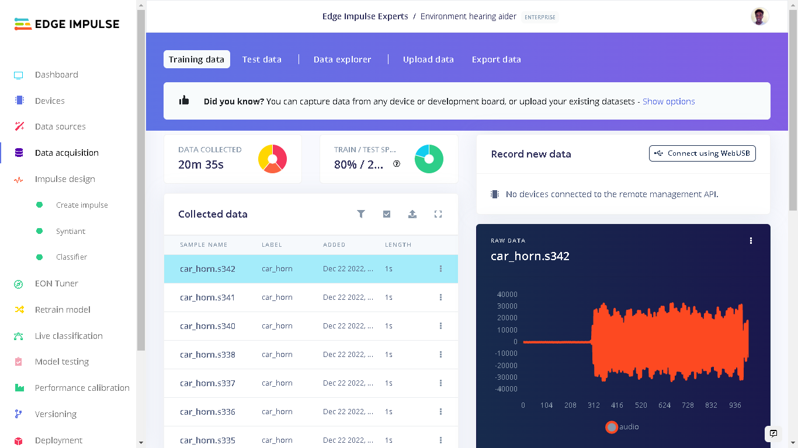

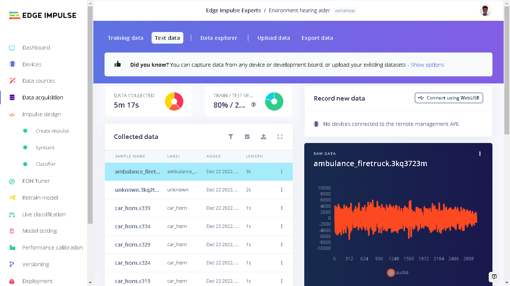

## Impulse Design

The Impulse design was very unique as I was targeting the Syntiant TinyML board.  Under "Create Impulse" I set the following configurations:

The window size is 968ms and window increase is 484ms milliseconds(ms). I then added the "Audio (Syntiant)" processing block and the "Classification" Learning block. For a detailed explanation of the Impulse Design for the Syntiant TinyML audio classification, checkout the [Edge Impulse documentation](https://docs.edgeimpulse.com/docs/tutorials/hardware-specific-tutorials/responding-to-your-voice-syntiant-rc-commands-go-stop#4.-designing-your-impulse).

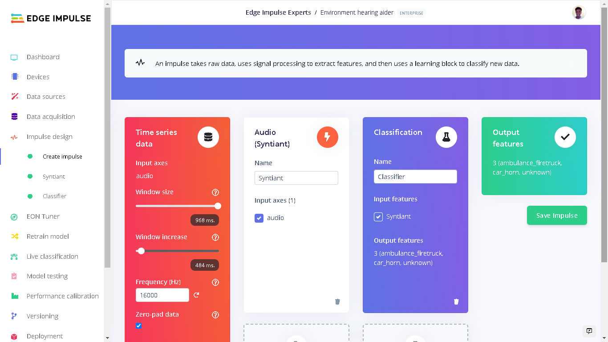

The next step was to extract Features from the training data. This is done by the Syntiant processing block. On the Parameters page, I used the default **Log Mel filterbank energy** features and they worked very well. The [Feature explorer](https://www.edgeimpulse.com/blog/visualizing-complex-datasets-in-edge-impulse) is one of the most fun options in Edge Impulse. In the feature explorer, all data in your dataset are visualized in one graph. The axes are the output of the signal processing process and they can let you quickly validate whether your data separates nicely. I was satisfied with how my features separated for each class. This enabled me to proceed to the next step, training the model.

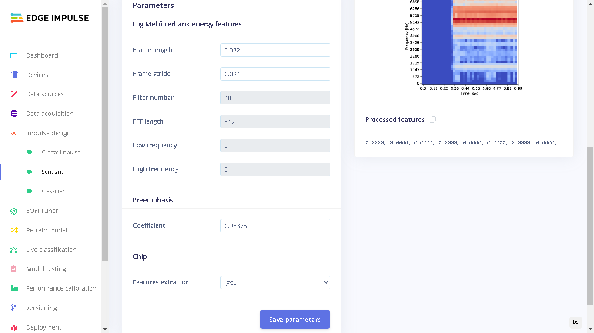

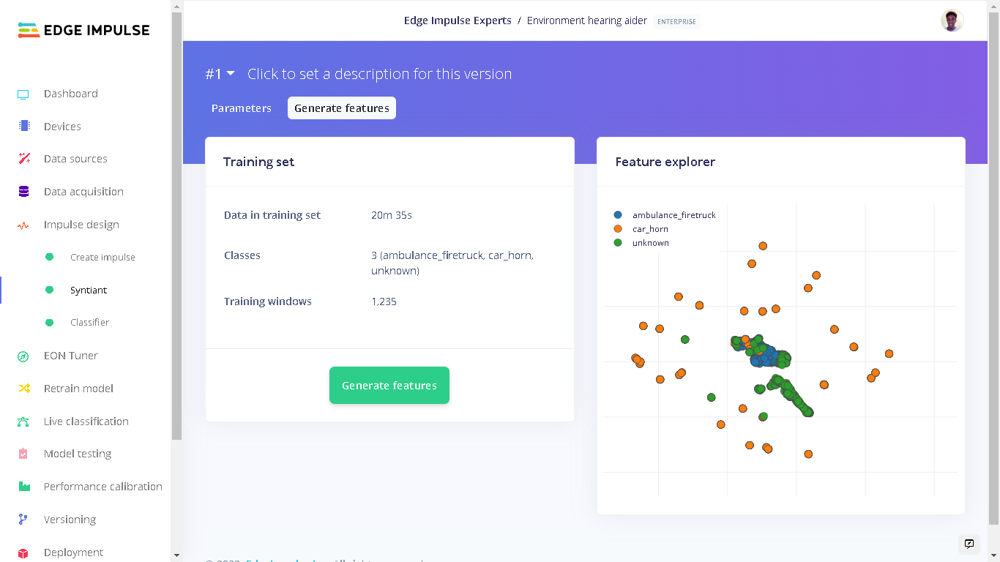

Under "Classifier" I set the number of training cycle as 100 with a learning rate of 0.0005. Edge Impulse automatically designs a default Neural Network architecture that works very well without requiring the parameters to be changed.  However, if you wish to update some parameters, Data Augmentation can improve your model accuracy. Try adding noise, masking time and frequency bands and inspect your model performance with each setting.

I then clicked “Start training” and waited for a few minutes for the training to be complete. Upon completion of the training process, I got an accuracy of 97.6%, which is pretty good!

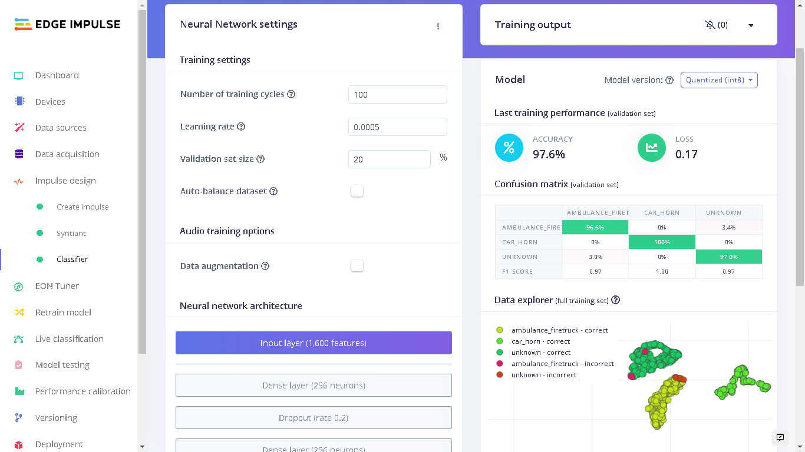

## Model Testing

When training the model, I used 80% of the data in the dataset. The remaining 20% is used to test the accuracy of the model in classifying **unseen** data. We need to verify that our model has not overfit by testing it on new data. If your model performs poorly, then it means that it overfit (crammed your dataset). This can be resolved by adding more dataset and/or reconfiguring the processing and learning blocks if needed. Increasing performance tricks can be found in this [guide](https://docs.edgeimpulse.com/docs/tips-and-tricks/increasing-model-performance).

On the left bar, we click "Model testing" then "Classify all".  The current model has a performance of 97.8% which is pretty good and acceptable. 

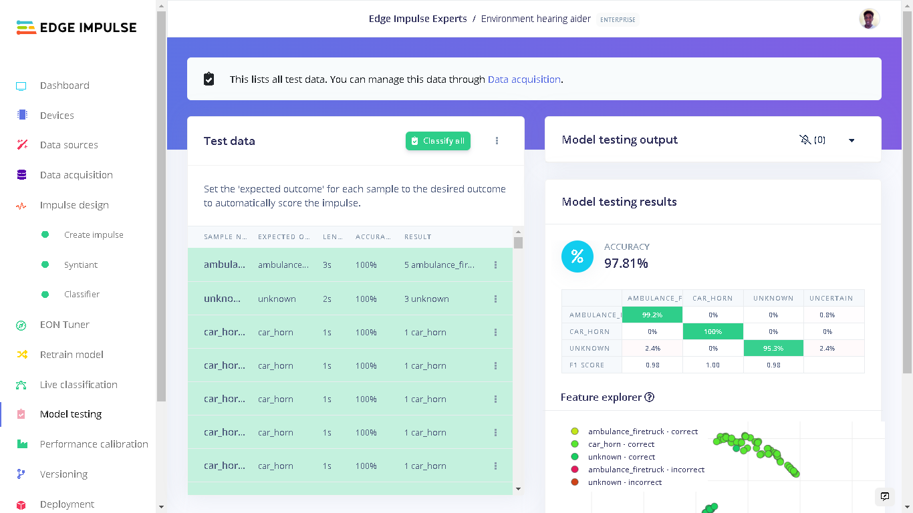

From the test data, we can see the first sample has a length of 3 seconds. I recorded this in a living room which had a computer playing siren sounds and at the same time a television was playing a movie. In each timestamp of 1 second, we can see that the model was able to predict the ambulance_firetruck class. I took this as an acceptable performance of the model and proceeded to deploy it to the Syntiant TinyML board.

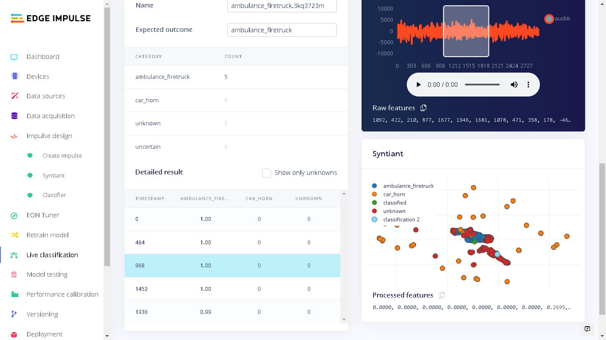

## Deploying to Syntiant TinyML Board

To deploy our model to the Syntiant Board, first click "Deployment" on the left side panel. Here, we will first deploy our model as a firmware for the board. When our audible events: ambulance_firetruck and car_horn are detected, the onboard RGB LED will turn on. When the "unknown" sounds are detected, the onboard RGB LED will be off. This firmware runs locally on the board without requiring internet connectivity and also with minimal power consumption.

Under "Build Firmware" select Syntiant TinyML.

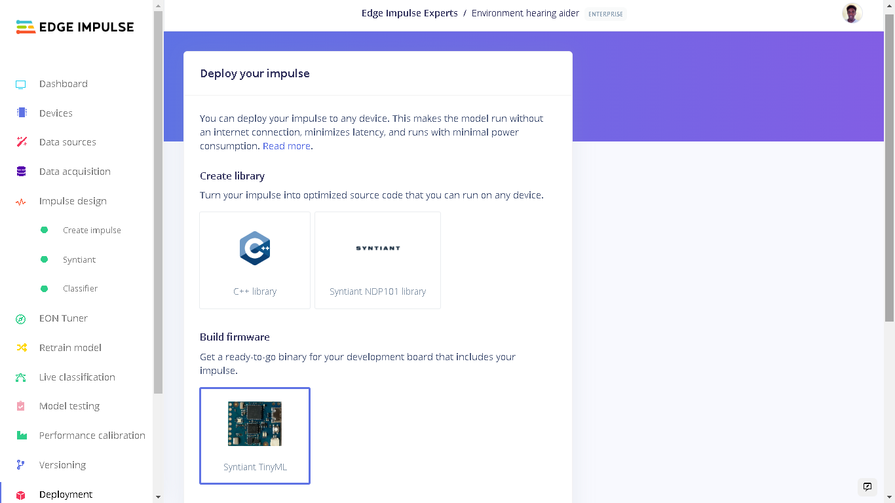

Next, we need to configure posterior parameters. These are used to tune the precision and recall of our Neural Network activations, to minimize False Rejection Rate and False Activation Rate. More information on posterior parameters can be found here [Responding to your voice - Syntiant - RC Commands](https://docs.edgeimpulse.com/docs/tutorials/hardware-specific-tutorials/responding-to-your-voice-syntiant-rc-commands-go-stop#8.-deploying-to-your-device)

Under "Configure posterior parameters" click "Find posterior parameters". Check all classes apart from "unknown", and for calibration dataset we use "No calibration (fastest)". After setting the configurations, click "Find parameters".

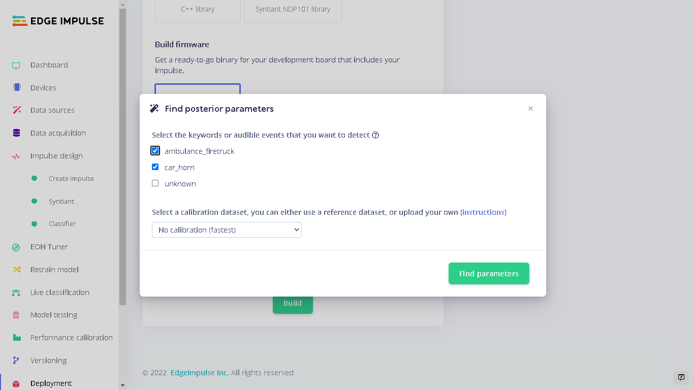

This will start a new task, so we have to wait until it is finished.

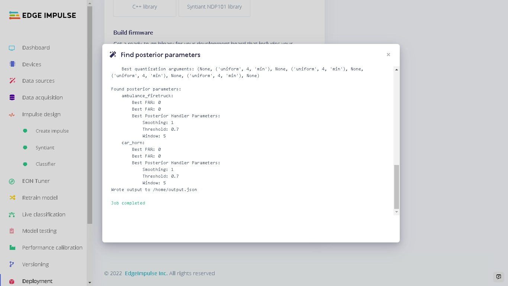

When the job is completed, close the popup window and then click "Build" option to build our firmware. The firmware will be downloaded automatically when the build job completes. 

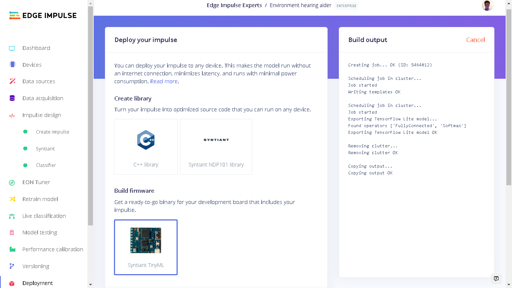

Once the firmware is downloaded, we first need to unzip it. Connect a Syntiant TinyML board to your computer using a USB cable. Next, open the unzipped folder and run the flashing script based on your Operating System.

We can connect to the board's firmware over Serial. To do this, open a terminal, select the COM Port of the Syntiant TinyML board with settings 115200 8-N-1 settings (in Arduino IDE, that is 115200 baud Carriage return). Sounds of ambulance sirens, firetruck sirens, and cars horns will turn the RGB LED red. 

For the "unknown" sounds, the RGB LED is off. In configuring the posterior parameters, the detected classes that we selected are the ones which trigger the RGB LED lighting. 

## A Smart Watch-out

After testing the model on the Syntiant TinyML board and finding that it works great, I proceeded to create a demo of the smart wearable of this project.

This involved connecting a vibration motor to GPIO 1 of the Syntiant TinyML board. When the classes "ambulance_firetruck" and "car_horn" are detected, the **GPIO 1** on the board is set **HIGH** and this causes the vibration motor to vibrate for 1500 milliseconds. Vibration motors are mostly used to give haptic feedback in mobile phones and video game controllers. They are the components that make your phone vibrate.

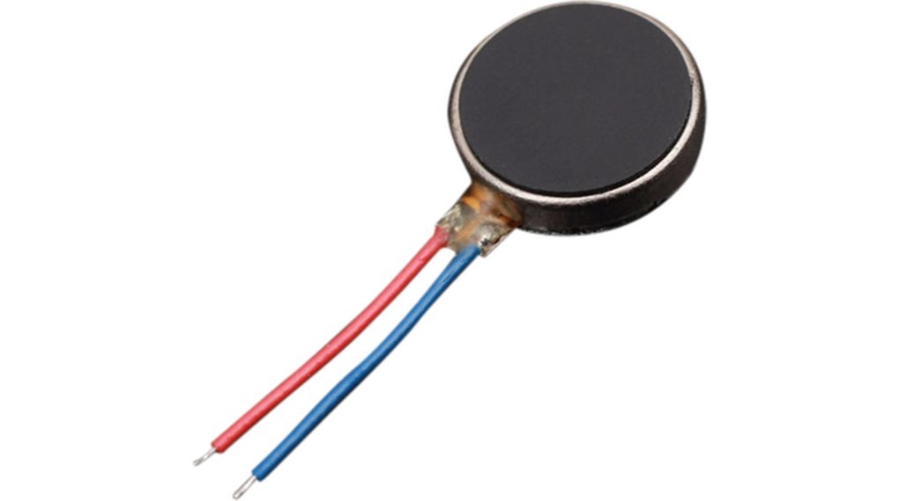

Since we cannot connect a motor directly to the GPIO pins, I used the 5V pad on the Syntiant TinyML board to power the vibration motor through a transistor that is switched by GPIO 1.

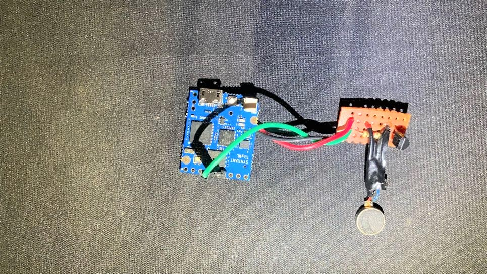

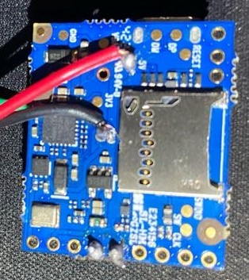

In future, we can then package these components safely into a wrist wearable. The Syntiant TinyML board has a 3.7V LiPo battery connector which will enable the wearable to be used anywhere. For this demo, I used the USB connector as the power source for all components.

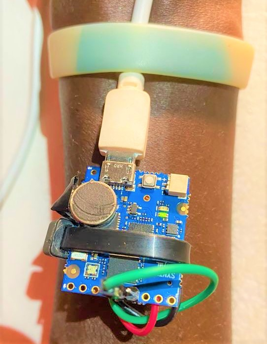

You can find the Arduino code for this use case in the GitHub repository [syntiant-tinyml-firmware-environment-hearing-aider](https://github.com/SolomonGithu/syntiant-tinyml-firmware-environment-hearing-aider). The repository has the instructions on how to install the required libraries and upload the Arduino code to the Syntiant TinyML board.

The image below shows the annotation of the Syntiant TinyML board. GPIO 1, GND and the 5V pad on the bottom side are used for this smart wearable.

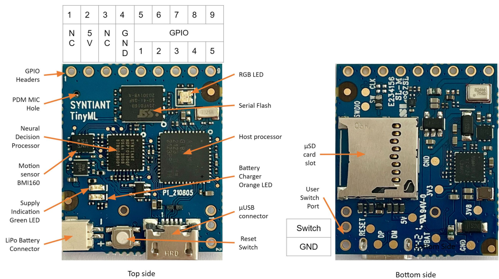

## Conclusion

This environmental audio monitor wearable is one of the many solutions that TinyML offers. A future work can be to include other sounds such as motor bikes, detect construction equipment, or alarm sounds, among others.

With Edge Impulse, developing ML models and deploying them has always been easy. The Syntiant TinyML board was chosen to deploy our model because it provides ultra-low power consumption, a fully connected neural network architecture, an onboard microphone, its tiny size, and is also fully supported by Edge Impulse.
