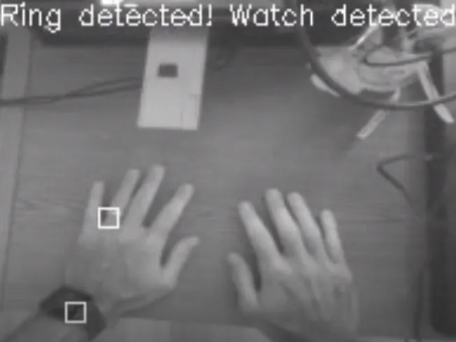
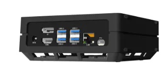
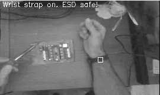
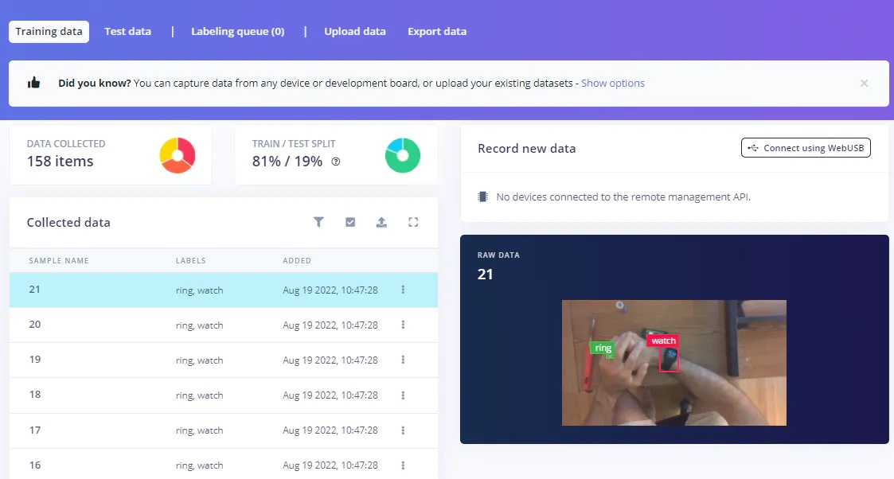
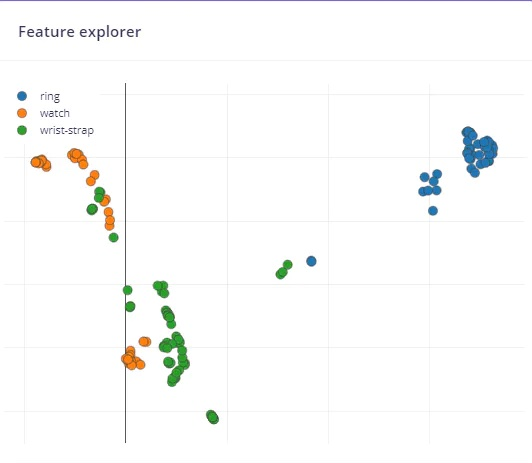
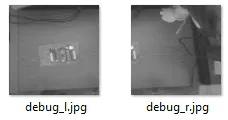
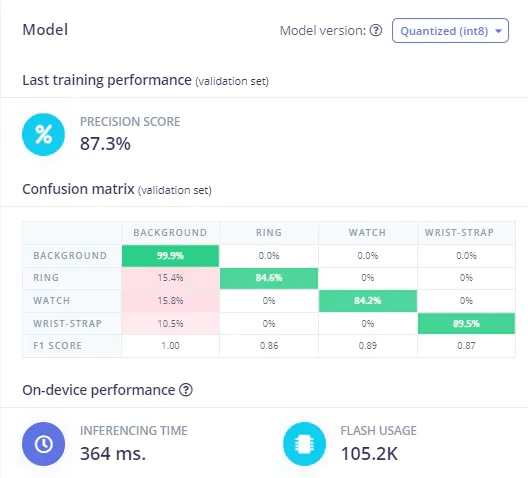
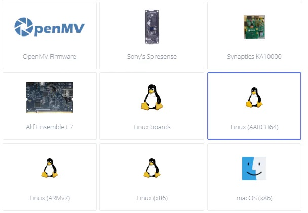

# ESD Protection Using Computer Vision on a Seeed reComputer Jetson Nano 

Created By:
Justin Lutz 

Public Project Link:
[https://studio.edgeimpulse.com/public/129799/latest](https://studio.edgeimpulse.com/public/129799/latest)

## Project Demo



## GitHub Repo

[https://github.com/jlutzwpi/SeeedRecomputerESD](https://github.com/jlutzwpi/SeeedRecomputerESD)

## Story

As part of the Edge Impulse Expert Network, Seeed Studio graciously provided some [reComputer Jetson-10-1-H0's](https://wiki.seeedstudio.com/reComputer_Jetson_Series_Initiation/) to develop sample projects and run the hardware through its paces.

The Seeed reComputer uses a Jetson Nano 4GB with 16GB eMMC (more on that later) housed in a really slick case. It already comes loaded with Jetpack 4.6 and Ubuntu 18.04 LTS and is essentially ready to go out of the box.

For my project, I volunteered to make an Electro-Static Discharge (ESD) risk identifier to prevent potential ESD failures from happening while handling electronics. ESD can result in electronics damage that is difficult to identify, and can result in failures months in the future, resulting in expensive warranty repairs or recalls for an organization.

The premise of my project is to have a camera mounted over the workbench of an electronics assembler. The camera would be connected to the Seeed Studio reComputer (either through the CSI port, or through an RTSP stream), which would be running [Edge Impulse's FOMO object detection](https://www.edgeimpulse.com/blog/announcing-fomo-faster-objects-more-objects) architecture to identify if the operator is wearing a wrist strap, and identify any foreign objects (ie rings or watches) that the operator shouldn't be wearing while handling sensitive electronics.

To tackle this project, I first took some sample videos. I started with 3 classes of objects that I wanted to identify: rings, watches, and wrist-straps. To collect data, I wrote a small Python script using OpenCV to record video of my hands (from a point of view of looking down on a workspace) with rings and without, with watches and without, and with wrist-straps and without. The videos were then spliced into images every 1 second. A really useful write-up that I leveraged was the [Advantech Edge Impulse workshop](https://github.com/edgeimpulse/workshop-advantech-jetson-nano) that I attended in December 2021. That has some great samples and tools that were instrumental in me completing the project such as extracting frames from videos and the Edge Impulse Python SDK (which I find super easy to use). Once I had the images extracted from the videos, I uploaded to the Edge Impulse tool and started tagging away.

After I was done labeling, I had about 100 samples of each class. I would certainly recommend more than this for a more robust model, but for a proof of concept this amount worked pretty well. Note: I did see some challenge differentiating between a watch and a wrist-strap because they look so similar. Much more data, and a diverse sample would help remove that challenge. Sometimes I would see the wrist-strap classified as a watch during my testing.

For my impulse, I chose images of 160x160 and used Edge Impulse's FOMO. One of the neat features of the Edge Impulse Python SDK is that you can split a video frame into 2 frames (left and right), so the frame actually becomes two 160x160 images. This worked well for a nice view of my left and right hands. I could then run both of those images in the classifier. If I was just classifying only one image, since an equal dimension image is required for FOMO, the image would have been squeezed and not able to see both hands.

The first time I tried to create a model using FOMO, the results were terrible. It turned out that I did not have enough data. I can't stress enough that more valid data is value in the accuracy of the model. Once I added more data, the F1 score of the model improved.

Once I was happy with the results, I deployed the model as a Linux binary (.eim file). The public version of my Edge Impulse project can be found [here](https://studio.edgeimpulse.com/public/129799/latest).

Once I had the model saved to Jetson reComputer, I started coding. This is where I started running into issues. Since the Jetson Nano in the reComputer only comes with a 16GB eMMC, with the standard Ubuntu and Jetpack installation I had less than 2GB of free space remaining. I found out that I couldn't even install all the dependencies of the Edge Impulse Python SDK (ie OpenCV) without running out of space. Seeed is aware of this and even has an [article on memory expansion](https://wiki.seeedstudio.com/reComputer_Jetson_Memory_Expansion/) options. I wasn't about to take the reComputer apart (I don't think an SSD expansion option is available for the reComputer 1010) and I wasn't going to attempt to move the eMMC contents to an external USB. My next best option was just to free up as much space as possible and delete anything I wouldn't be using. After removing LibreOffice and some DeepStream examples, I had enough memory to install all the dependencies and get things running. I hope there is a longer term solution with a larger capacity eMMC in the future because this issue took hours of my time to resolve.

As I mentioned before, the Edge Impulse Python SDK is really straightforward to use in my opinion. Along with the [Advantech sample code](https://github.com/edgeimpulse/workshop-advantech-jetson-nano/tree/main/code_samples/inference) that I mentioned earlier, I really had a great framework in place. If Edge Impulse and Advantech offer the course again this year, I highly recommend taking it.

I coded options to read in live video from the attached CSI camera, or streaming via RTSP. Both options worked well for me. I had a third option for reading in video files for testing archived video. I had some minor issues getting camera drivers working (nanocamera ended up working for me) but once I was through those, it was really fun and straightforward. You can see a couple videos below.





This project was a lot of fun. I have worked with the Jetson Nano for a little over a year and if you can make it through driver and dependency issues (they seem to pop up on every project I use a Nano) it's really powerful and fun to use. I haven't even used DeepStream or any of the NVIDIA tools yet so I look forward to trying that out some day.

The memory limitations were unfortunate and took up a bit of my time, and I hope that gets resolved in the future. I even had to do my development off the Nano because I didn't have enough space to install VS Code (my IDE of choice). Not a show-stopper by any means, this is still a very capable piece of hardware.

I think this project could be further expanded in the future. You could add a Twilio interface to text a supervisor if an ESD risk is present. Different types of objects could be classified (maybe ensuring an ESD smock is worn?) and what I'm more excited about is [FOMO-AD](https://mobile.twitter.com/janjongboom/status/1575530285814362112) (the AD stands for Anomaly Detection), announced at [Edge Impulse Imagine 2022](https://edgeimpulse.com/imagine). It won't be ready until 2023 but I think there is a lot of opportunity to use that technology for recognizing what is right and what is not right in an image. I'm exciting to test its capabilities!

Thank you again to Seeed Studio for providing the hardware for me to work on. I hope to do more projects with this equipment in the future. Happy coding!
