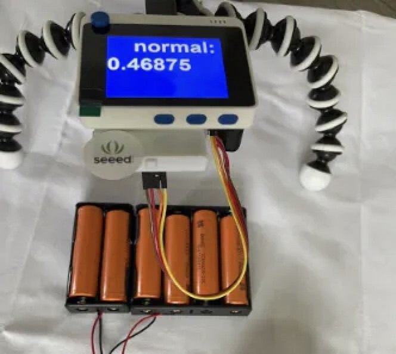

# Faulty Lithium-Ion Cell Identification in BMS Packs 

Created By:
Manivannan Sivan 

Public Project Link:

A working demo of my prototype is added in the YouTube link below.

## Faulty Lithium ion Cell BMS Pack

This prototype uses a Wio Terminal and Edge Impulse to predict overheated faulty cells in a BMS pack. For this project, I used an MLX 90640 Thermal Camera with the Wio Terminal to collect the thermal data of a BMS pack.

## Problem Statement

In an existing BMS pack, a temperature sensor is integrated with each cell pack, consiting of 14 cells, for identifying an overheated cell pack. But there is no system to identify an individual faulty cell that is overheating in a BMS pack.

 - Only one temperature sensor is deployed to detect the overall temperature of battery packs (14 * Li-ion Cells).
 - Identifying the individual cell temperature is challenging due to infrastructure cost for a BMS pack.
 
Cost for deploying Temperature sensor for each cell: 

 - Number of cells in BMS pack:  112 
 - Cost of Temperature sensor:   500 INR ($0.75 USD)
  
 - Total cost:                   112 * 500 INR =  56,000 INR ($760 USD) *approx 
 
Additionally, there is no interface support in a microcontroller to support 112 individual temperature sensor readings. 
 
## Solution using TinyML model
 

I have developed a prototype by using the MLX90640 thermal camera and Wio Terminal to collect the thermal data of the BMS pack and uploaded the data sets (Label: Faulty Battery 1.....6 and "Normal" to Edge Impulse).

## Hardware Setup

In this prototype, 6 lithium-ion cells are connected to the load (Rheostat) and the MLX90640 and Wio Terminal are attached to the stand where the MLX90640 thermal camera is facing downwards over the lithium-ion cells.

## Alogorithm

The MLX90640 sends 32x24 thermal data to the Wio Terminal through I2C. Since this project focuses on identifying an overheated cell in the pack, I have used simple filtering logic to filter out the normal cell temperature by setting it to zero. 

Upload the datasets created for this project from the below link. 

Go to Edge Impulse -> Data acquisition and then the Uploader option to upload the datasets.

If you want to develop new datasets from scratch, flash the below code to the Wio Terminal using the Arduino IDE. For that, you need to configure Wio Terminal setup in the Arduino IDE. Please follow this link to get setup: [https://wiki.seeedstudio.com/Wio-Terminal-Getting-Started/](https://wiki.seeedstudio.com/Wio-Terminal-Getting-Started/)

This code will print the thermal data in array format, later it can be converted to .csv format as mentioned in the above datasets. Ideally the .csv data looks like this: 

Once the datasets are uploaded, then in the "Create impulse" section change the Window size to 768 ( 24*32 = 768 ).

Next, in Feature Explorer, we can see the generated raw features of thermal data.

## Neural Network Configuration

I have used reshape to change the 1D data to 2D data with 24 columns (due to placement of the thermal camera) , in some cases it might be 32 to get the best accuracy. 

Then I have included couple of 2D conversion layers with pool layers, followed by a Flatten layer. Then 2 DNN (30 neurons , 10 neurons) in sequential is used.

## Deployment

In the Deployment section , select Arduino code and download the firmware package.
 
Then add the Zip file as a Library in Arduino IDE.

Once it is added, download the final application code from [this GitHub link](https://github.com/Manivannan-maker/FaultyCellIdentification), and flash it to the Wio Terminal.

## Output

In a model training, 100% accuracy is achieved, and in model testing 87.5% accuracy is achieved. 

## Summary 

xxx

