# Fire Detection Using Sensor Fusion and TinyML

Created By:
Nekhil R. 

Public Project Link:
[https://studio.edgeimpulse.com/public/160533/latest](https://studio.edgeimpulse.com/public/160533/latest)

## Story

In order to properly identify a fire situation, a fire detection system needs to be accurate and fast. However, many  commercial fire detection systems use simple sensors, so their fire recognition accuracy can be reduced due to the limitations of the sensor's detection capabilities. Existing devices that use rule-based algorithms or image-based machine learning might be unable to adapt to changes in the environment because of their static features.

In this project, we will develop a device that can detect fire by means of sensor fusion and machine learning. The combination of sensors will help to make more accurate predictions about the presence of fire, versus single-sensor monitoring. We will collect data from sensors such as temperature, humidity, and pressure in various fire situations and extract features to build a machine-learning model to detect fire events.

## Data Collection
 
To make this project a reality, we are using an Arduino Nano 33 BLE Sense with Edge Impulse. For data collection, there are two ways to get data samples into the Edge Impulse platform: either through the Edge Impulse CLI, or through a web browser logged into the Edge Impulse Studio.

To ensure your Arduino Nano 33 is properly connected to Edge Impulse, you can [follow the Getting Started Guide](https://docs.edgeimpulse.com/docs/development-platforms/officially-supported-mcu-targets/arduino-nano-33-ble-sense) that shows how to connect the Nano 33 and reach a point where you are ready to upload your data.

Collecting data through the web browser is simple and straightforward. To do this, connect the device to your computer and open the Edge Impulse Studio. Press the **Connect Using WebUSB** button, and select your development board. The limitation of using the web serial integration is that it only works with development boards that have full Edge Impulse support.

The data collection settings for our project are shown below. Using temperature, humidity and pressure as environmental sensors is a good choice, as they are the parameters that change the most in case of fire events. Also, the sampling rate of 12.5 Hz is appropriate as these parameters are slow-moving.

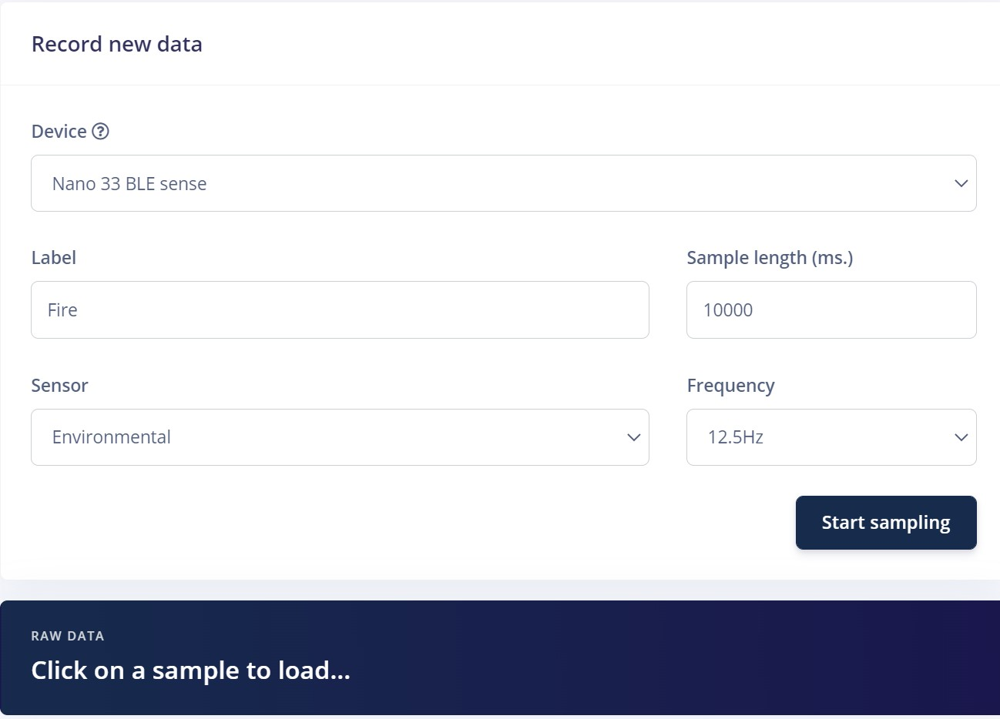

We have only two classes in this project: **No Fire** and **Fire**. For the **No Fire** case, we collected data at different points in the room. For capturing the **Fire** data, we built a fire using a camp-like setup in my backyard. To make our model robust, we collected data at different points in the area.

13 minutes of data are collected for two labels and split between Training and Testing datasets. Once the data is uploaded, Edge Impulse has a tool called **Data Explorer** which gives you a graphical overview of your complete dataset.

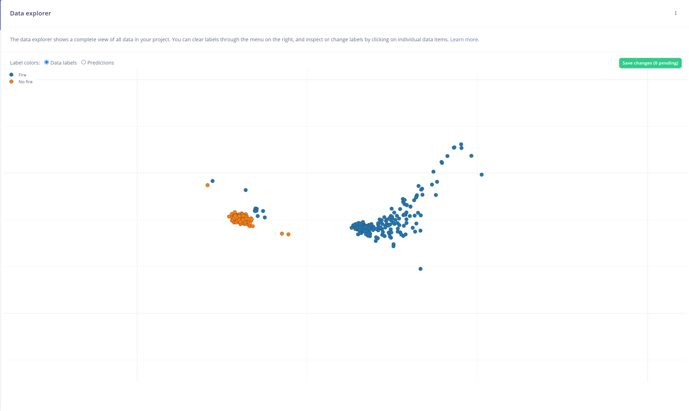

This tool is very useful for quickly looking for outliers and discrepancies in your labels and data points.

# Impulse Design 
 
This is our machine learning pipeline, known as an **Impulse**

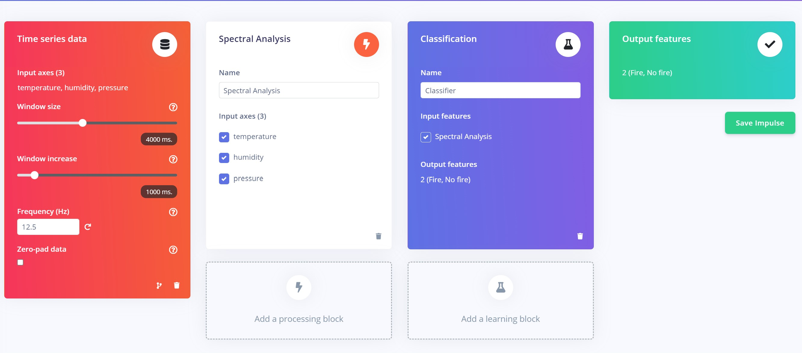

For the Processing block we used **Spectral analysis** and for the Learning block we used **Classification**. Other options such as **Flatten** and **Raw Data** are also available as Processing blocks. Each Processing block has it's features and uses, if you need to dive into that, you can find [information covering each of them here](https://docs.edgeimpulse.com/docs/edge-impulse-studio/processing-blocks).

These are our Spectral Analysis parameters of **Filter** and **Spectral power**.  We didn't use any filter for the raw data.

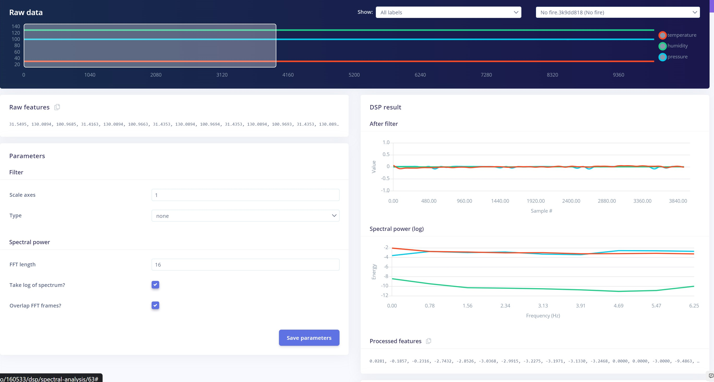

The below image shows the **Generated features** for the collected data, and we can see that the data is well separated and distinguishable. As you can notice in the case of **Fire** event, there are actually three clusters of data and it shows the parameters are changing at different points.

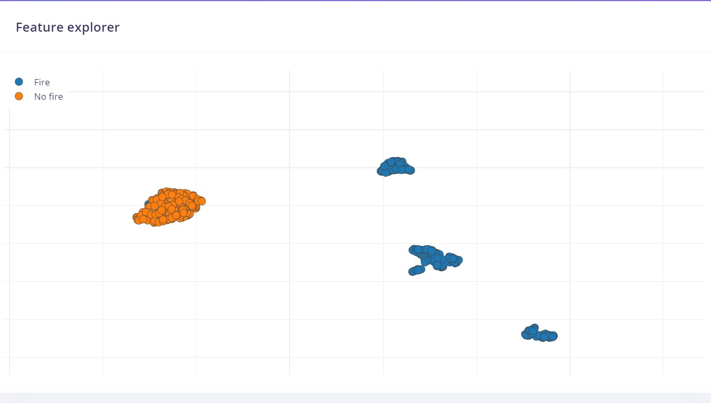

## Model Training

After successfully extracting the features from the DSP block, it's time to train the machine learning model.

Here are our Neural Network settings and architecture, which work very well for our data.

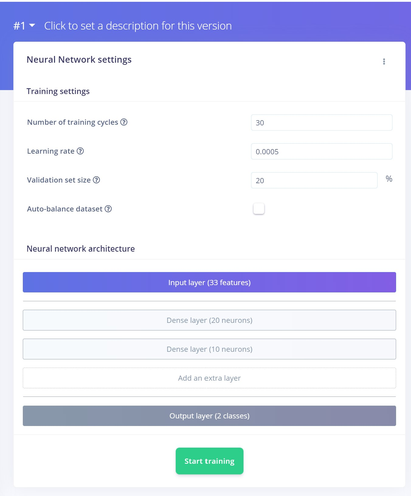

To learn more about the individual effect these parameters have on your model, you can [refer to this documentation](https://docs.edgeimpulse.com/docs/edge-impulse-studio/learning-blocks/classification). This could require a bit of trial and testing to find the optimal settings.

After training, we achieved 98% validation accuracy for the data, so the model seems to be working well. 

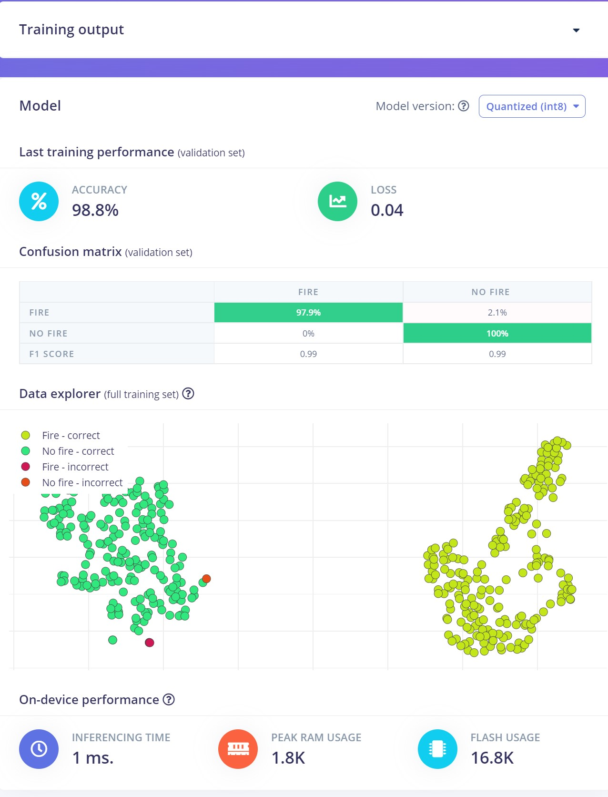

The **Confusion matrix** is a great tool for evaluating the model, as you can see below, 2.1% of the data samples are misclassified as **No Fire**.

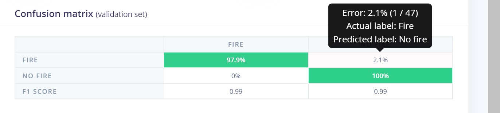

By checking the **Feature explorer** we can easily identify the samples which are misclassified. It also shows the time at which the incorrect classification happened. Here is one example.

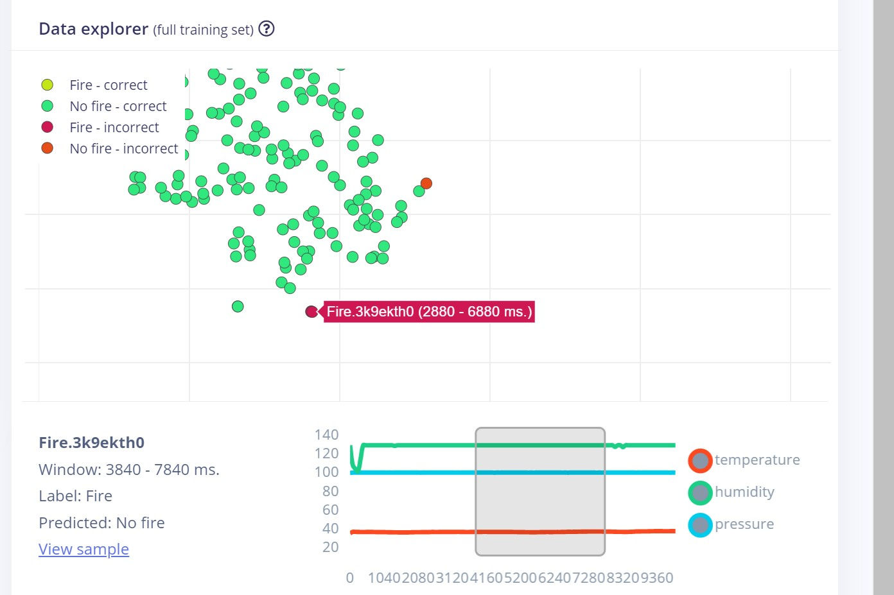

This machine learning model seems to be working well enough for our project, so let's see how our model performs on unseen data.

# Model Testing  

When collecting data, some data is set aside and not used in the Training process. This is called **Test data**, and we can use it now to check how our model performs on unseen data.

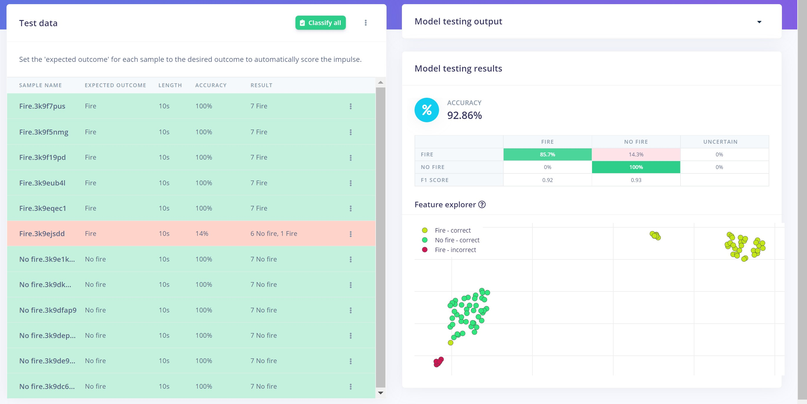

The Confusion matrix and Feature explorer show that our model performs very well.

## Live Classification

Now let's test the model with some real-world data. For that we need to move onto the **Live Classification** tab and connect our Arduino using WebUSB once again.

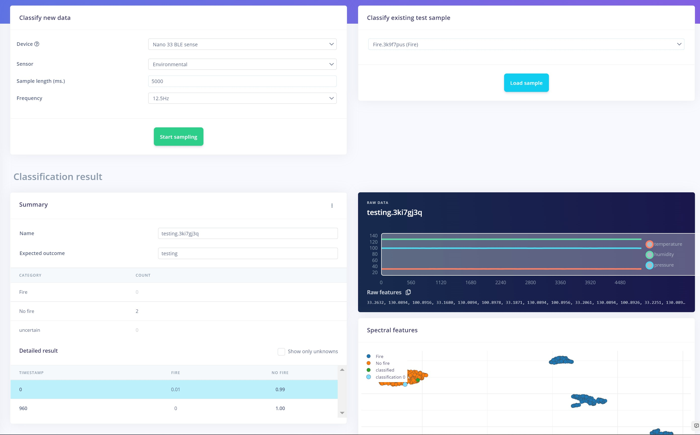

The above sample was recorded the when there is no fire present, and the below sample is recorded when there is a fire.

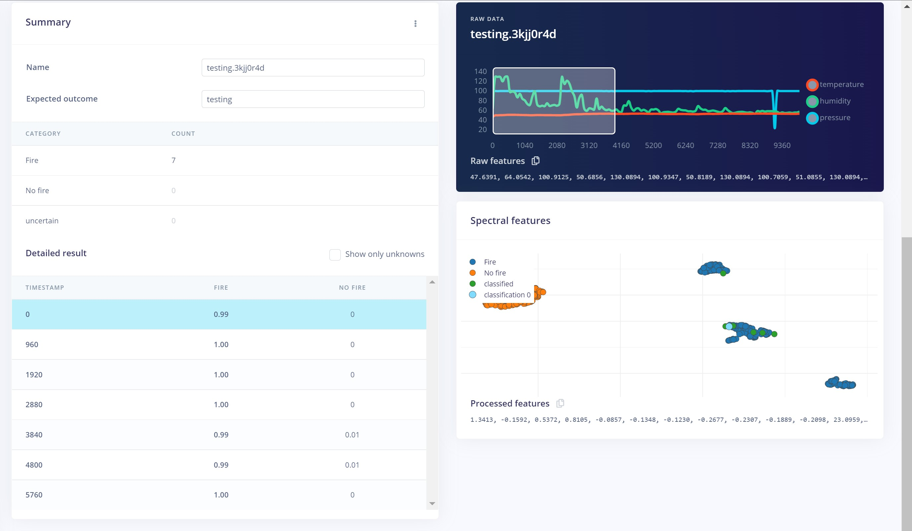

It looks like real-world data of **No Fire** and **Fire** events are well classified, so our model is ready for deployment onto the Arduino.

## Deployment   

We deployed our model to the Arduino Nano 33 BLE Sense as an Arduino library.  More information on the various deployment options [are located here](https://docs.edgeimpulse.com/docs/edge-impulse-studio/deployment), but as we wanted to build some additional capabilities for alerting and notifications, we decided on using the Arduino library download option.

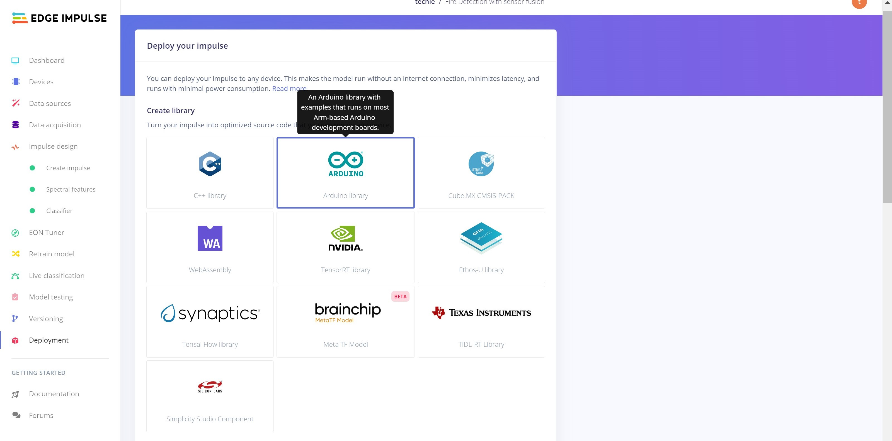

## Push Notification

As mentioned, we built a feature that will send a notification to a user if a **Fire** event detection (Classification) is detected. For sending a push notification to a user, we used the [IFTTT service](https://ifttt.com/). Please refer this [tutorial](https://www.youtube.com/watch?v=MXqWt7oK4JY) to build your own version.

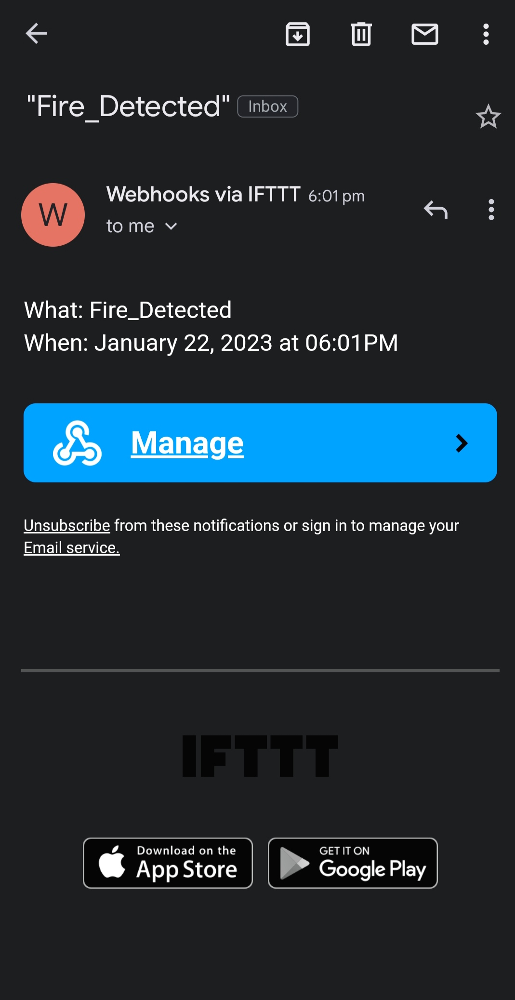

## Hardware   

The complete hardware unit consists of the Arduino Nano 33 BLE Sense, power adapter, and an ESP-01. The ESP-01 is used to add WiFi connectivity to the Arduino. This component handles sending email alerts over a designated WiFi connection. This occurs via serial communication between the Arduino and ESP-01. In order to establish this communication, we first need to upload the necessary code to both the ESP-01 and the Arduino, which can be found in the GitHub repository linked below. Afterwards, we connected the components according to this schematic:

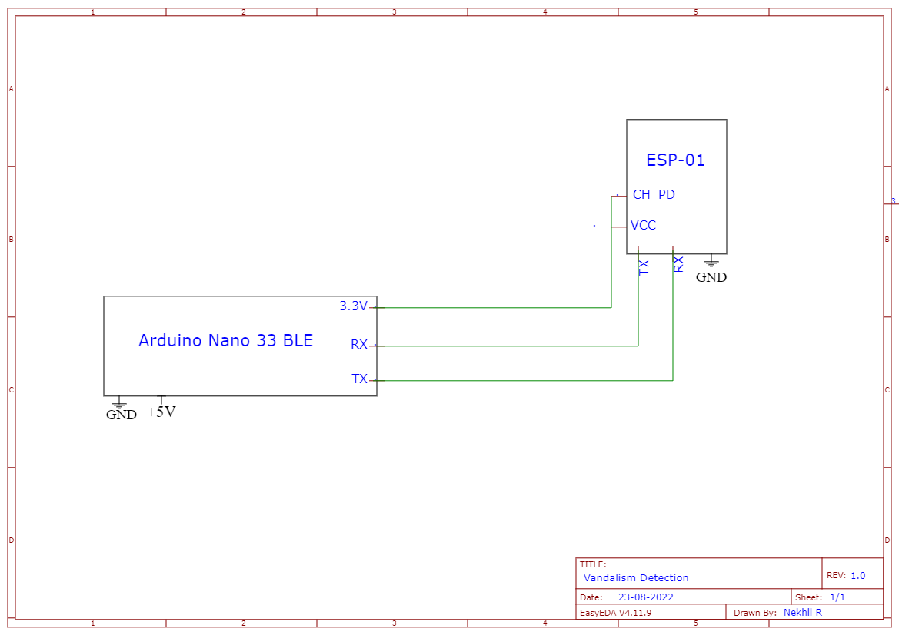

This is the final hardware setup for the project:

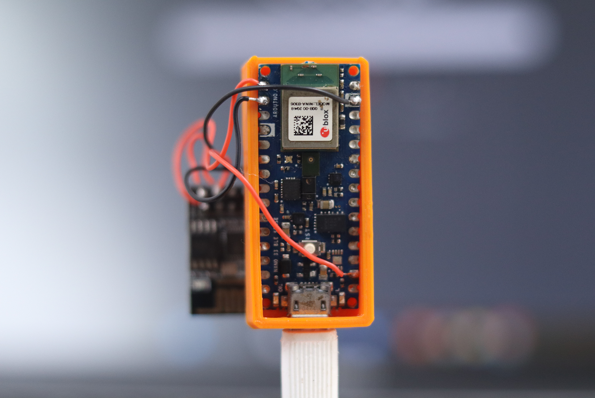

## Code   

The entire assets for this project are given in this [GitHub repository](https://github.com/CodersCafeTech/Fire-Detection-by-Sensor-Fusion).

