# Porting a Gesture Recognition Project from the SiLabs Thunderboard Sense 2 to xG24 

Created By:
Mithun Das 

Public Project (to Clone):
[https://studio.edgeimpulse.com/public/147925/latest](https://studio.edgeimpulse.com/public/147925/latest)

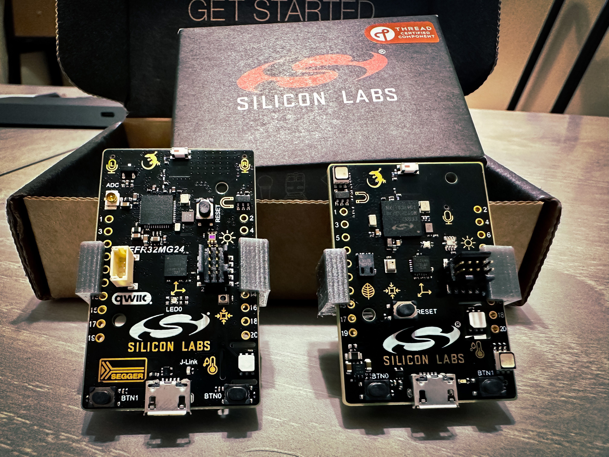

## Intro

In this project I am not going to explore or research a new TinyML use-case, rather I'll focus on how we can reuse or extend Edge Impulse Public projects for a different microcontroller.

[Manivannan Sivan](https://www.hackster.io/manivannan) had created a project ["Patient Communication with Gesture Recognition"](https://docs.edgeimpulse.com/experts/machine-learning-prototype-projects/patient-gesture-recognition) which is a wearable device running a tinyML model to recognize gesture patterns and send a signal to a mobile application via BLE. Check out his work for more information.

In this project, I am going to walk you through how you can clone his Public Edge Impulse project, deploy to a SiLabs Thunderboard Sense 2 first, test it out, and then build and deploy to the newer SiLabs xG24 device instead.


## Installing Dependencies

Before you proceed further, there are few other software packages you need to install.

- Edge Impulse CLI - Follow [this link](https://docs.edgeimpulse.com/docs/edge-impulse-cli/cli-installation) to install necessary tooling to interact with the Edge Impulse Studio.
- Simplicity Studio 5 - Follow [this link](https://www.silabs.com/developers/simplicity-studio) to install the IDE
- Simplicity Commander - Follow [this link](https://community.silabs.com/s/article/simplicity-commander?language=en_US) to install the software. This will be required to flash firmware to the xG24 board.
- LightBlue - This is a mobile application. Install from either Apple Store or Android / Google Play. This will be required to connect the board wirelessly over Bluetooth.

## Clone And Build

If you don't have an Edge Impulse account, signup for free and log into [Edge Impulse](https://studio.edgeimpulse.com/). Then visit the below [Public Project](https://docs.edgeimpulse.com/docs/edge-impulse-studio/dashboard#1.-showcasing-your-public-projects-with-markdown-readmes) to get started.

[https://studio.edgeimpulse.com/public/147925/latest](https://studio.edgeimpulse.com/public/147925/latest)

Click on the "Clone" button at top-right corner of the page.

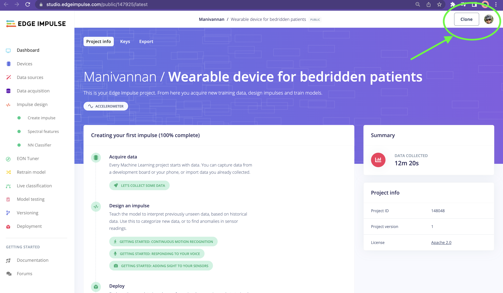

That will bring you to the below popup modal. Enter a name for your project, and click on the "Clone project" button.

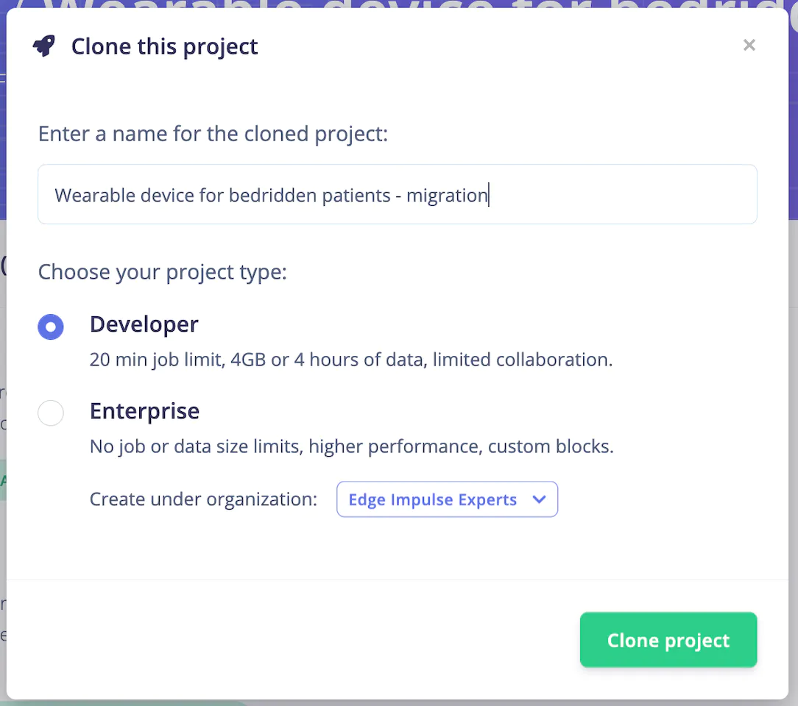

The project will be duplicated from Mani, into your own Edge Impulse Studio. You can verify by looking at the project name you entered earlier. Now if you navigate to "Create impulse" from left pane, you will notice how the model was created originally.

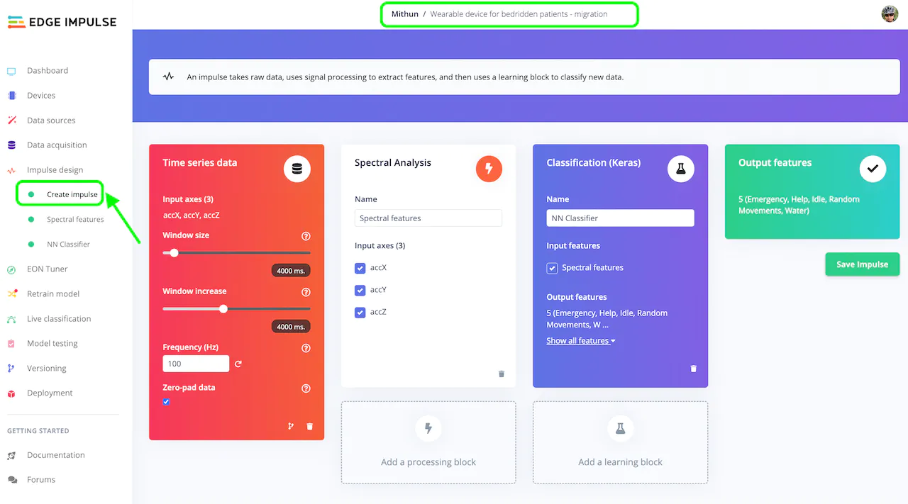

As you can see, the model was created based on 3-axis accelerometer data. The Window size was set as 4s and window increase was set to 4s as well, which ensures there is no overlap. That means if the input data is of 20s, there will be 5 samples from that data. Spectral Analysis was selected as Digital Signal Processing and Keras was selected for the Learning block.


Next, navigate to "Retrain model" from the left menu and click on "Start training". At this point, you may like to collect more data and train the model with your own gesture movement, or add additional gestures.

Follow this [Thunderboard Sense 2 documentation](https://docs.edgeimpulse.com/docs/development-platforms/officially-supported-mcu-targets/silabs-thunderboard-sense-2) to connect your board to the Edge Impulse Studio and capture data. Once you are done with collecting additional data, retrain the model.

## Deploy And Test

Navigate to the "Deployment" page from the left pane, select "SiLabs Thunderboard Sense 2" under "Build firmware", then click on the "Build" button, which will build your model and download a `.bin` file used to flash to the board.

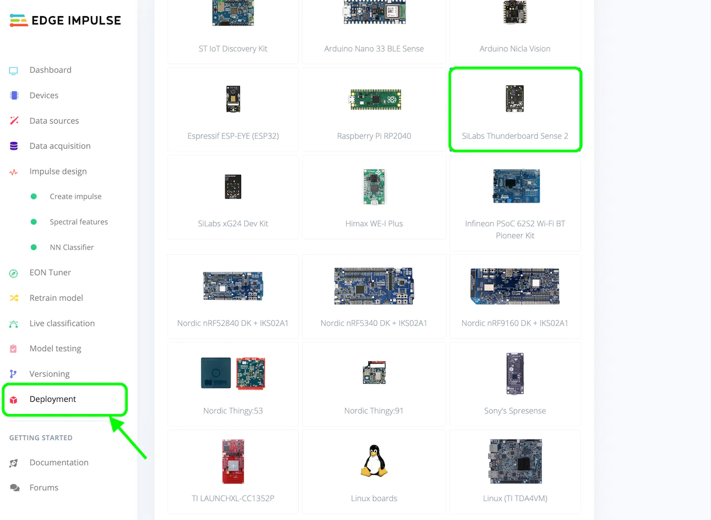

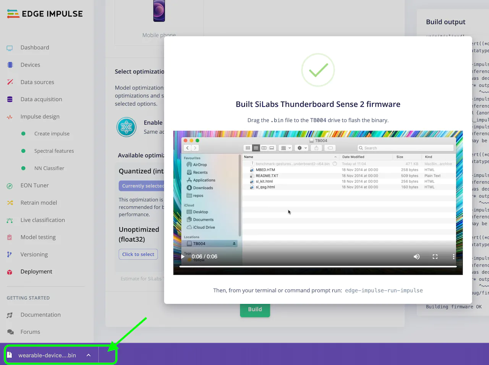

If not already connected, connect the Thunderboard Sense 2 to your computer via a USB cable. You should see a drive named `TB004` appear. Drag and drop the `.bin` file downloaded in the previous step to the drive. If you see any errors like below, you'll need to use "Simplicity Studio 5" to flash the application instead.

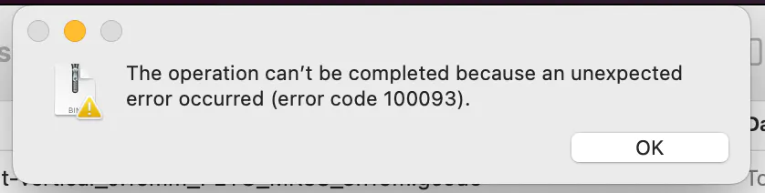

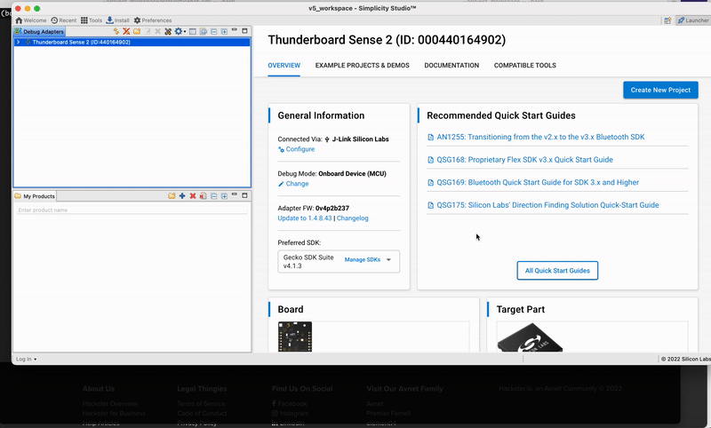

The LEDs on the Thunderboard will flash, indicating the firmware has been updated on the board. Open the LightBlue app, and scan for devices. You should see a device named "Edge Impulse", go ahead and connect to that. Then tap on the "0x2A56" characteristic, then "Listen for notifications". Change the format from "Hex" to "UTF-8 String".

Then, back on the computer, open a Terminal and run the below command, which will start inferencing on the board.

```
edge-impulse-run-impulse
```

Alternatively, you can write a boolean `1` to the characteristic to start the inference on the board. Checkout the .gif for how to do it on an xG24:


Then move your finger to create the gesture pattern that you trained, and you should see a notification on your phone.

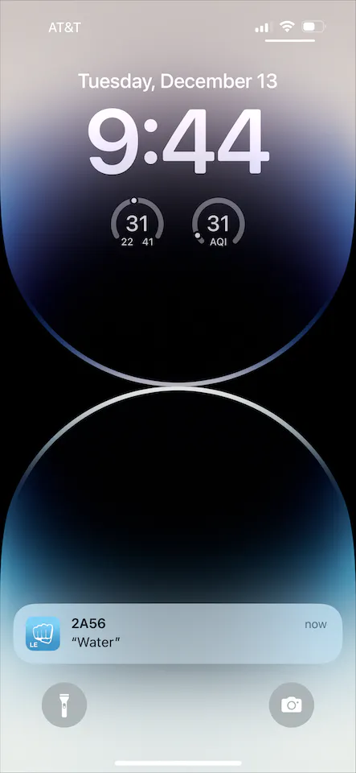

Well, now you have learned how to clone a Public Edge Impulse project, capture more data, and deploy to a Thunderboard Sense 2 directly.

## Deploy To xG24 Dev Kit

Now, we will explore how we can deploy the same model on Silabs xG24 hardware instead.

Actually, you can deploy the model straight to an xG24 without making any changes to the model itself. You only need to revisit the "Deployment" tab in the Edge Impulse Studio, select "SiLabs xG24 Dev Kit" under Build firmware, and Build.

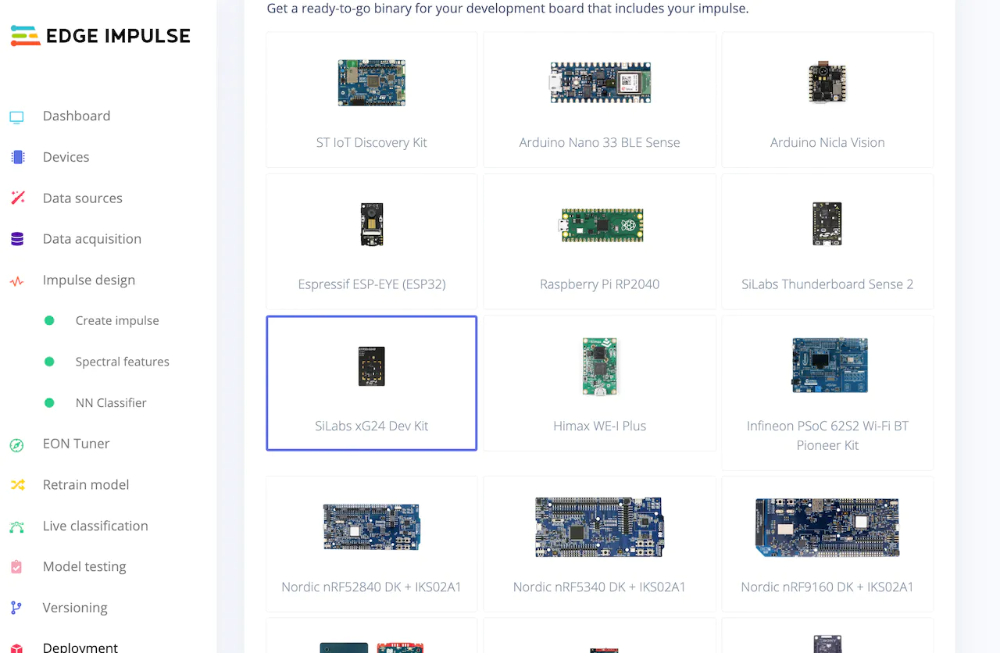

This will download a .zip file containing a `.hex` file and instructions.

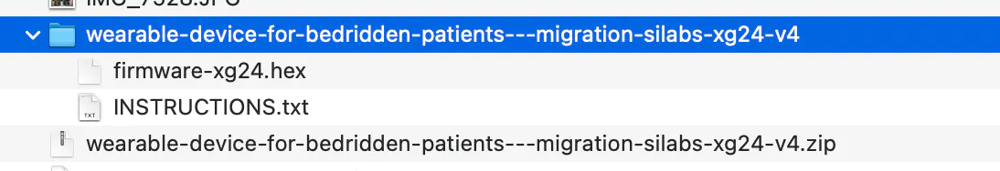

Now you can use Simplicity Studio 5 to flash the `.hex` file to the xG24 as shown before, or use Simplicity Commander. You can read more about Commander [here](https://docs.edgeimpulse.com/docs/development-platforms/officially-supported-mcu-targets/silabs-xg24-devkit).

Once the flashing is done, again use the LightBlue app to connect to your board, and test gestures once again as you did for the Thunderboard Sense 2.


If all goes well, your same gestures should be recognized and inferencing is performed on the xG24 in the same manner as the Thunderboard Sense 2, with no additional model training or dataset manipulation needed! This makes upgrading existing projects from the Thunderboard to the xG24 extremely simple. 

One final note is that in this project, the xG24 is roughly twice as fast as the Thunderboard Sense 2 running the same model:

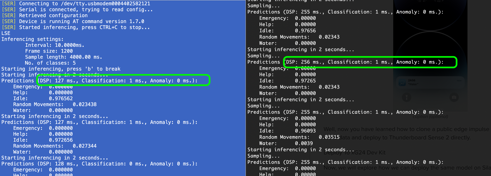

Hopefully this makes upgrading your SiLabs projects easier!


